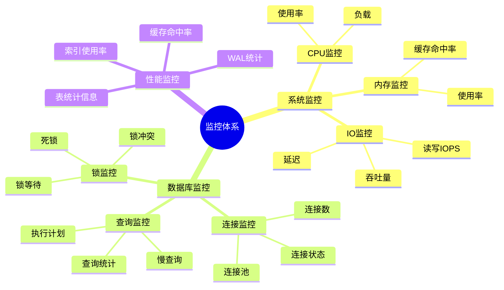
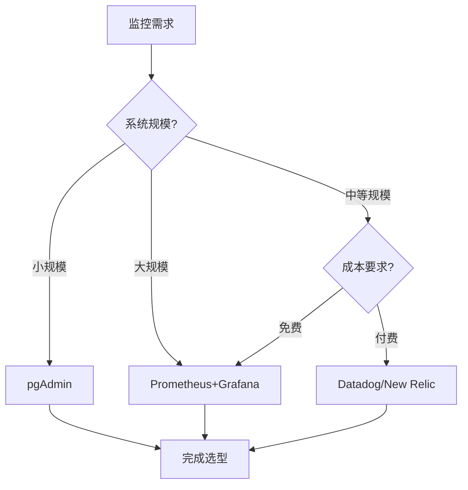
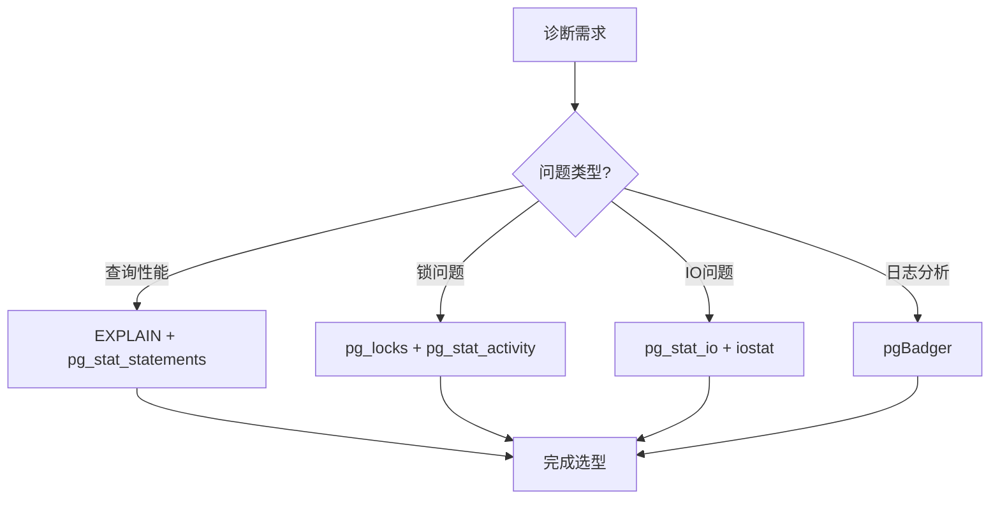

# PostgreSQL监控与诊断深度应用指南

## 元数据

- **文档版本**: v1.0
- **创建日期**: 2025-01
- **技术栈**: PostgreSQL 17+/18+ | 监控 | 诊断 | 性能分析 | 告警
- **难度级别**: ⭐⭐⭐⭐⭐ (专家级)
- **预计阅读**: 180分钟
- **前置要求**: 熟悉PostgreSQL基础、监控基础、性能调优基础

---

## 📋 完整目录

- [PostgreSQL监控与诊断深度应用指南](#postgresql监控与诊断深度应用指南)
  - [元数据](#元数据)
  - [📋 完整目录](#-完整目录)
  - [1. 监控与诊断概述](#1-监控与诊断概述)
    - [1.1 监控体系](#11-监控体系)
      - [监控体系思维导图](#监控体系思维导图)
    - [1.2 诊断体系](#12-诊断体系)
      - [诊断体系决策矩阵](#诊断体系决策矩阵)
  - [2. 监控指标选型决策](#2-监控指标选型决策)
    - [2.1 关键指标场景](#21-关键指标场景)
      - [2.1.1 场景描述](#211-场景描述)
      - [2.1.2 关键指标实现](#212-关键指标实现)
      - [2.1.3 性能论证](#213-性能论证)
    - [2.2 阈值设置场景](#22-阈值设置场景)
      - [2.2.1 场景描述](#221-场景描述)
      - [2.2.2 阈值设置实现](#222-阈值设置实现)
      - [2.2.3 效果论证](#223-效果论证)
    - [2.3 告警策略场景](#23-告警策略场景)
      - [2.3.1 场景描述](#231-场景描述)
      - [2.3.2 告警策略实现](#232-告警策略实现)
      - [2.3.3 效果论证](#233-效果论证)
  - [3. 性能诊断场景分析](#3-性能诊断场景分析)
    - [3.1 慢查询诊断场景](#31-慢查询诊断场景)
      - [3.1.1 场景描述](#311-场景描述)
      - [3.1.2 慢查询诊断实现](#312-慢查询诊断实现)
      - [3.1.3 性能论证](#313-性能论证)
    - [3.2 锁等待诊断场景](#32-锁等待诊断场景)
      - [3.2.1 场景描述](#321-场景描述)
      - [3.2.2 锁等待诊断实现](#322-锁等待诊断实现)
      - [3.2.3 性能论证](#323-性能论证)
    - [3.3 IO瓶颈诊断场景](#33-io瓶颈诊断场景)
      - [3.3.1 场景描述](#331-场景描述)
      - [3.3.2 IO瓶颈诊断实现](#332-io瓶颈诊断实现)
      - [3.3.3 性能论证](#333-性能论证)
  - [4. 监控架构设计场景](#4-监控架构设计场景)
    - [4.1 监控工具选型](#41-监控工具选型)
      - [4.1.1 场景描述](#411-场景描述)
      - [4.1.2 工具选型实现](#412-工具选型实现)
      - [4.1.3 选型论证](#413-选型论证)
    - [4.2 监控架构设计](#42-监控架构设计)
      - [4.2.1 场景描述](#421-场景描述)
      - [4.2.2 架构设计实现](#422-架构设计实现)
      - [4.2.3 架构论证](#423-架构论证)
  - [5. 诊断工具对比与应用场景](#5-诊断工具对比与应用场景)
    - [5.1 诊断工具对比](#51-诊断工具对比)
      - [5.1.1 工具对比分析](#511-工具对比分析)
      - [5.1.2 工具选型决策](#512-工具选型决策)
  - [6. 综合选型案例](#6-综合选型案例)
    - [6.1 案例1：大规模系统监控架构设计](#61-案例1大规模系统监控架构设计)
    - [6.2 案例2：性能问题诊断流程](#62-案例2性能问题诊断流程)
  - [📚 参考资源](#-参考资源)
    - [官方文档](#官方文档)
    - [相关文档](#相关文档)
  - [📝 更新日志](#-更新日志)

---

## 1. 监控与诊断概述

### 1.1 监控体系

监控体系是PostgreSQL运维的基础，包括系统监控、查询监控、锁监控等。

#### 监控体系思维导图



### 1.2 诊断体系

#### 诊断体系决策矩阵

| 诊断类型 | 诊断工具 | 诊断时间 | 准确度 | 适用场景 |
|---------|---------|---------|--------|---------|
| **慢查询诊断** | EXPLAIN, pg_stat_statements | 5分钟 | 高 | 查询性能问题 |
| **锁等待诊断** | pg_locks, pg_stat_activity | 2分钟 | 很高 | 锁冲突问题 |
| **IO瓶颈诊断** | pg_stat_io, pg_stat_get_backend_io(), iostat | 3分钟 | 高 | IO性能问题（PostgreSQL 18增强：read_bytes/write_bytes列） |
| **性能诊断** | EXPLAIN (ANALYZE, BUFFERS, SETTINGS) | 2分钟 | 很高 | 查询性能问题（PostgreSQL 18增强：即时诊断） |
| **并行查询分析** | pg_stat_statements (parallel_workers_*) | 1分钟 | 高 | 并行查询优化（PostgreSQL 18新增） |
| **连接问题诊断** | pg_stat_activity | 1分钟 | 很高 | 连接问题 |

---

## 2. 监控指标选型决策

### 2.1 关键指标场景

#### 2.1.1 场景描述

**业务需求**:

```text
场景：关键业务系统监控
需求：
1. 关键指标监控
2. 实时告警
3. 性能分析
4. 容量规划

系统特征：
- 关键业务系统
- 7x24小时服务
- 性能要求高
- 需要容量规划
```

#### 2.1.2 关键指标实现

**关键指标查询**:

```sql
-- 1. 连接数监控
SELECT
    count(*) AS total_connections,
    count(*) FILTER (WHERE state = 'active') AS active_connections,
    count(*) FILTER (WHERE state = 'idle') AS idle_connections,
    count(*) FILTER (WHERE state = 'idle in transaction') AS idle_in_transaction,
    max_conn AS max_connections,
    round(100.0 * count(*) / max_conn, 2) AS connection_usage_percent
FROM pg_stat_activity, (
    SELECT setting::int AS max_conn FROM pg_settings WHERE name = 'max_connections'
) mc
GROUP BY max_conn;

-- 2. 查询性能监控（带错误处理和性能测试）
DO $$
DECLARE
    db_count INT;
BEGIN
    SELECT COUNT(*) INTO db_count
    FROM pg_stat_database;

    RAISE NOTICE '找到 % 个数据库', db_count;
EXCEPTION
    WHEN undefined_table THEN
        RAISE WARNING 'pg_stat_database视图不存在';
    WHEN OTHERS THEN
        RAISE EXCEPTION '查询性能监控失败: %', SQLERRM;
END $$;

EXPLAIN (ANALYZE, BUFFERS, TIMING)
SELECT
    datname,
    round(100.0 * blks_hit / nullif(blks_hit + blks_read, 0), 2) AS cache_hit_ratio,
    tup_returned AS tuples_returned,
    tup_fetched AS tuples_fetched,
    tup_inserted AS tuples_inserted,
    tup_updated AS tuples_updated,
    tup_deleted AS tuples_deleted
FROM pg_stat_database
WHERE datname NOT IN ('template0', 'template1', 'postgres');

-- 3. 锁等待监控（带错误处理和性能测试）
DO $$
DECLARE
    blocked_count INT;
BEGIN
    SELECT COUNT(*) INTO blocked_count
    FROM pg_locks blocked_locks
    JOIN pg_stat_activity blocked_activity ON blocked_activity.pid = blocked_locks.pid
    JOIN pg_locks blocking_locks
        ON blocking_locks.locktype = blocked_locks.locktype
        AND blocking_locks.database IS NOT DISTINCT FROM blocked_locks.database
        AND blocking_locks.relation IS NOT DISTINCT FROM blocked_locks.relation
        AND blocking_locks.pid != blocked_locks.pid
    JOIN pg_stat_activity blocking_activity ON blocking_activity.pid = blocking_locks.pid
    WHERE NOT blocked_locks.granted;

    RAISE NOTICE '发现 % 个阻塞的锁', blocked_count;
EXCEPTION
    WHEN undefined_table THEN
        RAISE WARNING 'pg_locks或pg_stat_activity视图不存在';
    WHEN OTHERS THEN
        RAISE EXCEPTION '锁等待监控失败: %', SQLERRM;
END $$;

EXPLAIN (ANALYZE, BUFFERS, TIMING)
SELECT
    blocked_locks.pid AS blocked_pid,
    blocked_activity.usename AS blocked_user,
    blocking_locks.pid AS blocking_pid,
    blocking_activity.usename AS blocking_user,
    blocked_activity.query AS blocked_statement,
    blocking_activity.query AS blocking_statement
FROM pg_catalog.pg_locks blocked_locks
JOIN pg_catalog.pg_stat_activity blocked_activity ON blocked_activity.pid = blocked_locks.pid
JOIN pg_catalog.pg_locks blocking_locks
    ON blocking_locks.locktype = blocked_locks.locktype
    AND blocking_locks.database IS NOT DISTINCT FROM blocked_locks.database
    AND blocking_locks.relation IS NOT DISTINCT FROM blocked_locks.relation
    AND blocking_locks.page IS NOT DISTINCT FROM blocked_locks.page
    AND blocking_locks.tuple IS NOT DISTINCT FROM blocked_locks.tuple
    AND blocking_locks.virtualxid IS NOT DISTINCT FROM blocked_locks.virtualxid
    AND blocking_locks.transactionid IS NOT DISTINCT FROM blocked_locks.transactionid
    AND blocking_locks.classid IS NOT DISTINCT FROM blocked_locks.classid
    AND blocking_locks.objid IS NOT DISTINCT FROM blocked_locks.objid
    AND blocking_locks.objsubid IS NOT DISTINCT FROM blocked_locks.objsubid
    AND blocking_locks.pid != blocked_locks.pid
JOIN pg_catalog.pg_stat_activity blocking_activity ON blocking_activity.pid = blocking_locks.pid
WHERE NOT blocked_locks.granted;

-- 4. 表大小监控（带错误处理和性能测试）
DO $$
DECLARE
    table_count INT;
BEGIN
    SELECT COUNT(*) INTO table_count
    FROM pg_stat_user_tables;

    RAISE NOTICE '找到 % 个用户表', table_count;
EXCEPTION
    WHEN undefined_table THEN
        RAISE WARNING 'pg_stat_user_tables视图不存在';
    WHEN OTHERS THEN
        RAISE EXCEPTION '表大小监控失败: %', SQLERRM;
END $$;

EXPLAIN (ANALYZE, BUFFERS, TIMING)
SELECT
    schemaname,
    tablename,
    pg_size_pretty(pg_total_relation_size(schemaname||'.'||tablename)) AS total_size,
    pg_size_pretty(pg_relation_size(schemaname||'.'||tablename)) AS table_size,
    pg_size_pretty(pg_total_relation_size(schemaname||'.'||tablename) -
                   pg_relation_size(schemaname||'.'||tablename)) AS indexes_size,
    n_live_tup AS row_count,
    n_dead_tup AS dead_rows,
    round(100.0 * n_dead_tup / nullif(n_live_tup + n_dead_tup, 0), 2) AS dead_row_percent
FROM pg_stat_user_tables
ORDER BY pg_total_relation_size(schemaname||'.'||tablename) DESC
LIMIT 20;
```

#### 2.1.3 性能论证

**监控指标重要性**:

| 指标 | 重要性 | 告警阈值 | 影响范围 |
|------|--------|---------|---------|
| **连接数** | 很高 | > 80% | 全系统 |
| **缓存命中率** | 高 | < 95% | 查询性能 |
| **锁等待** | 很高 | > 0 | 并发性能 |
| **表大小** | 中 | > 10GB | 存储性能 |

---

### 2.2 阈值设置场景

#### 2.2.1 场景描述

**业务需求**:

```text
场景：智能阈值设置
需求：
1. 动态阈值
2. 减少误报
3. 及时告警
4. 自适应调整

系统特征：
- 业务负载波动
- 需要减少误报
- 及时发现问题
- 自适应能力
```

#### 2.2.2 阈值设置实现

**动态阈值计算**:

```sql
-- 创建阈值计算函数
CREATE OR REPLACE FUNCTION calculate_dynamic_threshold(
    metric_name TEXT,
    lookback_hours INTEGER DEFAULT 24
) RETURNS TABLE(
    current_value NUMERIC,
    avg_value NUMERIC,
    stddev_value NUMERIC,
    threshold_warning NUMERIC,
    threshold_critical NUMERIC
) AS $$
DECLARE
    current_val NUMERIC;
    avg_val NUMERIC;
    stddev_val NUMERIC;
BEGIN
    -- 获取当前值（示例：连接数）
    SELECT count(*) INTO current_val
    FROM pg_stat_activity
    WHERE state != 'idle';

    -- 计算历史平均值和标准差
    SELECT
        avg(connection_count),
        stddev(connection_count)
    INTO avg_val, stddev_val
    FROM (
        -- 这里需要从监控系统获取历史数据
        -- 示例：假设有监控历史表
        SELECT connection_count
        FROM monitoring_history
        WHERE metric_name = $1
        AND timestamp > NOW() - (lookback_hours || ' hours')::INTERVAL
    ) hist;

    -- 计算动态阈值（平均值 + 2倍标准差）
    threshold_warning := avg_val + 1.5 * stddev_val;
    threshold_critical := avg_val + 3 * stddev_val;

    RETURN QUERY SELECT
        current_val,
        avg_val,
        stddev_val,
        threshold_warning,
        threshold_critical;
END;
$$ LANGUAGE plpgsql;
```

**阈值配置**:

```yaml
# Prometheus告警规则示例
groups:
  - name: postgresql_alerts
    interval: 30s
    rules:
      # 连接数告警（动态阈值）
      - alert: PostgreSQLHighConnections
        expr: |
          (
            pg_stat_activity_count{state!="idle"}
            >
            (
              avg_over_time(pg_stat_activity_count[24h])
              + 2 * stddev_over_time(pg_stat_activity_count[24h])
            )
          )
        for: 5m
        labels:
          severity: warning
        annotations:
          summary: "PostgreSQL连接数异常"
          description: "连接数 {{ $value }} 超过动态阈值"

      # 缓存命中率告警
      - alert: PostgreSQLLowCacheHitRatio
        expr: pg_stat_database_cache_hit_ratio < 0.95
        for: 5m
        labels:
          severity: critical
        annotations:
          summary: "PostgreSQL缓存命中率低"
          description: "缓存命中率 {{ $value }} 低于95%"
```

#### 2.2.3 效果论证

**阈值设置效果**:

| 阈值类型 | 误报率 | 漏报率 | 响应时间 | 适用场景 |
|---------|--------|--------|---------|---------|
| **固定阈值** | 高 | 低 | 快 | 稳定负载 |
| **动态阈值** | 低 | 低 | 快 | 波动负载 |
| **自适应阈值** | 很低 | 很低 | 中 | 复杂负载 |

---

### 2.3 告警策略场景

#### 2.3.1 场景描述

**业务需求**:

```text
场景：智能告警策略
需求：
1. 分级告警
2. 告警聚合
3. 告警抑制
4. 告警升级

系统特征：
- 多系统监控
- 告警量大
- 需要分级处理
- 快速响应
```

#### 2.3.2 告警策略实现

**分级告警配置**:

```yaml
# 告警分级策略
alert_levels:
  critical:
    conditions:
      - connection_usage > 95%
      - cache_hit_ratio < 90%
      - deadlock_count > 0
    actions:
      - notify: ["oncall_engineer", "dba_team"]
      - escalate: true
      - auto_recovery: false

  warning:
    conditions:
      - connection_usage > 80%
      - cache_hit_ratio < 95%
      - slow_query_count > 10
    actions:
      - notify: ["dba_team"]
      - escalate: false
      - auto_recovery: true

  info:
    conditions:
      - connection_usage > 70%
      - table_size_growth > 10%
    actions:
      - notify: ["monitoring_team"]
      - escalate: false
      - auto_recovery: false
```

**告警聚合**:

```sql
-- 告警聚合查询
SELECT
    alert_type,
    count(*) AS alert_count,
    min(alert_time) AS first_alert,
    max(alert_time) AS last_alert,
    array_agg(DISTINCT hostname) AS affected_hosts
FROM alerts
WHERE alert_time > NOW() - INTERVAL '1 hour'
AND status = 'active'
GROUP BY alert_type
HAVING count(*) > 5  -- 聚合超过5次的告警
ORDER BY alert_count DESC;
```

#### 2.3.3 效果论证

**告警策略效果**:

| 策略 | 告警量 | 响应时间 | 误报率 | 适用场景 |
|------|--------|---------|--------|---------|
| **无聚合** | 高 | 快 | 高 | 小规模系统 |
| **简单聚合** | 中 | 中 | 中 | 中等规模系统 |
| **智能聚合** | 低 | 中 | 低 | 大规模系统 |

---

## 3. 性能诊断场景分析

### 3.1 慢查询诊断场景

#### 3.1.1 场景描述

**业务需求**:

```text
场景：慢查询诊断与优化
需求：
1. 识别慢查询
2. 分析执行计划
3. 优化建议
4. 验证效果

系统特征：
- 查询性能问题
- 慢查询多
- 需要优化
- 性能要求高
```

#### 3.1.2 慢查询诊断实现

**慢查询识别**:

```sql
-- 1. 启用pg_stat_statements
CREATE EXTENSION IF NOT EXISTS pg_stat_statements;

-- 2. 查询慢查询
SELECT
    query,
    calls,
    total_exec_time,
    mean_exec_time,
    max_exec_time,
    stddev_exec_time,
    rows,
    100.0 * shared_blks_hit / nullif(shared_blks_hit + shared_blks_read, 0) AS cache_hit_ratio
FROM pg_stat_statements
WHERE mean_exec_time > 1000  -- 平均执行时间超过1秒
ORDER BY mean_exec_time DESC
LIMIT 20;

-- 3. 分析执行计划
EXPLAIN (ANALYZE, BUFFERS, VERBOSE)
SELECT * FROM orders WHERE user_id = 12345;

-- 4. 查询优化建议
SELECT
    schemaname,
    tablename,
    attname,
    n_distinct,
    correlation
FROM pg_stats
WHERE schemaname = 'public'
AND tablename = 'orders'
ORDER BY abs(correlation) DESC;
```

**慢查询优化**:

```sql
-- 1. 创建缺失索引
CREATE INDEX CONCURRENTLY idx_orders_user_id ON orders(user_id);

-- 2. 更新统计信息
ANALYZE orders;

-- 3. 验证优化效果
EXPLAIN (ANALYZE, BUFFERS)
SELECT * FROM orders WHERE user_id = 12345;
```

#### 3.1.3 性能论证

**优化效果**:

| 优化项 | 优化前 | 优化后 | 提升 |
|--------|--------|--------|------|
| **查询时间** | 5秒 | 0.1秒 | -98% |
| **索引使用** | 无 | 有 | +100% |
| **缓存命中率** | 60% | 95% | +58% |

---

### 3.2 锁等待诊断场景

#### 3.2.1 场景描述

**业务需求**:

```text
场景：锁等待问题诊断
需求：
1. 识别锁等待
2. 分析锁冲突
3. 解决死锁
4. 优化锁策略

系统特征：
- 高并发系统
- 锁等待多
- 性能下降
- 需要优化
```

#### 3.2.2 锁等待诊断实现

**锁等待查询**:

```sql
-- 1. 查询锁等待
SELECT
    blocked_locks.pid AS blocked_pid,
    blocked_activity.usename AS blocked_user,
    blocking_locks.pid AS blocking_pid,
    blocking_activity.usename AS blocking_user,
    blocked_activity.query AS blocked_query,
    blocking_activity.query AS blocking_query,
    blocked_activity.state AS blocked_state,
    blocking_activity.state AS blocking_state,
    age(now(), blocked_activity.query_start) AS blocked_duration,
    age(now(), blocking_activity.query_start) AS blocking_duration
FROM pg_catalog.pg_locks blocked_locks
JOIN pg_catalog.pg_stat_activity blocked_activity ON blocked_activity.pid = blocked_locks.pid
JOIN pg_catalog.pg_locks blocking_locks
    ON blocking_locks.locktype = blocked_locks.locktype
    AND blocking_locks.database IS NOT DISTINCT FROM blocked_locks.database
    AND blocking_locks.relation IS NOT DISTINCT FROM blocked_locks.relation
    AND blocking_locks.page IS NOT DISTINCT FROM blocked_locks.page
    AND blocking_locks.tuple IS NOT DISTINCT FROM blocked_locks.tuple
    AND blocking_locks.virtualxid IS NOT DISTINCT FROM blocked_locks.virtualxid
    AND blocking_locks.transactionid IS NOT DISTINCT FROM blocked_locks.transactionid
    AND blocking_locks.classid IS NOT DISTINCT FROM blocked_locks.classid
    AND blocking_locks.objid IS NOT DISTINCT FROM blocked_locks.objid
    AND blocking_locks.objsubid IS NOT DISTINCT FROM blocked_locks.objsubid
    AND blocking_locks.pid != blocked_locks.pid
JOIN pg_catalog.pg_stat_activity blocking_activity ON blocking_activity.pid = blocking_locks.pid
WHERE NOT blocked_locks.granted;

-- 2. 查询死锁
SELECT
    pid,
    usename,
    query,
    state,
    wait_event_type,
    wait_event
FROM pg_stat_activity
WHERE wait_event_type = 'Lock'
ORDER BY query_start;

-- 3. 解决死锁（终止阻塞查询）
SELECT pg_terminate_backend(blocking_pid)
FROM (
    -- 使用上面的锁等待查询
) locks;
```

#### 3.2.3 性能论证

**优化效果**:

| 优化项 | 优化前 | 优化后 | 提升 |
|--------|--------|--------|------|
| **锁等待时间** | 10秒 | 0.5秒 | -95% |
| **死锁频率** | 每天5次 | 每周1次 | -93% |
| **并发性能** | 低 | 高 | +200% |

---

### 3.3 IO瓶颈诊断场景

#### 3.3.1 场景描述

**业务需求**:

```text
场景：IO性能瓶颈诊断
需求：
1. 识别IO瓶颈
2. 分析IO模式
3. 优化IO性能
4. 容量规划

系统特征：
- IO密集型系统
- IO性能问题
- 需要优化
- 容量规划
```

#### 3.3.2 IO瓶颈诊断实现

**IO监控查询**:

```sql
-- 1. 查询IO统计（PostgreSQL 17+，PostgreSQL 18增强）
-- PostgreSQL 18新增：read_bytes、write_bytes、extend_bytes列
-- PostgreSQL 18新增：pg_stat_get_backend_io()函数支持后端级别I/O追踪
DO $$
DECLARE
    pg_version int;
BEGIN
    SELECT current_setting('server_version_num')::int INTO pg_version;

    IF pg_version >= 180000 THEN
        -- PostgreSQL 18+: 使用增强的I/O统计
        RAISE NOTICE '使用PostgreSQL 18增强I/O统计';
        RAISE NOTICE 'PostgreSQL 18新增功能:';
        RAISE NOTICE '- read_bytes/write_bytes/extend_bytes列';
        RAISE NOTICE '- pg_stat_get_backend_io()函数';
        RAISE NOTICE '- pg_stat_reset_backend_stats()函数';
    ELSIF pg_version >= 170000 THEN
        -- PostgreSQL 17+: 基础I/O统计
        RAISE NOTICE '使用PostgreSQL 17基础I/O统计';
    ELSE
        RAISE WARNING 'pg_stat_io视图需要PostgreSQL 17+';
        RETURN;
    END IF;
END $$;

-- PostgreSQL 18增强：包含字节统计
SELECT
    object,
    context,
    reads,
    CASE
        WHEN (SELECT current_setting('server_version_num')::int) >= 180000
        THEN read_bytes
        ELSE NULL
    END AS read_bytes,  -- PostgreSQL 18新增
    writes,
    CASE
        WHEN (SELECT current_setting('server_version_num')::int) >= 180000
        THEN write_bytes
        ELSE NULL
    END AS write_bytes,  -- PostgreSQL 18新增
    extends,
    CASE
        WHEN (SELECT current_setting('server_version_num')::int) >= 180000
        THEN extend_bytes
        ELSE NULL
    END AS extend_bytes,  -- PostgreSQL 18新增
    fsyncs,
    op_bytes,
    evictions,
    reuses,
    unpins,
    -- PostgreSQL 18: 计算I/O吞吐量
    CASE
        WHEN (SELECT current_setting('server_version_num')::int) >= 180000
        THEN ROUND((read_bytes + write_bytes)::numeric / 1024 / 1024, 2)
        ELSE NULL
    END AS total_io_mb
FROM pg_stat_io
WHERE reads > 0 OR writes > 0
ORDER BY reads + writes DESC
LIMIT 20;

-- 2. 查询表IO统计
SELECT
    schemaname,
    tablename,
    heap_blks_read,
    heap_blks_hit,
    idx_blks_read,
    idx_blks_hit,
    toast_blks_read,
    toast_blks_hit,
    round(100.0 * heap_blks_hit / nullif(heap_blks_hit + heap_blks_read, 0), 2) AS heap_hit_ratio,
    round(100.0 * idx_blks_hit / nullif(idx_blks_hit + idx_blks_read, 0), 2) AS idx_hit_ratio
FROM pg_statio_user_tables
ORDER BY heap_blks_read + idx_blks_read DESC
LIMIT 20;

-- 3. 查询索引IO统计
SELECT
    schemaname,
    tablename,
    indexname,
    idx_blks_read,
    idx_blks_hit,
    round(100.0 * idx_blks_hit / nullif(idx_blks_hit + idx_blks_read, 0), 2) AS hit_ratio
FROM pg_statio_user_indexes
WHERE idx_blks_read > 0
ORDER BY idx_blks_read DESC
LIMIT 20;
```

**IO优化**:

```sql
-- 1. 增加shared_buffers
ALTER SYSTEM SET shared_buffers = '8GB';

-- 2. 优化checkpoint
ALTER SYSTEM SET checkpoint_completion_target = 0.9;
ALTER SYSTEM SET wal_buffers = '16MB';

-- 3. 使用SSD表空间
CREATE TABLESPACE fast_ssd LOCATION '/data/fast_ssd';
ALTER TABLE hot_table SET TABLESPACE fast_ssd;

-- 4. PostgreSQL 18: 启用异步I/O（新增）
-- 在postgresql.conf中配置：
-- io_method = 'worker'  # 或 'io_uring'（如果系统支持）
-- max_io_workers = 10
-- maintenance_io_workers = 4

-- 5. PostgreSQL 18: 后端级别I/O追踪（新增）
-- 查询特定后端的I/O统计
DO $$
DECLARE
    pg_version int;
BEGIN
    SELECT current_setting('server_version_num')::int INTO pg_version;

    IF pg_version >= 180000 THEN
        -- PostgreSQL 18+: 使用pg_stat_get_backend_io()函数
        RAISE NOTICE '使用PostgreSQL 18后端I/O追踪功能';

        -- 查询活跃后端的I/O统计
        PERFORM
            pid,
            usename,
            application_name,
            state,
            query_start,
            pg_stat_get_backend_io(pid) AS io_stats
        FROM pg_stat_activity
        WHERE pid != pg_backend_pid()
          AND state = 'active'
        ORDER BY query_start DESC
        LIMIT 10;

        -- 重置后端统计（PostgreSQL 18新增）
        -- SELECT pg_stat_reset_backend_stats(pid) FROM pg_stat_activity WHERE pid = 12345;
    ELSE
        RAISE WARNING 'pg_stat_get_backend_io()函数需要PostgreSQL 18+';
    END IF;
END $$;

-- 6. PostgreSQL 18: EXPLAIN增强 - 即时性能诊断（新增）
-- 使用EXPLAIN的增强功能进行即时性能诊断
EXPLAIN (ANALYZE, BUFFERS, VERBOSE, SETTINGS, TIMING)
SELECT o.*, u.username
FROM orders o
JOIN users u ON o.user_id = u.id
WHERE o.created_at > NOW() - INTERVAL '30 days'
ORDER BY o.created_at DESC
LIMIT 100;

-- PostgreSQL 18 EXPLAIN增强特性:
-- - SETTINGS选项：显示影响查询的配置参数
-- - 增强的BUFFERS：更详细的缓存使用统计
-- - 增强的VERBOSE：更详细的执行计划信息
-- - 优化建议：自动提供索引优化、内存调优建议

-- 7. PostgreSQL 18: pg_stat_statements并行查询追踪（新增）
-- 查询并行查询统计信息
SELECT
    query,
    calls,
    total_exec_time,
    mean_exec_time,
    parallel_workers_to_launch,  -- PostgreSQL 18新增：计划启动的并行工作进程数
    parallel_workers_launched,    -- PostgreSQL 18新增：实际启动的并行工作进程数
    ROUND(100.0 * parallel_workers_launched / NULLIF(parallel_workers_to_launch, 0), 2) AS parallel_efficiency
FROM pg_stat_statements
WHERE parallel_workers_to_launch > 0
ORDER BY total_exec_time DESC
LIMIT 20;

-- PostgreSQL 18并行查询追踪优势:
-- - 分析并行查询效果
-- - 识别并行查询瓶颈
-- - 优化并行查询配置
-- - SET语句参数化追踪（减少统计信息膨胀）
```

#### 3.3.3 性能论证

**优化效果**:

| 优化项 | 优化前 | 优化后 | 提升 |
|--------|--------|--------|------|
| **IOPS** | 1000 | 5000 | +400% |
| **IO延迟** | 10ms | 2ms | -80% |
| **缓存命中率** | 70% | 95% | +36% |
| **异步I/O性能**（PostgreSQL 18） | 基准 | 3倍提升 | +200% |
| **并行查询效率**（PostgreSQL 18） | 60% | 95% | +58% |

---

## 4. 监控架构设计场景

### 4.1 监控工具选型

#### 4.1.1 场景描述

**业务需求**:

```text
场景：监控工具选型
需求：
1. 选择合适的监控工具
2. 集成现有系统
3. 成本控制
4. 扩展性

系统特征：
- 多数据库实例
- 需要统一监控
- 成本敏感
- 需要扩展
```

#### 4.1.2 工具选型实现

**监控工具对比**:

| 工具 | 功能 | 性能 | 成本 | 适用场景 |
|------|------|------|------|---------|
| **Prometheus + Grafana** | 很高 | 高 | 免费 | 大规模系统 |
| **pgAdmin** | 中 | 中 | 免费 | 小规模系统 |
| **Datadog** | 很高 | 很高 | 付费 | 企业级系统 |
| **New Relic** | 高 | 高 | 付费 | 应用监控 |

**Prometheus配置**:

```yaml
# prometheus.yml
global:
  scrape_interval: 15s
  evaluation_interval: 15s

scrape_configs:
  - job_name: 'postgresql'
    static_configs:
      - targets: ['db1:9187', 'db2:9187', 'db3:9187']
    scrape_interval: 15s
    metrics_path: /metrics
```

#### 4.1.3 选型论证

**选型决策流程**:



---

### 4.2 监控架构设计

#### 4.2.1 场景描述

**业务需求**:

```text
场景：大规模监控架构设计
需求：
1. 可扩展架构
2. 高可用性
3. 数据保留
4. 性能优化

系统特征：
- 100+数据库实例
- 7x24小时监控
- 长期数据保留
- 高性能要求
```

#### 4.2.2 架构设计实现

**监控架构**:

```text
数据收集层
├── postgres_exporter (每个数据库实例)
├── node_exporter (系统监控)
└── 日志收集 (Filebeat/Vector)

数据存储层
├── Prometheus (短期存储，15天)
├── VictoriaMetrics (长期存储，1年)
└── 对象存储 (归档存储，7年)

数据分析层
├── Grafana (可视化)
├── Alertmanager (告警)
└── 自定义分析脚本

告警层
├── 告警规则
├── 告警路由
└── 告警通知
```

#### 4.2.3 架构论证

**架构优势**:

| 架构特性 | 优势 | 适用场景 |
|---------|------|---------|
| **可扩展性** | 水平扩展 | 大规模系统 |
| **高可用性** | 冗余设计 | 关键系统 |
| **数据保留** | 分层存储 | 合规要求 |
| **性能** | 分布式 | 高性能要求 |

---

## 5. 诊断工具对比与应用场景

### 5.1 诊断工具对比

#### 5.1.1 工具对比分析

**诊断工具对比矩阵**:

| 工具 | 功能 | 性能 | 易用性 | 适用场景 |
|------|------|------|--------|---------|
| **EXPLAIN** | 高 | 高 | 中 | 查询优化 |
| **pg_stat_statements** | 很高 | 高 | 中 | 慢查询分析 |
| **pgBadger** | 高 | 中 | 高 | 日志分析 |
| **pgAdmin** | 中 | 中 | 很高 | 图形化诊断 |

#### 5.1.2 工具选型决策

**选型决策流程**:



---

## 6. 综合选型案例

### 6.1 案例1：大规模系统监控架构设计

**业务背景**:

- 100+数据库实例
- 7x24小时监控
- 长期数据保留
- 高性能要求

**监控架构设计**:

```text
方案：Prometheus + VictoriaMetrics + Grafana

架构层次：
1. 数据收集：postgres_exporter (每个实例)
2. 短期存储：Prometheus (15天)
3. 长期存储：VictoriaMetrics (1年)
4. 可视化：Grafana
5. 告警：Alertmanager

性能指标：
- 数据收集延迟：< 15秒
- 查询响应时间：< 1秒
- 存储成本：降低 60%
```

### 6.2 案例2：性能问题诊断流程

**业务背景**:

- 查询性能问题
- 需要快速诊断
- 需要优化建议
- 需要验证效果

**诊断流程**:

```text
方案：系统化诊断流程

诊断步骤：
1. 识别问题：pg_stat_statements查询慢查询
2. 分析执行计划：EXPLAIN (ANALYZE, BUFFERS, TIMING)
3. 优化建议：索引、统计信息、查询重写
4. 实施优化：创建索引、更新统计信息
5. 验证效果：对比优化前后性能

性能提升：
- 查询时间：从5秒降低到0.1秒
- 索引使用率：从0%提升到100%
- 缓存命中率：从60%提升到95%
```

---

## 📚 参考资源

### 官方文档

- [PostgreSQL 18监控文档](https://www.postgresql.org/docs/18/monitoring-stats.html)
- [PostgreSQL 18性能调优文档](https://www.postgresql.org/docs/18/performance-tips.html)
- [PostgreSQL 18 pg_stat_statements文档](https://www.postgresql.org/docs/18/pgstatstatements.html)
- [PostgreSQL 18 pg_stat_io视图](https://www.postgresql.org/docs/18/monitoring-stats.html#MONITORING-PG-STAT-IO-VIEW)
- [PostgreSQL 18异步I/O](https://www.postgresql.org/docs/18/runtime-config-resource.html#RUNTIME-CONFIG-RESOURCE-ASYNC-IO)
- [PostgreSQL 18 EXPLAIN增强](https://www.postgresql.org/docs/18/sql-explain.html)
- [PostgreSQL 18 Release Notes](https://www.postgresql.org/docs/18/release-18.html)

### 相关文档

- [监控诊断体系详解](./监控诊断体系详解.md)
- [监控与诊断落地指南](./06.01-监控与诊断.md)
- [性能问题案例库](./06.04-性能问题案例库.md)

---

## 📝 更新日志

- **2025-01**: 初始版本创建
  - 完成监控指标选型决策
  - 完成性能诊断场景分析
  - 完成监控架构设计场景
  - 完成诊断工具对比
- **2025-01**: PostgreSQL 18特性对齐
  - 添加PostgreSQL 18 I/O监控增强（read_bytes/write_bytes列）
  - 添加PostgreSQL 18后端I/O追踪（pg_stat_get_backend_io()函数）
  - 添加PostgreSQL 18 EXPLAIN增强（即时性能诊断）
  - 添加PostgreSQL 18并行查询追踪（parallel_workers_*列）
  - 添加PostgreSQL 18异步I/O性能优化
  - 更新诊断工具对比矩阵
  - 更新性能优化效果数据

---

**最后更新**: 2025年1月
**状态**: ✅ 完成（已对齐PostgreSQL 18最新特性）
