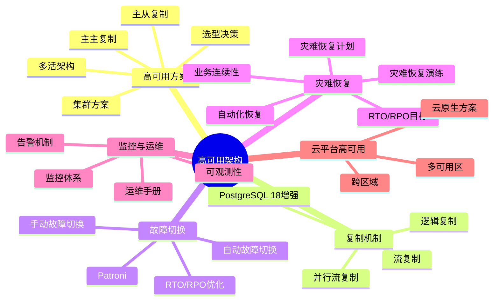
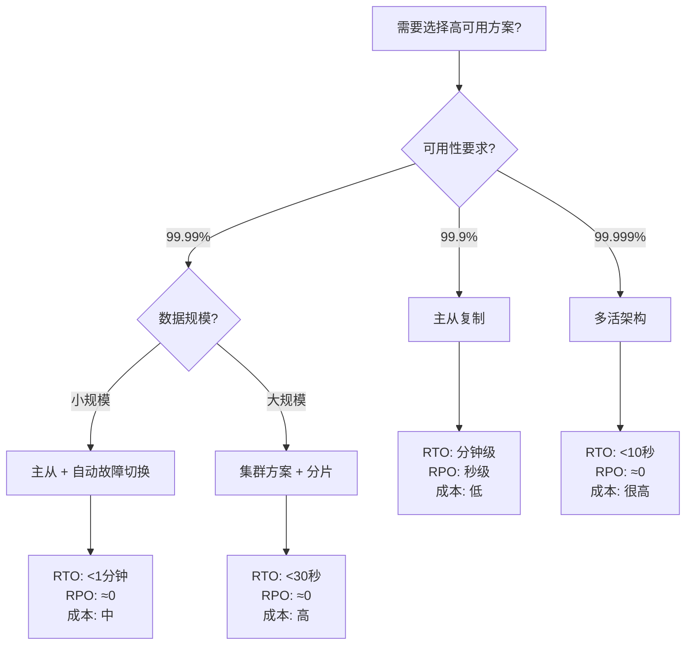

---

> **📋 文档来源**: `PostgreSQL\06-运维实践\README.md`
> **📅 复制日期**: 2025-12-22
> **⚠️ 注意**: 本文档为复制版本，原文件保持不变

---

# 13-高可用架构

> **文档版本**: v1.1
> **最后更新**: 2025年1月
> **版本覆盖**: PostgreSQL 18.x (推荐) ⭐ | 17.x (推荐) | 16.x (兼容)
> **文档状态**: ✅ 所有文档已完成
> **文档总数**: 37个文档

---

## 📊 知识体系思维导图

---

## 📋 文档列表

### 监控与诊断

1. **[监控与诊断](./监控与诊断/06.01-监控与诊断.md)** ⭐⭐⭐⭐⭐
   - 系统监控和诊断
   - 性能指标、健康检查
   - 监控工具和方案

2. **[监控与诊断落地指南](../12-监控与诊断/06.01-监控与诊断.md)** ⭐⭐⭐⭐
   - 监控落地实践
   - 监控配置、告警设置
   - 生产级监控方案

3. **[性能调优变更闭环](../30-性能调优/README.md)** ⭐⭐⭐⭐
   - 性能调优变更流程
   - 变更管理、回滚策略
   - 变更验证

4. **[性能问题案例库](./监控与诊断/06.04-性能问题案例库.md)** ⭐⭐⭐⭐
   - 性能问题案例
   - 问题诊断、解决方案
   - 防再发措施

### 备份与恢复

1. **[备份与恢复](./备份与恢复/06.06-备份与恢复.md)** ⭐⭐⭐⭐⭐
   - 备份恢复完整指南
   - 物理备份、逻辑备份
   - PITR、灾备演练

2. **[增量备份与恢复](./备份与恢复/06.07-增量备份与恢复.md)** ⭐⭐⭐⭐⭐
   - PostgreSQL 18增量备份
   - 增量备份配置和恢复
   - 自动化脚本

### 灾难恢复

1. **[灾难恢复/README.md](./灾难恢复/README.md)** ⭐⭐⭐⭐⭐ - 灾难恢复主题导航
   - 灾难恢复完整指南
   - 灾难恢复计划
   - RTO/RPO目标设定
   - 灾难恢复演练
   - 业务连续性规划
   - 灾难恢复自动化

### 运维工具

1. **[运维工具](./运维工具/README.md)** ⭐⭐⭐⭐
   - 常用运维工具集
   - 自动化脚本
   - 工具选择指南

### 运维手册

1. **[运维手册](./运维手册/README.md)** ⭐⭐⭐⭐⭐
   - 运维Runbook集合
   - 性能调优、监控诊断、集群高可用
   - 向量检索、图数据库、日志可观测性

### 高可用与容灾

1. **[高可用与容灾方案选型指南](./高可用与容灾方案选型指南.md)** ⭐⭐⭐⭐⭐ ⭐ 新增
   - 高可用方案对比分析（主从、主主、集群）
   - 故障切换场景分析（自动、手动）
   - 数据同步策略场景（同步、异步）
   - 容灾演练场景和RTO/RPO优化
   - 多活架构场景分析
   - 实际选型案例
   - **字数**: 约35,000字
   - **状态**: ✅ 已完成

2. **[云平台高可用性实现路径指南](./云平台高可用性实现路径指南.md)** ⭐⭐⭐⭐⭐ ⭐ 新增
   - 云平台高可用性架构设计（多可用区、跨区域、云原生）
   - 冗余策略设计（计算、存储、网络）
   - 监控与运维（主动监控、自动化运维）
   - 99.99% SLA实现路径
   - 成本与可用性平衡
   - 综合选型案例（AWS、Azure）
   - **字数**: 约25,000字
   - **状态**: ✅ 已完成

3. **[云服务双活架构部署指南](./云服务双活架构部署指南.md)** ⭐⭐⭐⭐⭐ ⭐ 新增
   - 双活架构原理与设计
   - 双活架构技术实现
   - 数据同步策略（同步/异步）
   - 双活架构部署步骤
   - 故障切换机制
   - 双活架构成本优化
   - **字数**: 约28,000字
   - **状态**: ✅ 已完成

4. **[虚拟化环境灾备与安全指南](./虚拟化环境灾备与安全指南.md)** ⭐⭐⭐⭐⭐ ⭐ 新增
   - 虚拟化环境灾备架构
   - 虚拟机快照与备份
   - 虚拟化环境安全加固
   - 容器化灾备方案
   - 虚拟化与容器化对比
   - 最佳实践
   - **字数**: 约20,000字
   - **状态**: ✅ 已完成

---

## 📊 高可用方案选型决策树

---

## 📊 高可用方案对比矩阵

| 高可用方案 | 可用性 | RTO | RPO | 数据一致性 | 成本 | 复杂度 | PostgreSQL版本 |
| --- | --- | --- | --- | --- | --- | --- | --- |
| **主从复制** | 99.9% | 分钟级 | 秒级 | 最终一致 | 低 | 低 | 所有版本 |
| **主从+自动切换** | 99.99% | <1分钟 | ≈0 | 强一致 | 中 | 中 | 所有版本 |
| **主主复制** | 99.99% | <30秒 | ≈0 | 强一致 | 中-高 | 高 | 所有版本 |
| **集群方案** | 99.99% | <30秒 | ≈0 | 强一致 | 高 | 很高 | 扩展支持 |
| **多活架构** | 99.999% | <10秒 | ≈0 | 强一致 | 很高 | 很高 | 扩展支持 |

---

## 🔗 相关文档

### 核心基础

- [系统架构与设计原理](../01-核心基础/01.02-系统架构/01.01-系统架构与设计原理.md) - 系统架构基础
- [存储管理与数据持久化](../04-存储与恢复/01.06-存储管理与数据持久化.md) - 存储管理
- [事务管理与ACID特性](../03-事务与并发/03.02-ACID特性/01.04-事务管理与ACID特性.md) - 事务管理

### 查询与优化

- [查询优化器原理](../02-查询与优化/02.01-查询优化器/02.01-查询优化器原理.md) - 查询优化基础
- [执行计划与性能调优](../02-查询与优化/02.03-执行计划/02.04-执行计划与性能调优.md) - 性能调优
- [统计信息与代价模型](../02-查询与优化/02.04-统计信息/02.03-统计信息与代价模型.md) - 统计信息管理

### 部署架构

- [性能调优实践](../11-部署架构/单机部署/05.02-性能调优实践.md) - 性能调优详细指南
- [集群部署与高可用](../11-部署架构/集群部署/05.04-集群部署与高可用.md) - 高可用架构
- [单机部署与配置](../11-部署架构/单机部署/05.01-单机部署与配置.md) - 单机部署

### 版本特性

- [PostgreSQL 18新特性](../18-版本特性/02.01-PostgreSQL-18-新特性.md) - PostgreSQL 18特性（增量备份）

### 行业案例

- [性能问题-案例库](../16-应用设计与开发/行业案例/性能问题-案例库.md) - 性能问题案例

---

**维护者**: Documentation Team
**最后更新**: 2025-11-22
