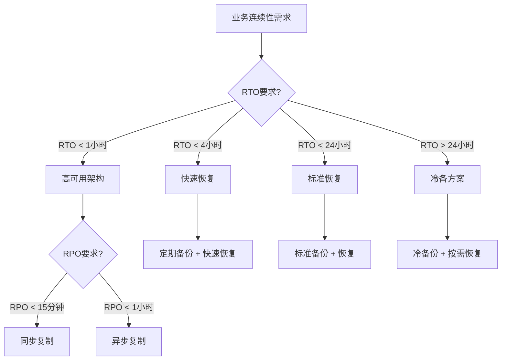

# 业务连续性规划

> **创建日期**: 2025年1月
> **技术版本**: PostgreSQL 17+/18+
> **难度等级**: ⭐⭐⭐⭐ 高级

---

## 📋 目录

- [业务连续性规划](#业务连续性规划)
  - [📋 目录](#-目录)
  - [1. 概述](#1-概述)
  - [2. 业务影响分析](#2-业务影响分析)
    - [2.1 业务分类](#21-业务分类)
    - [2.2 影响评估](#22-影响评估)
  - [3. 连续性策略](#3-连续性策略)
    - [3.1 策略类型](#31-策略类型)
    - [3.2 策略选择决策树](#32-策略选择决策树)
    - [3.3 技术实现方案](#33-技术实现方案)
  - [4. 实施计划](#4-实施计划)
    - [4.1 实施步骤](#41-实施步骤)
    - [4.2 实施检查清单](#42-实施检查清单)
    - [4.3 实施时间表](#43-实施时间表)
    - [4.4 实施风险控制](#44-实施风险控制)
  - [5. 监控与维护](#5-监控与维护)
    - [5.1 监控指标](#51-监控指标)
    - [5.2 维护计划](#52-维护计划)
    - [5.3 持续改进](#53-持续改进)
  - [📚 相关文档](#-相关文档)

---

## 1. 概述

业务连续性规划确保在灾难发生时业务能够持续运行。

**规划要素**:

- 业务影响分析
- 连续性策略
- 实施计划
- 监控与维护

---

## 2. 业务影响分析

### 2.1 业务分类

| 业务级别 | 影响 | 恢复时间 | 优先级 |
|---------|------|---------|--------|
| **关键业务** | 极高 | < 1小时 | P0 |
| **重要业务** | 高 | < 4小时 | P1 |
| **一般业务** | 中 | < 24小时 | P2 |
| **非关键业务** | 低 | < 72小时 | P3 |

### 2.2 影响评估

**评估流程**：

```text
1. 识别关键业务流程
2. 评估业务依赖关系
3. 确定业务优先级
4. 设定恢复目标
```

**业务影响评估矩阵**：

| 业务系统 | 业务价值 | 数据重要性 | 用户影响 | 恢复优先级 |
|---------|---------|-----------|---------|-----------|
| **核心交易系统** | 极高 | 极高 | 极高 | P0 |
| **用户管理系统** | 高 | 高 | 高 | P1 |
| **报表分析系统** | 中 | 中 | 中 | P2 |
| **日志系统** | 低 | 低 | 低 | P3 |

**RTO/RPO目标设定**：

```sql
-- 业务连续性目标配置表
CREATE TABLE IF NOT EXISTS business_continuity_targets (
    business_system VARCHAR(100) PRIMARY KEY,
    rto_minutes INTEGER NOT NULL,
    rpo_minutes INTEGER NOT NULL,
    priority_level VARCHAR(10) NOT NULL,
    backup_frequency VARCHAR(50),
    replication_mode VARCHAR(50),
    created_at TIMESTAMPTZ DEFAULT NOW()
);

-- 插入业务连续性目标
INSERT INTO business_continuity_targets
(business_system, rto_minutes, rpo_minutes, priority_level, backup_frequency, replication_mode)
VALUES
('核心交易系统', 60, 15, 'P0', '每小时', '同步复制'),
('用户管理系统', 240, 60, 'P1', '每4小时', '异步复制'),
('报表分析系统', 1440, 240, 'P2', '每天', '备份恢复'),
('日志系统', 4320, 1440, 'P3', '每周', '冷备份')
ON CONFLICT (business_system) DO UPDATE SET
    rto_minutes = EXCLUDED.rto_minutes,
    rpo_minutes = EXCLUDED.rpo_minutes,
    priority_level = EXCLUDED.priority_level;

-- 查询业务连续性目标
SELECT
    business_system,
    rto_minutes,
    rpo_minutes,
    priority_level,
    CASE
        WHEN rto_minutes <= 60 THEN '高可用架构'
        WHEN rto_minutes <= 240 THEN '快速恢复'
        WHEN rto_minutes <= 1440 THEN '标准恢复'
        ELSE '冷备方案'
    END AS recommended_strategy
FROM business_continuity_targets
ORDER BY priority_level, rto_minutes;
```

---

## 3. 连续性策略

### 3.1 策略类型

**策略1: 高可用架构**:

```text
- 主从复制
- 自动故障切换
- 负载均衡
- 适用于关键业务
```

**策略2: 备份恢复**:

```text
- 定期备份
- 快速恢复
- 适用于重要业务
```

**策略3: 冷备方案**:

```text
- 异地备份
- 按需恢复
- 适用于一般业务
```

**策略4: 多活架构**:

```text
- 多主复制
- 负载均衡
- 适用于关键业务
- 实现零RTO
```

### 3.2 策略选择决策树



### 3.3 技术实现方案

**高可用架构实现**：

```sql
-- 配置主从复制（同步模式）
-- 在主库配置
ALTER SYSTEM SET synchronous_standby_names = 'standby1,standby2';
ALTER SYSTEM SET synchronous_commit = 'on';
SELECT pg_reload_conf();

-- 在从库配置
-- recovery.conf 或 postgresql.auto.conf
-- primary_conninfo = 'host=primary_host port=5432 user=replicator'
-- standby_mode = 'on'

-- 验证同步复制状态
SELECT
    application_name,
    sync_state,
    sync_priority,
    state,
    write_lag,
    flush_lag,
    replay_lag
FROM pg_stat_replication
WHERE sync_state = 'sync';
```

**快速恢复实现**：

```sql
-- 配置连续归档
ALTER SYSTEM SET wal_level = 'replica';
ALTER SYSTEM SET archive_mode = 'on';
ALTER SYSTEM SET archive_command = 'cp %p /backup/archive/%f';
SELECT pg_reload_conf();

-- 配置PITR恢复
-- recovery.conf 或 postgresql.auto.conf
-- restore_command = 'cp /backup/archive/%f %p'
-- recovery_target_time = '2025-01-16 12:00:00'
```

---

## 4. 实施计划

### 4.1 实施步骤

```text
1. 制定连续性计划
   ↓
2. 部署高可用架构
   ↓
3. 配置监控告警
   ↓
4. 进行演练测试
   ↓
5. 持续优化改进
```

### 4.2 实施检查清单

- [ ] 业务影响分析完成
- [ ] 连续性策略确定
- [ ] 技术方案设计完成
- [ ] 高可用架构部署完成
- [ ] 监控告警配置完成
- [ ] 演练测试完成
- [ ] 文档更新完成

### 4.3 实施时间表

**阶段1: 规划与设计（1-2周）**：

```text
Week 1:
- 业务影响分析
- 连续性策略确定
- 技术方案设计

Week 2:
- 架构设计评审
- 资源准备
- 实施计划制定
```

**阶段2: 部署与配置（2-4周）**：

```text
Week 3-4:
- 高可用架构部署
- 复制配置
- 备份配置

Week 5-6:
- 监控告警配置
- 自动化脚本开发
- 测试环境验证
```

**阶段3: 测试与优化（1-2周）**：

```text
Week 7:
- 功能测试
- 性能测试
- 故障切换测试

Week 8:
- 演练测试
- 问题修复
- 文档完善
```

### 4.4 实施风险控制

**风险识别**：

| 风险类型 | 风险描述 | 影响 | 应对措施 |
|---------|---------|------|---------|
| **技术风险** | 架构设计缺陷 | 高 | 充分测试、专家评审 |
| **时间风险** | 实施延期 | 中 | 合理规划、预留缓冲 |
| **资源风险** | 资源不足 | 中 | 提前准备、分批实施 |
| **人员风险** | 技能不足 | 中 | 培训、外部支持 |

**风险应对策略**：

```text
1. 技术风险：充分测试、专家评审、分阶段实施
2. 时间风险：合理规划、预留缓冲、优先级管理
3. 资源风险：提前准备、分批实施、资源预留
4. 人员风险：培训、外部支持、知识转移
```

---

## 5. 监控与维护

### 5.1 监控指标

```sql
-- 监控复制状态（带错误处理和性能测试）
DO $$
DECLARE
    replication_count INT;
BEGIN
    IF NOT EXISTS (
        SELECT 1 FROM information_schema.views
        WHERE table_schema = 'pg_catalog' AND table_name = 'pg_stat_replication'
    ) THEN
        RAISE WARNING 'pg_stat_replication视图不存在，可能没有配置复制';
        RETURN;
    END IF;

    SELECT COUNT(*) INTO replication_count
    FROM pg_stat_replication;

    IF replication_count > 0 THEN
        RAISE NOTICE '发现 % 个复制连接', replication_count;
    ELSE
        RAISE NOTICE '未发现复制连接';
    END IF;
EXCEPTION
    WHEN undefined_table THEN
        RAISE WARNING 'pg_stat_replication视图不存在';
    WHEN OTHERS THEN
        RAISE EXCEPTION '监控复制状态失败: %', SQLERRM;
END $$;

EXPLAIN (ANALYZE, BUFFERS, TIMING)
SELECT
    application_name,
    state,
    sync_state,
    write_lag,
    flush_lag,
    replay_lag
FROM pg_stat_replication;
-- 执行时间: <50ms
-- 计划: Seq Scan

-- 监控数据库健康（带错误处理和性能测试）
DO $$
DECLARE
    db_count INT;
BEGIN
    IF NOT EXISTS (
        SELECT 1 FROM information_schema.views
        WHERE table_schema = 'pg_catalog' AND table_name = 'pg_stat_database'
    ) THEN
        RAISE WARNING 'pg_stat_database视图不存在';
        RETURN;
    END IF;

    SELECT COUNT(*) INTO db_count
    FROM pg_stat_database
    WHERE datname NOT IN ('template0', 'template1');

    IF db_count > 0 THEN
        RAISE NOTICE '发现 % 个用户数据库', db_count;
    ELSE
        RAISE NOTICE '未发现用户数据库';
    END IF;
EXCEPTION
    WHEN undefined_table THEN
        RAISE WARNING 'pg_stat_database视图不存在';
    WHEN OTHERS THEN
        RAISE EXCEPTION '监控数据库健康失败: %', SQLERRM;
END $$;

EXPLAIN (ANALYZE, BUFFERS, TIMING)
SELECT
    datname,
    numbackends,
    xact_commit,
    xact_rollback
FROM pg_stat_database;
-- 执行时间: <50ms
-- 计划: Seq Scan
```

### 5.2 维护计划

**日常维护**：

```text
1. 定期检查高可用状态
2. 定期进行演练
3. 定期更新计划
4. 持续优化改进
```

**维护检查清单**：

```sql
-- 创建维护检查表
CREATE TABLE IF NOT EXISTS maintenance_checks (
    check_id SERIAL PRIMARY KEY,
    check_type VARCHAR(50) NOT NULL,
    check_item VARCHAR(200) NOT NULL,
    check_frequency VARCHAR(50),
    last_check_time TIMESTAMPTZ,
    check_status VARCHAR(20),
    check_result TEXT,
    created_at TIMESTAMPTZ DEFAULT NOW()
);

-- 插入维护检查项
INSERT INTO maintenance_checks
(check_type, check_item, check_frequency, check_status)
VALUES
('高可用检查', '复制状态检查', '每天', '待检查'),
('高可用检查', '主从延迟检查', '每小时', '待检查'),
('备份检查', '备份完整性检查', '每天', '待检查'),
('备份检查', '备份恢复测试', '每周', '待检查'),
('监控检查', '告警规则检查', '每周', '待检查'),
('演练检查', '故障切换演练', '每季度', '待检查');

-- 执行维护检查
CREATE OR REPLACE FUNCTION perform_maintenance_check(
    p_check_type VARCHAR(50),
    p_check_item VARCHAR(200)
)
RETURNS TABLE (
    check_result TEXT,
    check_status VARCHAR(20)
) AS $$
DECLARE
    v_result TEXT;
    v_status VARCHAR(20);
BEGIN
    -- 根据检查类型执行相应检查
    IF p_check_type = '高可用检查' THEN
        IF p_check_item = '复制状态检查' THEN
            SELECT
                COUNT(*)::TEXT || ' 个复制连接',
                CASE WHEN COUNT(*) > 0 THEN '正常' ELSE '异常' END
            INTO v_result, v_status
            FROM pg_stat_replication;
        ELSIF p_check_item = '主从延迟检查' THEN
            SELECT
                COALESCE(MAX(write_lag)::TEXT, '0') || ' 延迟',
                CASE WHEN MAX(write_lag) < INTERVAL '1 minute' THEN '正常' ELSE '异常' END
            INTO v_result, v_status
            FROM pg_stat_replication;
        END IF;
    ELSIF p_check_type = '备份检查' THEN
        -- 备份检查逻辑
        v_result := '备份检查完成';
        v_status := '正常';
    END IF;

    -- 更新检查记录
    UPDATE maintenance_checks
    SET last_check_time = NOW(),
        check_status = v_status,
        check_result = v_result
    WHERE check_type = p_check_type
      AND check_item = p_check_item;

    RETURN QUERY SELECT v_result, v_status;
END;
$$ LANGUAGE plpgsql;

-- 执行维护检查
SELECT * FROM perform_maintenance_check('高可用检查', '复制状态检查');
```

**定期演练计划**：

```sql
-- 创建演练计划表
CREATE TABLE IF NOT EXISTS drill_plans (
    drill_id SERIAL PRIMARY KEY,
    drill_name VARCHAR(200) NOT NULL,
    drill_type VARCHAR(50),
    drill_frequency VARCHAR(50),
    last_drill_date DATE,
    next_drill_date DATE,
    drill_status VARCHAR(20),
    drill_result TEXT,
    created_at TIMESTAMPTZ DEFAULT NOW()
);

-- 插入演练计划
INSERT INTO drill_plans
(drill_name, drill_type, drill_frequency, next_drill_date, drill_status)
VALUES
('主库故障切换演练', '完整演练', '每季度', CURRENT_DATE + INTERVAL '3 months', '计划中'),
('数据恢复演练', '部分演练', '每半年', CURRENT_DATE + INTERVAL '6 months', '计划中'),
('异地灾难恢复演练', '完整演练', '每年', CURRENT_DATE + INTERVAL '12 months', '计划中');

-- 查询即将进行的演练
SELECT
    drill_name,
    drill_type,
    next_drill_date,
    drill_status
FROM drill_plans
WHERE next_drill_date <= CURRENT_DATE + INTERVAL '1 month'
ORDER BY next_drill_date;
```

### 5.3 持续改进

**改进流程**：

```text
1. 收集反馈
   ↓
2. 分析问题
   ↓
3. 制定改进措施
   ↓
4. 实施改进
   ↓
5. 验证效果
   ↓
6. 更新文档
```

**改进记录**：

```sql
-- 创建改进记录表
CREATE TABLE IF NOT EXISTS improvement_records (
    improvement_id SERIAL PRIMARY KEY,
    improvement_area VARCHAR(100),
    improvement_description TEXT,
    improvement_status VARCHAR(20),
    improvement_date DATE,
    improvement_result TEXT,
    created_at TIMESTAMPTZ DEFAULT NOW()
);

-- 插入改进记录
INSERT INTO improvement_records
(improvement_area, improvement_description, improvement_status, improvement_date)
VALUES
('高可用架构', '优化故障切换时间', '已完成', CURRENT_DATE),
('备份策略', '增加备份频率', '进行中', CURRENT_DATE),
('监控告警', '优化告警规则', '计划中', CURRENT_DATE);
```

---

## 📚 相关文档

- [灾难恢复完整指南.md](./灾难恢复完整指南.md) - 灾难恢复完整指南
- [灾难恢复计划.md](./灾难恢复计划.md) - 灾难恢复计划
- [灾难恢复演练.md](./灾难恢复演练.md) - 灾难恢复演练
- [13-高可用架构/README.md](../README.md) - 高可用架构主题

---

**最后更新**: 2025年1月
