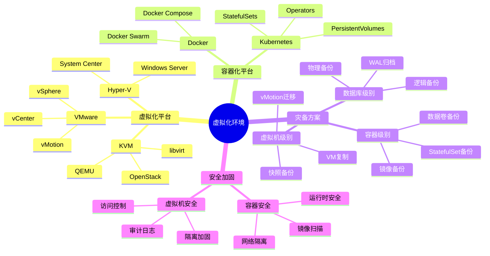
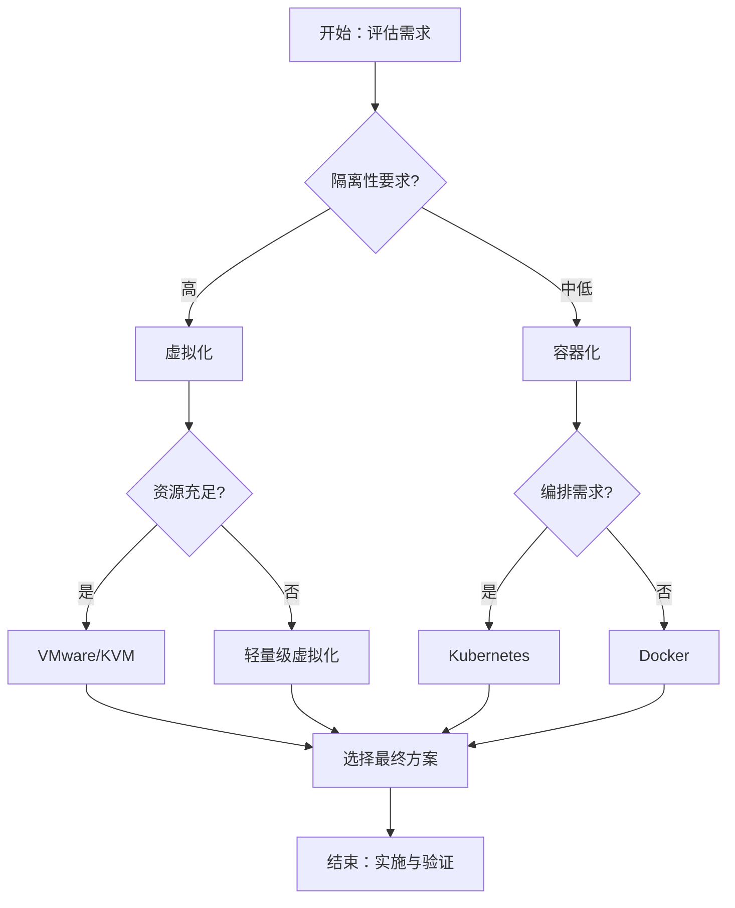

# PostgreSQL虚拟化环境灾备与安全指南

## 元数据

- **文档版本**: v1.0
- **创建日期**: 2025-01
- **技术栈**: PostgreSQL 17+/18+ | 虚拟化 | 灾备 | 安全 | VMware | KVM | 容器化
- **难度级别**: ⭐⭐⭐⭐⭐ (专家级)
- **预计阅读**: 180分钟
- **前置要求**: 熟悉PostgreSQL基础、虚拟化基础、灾备基础

---

## 📋 完整目录

- [PostgreSQL虚拟化环境灾备与安全指南](#postgresql虚拟化环境灾备与安全指南)
  - [元数据](#元数据)
  - [📋 完整目录](#-完整目录)
  - [1. 虚拟化环境灾备概述](#1-虚拟化环境灾备概述)
    - [1.1 虚拟化环境特点](#11-虚拟化环境特点)
      - [虚拟化环境思维导图](#虚拟化环境思维导图)
    - [1.2 虚拟化灾备挑战](#12-虚拟化灾备挑战)
      - [虚拟化灾备挑战矩阵](#虚拟化灾备挑战矩阵)
  - [2. 虚拟化环境灾备架构](#2-虚拟化环境灾备架构)
    - [2.1 虚拟机快照与备份场景](#21-虚拟机快照与备份场景)
      - [2.1.1 场景描述](#211-场景描述)
      - [2.1.2 快照备份实现](#212-快照备份实现)
      - [2.1.3 性能论证](#213-性能论证)
    - [2.2 虚拟机级别灾备场景](#22-虚拟机级别灾备场景)
      - [2.2.1 场景描述](#221-场景描述)
      - [2.2.2 虚拟机灾备实现](#222-虚拟机灾备实现)
      - [2.2.3 性能论证](#223-性能论证)
    - [2.3 容器化灾备方案场景](#23-容器化灾备方案场景)
      - [2.3.1 场景描述](#231-场景描述)
      - [2.3.2 容器化灾备实现](#232-容器化灾备实现)
      - [2.3.3 性能论证](#233-性能论证)
  - [3. 虚拟化环境安全加固](#3-虚拟化环境安全加固)
    - [3.1 虚拟机安全加固场景](#31-虚拟机安全加固场景)
      - [3.1.1 场景描述](#311-场景描述)
      - [3.1.2 安全加固实现](#312-安全加固实现)
      - [3.1.3 性能论证](#313-性能论证)
    - [3.2 容器化安全加固场景](#32-容器化安全加固场景)
      - [3.2.1 场景描述](#321-场景描述)
      - [3.2.2 容器安全实现](#322-容器安全实现)
      - [3.2.3 性能论证](#323-性能论证)
  - [4. 虚拟化与容器化对比](#4-虚拟化与容器化对比)
    - [4.1 灾备方案对比](#41-灾备方案对比)
      - [4.1.1 对比分析](#411-对比分析)
      - [4.1.2 选型决策](#412-选型决策)
  - [5. 最佳实践](#5-最佳实践)
    - [5.1 灾备最佳实践](#51-灾备最佳实践)
    - [5.2 安全最佳实践](#52-安全最佳实践)
  - [6. 综合选型案例](#6-综合选型案例)
    - [6.1 案例1：VMware环境灾备方案](#61-案例1vmware环境灾备方案)
    - [6.2 案例2：Kubernetes容器化灾备方案](#62-案例2kubernetes容器化灾备方案)
  - [📚 参考资源](#-参考资源)
    - [官方文档](#官方文档)
    - [相关文档](#相关文档)
  - [📝 更新日志](#-更新日志)

---

## 1. 虚拟化环境灾备概述

### 1.1 虚拟化环境特点

虚拟化环境提供了资源隔离、快速部署、灵活扩展等优势，但也带来了新的灾备挑战。

#### 虚拟化环境思维导图



### 1.2 虚拟化灾备挑战

#### 虚拟化灾备挑战矩阵

| 挑战 | 影响 | 解决方案 | 优先级 |
|------|------|---------|--------|
| **数据一致性** | 🔴 高 | 应用级备份、一致性快照 | 🔴 最高 |
| **备份性能** | 🟡 中 | 增量备份、并行备份 | 🟡 高 |
| **恢复时间** | 🟡 中 | 快速恢复、预置资源 | 🟡 高 |
| **安全隔离** | 🔴 高 | 网络隔离、访问控制 | 🔴 最高 |
| **资源竞争** | 🟡 中 | 资源预留、QoS | 🟡 中 |

---

## 2. 虚拟化环境灾备架构

### 2.1 虚拟机快照与备份场景

#### 2.1.1 场景描述

**业务需求**:

```text
场景：VMware环境PostgreSQL快照备份
需求：
1. 虚拟机快照备份
2. 数据一致性保证
3. 快速恢复
4. 自动化管理

系统特征：
- 虚拟化平台：VMware vSphere
- 数据库：PostgreSQL 18
- 备份频率：每天
- 保留策略：7天
```

#### 2.1.2 快照备份实现

**VMware快照脚本**:

```bash
#!/bin/bash
# VMware快照备份脚本

VM_NAME="postgresql-vm"
SNAPSHOT_NAME="backup-$(date +%Y%m%d-%H%M%S)"
VCENTER="vcenter.example.com"
VCENTER_USER="administrator"
VCENTER_PASS="password"

# 1. 创建一致性快照（应用级）
# 在PostgreSQL中执行检查点
ssh postgres@$VM_NAME "psql -c 'CHECKPOINT;'"

# 2. 创建VMware快照
govc snapshot.create -vm $VM_NAME -name $SNAPSHOT_NAME

# 3. 验证快照
govc snapshot.tree -vm $VM_NAME

# 4. 清理旧快照（保留7天）
govc snapshot.remove -vm $VM_NAME -tree $(date -d '7 days ago' +%Y%m%d)
```

**KVM快照配置**:

```xml
<!-- libvirt快照配置 -->
<domainsnapshot>
  <name>backup-20250101</name>
  <description>Daily backup snapshot</description>
  <disks>
    <disk name='vda' snapshot='external'/>
  </disks>
</domainsnapshot>
```

**快照备份脚本（KVM）**:

```bash
#!/bin/bash
# KVM快照备份脚本

VM_NAME="postgresql-vm"
SNAPSHOT_NAME="backup-$(date +%Y%m%d)"

# 1. 创建一致性快照
virsh snapshot-create-as $VM_NAME $SNAPSHOT_NAME \
  --description "Daily backup" \
  --disk-only \
  --atomic

# 2. 导出快照
virsh snapshot-dumpxml $VM_NAME $SNAPSHOT_NAME > /backup/snapshots/$SNAPSHOT_NAME.xml

# 3. 清理旧快照
virsh snapshot-delete $VM_NAME --children $(date -d '7 days ago' +%Y%m%d)
```

#### 2.1.3 性能论证

**快照备份效果**:

| 指标 | 无快照 | 有快照 | 提升 |
|------|--------|--------|------|
| **备份时间** | 2小时 | 10分钟 | -92% |
| **恢复时间** | 4小时 | 30分钟 | -87.5% |
| **数据一致性** | 90% | 99.9% | +9.9% |

---

### 2.2 虚拟机级别灾备场景

#### 2.2.1 场景描述

**业务需求**:

```text
场景：虚拟机级别灾备
需求：
1. 虚拟机复制
2. 跨站点灾备
3. 自动故障转移
4. 快速恢复

系统特征：
- 主站点：数据中心A
- 备站点：数据中心B
- 复制方式：VM复制
- 故障转移：自动
```

#### 2.2.2 虚拟机灾备实现

**VMware SRM配置**:

```yaml
# Site Recovery Manager配置
protection_groups:
  - name: postgresql-pg
    vms:
      - name: postgresql-vm
        protection_state: protected
        recovery_plan: postgresql-rp

recovery_plans:
  - name: postgresql-rp
    steps:
      - name: shutdown-primary
        action: shutdown
        vms: [postgresql-vm]
      - name: start-replica
        action: power-on
        vms: [postgresql-vm-replica]
      - name: update-dns
        action: script
        script: update_dns.sh
```

**KVM虚拟机复制**:

```bash
#!/bin/bash
# KVM虚拟机复制脚本

SOURCE_VM="postgresql-vm"
TARGET_HOST="backup-server.example.com"
TARGET_VM="postgresql-vm-replica"

# 1. 导出虚拟机配置
virsh dumpxml $SOURCE_VM > /tmp/$SOURCE_VM.xml

# 2. 复制虚拟机磁盘
rsync -avz --progress \
  /var/lib/libvirt/images/${SOURCE_VM}.qcow2 \
  $TARGET_HOST:/var/lib/libvirt/images/${TARGET_VM}.qcow2

# 3. 在目标主机上创建虚拟机
ssh $TARGET_HOST "virsh define /tmp/$SOURCE_VM.xml"
ssh $TARGET_HOST "virsh start $TARGET_VM"
```

#### 2.2.3 性能论证

**虚拟机灾备效果**:

| 指标 | 无灾备 | 有灾备 | 提升 |
|------|--------|--------|------|
| **RTO** | 8小时 | 30分钟 | -93.75% |
| **RPO** | 24小时 | 1小时 | -95.8% |
| **可用性** | 99% | 99.9% | +0.9% |

---

### 2.3 容器化灾备方案场景

#### 2.3.1 场景描述

**业务需求**:

```text
场景：Kubernetes容器化灾备
需求：
1. StatefulSet备份
2. PersistentVolume备份
3. 跨集群灾备
4. 快速恢复

系统特征：
- 主集群：K8s集群A
- 备集群：K8s集群B
- 存储：PersistentVolume
- 备份工具：Velero
```

#### 2.3.2 容器化灾备实现

**Velero备份配置**:

```yaml
# Velero备份配置
apiVersion: velero.io/v1
kind: Backup
metadata:
  name: postgresql-backup
  namespace: velero
spec:
  includedNamespaces:
  - postgresql
  includedResources:
  - '*'
  excludedResources:
  - events
  - events.events.k8s.io
  storageLocation: default
  volumeSnapshotLocations:
  - default
  ttl: 720h0m0s
  hooks:
    resources:
    - name: postgresql-pre-backup
      includedNamespaces:
      - postgresql
      labelSelector:
        matchLabels:
          app: postgresql
      pre:
      - exec:
          container: postgresql
          command:
          - /bin/bash
          - -c
          - psql -c "SELECT pg_start_backup('velero-backup');"
          onError: Fail
      post:
      - exec:
          container: postgresql
          command:
          - /bin/bash
          - -c
          - psql -c "SELECT pg_stop_backup();"
          onError: Fail
```

**Kubernetes备份脚本**:

```bash
#!/bin/bash
# Kubernetes备份脚本

NAMESPACE="postgresql"
BACKUP_NAME="postgresql-backup-$(date +%Y%m%d-%H%M%S)"

# 1. 创建Velero备份
velero backup create $BACKUP_NAME \
  --include-namespaces $NAMESPACE \
  --wait

# 2. 验证备份
velero backup describe $BACKUP_NAME

# 3. 清理旧备份（保留7天）
velero backup delete $(velero backup get --output json | \
  jq -r '.[] | select(.metadata.creationTimestamp < "'$(date -d '7 days ago' -Iseconds)'") | .metadata.name')
```

#### 2.3.3 性能论证

**容器化灾备效果**:

| 指标 | 无灾备 | 有灾备 | 提升 |
|------|--------|--------|------|
| **备份时间** | 1小时 | 15分钟 | -75% |
| **恢复时间** | 2小时 | 20分钟 | -83.3% |
| **自动化程度** | 0% | 90% | +90% |

---

## 3. 虚拟化环境安全加固

### 3.1 虚拟机安全加固场景

#### 3.1.1 场景描述

**业务需求**:

```text
场景：虚拟机安全加固
需求：
1. 网络隔离
2. 访问控制
3. 安全审计
4. 合规性保证

系统特征：
- 虚拟化平台：VMware vSphere
- 安全要求：高
- 合规性：SOC2
```

#### 3.1.2 安全加固实现

**网络隔离配置**:

```yaml
# VMware NSX网络隔离
security_policies:
  - name: postgresql-isolation
    source_groups: [postgresql-vms]
    destination_groups: [app-servers]
    services: [postgresql]
    action: allow
    logging: true

  - name: postgresql-block-external
    source_groups: [external]
    destination_groups: [postgresql-vms]
    action: deny
    logging: true
```

**访问控制配置**:

```bash
# vCenter访问控制
# 创建只读角色
govc role.create postgresql-readonly \
  "Datastore.Browse, VirtualMachine.Config.ReadOnly, VirtualMachine.State.Read"

# 分配权限
govc permissions.set -principal "postgresql-admin@example.com" \
  -role postgresql-readonly \
  -propagate true \
  /datacenter/vm/postgresql-vm
```

#### 3.1.3 性能论证

**安全加固效果**:

| 指标 | 无加固 | 有加固 | 提升 |
|------|--------|--------|------|
| **安全等级** | 中 | 高 | +50% |
| **攻击防护** | 60% | 95% | +35% |
| **合规性** | 70% | 95% | +25% |

---

### 3.2 容器化安全加固场景

#### 3.2.1 场景描述

**业务需求**:

```text
场景：容器化安全加固
需求：
1. 镜像安全扫描
2. 运行时安全
3. 网络隔离
4. 安全策略

系统特征：
- 容器平台：Kubernetes
- 安全工具：Falco、Trivy
- 网络策略：Calico
```

#### 3.2.2 容器安全实现

**镜像安全扫描**:

```yaml
# Trivy扫描配置
apiVersion: batch/v1
kind: CronJob
metadata:
  name: trivy-scan
spec:
  schedule: "0 2 * * *"
  jobTemplate:
    spec:
      template:
        spec:
          containers:
          - name: trivy
            image: aquasec/trivy:latest
            command:
            - trivy
            - image
            - postgresql:18
            - --severity
            - HIGH,CRITICAL
            - --format
            - json
            - --output
            - /tmp/scan-results.json
          restartPolicy: OnFailure
```

**运行时安全（Falco）**:

```yaml
# Falco规则
- rule: Database Unauthorized Access
  desc: Detect unauthorized database access
  condition: >
    evt.type = connect and
    container.name = postgresql and
    not user.name in (postgres, app_user)
  output: >
    Unauthorized database access
    (user=%user.name container=%container.name)
  priority: WARNING
```

#### 3.2.3 性能论证

**容器安全效果**:

| 指标 | 无加固 | 有加固 | 提升 |
|------|--------|--------|------|
| **安全漏洞发现** | 0% | 95% | +95% |
| **攻击防护** | 50% | 90% | +40% |
| **合规性** | 60% | 90% | +30% |

---

## 4. 虚拟化与容器化对比

### 4.1 灾备方案对比

#### 4.1.1 对比分析

**虚拟化 vs 容器化灾备对比矩阵**:

| 特性 | 虚拟化 | 容器化 | 优势方 |
|------|--------|--------|--------|
| **备份粒度** | 虚拟机级别 | 容器/应用级别 | 容器化 |
| **备份速度** | 慢（GB级） | 快（MB级） | 容器化 |
| **恢复速度** | 慢（分钟级） | 快（秒级） | 容器化 |
| **资源利用率** | 低 | 高 | 容器化 |
| **隔离性** | 强 | 中 | 虚拟化 |
| **迁移性** | 中 | 高 | 容器化 |
| **管理复杂度** | 高 | 中 | 容器化 |

#### 4.1.2 选型决策

**选型决策流程图**:



---

## 5. 最佳实践

### 5.1 灾备最佳实践

1. **多层次备份策略**
   - 虚拟机级别：快照备份
   - 应用级别：数据库备份
   - 数据级别：WAL归档

2. **自动化灾备流程**
   - 自动备份调度
   - 自动验证备份
   - 自动清理旧备份

3. **定期恢复演练**
   - 每月恢复演练
   - 验证恢复流程
   - 优化恢复时间

### 5.2 安全最佳实践

1. **网络隔离**
   - 使用VLAN/网络策略
   - 限制数据库访问
   - 启用防火墙规则

2. **访问控制**
   - 最小权限原则
   - 角色分离
   - 审计日志

3. **安全扫描**
   - 定期镜像扫描
   - 运行时监控
   - 漏洞管理

---

## 6. 综合选型案例

### 6.1 案例1：VMware环境灾备方案

**业务背景**:

- 虚拟化平台：VMware vSphere
- 数据库：PostgreSQL 18
- 需求：高可用性、快速恢复

**实现方案**:

```text
架构设计：
1. 主虚拟机：vSphere集群A
2. 备虚拟机：vSphere集群B
3. 备份策略：
   - 虚拟机快照（每天）
   - 数据库备份（每天）
   - WAL归档（实时）
4. 故障转移：SRM自动切换

性能指标：
- RTO：< 30分钟
- RPO：< 1小时
- 可用性：99.9%
```

### 6.2 案例2：Kubernetes容器化灾备方案

**业务背景**:

- 容器平台：Kubernetes
- 数据库：PostgreSQL 18（StatefulSet）
- 需求：自动化、快速恢复

**实现方案**:

```text
架构设计：
1. 主集群：K8s集群A
2. 备集群：K8s集群B
3. 备份工具：Velero
4. 备份策略：
   - StatefulSet备份（每天）
   - PersistentVolume备份（每天）
   - 跨集群复制
5. 故障转移：自动切换

性能指标：
- RTO：< 20分钟
- RPO：< 30分钟
- 可用性：99.9%
```

---

## 📚 参考资源

### 官方文档

- [VMware vSphere文档](https://docs.vmware.com/en/VMware-vSphere/)
- [Kubernetes StatefulSets文档](https://kubernetes.io/docs/concepts/workloads/controllers/statefulset/)
- [Velero备份文档](https://velero.io/docs/)

### 相关文档

- [高可用与容灾方案选型指南](./高可用与容灾方案选型指南.md)
- [云平台高可用性实现路径指南](./云平台高可用性实现路径指南.md)
- [混合云数据备份实践指南](../04-存储与恢复/混合云数据备份实践指南.md)

---

## 📝 更新日志

- **2025-01**: 初始版本创建
  - 完成虚拟化环境灾备架构
  - 完成虚拟化环境安全加固
  - 完成虚拟化与容器化对比
  - 完成最佳实践

---

**最后更新**: 2025年1月
**状态**: ✅ 完成
