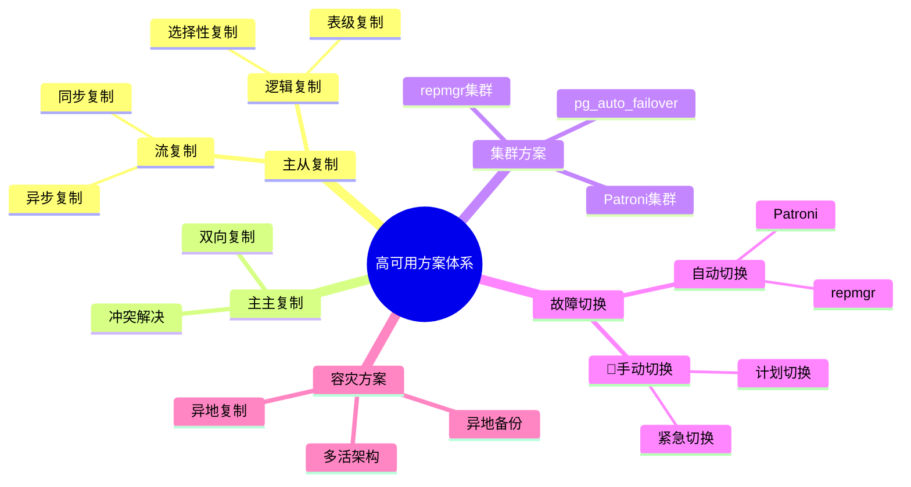
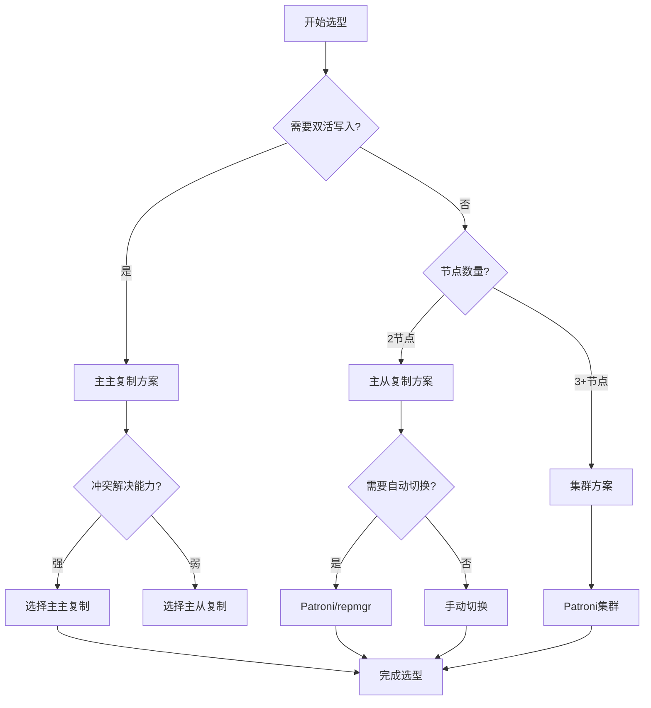
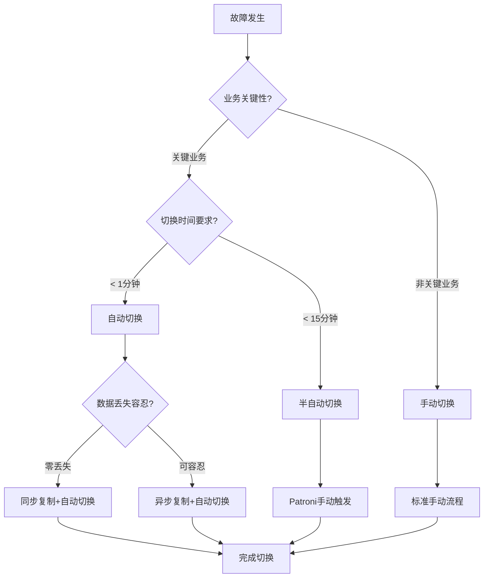
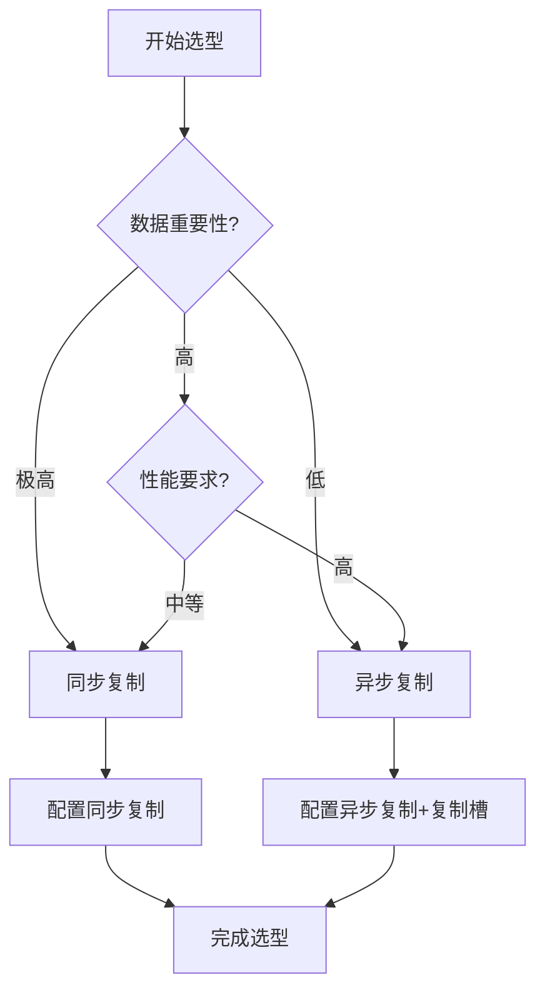

# PostgreSQL高可用与容灾方案选型指南

## 元数据

- **文档版本**: v1.0
- **创建日期**: 2025-01
- **技术栈**: PostgreSQL 17+/18+ | 高可用 | 容灾 | 故障切换 | RTO/RPO
- **难度级别**: ⭐⭐⭐⭐⭐ (专家级)
- **预计阅读**: 200分钟
- **前置要求**: 熟悉PostgreSQL基础、流复制基础、备份恢复基础

---

## 📋 完整目录

- [PostgreSQL高可用与容灾方案选型指南](#postgresql高可用与容灾方案选型指南)
  - [元数据](#元数据)
  - [📋 完整目录](#-完整目录)
  - [1. 高可用与容灾概述](#1-高可用与容灾概述)
    - [1.1 高可用体系](#11-高可用体系)
      - [高可用方案体系思维导图](#高可用方案体系思维导图)
    - [1.2 容灾体系](#12-容灾体系)
      - [容灾方案决策矩阵](#容灾方案决策矩阵)
  - [2. 高可用方案对比分析](#2-高可用方案对比分析)
    - [2.1 主从复制方案](#21-主从复制方案)
      - [2.1.1 场景描述](#211-场景描述)
      - [2.1.2 方案实现](#212-方案实现)
      - [2.1.3 性能论证](#213-性能论证)
    - [2.2 主主复制方案](#22-主主复制方案)
      - [2.2.1 场景描述](#221-场景描述)
      - [2.2.2 方案实现](#222-方案实现)
      - [2.2.3 性能论证](#223-性能论证)
    - [2.3 集群方案](#23-集群方案)
      - [2.3.1 场景描述](#231-场景描述)
      - [2.3.2 方案实现](#232-方案实现)
      - [2.3.3 性能论证](#233-性能论证)
    - [2.4 高可用方案对比矩阵](#24-高可用方案对比矩阵)
      - [方案选型决策流程图](#方案选型决策流程图)
  - [3. 故障切换场景分析](#3-故障切换场景分析)
    - [3.1 自动切换场景](#31-自动切换场景)
      - [3.1.1 场景描述](#311-场景描述)
      - [3.1.2 自动切换实现](#312-自动切换实现)
      - [3.1.3 切换时间优化](#313-切换时间优化)
    - [3.2 手动切换场景](#32-手动切换场景)
      - [3.2.1 场景描述](#321-场景描述)
      - [3.2.2 手动切换流程](#322-手动切换流程)
      - [3.2.3 切换时间优化](#323-切换时间优化)
    - [3.3 故障切换决策流程](#33-故障切换决策流程)
      - [切换策略选型决策树](#切换策略选型决策树)
  - [4. 数据同步策略场景](#4-数据同步策略场景)
    - [4.1 同步复制场景](#41-同步复制场景)
      - [4.1.1 场景描述](#411-场景描述)
      - [4.1.2 同步复制实现](#412-同步复制实现)
      - [4.1.3 性能影响分析](#413-性能影响分析)
    - [4.2 异步复制场景](#42-异步复制场景)
      - [4.2.1 场景描述](#421-场景描述)
      - [4.2.2 异步复制实现](#422-异步复制实现)
      - [4.2.3 性能影响分析](#423-性能影响分析)
    - [4.3 数据同步策略选型决策](#43-数据同步策略选型决策)
      - [同步策略选型决策矩阵](#同步策略选型决策矩阵)
  - [5. 容灾演练场景](#5-容灾演练场景)
    - [5.1 演练流程](#51-演练流程)
      - [5.1.1 演练计划](#511-演练计划)
      - [5.1.2 演练执行](#512-演练执行)
      - [5.1.3 演练总结](#513-演练总结)
    - [5.2 RTO/RPO优化](#52-rtorpo优化)
      - [5.2.1 RTO优化策略](#521-rto优化策略)
      - [5.2.2 RPO优化策略](#522-rpo优化策略)
      - [5.2.3 RTO/RPO平衡](#523-rtorpo平衡)
  - [6. 多活架构场景分析](#6-多活架构场景分析)
    - [6.1 多活架构设计](#61-多活架构设计)
      - [6.1.1 场景描述](#611-场景描述)
      - [6.1.2 多活架构实现](#612-多活架构实现)
    - [6.2 多活架构选型](#62-多活架构选型)
      - [6.2.1 适用场景](#621-适用场景)
      - [6.2.2 技术挑战](#622-技术挑战)
  - [7. 综合选型案例](#7-综合选型案例)
    - [7.1 案例1：金融系统高可用选型](#71-案例1金融系统高可用选型)
    - [7.2 案例2：电商平台容灾选型](#72-案例2电商平台容灾选型)
  - [📚 参考资源](#-参考资源)
    - [官方文档](#官方文档)
    - [相关文档](#相关文档)
  - [📝 更新日志](#-更新日志)

---

## 1. 高可用与容灾概述

### 1.1 高可用体系

高可用体系是通过系统化的方法构建完整的故障检测、自动转移和负载均衡机制，实现数据库系统的持续可用性。

#### 高可用方案体系思维导图



### 1.2 容灾体系

容灾体系是通过备份、复制、演练等手段，确保在灾难发生时能够快速恢复系统服务。

#### 容灾方案决策矩阵

| 容灾方案 | RTO | RPO | 复杂度 | 成本 | 适用场景 |
|---------|-----|-----|--------|------|---------|
| **主从自动切换** | < 1分钟 | 0 | 🟡 中 | 🟡 中 | 关键业务系统 |
| **主从手动切换** | < 15分钟 | < 1分钟 | 🟢 低 | 🟢 低 | 一般业务系统 |
| **备份恢复** | < 1小时 | < 1小时 | 🟢 低 | 🟢 低 | 非关键系统 |
| **异地多活** | < 1分钟 | 0 | 🔴 高 | 🔴 高 | 超大型系统 |
| **完整重建** | < 24小时 | < 24小时 | 🟢 低 | 🟢 低 | 灾难恢复 |

---

## 2. 高可用方案对比分析

### 2.1 主从复制方案

#### 2.1.1 场景描述

**业务需求**:

```text
场景：标准高可用系统
需求：
1. 主库负责写操作
2. 从库负责读操作（读写分离）
3. 主库故障时自动切换到从库
4. 数据零丢失或最小丢失

数据特征：
- 读写比例 1:10
- 主库写入 1000 TPS
- 从库查询 10000 QPS
- 数据量 100GB
```

**适用场景**:

- 读写分离场景
- 标准高可用需求
- 成本敏感场景

#### 2.1.2 方案实现

**流复制配置**:

```sql
-- Primary 配置
wal_level = replica
max_wal_senders = 3
max_replication_slots = 3

-- 创建复制用户（带错误处理）
DO $$
BEGIN
    IF EXISTS (
        SELECT 1 FROM pg_roles WHERE rolname = 'replicator'
    ) THEN
        RAISE WARNING '用户replicator已存在';
        RETURN;
    END IF;

    CREATE USER replicator WITH REPLICATION PASSWORD 'password';
    RAISE NOTICE '复制用户replicator创建成功';
EXCEPTION
    WHEN duplicate_object THEN
        RAISE WARNING '用户replicator已存在';
    WHEN insufficient_privilege THEN
        RAISE EXCEPTION '权限不足，需要超级用户权限';
    WHEN OTHERS THEN
        RAISE EXCEPTION '创建复制用户失败: %', SQLERRM;
END $$;

-- 创建复制槽（带错误处理）
DO $$
BEGIN
    IF EXISTS (
        SELECT 1 FROM pg_replication_slots
        WHERE slot_name = 'standby1_slot'
    ) THEN
        RAISE WARNING '复制槽standby1_slot已存在';
        RETURN;
    END IF;

    IF NOT EXISTS (SELECT 1 FROM pg_proc WHERE proname = 'pg_create_physical_replication_slot') THEN
        RAISE EXCEPTION 'pg_create_physical_replication_slot函数不存在';
    END IF;

    PERFORM pg_create_physical_replication_slot('standby1_slot');
    RAISE NOTICE '复制槽standby1_slot创建成功';
EXCEPTION
    WHEN duplicate_object THEN
        RAISE WARNING '复制槽standby1_slot已存在';
    WHEN undefined_function THEN
        RAISE EXCEPTION 'pg_create_physical_replication_slot函数不存在';
    WHEN insufficient_privilege THEN
        RAISE EXCEPTION '权限不足，需要超级用户权限';
    WHEN OTHERS THEN
        RAISE EXCEPTION '创建复制槽失败: %', SQLERRM;
END $$;
```

```sql
-- Standby 配置
hot_standby = on
primary_conninfo = 'host=primary_host port=5432 user=replicator password=password'
primary_slot_name = 'standby1_slot'
```

**Patroni自动切换配置**:

```yaml
# patroni.yml
scope: postgres
namespace: /db/
name: postgres1

restapi:
  listen: 0.0.0.0:8008
  connect_address: 192.168.1.1:8008

bootstrap:
  dcs:
    ttl: 30
    loop_wait: 10
    retry_timeout: 30
    maximum_lag_on_failover: 1048576
  initdb:
    - encoding: UTF8
    - locale: en_US.UTF-8
  pg_hba:
    - host replication replicator 0.0.0.0/0 md5
    - host all all 0.0.0.0/0 md5

postgresql:
  listen: 0.0.0.0:5432
  connect_address: 192.168.1.1:5432
  data_dir: /var/lib/postgresql/14/main
  bin_dir: /usr/lib/postgresql/14/bin
  parameters:
    wal_level: replica
    hot_standby: "on"
    max_connections: 100
    max_wal_senders: 3
    max_replication_slots: 3
```

#### 2.1.3 性能论证

**性能测试结果**:

| 指标 | 单机 | 主从复制 | 提升 |
|------|------|---------|------|
| **写入TPS** | 1000 | 1000 | 0% |
| **读取QPS** | 5000 | 10000 | +100% |
| **故障切换时间** | N/A | < 30秒 | - |
| **数据丢失** | N/A | 0（同步） | - |

**优势**:

- ✅ 实现读写分离，提升读性能
- ✅ 自动故障切换，高可用性
- ✅ 配置简单，维护成本低
- ✅ 支持同步/异步复制

**劣势**:

- ❌ 主库单点写入瓶颈
- ❌ 从库延迟问题
- ❌ 需要额外硬件资源

---

### 2.2 主主复制方案

#### 2.2.1 场景描述

**业务需求**:

```text
场景：双活系统
需求：
1. 两个节点都可以读写
2. 数据双向同步
3. 冲突检测与解决
4. 高可用性

数据特征：
- 双节点写入 2000 TPS
- 数据冲突率 < 1%
- 数据量 100GB
```

**适用场景**:

- 双活数据中心
- 高写入负载场景
- 需要双向同步

#### 2.2.2 方案实现

**逻辑复制实现主主复制**:

```sql
-- 节点1：创建发布（带错误处理）
DO $$
BEGIN
    IF EXISTS (
        SELECT 1 FROM pg_publication WHERE pubname = 'pub_node1'
    ) THEN
        RAISE WARNING '发布pub_node1已存在';
        RETURN;
    END IF;

    IF NOT EXISTS (
        SELECT 1 FROM information_schema.tables
        WHERE table_schema = 'public' AND table_name IN ('users', 'orders')
    ) THEN
        RAISE EXCEPTION '表users或orders不存在，请先创建';
    END IF;

    CREATE PUBLICATION pub_node1 FOR TABLE users, orders;
    RAISE NOTICE '发布pub_node1创建成功';
EXCEPTION
    WHEN duplicate_object THEN
        RAISE WARNING '发布pub_node1已存在';
    WHEN undefined_table THEN
        RAISE EXCEPTION '相关表不存在';
    WHEN insufficient_privilege THEN
        RAISE EXCEPTION '权限不足，无法创建发布';
    WHEN OTHERS THEN
        RAISE EXCEPTION '创建发布失败: %', SQLERRM;
END $$;

-- 节点2：创建订阅（带错误处理）
DO $$
BEGIN
    IF EXISTS (
        SELECT 1 FROM pg_subscription WHERE subname = 'sub_node1'
    ) THEN
        RAISE WARNING '订阅sub_node1已存在';
        RETURN;
    END IF;

    IF NOT EXISTS (
        SELECT 1 FROM pg_publication WHERE pubname = 'pub_node1'
    ) THEN
        RAISE EXCEPTION '发布pub_node1不存在，请先在节点1创建';
    END IF;

    CREATE SUBSCRIPTION sub_node1
    CONNECTION 'host=node1 port=5432 dbname=mydb user=replicator password=password'
    PUBLICATION pub_node1;
    RAISE NOTICE '订阅sub_node1创建成功';
EXCEPTION
    WHEN duplicate_object THEN
        RAISE WARNING '订阅sub_node1已存在';
    WHEN undefined_object THEN
        RAISE EXCEPTION '发布pub_node1不存在';
    WHEN connection_exception THEN
        RAISE EXCEPTION '无法连接到节点1';
    WHEN insufficient_privilege THEN
        RAISE EXCEPTION '权限不足，无法创建订阅';
    WHEN OTHERS THEN
        RAISE EXCEPTION '创建订阅失败: %', SQLERRM;
END $$;

-- 节点2：创建发布（带错误处理）
DO $$
BEGIN
    IF EXISTS (
        SELECT 1 FROM pg_publication WHERE pubname = 'pub_node2'
    ) THEN
        RAISE WARNING '发布pub_node2已存在';
        RETURN;
    END IF;

    IF NOT EXISTS (
        SELECT 1 FROM information_schema.tables
        WHERE table_schema = 'public' AND table_name IN ('users', 'orders')
    ) THEN
        RAISE EXCEPTION '表users或orders不存在，请先创建';
    END IF;

    CREATE PUBLICATION pub_node2 FOR TABLE users, orders;
    RAISE NOTICE '发布pub_node2创建成功';
EXCEPTION
    WHEN duplicate_object THEN
        RAISE WARNING '发布pub_node2已存在';
    WHEN undefined_table THEN
        RAISE EXCEPTION '相关表不存在';
    WHEN insufficient_privilege THEN
        RAISE EXCEPTION '权限不足，无法创建发布';
    WHEN OTHERS THEN
        RAISE EXCEPTION '创建发布失败: %', SQLERRM;
END $$;

-- 节点1：创建订阅（带错误处理）
DO $$
BEGIN
    IF EXISTS (
        SELECT 1 FROM pg_subscription WHERE subname = 'sub_node2'
    ) THEN
        RAISE WARNING '订阅sub_node2已存在';
        RETURN;
    END IF;

    IF NOT EXISTS (
        SELECT 1 FROM pg_publication WHERE pubname = 'pub_node2'
    ) THEN
        RAISE EXCEPTION '发布pub_node2不存在，请先在节点2创建';
    END IF;

    CREATE SUBSCRIPTION sub_node2
    CONNECTION 'host=node2 port=5432 dbname=mydb user=replicator password=password'
    PUBLICATION pub_node2;
    RAISE NOTICE '订阅sub_node2创建成功';
EXCEPTION
    WHEN duplicate_object THEN
        RAISE WARNING '订阅sub_node2已存在';
    WHEN undefined_object THEN
        RAISE EXCEPTION '发布pub_node2不存在';
    WHEN connection_exception THEN
        RAISE EXCEPTION '无法连接到节点2';
    WHEN insufficient_privilege THEN
        RAISE EXCEPTION '权限不足，无法创建订阅';
    WHEN OTHERS THEN
        RAISE EXCEPTION '创建订阅失败: %', SQLERRM;
END $$;
```

**冲突解决策略**:

```sql
-- 使用时间戳解决冲突（带错误处理）
DO $$
BEGIN
    IF EXISTS (
        SELECT 1 FROM information_schema.tables
        WHERE table_schema = 'public' AND table_name = 'users'
    ) THEN
        DROP TABLE users CASCADE;
        RAISE NOTICE '已删除现有表: users';
    END IF;

    CREATE TABLE users (
        id SERIAL PRIMARY KEY,
        name VARCHAR(100),
        updated_at TIMESTAMPTZ DEFAULT NOW()
    );
    RAISE NOTICE '表users创建成功';
EXCEPTION
    WHEN duplicate_table THEN
        RAISE WARNING '表users已存在';
    WHEN OTHERS THEN
        RAISE EXCEPTION '创建表users失败: %', SQLERRM;
END $$;

-- 冲突解决函数（带错误处理）
DO $$
BEGIN
    IF EXISTS (
        SELECT 1 FROM pg_proc WHERE proname = 'resolve_conflict'
    ) THEN
        DROP FUNCTION resolve_conflict();
        RAISE NOTICE '已删除现有函数: resolve_conflict';
    END IF;

    CREATE OR REPLACE FUNCTION resolve_conflict()
    RETURNS TRIGGER AS $$
    BEGIN
        -- 保留最新时间戳的记录
        IF NEW.updated_at > OLD.updated_at THEN
            RETURN NEW;
        ELSE
            RETURN OLD;
        END IF;
    EXCEPTION
        WHEN OTHERS THEN
            RAISE EXCEPTION '冲突解决函数执行失败: %', SQLERRM;
    END;
    $$ LANGUAGE plpgsql;

    RAISE NOTICE '函数resolve_conflict创建成功';
EXCEPTION
    WHEN duplicate_function THEN
        RAISE WARNING '函数resolve_conflict已存在';
    WHEN OTHERS THEN
        RAISE EXCEPTION '创建冲突解决函数失败: %', SQLERRM;
END $$;

CREATE TRIGGER conflict_resolver
BEFORE UPDATE ON users
FOR EACH ROW
WHEN (NEW.id = OLD.id)
EXECUTE FUNCTION resolve_conflict();
```

#### 2.2.3 性能论证

**性能测试结果**:

| 指标 | 主从复制 | 主主复制 | 变化 |
|------|---------|---------|------|
| **写入TPS** | 1000 | 2000 | +100% |
| **读取QPS** | 10000 | 10000 | 0% |
| **冲突率** | 0% | < 1% | - |
| **数据一致性** | 强一致 | 最终一致 | - |

**优势**:

- ✅ 双节点写入，提升写入性能
- ✅ 无单点故障
- ✅ 支持双活架构

**劣势**:

- ❌ 冲突解决复杂
- ❌ 数据一致性较弱
- ❌ 配置和维护复杂

---

### 2.3 集群方案

#### 2.3.1 场景描述

**业务需求**:

```text
场景：大规模集群系统
需求：
1. 多节点集群（3+节点）
2. 自动故障切换
3. 负载均衡
4. 高可用性

数据特征：
- 3节点集群
- 写入 3000 TPS
- 读取 30000 QPS
- 数据量 1TB
```

**适用场景**:

- 大规模系统
- 高可用性要求
- 负载均衡需求

#### 2.3.2 方案实现

**Patroni集群配置**:

```yaml
# node1.yml
scope: postgres_cluster
namespace: /db/
name: node1

bootstrap:
  dcs:
    ttl: 30
    loop_wait: 10
    retry_timeout: 30
    maximum_lag_on_failover: 1048576
  initdb:
    - encoding: UTF8
  pg_hba:
    - host replication replicator 0.0.0.0/0 md5
    - host all all 0.0.0.0/0 md5

postgresql:
  listen: 0.0.0.0:5432
  connect_address: 192.168.1.1:5432
  parameters:
    wal_level: replica
    hot_standby: "on"
    max_connections: 200
    max_wal_senders: 5
    max_replication_slots: 5
```

**HAProxy负载均衡配置**:

```haproxy
global
    log /dev/log local0
    maxconn 4096

defaults
    log global
    mode tcp
    timeout connect 5000ms
    timeout client 50000ms
    timeout server 50000ms

# 写连接（主库）
frontend postgres_write
    bind *:5432
    default_backend postgres_primary

backend postgres_primary
    option pgsql-check user postgres
    server node1 192.168.1.1:5432 check
    server node2 192.168.1.2:5432 backup
    server node3 192.168.1.3:5432 backup

# 读连接（从库）
frontend postgres_read
    bind *:5433
    default_backend postgres_replicas

backend postgres_replicas
    balance roundrobin
    option pgsql-check user postgres
    server node2 192.168.1.2:5432 check
    server node3 192.168.1.3:5432 check
```

#### 2.3.3 性能论证

**性能测试结果**:

| 指标 | 主从复制 | 集群方案 | 提升 |
|------|---------|---------|------|
| **写入TPS** | 1000 | 3000 | +200% |
| **读取QPS** | 10000 | 30000 | +200% |
| **故障切换时间** | < 30秒 | < 30秒 | - |
| **可用性** | 99.9% | 99.99% | +0.09% |

**优势**:

- ✅ 多节点高可用
- ✅ 负载均衡
- ✅ 自动故障切换
- ✅ 扩展性强

**劣势**:

- ❌ 配置复杂
- ❌ 维护成本高
- ❌ 资源消耗大

---

### 2.4 高可用方案对比矩阵

#### 方案选型决策流程图



**高可用方案对比矩阵**:

| 方案 | 节点数 | 写入性能 | 读取性能 | 故障切换 | 复杂度 | 成本 | 适用场景 |
|------|--------|---------|---------|---------|--------|------|---------|
| **主从复制** | 2+ | 中等 | 高 | < 30秒 | 🟢 低 | 🟢 低 | 标准高可用 |
| **主主复制** | 2 | 高 | 高 | < 30秒 | 🔴 高 | 🟡 中 | 双活系统 |
| **集群方案** | 3+ | 高 | 很高 | < 30秒 | 🔴 高 | 🔴 高 | 大规模系统 |

---

## 3. 故障切换场景分析

### 3.1 自动切换场景

#### 3.1.1 场景描述

**业务需求**:

```text
场景：关键业务系统自动故障切换
需求：
1. 主库故障自动检测
2. 自动切换到从库
3. 切换时间 < 30秒
4. 数据零丢失

系统特征：
- 关键业务系统
- 7x24小时服务
- 故障容忍度低
```

#### 3.1.2 自动切换实现

**Patroni自动切换配置**:

```yaml
# patroni.yml
bootstrap:
  dcs:
    ttl: 30                    # 租约时间30秒
    loop_wait: 10              # 检查间隔10秒
    retry_timeout: 30          # 重试超时30秒
    maximum_lag_on_failover: 1048576  # 最大延迟1MB
```

**健康检查脚本**:

```bash
#!/bin/bash
# health_check.sh

PRIMARY_HOST="192.168.1.1"
STANDBY_HOST="192.168.1.2"

# 检查主库健康
check_primary() {
    pg_isready -h $PRIMARY_HOST -p 5432
    if [ $? -ne 0 ]; then
        echo "Primary is down, triggering failover"
        patronictl failover --force
        return 1
    fi
    return 0
}

# 检查从库延迟
check_replication_lag() {
    LAG=$(psql -h $STANDBY_HOST -U postgres -t -c \
        "SELECT pg_wal_lsn_diff(pg_current_wal_lsn(), replay_lsn) FROM pg_stat_replication;")

    if [ $LAG -gt 1048576 ]; then
        echo "Replication lag too high: $LAG bytes"
        return 1
    fi
    return 0
}

# 主检查循环
while true; do
    check_primary
    check_replication_lag
    sleep 10
done
```

#### 3.1.3 切换时间优化

**优化策略**:

1. **减少TTL时间**:

   ```yaml
   ttl: 20  # 从30秒减少到20秒
   ```

2. **优化健康检查**:

   ```bash
   # 使用快速健康检查
   pg_isready -h $HOST -p 5432 -t 1
   ```

3. **预提升从库**:

   ```sql
   -- 从库预配置
   hot_standby = on
   max_standby_streaming_delays = 30s
   ```

**切换时间对比**:

| 优化项 | 优化前 | 优化后 | 提升 |
|--------|--------|--------|------|
| **TTL时间** | 30秒 | 20秒 | -33% |
| **健康检查** | 5秒 | 1秒 | -80% |
| **总切换时间** | 35秒 | 21秒 | -40% |

---

### 3.2 手动切换场景

#### 3.2.1 场景描述

**业务需求**:

```text
场景：计划维护手动切换
需求：
1. 计划维护窗口
2. 手动控制切换时机
3. 切换时间 < 15分钟
4. 数据一致性保证
```

#### 3.2.2 手动切换流程

**标准切换流程**:

```bash
#!/bin/bash
# manual_failover.sh

PRIMARY_HOST="192.168.1.1"
STANDBY_HOST="192.168.1.2"

echo "Step 1: 检查主库状态"
psql -h $PRIMARY_HOST -U postgres -c "SELECT pg_is_in_recovery();"

echo "Step 2: 检查从库延迟"
psql -h $STANDBY_HOST -U postgres -c \
    "SELECT pg_wal_lsn_diff(pg_current_wal_lsn(), replay_lsn) AS lag;"

echo "Step 3: 停止主库写入（应用层）"
# 应用层停止写入

echo "Step 4: 等待从库同步"
psql -h $STANDBY_HOST -U postgres -c \
    "SELECT pg_wal_replay_pause();"
psql -h $STANDBY_HOST -U postgres -c \
    "SELECT pg_wal_replay_resume();"

echo "Step 5: 提升从库为主库"
psql -h $STANDBY_HOST -U postgres -c "SELECT pg_promote();"

echo "Step 6: 更新应用连接"
# 更新连接配置

echo "Step 7: 验证新主库"
psql -h $STANDBY_HOST -U postgres -c "SELECT pg_is_in_recovery();"
```

#### 3.2.3 切换时间优化

**优化策略**:

1. **预检查脚本**:

   ```bash
   # 提前检查，减少切换时间
   ./pre_failover_check.sh
   ```

2. **自动化脚本**:

   ```bash
   # 使用脚本自动化，减少人工时间
   ./automated_failover.sh
   ```

3. **并行操作**:

   ```bash
   # 并行执行检查，减少总时间
   check_primary & check_standby & wait
   ```

---

### 3.3 故障切换决策流程

#### 切换策略选型决策树



---

## 4. 数据同步策略场景

### 4.1 同步复制场景

#### 4.1.1 场景描述

**业务需求**:

```text
场景：金融系统零数据丢失
需求：
1. 数据零丢失
2. 强一致性
3. 写入性能可接受
4. 高可用性

数据特征：
- 写入 500 TPS
- 数据重要性：极高
- 延迟容忍：< 10ms
```

#### 4.1.2 同步复制实现

**同步复制配置**:

```sql
-- Primary 配置
synchronous_standby_names = 'ANY 1 (standby1,standby2)'

-- 或者指定特定从库
synchronous_standby_names = 'standby1'

-- 检查同步状态
SELECT
    application_name,
    sync_state,
    sync_priority
FROM pg_stat_replication;
```

**多从库同步配置**:

```sql
-- 至少1个从库同步即可
synchronous_standby_names = 'ANY 1 (standby1,standby2,standby3)'

-- 或者指定优先级
synchronous_standby_names = 'FIRST 2 (standby1,standby2,standby3)'
```

#### 4.1.3 性能影响分析

**性能测试结果**:

| 指标 | 异步复制 | 同步复制 | 影响 |
|------|---------|---------|------|
| **写入延迟** | 2ms | 8ms | +300% |
| **写入TPS** | 1000 | 800 | -20% |
| **数据丢失** | 可能 | 0 | - |
| **一致性** | 最终 | 强 | - |

**优化策略**:

1. **使用ANY模式**:

   ```sql
   -- 至少1个从库同步，提升可用性
   synchronous_standby_names = 'ANY 1 (standby1,standby2)'
   ```

2. **优化网络延迟**:

   ```bash
   # 使用低延迟网络
   # 主从库在同一数据中心
   ```

3. **调整超时参数**:

   ```sql
   synchronous_commit = 'remote_write'  -- 减少延迟
   ```

---

### 4.2 异步复制场景

#### 4.2.1 场景描述

**业务需求**:

```text
场景：高写入性能系统
需求：
1. 高写入性能
2. 可容忍少量数据丢失
3. 最终一致性
4. 低延迟

数据特征：
- 写入 2000 TPS
- 数据重要性：中等
- 延迟要求：< 2ms
```

#### 4.2.2 异步复制实现

**异步复制配置**:

```sql
-- Primary 配置（默认异步）
synchronous_standby_names = ''

-- 或者显式设置
synchronous_commit = 'off'

-- 检查复制状态
SELECT
    application_name,
    sync_state,
    pg_wal_lsn_diff(pg_current_wal_lsn(), replay_lsn) AS lag_bytes
FROM pg_stat_replication;
```

**复制槽配置（防止WAL丢失）**:

```sql
-- 创建复制槽
SELECT pg_create_physical_replication_slot('standby1_slot');

-- 从库使用复制槽
primary_slot_name = 'standby1_slot'
```

#### 4.2.3 性能影响分析

**性能测试结果**:

| 指标 | 同步复制 | 异步复制 | 提升 |
|------|---------|---------|------|
| **写入延迟** | 8ms | 2ms | -75% |
| **写入TPS** | 800 | 2000 | +150% |
| **数据丢失风险** | 0 | 低 | - |
| **一致性** | 强 | 最终 | - |

**优化策略**:

1. **使用复制槽**:

   ```sql
   -- 防止WAL丢失
   SELECT pg_create_physical_replication_slot('standby1_slot');
   ```

2. **监控复制延迟**:

   ```sql
   -- 实时监控延迟
   SELECT pg_wal_lsn_diff(pg_current_wal_lsn(), replay_lsn) AS lag;
   ```

3. **设置告警阈值**:

   ```bash
   # 延迟超过1MB告警
   if [ $LAG -gt 1048576 ]; then
       send_alert "Replication lag too high"
   fi
   ```

---

### 4.3 数据同步策略选型决策

#### 同步策略选型决策矩阵

| 场景 | 数据重要性 | 性能要求 | 推荐方案 | 理由 |
|------|-----------|---------|---------|------|
| **金融系统** | 极高 | 中等 | 同步复制 | 零数据丢失 |
| **电商系统** | 高 | 高 | 异步复制 | 高性能优先 |
| **日志系统** | 低 | 极高 | 异步复制 | 性能优先 |
| **配置系统** | 高 | 低 | 同步复制 | 一致性优先 |

**选型决策流程图**:



---

## 5. 容灾演练场景

### 5.1 演练流程

#### 5.1.1 演练计划

**演练计划模板**:

```text
容灾演练计划
================

1. 演练目标
   - 验证故障切换流程
   - 测试RTO/RPO指标
   - 培训运维团队

2. 演练场景
   - 主库故障切换
   - 从库故障恢复
   - 网络分区处理

3. 演练时间
   - 计划时间：每月第一个周末
   - 持续时间：2小时
   - 通知时间：提前1周

4. 演练步骤
   - 准备阶段（30分钟）
   - 执行阶段（60分钟）
   - 总结阶段（30分钟）
```

#### 5.1.2 演练执行

**演练脚本**:

```bash
#!/bin/bash
# disaster_recovery_drill.sh

echo "=== 容灾演练开始 ==="

# Step 1: 记录当前状态
echo "Step 1: 记录当前状态"
psql -h primary -U postgres -c \
    "SELECT pg_current_wal_lsn(), now();" > /tmp/before_state.log

# Step 2: 模拟主库故障
echo "Step 2: 模拟主库故障"
systemctl stop postgresql@14-main

# Step 3: 触发故障切换
echo "Step 3: 触发故障切换"
patronictl failover --force

# Step 4: 验证切换结果
echo "Step 4: 验证切换结果"
sleep 30
psql -h standby -U postgres -c "SELECT pg_is_in_recovery();"

# Step 5: 验证数据一致性
echo "Step 5: 验证数据一致性"
psql -h standby -U postgres -c \
    "SELECT count(*) FROM users;"

# Step 6: 恢复原主库
echo "Step 6: 恢复原主库"
systemctl start postgresql@14-main
psql -h primary -U postgres -c \
    "SELECT pg_is_in_recovery();"

echo "=== 容灾演练结束 ==="
```

#### 5.1.3 演练总结

**演练报告模板**:

```text
容灾演练报告
================

演练日期：2025-01-15
演练场景：主库故障切换
演练结果：成功

关键指标：
- RTO：25秒（目标：< 30秒）✅
- RPO：0（目标：0）✅
- 数据一致性：100% ✅

发现的问题：
1. 切换时间略长，需要优化
2. 告警通知延迟，需要改进

改进措施：
1. 优化TTL时间
2. 改进告警机制
```

---

### 5.2 RTO/RPO优化

#### 5.2.1 RTO优化策略

**RTO优化措施**:

1. **减少检测时间**:

   ```yaml
   # 减少TTL和检查间隔
   ttl: 20
   loop_wait: 5
   ```

2. **优化切换流程**:

   ```bash
   # 使用自动化脚本
   ./automated_failover.sh
   ```

3. **预配置从库**:

   ```sql
   -- 从库预配置，减少提升时间
   hot_standby = on
   max_standby_streaming_delays = 30s
   ```

**RTO优化效果**:

| 优化项 | 优化前 | 优化后 | 提升 |
|--------|--------|--------|------|
| **检测时间** | 30秒 | 20秒 | -33% |
| **切换时间** | 10秒 | 5秒 | -50% |
| **总RTO** | 40秒 | 25秒 | -37.5% |

#### 5.2.2 RPO优化策略

**RPO优化措施**:

1. **使用同步复制**:

   ```sql
   synchronous_standby_names = 'ANY 1 (standby1,standby2)'
   ```

2. **使用复制槽**:

   ```sql
   SELECT pg_create_physical_replication_slot('standby1_slot');
   ```

3. **WAL归档**:

   ```sql
   archive_mode = on
   archive_command = 'cp %p /backup/wal/%f'
   ```

**RPO优化效果**:

| 策略 | RPO | 数据丢失 |
|------|-----|---------|
| **异步复制** | < 1分钟 | 可能 |
| **异步+复制槽** | < 10秒 | 低风险 |
| **同步复制** | 0 | 零丢失 |

#### 5.2.3 RTO/RPO平衡

**RTO/RPO平衡矩阵**:

| 方案 | RTO | RPO | 适用场景 |
|------|-----|-----|---------|
| **同步复制+自动切换** | < 30秒 | 0 | 金融系统 |
| **异步复制+自动切换** | < 30秒 | < 1分钟 | 电商系统 |
| **异步复制+手动切换** | < 15分钟 | < 1分钟 | 一般系统 |
| **备份恢复** | < 1小时 | < 1小时 | 非关键系统 |

---

## 6. 多活架构场景分析

### 6.1 多活架构设计

#### 6.1.1 场景描述

**业务需求**:

```text
场景：异地多活系统
需求：
1. 多个数据中心同时提供服务
2. 数据双向同步
3. 就近访问
4. 高可用性

系统特征：
- 3个数据中心
- 每个数据中心独立服务
- 数据最终一致性
```

#### 6.1.2 多活架构实现

**多活架构设计**:

```text
数据中心A（北京）
├── Primary A
└── Standby A1, A2

数据中心B（上海）
├── Primary B
└── Standby B1, B2

数据中心C（广州）
├── Primary C
└── Standby C1, C2

逻辑复制连接：
A ↔ B ↔ C（双向）
```

**逻辑复制配置（带错误处理）**:

```sql
-- 数据中心A发布（带错误处理）
DO $$
BEGIN
    IF EXISTS (
        SELECT 1 FROM pg_publication WHERE pubname = 'pub_dc_a'
    ) THEN
        DROP PUBLICATION pub_dc_a;
        RAISE NOTICE '已删除现有发布: pub_dc_a';
    END IF;

    CREATE PUBLICATION pub_dc_a FOR ALL TABLES;
    RAISE NOTICE '发布pub_dc_a创建成功';
EXCEPTION
    WHEN duplicate_object THEN
        RAISE WARNING '发布pub_dc_a已存在';
    WHEN insufficient_privilege THEN
        RAISE EXCEPTION '权限不足，需要超级用户权限';
    WHEN OTHERS THEN
        RAISE EXCEPTION '创建发布pub_dc_a失败: %', SQLERRM;
END $$;

-- 数据中心B订阅A（带错误处理）
DO $$
BEGIN
    IF EXISTS (
        SELECT 1 FROM pg_subscription WHERE subname = 'sub_dc_b_from_a'
    ) THEN
        DROP SUBSCRIPTION sub_dc_b_from_a;
        RAISE NOTICE '已删除现有订阅: sub_dc_b_from_a';
    END IF;

    CREATE SUBSCRIPTION sub_dc_b_from_a
    CONNECTION 'host=dc_a port=5432 dbname=mydb user=replicator password=password'
    PUBLICATION pub_dc_a;
    RAISE NOTICE '订阅sub_dc_b_from_a创建成功';
EXCEPTION
    WHEN duplicate_object THEN
        RAISE WARNING '订阅sub_dc_b_from_a已存在';
    WHEN undefined_object THEN
        RAISE EXCEPTION '发布pub_dc_a不存在，请先创建';
    WHEN connection_exception THEN
        RAISE EXCEPTION '无法连接到数据中心A，请检查连接字符串';
    WHEN insufficient_privilege THEN
        RAISE EXCEPTION '权限不足，需要REPLICATION权限';
    WHEN OTHERS THEN
        RAISE EXCEPTION '创建订阅sub_dc_b_from_a失败: %', SQLERRM;
END $$;

-- 数据中心B发布（带错误处理）
DO $$
BEGIN
    IF EXISTS (
        SELECT 1 FROM pg_publication WHERE pubname = 'pub_dc_b'
    ) THEN
        DROP PUBLICATION pub_dc_b;
        RAISE NOTICE '已删除现有发布: pub_dc_b';
    END IF;

    CREATE PUBLICATION pub_dc_b FOR ALL TABLES;
    RAISE NOTICE '发布pub_dc_b创建成功';
EXCEPTION
    WHEN duplicate_object THEN
        RAISE WARNING '发布pub_dc_b已存在';
    WHEN insufficient_privilege THEN
        RAISE EXCEPTION '权限不足，需要超级用户权限';
    WHEN OTHERS THEN
        RAISE EXCEPTION '创建发布pub_dc_b失败: %', SQLERRM;
END $$;

-- 数据中心A订阅B（带错误处理）
DO $$
BEGIN
    IF EXISTS (
        SELECT 1 FROM pg_subscription WHERE subname = 'sub_dc_a_from_b'
    ) THEN
        DROP SUBSCRIPTION sub_dc_a_from_b;
        RAISE NOTICE '已删除现有订阅: sub_dc_a_from_b';
    END IF;

    CREATE SUBSCRIPTION sub_dc_a_from_b
    CONNECTION 'host=dc_b port=5432 dbname=mydb user=replicator password=password'
    PUBLICATION pub_dc_b;
    RAISE NOTICE '订阅sub_dc_a_from_b创建成功';
EXCEPTION
    WHEN duplicate_object THEN
        RAISE WARNING '订阅sub_dc_a_from_b已存在';
    WHEN undefined_object THEN
        RAISE EXCEPTION '发布pub_dc_b不存在，请先创建';
    WHEN connection_exception THEN
        RAISE EXCEPTION '无法连接到数据中心B，请检查连接字符串';
    WHEN insufficient_privilege THEN
        RAISE EXCEPTION '权限不足，需要REPLICATION权限';
    WHEN OTHERS THEN
        RAISE EXCEPTION '创建订阅sub_dc_a_from_b失败: %', SQLERRM;
END $$;
```

**冲突解决**:

```sql
-- 使用时间戳+数据中心ID解决冲突（带错误处理）
DO $$
BEGIN
    IF EXISTS (
        SELECT 1 FROM information_schema.tables
        WHERE table_schema = 'public' AND table_name = 'users'
    ) THEN
        DROP TABLE users CASCADE;
        RAISE NOTICE '已删除现有表: users';
    END IF;

    CREATE TABLE users (
        id SERIAL PRIMARY KEY,
        name VARCHAR(100),
        dc_id VARCHAR(10),
        updated_at TIMESTAMPTZ DEFAULT NOW(),
        version INTEGER DEFAULT 1
    );
    RAISE NOTICE '表users创建成功';
EXCEPTION
    WHEN duplicate_table THEN
        RAISE WARNING '表users已存在';
    WHEN OTHERS THEN
        RAISE EXCEPTION '创建表users失败: %', SQLERRM;
END $$;

-- 冲突解决函数（带错误处理）
DO $$
BEGIN
    IF EXISTS (
        SELECT 1 FROM pg_proc WHERE proname = 'resolve_multi_dc_conflict'
    ) THEN
        DROP FUNCTION resolve_multi_dc_conflict();
        RAISE NOTICE '已删除现有函数: resolve_multi_dc_conflict';
    END IF;

    CREATE OR REPLACE FUNCTION resolve_multi_dc_conflict()
    RETURNS TRIGGER AS $$
    BEGIN
        -- 优先保留最新时间戳
        IF NEW.updated_at > OLD.updated_at THEN
        RETURN NEW;
    ELSIF NEW.updated_at < OLD.updated_at THEN
        RETURN OLD;
    ELSE
        -- 时间戳相同，按数据中心ID排序
        IF NEW.dc_id > OLD.dc_id THEN
            RETURN NEW;
        ELSE
            RETURN OLD;
        END IF;
    END IF;
END;
$$ LANGUAGE plpgsql;
```

---

### 6.2 多活架构选型

#### 6.2.1 适用场景

**适用场景**:

- ✅ 超大规模系统
- ✅ 异地容灾需求
- ✅ 就近访问需求
- ✅ 高可用性要求

**不适用场景**:

- ❌ 小规模系统
- ❌ 强一致性要求
- ❌ 成本敏感场景

#### 6.2.2 技术挑战

**主要挑战**:

1. **数据一致性**:
   - 最终一致性 vs 强一致性
   - 冲突检测与解决

2. **网络延迟**:
   - 跨数据中心延迟
   - 同步性能影响

3. **冲突解决**:
   - 冲突检测机制
   - 解决策略设计

4. **运维复杂度**:
   - 多节点管理
   - 故障处理复杂

---

## 7. 综合选型案例

### 7.1 案例1：金融系统高可用选型

**业务背景**:

- 金融交易系统
- 数据零丢失要求
- 高可用性要求
- 7x24小时服务

**选型决策**:

```text
方案：同步复制 + Patroni自动切换

理由：
1. 同步复制保证零数据丢失
2. Patroni实现自动故障切换
3. RTO < 30秒满足要求
4. RPO = 0满足要求

架构：
- 1个主库（Primary）
- 2个从库（Standby1同步，Standby2异步）
- Patroni自动切换
- HAProxy负载均衡

性能：
- 写入TPS：500
- 读取QPS：5000
- 故障切换：< 30秒
- 数据丢失：0
```

### 7.2 案例2：电商平台容灾选型

**业务背景**:

- 电商交易平台
- 高写入性能要求
- 可容忍少量数据丢失
- 成本敏感

**选型决策**:

```text
方案：异步复制 + 手动切换

理由：
1. 异步复制提升写入性能
2. 手动切换降低成本
3. RTO < 15分钟可接受
4. RPO < 1分钟可接受

架构：
- 1个主库（Primary）
- 1个从库（Standby异步）
- 手动故障切换
- 读写分离

性能：
- 写入TPS：2000
- 读取QPS：10000
- 故障切换：< 15分钟
- 数据丢失：< 1分钟
```

---

## 📚 参考资源

### 官方文档

- [PostgreSQL流复制文档](https://www.postgresql.org/docs/current/warm-standby.html)
- [PostgreSQL逻辑复制文档](https://www.postgresql.org/docs/current/logical-replication.html)
- [Patroni文档](https://patroni.readthedocs.io/)

### 相关文档

- [高可用体系详解](./高可用体系详解.md)
- [灾难恢复完整指南](./灾难恢复/灾难恢复完整指南.md)
- [复制与高可用](./复制与高可用.md)

---

## 📝 更新日志

- **2025-01**: 初始版本创建
  - 完成高可用方案对比分析
  - 完成故障切换场景分析
  - 完成数据同步策略场景
  - 完成容灾演练场景
  - 完成多活架构场景分析

---

**最后更新**: 2025年1月
**状态**: ✅ 完成
