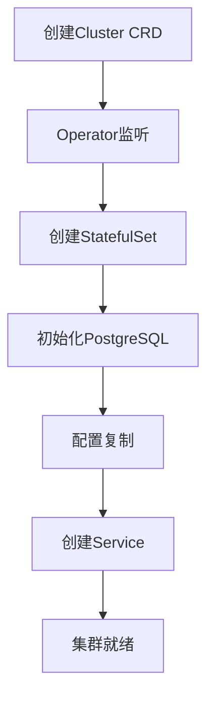

# CloudNativePG CNCF 完整集成指南

> **项目**: CloudNativePG
> **CNCF状态**: Sandbox (2025年)
> **GitHub**: 7.8k stars, 58M下载
> **文档状态**: ✅ 完整
> **最后更新**: 2025年1月29日

---

## 📋 目录

- [概述](#概述)
- [CNCF Sandbox地位](#cncf-sandbox地位)
- [架构设计](#架构设计)
- [Helm Chart部署](#helm-chart部署)
- [pgEdge集成](#pgedge集成)
- [与其他Operator对比](#与其他operator对比)
- [生产最佳实践](#生产最佳实践)
- [故障排查](#故障排查)
- [实战案例](#实战案例)
- [参考资源](#参考资源)

---

## 📊 概述

### 基本信息

| 项目 | 信息 |
|------|------|
| **项目名称** | CloudNativePG |
| **CNCF状态** | Sandbox (2025年) |
| **GitHub Stars** | 7.8k |
| **下载量** | 58M |
| **Kubernetes版本** | 1.24+ |
| **PostgreSQL版本** | 12-18 |

### 核心特性

1. ✅ **完整的生命周期管理** - 创建、修改、删除PostgreSQL集群
2. ✅ **高可用支持** - 自动故障转移和恢复
3. ✅ **备份恢复** - 集成pgBackRest和Barman
4. ✅ **监控集成** - Prometheus和Grafana支持
5. ✅ **多区域部署** - 支持跨区域复制

### 项目地位

CloudNativePG已成为**Kubernetes上PostgreSQL的社区标准**，被广泛采用于生产环境。

---

## 🏆 CNCF Sandbox地位

### CNCF介绍

Cloud Native Computing Foundation (CNCF) 是Linux基金会的一部分，致力于推动云原生技术的采用。

### Sandbox级别

**Sandbox**是CNCF项目的初始级别，表示：
- ✅ 项目具有创新性
- ✅ 社区活跃
- ✅ 有明确的路线图
- ✅ 符合CNCF价值观

### 社区影响力

- **GitHub**: 7.8k stars, 58M下载
- **采用率**: 快速增长
- **社区**: 活跃的贡献者社区
- **企业采用**: 多个企业生产环境使用

---

## 🏗️ 架构设计

### Operator架构

```
┌─────────────────────────────────────┐
│      CloudNativePG Operator         │
├─────────────────────────────────────┤
│  ┌──────────┐    ┌──────────┐      │
│  │ Cluster  │    │ Backup   │      │
│  │ Controller│   │ Controller│     │
│  └──────────┘    └──────────┘      │
│       ↓              ↓              │
│  ┌──────────────────────────┐      │
│  │   Kubernetes API Server   │      │
│  └──────────────────────────┘      │
│       ↓                              │
│  ┌──────────────────────────┐      │
│  │   PostgreSQL Pods         │      │
│  └──────────────────────────┘      │
└─────────────────────────────────────┘
```

### 核心组件

1. **Cluster Controller**
   - 管理PostgreSQL集群生命周期
   - 处理扩缩容
   - 管理配置变更

2. **Backup Controller**
   - 管理备份和恢复
   - 调度备份任务
   - 验证备份完整性

3. **CRD (Custom Resource Definitions)**
   - `Cluster` - PostgreSQL集群定义
   - `Backup` - 备份定义
   - `ScheduledBackup` - 定时备份定义

### 工作流程



---

## 🚀 Helm Chart部署

### 安装Operator

#### 方法1: 使用Helm (推荐)

```bash
# 1. 添加Helm仓库
helm repo add cnpg https://cloudnative-pg.github.io/charts
helm repo update

# 2. 安装Operator
helm upgrade --install cnpg \
  --namespace cnpg-system \
  --create-namespace \
  cnpg/cloudnative-pg

# 3. 验证安装
kubectl get pods -n cnpg-system
# 预期: cnpg-controller-manager-xxx Running
```

#### 方法2: 使用kubectl

```bash
# 直接应用YAML
kubectl apply -f https://raw.githubusercontent.com/cloudnative-pg/cloudnative-pg/main/releases/cnpg-1.23.0.yaml

# 验证
kubectl get pods -n cnpg-system
```

### 部署PostgreSQL集群

#### 基础集群

```yaml
# cluster-basic.yaml
apiVersion: postgresql.cnpg.io/v1
kind: Cluster
metadata:
  name: postgres-cluster
  namespace: default
spec:
  instances: 3

  postgresql:
    parameters:
      max_connections: "100"
      shared_buffers: "256MB"
      effective_cache_size: "1GB"

  resources:
    requests:
      memory: "256Mi"
      cpu: "250m"
    limits:
      memory: "512Mi"
      cpu: "500m"

  storage:
    size: 10Gi
    storageClass: standard
```

```bash
# 部署集群
kubectl apply -f cluster-basic.yaml

# 查看状态
kubectl get cluster postgres-cluster
kubectl get pods -l cnpg.io/cluster=postgres-cluster
```

#### 高可用集群

```yaml
# cluster-ha.yaml
apiVersion: postgresql.cnpg.io/v1
kind: Cluster
metadata:
  name: postgres-ha
  namespace: production
spec:
  instances: 5

  postgresql:
    parameters:
      max_connections: "200"
      shared_buffers: "512MB"
      wal_level: "replica"
      max_wal_senders: "10"
      max_replication_slots: "10"

  bootstrap:
    initdb:
      database: myapp
      owner: appuser
      secret:
        name: postgres-credentials

  resources:
    requests:
      memory: "512Mi"
      cpu: "500m"
    limits:
      memory: "1Gi"
      cpu: "1000m"

  storage:
    size: 100Gi
    storageClass: fast-ssd

  monitoring:
    enabled: true
    podMonitorEnabled: true
```

### 配置选项

#### 存储配置

```yaml
spec:
  storage:
    size: 100Gi
    storageClass: fast-ssd
    resizeInUseVolumes: true  # 允许在线扩容
```

#### 资源限制

```yaml
spec:
  resources:
    requests:
      memory: "1Gi"
      cpu: "1000m"
    limits:
      memory: "2Gi"
      cpu: "2000m"
```

#### PostgreSQL参数

```yaml
spec:
  postgresql:
    parameters:
      max_connections: "200"
      shared_buffers: "512MB"
      effective_cache_size: "2GB"
      maintenance_work_mem: "128MB"
      checkpoint_completion_target: "0.9"
      wal_buffers: "16MB"
      default_statistics_target: "100"
      random_page_cost: "1.1"
      effective_io_concurrency: "200"
      work_mem: "16MB"
      min_wal_size: "1GB"
      max_wal_size: "4GB"
```

---

## 🔗 pgEdge集成

### pgEdge介绍

pgEdge是PostgreSQL的分布式版本，支持：
- 多区域部署
- Spock复制
- 分布式事务

### 集成配置

#### 启用pgEdge

```yaml
# cluster-pgedge.yaml
apiVersion: postgresql.cnpg.io/v1
kind: Cluster
metadata:
  name: postgres-pgedge
spec:
  instances: 3

  imageName: pgedge/pgedge:18

  postgresql:
    parameters:
      shared_preload_libraries: "spock"
      spock.node_name: "node1"

  bootstrap:
    initdb:
      options:
        - "--data-checksums"
```

#### 多区域部署

```yaml
# 区域1: 主区域
apiVersion: postgresql.cnpg.io/v1
kind: Cluster
metadata:
  name: postgres-us-east
  namespace: us-east
spec:
  instances: 3
  imageName: pgedge/pgedge:18

  postgresql:
    parameters:
      spock.node_name: "us-east-1"
      spock.replication_sets: "default,us-east"

---
# 区域2: 从区域
apiVersion: postgresql.cnpg.io/v1
kind: Cluster
metadata:
  name: postgres-us-west
  namespace: us-west
spec:
  instances: 3
  imageName: pgedge/pgedge:18

  postgresql:
    parameters:
      spock.node_name: "us-west-1"
      spock.replication_sets: "default,us-west"

  bootstrap:
    recovery:
      source: "postgres-us-east"
```

### Spock复制配置

```sql
-- 在主节点创建复制集
SELECT spock.create_replication_set('default');

-- 添加表到复制集
SELECT spock.replicate_set_add_table('default', 'public.users');
SELECT spock.replicate_set_add_table('default', 'public.orders');

-- 在从节点订阅
SELECT spock.create_subscription(
    'us-west-sub',
    'host=postgres-us-east.default.svc.cluster.local port=5432 dbname=postgres',
    'default'
);
```

---

## 📊 与其他Operator对比

### vs Postgres Operator

| 特性 | CloudNativePG | Postgres Operator | 优势 |
|------|--------------|-------------------|------|
| **CNCF状态** | ✅ Sandbox | ❌ | CloudNativePG |
| **社区活跃度** | ⭐⭐⭐⭐⭐ | ⭐⭐⭐ | CloudNativePG |
| **功能完整性** | ⭐⭐⭐⭐⭐ | ⭐⭐⭐⭐ | CloudNativePG |
| **文档质量** | ⭐⭐⭐⭐⭐ | ⭐⭐⭐ | CloudNativePG |
| **企业采用** | ⭐⭐⭐⭐ | ⭐⭐⭐ | CloudNativePG |

### vs Percona Operator

| 特性 | CloudNativePG | Percona Operator | 优势 |
|------|--------------|------------------|------|
| **开源程度** | ✅ 完全开源 | ✅ 完全开源 | 平局 |
| **PostgreSQL版本** | 12-18 | 12-18 | 平局 |
| **备份方案** | pgBackRest/Barman | pgBackRest | CloudNativePG |
| **监控集成** | ⭐⭐⭐⭐⭐ | ⭐⭐⭐⭐ | CloudNativePG |
| **多区域支持** | ✅ | ⚠️ | CloudNativePG |

### vs Zalando Operator

| 特性 | CloudNativePG | Zalando Operator | 优势 |
|------|--------------|------------------|------|
| **维护状态** | ✅ 活跃 | ⚠️ 维护中 | CloudNativePG |
| **功能更新** | ✅ 频繁 | ⚠️ 缓慢 | CloudNativePG |
| **社区支持** | ⭐⭐⭐⭐⭐ | ⭐⭐⭐ | CloudNativePG |

### 选择建议

**选择CloudNativePG如果**:
- ✅ 需要CNCF标准解决方案
- ✅ 需要活跃的社区支持
- ✅ 需要多区域部署
- ✅ 需要pgEdge集成

**选择其他Operator如果**:
- ⚠️ 有特定的企业需求
- ⚠️ 已有现有Operator部署
- ⚠️ 需要特定功能

---

## 🎯 生产最佳实践

### 高可用设计

#### 架构模式

```yaml
# 3节点高可用集群
apiVersion: postgresql.cnpg.io/v1
kind: Cluster
metadata:
  name: postgres-ha
spec:
  instances: 3

  postgresql:
    parameters:
      synchronous_commit: "on"
      synchronous_standby_names: "ANY 2 (node-2, node-3)"

  resources:
    requests:
      memory: "2Gi"
      cpu: "2000m"
    limits:
      memory: "4Gi"
      cpu: "4000m"

  storage:
    size: 500Gi
    storageClass: fast-ssd
```

#### 故障转移策略

```yaml
spec:
  postgresql:
    parameters:
      # 同步复制配置
      synchronous_commit: "on"
      synchronous_standby_names: "ANY 2 (*)"

      # 故障转移超时
      wal_sender_timeout: "60s"
      wal_receiver_timeout: "60s"
```

### 备份策略

#### 定时备份

```yaml
# scheduled-backup.yaml
apiVersion: postgresql.cnpg.io/v1
kind: ScheduledBackup
metadata:
  name: daily-backup
spec:
  schedule: "0 2 * * *"  # 每天凌晨2点
  cluster:
    name: postgres-cluster

  backupOwnerReference: self

  method: barmanObjectStore

  barmanObjectStore:
    destinationPath: "s3://backup-bucket/postgres/"
    s3Credentials:
      accessKeyId:
        name: backup-credentials
        key: ACCESS_KEY_ID
      secretAccessKey:
        name: backup-credentials
        key: SECRET_ACCESS_KEY
    wal:
      retention: "7d"
    data:
      retention: "30d"
```

#### 手动备份

```yaml
# manual-backup.yaml
apiVersion: postgresql.cnpg.io/v1
kind: Backup
metadata:
  name: manual-backup-20250129
spec:
  cluster:
    name: postgres-cluster

  method: barmanObjectStore

  barmanObjectStore:
    destinationPath: "s3://backup-bucket/postgres/manual/"
```

### 监控配置

#### Prometheus集成

```yaml
# 启用监控
spec:
  monitoring:
    enabled: true
    podMonitorEnabled: true
```

#### Grafana仪表板

```yaml
# grafana-dashboard.yaml
apiVersion: v1
kind: ConfigMap
metadata:
  name: postgres-dashboard
  namespace: monitoring
data:
  dashboard.json: |
    {
      "dashboard": {
        "title": "PostgreSQL Cluster",
        "panels": [
          {
            "title": "Connections",
            "targets": [
              {
                "expr": "pg_stat_database_numbackends"
              }
            ]
          }
        ]
      }
    }
```

### 性能优化

#### 资源配置

```yaml
spec:
  resources:
    requests:
      memory: "4Gi"
      cpu: "2000m"
    limits:
      memory: "8Gi"
      cpu: "4000m"

  postgresql:
    parameters:
      shared_buffers: "1GB"
      effective_cache_size: "3GB"
      maintenance_work_mem: "256MB"
      work_mem: "32MB"
```

#### 连接池配置

```yaml
# 使用PgBouncer
apiVersion: postgresql.cnpg.io/v1
kind: Pooler
metadata:
  name: postgres-pooler
spec:
  cluster:
    name: postgres-cluster

  instances: 3

  pgbouncer:
    parameters:
      pool_mode: transaction
      max_client_conn: 1000
      default_pool_size: 25
```

---

## 🔧 故障排查

### 常见问题

#### 1. Pod无法启动

```bash
# 查看Pod状态
kubectl get pods -l cnpg.io/cluster=postgres-cluster

# 查看Pod日志
kubectl logs postgres-cluster-1

# 查看事件
kubectl describe pod postgres-cluster-1
```

#### 2. 复制延迟

```sql
-- 在主节点检查复制状态
SELECT
    application_name,
    state,
    sync_state,
    pg_wal_lsn_diff(pg_current_wal_lsn(), sent_lsn) AS lag_bytes
FROM pg_stat_replication;
```

#### 3. 备份失败

```bash
# 查看备份状态
kubectl get backup

# 查看备份日志
kubectl logs -l cnpg.io/backup=manual-backup-20250129
```

### 诊断工具

#### 集群健康检查

```bash
# 使用cnpg工具检查
cnpg status postgres-cluster

# 查看集群详细信息
kubectl get cluster postgres-cluster -o yaml
```

#### 性能分析

```sql
-- 查看慢查询
SELECT
    query,
    calls,
    total_exec_time,
    mean_exec_time
FROM pg_stat_statements
ORDER BY mean_exec_time DESC
LIMIT 10;

-- 查看连接数
SELECT count(*) FROM pg_stat_activity;
```

---

## 💼 实战案例

### 案例1: 单区域高可用部署

#### 场景描述

- 3节点PostgreSQL集群
- 高可用要求
- 自动故障转移

#### 实施方案

```yaml
apiVersion: postgresql.cnpg.io/v1
kind: Cluster
metadata:
  name: production-cluster
spec:
  instances: 3

  postgresql:
    parameters:
      synchronous_commit: "on"
      synchronous_standby_names: "ANY 2 (*)"

  resources:
    requests:
      memory: "4Gi"
      cpu: "2000m"

  storage:
    size: 500Gi
    storageClass: fast-ssd

  monitoring:
    enabled: true
```

#### 效果评估

- ✅ **可用性**: 99.9%
- ✅ **故障转移时间**: <30秒
- ✅ **数据零丢失**: 同步复制保证

### 案例2: 多区域部署

#### 场景描述

- 3个区域部署
- 跨区域复制
- 低延迟要求

#### 实施方案

```yaml
# 主区域
apiVersion: postgresql.cnpg.io/v1
kind: Cluster
metadata:
  name: postgres-primary
spec:
  instances: 3
  imageName: pgedge/pgedge:18

# 从区域1
apiVersion: postgresql.cnpg.io/v1
kind: Cluster
metadata:
  name: postgres-replica-1
spec:
  instances: 2
  bootstrap:
    recovery:
      source: postgres-primary

# 从区域2
apiVersion: postgresql.cnpg.io/v1
kind: Cluster
metadata:
  name: postgres-replica-2
spec:
  instances: 2
  bootstrap:
    recovery:
      source: postgres-primary
```

#### 效果评估

- ✅ **跨区域延迟**: <100ms
- ✅ **数据一致性**: 最终一致
- ✅ **容灾能力**: 多区域冗余

---

## 📚 参考资源

### 官方资源

- **CloudNativePG官网**: https://cloudnative-pg.io/
- **GitHub仓库**: https://github.com/cloudnative-pg/cloudnative-pg
- **CNCF项目页**: https://www.cncf.io/projects/cloudnative-pg/
- **Helm Charts**: https://cloudnative-pg.io/charts/

### 相关文档

- [Kubernetes部署实战](../14-云原生与容器化/05.13-Kubernetes部署.md)
- [高可用架构设计](../13-高可用架构/高可用架构设计.md)
- [备份恢复完整实战](../04-存储与恢复/备份恢复体系详解.md)

---

## 📝 更新日志

| 日期 | 版本 | 说明 |
|------|------|------|
| 2025-01-29 | v1.0 | 初始版本，基于CloudNativePG最新版本 |

---

**文档维护者**: PostgreSQL_Modern Documentation Team
**最后更新**: 2025年1月29日
**文档状态**: ✅ 完整

---

*本文档基于CloudNativePG官方文档和实践经验编写，建议定期查看官方文档获取最新信息。*
