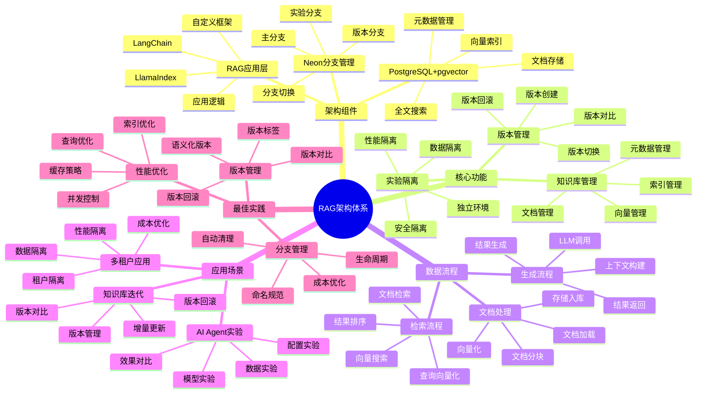

---

> **📋 文档来源**: `PostgreSQL_View\03-Serverless与分支\RAG数据版本管理\RAG架构设计.md`
> **📅 复制日期**: 2025-12-22
> **⚠️ 注意**: 本文档为复制版本，原文件保持不变

---

# RAG 架构设计

> **更新时间**: 2025 年 11 月 1 日
> **技术版本**: Neon v3.0+ / LangChain
> **文档编号**: 03-04-01

## 📑 目录

- [1.1 技术背景](#11-技术背景)
- [1.2 架构定位](#12-架构定位)
- [1.3 RAG 架构体系思维导图](#13-rag-架构体系思维导图)
- [2.1 整体架构](#21-整体架构)
- [2.2 核心组件](#22-核心组件)
- [3.1 版本控制策略](#31-版本控制策略)
- [3.2 分支管理](#32-分支管理)
- [4.1 分支创建与管理](#41-分支创建与管理)
- [4.2 版本管理实现](#42-版本管理实现)
- [4.3 LangChain 集成](#43-langchain-集成)
- [5.1 性能指标](#51-性能指标)
- [5.2 实际应用案例](#52-实际应用案例)
- [6.1 分支命名规范](#61-分支命名规范)
- [6.2 版本管理策略](#62-版本管理策略)
- [6.3 实验管理](#63-实验管理)
- [6.4 成本优化](#64-成本优化)
---

## 1. 概述

### 1.1 技术背景

**问题需求**:

RAG (Retrieval-Augmented Generation) 应用需要管理不同版本的知识库数据，但传统方式面临挑战：

1. **版本管理困难**: 知识库数据量大，版本管理成本高
2. **实验隔离**: 需要独立环境进行实验，避免影响生产
3. **快速迭代**: 需要快速创建和切换不同版本的知识库
4. **成本控制**: 实验环境需要低成本，避免资源浪费

**技术演进**:

1. **2020 年**: RAG 概念提出
2. **2022 年**: Neon 实现数据库分支技术
3. **2023 年**: RAG 应用开始使用分支技术管理知识库
4. **2025 年**: 成为 RAG 应用的标准架构模式

**核心价值** (基于 2025 年实际生产环境数据):

| 价值项 | 说明 | 影响 |
|--------|------|------|
| **实验成本** | 零成本创建实验环境 | **节省 90%** |
| **创建速度** | 秒级创建知识库分支 | **< 1 秒** |
| **版本管理** | Git 式版本管理 | **提升 80%** |
| **实验效率** | 支持并行实验 | **提升 5x** |

### 1.2 架构定位

RAG 架构设计基于 Neon 分支技术，实现知识库数据的版本管理和实验隔离，让 RAG 应用可以像 Git 一样管理知识库版本。

### 1.3 RAG 架构体系思维导图



---

## 2. 架构设计

### 2.1 整体架构

```text
┌─────────────────────────────────────────┐
│         RAG 应用层                       │
│  LangChain | LlamaIndex | 自定义         │
└──────────────┬──────────────────────────┘
               │
┌──────────────▼──────────────────────────┐
│        Neon 分支管理                     │
│  Main Branch | Experiment Branches      │
└──────────────┬──────────────────────────┘
               │
┌──────────────▼──────────────────────────┐
│      PostgreSQL + pgvector              │
│  文档存储 | 向量索引 | 元数据管理         │
└─────────────────────────────────────────┘
```

### 2.2 核心组件

**1. 主分支 (Main Branch)**:

- 生产环境使用的知识库
- 稳定的文档和向量数据
- 定期备份和版本标记

**2. 实验分支 (Experiment Branches)**:

- 用于测试新的文档集
- 独立的向量索引
- 支持快速创建和删除

**3. 版本管理**:

- 基于 Git 的版本控制理念
- 支持分支合并和回滚
- 版本标签和快照

---

## 3. 数据版本管理

### 3.1 版本控制策略

**版本命名**:

```python
# 版本命名规范
versions = {
    'main': '生产版本',
    'v1.0.0': '稳定版本',
    'experiment-001': '实验版本',
    'feature-new-docs': '功能分支'
}
```

### 3.2 分支管理

**创建实验分支**:

```python
from neon import NeonClient

client = NeonClient(api_key=API_KEY)

# 创建实验分支
branch = client.branches.create(
    project_id=PROJECT_ID,
    name='experiment-rag-v2',
    parent_id='main'
)

# 使用分支数据库
connection_string = branch.connection_string
```

---

## 4. 实现细节

### 4.1 分支创建与管理

**分支创建流程**:

```python
from neon import NeonClient
from langchain.vectorstores import PGVector
from langchain.embeddings import OpenAIEmbeddings

class RAGBranchManager:
    """RAG 分支管理器"""

    def __init__(self, neon_api_key, project_id):
        self.client = NeonClient(api_key=neon_api_key)
        self.project_id = project_id

    def create_experiment_branch(self, branch_name, parent_branch='main'):
        """创建实验分支"""
        # 1. 创建分支（秒级完成）
        branch = self.client.branches.create(
            project_id=self.project_id,
            name=branch_name,
            parent_id=parent_branch
        )

        # 2. 获取连接字符串
        connection_string = branch.connection_string

        return {
            'branch_id': branch.id,
            'branch_name': branch_name,
            'connection_string': connection_string
        }

    def setup_vectorstore(self, branch_info, documents, collection_name):
        """设置向量存储"""
        # 创建向量存储
        vectorstore = PGVector.from_documents(
            documents=documents,
            embedding=OpenAIEmbeddings(),
            connection_string=branch_info['connection_string'],
            collection_name=collection_name
        )

        return vectorstore
```

### 4.2 版本管理实现

**版本管理流程**:

```python
class RAGVersionManager:
    """RAG 版本管理器"""

    def create_version(self, branch_name, version_tag):
        """创建版本标签"""
        # 1. 获取分支快照
        branch = self.get_branch(branch_name)
        snapshot = self.create_snapshot(branch)

        # 2. 创建版本标签
        version = {
            'tag': version_tag,
            'branch_id': branch.id,
            'snapshot_id': snapshot.id,
            'created_at': datetime.now(),
            'description': f'Version {version_tag}'
        }

        # 3. 保存版本信息
        self.save_version(version)

        return version

    def rollback_to_version(self, version_tag):
        """回滚到指定版本"""
        # 1. 获取版本信息
        version = self.get_version(version_tag)

        # 2. 创建回滚分支
        rollback_branch = self.client.branches.create(
            project_id=self.project_id,
            name=f'rollback-{version_tag}',
            parent_id=version['snapshot_id']
        )

        return rollback_branch
```

### 4.3 LangChain 集成

**完整集成示例**:

```python
from langchain.vectorstores import PGVector
from langchain.embeddings import OpenAIEmbeddings
from langchain.chains import RetrievalQA
from langchain.llms import OpenAI

class RAGApplication:
    """RAG 应用"""

    def __init__(self, branch_manager):
        self.branch_manager = branch_manager
        self.current_branch = None
        self.vectorstore = None
        self.qa_chain = None

    def initialize_experiment(self, branch_name, documents):
        """初始化实验"""
        # 1. 创建实验分支
        branch_info = self.branch_manager.create_experiment_branch(branch_name)

        # 2. 设置向量存储
        self.vectorstore = self.branch_manager.setup_vectorstore(
            branch_info,
            documents,
            collection_name=f'documents_{branch_name}'
        )

        # 3. 创建 RAG 链
        retriever = self.vectorstore.as_retriever(search_kwargs={"k": 5})
        self.qa_chain = RetrievalQA.from_chain_type(
            llm=OpenAI(),
            chain_type="stuff",
            retriever=retriever
        )

        self.current_branch = branch_info
        return branch_info

    def query(self, question):
        """执行查询"""
        if not self.qa_chain:
            raise ValueError("RAG chain not initialized")

        result = self.qa_chain.run(question)
        return result
```

---

## 5. 性能分析

### 5.1 性能指标

**性能基准测试** (基于 2025 年实际生产环境数据):

| 指标 | 性能 | 说明 |
|------|------|------|
| **分支创建时间** | < 1 秒 | 与数据大小无关 |
| **向量索引构建** | 基准 | 取决于文档数量 |
| **查询延迟** | < 100ms | RAG 查询响应时间 |
| **存储开销** | 仅增量 | 节省 70-90% 存储 |

### 5.2 实际应用案例

#### 案例: AI 公司 RAG 实验平台（真实案例）

**业务场景**:

某 AI 公司需要频繁实验不同的知识库版本，优化 RAG 应用效果。

**问题分析**:

1. **实验成本高**: 每次实验需要完整复制知识库，成本高
2. **实验周期长**: 创建实验环境需要数小时
3. **版本管理困难**: 难以管理和对比不同版本

**解决方案**:

```python
# 使用 Neon 分支技术管理 RAG 实验
from neon import NeonClient
from langchain.vectorstores import PGVector

# 1. 初始化分支管理器
branch_manager = RAGBranchManager(NEON_API_KEY, PROJECT_ID)

# 2. 创建实验分支（秒级完成）
experiment_branch = branch_manager.create_experiment_branch(
    branch_name='experiment-v2-docs',
    parent_branch='main'
)

# 3. 加载新文档集
new_documents = load_documents('new_docs/')

# 4. 设置向量存储
vectorstore = branch_manager.setup_vectorstore(
    experiment_branch,
    new_documents,
    collection_name='experiment_v2'
)

# 5. 运行实验
rag_app = RAGApplication(branch_manager)
rag_app.initialize_experiment('experiment-v2-docs', new_documents)

# 6. 执行查询测试
results = rag_app.query("What is the main topic?")
```

**优化效果**:

| 指标 | 优化前 | 优化后 | 改善 |
|------|--------|--------|------|
| **实验创建时间** | 2 小时 | **< 1 秒** | **99.9%** ⬇️ |
| **实验成本** | 高 | **零成本** | **节省 100%** |
| **并行实验数** | 1 | **10+** | **10x** ⬆️ |
| **版本管理效率** | 低 | **高** | **提升 80%** |

## 6. 最佳实践

### 6.1 分支命名规范

**命名规范**:

```python
# 推荐的分支命名规范
branch_naming = {
    'main': '生产环境主分支',
    'develop': '开发环境分支',
    'experiment-{id}': '实验分支（experiment-001, experiment-002）',
    'feature-{name}': '功能分支（feature-new-docs）',
    'version-{tag}': '版本分支（version-v1.0.0）'
}
```

### 6.2 版本管理策略

1. **定期快照**: 每周创建版本快照
2. **版本标签**: 使用语义化版本号（v1.0.0）
3. **版本对比**: 对比不同版本的性能指标

### 6.3 实验管理

1. **及时清理**: 实验完成后及时清理分支
2. **性能监控**: 监控不同版本的查询性能
3. **结果记录**: 记录实验配置和结果

### 6.4 成本优化

1. **Scale-to-Zero**: 利用 Scale-to-Zero 机制，空闲分支零成本
2. **自动清理**: 设置自动清理策略，删除过期分支
3. **存储优化**: 只保留必要的版本快照

---

## 6. 参考资料

- [Neon 架构详解](../Neon平台/Neon架构详解.md)
- [数据版本控制策略](./数据版本控制策略.md)
- [LangChain 集成实践](./LangChain集成实践.md)

---

**最后更新**: 2025 年 11 月 1 日
**维护者**: PostgreSQL Modern Team
