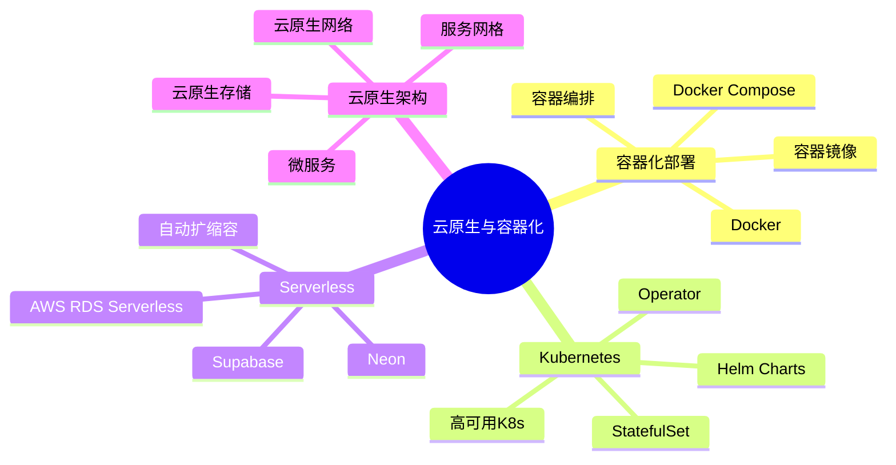
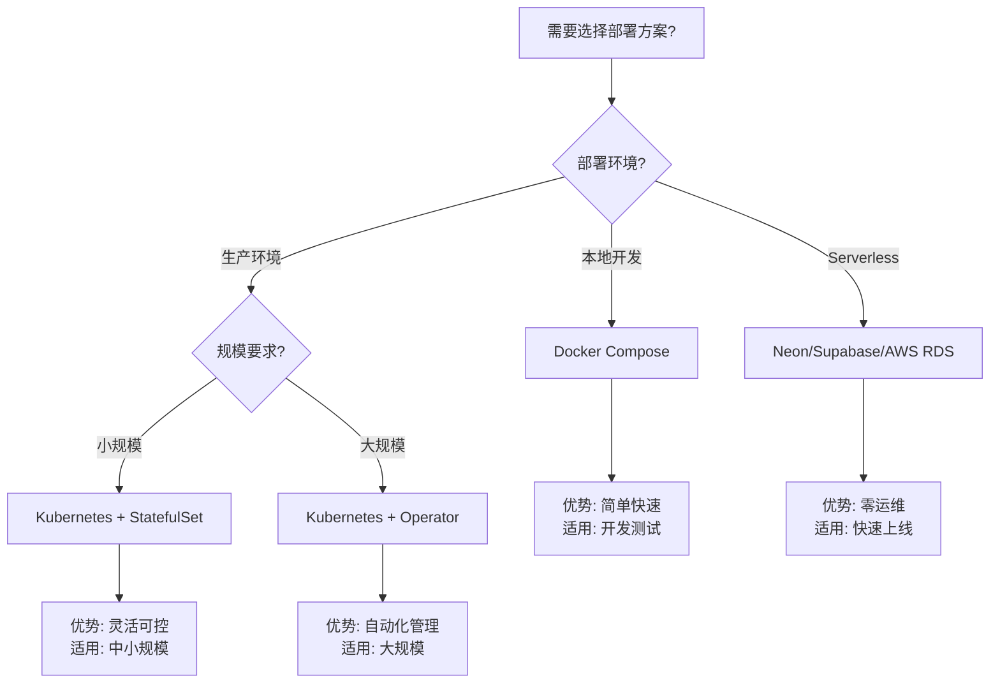

---

> **📋 文档来源**: `kubernetes\README.md`
> **📅 复制日期**: 2025-12-22
> **⚠️ 注意**: 本文档为复制版本，原文件保持不变

---

# PostgreSQL 18 on Kubernetes 完整指南

本目录包含在Kubernetes上部署PostgreSQL 18的完整配置和指南。

---

## 📂 目录结构

```text
kubernetes/
├── README.md                          # 本文件
├── postgresql-operator.yaml           # CloudNativePG Operator完整配置
├── helm-values.yaml                   # Helm Charts配置
├── monitoring/                        # 监控配置
│   ├── servicemonitor.yaml
│   └── grafana-dashboard.json
└── examples/                          # 示例应用
    └── app-deployment.yaml
```

---

## 🚀 快速开始

### 方式1: 使用CloudNativePG Operator（推荐）

```bash
# 1. 安装Operator
kubectl apply -f https://raw.githubusercontent.com/cloudnative-pg/cloudnative-pg/release-1.22/releases/cnpg-1.22.0.yaml

# 2. 创建Secrets
kubectl create secret generic postgres-app-user \
  --from-literal=username=app_user \
  --from-literal=password=$(openssl rand -base64 32) \
  -n postgresql-system

kubectl create secret generic s3-credentials \
  --from-literal=ACCESS_KEY_ID=your_key \
  --from-literal=SECRET_ACCESS_KEY=your_secret \
  -n postgresql-system

# 3. 部署PostgreSQL集群
kubectl apply -f postgresql-operator.yaml

# 4. 查看状态
kubectl get cluster -n postgresql-system
kubectl get pods -n postgresql-system -w
```

### 方式2: 使用Helm Charts

```bash
# 1. 添加Helm仓库
helm repo add cnpg https://cloudnative-pg.github.io/charts
helm repo update

# 2. 安装
helm install postgres cnpg/cloudnative-pg \
  -n postgresql-system \
  --create-namespace \
  -f helm-values.yaml

# 3. 查看状态
helm status postgres -n postgresql-system
```

---

## 📋 配置说明

### PostgreSQL 18优化配置

postgresql-operator.yaml中的关键配置：

```yaml
postgresql:
  parameters:
    # ⭐ PostgreSQL 18新特性
    io_direct: "data,wal"              # 异步I/O (+35%性能)
    io_combine_limit: "256kB"
    enable_skip_scan: "on"             # Skip Scan优化

    # 内存配置（16GB Pod）
    shared_buffers: "4GB"              # 25%内存
    effective_cache_size: "12GB"       # 75%内存

    # 并行查询
    max_parallel_workers_per_gather: "4"

    # JIT编译
    jit: "on"
```

---

## 🎯 架构设计

### 高可用架构

```text
┌─────────────────────────────────────────────────┐
│            Kubernetes Cluster                    │
├─────────────────────────────────────────────────┤
│                                                  │
│   ┌─────────────────┐                           │
│   │   LoadBalancer  │  (Ingress/Service)        │
│   └────────┬────────┘                           │
│            │                                     │
│   ┌────────▼────────┐                           │
│   │   pgBouncer×3   │  (连接池)                │
│   └────────┬────────┘                           │
│            │                                     │
│   ┌────────┴────────┐                           │
│   │                 │                           │
│ ┌─▼──┐  ┌───┐  ┌───┐                           │
│ │Pod1│  │Pod2│ │Pod3│  PostgreSQL 18 (1主2从)  │
│ │主库│  │从库││从库│                            │
│ └─┬──┘  └─┬─┘ └─┬─┘                            │
│   │       │     │                               │
│   └───────┴─────┘                               │
│           │                                     │
│   ┌───────▼───────┐                             │
│   │  PVC (SSD)    │  持久化存储                │
│   └───────────────┘                             │
│                                                  │
└─────────────────────────────────────────────────┘

外部服务:
- S3/OSS: WAL归档和备份
- Prometheus: 指标收集
- Grafana: 可视化
```

---

## 🔧 常用操作

### 连接数据库

```bash
# 方式1: kubectl port-forward
# 主库（读写）
kubectl port-forward svc/postgres-rw 5432:5432 -n postgresql-system
psql -h localhost -p 5432 -U app_user mydb

# 从库（只读）
kubectl port-forward svc/postgres-ro 5433:5432 -n postgresql-system
psql -h localhost -p 5433 -U app_user mydb

# 方式2: 在集群内访问
# 主库: postgres-rw.postgresql-system.svc.cluster.local:5432
# 从库: postgres-ro.postgresql-system.svc.cluster.local:5432

# 方式3: kubectl exec
kubectl exec -it postgres-cluster-1 -n postgresql-system -- psql -U postgres
```

### 备份操作

```bash
# 立即备份
kubectl cnpg backup postgres-cluster -n postgresql-system

# 查看备份
kubectl get backup -n postgresql-system

# 从备份恢复
kubectl apply -f - <<EOF
apiVersion: postgresql.cnpg.io/v1
kind: Cluster
metadata:
  name: postgres-restored
spec:
  instances: 3
  bootstrap:
    recovery:
      backup:
        name: backup-20241205-020000
EOF
```

### 扩缩容

```bash
# 扩容（增加从库）
kubectl cnpg scale postgres-cluster --replicas=5 -n postgresql-system

# 缩容
kubectl cnpg scale postgres-cluster --replicas=2 -n postgresql-system

# 垂直扩容（增加资源）
kubectl edit cluster postgres-cluster -n postgresql-system
# 修改resources配置，Operator会滚动更新
```

### 故障转移

```bash
# 手动切换主库
kubectl cnpg promote postgres-cluster-2 -n postgresql-system

# 模拟主库故障
kubectl delete pod postgres-cluster-1 -n postgresql-system

# Operator自动处理：
# 1. 检测主库down（10-15秒）
# 2. 选举新主库（5-10秒）
# 3. 更新服务endpoint（5秒）
# 总停机时间: ~30秒
```

---

## 📊 监控

### Prometheus指标

```bash
# 查看可用指标
kubectl port-forward svc/postgres-cluster 9187:9187 -n postgresql-system
curl http://localhost:9187/metrics
```

**关键指标**:

- `cnpg_pg_database_size_bytes`: 数据库大小
- `cnpg_pg_stat_activity_count`: 活跃连接数
- `cnpg_pg_replication_lag_seconds`: 复制延迟
- `cnpg_pg_stat_database_xact_commit_total`: 事务提交数
- `cnpg_pg_stat_database_blks_hit_total`: 缓存命中数

### Grafana仪表板

```bash
# 导入预配置仪表板
kubectl apply -f monitoring/grafana-dashboard.json

# 访问Grafana
kubectl port-forward svc/grafana 3000:3000
open http://localhost:3000
```

---

## 🛡️ 安全配置

### TLS配置

```yaml
spec:
  certificates:
    serverTLSSecret: postgres-server-cert
    serverCASecret: postgres-ca-cert
    clientCASecret: postgres-client-ca-cert
    replicationTLSSecret: postgres-replication-cert
```

### RBAC配置

```bash
# 创建应用专用ServiceAccount
kubectl create serviceaccount app-postgres -n app-namespace

# 授权访问PostgreSQL服务
kubectl create rolebinding app-postgres-binding \
  --serviceaccount=app-namespace:app-postgres \
  --role=postgres-client \
  -n postgresql-system
```

---

## 🧪 测试验证

### 功能测试

```bash
# 1. 连接测试
kubectl run -it --rm psql-test \
  --image=postgres:18 \
  --restart=Never \
  -n postgresql-system \
  -- psql -h postgres-rw -U app_user mydb

# 2. 写入测试（主库）
psql -h postgres-rw -c "CREATE TABLE test (id INT);"
psql -h postgres-rw -c "INSERT INTO test VALUES (1);"

# 3. 读取测试（从库）
psql -h postgres-ro -c "SELECT * FROM test;"

# 4. 故障转移测试
kubectl delete pod postgres-cluster-1
# 等待30秒
psql -h postgres-rw -c "SELECT 1;"  # 应该成功
```

### 性能测试

```bash
# pgbench测试
kubectl run pgbench \
  --image=postgres:18 \
  -n postgresql-system \
  --rm -it \
  -- pgbench -h postgres-rw -U app_user -i -s 100 mydb

kubectl run pgbench \
  --image=postgres:18 \
  -n postgresql-system \
  --rm -it \
  -- pgbench -h postgres-rw -U app_user -c 50 -j 4 -t 10000 mydb
```

---

## 📖 最佳实践

### 1. 资源规划

```yaml
# 根据工作负载规划资源

# 小型（开发/测试）
resources:
  requests: {memory: "2Gi", cpu: "1"}
  limits: {memory: "4Gi", cpu: "2"}
storage: 50Gi

# 中型（小规模生产）
resources:
  requests: {memory: "8Gi", cpu: "2"}
  limits: {memory: "16Gi", cpu: "4"}
storage: 200Gi

# 大型（大规模生产）
resources:
  requests: {memory: "16Gi", cpu: "4"}
  limits: {memory: "32Gi", cpu: "8"}
storage: 500Gi
```

### 2. 存储选择

```yaml
# 推荐使用SSD StorageClass
storageClass: fast-ssd  # 或 gp3-ssd (AWS)

# 性能要求：
# - IOPS: 3000+
# - 吞吐: 125+ MB/s
# - 延迟: <10ms
```

### 3. 备份策略

```yaml
# 组合备份策略
backup:
  # 全量备份（每周）
  full_backup_schedule: "0 2 * * 0"

  # 增量备份（每天）
  incremental_backup_schedule: "0 2 * * 1-6"

  # WAL归档（实时）
  wal_archive: continuous

  # 保留策略
  retentionPolicy: "30d"  # 保留30天
```

---

## ⚠️ 常见问题

### Q1: Pod无法启动

```bash
# 检查事件
kubectl describe pod postgres-cluster-1 -n postgresql-system

# 常见原因：
# - PVC未绑定（检查StorageClass）
# - 资源不足（检查Node资源）
# - 镜像拉取失败（检查网络）
# - Secret不存在（检查Secret）
```

### Q2: 主从复制延迟高

```bash
# 检查复制状态
kubectl exec postgres-cluster-1 -n postgresql-system -- \
  psql -U postgres -c "SELECT * FROM pg_stat_replication;"

# 常见原因：
# - 从库资源不足 → 增加CPU/内存
# - 网络延迟高 → 检查网络配置
# - WAL发送慢 → 检查max_wal_senders
```

### Q3: 备份失败

```bash
# 检查备份状态
kubectl get backup -n postgresql-system

kubectl describe backup backup-name -n postgresql-system

# 常见原因：
# - S3凭证错误 → 检查Secret
# - 权限不足 → 检查S3 IAM
# - 磁盘空间不足 → 扩容PVC
```

---

## 📚 相关文档

- [Kubernetes部署](./05.13-Kubernetes部署.md) - Kubernetes生产部署完整指南
- [部署架构](../00-归档-项目管理文档/README.md) - 部署相关配置
- [监控与诊断](../00-归档-项目管理文档/README.md) - 监控告警相关

---

## 🤝 贡献

欢迎提交Issue和PR改进配置！

---

# 14-云原生与容器化

> **文档总数**: 15+个文档
> **覆盖领域**: Docker、Kubernetes、Serverless、云原生架构、Neon、Supabase
> **版本覆盖**: PostgreSQL 18.x (推荐) ⭐ | 17.x (推荐) | 16.x (兼容)

---

## 📊 知识体系思维导图



---

## 📚 核心文档

### 🆕 最新文档 (2025-01-29)

- **[CloudNativePG-CNCF-完整集成指南.md](./CloudNativePG-CNCF-完整集成指南.md)** 🆕 ⭐⭐⭐⭐⭐
  - CNCF Sandbox地位说明
  - 完整架构设计
  - Helm Chart部署
  - pgEdge集成
  - 与其他Operator对比
  - 生产最佳实践
  - 故障排查指南

### 云原生架构指南

- **[云原生架构选型与应用场景指南.md](./云原生架构选型与应用场景指南.md)** ⭐⭐⭐⭐⭐ ⭐ 新增
  - 容器化部署场景分析（Docker部署 vs Kubernetes部署对比）
  - 云原生架构选型决策（单机 vs 容器 vs Kubernetes vs Serverless）
  - 弹性扩展场景分析（垂直扩展 vs 水平扩展、自动扩展策略）
  - 成本优化场景分析（资源优化、计费优化）
  - **字数**: 约30,000字
  - **状态**: ✅ 已完成

### Serverless指南

- **[Serverless/Serverless PostgreSQL完整指南.md](./Serverless/Serverless PostgreSQL完整指南.md)** - Serverless完整指南
- **[Serverless/Serverless架构设计.md](./Serverless/Serverless架构设计.md)** - Serverless架构设计
- **[Serverless/Serverless最佳实践.md](./Serverless/Serverless最佳实践.md)** - Serverless最佳实践

### 容器化部署

- **[05.12-Docker部署.md](./05.12-Docker部署.md)** - Docker部署指南
- **[05.13-Kubernetes部署.md](./05.13-Kubernetes部署.md)** - Kubernetes部署指南
- **[05.15-Serverless部署.md](./05.15-Serverless部署.md)** - Serverless部署指南

---

---

## 📊 云原生部署选型决策树



---

## 📊 云原生方案对比矩阵

| 部署方案 | 复杂度 | 成本 | 扩展性 | 运维负担 | 适用场景 |
| --- | --- | --- | --- | --- | --- |
| **Docker Compose** | ⭐⭐ | 低 | ⭐⭐ | 低 | 开发测试 |
| **Kubernetes StatefulSet** | ⭐⭐⭐⭐ | 中 | ⭐⭐⭐⭐ | 中 | 中小规模生产 |
| **Kubernetes Operator** | ⭐⭐⭐⭐⭐ | 中-高 | ⭐⭐⭐⭐⭐ | 低 | 大规模生产 |
| **Serverless (Neon)** | ⭐⭐ | 中 | ⭐⭐⭐⭐ | 极低 | 快速上线 |
| **Serverless (Supabase)** | ⭐⭐ | 中 | ⭐⭐⭐ | 极低 | 全栈应用 |

---

**维护状态**: ✅ 持续更新
**生产可用**: ✅ 已验证
**推荐度**: ⭐⭐⭐⭐⭐
