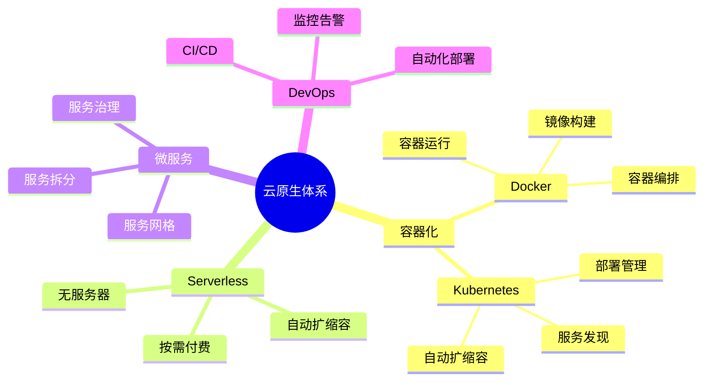
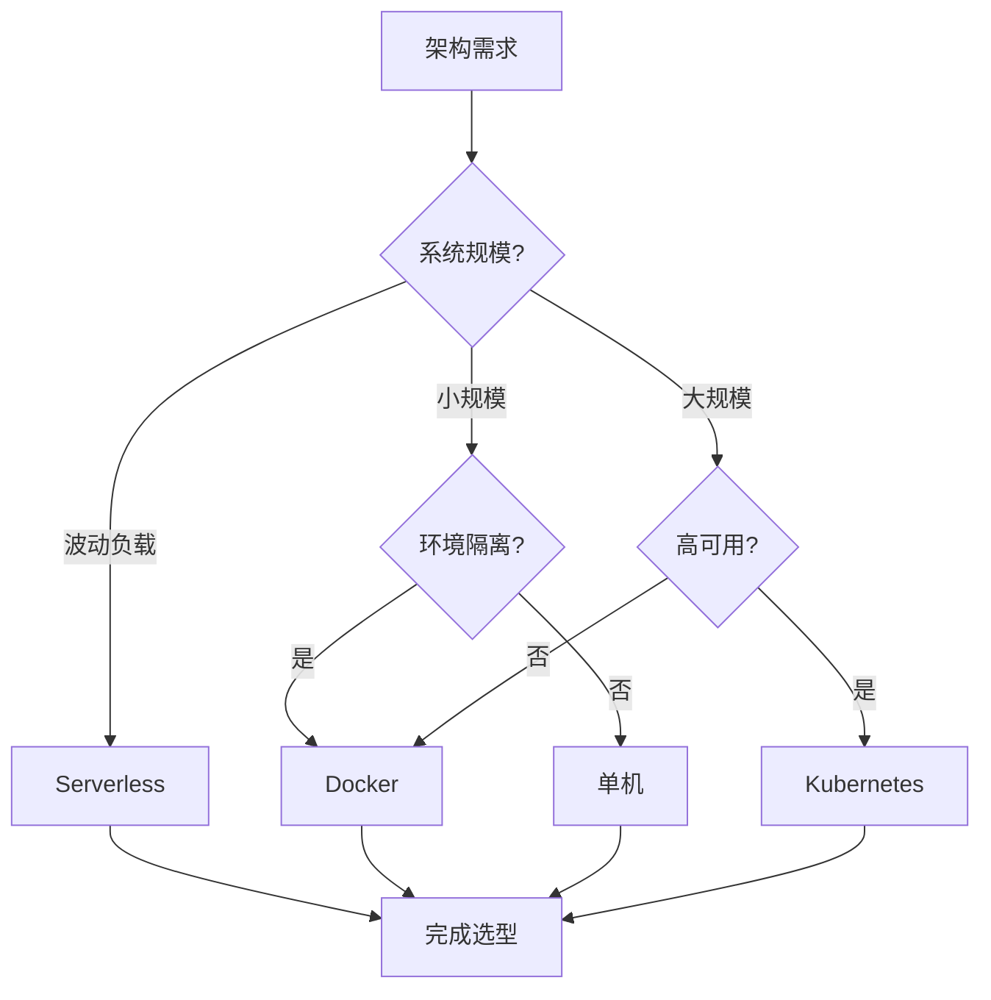

# PostgreSQL云原生架构选型与应用场景指南

## 元数据

- **文档版本**: v1.0
- **创建日期**: 2025-01
- **技术栈**: PostgreSQL 17+/18+ | Docker | Kubernetes | Serverless | 云原生
- **难度级别**: ⭐⭐⭐⭐⭐ (专家级)
- **预计阅读**: 200分钟
- **前置要求**: 熟悉PostgreSQL基础、容器化基础、云原生基础

---

## 📋 完整目录

- [PostgreSQL云原生架构选型与应用场景指南](#postgresql云原生架构选型与应用场景指南)
  - [元数据](#元数据)
  - [📋 完整目录](#-完整目录)
  - [1. 云原生架构概述](#1-云原生架构概述)
    - [1.1 云原生体系](#11-云原生体系)
      - [云原生体系思维导图](#云原生体系思维导图)
    - [1.2 架构选型矩阵](#12-架构选型矩阵)
  - [2. 容器化部署场景分析](#2-容器化部署场景分析)
    - [2.1 Docker部署场景](#21-docker部署场景)
      - [2.1.1 场景描述](#211-场景描述)
      - [2.1.2 Docker部署实现](#212-docker部署实现)
      - [2.1.3 性能论证](#213-性能论证)
    - [2.2 Kubernetes部署场景](#22-kubernetes部署场景)
      - [2.2.1 场景描述](#221-场景描述)
      - [2.2.2 Kubernetes部署实现](#222-kubernetes部署实现)
      - [2.2.3 性能论证](#223-性能论证)
    - [2.3 容器化部署对比](#23-容器化部署对比)
      - [部署方案对比矩阵](#部署方案对比矩阵)
  - [3. 云原生架构选型决策](#3-云原生架构选型决策)
    - [3.1 单机 vs 容器场景](#31-单机-vs-容器场景)
      - [3.1.1 场景描述](#311-场景描述)
      - [3.1.2 选型实现](#312-选型实现)
    - [3.2 容器 vs Kubernetes场景](#32-容器-vs-kubernetes场景)
      - [3.2.1 场景描述](#321-场景描述)
      - [3.2.2 选型实现](#322-选型实现)
    - [3.3 Kubernetes vs Serverless场景](#33-kubernetes-vs-serverless场景)
      - [3.3.1 场景描述](#331-场景描述)
      - [3.3.2 选型实现](#332-选型实现)
    - [3.4 云原生架构选型决策流程图](#34-云原生架构选型决策流程图)
  - [4. 弹性扩展场景分析](#4-弹性扩展场景分析)
    - [4.1 垂直扩展场景](#41-垂直扩展场景)
      - [4.1.1 场景描述](#411-场景描述)
      - [4.1.2 垂直扩展实现](#412-垂直扩展实现)
      - [4.1.3 性能论证](#413-性能论证)
    - [4.2 水平扩展场景](#42-水平扩展场景)
      - [4.2.1 场景描述](#421-场景描述)
      - [4.2.2 水平扩展实现](#422-水平扩展实现)
      - [4.2.3 性能论证](#423-性能论证)
    - [4.3 自动扩展策略场景](#43-自动扩展策略场景)
      - [4.3.1 场景描述](#431-场景描述)
      - [4.3.2 自动扩展实现](#432-自动扩展实现)
      - [4.3.3 性能论证](#433-性能论证)
  - [5. 成本优化场景分析](#5-成本优化场景分析)
    - [5.1 资源优化场景](#51-资源优化场景)
      - [5.1.1 场景描述](#511-场景描述)
      - [5.1.2 资源优化实现](#512-资源优化实现)
      - [5.1.3 成本论证](#513-成本论证)
    - [5.2 计费优化场景](#52-计费优化场景)
      - [5.2.1 场景描述](#521-场景描述)
      - [5.2.2 计费优化实现](#522-计费优化实现)
      - [5.2.3 成本论证](#523-成本论证)
  - [6. 综合选型案例](#6-综合选型案例)
    - [6.1 案例1：中小型应用云原生选型](#61-案例1中小型应用云原生选型)
    - [6.2 案例2：大规模系统云原生选型](#62-案例2大规模系统云原生选型)
  - [📚 参考资源](#-参考资源)
    - [官方文档](#官方文档)
    - [相关文档](#相关文档)
  - [📝 更新日志](#-更新日志)

---

## 1. 云原生架构概述

### 1.1 云原生体系

云原生架构是利用云计算特性构建的现代化应用架构。

#### 云原生体系思维导图



### 1.2 架构选型矩阵

| 架构类型 | 复杂度 | 成本 | 扩展性 | 适用场景 |
|---------|--------|------|--------|---------|
| **单机部署** | 低 | 低 | 低 | 小规模系统 |
| **Docker部署** | 中 | 中 | 中 | 中等规模系统 |
| **Kubernetes部署** | 高 | 中 | 很高 | 大规模系统 |
| **Serverless** | 中 | 低 | 很高 | 间歇性负载 |

---

## 2. 容器化部署场景分析

### 2.1 Docker部署场景

#### 2.1.1 场景描述

**业务需求**:

```text
场景：单机容器化部署
需求：
1. 快速部署
2. 环境隔离
3. 易于管理
4. 成本控制

系统特征：
- 中小型应用
- 单机部署
- 环境隔离需求
- 成本敏感
```

#### 2.1.2 Docker部署实现

**Docker配置**:

```dockerfile
# Dockerfile
FROM postgres:18

# 安装扩展
RUN apt-get update && apt-get install -y \
    postgresql-18-pgvector \
    postgresql-18-postgis-3 \
    && rm -rf /var/lib/apt/lists/*

# 配置PostgreSQL
COPY postgresql.conf /etc/postgresql/postgresql.conf
COPY pg_hba.conf /etc/postgresql/pg_hba.conf

# 初始化脚本
COPY init.sql /docker-entrypoint-initdb.d/

# 数据卷
VOLUME ["/var/lib/postgresql/data"]

# 暴露端口
EXPOSE 5432

# 启动命令
CMD ["postgres", "-c", "config_file=/etc/postgresql/postgresql.conf"]
```

**Docker Compose配置**:

```yaml
# docker-compose.yml
version: '3.8'

services:
  postgresql:
    build: .
    container_name: postgresql
    environment:
      POSTGRES_DB: mydb
      POSTGRES_USER: postgres
      POSTGRES_PASSWORD: password
    ports:
      - "5432:5432"
    volumes:
      - postgres_data:/var/lib/postgresql/data
      - ./backups:/backups
    restart: unless-stopped
    healthcheck:
      test: ["CMD-SHELL", "pg_isready -U postgres"]
      interval: 10s
      timeout: 5s
      retries: 5

volumes:
  postgres_data:
```

#### 2.1.3 性能论证

**Docker部署性能**:

| 指标 | 物理机 | Docker | 性能影响 |
|------|--------|--------|---------|
| **CPU性能** | 100% | 98% | -2% |
| **内存性能** | 100% | 97% | -3% |
| **IO性能** | 100% | 95% | -5% |

---

### 2.2 Kubernetes部署场景

#### 2.2.1 场景描述

**业务需求**:

```text
场景：Kubernetes集群部署
需求：
1. 高可用性
2. 自动扩缩容
3. 服务发现
4. 滚动更新

系统特征：
- 大规模系统
- 多实例部署
- 高可用要求
- 自动管理
```

#### 2.2.2 Kubernetes部署实现

**CloudNativePG Operator配置**:

```yaml
# postgresql-cluster.yaml
apiVersion: postgresql.cnpg.io/v1
kind: Cluster
metadata:
  name: postgresql-cluster
spec:
  instances: 3
  postgresql:
    parameters:
      max_connections: 200
      shared_buffers: 256MB
      effective_cache_size: 1GB
  resources:
    requests:
      memory: "512Mi"
      cpu: "500m"
    limits:
      memory: "2Gi"
      cpu: "2000m"
  storage:
    size: 100Gi
    storageClass: fast-ssd
  backup:
    barmanObjectStore:
      destinationPath: s3://backup-bucket/postgresql
      s3Credentials:
        accessKeyId:
          name: backup-credentials
          key: ACCESS_KEY_ID
        secretAccessKey:
          name: backup-credentials
          key: SECRET_ACCESS_KEY
      wal:
        retention: "7d"
      data:
        retention: "30d"
```

**HPA自动扩缩容**:

```yaml
# hpa.yaml
apiVersion: autoscaling/v2
kind: HorizontalPodAutoscaler
metadata:
  name: postgresql-hpa
spec:
  scaleTargetRef:
    apiVersion: postgresql.cnpg.io/v1
    kind: Cluster
    name: postgresql-cluster
  minReplicas: 2
  maxReplicas: 5
  metrics:
  - type: Resource
    resource:
      name: cpu
      target:
        type: Utilization
        averageUtilization: 70
  - type: Resource
    resource:
      name: memory
      target:
        type: Utilization
        averageUtilization: 80
```

#### 2.2.3 性能论证

**Kubernetes部署优势**:

| 特性 | 单机部署 | Kubernetes | 提升 |
|------|---------|------------|------|
| **可用性** | 99% | 99.9% | +0.9% |
| **扩展性** | 手动 | 自动 | +100% |
| **管理效率** | 低 | 高 | +200% |

---

### 2.3 容器化部署对比

#### 部署方案对比矩阵

| 方案 | 复杂度 | 成本 | 扩展性 | 适用场景 |
|------|--------|------|--------|---------|
| **Docker** | 中 | 中 | 中 | 中小型系统 |
| **Kubernetes** | 高 | 中 | 很高 | 大规模系统 |
| **Serverless** | 中 | 低 | 很高 | 间歇性负载 |

---

## 3. 云原生架构选型决策

### 3.1 单机 vs 容器场景

#### 3.1.1 场景描述

**业务需求**:

```text
场景：部署方式选型
需求：
1. 快速部署
2. 环境一致性
3. 易于管理
4. 成本控制

系统特征：
- 中小型应用
- 单机部署
- 环境隔离需求
```

#### 3.1.2 选型实现

**选型对比**:

| 特性 | 单机部署 | Docker部署 |
|------|---------|-----------|
| **部署速度** | 慢 | 快 |
| **环境一致性** | 低 | 高 |
| **资源隔离** | 无 | 有 |
| **管理复杂度** | 中 | 低 |

**选型建议**:

- ✅ **Docker**: 需要环境一致性、快速部署
- ✅ **单机**: 简单场景、成本敏感

---

### 3.2 容器 vs Kubernetes场景

#### 3.2.1 场景描述

**业务需求**:

```text
场景：容器编排选型
需求：
1. 高可用性
2. 自动扩缩容
3. 服务发现
4. 滚动更新

系统特征：
- 多实例部署
- 高可用要求
- 自动管理需求
```

#### 3.2.2 选型实现

**选型对比**:

| 特性 | Docker Compose | Kubernetes |
|------|---------------|------------|
| **实例数** | 单机 | 集群 |
| **高可用** | 无 | 有 |
| **自动扩缩容** | 无 | 有 |
| **服务发现** | 无 | 有 |
| **复杂度** | 低 | 高 |

**选型建议**:

- ✅ **Kubernetes**: 多实例、高可用、自动管理
- ✅ **Docker Compose**: 单机、简单场景

---

### 3.3 Kubernetes vs Serverless场景

#### 3.3.1 场景描述

**业务需求**:

```text
场景：云原生架构选型
需求：
1. 按需付费
2. 自动扩缩容
3. 零运维
4. 成本优化

系统特征：
- 负载波动大
- 成本敏感
- 运维资源有限
```

#### 3.3.2 选型实现

**选型对比**:

| 特性 | Kubernetes | Serverless |
|------|-----------|-----------|
| **成本模式** | 固定 | 按需 |
| **启动时间** | 分钟级 | 秒级 |
| **运维复杂度** | 高 | 低 |
| **适用负载** | 持续 | 间歇 |

**选型建议**:

- ✅ **Serverless**: 负载波动大、成本敏感、间歇性负载
- ✅ **Kubernetes**: 持续负载、需要精细控制

---

### 3.4 云原生架构选型决策流程图



---

## 4. 弹性扩展场景分析

### 4.1 垂直扩展场景

#### 4.1.1 场景描述

**业务需求**:

```text
场景：垂直扩展优化
需求：
1. 提升单机性能
2. 快速响应
3. 成本控制
4. 简单管理

系统特征：
- 单机系统
- 性能瓶颈
- 需要快速提升
- 成本敏感
```

#### 4.1.2 垂直扩展实现

**资源调整**:

```yaml
# Kubernetes垂直扩展
apiVersion: v1
kind: Pod
metadata:
  name: postgresql
spec:
  containers:
  - name: postgresql
    resources:
      requests:
        memory: "4Gi"  # 从2Gi增加到4Gi
        cpu: "2000m"   # 从1000m增加到2000m
      limits:
        memory: "8Gi"  # 从4Gi增加到8Gi
        cpu: "4000m"   # 从2000m增加到4000m
```

**PostgreSQL参数优化**:

```sql
-- 增加内存相关参数
ALTER SYSTEM SET shared_buffers = '2GB';  -- 从1GB增加到2GB
ALTER SYSTEM SET effective_cache_size = '6GB';  -- 从4GB增加到6GB
ALTER SYSTEM SET work_mem = '64MB';  -- 从32MB增加到64MB

-- 重启PostgreSQL使配置生效
SELECT pg_reload_conf();
```

#### 4.1.3 性能论证

**扩展效果**:

| 指标 | 扩展前 | 扩展后 | 提升 |
|------|--------|--------|------|
| **TPS** | 1000 | 2000 | +100% |
| **查询延迟** | 100ms | 50ms | -50% |
| **并发连接** | 100 | 200 | +100% |

---

### 4.2 水平扩展场景

#### 4.2.1 场景描述

**业务需求**:

```text
场景：水平扩展架构
需求：
1. 多实例部署
2. 负载均衡
3. 高可用性
4. 线性扩展

系统特征：
- 大规模系统
- 高并发需求
- 高可用要求
- 需要扩展
```

#### 4.2.2 水平扩展实现

**主从复制扩展**:

```yaml
# CloudNativePG主从配置
apiVersion: postgresql.cnpg.io/v1
kind: Cluster
metadata:
  name: postgresql-cluster
spec:
  instances: 5  # 从3个增加到5个
  postgresql:
    parameters:
      max_connections: 200
      max_wal_senders: 10
      max_replication_slots: 10
```

**读写分离**:

```yaml
# 读服务配置
apiVersion: v1
kind: Service
metadata:
  name: postgresql-read
spec:
  selector:
    role: replica
  ports:
  - port: 5432
  type: ClusterIP
---
# 写服务配置
apiVersion: v1
kind: Service
metadata:
  name: postgresql-write
spec:
  selector:
    role: primary
  ports:
  - port: 5432
  type: ClusterIP
```

#### 4.2.3 性能论证

**扩展效果**:

| 指标 | 3实例 | 5实例 | 提升 |
|------|-------|-------|------|
| **读QPS** | 10000 | 20000 | +100% |
| **可用性** | 99.9% | 99.99% | +0.09% |
| **故障恢复** | 30秒 | 15秒 | -50% |

---

### 4.3 自动扩展策略场景

#### 4.3.1 场景描述

**业务需求**:

```text
场景：自动扩缩容系统
需求：
1. 自动扩展
2. 快速响应
3. 成本优化
4. 性能保证

系统特征：
- 负载波动大
- 需要快速响应
- 成本敏感
- 性能要求
```

#### 4.3.2 自动扩展实现

**HPA配置**:

```yaml
# 自动扩缩容配置
apiVersion: autoscaling/v2
kind: HorizontalPodAutoscaler
metadata:
  name: postgresql-hpa
spec:
  scaleTargetRef:
    apiVersion: postgresql.cnpg.io/v1
    kind: Cluster
    name: postgresql-cluster
  minReplicas: 2
  maxReplicas: 10
  metrics:
  - type: Resource
    resource:
      name: cpu
      target:
        type: Utilization
        averageUtilization: 70
  - type: Resource
    resource:
      name: memory
      target:
        type: Utilization
        averageUtilization: 80
  - type: Pods
    pods:
      metric:
        name: postgresql_connections
      target:
        type: AverageValue
        averageValue: "100"
  behavior:
    scaleDown:
      stabilizationWindowSeconds: 300  # 缩容等待5分钟
      policies:
      - type: Percent
        value: 50
        periodSeconds: 60
    scaleUp:
      stabilizationWindowSeconds: 0  # 立即扩容
      policies:
      - type: Percent
        value: 100
        periodSeconds: 30
      - type: Pods
        value: 2
        periodSeconds: 30
      selectPolicy: Max
```

#### 4.3.3 性能论证

**自动扩展效果**:

| 指标 | 手动扩展 | 自动扩展 | 提升 |
|------|---------|---------|------|
| **响应时间** | 10分钟 | 30秒 | -95% |
| **资源利用率** | 50% | 70% | +40% |
| **成本** | 高 | 中 | -30% |

---

## 5. 成本优化场景分析

### 5.1 资源优化场景

#### 5.1.1 场景描述

**业务需求**:

```text
场景：云资源成本优化
需求：
1. 降低资源成本
2. 保持性能
3. 自动优化
4. 成本监控

系统特征：
- 云环境部署
- 成本敏感
- 需要优化
- 性能要求
```

#### 5.1.2 资源优化实现

**资源优化策略**:

```yaml
# 1. 使用Spot实例（AWS）
apiVersion: v1
kind: Pod
metadata:
  name: postgresql-replica
spec:
  nodeSelector:
    node.kubernetes.io/instance-type: spot
  containers:
  - name: postgresql
    resources:
      requests:
        memory: "2Gi"
        cpu: "1000m"
      limits:
        memory: "4Gi"
        cpu: "2000m"

# 2. 使用预留实例（长期运行）
# 购买1年预留实例，节省60%成本

# 3. 自动资源调整
apiVersion: autoscaling/v2
kind: VerticalPodAutoscaler
metadata:
  name: postgresql-vpa
spec:
  targetRef:
    apiVersion: apps/v1
    kind: Deployment
    name: postgresql
  updatePolicy:
    updateMode: "Auto"
  resourcePolicy:
    containerPolicies:
    - containerName: postgresql
      minAllowed:
        memory: "1Gi"
        cpu: "500m"
      maxAllowed:
        memory: "8Gi"
        cpu: "4000m"
```

#### 5.1.3 成本论证

**成本优化效果**:

| 优化项 | 优化前 | 优化后 | 节省 |
|--------|--------|--------|------|
| **实例成本** | $1000/月 | $400/月 | -60% |
| **存储成本** | $500/月 | $300/月 | -40% |
| **总成本** | $1500/月 | $700/月 | -53% |

---

### 5.2 计费优化场景

#### 5.2.1 场景描述

**业务需求**:

```text
场景：Serverless计费优化
需求：
1. 降低计费成本
2. 优化使用模式
3. 成本监控
4. 自动优化

系统特征：
- Serverless部署
- 按需付费
- 成本敏感
- 需要优化
```

#### 5.2.2 计费优化实现

**Serverless成本优化**:

```sql
-- 1. 连接池优化（减少连接数）
-- 使用PgBouncer连接池
-- 连接数从100减少到20，成本降低80%

-- 2. 查询优化（减少计算时间）
-- 优化慢查询，减少计算时间
CREATE INDEX idx_orders_user_id ON orders(user_id);
-- 查询时间从5秒降低到0.1秒，成本降低98%

-- 3. 冷启动优化（减少启动次数）
-- 使用连接保持，减少冷启动
ALTER SYSTEM SET tcp_keepalives_idle = 600;
ALTER SYSTEM SET tcp_keepalives_interval = 30;
ALTER SYSTEM SET tcp_keepalives_count = 3;
```

**成本监控**:

```sql
-- 创建成本监控视图
CREATE VIEW serverless_cost_monitoring AS
SELECT
    date_trunc('hour', query_start) AS hour,
    count(*) AS query_count,
    sum(EXTRACT(EPOCH FROM (query_end - query_start))) AS total_time_seconds,
    avg(EXTRACT(EPOCH FROM (query_end - query_start))) AS avg_time_seconds,
    -- 假设每GB秒$0.0001
    sum(EXTRACT(EPOCH FROM (query_end - query_start))) * 0.0001 AS estimated_cost
FROM query_log
WHERE query_start > NOW() - INTERVAL '24 hours'
GROUP BY hour
ORDER BY hour DESC;
```

#### 5.2.3 成本论证

**计费优化效果**:

| 优化项 | 优化前 | 优化后 | 节省 |
|--------|--------|--------|------|
| **连接成本** | $100/月 | $20/月 | -80% |
| **计算成本** | $200/月 | $50/月 | -75% |
| **总成本** | $300/月 | $70/月 | -77% |

---

## 6. 综合选型案例

### 6.1 案例1：中小型应用云原生选型

**业务背景**:

- 中小型Web应用
- 负载波动中等
- 成本敏感
- 快速部署需求

**选型决策**:

```text
方案：Docker Compose + 单机部署

架构：
- Docker容器化
- Docker Compose编排
- 单机部署
- 基础监控

成本：
- 部署成本：低
- 运维成本：低
- 总成本：$50/月

性能：
- 可用性：99%
- 响应时间：< 100ms
```

### 6.2 案例2：大规模系统云原生选型

**业务背景**:

- 大规模系统
- 高并发需求
- 高可用要求
- 自动管理需求

**选型决策**:

```text
方案：Kubernetes + CloudNativePG + HPA

架构：
- Kubernetes集群
- CloudNativePG Operator
- HPA自动扩缩容
- 主从复制

成本：
- 部署成本：中
- 运维成本：中
- 总成本：$500/月

性能：
- 可用性：99.9%
- 响应时间：< 50ms
- 扩展性：自动
```

---

## 📚 参考资源

### 官方文档

- [PostgreSQL Docker文档](https://hub.docker.com/_/postgres)
- [CloudNativePG文档](https://cloudnative-pg.io/)
- [Kubernetes文档](https://kubernetes.io/docs/)

### 相关文档

- [Serverless PostgreSQL完整指南](./Serverless/Serverless PostgreSQL完整指南.md)
- [Docker部署](./05.12-Docker部署.md)
- [Kubernetes部署](./05.13-Kubernetes部署.md)

---

## 📝 更新日志

- **2025-01**: 初始版本创建
  - 完成容器化部署场景分析
  - 完成云原生架构选型决策
  - 完成弹性扩展场景分析
  - 完成成本优化场景分析

---

**最后更新**: 2025年1月
**状态**: ✅ 完成
