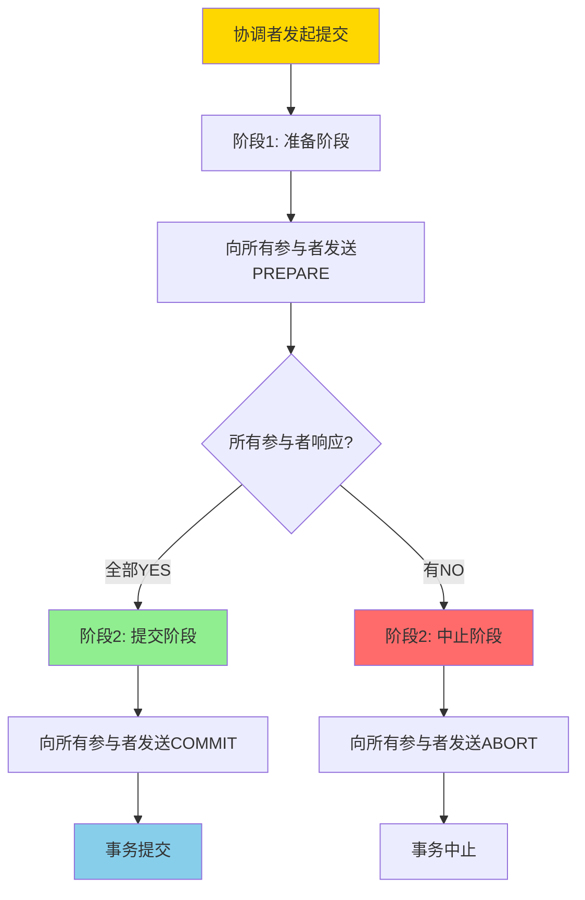
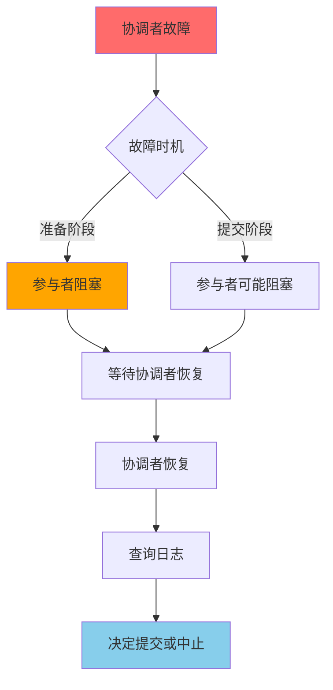
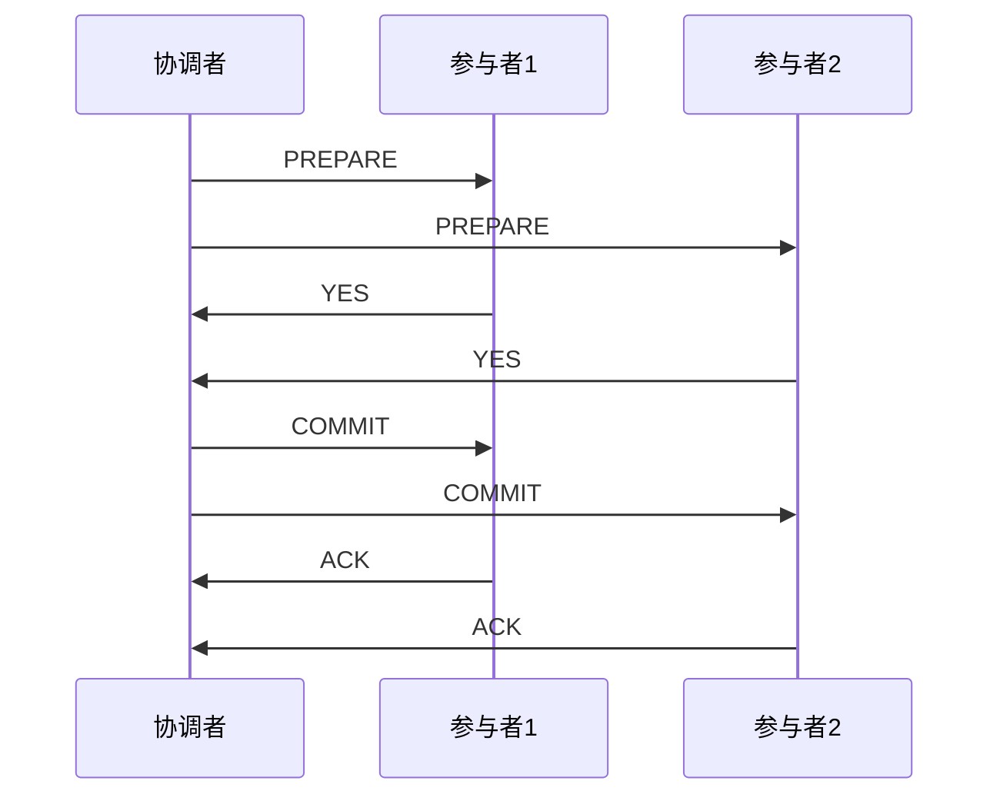
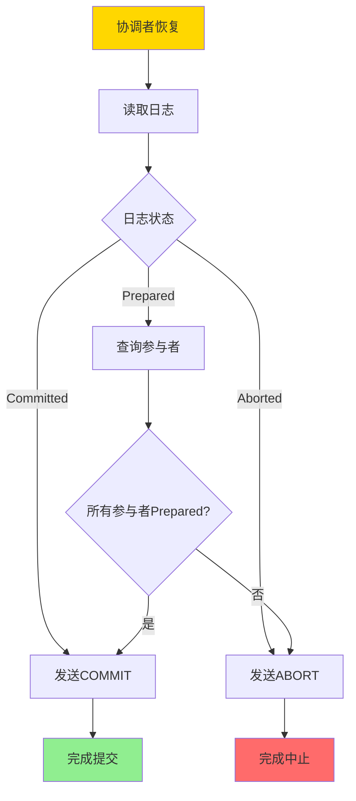
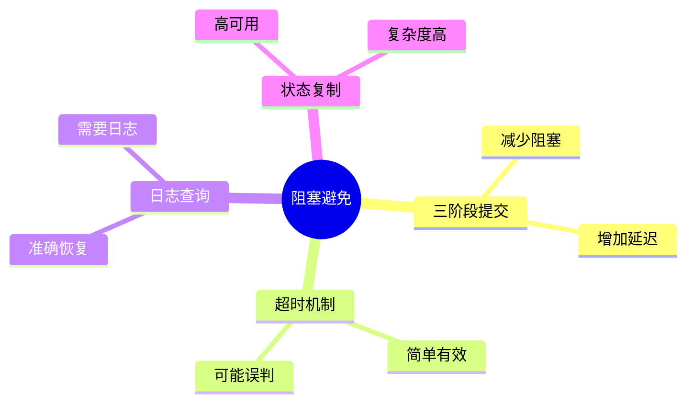
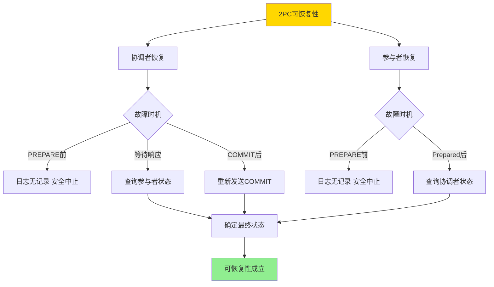
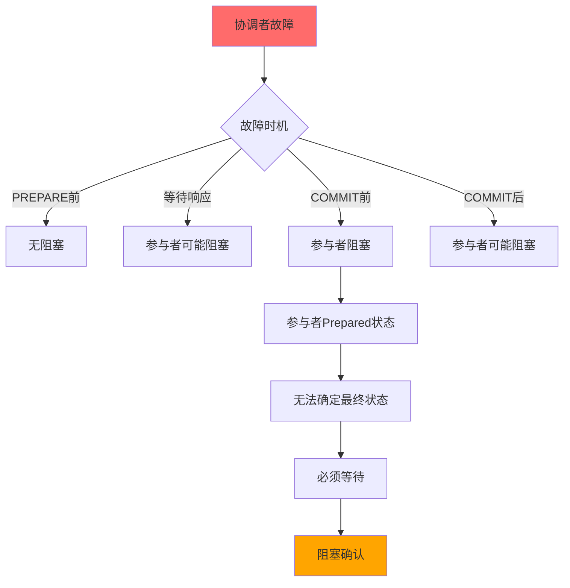

---

> **📋 文档来源**: `DataBaseTheory\04-分布式系统理论\04.03-两阶段提交-可恢复性与阻塞特性证明.md`
> **📅 复制日期**: 2025-12-22
> **⚠️ 注意**: 本文档为复制版本，原文件保持不变

---

# 两阶段提交-可恢复性与阻塞特性证明

> **文档版本**: v1.0
> **最后更新**: 2025-01-16
> **版本覆盖**: PostgreSQL 18.x (推荐) ⭐ | 17.x (推荐) | 16.x (兼容)
> **文档状态**: ✅ 内容已深化，包含完整证明、场景案例和PostgreSQL 18/SQLite对比

---

## 📋 目录

- [两阶段提交-可恢复性与阻塞特性证明](#两阶段提交-可恢复性与阻塞特性证明)
  - [📋 目录](#-目录)
  - [1. 概述](#1-概述)
    - [1.0 两阶段提交工作原理概述](#10-两阶段提交工作原理概述)
    - [1.1 本文档的范围](#11-本文档的范围)
  - [2. 核心内容](#2-核心内容)
    - [2.1 两阶段提交协议](#21-两阶段提交协议)
    - [2.2 可恢复性](#22-可恢复性)
    - [2.3 阻塞特性](#23-阻塞特性)
  - [3. 形式化定义](#3-形式化定义)
    - [3.1 2PC协议形式化](#31-2pc协议形式化)
    - [3.2 可恢复性形式化](#32-可恢复性形式化)
    - [3.3 阻塞特性形式化](#33-阻塞特性形式化)
  - [4. 定理与证明](#4-定理与证明)
    - [4.1 可恢复性定理](#41-可恢复性定理)
    - [4.2 阻塞特性定理](#42-阻塞特性定理)
  - [5. 实际应用](#5-实际应用)
    - [5.1 PostgreSQL 18 两阶段提交实现详解](#51-postgresql-18-两阶段提交实现详解)
    - [5.2 SQLite 3.45 事务处理对比](#52-sqlite-345-事务处理对比)
    - [5.3 实际业务场景案例](#53-实际业务场景案例)
      - [场景1：分布式支付系统的2PC应用](#场景1分布式支付系统的2pc应用)
      - [场景2：分布式订单系统的2PC与阻塞处理](#场景2分布式订单系统的2pc与阻塞处理)
    - [5.4 2PC阻塞避免最佳实践](#54-2pc阻塞避免最佳实践)
    - [5.5 模型选择建议](#55-模型选择建议)
  - [6. 相关文档](#6-相关文档)
    - [6.1 理论基础文档](#61-理论基础文档)
  - [7. 参考文献](#7-参考文献)
    - [7.1 核心理论文献](#71-核心理论文献)
    - [7.2 分布式事务相关](#72-分布式事务相关)
    - [7.3 相关文档](#73-相关文档)

---

## 1. 概述

### 1.0 两阶段提交工作原理概述

**两阶段提交协议（2PC）**：

两阶段提交是分布式事务处理中的经典协议，用于保证分布式系统中多个节点的事务一致性。本文档严格证明2PC的可恢复性和阻塞特性。

**2PC执行流程**：



**2PC阻塞特性**：



### 1.1 本文档的范围

本文档涵盖：

- **2PC协议**：两阶段提交协议的完整描述
- **可恢复性**：严格证明2PC的可恢复性
- **阻塞特性**：分析2PC的阻塞特性和影响
- **实际应用**：2PC在分布式系统中的应用

---

## 2. 核心内容

### 2.1 两阶段提交协议

**2PC协议定义**：

```haskell
-- 2PC协议
data TwoPhaseCommit = TwoPhaseCommit {
    coordinator :: Node,
    participants :: [Node],
    state :: CommitState
}

-- 提交状态
data CommitState =
    Initial
  | Prepared
  | Committed
  | Aborted

-- 阶段1：准备阶段
preparePhase :: TwoPhaseCommit -> IO Bool
preparePhase tpc = do
    responses <- mapM (sendPrepare tpc.coordinator) tpc.participants
    return (all (== Yes) responses)

-- 阶段2：提交阶段
commitPhase :: TwoPhaseCommit -> Bool -> IO ()
commitPhase tpc allPrepared =
    if allPrepared then
        mapM_ (sendCommit tpc.coordinator) tpc.participants
    else
        mapM_ (sendAbort tpc.coordinator) tpc.participants
```

**2PC执行流程**：



### 2.2 可恢复性

**可恢复性定义**：

```haskell
-- 可恢复性
recoverable :: TwoPhaseCommit -> Bool
recoverable tpc =
    forall participant in tpc.participants:
        if participant.state = Prepared then
            exists log entry indicating Prepared
            and
            can recover to Committed or Aborted
```

**恢复流程**：



### 2.3 阻塞特性

**阻塞场景分析**：

| 故障场景 | 阻塞情况 | 恢复方法 |
|---------|---------|---------|
| **协调者在准备阶段故障** | 参与者阻塞 | 选举新协调者或超时中止 |
| **协调者在提交阶段故障** | 参与者可能阻塞 | 查询其他参与者状态 |
| **参与者在准备阶段故障** | 协调者等待 | 超时中止 |
| **参与者在提交阶段故障** | 协调者等待 | 重试提交 |

**阻塞避免策略对比**：



---

## 3. 形式化定义

### 3.1 2PC协议形式化

**2PC协议**：

```haskell
-- 2PC协议形式化
2PC = (Phase1, Phase2)
where
    Phase1 = {PREPARE → participants → {YES, NO}}
    Phase2 = {COMMIT | ABORT → participants → ACK}
```

### 3.2 可恢复性形式化

**可恢复性**：

```haskell
-- 可恢复性
recoverable(2PC) =
    forall participant p:
        if p.state = Prepared then
            exists log entry: log(p) = Prepared
            and
            can determine final state from logs
```

### 3.3 阻塞特性形式化

**阻塞**：

```haskell
-- 阻塞定义
blocked(participant, state) =
    participant.state = Prepared
    and
    coordinator is down
    and
    cannot determine final state
```

---

## 4. 定理与证明

### 4.1 可恢复性定理

**定理**：2PC协议是可恢复的。

**形式化表述**：

设2PC协议的执行历史为H，如果协调者或参与者发生故障，则可以从日志中恢复并确定事务的最终状态。

**定义**：

- **2PC状态**：state ∈ {Initial, Prepared, Committed, Aborted}
- **日志记录**：log(state) = 记录状态到持久化存储
- **可恢复性**：recoverable(H) = 可以从日志确定所有事务的最终状态

**证明**（构造性证明）：

**步骤1：定义日志机制**:

- 2PC协议要求所有状态变更都记录到持久化日志
- 协调者日志：记录PREPARE发送、所有参与者响应、COMMIT/ABORT决策
- 参与者日志：记录PREPARE接收、响应发送、COMMIT/ABORT接收

**步骤2：分析协调者恢复**:

- **情况1**：协调者在发送PREPARE之前故障
  - 日志中没有PREPARE记录
  - 参与者未收到PREPARE，状态仍为Initial
  - 恢复后可以安全中止事务（所有参与者状态一致）

- **情况2**：协调者在等待PREPARE响应时故障
  - 日志中有PREPARE发送记录，但无所有响应
  - 恢复后查询参与者状态：
    - 如果所有参与者都Prepared，则发送COMMIT
    - 如果有参与者未Prepared或响应NO，则发送ABORT

- **情况3**：协调者在发送COMMIT/ABORT后故障
  - 日志中有COMMIT/ABORT记录
  - 恢复后重新发送COMMIT/ABORT给所有参与者
  - 参与者可以安全地重复处理（幂等性）

**步骤3：分析参与者恢复**:

- **情况1**：参与者在收到PREPARE之前故障
  - 日志中没有Prepared记录
  - 恢复后状态为Initial，可以安全中止

- **情况2**：参与者在Prepared状态后故障
  - 日志中有Prepared记录
  - 恢复后查询协调者或其他参与者：
    - 如果协调者已发送COMMIT，则提交
    - 如果协调者已发送ABORT或未发送，则等待或中止

**步骤4：证明最终状态可确定**:

- 对于任意事务T：
  - 如果协调者日志中有COMMIT记录，则T的最终状态为Committed
  - 如果协调者日志中有ABORT记录，则T的最终状态为Aborted
  - 如果协调者日志中只有PREPARE记录，则查询参与者状态确定

**步骤5：证明一致性**:

- 所有参与者的最终状态必须一致
- 如果协调者已决定COMMIT，所有参与者最终必须提交
- 如果协调者已决定ABORT，所有参与者最终必须中止
- 通过日志可以保证一致性

**步骤6：结论**:

- 2PC协议通过日志机制保证可恢复性
- 可以从日志确定所有事务的最终状态
- 证毕

**证明树**：



### 4.2 阻塞特性定理

**定理**：2PC协议在协调者故障时会导致阻塞。

**形式化表述**：

设2PC协议的执行历史为H，如果协调者在关键阶段故障，则参与者会阻塞，无法继续执行。

**定义**：

- **阻塞**：blocked(p, H) = 参与者p处于Prepared状态，但无法确定最终状态，必须等待
- **关键阶段**：criticalPhase = {等待PREPARE响应, 等待COMMIT/ABORT}

**证明**（构造性证明）：

**步骤1：构造阻塞场景**:

- 设协调者C和参与者P₁, P₂, ..., Pₙ执行2PC
- 协调者发送PREPARE给所有参与者
- 所有参与者响应YES，进入Prepared状态
- 协调者在发送COMMIT之前故障

**步骤2：分析参与者状态**:

- 所有参与者Pᵢ处于Prepared状态
- 参与者Pᵢ已写入Prepared状态到日志
- 参与者Pᵢ持有资源锁，等待最终决策

**步骤3：证明无法确定最终状态**:

- 参与者Pᵢ无法知道协调者的决策：
  - 协调者可能已决定COMMIT但未发送
  - 协调者可能已决定ABORT但未发送
  - 协调者可能在决定之前故障
- 参与者Pᵢ无法从本地日志确定最终状态

**步骤4：证明必须等待**:

- 参与者Pᵢ不能单方面决定：
  - 如果Pᵢ决定COMMIT，但其他参与者可能未Prepared，导致不一致
  - 如果Pᵢ决定ABORT，但协调者可能已决定COMMIT，导致不一致
- 因此，Pᵢ必须等待协调者恢复或超时

**步骤5：证明阻塞持续时间**:

- 阻塞持续时间取决于：
  - 协调者恢复时间（如果协调者恢复）
  - 超时时间（如果使用超时机制）
  - 新协调者选举时间（如果使用选举机制）
- 在协调者恢复之前，参与者一直阻塞

**步骤6：结论**:

- 2PC协议在协调者故障时会导致参与者阻塞
- 阻塞持续时间取决于恢复机制
- 证毕

**证明树**：



---

## 5. 实际应用

### 5.1 PostgreSQL 18 两阶段提交实现详解

**PostgreSQL 18 2PC特性**：

PostgreSQL 18支持两阶段提交（2PC），用于分布式事务处理。2PC允许事务在多个数据库节点之间协调提交。

**PostgreSQL 18 2PC配置**：

```sql
-- 启用2PC（默认启用）
-- PostgreSQL 18支持PREPARE TRANSACTION和COMMIT PREPARED

-- 查看2PC相关配置
SHOW max_prepared_transactions;
-- 默认值：0（禁用）或大于0（启用）
-- 需要设置为大于0才能使用2PC

-- 设置最大准备事务数
ALTER SYSTEM SET max_prepared_transactions = 100;
-- 重启PostgreSQL使配置生效
```

**PostgreSQL 18 2PC基本用法**：

```sql
-- 创建测试表
CREATE TABLE accounts (
    id SERIAL PRIMARY KEY,
    account_name VARCHAR(100),
    balance DECIMAL(15,2) NOT NULL DEFAULT 0
);

-- 场景1：单节点2PC
BEGIN;
INSERT INTO accounts (account_name, balance) VALUES ('Account A', 1000.00);
UPDATE accounts SET balance = balance - 100 WHERE id = 1;
-- 准备事务（阶段1）
PREPARE TRANSACTION 'tx_001';
-- 此时事务已准备，但未提交
-- 可以查询准备的事务
SELECT * FROM pg_prepared_xacts;
-- 提交准备的事务（阶段2）
COMMIT PREPARED 'tx_001';
-- 或中止
-- ROLLBACK PREPARED 'tx_001';

-- 场景2：分布式2PC（需要多个PostgreSQL实例）
-- 节点1
BEGIN;
INSERT INTO accounts (account_name, balance) VALUES ('Account A', 1000.00);
PREPARE TRANSACTION 'distributed_tx_001';

-- 节点2（另一个PostgreSQL实例）
BEGIN;
INSERT INTO accounts (account_name, balance) VALUES ('Account B', 2000.00);
PREPARE TRANSACTION 'distributed_tx_001';

-- 协调者：如果所有节点都准备成功，则提交
-- 节点1
COMMIT PREPARED 'distributed_tx_001';
-- 节点2
COMMIT PREPARED 'distributed_tx_001';
```

**PostgreSQL 18 2PC监控**：

```sql
-- 查看所有准备的事务
SELECT
    transaction,
    gid,
    prepared,
    owner,
    database
FROM pg_prepared_xacts;

-- PostgreSQL 18：查看2PC统计
SELECT
    datname,
    xact_commit,
    xact_rollback,
    prepared_xacts,
    prepared_xacts_commit,
    prepared_xacts_rollback
FROM pg_stat_database
WHERE datname = current_database();

-- 查看准备事务的锁
SELECT
    locktype,
    database,
    relation::regclass,
    page,
    tuple,
    virtualxid,
    transactionid,
    classid,
    objid,
    objsubid,
    virtualtransaction,
    pid,
    mode,
    granted
FROM pg_locks
WHERE transactionid IN (
    SELECT transaction FROM pg_prepared_xacts
);
```

**PostgreSQL 18 2PC恢复**：

```sql
-- 场景：协调者故障后的恢复
-- 1. 查看准备的事务
SELECT * FROM pg_prepared_xacts;

-- 2. 根据业务逻辑决定提交或中止
-- 如果所有参与者都准备成功，则提交
COMMIT PREPARED 'tx_001';
-- 如果有参与者准备失败，则中止
ROLLBACK PREPARED 'tx_001';

-- 3. PostgreSQL 18：自动清理过期的准备事务
-- 设置准备事务超时
ALTER SYSTEM SET statement_timeout = '30s';
-- 超过超时时间的准备事务会被自动清理
```

### 5.2 SQLite 3.45 事务处理对比

**SQLite 3.45 事务处理**：

SQLite 3.45**不支持2PC**，只支持本地事务。

| 特性 | PostgreSQL 18 | SQLite 3.45 |
|------|--------------|-------------|
| **2PC支持** | ✅ 支持 | ❌ 不支持 |
| **PREPARE TRANSACTION** | ✅ 支持 | ❌ 不支持 |
| **分布式事务** | ✅ 支持 | ❌ 不支持 |
| **本地事务** | ✅ 支持 | ✅ 支持 |
| **WAL模式** | ✅ 支持 | ✅ 支持 |

**SQLite 3.45示例**：

```sql
-- SQLite 3.45：只支持本地事务
BEGIN TRANSACTION;
INSERT INTO accounts (account_name, balance) VALUES ('Account A', 1000.00);
UPDATE accounts SET balance = balance - 100 WHERE id = 1;
COMMIT;
-- 或
ROLLBACK;

-- SQLite 3.45：不支持2PC
-- 无法使用PREPARE TRANSACTION
-- 无法实现分布式事务
```

### 5.3 实际业务场景案例

#### 场景1：分布式支付系统的2PC应用

**业务背景**：

- 支付系统涉及多个服务：账户服务、支付服务、通知服务
- 需要保证跨服务的事务一致性
- 支付操作必须原子性：要么全部成功，要么全部失败

**技术挑战**：

- 保证跨服务事务一致性
- 处理服务故障和网络分区
- 优化2PC性能

**PostgreSQL 18实现**：

```sql
-- 账户服务数据库
CREATE TABLE accounts (
    id BIGSERIAL PRIMARY KEY,
    account_number VARCHAR(20) UNIQUE NOT NULL,
    balance DECIMAL(15,2) NOT NULL DEFAULT 0,
    updated_at TIMESTAMPTZ DEFAULT NOW()
);

-- 支付服务数据库
CREATE TABLE payments (
    id BIGSERIAL PRIMARY KEY,
    payment_id VARCHAR(50) UNIQUE NOT NULL,
    from_account_id BIGINT,
    to_account_id BIGINT,
    amount DECIMAL(15,2) NOT NULL,
    status VARCHAR(20) DEFAULT 'pending',
    created_at TIMESTAMPTZ DEFAULT NOW()
);

-- 场景：分布式支付事务
-- 步骤1：账户服务准备事务
-- 节点1（账户服务）
BEGIN;
UPDATE accounts SET balance = balance - 1000, updated_at = NOW()
WHERE account_number = 'ACC001';
PREPARE TRANSACTION 'payment_tx_001';

-- 步骤2：支付服务准备事务
-- 节点2（支付服务）
BEGIN;
INSERT INTO payments (payment_id, from_account_id, to_account_id, amount, status)
VALUES ('PAY001', 1, 2, 1000.00, 'processing');
PREPARE TRANSACTION 'payment_tx_001';

-- 步骤3：如果所有服务都准备成功，则提交
-- 节点1
COMMIT PREPARED 'payment_tx_001';
-- 节点2
COMMIT PREPARED 'payment_tx_001';

-- 场景：如果支付服务准备失败，则所有服务都中止
-- 节点1
ROLLBACK PREPARED 'payment_tx_001';
-- 节点2
ROLLBACK PREPARED 'payment_tx_001';
```

**性能数据**：

| 指标 | 2PC支付 | 本地事务 | 说明 |
|------|---------|---------|------|
| **事务延迟** | 50-100ms | 5-10ms | 2PC需要两阶段通信 |
| **一致性** | 强一致性 | 本地一致性 | 2PC保证跨节点一致性 |
| **可用性** | 受阻塞影响 | 高可用 | 2PC可能阻塞 |

#### 场景2：分布式订单系统的2PC与阻塞处理

**业务背景**：

- 订单系统涉及订单服务、库存服务、支付服务
- 需要保证订单创建的原子性
- 需要处理服务故障和阻塞

**技术挑战**：

- 处理协调者故障导致的阻塞
- 实现超时和恢复机制
- 优化2PC性能

**PostgreSQL 18实现**：

```sql
-- 订单服务数据库
CREATE TABLE orders (
    id BIGSERIAL PRIMARY KEY,
    order_number VARCHAR(50) UNIQUE NOT NULL,
    customer_id BIGINT,
    total_amount DECIMAL(10,2),
    status VARCHAR(20) DEFAULT 'pending',
    created_at TIMESTAMPTZ DEFAULT NOW()
);

-- 库存服务数据库
CREATE TABLE products (
    id BIGSERIAL PRIMARY KEY,
    product_name VARCHAR(200),
    stock_quantity INTEGER NOT NULL DEFAULT 0
);

-- 场景：分布式订单创建（2PC）
-- 协调者：订单服务
-- 参与者：库存服务、支付服务

-- 步骤1：所有服务准备事务
-- 订单服务
BEGIN;
INSERT INTO orders (order_number, customer_id, total_amount, status)
VALUES ('ORD001', 1, 1000.00, 'processing');
PREPARE TRANSACTION 'order_tx_001';

-- 库存服务
BEGIN;
UPDATE products SET stock_quantity = stock_quantity - 10 WHERE id = 1;
PREPARE TRANSACTION 'order_tx_001';

-- 步骤2：协调者故障场景
-- 假设订单服务（协调者）在发送COMMIT之前故障
-- 库存服务处于Prepared状态，阻塞等待

-- 步骤3：恢复机制
-- 库存服务：设置超时
SET statement_timeout = '30s';

-- 如果超时，可以查询其他参与者状态
-- 或等待协调者恢复

-- 步骤4：协调者恢复后
-- 订单服务：查询准备的事务
SELECT * FROM pg_prepared_xacts WHERE gid = 'order_tx_001';
-- 如果所有参与者都准备成功，则提交
COMMIT PREPARED 'order_tx_001';
-- 库存服务现在可以继续
```

**阻塞处理策略**：

```sql
-- 策略1：超时机制
SET statement_timeout = '30s';
-- 超过30秒自动回滚准备的事务

-- 策略2：定期查询
-- 应用层定期查询pg_prepared_xacts
-- 如果发现长时间未提交的准备事务，可以决定提交或中止

-- 策略3：使用外部协调者（如pgpool-II、Citus）
-- 外部协调者管理2PC，自动处理故障和恢复
```

### 5.4 2PC阻塞避免最佳实践

**PostgreSQL 18最佳实践**：

```sql
-- 1. 设置合理的超时
ALTER SYSTEM SET statement_timeout = '30s';
-- 避免准备事务无限期阻塞

-- 2. 监控准备事务
-- 定期查询pg_prepared_xacts
SELECT
    transaction,
    gid,
    prepared,
    NOW() - prepared AS age
FROM pg_prepared_xacts
WHERE NOW() - prepared > INTERVAL '1 minute';
-- 发现长时间未提交的准备事务

-- 3. 实现恢复逻辑
-- 应用层实现恢复逻辑
CREATE OR REPLACE FUNCTION recover_prepared_transactions()
RETURNS VOID AS $$
DECLARE
    tx_record RECORD;
BEGIN
    FOR tx_record IN
        SELECT gid FROM pg_prepared_xacts
        WHERE NOW() - prepared > INTERVAL '5 minutes'
    LOOP
        -- 根据业务逻辑决定提交或中止
        -- 这里示例：如果超过5分钟，则中止
        ROLLBACK PREPARED tx_record.gid;
    END LOOP;
END;
$$ LANGUAGE plpgsql;

-- 4. 使用外部协调者
-- 推荐使用pgpool-II或Citus作为2PC协调者
-- 自动处理故障和恢复
```

### 5.5 模型选择建议

**选择PostgreSQL 18 2PC的场景**：

✅ **推荐场景**：

- 分布式事务系统
- 需要跨节点强一致性
- 可以容忍阻塞
- 有完善的恢复机制

❌ **不推荐场景**：

- 对延迟敏感的应用
- 无法容忍阻塞的场景
- 简单的单节点事务

**选择SQLite 3.45的场景**：

✅ **推荐场景**：

- 单机应用
- 不需要分布式事务
- 简单的本地事务即可

❌ **不推荐场景**：

- 分布式系统
- 需要跨节点事务
- 需要2PC协议

---

## 6. 相关文档

### 6.1 理论基础文档

- [SAGA与补偿事务-可达性与幂等性条件](./04.04-SAGA与补偿事务-可达性与幂等性条件.md)
- [分布式一致性与CAP-形式化刻画与权衡](./04.02-分布式一致性与CAP-形式化刻画与权衡.md)
- [理论基础导航](../README.md)

---

## 7. 参考文献

### 7.1 核心理论文献

- **Gray, J. (1978). "Notes on Database Operating Systems."**
  - 会议: IBM Research Report
  - **重要性**: 两阶段提交协议的经典论文
  - **核心贡献**: 提出了2PC协议和阻塞特性分析

- **Bernstein, P. A., & Newcomer, E. (2009). "Principles of Transaction Processing."**
  - 出版社: Morgan Kaufmann
  - **重要性**: 事务处理的经典教材
  - **核心贡献**: 系统阐述了2PC协议和可恢复性理论

### 7.2 分布式事务相关

- **Lampson, B., & Sturgis, H. (1979). "Crash Recovery in a Distributed Data Storage System."**
  - 会议: Xerox PARC Technical Report
  - **重要性**: 分布式恢复的经典研究
  - **核心贡献**: 提供了分布式事务恢复的理论框架

### 7.3 相关文档

- [SAGA与补偿事务-可达性与幂等性条件](./04.04-SAGA与补偿事务-可达性与幂等性条件.md)
- [分布式一致性与CAP-形式化刻画与权衡](./04.02-分布式一致性与CAP-形式化刻画与权衡.md)
- [理论基础导航](../README.md)

---

**最后更新**: 2025-01-16
**维护者**: Documentation Team
**状态**: ✅ 内容已深化，包含完整证明、场景案例和PostgreSQL 18/SQLite对比
