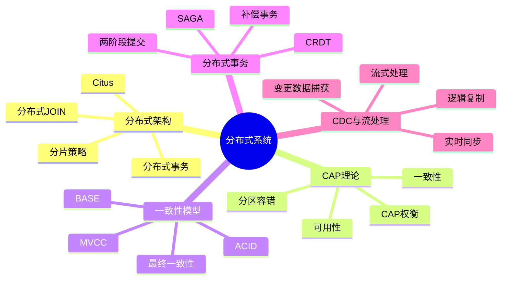
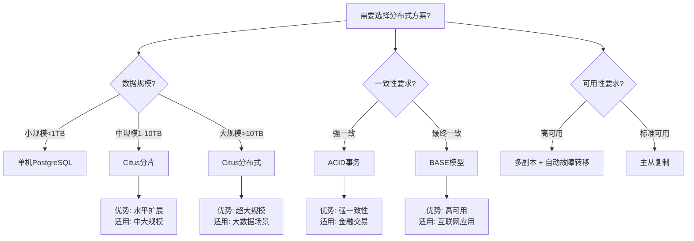

---

> **📋 文档来源**: `docs\04-Distributed\README.md`
> **📅 复制日期**: 2025-12-22
> **⚠️ 注意**: 本文档为复制版本，原文件保持不变

---

# 15-分布式系统

> **文档总数**: 30+个文档
> **覆盖领域**: Citus、分布式事务、CAP理论、一致性模型、CDC、流处理
> **版本覆盖**: PostgreSQL 18.x (推荐) ⭐ | 17.x (推荐) | 16.x (兼容)

---

## 📊 知识体系思维导图

---

## 🎯 本目录说明

**PostgreSQL分布式能力**的完整生产级指南。

---

## 📊 分布式方案选型决策树

---

## 📊 分布式方案对比矩阵

| 分布式方案 | 扩展性 | 一致性 | 可用性 | 复杂度 | 适用场景 |
|-----------|--------|--------|--------|--------|---------|
| **单机PostgreSQL** | ⭐⭐ | ⭐⭐⭐⭐⭐ | ⭐⭐⭐ | ⭐⭐ | 小规模应用 |
| **Citus分片** | ⭐⭐⭐⭐ | ⭐⭐⭐⭐ | ⭐⭐⭐⭐ | ⭐⭐⭐⭐ | 中大规模应用 |
| **Citus分布式** | ⭐⭐⭐⭐⭐ | ⭐⭐⭐⭐ | ⭐⭐⭐⭐⭐ | ⭐⭐⭐⭐⭐ | 超大规模应用 |
| **逻辑复制** | ⭐⭐⭐ | ⭐⭐⭐ | ⭐⭐⭐⭐ | ⭐⭐⭐ | 读写分离、多活 |

---

## 📋 计划创建的指南

### P7-1: Citus 12+ 完整深化指南 ⭐⭐⭐⭐⭐

**内容**：

- Citus架构深度解析
- 分片策略（hash、range）
- 分布式JOIN优化
- 高可用配置

**目标**: 2500行
**状态**: 🔵 进行中

---

### P7-2: 实时流处理完整指南 ⭐⭐⭐⭐

**目标**: 2000行
**状态**: 🔵 计划中

---

### P7-3: CDC完整实战指南 ⭐⭐⭐⭐

**目标**: 2000行
**状态**: 🔵 计划中

---

### P7-4: 并行查询深度优化指南 ⭐⭐⭐⭐

**目标**: 1500行
**状态**: 🔵 计划中

---

## 📊 预期成果

**完成后**：

- 📄 4个深度指南
- 📏 8,000行详细内容
- 🏢 8+个真实案例

**项目完整度**：97% → **99%**（最终目标！）

---

**最后冲刺！** 🚀💪

---

**最后更新**: 2025年12月4日
