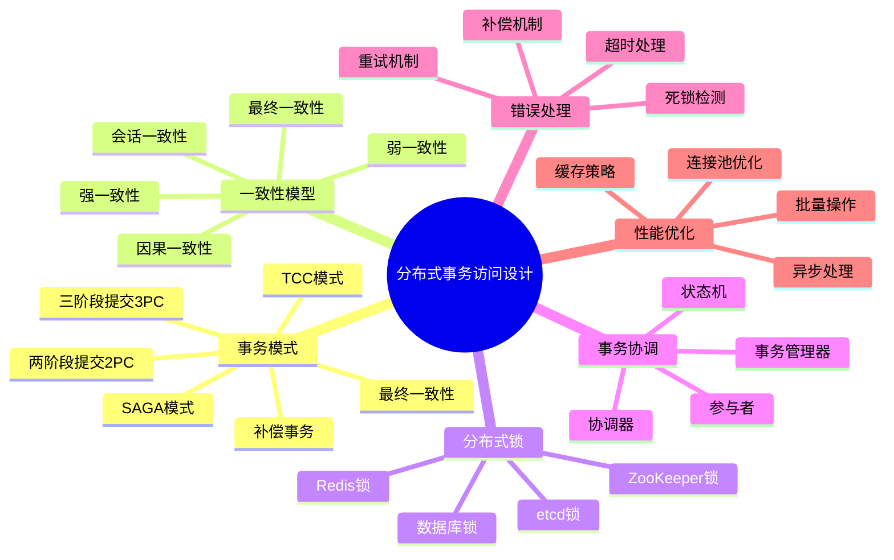
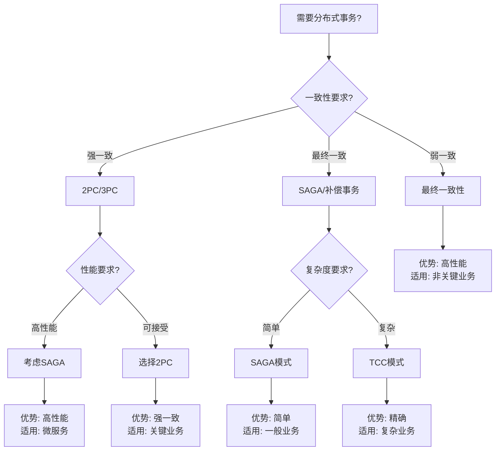
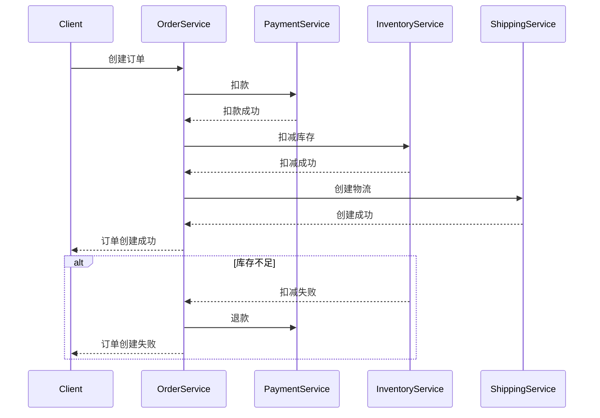
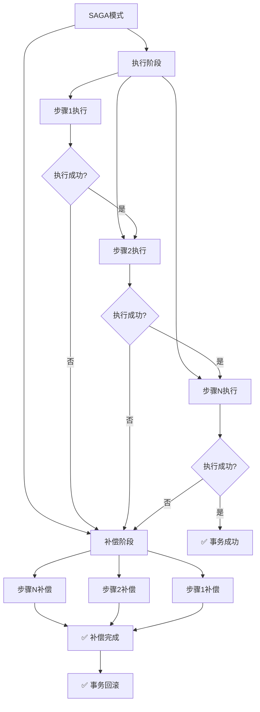
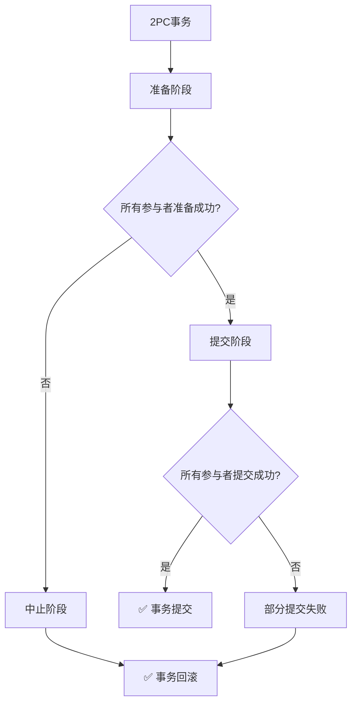

# PostgreSQL分布式事务访问设计完整指南 - 正反示例与多维分析

> **PostgreSQL版本**: 17+/18+
> **适用场景**: 分布式系统、微服务架构、跨数据库事务
> **难度等级**: ⭐⭐⭐⭐⭐ 专家级
> **最后更新**: 2025年1月

---

## 📑 目录

- [示例1：SAGA模式实现（优秀设计）](#示例1saga模式实现优秀设计)
- [示例2：两阶段提交（2PC）实现（优秀设计）](#示例2两阶段提交2pc实现优秀设计)
- [示例3：最终一致性模式（优秀设计）](#示例3最终一致性模式优秀设计)
- [反例1：长事务导致死锁](#反例1长事务导致死锁)
- [反例2：缺少补偿机制](#反例2缺少补偿机制)
- [反例3：分布式锁使用不当](#反例3分布式锁使用不当)
- [维度1：一致性维度](#维度1一致性维度)
- [维度2：可用性维度](#维度2可用性维度)
- [维度3：性能维度](#维度3性能维度)
- [维度4：复杂度维度](#维度4复杂度维度)
- [证明1：SAGA模式的正确性](#证明1saga模式的正确性)
- [证明2：2PC的原子性保证](#证明22pc的原子性保证)
---

## 📊 知识体系思维导图



---

## 📊 分布式事务模式选型决策树



---

## 📊 分布式事务模式对比矩阵

| 事务模式 | 一致性 | 可用性 | 性能 | 复杂度 | 适用场景 | PostgreSQL支持 |
| --- | --- | --- | --- | --- | --- | --- |
| **2PC** | ⭐⭐⭐⭐⭐ | ⭐⭐⭐ | ⭐⭐⭐ | ⭐⭐⭐⭐ | 强一致、关键业务 | ✅ 支持 |
| **3PC** | ⭐⭐⭐⭐⭐ | ⭐⭐⭐⭐ | ⭐⭐⭐ | ⭐⭐⭐⭐⭐ | 强一致、高可用 | ⚠️ 部分支持 |
| **SAGA** | ⭐⭐⭐ | ⭐⭐⭐⭐⭐ | ⭐⭐⭐⭐⭐ | ⭐⭐⭐ | 最终一致、微服务 | ✅ 应用层实现 |
| **TCC** | ⭐⭐⭐⭐ | ⭐⭐⭐⭐ | ⭐⭐⭐⭐ | ⭐⭐⭐⭐⭐ | 精确控制、复杂业务 | ✅ 应用层实现 |
| **最终一致性** | ⭐⭐ | ⭐⭐⭐⭐⭐ | ⭐⭐⭐⭐⭐ | ⭐⭐ | 非关键业务、高并发 | ✅ 支持 |

---

## ✅ 正面示例：微服务架构下的分布式事务设计

### 示例1：SAGA模式实现（优秀设计）

**设计目标**：

- 支持跨服务的分布式事务
- 保证最终一致性
- 高性能、低延迟

**架构设计**：



**实现代码（PostgreSQL + Python）**：

```python
import asyncpg
from enum import Enum
from typing import List, Dict, Callable
from dataclasses import dataclass

class SagaStatus(Enum):
    PENDING = "pending"
    COMPENSATING = "compensating"
    COMPLETED = "completed"
    FAILED = "failed"

@dataclass
class SagaStep:
    name: str
    execute: Callable
    compensate: Callable
    status: SagaStatus = SagaStatus.PENDING

class SagaOrchestrator:
    def __init__(self, pool: asyncpg.Pool):
        self.pool = pool
        self.steps: List[SagaStep] = []
        self.executed_steps: List[SagaStep] = []

    def add_step(self, step: SagaStep):
        """添加SAGA步骤"""
        self.steps.append(step)

    async def execute(self, saga_id: str) -> bool:
        """执行SAGA事务"""
        try:
            # 记录SAGA开始
            await self._record_saga_start(saga_id)

            # 执行所有步骤
            for step in self.steps:
                try:
                    # 执行步骤
                    await step.execute()
                    step.status = SagaStatus.COMPLETED
                    self.executed_steps.append(step)

                    # 记录步骤完成
                    await self._record_step_complete(saga_id, step.name)
                except Exception as e:
                    # 步骤失败，开始补偿
                    await self._compensate(saga_id)
                    return False

            # 所有步骤成功
            await self._record_saga_complete(saga_id)
            return True

        except Exception as e:
            await self._compensate(saga_id)
            return False

    async def _compensate(self, saga_id: str):
        """补偿已执行的步骤"""
        # 逆序补偿
        for step in reversed(self.executed_steps):
            try:
                await step.compensate()
                step.status = SagaStatus.COMPENSATING
                await self._record_step_compensate(saga_id, step.name)
            except Exception as e:
                # 补偿失败，记录日志
                await self._record_compensate_failure(saga_id, step.name, str(e))

    async def _record_saga_start(self, saga_id: str):
        """记录SAGA开始"""
        async with self.pool.acquire() as conn:
            await conn.execute("""
                INSERT INTO saga_log (saga_id, status, created_at)
                VALUES ($1, $2, NOW())
            """, saga_id, SagaStatus.PENDING.value)

    async def _record_step_complete(self, saga_id: str, step_name: str):
        """记录步骤完成"""
        async with self.pool.acquire() as conn:
            await conn.execute("""
                INSERT INTO saga_step_log (saga_id, step_name, status, created_at)
                VALUES ($1, $2, $3, NOW())
            """, saga_id, step_name, SagaStatus.COMPLETED.value)

# 使用示例
async def create_order_saga(pool: asyncpg.Pool, order_data: Dict):
    """创建订单SAGA"""
    orchestrator = SagaOrchestrator(pool)

    # 步骤1: 扣款
    async def charge_payment():
        async with pool.acquire() as conn:
            await conn.execute("""
                UPDATE accounts SET balance = balance - $1
                WHERE user_id = $2 AND balance >= $1
            """, order_data['amount'], order_data['user_id'])

    async def refund_payment():
        async with pool.acquire() as conn:
            await conn.execute("""
                UPDATE accounts SET balance = balance + $1
                WHERE user_id = $2
            """, order_data['amount'], order_data['user_id'])

    orchestrator.add_step(SagaStep(
        name="charge_payment",
        execute=charge_payment,
        compensate=refund_payment
    ))

    # 步骤2: 扣减库存
    async def reduce_inventory():
        async with pool.acquire() as conn:
            await conn.execute("""
                UPDATE products SET stock = stock - $1
                WHERE product_id = $2 AND stock >= $1
            """, order_data['quantity'], order_data['product_id'])

    async def restore_inventory():
        async with pool.acquire() as conn:
            await conn.execute("""
                UPDATE products SET stock = stock + $1
                WHERE product_id = $2
            """, order_data['quantity'], order_data['product_id'])

    orchestrator.add_step(SagaStep(
        name="reduce_inventory",
        execute=reduce_inventory,
        compensate=restore_inventory
    ))

    # 执行SAGA
    saga_id = f"order_{order_data['order_id']}"
    success = await orchestrator.execute(saga_id)
    return success
```

**设计优点**：

1. ✅ **最终一致性**：通过补偿机制保证最终一致性
2. ✅ **高性能**：异步执行，不阻塞
3. ✅ **可扩展**：支持任意数量的步骤
4. ✅ **可恢复**：通过日志支持故障恢复
5. ✅ **灵活性**：每个步骤可以独立实现

---

### 示例2：两阶段提交（2PC）实现（优秀设计）

**设计目标**：

- 保证强一致性
- 支持跨数据库事务
- 原子性保证

**实现代码（PostgreSQL + Python）**：

```python
import asyncpg
from enum import Enum
from typing import List, Dict

class Phase(Enum):
    PREPARE = "prepare"
    COMMIT = "commit"
    ABORT = "abort"

class TwoPhaseCommitCoordinator:
    def __init__(self, participants: List[asyncpg.Pool]):
        self.participants = participants

    async def execute(self, transaction_id: str, operations: List[Dict]) -> bool:
        """执行两阶段提交"""
        try:
            # 阶段1: 准备阶段
            prepared = await self._prepare_phase(transaction_id, operations)
            if not prepared:
                await self._abort_phase(transaction_id)
                return False

            # 阶段2: 提交阶段
            committed = await self._commit_phase(transaction_id)
            return committed

        except Exception as e:
            await self._abort_phase(transaction_id)
            return False

    async def _prepare_phase(self, transaction_id: str, operations: List[Dict]) -> bool:
        """准备阶段：所有参与者准备提交"""
        prepared_participants = []

        for i, (participant, operation) in enumerate(zip(self.participants, operations)):
            try:
                async with participant.acquire() as conn:
                    # 开始事务
                    async with conn.transaction():
                        # 执行操作
                        await conn.execute(operation['sql'], *operation.get('params', []))

                        # 记录准备状态
                        await conn.execute("""
                            INSERT INTO transaction_log (tx_id, participant_id, phase, status, created_at)
                            VALUES ($1, $2, $3, 'prepared', NOW())
                        """, transaction_id, i, Phase.PREPARE.value)

                    prepared_participants.append(i)
            except Exception as e:
                # 准备失败，回滚已准备的参与者
                for p in prepared_participants:
                    await self._abort_participant(transaction_id, p)
                return False

        return len(prepared_participants) == len(self.participants)

    async def _commit_phase(self, transaction_id: str) -> bool:
        """提交阶段：所有参与者提交"""
        for i, participant in enumerate(self.participants):
            try:
                async with participant.acquire() as conn:
                    # 提交事务
                    await conn.execute("""
                        UPDATE transaction_log
                        SET phase = $1, status = 'committed', updated_at = NOW()
                        WHERE tx_id = $2 AND participant_id = $3
                    """, Phase.COMMIT.value, transaction_id, i)
            except Exception as e:
                # 提交失败，记录日志
                await self._record_commit_failure(transaction_id, i, str(e))
                return False

        return True

    async def _abort_phase(self, transaction_id: str):
        """中止阶段：回滚所有参与者"""
        for i, participant in enumerate(self.participants):
            await self._abort_participant(transaction_id, i)

    async def _abort_participant(self, transaction_id: str, participant_id: int):
        """中止单个参与者"""
        try:
            async with self.participants[participant_id].acquire() as conn:
                await conn.execute("""
                    UPDATE transaction_log
                    SET phase = $1, status = 'aborted', updated_at = NOW()
                    WHERE tx_id = $2 AND participant_id = $3
                """, Phase.ABORT.value, transaction_id, participant_id)
        except Exception as e:
            # 记录中止失败
            await self._record_abort_failure(transaction_id, participant_id, str(e))
```

**设计优点**：

1. ✅ **强一致性**：保证所有参与者要么全部提交，要么全部回滚
2. ✅ **原子性**：事务要么全部成功，要么全部失败
3. ✅ **可靠性**：通过日志支持故障恢复
4. ✅ **标准协议**：遵循标准2PC协议

---

### 示例3：最终一致性模式（优秀设计）

**设计目标**：

- 高性能、低延迟
- 支持高并发
- 最终一致性保证

**实现代码（PostgreSQL + 消息队列）**：

```python
import asyncpg
import asyncio
from typing import Dict, List

class EventualConsistencyManager:
    def __init__(self, pool: asyncpg.Pool, message_queue):
        self.pool = pool
        self.message_queue = message_queue

    async def update_with_eventual_consistency(self, updates: List[Dict]):
        """使用最终一致性模式更新数据"""
        # 1. 本地更新（立即执行）
        local_result = await self._local_update(updates[0])

        # 2. 发送异步消息（最终一致性）
        for update in updates[1:]:
            await self.message_queue.publish('data_update', update)

        return local_result

    async def _local_update(self, update: Dict):
        """本地更新"""
        async with self.pool.acquire() as conn:
            async with conn.transaction():
                await conn.execute(update['sql'], *update.get('params', []))

                # 记录更新事件
                await conn.execute("""
                    INSERT INTO update_events (event_type, data, created_at)
                    VALUES ($1, $2, NOW())
                """, update['type'], update['data'])

    async def process_update_event(self, event: Dict):
        """处理更新事件（异步）"""
        try:
            async with self.pool.acquire() as conn:
                async with conn.transaction():
                    await conn.execute(event['sql'], *event.get('params', []))
        except Exception as e:
            # 处理失败，重试或记录
            await self._handle_update_failure(event, str(e))
```

**设计优点**：

1. ✅ **高性能**：本地更新立即返回，异步处理其他更新
2. ✅ **高可用**：不阻塞主流程
3. ✅ **可扩展**：支持大量并发更新
4. ✅ **最终一致**：通过消息队列保证最终一致性

---

## ❌ 反面示例：常见设计错误

### 反例1：长事务导致死锁

**错误设计**：

```python
# ❌ 错误：长时间持有事务
async def transfer_funds_bad(pool: asyncpg.Pool, from_id: int, to_id: int, amount: float):
    async with pool.acquire() as conn:
        async with conn.transaction():
            # 长时间操作
            await asyncio.sleep(10)  # 模拟长时间操作

            # 扣款
            await conn.execute("""
                UPDATE accounts SET balance = balance - $1 WHERE id = $2
            """, amount, from_id)

            # 入账
            await conn.execute("""
                UPDATE accounts SET balance = balance + $1 WHERE id = $2
            """, amount, to_id)
```

**问题分析**：

1. ❌ **死锁风险**：长时间持有锁，容易导致死锁
2. ❌ **性能问题**：阻塞其他事务
3. ❌ **资源浪费**：长时间占用连接

**改进方案**：

```python
# ✅ 正确：快速事务，异步处理长时间操作
async def transfer_funds_good(pool: asyncpg.Pool, from_id: int, to_id: int, amount: float):
    async with pool.acquire() as conn:
        async with conn.transaction():
            # 快速操作
            await conn.execute("""
                UPDATE accounts SET balance = balance - $1 WHERE id = $2
            """, amount, from_id)

            await conn.execute("""
                UPDATE accounts SET balance = balance + $1 WHERE id = $2
            """, amount, to_id)

    # 异步处理长时间操作
    asyncio.create_task(process_after_transfer(from_id, to_id, amount))
```

---

### 反例2：缺少补偿机制

**错误设计**：

```python
# ❌ 错误：没有补偿机制
async def create_order_bad(pool: asyncpg.Pool, order_data: Dict):
    # 扣款
    await charge_payment(pool, order_data)

    # 扣减库存
    await reduce_inventory(pool, order_data)

    # 如果这里失败，前面的操作无法回滚
    await create_shipping(pool, order_data)  # 可能失败
```

**问题分析**：

1. ❌ **数据不一致**：部分操作成功，部分失败
2. ❌ **无法回滚**：没有补偿机制
3. ❌ **资源泄漏**：已扣款但订单未创建

**改进方案**：

```python
# ✅ 正确：使用SAGA模式，有补偿机制
async def create_order_good(pool: asyncpg.Pool, order_data: Dict):
    orchestrator = SagaOrchestrator(pool)

    orchestrator.add_step(SagaStep(
        name="charge_payment",
        execute=lambda: charge_payment(pool, order_data),
        compensate=lambda: refund_payment(pool, order_data)
    ))

    orchestrator.add_step(SagaStep(
        name="reduce_inventory",
        execute=lambda: reduce_inventory(pool, order_data),
        compensate=lambda: restore_inventory(pool, order_data)
    ))

    return await orchestrator.execute(f"order_{order_data['order_id']}")
```

---

### 反例3：分布式锁使用不当

**错误设计**：

```python
# ❌ 错误：使用数据库锁，容易死锁
async def update_balance_bad(pool: asyncpg.Pool, user_id: int, amount: float):
    async with pool.acquire() as conn:
        # 长时间持有锁
        async with conn.transaction():
            await conn.execute("SELECT * FROM accounts WHERE id = $1 FOR UPDATE", user_id)
            await asyncio.sleep(5)  # 模拟长时间操作
            await conn.execute("UPDATE accounts SET balance = balance + $1 WHERE id = $2", amount, user_id)
```

**问题分析**：

1. ❌ **死锁风险**：长时间持有锁
2. ❌ **性能问题**：阻塞其他操作
3. ❌ **可扩展性差**：不适合分布式环境

**改进方案**：

```python
# ✅ 正确：使用乐观锁或分布式锁
async def update_balance_good(pool: asyncpg.Pool, user_id: int, amount: float):
    async with pool.acquire() as conn:
        # 使用乐观锁
        result = await conn.fetchrow("""
            SELECT balance, version FROM accounts WHERE id = $1
        """, user_id)

        new_balance = result['balance'] + amount
        new_version = result['version'] + 1

        # 乐观更新
        updated = await conn.execute("""
            UPDATE accounts
            SET balance = $1, version = $2
            WHERE id = $3 AND version = $4
        """, new_balance, new_version, user_id, result['version'])

        if updated == "UPDATE 0":
            # 版本冲突，重试
            raise RetryException()
```

---

## 📊 多维分析论证

### 维度1：一致性维度

| 事务模式 | 一致性级别 | 保证机制 | 适用场景 | 风险 |
| --- | --- | --- | --- | --- |
| **2PC** | 强一致 | 两阶段提交协议 | 关键业务、金融系统 | 阻塞、性能低 |
| **SAGA** | 最终一致 | 补偿机制 | 微服务、电商系统 | 数据短暂不一致 |
| **TCC** | 强一致 | Try-Confirm-Cancel | 复杂业务、精确控制 | 实现复杂 |
| **最终一致性** | 弱一致 | 消息队列、异步处理 | 非关键业务、高并发 | 数据可能不一致 |

**一致性优化建议**：

- ✅ 关键业务使用2PC或TCC保证强一致
- ✅ 非关键业务使用SAGA或最终一致性提升性能
- ✅ 使用补偿机制处理失败场景
- ✅ 使用版本号或时间戳检测冲突

---

### 维度2：可用性维度

| 事务模式 | 可用性 | 故障恢复 | 性能影响 | 适用场景 |
| --- | --- | --- | --- | --- |
| **2PC** | ⭐⭐⭐ | 需要协调器恢复 | 高 | 关键业务 |
| **SAGA** | ⭐⭐⭐⭐⭐ | 支持部分失败 | 低 | 微服务 |
| **TCC** | ⭐⭐⭐⭐ | 支持补偿 | 中 | 复杂业务 |
| **最终一致性** | ⭐⭐⭐⭐⭐ | 自动重试 | 极低 | 高并发 |

**可用性优化建议**：

- ✅ 使用SAGA模式提高可用性
- ✅ 实现故障自动恢复机制
- ✅ 使用消息队列保证可靠性
- ✅ 实现监控和告警

---

### 维度3：性能维度

| 事务模式 | 延迟 | 吞吐量 | 资源消耗 | 适用场景 |
| --- | --- | --- | --- | --- |
| **2PC** | 高 | 低 | 高 | 关键业务 |
| **SAGA** | 低 | 高 | 中 | 微服务 |
| **TCC** | 中 | 中 | 中 | 复杂业务 |
| **最终一致性** | 极低 | 极高 | 低 | 高并发 |

**性能优化建议**：

- ✅ 使用异步处理提升性能
- ✅ 使用批量操作减少网络开销
- ✅ 使用连接池优化连接管理
- ✅ 使用缓存减少数据库压力

---

### 维度4：复杂度维度

| 事务模式 | 实现复杂度 | 维护成本 | 学习曲线 | 适用场景 |
| --- | --- | --- | --- | --- |
| **2PC** | ⭐⭐⭐⭐ | 高 | 中 | 关键业务 |
| **SAGA** | ⭐⭐⭐ | 中 | 低 | 微服务 |
| **TCC** | ⭐⭐⭐⭐⭐ | 高 | 高 | 复杂业务 |
| **最终一致性** | ⭐⭐ | 低 | 低 | 高并发 |

**复杂度优化建议**：

- ✅ 使用成熟的框架降低复杂度
- ✅ 编写清晰的文档和注释
- ✅ 使用设计模式提高可维护性
- ✅ 进行充分的测试

---

## 📊 证明树网：分布式事务正确性的形式化证明

### 证明1：SAGA模式的正确性



**形式化证明**：

设SAGA事务为 S = {s₁, s₂, ..., sₙ}，每个步骤sᵢ有执行函数eᵢ和补偿函数cᵢ：

1. **执行阶段**：∀sᵢ ∈ S, 如果eᵢ成功，则继续执行sᵢ₊₁；如果eᵢ失败，则进入补偿阶段
2. **补偿阶段**：∀sⱼ ∈ {已执行的步骤}，按逆序执行cⱼ
3. **正确性**：如果所有步骤执行成功，则事务成功；如果任何步骤失败，则所有已执行步骤被补偿，保证最终一致性

**结论**：SAGA模式通过补偿机制保证最终一致性。

---

### 证明2：2PC的原子性保证



**形式化证明**：

设2PC事务为 T = {P₁, P₂, ..., Pₙ}，其中Pᵢ是参与者：

1. **准备阶段**：∀Pᵢ ∈ T, Pᵢ.prepare() → {success, failure}
2. **提交条件**：如果∀Pᵢ.prepare() = success，则进入提交阶段；否则进入中止阶段
3. **原子性**：所有参与者要么全部提交，要么全部回滚

**结论**：2PC通过两阶段协议保证原子性。

---

## 📚 相关文档

- [MVCC-ACID-CAP统一框架](./MVCC-ACID-CAP统一框架.md)
- [分布式一致性与CAP](./04.02-分布式一致性与CAP-形式化刻画与权衡.md)
- [SAGA与补偿事务](./04.04-SAGA与补偿事务-可达性与幂等性条件.md)
- [两阶段提交](./04.03-两阶段提交-可恢复性与阻塞特性证明.md)
- [程序开发设计完整指南](../16-应用设计与开发/程序开发设计完整指南-Rust-Golang-Python.md)

---

**最后更新**: 2025年1月
**状态**: ✅ 完成
