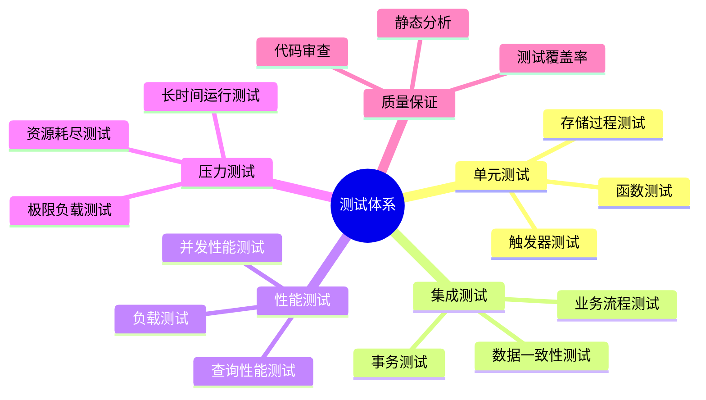
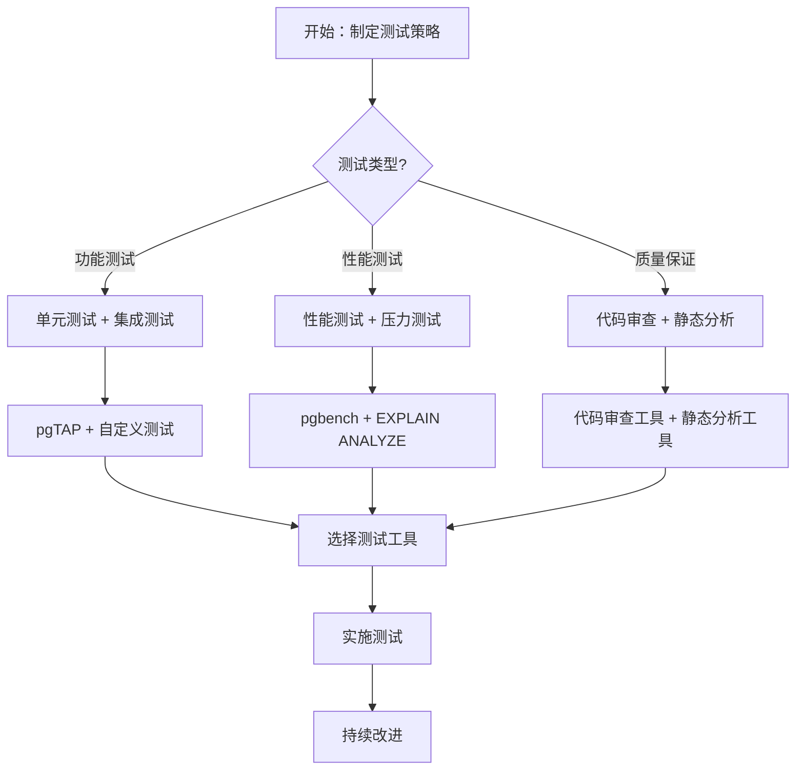

# PostgreSQL测试与质量保证完整指南

## 元数据

- **文档版本**: v1.0
- **创建日期**: 2025-01
- **技术栈**: PostgreSQL 17+/18+ | pgTAP | pgbench | 测试自动化 | 质量保证
- **难度级别**: ⭐⭐⭐⭐ (高级)
- **预计阅读**: 170分钟
- **前置要求**: 熟悉PostgreSQL基础、测试基础

---

## 📋 完整目录

- [PostgreSQL测试与质量保证完整指南](#postgresql测试与质量保证完整指南)
  - [元数据](#元数据)
  - [📋 完整目录](#-完整目录)
  - [1. 测试与质量保证概述](#1-测试与质量保证概述)
    - [1.1 测试体系](#11-测试体系)
    - [1.2 测试策略决策流程图](#12-测试策略决策流程图)
  - [2. 数据库测试策略](#2-数据库测试策略)
    - [2.1 单元测试场景](#21-单元测试场景)
    - [2.2 集成测试场景](#22-集成测试场景)
    - [2.3 性能测试场景](#23-性能测试场景)
  - [3. 测试数据管理](#3-测试数据管理)
    - [3.1 测试数据生成](#31-测试数据生成)
    - [3.2 测试数据隔离](#32-测试数据隔离)
  - [4. 测试自动化](#4-测试自动化)
    - [4.1 CI/CD集成场景](#41-cicd集成场景)
    - [4.2 自动化测试实现](#42-自动化测试实现)
  - [5. 质量保证流程](#5-质量保证流程)
    - [5.1 代码审查场景](#51-代码审查场景)
    - [5.2 质量检查实现](#52-质量检查实现)
  - [6. 综合选型案例](#6-综合选型案例)
    - [6.1 案例1：企业级测试框架](#61-案例1企业级测试框架)
  - [📚 参考资源](#-参考资源)
    - [官方文档](#官方文档)
    - [相关文档](#相关文档)
  - [📝 更新日志](#-更新日志)

---

## 1. 测试与质量保证概述

### 1.1 测试体系

**测试体系架构**:



### 1.2 测试策略决策流程图



---

## 2. 数据库测试策略

### 2.1 单元测试场景

**业务需求**:

```text
场景：数据库函数单元测试
需求：
1. 函数功能测试
2. 边界条件测试
3. 错误处理测试
```

**实现方案**:

```sql
-- 使用pgTAP进行单元测试
BEGIN;
SELECT plan(5);

-- 测试函数
-- 计算总价函数（带完整错误处理）
CREATE OR REPLACE FUNCTION calculate_total(
    p_amount NUMERIC,
    p_tax_rate NUMERIC
)
RETURNS NUMERIC
LANGUAGE plpgsql
AS $$
DECLARE
    v_result NUMERIC;
BEGIN
    -- 参数验证
    IF p_amount IS NULL THEN
        RAISE EXCEPTION '金额不能为空';
    END IF;

    IF p_tax_rate IS NULL THEN
        RAISE EXCEPTION '税率不能为空';
    END IF;

    IF p_amount < 0 THEN
        RAISE EXCEPTION '金额不能为负数: %', p_amount;
    END IF;

    IF p_tax_rate < 0 OR p_tax_rate > 1 THEN
        RAISE EXCEPTION '税率必须在0-1之间: %', p_tax_rate;
    END IF;

    -- 计算总价
    BEGIN
        v_result := p_amount * (1 + p_tax_rate);

        -- 检查数值溢出
        IF v_result IS NULL THEN
            RAISE EXCEPTION '计算结果为空';
        END IF;

        RETURN v_result;
    EXCEPTION
        WHEN numeric_value_out_of_range THEN
            RAISE EXCEPTION '计算结果超出数值范围';
        WHEN OTHERS THEN
            RAISE EXCEPTION '计算总价失败: %', SQLERRM;
    END;
EXCEPTION
    WHEN OTHERS THEN
        RAISE EXCEPTION 'calculate_total执行失败: %', SQLERRM;
END;
$$;

-- 测试用例
SELECT ok(
    calculate_total(100, 0.1) = 110,
    'calculate_total should return 110 for 100 with 10% tax'
);

SELECT ok(
    calculate_total(0, 0.1) = 0,
    'calculate_total should return 0 for 0 amount'
);

SELECT ok(
    calculate_total(100, 0) = 100,
    'calculate_total should return 100 for 0% tax'
);

SELECT throws_ok(
    'SELECT calculate_total(NULL, 0.1)',
    'calculate_total should throw error for NULL amount'
);

SELECT throws_ok(
    'SELECT calculate_total(100, NULL)',
    'calculate_total should throw error for NULL tax_rate'
);

SELECT * FROM finish();
ROLLBACK;
```

### 2.2 集成测试场景

**实现方案**:

```sql
-- 集成测试：完整业务流程
BEGIN;

-- 测试数据准备
INSERT INTO users (name, email) VALUES ('Test User', 'test@example.com');
INSERT INTO products (name, price) VALUES ('Test Product', 100);

-- 执行业务流程
INSERT INTO orders (user_id, product_id, quantity)
SELECT u.id, p.id, 2
FROM users u, products p
WHERE u.email = 'test@example.com' AND p.name = 'Test Product';

-- 验证结果
SELECT ok(
    (SELECT COUNT(*) FROM orders) = 1,
    'Order should be created'
);

SELECT ok(
    (SELECT total_amount FROM orders) = 200,
    'Order total should be 200'
);

ROLLBACK;
```

### 2.3 性能测试场景

**实现方案**:

```sql
-- 性能测试：查询性能
EXPLAIN ANALYZE
SELECT u.name, COUNT(o.id) AS order_count, SUM(o.amount) AS total_amount
FROM users u
LEFT JOIN orders o ON u.id = o.user_id
WHERE u.created_at > '2024-01-01'
GROUP BY u.id, u.name
HAVING COUNT(o.id) > 10
ORDER BY total_amount DESC
LIMIT 100;
```

---

## 3. 测试数据管理

### 3.1 测试数据生成

**数据生成实现**:

```sql
-- 创建测试数据生成函数
-- 生成测试数据函数（带完整错误处理和安全验证）
CREATE OR REPLACE FUNCTION generate_test_data(
    p_table_name TEXT,
    p_row_count INT
)
RETURNS void
LANGUAGE plpgsql
AS $$
DECLARE
    i INT;
    v_inserted_count INT := 0;
BEGIN
    -- 参数验证
    IF p_table_name IS NULL OR length(trim(p_table_name)) = 0 THEN
        RAISE EXCEPTION '表名不能为空';
    END IF;

    IF p_row_count IS NULL OR p_row_count <= 0 THEN
        RAISE EXCEPTION '行数必须大于0: %', p_row_count;
    END IF;

    IF p_row_count > 1000000 THEN
        RAISE EXCEPTION '行数过大: % (最大1000000)', p_row_count;
    END IF;

    -- 验证表名格式（防止SQL注入）
    IF p_table_name !~ '^[a-zA-Z_][a-zA-Z0-9_]*$' THEN
        RAISE EXCEPTION '表名格式无效: % (只允许字母、数字、下划线)', p_table_name;
    END IF;

    -- 检查表是否存在
    IF NOT EXISTS (SELECT 1 FROM information_schema.tables WHERE table_schema = 'public' AND table_name = p_table_name) THEN
        RAISE EXCEPTION '表不存在: %', p_table_name;
    END IF;

    -- 生成测试数据
    BEGIN
        FOR i IN 1..p_row_count LOOP
            BEGIN
                EXECUTE format('INSERT INTO %I (name, email, created_at) VALUES ($1, $2, $3)',
                    p_table_name)
                USING
                    'User ' || i,
                    'user' || i || '@example.com',
                    NOW() - (random() * INTERVAL '365 days');

                v_inserted_count := v_inserted_count + 1;
            EXCEPTION
                WHEN undefined_table THEN
                    RAISE EXCEPTION '表不存在: %', p_table_name;
                WHEN undefined_column THEN
                    RAISE EXCEPTION '表 % 缺少必要的列 (name, email, created_at)', p_table_name;
                WHEN unique_violation THEN
                    RAISE WARNING '第 % 条记录违反唯一约束，跳过', i;
                WHEN OTHERS THEN
                    RAISE WARNING '插入第 % 条记录失败: %', i, SQLERRM;
            END;
        END LOOP;

        RAISE NOTICE '测试数据生成完成: 成功插入 % 条记录到表 %', v_inserted_count, p_table_name;
    EXCEPTION
        WHEN OTHERS THEN
            RAISE EXCEPTION '生成测试数据失败: %', SQLERRM;
    END;
EXCEPTION
    WHEN OTHERS THEN
        RAISE EXCEPTION 'generate_test_data执行失败: %', SQLERRM;
END;
$$;
```

### 3.2 测试数据隔离

**数据隔离实现**:

```sql
-- 使用事务隔离测试数据
BEGIN;
-- 测试操作
-- ...
ROLLBACK;  -- 自动清理测试数据
```

---

## 4. 测试自动化

### 4.1 CI/CD集成场景

**业务需求**:

```text
场景：CI/CD集成测试
需求：
1. 自动化测试执行
2. 测试报告生成
3. 测试结果通知
```

### 4.2 自动化测试实现

**GitHub Actions配置**:

```yaml
# .github/workflows/postgresql-tests.yml
name: PostgreSQL Tests

on: [push, pull_request]

jobs:
  test:
    runs-on: ubuntu-latest
    services:
      postgres:
        image: postgres:18
        env:
          POSTGRES_PASSWORD: postgres
        options: >-
          --health-cmd pg_isready
          --health-interval 10s
          --health-timeout 5s
          --health-retries 5

    steps:
    - uses: actions/checkout@v2

    - name: Install pgTAP
      run: |
        sudo apt-get update
        sudo apt-get install -y postgresql-18-pgtap

    - name: Run tests
      run: |
        pg_prove -d postgres -U postgres tests/

    - name: Generate test report
      run: |
        pg_prove -d postgres -U postgres --formatter TAP tests/ > test-report.txt
```

---

## 5. 质量保证流程

### 5.1 代码审查场景

**审查清单**:

```text
代码审查清单：
1. SQL语法正确性
2. 性能优化
3. 安全性检查
4. 错误处理
5. 文档完整性
```

### 5.2 质量检查实现

**质量检查脚本**:

```bash
#!/bin/bash
# 代码质量检查脚本

# SQL语法检查
psql -d mydb -f check_syntax.sql

# 性能检查
psql -d mydb -f check_performance.sql

# 安全检查
psql -d mydb -f check_security.sql
```

---

## 6. 综合选型案例

### 6.1 案例1：企业级测试框架

**业务背景**:

- 企业级应用
- 严格质量要求
- 自动化测试

**实现方案**:

```text
测试框架：
1. 单元测试：pgTAP
2. 集成测试：自定义测试框架
3. 性能测试：pgbench + EXPLAIN ANALYZE
4. 自动化：CI/CD集成
5. 质量保证：代码审查 + 静态分析
```

---

## 📚 参考资源

### 官方文档

- [pgTAP文档](https://pgtap.org/)
- [pgbench文档](https://www.postgresql.org/docs/current/pgbench.html)

### 相关文档

- [测试完整指南](./测试与质量保证/测试完整指南.md)
- [单元测试](./测试与质量保证/单元测试.md)
- [集成测试](./测试与质量保证/集成测试.md)
- [性能测试](./测试与质量保证/性能测试.md)

---

## 📝 更新日志

- **2025-01**: 初始版本创建
  - 完成数据库测试策略
  - 完成测试数据管理
  - 完成测试自动化
  - 完成质量保证流程

---

**最后更新**: 2025年1月
**状态**: ✅ 完成
