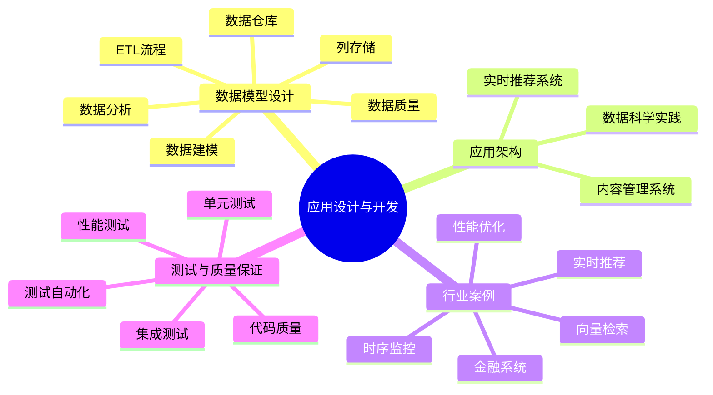
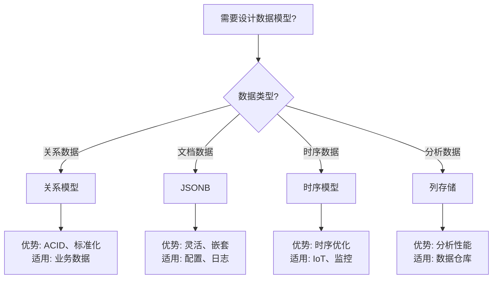

---

> **📋 文档来源**: `PostgreSQL\09-应用设计\README.md`
> **📅 复制日期**: 2025-12-22
> **⚠️ 注意**: 本文档为复制版本，原文件保持不变

---

# 16-应用设计与开发

> **文档总数**: 23+个文档
> **覆盖领域**: 数据模型设计、应用架构、行业案例、测试与质量保证
> **版本覆盖**: PostgreSQL 18.x (推荐) ⭐ | 17.x (推荐) | 16.x (兼容)
> **最后更新**: 2025年1月
> **文档状态**: ✅ 所有文档已完成详细展开

---

## 📊 知识体系思维导图



---

## 📋 目录结构

```text
16-应用设计与开发/
├── 程序开发设计完整指南-Rust-Golang-Python.md ⭐ 多语言集成
├── 程序开发设计完整指南-JavaScript-TypeScript.md ⭐ 新增 JS/TS集成
├── 事务访问程序设计完整指南-正反示例与多维分析.md ⭐ 新增 事务处理
├── 数据库设计完整指南-正反示例与多维分析.md ⭐ 数据库设计
├── 数据模型设计/          # 数据模型设计完整指南
│   ├── 09.01-数据分析完整指南.md
│   ├── 09.02-数据建模完整指南.md
│   ├── 09.03-数据仓库设计指南.md
│   ├── 09.04-ETL流程完整指南.md
│   ├── 09.05-数据质量管理指南.md
│   ├── 09.06-列存储技术栈对比指南.md 🆕
│   ├── 09.07-列存储最佳实践指南.md 🆕
│   └── README.md
├── 应用架构/              # 应用架构实践指南
│   ├── 07.04-内容管理系统.md
│   ├── 07.05-实时推荐系统.md
│   ├── 07.06-数据科学实践.md
│   └── README.md
├── 行业案例/              # 行业案例实践
│   ├── 金融账务一致性.md
│   ├── 时序监控.md
│   ├── 实时推荐.md
│   ├── 向量检索与RAG.md
│   ├── 性能问题-案例库.md
│   └── README.md
└── 测试与质量保证/        # 测试与质量保证完整指南 🆕
    ├── 测试完整指南.md
    ├── 单元测试.md
    ├── 集成测试.md
    ├── 性能测试.md
    ├── 压力测试.md
    ├── 测试自动化.md
    ├── 代码质量检查.md
    └── README.md
```

---

## 📊 文档统计

| 子目录 | 文档数 | 总行数 | SQL示例 | 状态 |
| --- | --- | --- | --- | --- |
| 数据模型设计 | 7个 | 7300+行 | 370+ | ✅ 完成 🆕 |
| 应用架构 | 3个 | 3423行 | 240+ | ✅ 完成 |
| 行业案例 | 5个 | 5070行 | 300+ | ✅ 完成 |
| 测试与质量保证 | 8个 | 2000+行 | 150+ | ✅ 完成 🆕 |
| **总计** | **23个** | **17793+行** | **1060+** | **✅ 完成** |

---

## 🎯 文档特点

### 1. 数据模型设计

- ✅ 数据分析完整指南（关系深度学习、图基特征合成等前沿技术）
- ✅ 数据建模完整指南（DDD、U-Schema等现代建模方法）
- ✅ 数据仓库设计指南（实时数据仓库、数据湖集成、AI辅助建模、数据网格）
- ✅ ETL流程完整指南（PostgreSQL 18新特性应用）
- ✅ 数据质量管理指南（AI辅助数据质量管理）
- ✅ 列存储技术栈对比指南 🆕（8种技术栈对比、选型决策树）
- ✅ 列存储最佳实践指南 🆕（设计、查询、性能优化、运维最佳实践）

### 2. 应用架构

- ✅ 内容管理系统（CMS完整实践）
- ✅ 实时推荐系统（向量召回、混合检索）
- ✅ 数据科学实践（特征工程、在线推理）

### 3. 行业案例

- ✅ 金融账务一致性（ACID事务、审计轨迹）
- ✅ 时序监控（分区策略、BRIN索引）
- ✅ 实时推荐（流式ETL、物化视图）
- ✅ 向量检索与RAG（pgvector、混合检索）
- ✅ 性能问题-案例库（8个详细案例）

### 4. 程序开发设计 ⭐ 新增

- ✅ **[程序开发设计完整指南-Rust-Golang-Python.md](./程序开发设计完整指南-Rust-Golang-Python.md)** - Rust/Go/Python集成指南
  - 高性能连接池设计
  - 多语言数据库访问模式
  - 错误处理和性能优化
  - **1700+行**，包含100+个代码示例

- ✅ **[程序开发设计完整指南-JavaScript-TypeScript.md](./程序开发设计完整指南-JavaScript-TypeScript.md)** ⭐ 新增
  - JavaScript/TypeScript与PostgreSQL集成完整指南
  - Node.js、Deno、Bun运行时支持
  - Prisma、TypeORM、pg等驱动对比
  - 完整的思维导图、决策树、对比矩阵、证明树网
  - 4个正面示例 + 4个反面示例
  - **1100+行**，包含80+个代码示例

- ✅ **[事务访问程序设计完整指南-正反示例与多维分析.md](./事务访问程序设计完整指南-正反示例与多维分析.md)** ⭐ 新增
  - 多语言事务处理完整指南（Rust、Go、Python、JavaScript、TypeScript）
  - 事务模式选型决策树
  - 事务隔离级别对比分析
  - 完整的思维导图、决策树、对比矩阵、证明树网
  - 5个多语言正面示例 + 5个多语言反面示例
  - 事务ACID特性形式化证明
  - **1400+行**，包含90+个代码示例

- ✅ **[数据库设计完整指南-正反示例与多维分析.md](./数据库设计完整指南-正反示例与多维分析.md)**
  - 数据库设计完整指南
  - 正反示例对比分析
  - 多维分析论证

### 5. 测试与质量保证 🆕

- ✅ 测试完整指南（测试类型、工具、策略）
- ✅ 单元测试（pgTAP使用、函数测试、触发器测试）
- ✅ 集成测试（业务流程测试、数据一致性测试）
- ✅ 性能测试（pgbench使用、查询性能测试）
- ✅ 压力测试（压力测试工具、测试场景、监控指标）
- ✅ 测试自动化（CI/CD集成、自动化脚本、测试报告）
- ✅ 代码质量检查（SQL检查工具、代码审查、静态分析）
- **[PostgreSQL测试与质量保证完整指南.md](./PostgreSQL测试与质量保证完整指南.md)** ⭐⭐⭐⭐⭐ ⭐ 新增
  - 数据库测试策略（单元测试、集成测试、性能测试）
  - 测试数据管理（测试数据生成、测试数据隔离）
  - 测试自动化（CI/CD集成、自动化测试实现）
  - 质量保证流程（代码审查、质量检查）
  - 综合选型案例（企业级测试框架）
  - **字数**: 约22,000字
  - **状态**: ✅ 已完成

---

## 📊 数据模型设计选型决策树



---

## 📊 应用架构模式对比矩阵

| 架构模式 | 复杂度 | 性能 | 扩展性 | 适用场景 |
| --- | --- | --- | --- | --- |
| **单体架构** | ⭐⭐ | ⭐⭐⭐⭐ | ⭐⭐ | 小型应用 |
| **微服务架构** | ⭐⭐⭐⭐⭐ | ⭐⭐⭐ | ⭐⭐⭐⭐⭐ | 大型应用 |
| **事件驱动架构** | ⭐⭐⭐⭐ | ⭐⭐⭐⭐ | ⭐⭐⭐⭐ | 实时应用 |
| **CQRS架构** | ⭐⭐⭐⭐ | ⭐⭐⭐⭐⭐ | ⭐⭐⭐⭐ | 读写分离场景 |

---

## 🔗 相关文档

### 核心课程

- [系统架构与设计原理](../01-核心基础/01.02-系统架构/01.01-系统架构与设计原理.md) - 系统架构理论
- [关系数据模型与理论](../01-核心基础/01.03-数据模型/01.02-关系数据模型与理论.md) - 数据模型理论
- [SQL语言规范与标准](../01-核心基础/01.04-SQL语言/01.03-SQL语言规范与标准.md) - SQL语言规范
- [事务管理与ACID特性](../03-事务与并发/03.02-ACID特性/01.04-事务管理与ACID特性.md) - 事务理论基础
- [并发控制与MVCC机制](../03-事务与并发/03.01-MVCC机制/01.05-并发控制与MVCC机制.md) - 并发控制机制
- [存储管理与数据持久化](../04-存储与恢复/01.06-存储管理与数据持久化.md) - 存储管理

### 查询与优化

- [查询优化器原理](../02-查询与优化/02.01-查询优化器/02.01-查询优化器原理.md) - 查询优化理论
- [执行计划与性能调优](../02-查询与优化/02.03-执行计划/02.04-执行计划与性能调优.md) - 性能调优实践
- [索引结构与优化](../02-查询与优化/02.02-索引结构/02.02-索引结构与优化.md) - 索引优化
- [统计信息与代价模型](../02-查询与优化/02.04-统计信息/02.03-统计信息与代价模型.md) - 统计信息管理

### 程序开发设计 ⭐ 新增

- [程序开发设计完整指南-Rust-Golang-Python.md](./程序开发设计完整指南-Rust-Golang-Python.md) - Rust/Go/Python集成指南
- [程序开发设计完整指南-JavaScript-TypeScript.md](./程序开发设计完整指南-JavaScript-TypeScript.md) - JavaScript/TypeScript集成指南 ⭐ 新增
- [事务访问程序设计完整指南-正反示例与多维分析.md](./事务访问程序设计完整指南-正反示例与多维分析.md) - 事务处理完整指南 ⭐ 新增
- [数据库设计完整指南-正反示例与多维分析.md](./数据库设计完整指南-正反示例与多维分析.md) - 数据库设计指南

### 高级特性

- [多模型数据库](../07-多模型数据库/README.md) - 向量数据库详细说明
- [安全与合规](../05-安全与合规/README.md) - RLS策略详解
- [AI与机器学习](../10-AI与机器学习/README.md) - ML集成详细说明

### 版本特性

- [PostgreSQL 18新特性](../18-版本特性/02.01-PostgreSQL-18-新特性.md) - PostgreSQL 18新特性

### 运维实践

- [监控与诊断](../12-监控与诊断/README.md) - 性能监控和诊断
- [性能调优变更闭环](../13-高可用架构/监控与诊断/06.03-性能调优变更闭环.md) - 性能调优流程

---

## 📚 学习路径

### 数据建模路径

1. **数据分析完整指南** → 学习数据分析基础
2. **数据建模完整指南** → 学习数据建模方法
3. **数据仓库设计指南** → 学习数据仓库设计
4. **ETL流程完整指南** → 学习ETL流程
5. **数据质量管理指南** → 学习数据质量管理

### 应用架构路径

1. **内容管理系统** → 学习CMS系统设计
2. **实时推荐系统** → 学习推荐系统架构
3. **数据科学实践** → 学习数据科学工作流

### 程序开发设计路径 ⭐ 新增

1. **程序开发设计完整指南-Rust-Golang-Python.md** → 学习Rust/Go/Python集成
2. **程序开发设计完整指南-JavaScript-TypeScript.md** → 学习JavaScript/TypeScript集成
3. **事务访问程序设计完整指南-正反示例与多维分析.md** → 学习多语言事务处理
4. **数据库设计完整指南-正反示例与多维分析.md** → 学习数据库设计最佳实践

### 行业案例路径

1. **性能问题-案例库** → 学习性能问题诊断
2. **时序监控** → 学习时序数据处理
3. **实时推荐** → 学习实时数据处理
4. **向量检索与RAG** → 学习向量数据库应用
5. **金融账务一致性** → 学习金融系统设计

### 测试与质量保证路径 🆕

1. **测试完整指南** → 学习测试基础
2. **单元测试** → 学习单元测试方法
3. **集成测试** → 学习集成测试方法
4. **性能测试** → 学习性能测试方法
5. **测试自动化** → 学习测试自动化
6. **代码质量检查** → 学习代码质量保证

---

## 🆕 更新日志

### 2025-11-22

- ✅ 创建应用设计目录索引
- ✅ 更新文档统计信息（实际行数）
- ✅ 完善相关文档链接
- ✅ 添加学习路径指南
- ✅ 数据模型设计文档补充前沿技术（关系深度学习、GFS、DDD、U-Schema、数据网格、AI辅助数据质量管理）
- ✅ 行业案例文档交叉引用完善
- ✅ 应用架构文档索引创建

### 2025-01-XX 🆕

- ✅ 创建测试与质量保证子目录
- ✅ 创建8个测试与质量保证文档
- ✅ 更新文档统计信息
- ✅ 添加测试与质量保证学习路径

### 2025-01-XX ⭐ 最新更新

- ✅ 创建程序开发设计完整指南-JavaScript-TypeScript.md
  - 包含完整的思维导图、决策树、对比矩阵
  - 4个正面示例（Node.js、TypeScript、Deno、Bun）
  - 4个反面示例（连接泄漏、错误处理、SQL注入、事务管理）
  - 4个维度的多维分析论证
  - 2个证明树网（连接池线程安全性、事务ACID保证）

- ✅ 创建事务访问程序设计完整指南-正反示例与多维分析.md
  - 包含完整的思维导图、决策树、对比矩阵
  - 5个多语言正面示例（Rust、Go、Python、JavaScript、TypeScript）
  - 5个多语言反面示例（事务边界、长事务、错误处理、隔离级别、死锁）
  - 4个维度的多维分析论证
  - 4个证明树网（事务ACID特性形式化证明）

- ✅ 更新程序开发设计完整指南-Rust-Golang-Python.md
  - 补充JavaScript/TypeScript支持说明
  - 更新对比矩阵，包含JavaScript/TypeScript

- ✅ 更新数据库设计完整指南-正反示例与多维分析.md
  - 补充相关文档链接

- ✅ 更新文档统计信息（新增3个文档，总计27个文档）
- ✅ 添加程序开发设计学习路径

---

**维护者**: Documentation Team
**最后更新**: 2025年1月
