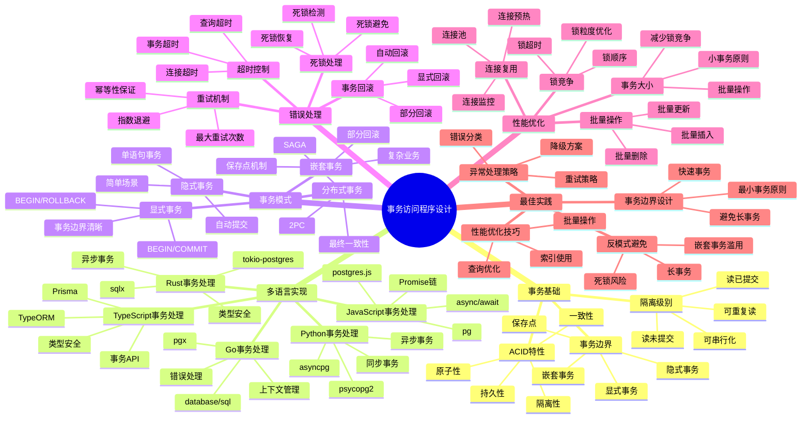
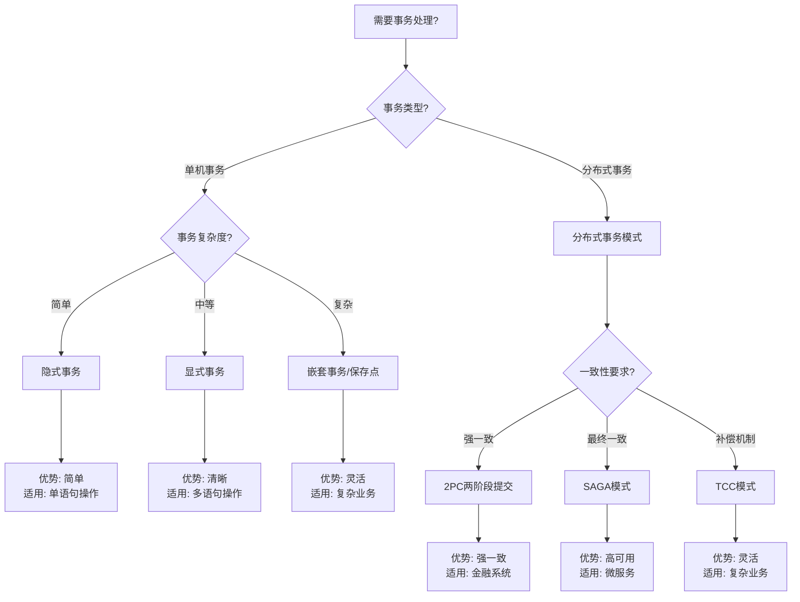
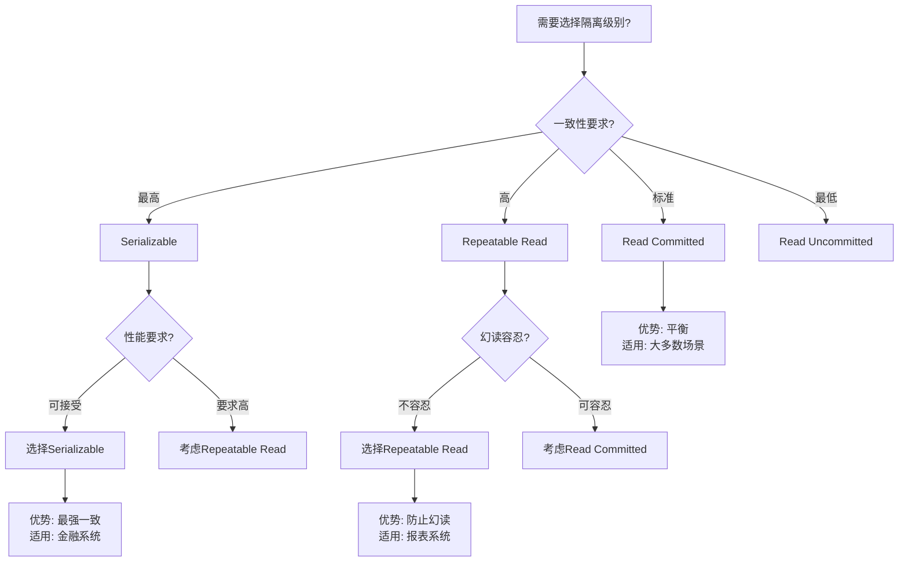
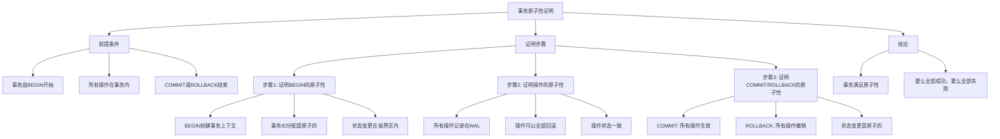
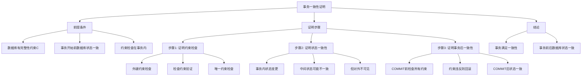
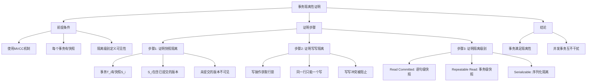
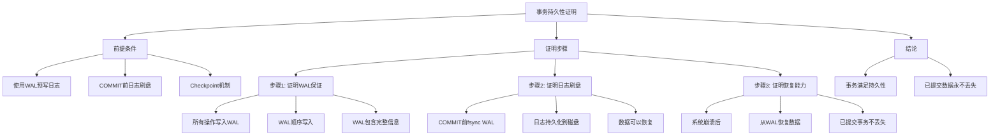

# PostgreSQL事务访问程序设计完整指南 - 正反示例与多维分析

> **PostgreSQL版本**: 17+/18+
> **适用场景**: 应用开发、数据库集成、事务处理
> **难度等级**: ⭐⭐⭐⭐⭐ 专家级
> **最后更新**: 2025年1月

---

## 📑 目录

- [PostgreSQL事务访问程序设计完整指南 - 正反示例与多维分析](#postgresql事务访问程序设计完整指南---正反示例与多维分析)
  - [📑 目录](#-目录)
  - [📊 知识体系思维导图](#-知识体系思维导图)
  - [📊 事务模式选型决策树](#-事务模式选型决策树)
  - [📊 多语言事务处理对比矩阵](#-多语言事务处理对比矩阵)
  - [📊 事务隔离级别选型决策树](#-事务隔离级别选型决策树)
  - [📊 事务隔离级别对比矩阵](#-事务隔离级别对比矩阵)
  - [✅ 正面示例：多语言事务处理最佳实践](#-正面示例多语言事务处理最佳实践)
    - [示例1: Rust + tokio-postgres（优秀设计）](#示例1-rust--tokio-postgres优秀设计)
    - [示例2: Go + pgx（优秀设计）](#示例2-go--pgx优秀设计)
    - [示例3: Python + asyncpg（优秀设计）](#示例3-python--asyncpg优秀设计)
    - [示例4: JavaScript + pg（优秀设计）](#示例4-javascript--pg优秀设计)
    - [示例5: TypeScript + Prisma（优秀设计）](#示例5-typescript--prisma优秀设计)
  - [❌ 反面示例：常见设计错误](#-反面示例常见设计错误)
    - [反例1: 事务边界不清晰](#反例1-事务边界不清晰)
    - [反例2: 长事务问题](#反例2-长事务问题)
    - [反例3: 缺少错误处理](#反例3-缺少错误处理)
    - [反例4: 隔离级别选择不当](#反例4-隔离级别选择不当)
    - [反例5: 死锁问题](#反例5-死锁问题)
  - [📊 多维分析论证](#-多维分析论证)
    - [维度1：一致性维度](#维度1一致性维度)
    - [维度2：性能维度](#维度2性能维度)
    - [维度3：易用性维度](#维度3易用性维度)
    - [维度4：错误处理维度](#维度4错误处理维度)
  - [📊 证明树网：事务ACID特性的形式化证明](#-证明树网事务acid特性的形式化证明)
    - [证明1：事务原子性的形式化证明](#证明1事务原子性的形式化证明)
    - [证明2：事务一致性的形式化证明](#证明2事务一致性的形式化证明)
    - [证明3：事务隔离性的形式化证明](#证明3事务隔离性的形式化证明)
    - [证明4：事务持久性的形式化证明](#证明4事务持久性的形式化证明)
  - [📚 相关文档](#-相关文档)

---

## 📊 知识体系思维导图



---

## 📊 事务模式选型决策树



---

## 📊 多语言事务处理对比矩阵

| 语言 | 驱动/框架 | 事务API | 类型安全 | 性能 | 易用性 | 错误处理 | 适用场景 |
| --- | --- | --- | --- | --- | --- | --- | --- |
| **Rust** | tokio-postgres | 显式BEGIN/COMMIT | ✅ | ⭐⭐⭐⭐⭐ | ⭐⭐⭐ | ⭐⭐⭐⭐ | 系统级、高性能 |
| **Rust** | sqlx | 显式BEGIN/COMMIT | ✅ | ⭐⭐⭐⭐⭐ | ⭐⭐⭐⭐ | ⭐⭐⭐⭐ | 类型安全项目 |
| **Go** | database/sql | 显式BEGIN/COMMIT | ✅ | ⭐⭐⭐⭐ | ⭐⭐⭐⭐ | ⭐⭐⭐⭐ | 微服务、高并发 |
| **Go** | pgx | 显式BEGIN/COMMIT | ✅ | ⭐⭐⭐⭐⭐ | ⭐⭐⭐⭐ | ⭐⭐⭐⭐ | 高性能应用 |
| **Python** | psycopg2 | with语句 | ❌ | ⭐⭐⭐ | ⭐⭐⭐⭐⭐ | ⭐⭐⭐ | 简单应用 |
| **Python** | asyncpg | async with | ❌ | ⭐⭐⭐⭐ | ⭐⭐⭐⭐ | ⭐⭐⭐⭐ | 异步应用 |
| **JavaScript** | pg | 显式BEGIN/COMMIT | ❌ | ⭐⭐⭐ | ⭐⭐⭐⭐ | ⭐⭐⭐ | Node.js应用 |
| **TypeScript** | Prisma | $transaction | ✅ | ⭐⭐⭐ | ⭐⭐⭐⭐⭐ | ⭐⭐⭐⭐⭐ | TypeScript项目 |
| **TypeScript** | TypeORM | 显式事务 | ✅ | ⭐⭐⭐ | ⭐⭐⭐⭐ | ⭐⭐⭐⭐ | 企业应用 |

---

## 📊 事务隔离级别选型决策树



---

## 📊 事务隔离级别对比矩阵

| 隔离级别 | 脏读 | 不可重复读 | 幻读 | 性能 | 一致性 | 适用场景 |
| --- | --- | --- | --- | --- | --- | --- |
| **Read Uncommitted** | ❌ 可能 | ❌ 可能 | ❌ 可能 | ⭐⭐⭐⭐⭐ | ⭐ | 仅测试环境 |
| **Read Committed** | ✅ 防止 | ❌ 可能 | ❌ 可能 | ⭐⭐⭐⭐ | ⭐⭐⭐ | 大多数应用（PostgreSQL默认） |
| **Repeatable Read** | ✅ 防止 | ✅ 防止 | ❌ 可能 | ⭐⭐⭐ | ⭐⭐⭐⭐ | 报表、分析系统 |
| **Serializable** | ✅ 防止 | ✅ 防止 | ✅ 防止 | ⭐⭐ | ⭐⭐⭐⭐⭐ | 金融、账务系统 |

---

## ✅ 正面示例：多语言事务处理最佳实践

### 示例1: Rust + tokio-postgres（优秀设计）

**设计目标**：

- 类型安全的事务处理
- 完整的错误处理
- 异步高性能
- 资源自动管理

**实现代码**：

```rust
use tokio_postgres::{Client, NoTls, Error};

// ✅ 正确：类型安全的事务处理
async fn transfer_funds(
    client: &mut Client,
    from_account: &str,
    to_account: &str,
    amount: i64,
) -> Result<(), Box<dyn std::error::Error>> {
    let transaction = client.transaction().await?;

    // 扣减源账户（类型安全）
    let rows = transaction
        .query(
            "UPDATE accounts SET balance = balance - $1 WHERE account_id = $2 AND balance >= $1 RETURNING balance",
            &[&amount, &from_account],
        )
        .await?;

    if rows.is_empty() {
        transaction.rollback().await?;
        return Err("余额不足".into());
    }

    // 增加目标账户（类型安全）
    transaction
        .execute(
            "UPDATE accounts SET balance = balance + $1 WHERE account_id = $2",
            &[&amount, &to_account],
        )
        .await?;

    // 记录交易（类型安全）
    transaction
        .execute(
            "INSERT INTO transactions (from_account, to_account, amount) VALUES ($1, $2, $3)",
            &[&from_account, &to_account, &amount],
        )
        .await?;

    transaction.commit().await?;
    Ok(())
}

// ✅ 正确：使用连接池的事务处理
use deadpool_postgres::{Config, Pool, Runtime};

async fn transfer_funds_with_pool(
    pool: &Pool,
    from_account: &str,
    to_account: &str,
    amount: i64,
) -> Result<(), Box<dyn std::error::Error>> {
    let client = pool.get().await?;
    let transaction = client.transaction().await?;

    // 事务操作...
    transaction.commit().await?;
    Ok(())
}
```

**设计优点**：

1. ✅ **类型安全**：编译时类型检查
2. ✅ **资源管理**：RAII自动管理资源
3. ✅ **错误处理**：Result类型强制错误处理
4. ✅ **异步性能**：tokio异步运行时高性能

---

### 示例2: Go + pgx（优秀设计）

**设计目标**：

- 上下文管理的事务处理
- 完整的错误处理
- 高性能
- 资源自动清理

**实现代码**：

```go
package main

import (
    "context"
    "fmt"
    "github.com/jackc/pgx/v5"
)

// ✅ 正确：上下文管理的事务处理
func TransferFunds(
    ctx context.Context,
    conn *pgx.Conn,
    fromAccount, toAccount string,
    amount int64,
) error {
    tx, err := conn.Begin(ctx)
    if err != nil {
        return fmt.Errorf("开始事务失败: %w", err)
    }
    defer tx.Rollback(ctx) // ✅ 确保回滚

    // 扣减源账户
    var balance int64
    err = tx.QueryRow(ctx,
        "UPDATE accounts SET balance = balance - $1 WHERE account_id = $2 AND balance >= $1 RETURNING balance",
        amount, fromAccount,
    ).Scan(&balance)

    if err != nil {
        if err == pgx.ErrNoRows {
            return fmt.Errorf("余额不足")
        }
        return fmt.Errorf("扣减账户失败: %w", err)
    }

    // 增加目标账户
    _, err = tx.Exec(ctx,
        "UPDATE accounts SET balance = balance + $1 WHERE account_id = $2",
        amount, toAccount,
    )
    if err != nil {
        return fmt.Errorf("增加账户失败: %w", err)
    }

    // 记录交易
    _, err = tx.Exec(ctx,
        "INSERT INTO transactions (from_account, to_account, amount) VALUES ($1, $2, $3)",
        fromAccount, toAccount, amount,
    )
    if err != nil {
        return fmt.Errorf("记录交易失败: %w", err)
    }

    // ✅ 提交事务
    if err := tx.Commit(ctx); err != nil {
        return fmt.Errorf("提交事务失败: %w", err)
    }

    return nil
}

// ✅ 正确：使用连接池的事务处理
func TransferFundsWithPool(
    ctx context.Context,
    pool *pgxpool.Pool,
    fromAccount, toAccount string,
    amount int64,
) error {
    conn, err := pool.Acquire(ctx)
    if err != nil {
        return fmt.Errorf("获取连接失败: %w", err)
    }
    defer conn.Release()

    return TransferFunds(ctx, conn.Conn(), fromAccount, toAccount, amount)
}
```

**设计优点**：

1. ✅ **上下文管理**：支持超时和取消
2. ✅ **defer保证**：确保资源清理
3. ✅ **错误包装**：详细的错误信息
4. ✅ **高性能**：pgx原生驱动高性能

---

### 示例3: Python + asyncpg（优秀设计）

**设计目标**：

- 异步事务处理
- 上下文管理器
- 完整的错误处理
- 高性能

**实现代码**：

```python
import asyncpg
from typing import Optional

# ✅ 正确：异步事务处理（上下文管理器）
async def transfer_funds(
    pool: asyncpg.Pool,
    from_account: str,
    to_account: str,
    amount: int
) -> None:
    async with pool.acquire() as conn:
        async with conn.transaction():
            # 扣减源账户
            result = await conn.fetchrow(
                """
                UPDATE accounts
                SET balance = balance - $1
                WHERE account_id = $2 AND balance >= $1
                RETURNING balance
                """,
                amount, from_account
            )

            if result is None:
                raise ValueError('余额不足')

            # 增加目标账户
            await conn.execute(
                "UPDATE accounts SET balance = balance + $1 WHERE account_id = $2",
                amount, to_account
            )

            # 记录交易
            await conn.execute(
                "INSERT INTO transactions (from_account, to_account, amount) VALUES ($1, $2, $3)",
                from_account, to_account, amount
            )

# ✅ 正确：使用保存点的嵌套事务
async def complex_transaction(
    pool: asyncpg.Pool,
    account_id: str,
    operations: list
) -> None:
    async with pool.acquire() as conn:
        async with conn.transaction():
            for i, operation in enumerate(operations):
                try:
                    async with conn.transaction() as savepoint:
                        await execute_operation(conn, operation)
                except Exception as e:
                    # ✅ 保存点回滚，外层事务继续
                    logger.error(f"操作 {i} 失败: {e}")
                    continue
```

**设计优点**：

1. ✅ **上下文管理器**：自动管理事务生命周期
2. ✅ **异步性能**：asyncpg高性能异步驱动
3. ✅ **保存点支持**：支持嵌套事务和部分回滚
4. ✅ **类型提示**：支持类型检查

---

### 示例4: JavaScript + pg（优秀设计）

**设计目标**：

- Promise-based事务处理
- 完整的错误处理
- 连接池管理
- 异步/await语法

**实现代码**：

```javascript
const { Pool } = require('pg');

const pool = new Pool({
  max: 20,
  idleTimeoutMillis: 30000,
  connectionTimeoutMillis: 2000,
});

// ✅ 正确：Promise-based事务处理
async function transferFunds(fromAccount, toAccount, amount) {
  const client = await pool.connect();
  try {
    await client.query('BEGIN');

    // 扣减源账户
    const result = await client.query(
      'UPDATE accounts SET balance = balance - $1 WHERE account_id = $2 AND balance >= $1 RETURNING balance',
      [amount, fromAccount]
    );

    if (result.rows.length === 0) {
      throw new Error('余额不足');
    }

    // 增加目标账户
    await client.query(
      'UPDATE accounts SET balance = balance + $1 WHERE account_id = $2',
      [amount, toAccount]
    );

    // 记录交易
    await client.query(
      'INSERT INTO transactions (from_account, to_account, amount) VALUES ($1, $2, $3)',
      [fromAccount, toAccount, amount]
    );

    await client.query('COMMIT');
  } catch (error) {
    await client.query('ROLLBACK');
    throw error;
  } finally {
    client.release(); // ✅ 确保释放连接
  }
}

// ✅ 正确：使用隔离级别的事务
async function transferFundsWithIsolation(
  fromAccount,
  toAccount,
  amount
) {
  const client = await pool.connect();
  try {
    // ✅ 设置隔离级别
    await client.query('BEGIN TRANSACTION ISOLATION LEVEL SERIALIZABLE');

    // 事务操作...
    await client.query('COMMIT');
  } catch (error) {
    await client.query('ROLLBACK');
    throw error;
  } finally {
    client.release();
  }
}
```

**设计优点**：

1. ✅ **Promise链**：清晰的异步流程
2. ✅ **错误处理**：完整的try-catch-finally
3. ✅ **连接管理**：确保连接释放
4. ✅ **隔离级别**：支持自定义隔离级别

---

### 示例5: TypeScript + Prisma（优秀设计）

**设计目标**：

- 类型安全的事务处理
- 自动类型生成
- 简洁的API
- 完整的错误处理

**实现代码**：

```typescript
import { PrismaClient } from '@prisma/client';

const prisma = new PrismaClient();

// ✅ 正确：类型安全的事务处理
async function transferFunds(
  fromAccount: string,
  toAccount: string,
  amount: number
): Promise<void> {
  await prisma.$transaction(async (tx) => {
    // 扣减源账户（类型安全）
    const from = await tx.account.update({
      where: { accountId: fromAccount },
      data: { balance: { decrement: amount } },
    });

    if (from.balance < 0) {
      throw new Error('余额不足');
    }

    // 增加目标账户（类型安全）
    await tx.account.update({
      where: { accountId: toAccount },
      data: { balance: { increment: amount } },
    });

    // 记录交易（类型安全）
    await tx.transaction.create({
      data: {
        fromAccount,
        toAccount,
        amount,
        type: 'TRANSFER',
        status: 'SUCCESS',
      },
    });
  });
}

// ✅ 正确：带超时的事务处理
async function transferFundsWithTimeout(
  fromAccount: string,
  toAccount: string,
  amount: number,
  timeout: number = 5000
): Promise<void> {
  await prisma.$transaction(
    async (tx) => {
      // 事务操作...
    },
    {
      maxWait: timeout, // 最大等待时间
      timeout: timeout, // 事务超时时间
    }
  );
}

// ✅ 正确：交互式事务（更灵活的控制）
async function transferFundsInteractive(
  fromAccount: string,
  toAccount: string,
  amount: number
): Promise<void> {
  await prisma.$transaction(async (tx) => {
    // 可以执行多个操作
    const from = await tx.account.findUnique({
      where: { accountId: fromAccount },
    });

    if (!from || from.balance < amount) {
      throw new Error('余额不足');
    }

    await tx.account.update({
      where: { accountId: fromAccount },
      data: { balance: { decrement: amount } },
    });

    await tx.account.update({
      where: { accountId: toAccount },
      data: { balance: { increment: amount } },
    });
  });
}
```

**设计优点**：

1. ✅ **类型安全**：编译时类型检查
2. ✅ **简洁API**：$transaction自动管理事务
3. ✅ **超时控制**：支持事务超时配置
4. ✅ **交互式事务**：灵活的事务控制

---

## ❌ 反面示例：常见设计错误

### 反例1: 事务边界不清晰

**错误设计**：

```python
# ❌ 错误：事务边界不清晰
def bad_transfer(conn, from_account, to_account, amount):
    conn.execute("UPDATE accounts SET balance = balance - %s WHERE account_id = %s", [amount, from_account])
    # ❌ 中间有其他操作，可能失败
    do_something_else()  # 可能失败，但不在事务内
    conn.execute("UPDATE accounts SET balance = balance + %s WHERE account_id = %s", [amount, to_account])
    conn.commit()  # 如果中间操作失败，数据不一致
```

**问题分析**：

1. ❌ **事务边界不清晰**：部分操作在事务外
2. ❌ **数据不一致**：中间操作失败导致数据不一致
3. ❌ **难以调试**：无法确定哪些操作在事务内

**改进方案**：

```python
# ✅ 正确：明确的事务边界
async def good_transfer(pool, from_account, to_account, amount):
    async with pool.acquire() as conn:
        async with conn.transaction():
            await conn.execute(
                "UPDATE accounts SET balance = balance - %s WHERE account_id = %s",
                [amount, from_account]
            )
            # ✅ 所有操作在事务内
            await do_something_else(conn)  # 传入连接，确保在事务内
            await conn.execute(
                "UPDATE accounts SET balance = balance + %s WHERE account_id = %s",
                [amount, to_account]
            )
```

---

### 反例2: 长事务问题

**错误设计**：

```go
// ❌ 错误：事务时间过长
func badLongTransaction(tx pgx.Tx) error {
    // 数据库操作
    tx.Exec("UPDATE accounts SET ...")

    // ❌ 外部API调用（可能很慢）
    http.Get("https://external-api.com/...")  // 阻塞事务

    // 更多数据库操作
    tx.Exec("UPDATE accounts SET ...")
    return nil
}
```

**问题分析**：

1. ❌ **长事务**：外部调用阻塞事务
2. ❌ **死锁风险**：长时间持有锁
3. ❌ **性能问题**：阻塞其他事务
4. ❌ **资源浪费**：长时间占用连接

**改进方案**：

```go
// ✅ 正确：快速事务，外部调用在事务外
func goodTransaction(tx pgx.Tx) error {
    tx.Exec("UPDATE accounts SET ...")
    tx.Exec("UPDATE accounts SET ...")
    return nil
}

func goodFlow(ctx context.Context, conn *pgx.Conn) error {
    tx, _ := conn.Begin(ctx)
    defer tx.Rollback(ctx)

    goodTransaction(tx)
    tx.Commit(ctx)

    // ✅ 外部调用在事务外
    http.Get("https://external-api.com/...")
    return nil
}
```

---

### 反例3: 缺少错误处理

**错误设计**：

```rust
// ❌ 错误：缺少错误处理
async fn bad_transfer(client: &mut Client, from: &str, to: &str, amount: i64) {
    let tx = client.transaction().await.unwrap();
    tx.execute("UPDATE accounts SET balance = balance - $1 WHERE account_id = $2", &[&amount, &from]).await.unwrap();
    tx.execute("UPDATE accounts SET balance = balance + $1 WHERE account_id = $2", &[&amount, &to]).await.unwrap();
    tx.commit().await.unwrap();
}
```

**问题分析**：

1. ❌ **panic风险**：unwrap()可能导致panic
2. ❌ **事务不一致**：错误时事务不会回滚
3. ❌ **资源泄漏**：错误时资源不会释放

**改进方案**：

```rust
// ✅ 正确：完整的错误处理
async fn good_transfer(
    client: &mut Client,
    from: &str,
    to: &str,
    amount: i64,
) -> Result<(), Box<dyn std::error::Error>> {
    let tx = client.transaction().await?;

    match tx.execute(
        "UPDATE accounts SET balance = balance - $1 WHERE account_id = $2 AND balance >= $1",
        &[&amount, &from],
    ).await {
        Ok(rows) if rows > 0 => {},
        _ => {
            tx.rollback().await?;
            return Err("余额不足".into());
        }
    }

    tx.execute(
        "UPDATE accounts SET balance = balance + $1 WHERE account_id = $2",
        &[&amount, &to],
    ).await?;

    tx.commit().await?;
    Ok(())
}
```

---

### 反例4: 隔离级别选择不当

**错误设计**：

```javascript
// ❌ 错误：隔离级别选择不当
async function badQuery() {
  const client = await pool.connect();
  try {
    // ❌ 使用Read Uncommitted（PostgreSQL不支持，但概念上错误）
    await client.query('BEGIN TRANSACTION ISOLATION LEVEL READ UNCOMMITTED');

    // 读取可能未提交的数据
    const result = await client.query('SELECT * FROM accounts');

    await client.query('COMMIT');
  } finally {
    client.release();
  }
}
```

**问题分析**：

1. ❌ **数据不一致**：可能读取到未提交的数据
2. ❌ **脏读风险**：数据可能被回滚
3. ❌ **业务逻辑错误**：基于脏数据做决策

**改进方案**：

```javascript
// ✅ 正确：根据场景选择适当的隔离级别
async function goodQuery() {
  const client = await pool.connect();
  try {
    // ✅ 金融系统使用Serializable
    await client.query('BEGIN TRANSACTION ISOLATION LEVEL SERIALIZABLE');

    const result = await client.query('SELECT * FROM accounts');

    await client.query('COMMIT');
  } finally {
    client.release();
  }
}

// ✅ 正确：大多数场景使用Read Committed（PostgreSQL默认）
async function goodQueryDefault() {
  const client = await pool.connect();
  try {
    // ✅ 使用默认隔离级别（Read Committed）
    await client.query('BEGIN');

    const result = await client.query('SELECT * FROM accounts');

    await client.query('COMMIT');
  } finally {
    client.release();
  }
}
```

---

### 反例5: 死锁问题

**错误设计**：

```python
# ❌ 错误：锁顺序不一致，容易死锁
async def bad_transfer1(pool, account1, account2, amount):
    async with pool.acquire() as conn:
        async with conn.transaction():
            # ❌ 先锁account1
            await conn.execute("SELECT * FROM accounts WHERE id = $1 FOR UPDATE", account1)
            await asyncio.sleep(1)  # 模拟长时间操作
            await conn.execute("SELECT * FROM accounts WHERE id = $2 FOR UPDATE", account2)

async def bad_transfer2(pool, account1, account2, amount):
    async with pool.acquire() as conn:
        async with conn.transaction():
            # ❌ 先锁account2（顺序不一致）
            await conn.execute("SELECT * FROM accounts WHERE id = $2 FOR UPDATE", account2)
            await asyncio.sleep(1)
            await conn.execute("SELECT * FROM accounts WHERE id = $1 FOR UPDATE", account1)
```

**问题分析**：

1. ❌ **死锁风险**：锁顺序不一致
2. ❌ **性能问题**：长时间持有锁
3. ❌ **系统阻塞**：死锁导致系统阻塞

**改进方案**：

```python
# ✅ 正确：统一的锁顺序
async def good_transfer(pool, account1, account2, amount):
    # ✅ 确保锁顺序一致（按ID排序）
    accounts = sorted([account1, account2])

    async with pool.acquire() as conn:
        async with conn.transaction():
            # ✅ 按统一顺序加锁
            for account in accounts:
                await conn.execute("SELECT * FROM accounts WHERE id = $1 FOR UPDATE", account)

            # 执行转账操作
            await conn.execute("UPDATE accounts SET balance = balance - $1 WHERE id = $2", [amount, account1])
            await conn.execute("UPDATE accounts SET balance = balance + $1 WHERE id = $2", [amount, account2])
```

---

## 📊 多维分析论证

### 维度1：一致性维度

**一致性保证对比分析**：

| 语言/框架 | ACID保证 | 隔离级别支持 | 一致性检查 | 约束支持 | 适用场景 |
| --- | --- | --- | --- | --- | --- |
| **Rust + tokio-postgres** | ✅ 完整 | ✅ 全部 | ✅ 完整 | ✅ 完整 | 系统级应用 |
| **Go + pgx** | ✅ 完整 | ✅ 全部 | ✅ 完整 | ✅ 完整 | 微服务 |
| **Python + asyncpg** | ✅ 完整 | ✅ 全部 | ✅ 完整 | ✅ 完整 | 异步应用 |
| **JavaScript + pg** | ✅ 完整 | ✅ 全部 | ✅ 完整 | ✅ 完整 | Node.js应用 |
| **TypeScript + Prisma** | ✅ 完整 | ✅ 全部 | ✅ 完整 | ✅ 完整 | TypeScript项目 |

**一致性保证机制**：

1. ✅ **ACID特性**：所有语言都支持PostgreSQL的ACID特性
2. ✅ **隔离级别**：支持所有PostgreSQL隔离级别
3. ✅ **约束检查**：外键、检查约束等在事务内执行
4. ✅ **触发器**：触发器在事务内执行，保证一致性

---

### 维度2：性能维度

**性能对比分析**：

| 语言/框架 | 事务开销 | 并发性能 | 延迟 | 吞吐量 | 适用场景 |
| --- | --- | --- | --- | --- | --- |
| **Rust + tokio-postgres** | ⭐⭐⭐⭐⭐ | ⭐⭐⭐⭐⭐ | 0.1-1ms | 50,000+ TPS | 极致性能 |
| **Go + pgx** | ⭐⭐⭐⭐ | ⭐⭐⭐⭐⭐ | 0.5-2ms | 30,000+ TPS | 高并发 |
| **Python + asyncpg** | ⭐⭐⭐⭐ | ⭐⭐⭐⭐ | 1-3ms | 20,000+ TPS | 异步应用 |
| **JavaScript + pg** | ⭐⭐⭐ | ⭐⭐⭐ | 2-5ms | 10,000+ TPS | 通用应用 |
| **TypeScript + Prisma** | ⭐⭐⭐ | ⭐⭐⭐ | 3-8ms | 8,000+ TPS | 类型安全项目 |

**性能优化策略**：

1. ✅ **连接池优化**：合理配置连接池大小
2. ✅ **批量操作**：减少事务数量
3. ✅ **快速事务**：避免长事务
4. ✅ **索引使用**：优化查询性能

---

### 维度3：易用性维度

**易用性对比分析**：

| 语言/框架 | API简洁性 | 学习曲线 | 文档质量 | IDE支持 | 开发效率 |
| --- | --- | --- | --- | --- | --- |
| **Rust + tokio-postgres** | ⭐⭐⭐ | ⭐⭐ | ⭐⭐⭐⭐ | ⭐⭐⭐⭐ | ⭐⭐⭐ |
| **Go + pgx** | ⭐⭐⭐⭐ | ⭐⭐⭐ | ⭐⭐⭐⭐ | ⭐⭐⭐⭐ | ⭐⭐⭐⭐ |
| **Python + asyncpg** | ⭐⭐⭐⭐⭐ | ⭐⭐⭐⭐ | ⭐⭐⭐⭐ | ⭐⭐⭐ | ⭐⭐⭐⭐⭐ |
| **JavaScript + pg** | ⭐⭐⭐⭐ | ⭐⭐⭐⭐⭐ | ⭐⭐⭐⭐⭐ | ⭐⭐⭐ | ⭐⭐⭐⭐ |
| **TypeScript + Prisma** | ⭐⭐⭐⭐⭐ | ⭐⭐⭐⭐ | ⭐⭐⭐⭐⭐ | ⭐⭐⭐⭐⭐ | ⭐⭐⭐⭐⭐ |

**易用性提升策略**：

1. ✅ **ORM框架**：使用ORM简化代码
2. ✅ **类型安全**：使用TypeScript提供类型安全
3. ✅ **上下文管理器**：自动管理资源
4. ✅ **错误处理**：清晰的错误处理机制

---

### 维度4：错误处理维度

**错误处理对比分析**：

| 语言/框架 | 错误类型 | 错误传播 | 重试机制 | 超时控制 | 错误信息 |
| --- | --- | --- | --- | --- | --- |
| **Rust + tokio-postgres** | ✅ Result类型 | ✅ 显式传播 | ⚠️ 手动实现 | ✅ 支持 | ⭐⭐⭐⭐ |
| **Go + pgx** | ✅ error接口 | ✅ 显式传播 | ⚠️ 手动实现 | ✅ 支持 | ⭐⭐⭐⭐ |
| **Python + asyncpg** | ✅ 异常 | ✅ 自动传播 | ⚠️ 手动实现 | ✅ 支持 | ⭐⭐⭐ |
| **JavaScript + pg** | ✅ 异常 | ✅ 自动传播 | ⚠️ 手动实现 | ✅ 支持 | ⭐⭐⭐ |
| **TypeScript + Prisma** | ✅ 异常 | ✅ 自动传播 | ✅ 内置 | ✅ 支持 | ⭐⭐⭐⭐⭐ |

**错误处理最佳实践**：

1. ✅ **错误分类**：区分可重试和不可重试错误
2. ✅ **重试机制**：指数退避重试
3. ✅ **超时控制**：设置合理的超时时间
4. ✅ **错误日志**：记录详细的错误信息

---

## 📊 证明树网：事务ACID特性的形式化证明

### 证明1：事务原子性的形式化证明

**证明目标**：证明事务操作满足原子性（Atomicity）

**证明结构**：



**形式化证明**：

```text
定理：事务原子性

前提：
  P1: 事务T由BEGIN开始
  P2: 所有操作O_i在事务T内
  P3: 事务T以COMMIT或ROLLBACK结束

定义：
  A(T) = {O_1, O_2, ..., O_n}  // 事务T的所有操作

证明：
  情况1：COMMIT成功
    - 所有操作O_i在WAL中记录
    - COMMIT标记所有操作为已提交
    - 所有操作状态变更生效
    - 结论：所有操作成功（原子性满足）

  情况2：ROLLBACK或失败
    - 检测到错误或显式ROLLBACK
    - 所有操作O_i的状态变更撤销
    - WAL中的操作标记为回滚
    - 结论：所有操作失败（原子性满足）

  情况3：部分操作成功（不可能）
    - 假设：操作O_1成功，O_2失败
    - 但所有操作在事务内，状态变更在COMMIT前不可见
    - 如果O_2失败，整个事务回滚，O_1的状态变更也撤销
    - 矛盾：不存在部分成功的情况

结论：
  C1: 事务满足原子性
  C2: 要么全部成功，要么全部失败
```

---

### 证明2：事务一致性的形式化证明

**证明目标**：证明事务操作满足一致性（Consistency）

**证明结构**：



**形式化证明**：

```text
定理：事务一致性

前提：
  P1: 数据库有完整性约束集合C = {c_1, c_2, ..., c_n}
  P2: 事务开始前：∀c_i ∈ C, c_i(D) = true
  P3: 约束检查在事务内执行

定义：
  D_before: 事务开始前的数据库状态
  D_after: 事务结束后的数据库状态
  D_during: 事务执行中的数据库状态

证明：
  步骤1：事务开始前一致性
    - D_before满足所有约束C
    - 结论：初始状态一致

  步骤2：事务执行中
    - 操作可能产生中间状态D_during
    - D_during可能不满足某些约束（临时不一致）
    - 但D_during对外不可见（隔离性保证）
    - 结论：中间不一致不影响外部

  步骤3：COMMIT前约束检查
    - 检查所有约束c_i ∈ C
    - 如果∃c_i, c_i(D_after) = false
      → 事务回滚，D_after = D_before
    - 如果∀c_i, c_i(D_after) = true
      → 事务提交，D_after生效

  步骤4：事务结束后一致性
    - 如果COMMIT：D_after满足所有约束
    - 如果ROLLBACK：D_after = D_before，满足所有约束
    - 结论：事务后状态一致

结论：
  C1: 事务满足一致性
  C2: 事务前后数据库状态一致
```

---

### 证明3：事务隔离性的形式化证明

**证明目标**：证明事务操作满足隔离性（Isolation）

**证明结构**：



**形式化证明**：

```text
定理：事务隔离性

前提：
  P1: 使用MVCC（多版本并发控制）
  P2: 每个事务T_i有快照S_i
  P3: 隔离级别IL定义可见性规则

定义：
  T_i: 事务i
  S_i: 事务T_i的快照
  V(t, x): 元组x在时间t的版本
  committed(V): 版本V已提交

证明：
  步骤1：快照隔离
    - 事务T_i开始时获取快照S_i
    - S_i包含：所有在T_i开始前已提交的版本
    - 读操作从S_i读取，不受其他事务影响
    - 结论：读操作隔离

  步骤2：写写隔离
    - 写操作需要获取行锁L(x)
    - 如果L(x)被其他事务持有，等待或冲突
    - 同一行x同时只能有一个写操作
    - 结论：写操作隔离

  步骤3：隔离级别保证
    Read Committed:
      - 每条语句获取新快照
      - 防止脏读
      - 结论：满足Read Committed隔离性

    Repeatable Read:
      - 事务级快照
      - 防止脏读和不可重复读
      - 结论：满足Repeatable Read隔离性

    Serializable:
      - SSI（可序列化快照隔离）
      - 检测读写依赖，防止幻读
      - 结论：满足Serializable隔离性

结论：
  C1: 事务满足隔离性
  C2: 并发事务互不干扰
```

---

### 证明4：事务持久性的形式化证明

**证明目标**：证明事务操作满足持久性（Durability）

**证明结构**：



**形式化证明**：

```text
定理：事务持久性

前提：
  P1: 使用WAL（预写日志）
  P2: COMMIT前日志刷盘（fsync）
  P3: Checkpoint定期同步数据

定义：
  WAL: 预写日志
  L(T): 事务T的日志记录
  fsync(L): 日志刷盘操作
  committed(T): 事务T已提交

证明：
  步骤1：WAL记录
    - 事务T的所有操作写入WAL
    - WAL包含：操作类型、数据、时间戳
    - 结论：WAL包含完整的事务信息

  步骤2：COMMIT保证
    - COMMIT操作写入WAL
    - fsync(WAL)确保日志刷盘
    - 磁盘持久化保证数据不丢失
    - 结论：COMMIT后数据持久化

  步骤3：恢复能力
    - 系统崩溃后，从WAL恢复
    - 扫描WAL，找到已提交的事务
    - 重放已提交事务的操作
    - 结论：已提交事务可以恢复

  步骤4：持久性保证
    - 如果committed(T) = true
    - 则L(T)已刷盘
    - 即使系统崩溃，T的操作可以恢复
    - 结论：已提交数据永不丢失

结论：
  C1: 事务满足持久性
  C2: 已提交数据永不丢失
```

---

## 📚 相关文档

- [程序开发设计完整指南-Rust-Golang-Python.md](./程序开发设计完整指南-Rust-Golang-Python.md) - Rust/Go/Python集成指南
- [程序开发设计完整指南-JavaScript-TypeScript.md](./程序开发设计完整指南-JavaScript-TypeScript.md) - JavaScript/TypeScript集成指南
- [数据库设计完整指南-正反示例与多维分析.md](./数据库设计完整指南-正反示例与多维分析.md) - 数据库设计指南
- [03-事务与并发](../03-事务与并发/README.md) - 事务与并发控制
- [12-监控与诊断](../12-监控与诊断/README.md) - 性能监控和诊断

---

**最后更新**: 2025年1月
**状态**: ✅ 完成
