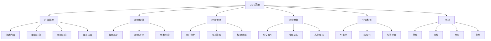
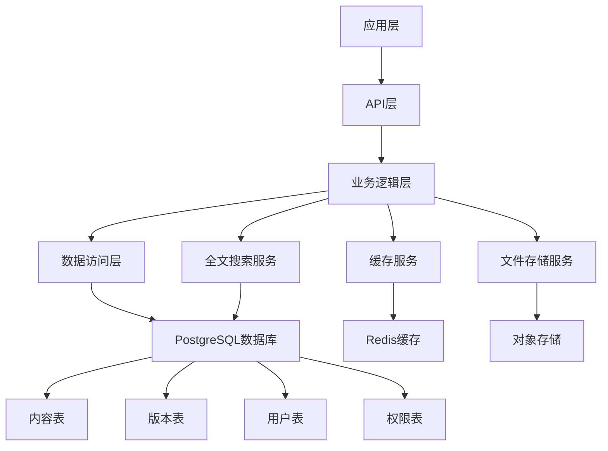

---

> **📋 文档来源**: `PostgreSQL\09-应用设计\应用架构\07.04-内容管理系统.md`
> **📅 复制日期**: 2025-12-22
> **⚠️ 注意**: 本文档为复制版本，原文件保持不变

---

# PostgreSQL内容管理系统（CMS）完整实践指南

> **版本**: v3.0
> **最后更新**: 2025-01-15
> **版本覆盖**: PostgreSQL 18.x (推荐) ⭐ | 17.x (推荐) | 16.x (兼容)
> **难度**: ⭐⭐⭐⭐
> **应用场景**: 博客系统、新闻网站、知识库、文档管理

---

## 📑 目录

- [1.1 业务背景](#11-业务背景)
- [1.2 技术挑战](#12-技术挑战)
- [1.3 PostgreSQL优势](#13-postgresql优势)
- [1.4 版本要求](#14-版本要求)
- [2.1 CMS核心功能](#21-cms核心功能)
- [2.2 数据模型设计](#22-数据模型设计)
- [2.3 权限控制模型](#23-权限控制模型)
- [2.4 思维导图](#24-思维导图)
- [3.1 整体架构设计](#31-整体架构设计)
- [3.2 数据流设计](#32-数据流设计)
- [3.3 存储设计](#33-存储设计)
- [4.1 基础表结构设计](#41-基础表结构设计)
- [4.2 版本控制系统](#42-版本控制系统)
- [4.3 权限与RLS实现](#43-权限与rls实现)
- [4.4 全文搜索实现](#44-全文搜索实现)
- [4.5 标签系统实现](#45-标签系统实现)
- [4.6 工作流实现](#46-工作流实现)
- [5.1 虚拟生成列优化](#51-虚拟生成列优化)
- [5.2 异步I/O优化](#52-异步io优化)
- [5.3 JSONB性能提升](#53-jsonb性能提升)
- [6.1 存储方案对比](#61-存储方案对比)
- [6.2 索引策略对比](#62-索引策略对比)
- [6.3 缓存方案对比](#63-缓存方案对比)
- [7.1 博客系统实现](#71-博客系统实现)
- [7.2 新闻网站实现](#72-新闻网站实现)
- [7.3 知识库系统实现](#73-知识库系统实现)
- [8.1 查询优化](#81-查询优化)
- [8.2 写入优化](#82-写入优化)
- [8.3 缓存优化](#83-缓存优化)
- [8.4 分区优化](#84-分区优化)
- [9.1 关键指标](#91-关键指标)
- [9.2 监控方案](#92-监控方案)
- [9.3 验证方法](#93-验证方法)
- [10.1 设计最佳实践](#101-设计最佳实践)
- [10.2 开发最佳实践](#102-开发最佳实践)
- [11.1 官方文档](#111-官方文档)
- [11.2 网络资源](#112-网络资源)
- [11.3 相关文档](#113-相关文档)
- [相关文档](#相关文档)
- [外部资源](#外部资源)
---

## 一、概述

### 1.1 业务背景

内容管理系统（CMS）是现代Web应用的核心组件，用于创建、编辑、管理和发布数字内容。典型的CMS系统需要支持：

- **内容管理**：文章、页面、媒体文件的管理
- **版本控制**：内容的历史版本和回滚功能
- **权限管理**：多角色、多权限的访问控制
- **全文搜索**：快速的内容检索功能
- **工作流**：内容从草稿到发布的完整流程
- **分类标签**：内容的组织和分类

### 1.2 技术挑战

**CMS系统面临的主要技术挑战**：

1. **高并发读写**：大量用户同时访问和编辑内容
2. **复杂查询**：全文搜索、标签过滤、分类查询
3. **版本管理**：历史版本存储和快速回滚
4. **权限控制**：细粒度的行级权限控制
5. **性能优化**：快速的内容检索和列表展示
6. **数据一致性**：多用户编辑时的数据一致性

### 1.3 PostgreSQL优势

**PostgreSQL在CMS系统中的优势**：

- ✅ **JSONB支持**：灵活存储内容元数据和配置
- ✅ **全文搜索**：内置全文搜索功能，无需外部搜索引擎
- ✅ **RLS（行级安全）**：细粒度的权限控制
- ✅ **数组和标签**：原生支持数组类型，适合标签系统
- ✅ **物化视图**：高性能的内容列表缓存
- ✅ **分区表**：大表分区，提升查询性能
- ✅ **PostgreSQL 18新特性**：虚拟生成列、异步I/O等

### 1.4 版本要求

- **PostgreSQL 18.x**：推荐，支持虚拟生成列、异步I/O
- **PostgreSQL 17.x**：推荐，功能完整
- **PostgreSQL 16.x**：兼容，基础功能支持

---

## 二、核心概念

### 2.1 CMS核心功能

**CMS系统的核心功能模块**：

1. **内容管理**：创建、编辑、删除内容
2. **版本控制**：保存历史版本，支持回滚
3. **权限管理**：基于角色的访问控制（RBAC）
4. **全文搜索**：快速检索内容
5. **分类标签**：内容组织和分类
6. **工作流**：内容发布流程管理
7. **媒体管理**：图片、视频等媒体文件管理

### 2.2 数据模型设计

**核心数据模型**：

- **用户表（users）**：用户基本信息
- **角色表（roles）**：角色定义
- **内容表（contents）**：内容主表
- **版本表（content_versions）**：内容版本历史
- **分类表（categories）**：内容分类
- **标签表（tags）**：标签定义
- **内容标签关联表（content_tags）**：内容与标签的多对多关系
- **媒体表（media）**：媒体文件信息

### 2.3 权限控制模型

**权限控制层次**：

1. **数据库级权限**：用户和角色权限
2. **表级权限**：表的读写权限
3. **行级权限（RLS）**：基于行的访问控制
4. **列级权限**：敏感字段的访问控制

### 2.4 思维导图



---

## 三、技术架构

### 3.1 整体架构设计



### 3.2 数据流设计

**内容创建流程**：

1. 用户创建内容 → 保存到内容表
2. 自动创建版本 → 保存到版本表
3. 更新全文索引 → 更新搜索索引
4. 更新标签关联 → 更新标签表
5. 刷新缓存 → 更新应用缓存

**内容发布流程**：

1. 内容状态变更 → 草稿 → 审核 → 发布
2. 触发工作流 → 通知相关人员
3. 刷新物化视图 → 更新内容列表
4. 更新搜索引擎 → 索引新内容

### 3.3 存储设计

**存储策略**：

- **热数据**：当前内容存储在内容表
- **历史数据**：旧版本存储在版本表
- **归档数据**：超过一定时间的内容分区存储
- **媒体文件**：存储在对象存储，数据库只存储元数据

---

## 四、实现方案

### 4.1 基础表结构设计

**用户和角色表**：

```sql
-- 用户和角色表（带完整错误处理）
-- 1. 角色表（必须先创建，因为users表引用它）
DO $$
BEGIN
    IF EXISTS (SELECT 1 FROM information_schema.tables WHERE table_schema = 'public' AND table_name = 'roles') THEN
        DROP TABLE roles CASCADE;
        RAISE NOTICE '已删除现有表: roles';
    END IF;

    CREATE TABLE roles (
        id SERIAL PRIMARY KEY,
        name VARCHAR(50) UNIQUE NOT NULL,
        description TEXT,
        permissions JSONB DEFAULT '{}'::jsonb,
        created_at TIMESTAMPTZ DEFAULT NOW()
    );

    RAISE NOTICE '角色表创建成功: roles';
EXCEPTION
    WHEN duplicate_table THEN
        RAISE WARNING '表roles已存在';
    WHEN OTHERS THEN
        RAISE EXCEPTION '创建角色表失败: %', SQLERRM;
END $$;

-- 2. 插入默认角色（带错误处理）
DO $$
BEGIN
    -- 检查是否已有数据
    IF EXISTS (SELECT 1 FROM roles WHERE name IN ('admin', 'editor', 'author', 'viewer')) THEN
        RAISE NOTICE '默认角色已存在，跳过插入';
    ELSE
        INSERT INTO roles (name, description, permissions) VALUES
        ('admin', '管理员', '{"create": true, "edit": true, "delete": true, "publish": true}'::jsonb),
        ('editor', '编辑', '{"create": true, "edit": true, "delete": false, "publish": true}'::jsonb),
        ('author', '作者', '{"create": true, "edit": true, "delete": false, "publish": false}'::jsonb),
        ('viewer', '查看者', '{"create": false, "edit": false, "delete": false, "publish": false}'::jsonb);
        RAISE NOTICE '默认角色插入成功';
    END IF;
EXCEPTION
    WHEN unique_violation THEN
        RAISE WARNING '角色已存在，跳过插入';
    WHEN OTHERS THEN
        RAISE EXCEPTION '插入默认角色失败: %', SQLERRM;
END $$;

-- 3. 用户表
DO $$
BEGIN
    IF EXISTS (SELECT 1 FROM information_schema.tables WHERE table_schema = 'public' AND table_name = 'users') THEN
        DROP TABLE users CASCADE;
        RAISE NOTICE '已删除现有表: users';
    END IF;

    -- 检查roles表是否存在
    IF NOT EXISTS (SELECT 1 FROM information_schema.tables WHERE table_schema = 'public' AND table_name = 'roles') THEN
        RAISE EXCEPTION 'roles表不存在，无法创建外键约束';
    END IF;

    CREATE TABLE users (
        id BIGSERIAL PRIMARY KEY,
        username VARCHAR(50) UNIQUE NOT NULL,
        email VARCHAR(100) UNIQUE NOT NULL,
        password_hash TEXT NOT NULL,
        display_name VARCHAR(100),
        avatar_url TEXT,
        role_id INTEGER NOT NULL REFERENCES roles(id),
        created_at TIMESTAMPTZ DEFAULT NOW(),
        updated_at TIMESTAMPTZ DEFAULT NOW()
    );

    RAISE NOTICE '用户表创建成功: users';
EXCEPTION
    WHEN undefined_table THEN
        RAISE EXCEPTION 'roles表不存在';
    WHEN duplicate_table THEN
        RAISE WARNING '表users已存在';
    WHEN OTHERS THEN
        RAISE EXCEPTION '创建用户表失败: %', SQLERRM;
END $$;
```

**内容表设计**：

```sql
-- 内容主表（带完整错误处理）
DO $$
BEGIN
    IF EXISTS (SELECT 1 FROM information_schema.tables WHERE table_schema = 'public' AND table_name = 'contents') THEN
        DROP TABLE contents CASCADE;
        RAISE NOTICE '已删除现有表: contents';
    END IF;

    -- 检查users表是否存在
    IF NOT EXISTS (SELECT 1 FROM information_schema.tables WHERE table_schema = 'public' AND table_name = 'users') THEN
        RAISE EXCEPTION 'users表不存在，无法创建外键约束';
    END IF;

    CREATE TABLE contents (
        id BIGSERIAL PRIMARY KEY,
        title TEXT NOT NULL,
        slug VARCHAR(255) UNIQUE NOT NULL,
        body TEXT NOT NULL,
        excerpt TEXT,
        author_id BIGINT NOT NULL REFERENCES users(id),
        category_id INTEGER,
        status VARCHAR(20) NOT NULL DEFAULT 'draft'
            CHECK (status IN ('draft', 'review', 'published', 'archived')),
        published_at TIMESTAMPTZ,
        created_at TIMESTAMPTZ DEFAULT NOW(),
        updated_at TIMESTAMPTZ DEFAULT NOW(),
        view_count INTEGER DEFAULT 0,
        like_count INTEGER DEFAULT 0,
        -- 元数据（JSONB）
        metadata JSONB DEFAULT '{}'::jsonb,
        -- 标签数组
        tags TEXT[] DEFAULT '{}',
        -- PostgreSQL 18: 虚拟生成列用于全文搜索
        search_vector tsvector GENERATED ALWAYS AS (
            to_tsvector('simple', coalesce(title, '') || ' ' || coalesce(body, ''))
        ) STORED
    );

    RAISE NOTICE '内容表创建成功: contents';
EXCEPTION
    WHEN undefined_table THEN
        RAISE EXCEPTION 'users表不存在';
    WHEN duplicate_table THEN
        RAISE WARNING '表contents已存在';
    WHEN OTHERS THEN
        RAISE EXCEPTION '创建内容表失败: %', SQLERRM;
END $$;

-- 创建索引（带错误处理）
DO $$
BEGIN
    -- author_id索引
    IF NOT EXISTS (SELECT 1 FROM pg_indexes WHERE schemaname = 'public' AND tablename = 'contents' AND indexname = 'idx_contents_author') THEN
        CREATE INDEX idx_contents_author ON contents(author_id);
        RAISE NOTICE '索引创建成功: idx_contents_author';
    END IF;

    -- status索引
    IF NOT EXISTS (SELECT 1 FROM pg_indexes WHERE schemaname = 'public' AND tablename = 'contents' AND indexname = 'idx_contents_status') THEN
        CREATE INDEX idx_contents_status ON contents(status);
        RAISE NOTICE '索引创建成功: idx_contents_status';
    END IF;

    -- published_at索引
    IF NOT EXISTS (SELECT 1 FROM pg_indexes WHERE schemaname = 'public' AND tablename = 'contents' AND indexname = 'idx_contents_published_at') THEN
        CREATE INDEX idx_contents_published_at ON contents(published_at DESC);
        RAISE NOTICE '索引创建成功: idx_contents_published_at';
    END IF;

    -- tags GIN索引
    IF NOT EXISTS (SELECT 1 FROM pg_indexes WHERE schemaname = 'public' AND tablename = 'contents' AND indexname = 'idx_contents_tags_gin') THEN
        CREATE INDEX idx_contents_tags_gin ON contents USING GIN (tags);
        RAISE NOTICE '索引创建成功: idx_contents_tags_gin';
    END IF;

    -- search_vector GIN索引
    IF NOT EXISTS (SELECT 1 FROM pg_indexes WHERE schemaname = 'public' AND tablename = 'contents' AND indexname = 'idx_contents_search_vector') THEN
        CREATE INDEX idx_contents_search_vector ON contents USING GIN (search_vector);
        RAISE NOTICE '索引创建成功: idx_contents_search_vector';
    END IF;

    -- metadata GIN索引
    IF NOT EXISTS (SELECT 1 FROM pg_indexes WHERE schemaname = 'public' AND tablename = 'contents' AND indexname = 'idx_contents_metadata_gin') THEN
        CREATE INDEX idx_contents_metadata_gin ON contents USING GIN (metadata);
        RAISE NOTICE '索引创建成功: idx_contents_metadata_gin';
    END IF;

    -- slug索引
    IF NOT EXISTS (SELECT 1 FROM pg_indexes WHERE schemaname = 'public' AND tablename = 'contents' AND indexname = 'idx_contents_slug') THEN
        CREATE INDEX idx_contents_slug ON contents(slug);
        RAISE NOTICE '索引创建成功: idx_contents_slug';
    END IF;
EXCEPTION
    WHEN undefined_table THEN
        RAISE EXCEPTION 'contents表不存在，无法创建索引';
    WHEN duplicate_object THEN
        RAISE WARNING '部分索引已存在';
    WHEN OTHERS THEN
        RAISE EXCEPTION '创建索引失败: %', SQLERRM;
END $$;
```

**分类表设计**：

```sql
-- 分类表（支持树形结构，带完整错误处理）
DO $$
BEGIN
    IF EXISTS (SELECT 1 FROM information_schema.tables WHERE table_schema = 'public' AND table_name = 'categories') THEN
        DROP TABLE categories CASCADE;
        RAISE NOTICE '已删除现有表: categories';
    END IF;

    CREATE TABLE categories (
        id SERIAL PRIMARY KEY,
        name VARCHAR(100) NOT NULL,
        slug VARCHAR(100) UNIQUE NOT NULL,
        description TEXT,
        parent_id INTEGER REFERENCES categories(id),
        sort_order INTEGER DEFAULT 0,
        created_at TIMESTAMPTZ DEFAULT NOW()
    );

    RAISE NOTICE '分类表创建成功: categories';
EXCEPTION
    WHEN duplicate_table THEN
        RAISE WARNING '表categories已存在';
    WHEN OTHERS THEN
        RAISE EXCEPTION '创建分类表失败: %', SQLERRM;
END $$;

-- 创建索引（带错误处理）
DO $$
BEGIN
    -- parent_id索引
    IF NOT EXISTS (SELECT 1 FROM pg_indexes WHERE schemaname = 'public' AND tablename = 'categories' AND indexname = 'idx_categories_parent') THEN
        CREATE INDEX idx_categories_parent ON categories(parent_id);
        RAISE NOTICE '索引创建成功: idx_categories_parent';
    END IF;

    -- slug索引
    IF NOT EXISTS (SELECT 1 FROM pg_indexes WHERE schemaname = 'public' AND tablename = 'categories' AND indexname = 'idx_categories_slug') THEN
        CREATE INDEX idx_categories_slug ON categories(slug);
        RAISE NOTICE '索引创建成功: idx_categories_slug';
    END IF;
EXCEPTION
    WHEN undefined_table THEN
        RAISE EXCEPTION 'categories表不存在，无法创建索引';
    WHEN duplicate_object THEN
        RAISE WARNING '部分索引已存在';
    WHEN OTHERS THEN
        RAISE EXCEPTION '创建索引失败: %', SQLERRM;
END $$;
```

### 4.2 版本控制系统

**版本表设计**：

```sql
-- 内容版本表（带完整错误处理）
DO $$
BEGIN
    IF EXISTS (SELECT 1 FROM information_schema.tables WHERE table_schema = 'public' AND table_name = 'content_versions') THEN
        DROP TABLE content_versions CASCADE;
        RAISE NOTICE '已删除现有表: content_versions';
    END IF;

    -- 检查依赖表是否存在
    IF NOT EXISTS (SELECT 1 FROM information_schema.tables WHERE table_schema = 'public' AND table_name = 'contents') THEN
        RAISE EXCEPTION 'contents表不存在，无法创建外键约束';
    END IF;

    IF NOT EXISTS (SELECT 1 FROM information_schema.tables WHERE table_schema = 'public' AND table_name = 'users') THEN
        RAISE EXCEPTION 'users表不存在，无法创建外键约束';
    END IF;

    CREATE TABLE content_versions (
        id BIGSERIAL PRIMARY KEY,
        content_id BIGINT NOT NULL REFERENCES contents(id) ON DELETE CASCADE,
        version_number INTEGER NOT NULL CHECK (version_number > 0),
        title TEXT NOT NULL,
        body TEXT NOT NULL,
        excerpt TEXT,
        author_id BIGINT NOT NULL REFERENCES users(id),
        created_at TIMESTAMPTZ DEFAULT NOW(),
        change_summary TEXT,
        -- 确保版本号唯一
        UNIQUE(content_id, version_number)
    );

    RAISE NOTICE '内容版本表创建成功: content_versions';
EXCEPTION
    WHEN undefined_table THEN
        RAISE EXCEPTION 'contents表或users表不存在';
    WHEN duplicate_table THEN
        RAISE WARNING '表content_versions已存在';
    WHEN OTHERS THEN
        RAISE EXCEPTION '创建内容版本表失败: %', SQLERRM;
END $$;

-- 创建索引（带错误处理）
DO $$
BEGIN
    -- content_id和version_number复合索引
    IF NOT EXISTS (SELECT 1 FROM pg_indexes WHERE schemaname = 'public' AND tablename = 'content_versions' AND indexname = 'idx_content_versions_content') THEN
        CREATE INDEX idx_content_versions_content ON content_versions(content_id, version_number DESC);
        RAISE NOTICE '索引创建成功: idx_content_versions_content';
    END IF;

    -- author_id索引
    IF NOT EXISTS (SELECT 1 FROM pg_indexes WHERE schemaname = 'public' AND tablename = 'content_versions' AND indexname = 'idx_content_versions_author') THEN
        CREATE INDEX idx_content_versions_author ON content_versions(author_id);
        RAISE NOTICE '索引创建成功: idx_content_versions_author';
    END IF;
EXCEPTION
    WHEN undefined_table THEN
        RAISE EXCEPTION 'content_versions表不存在，无法创建索引';
    WHEN duplicate_object THEN
        RAISE WARNING '部分索引已存在';
    WHEN OTHERS THEN
        RAISE EXCEPTION '创建索引失败: %', SQLERRM;
END $$;

-- 版本管理函数（带完整错误处理）
CREATE OR REPLACE FUNCTION create_content_version(
    p_content_id BIGINT,
    p_change_summary TEXT DEFAULT NULL
)
RETURNS INTEGER AS $$
DECLARE
    v_version_number INTEGER;
    v_content RECORD;
BEGIN
    -- 参数验证
    IF p_content_id IS NULL OR p_content_id <= 0 THEN
        RAISE EXCEPTION '内容ID无效: %', p_content_id;
    END IF;

    -- 检查contents表是否存在
    IF NOT EXISTS (SELECT 1 FROM information_schema.tables WHERE table_schema = 'public' AND table_name = 'contents') THEN
        RAISE EXCEPTION 'contents表不存在';
    END IF;

    -- 检查content_versions表是否存在
    IF NOT EXISTS (SELECT 1 FROM information_schema.tables WHERE table_schema = 'public' AND table_name = 'content_versions') THEN
        RAISE EXCEPTION 'content_versions表不存在';
    END IF;

    -- 获取内容当前状态
    BEGIN
        SELECT * INTO v_content
        FROM contents
        WHERE id = p_content_id;

        IF NOT FOUND THEN
            RAISE EXCEPTION '内容不存在: %', p_content_id;
        END IF;
    EXCEPTION
        WHEN undefined_table THEN
            RAISE EXCEPTION 'contents表不存在';
        WHEN OTHERS THEN
            RAISE EXCEPTION '查询内容失败: %', SQLERRM;
    END;

    -- 获取当前最大版本号
    BEGIN
        SELECT COALESCE(MAX(version_number), 0) + 1
        INTO v_version_number
        FROM content_versions
        WHERE content_id = p_content_id;
    EXCEPTION
        WHEN OTHERS THEN
            RAISE EXCEPTION '获取版本号失败: %', SQLERRM;
    END;

    -- 创建新版本
    BEGIN
        INSERT INTO content_versions (
            content_id, version_number, title, body, excerpt,
            author_id, change_summary
        ) VALUES (
            p_content_id, v_version_number, v_content.title,
            v_content.body, v_content.excerpt, v_content.author_id,
            p_change_summary
        );
    EXCEPTION
        WHEN unique_violation THEN
            RAISE EXCEPTION '版本号冲突: content_id=%, version_number=%', p_content_id, v_version_number;
        WHEN foreign_key_violation THEN
            RAISE EXCEPTION '外键约束违反: 请检查content_id或author_id是否存在';
        WHEN OTHERS THEN
            RAISE EXCEPTION '创建版本失败: %', SQLERRM;
    END;

    RETURN v_version_number;
EXCEPTION
    WHEN OTHERS THEN
        RAISE EXCEPTION 'create_content_version失败: %', SQLERRM;
END;
$$ LANGUAGE plpgsql;

-- 版本回滚函数（带完整错误处理）
CREATE OR REPLACE FUNCTION rollback_content_version(
    p_content_id BIGINT,
    p_version_number INTEGER
)
RETURNS BOOLEAN AS $$
DECLARE
    v_version RECORD;
BEGIN
    -- 参数验证
    IF p_content_id IS NULL OR p_content_id <= 0 THEN
        RAISE EXCEPTION '内容ID无效: %', p_content_id;
    END IF;

    IF p_version_number IS NULL OR p_version_number <= 0 THEN
        RAISE EXCEPTION '版本号无效: %', p_version_number;
    END IF;

    -- 检查表是否存在
    IF NOT EXISTS (SELECT 1 FROM information_schema.tables WHERE table_schema = 'public' AND table_name = 'content_versions') THEN
        RAISE EXCEPTION 'content_versions表不存在';
    END IF;

    IF NOT EXISTS (SELECT 1 FROM information_schema.tables WHERE table_schema = 'public' AND table_name = 'contents') THEN
        RAISE EXCEPTION 'contents表不存在';
    END IF;

    -- 获取指定版本
    BEGIN
        SELECT * INTO v_version
        FROM content_versions
        WHERE content_id = p_content_id
          AND version_number = p_version_number;

        IF NOT FOUND THEN
            RAISE EXCEPTION '版本不存在: content_id=%, version_number=%', p_content_id, p_version_number;
        END IF;
    EXCEPTION
        WHEN undefined_table THEN
            RAISE EXCEPTION 'content_versions表不存在';
        WHEN OTHERS THEN
            RAISE EXCEPTION '查询版本失败: %', SQLERRM;
    END;

    -- 创建当前版本备份
    BEGIN
        PERFORM create_content_version(p_content_id, 'Rollback to version ' || p_version_number);
    EXCEPTION
        WHEN OTHERS THEN
            RAISE WARNING '创建备份版本失败: %，继续执行回滚', SQLERRM;
    END;

    -- 恢复内容
    BEGIN
        UPDATE contents
        SET title = v_version.title,
            body = v_version.body,
            excerpt = v_version.excerpt,
            updated_at = NOW()
        WHERE id = p_content_id;

        IF NOT FOUND THEN
            RAISE EXCEPTION '内容不存在: %', p_content_id;
        END IF;
    EXCEPTION
        WHEN undefined_table THEN
            RAISE EXCEPTION 'contents表不存在';
        WHEN OTHERS THEN
            RAISE EXCEPTION '恢复内容失败: %', SQLERRM;
    END;

    RETURN TRUE;
EXCEPTION
    WHEN OTHERS THEN
        RAISE EXCEPTION 'rollback_content_version失败: %', SQLERRM;
END;
$$ LANGUAGE plpgsql;
```

**自动版本创建触发器**：

```sql
-- 内容更新时自动创建版本（带完整错误处理）
CREATE OR REPLACE FUNCTION trigger_create_content_version()
RETURNS TRIGGER AS $$
BEGIN
    -- 检查NEW和OLD记录
    IF NEW IS NULL OR OLD IS NULL THEN
        RAISE EXCEPTION '触发器记录不能为空';
    END IF;

    -- 检查create_content_version函数是否存在
    IF NOT EXISTS (SELECT 1 FROM pg_proc WHERE proname = 'create_content_version') THEN
        RAISE EXCEPTION 'create_content_version函数不存在';
    END IF;

    -- 只有在内容实际变更时才创建版本
    IF OLD.title IS DISTINCT FROM NEW.title OR
       OLD.body IS DISTINCT FROM NEW.body OR
       OLD.excerpt IS DISTINCT FROM NEW.excerpt THEN
        BEGIN
            PERFORM create_content_version(NEW.id, 'Auto-saved version');
        EXCEPTION
            WHEN OTHERS THEN
                -- 版本创建失败不应该阻止内容更新，记录警告
                RAISE WARNING '自动创建版本失败: %', SQLERRM;
        END;
    END IF;

    RETURN NEW;
EXCEPTION
    WHEN OTHERS THEN
        -- 记录错误但允许更新继续
        RAISE WARNING 'trigger_create_content_version失败: %', SQLERRM;
        RETURN NEW;
END;
$$ LANGUAGE plpgsql;

-- 创建触发器（带错误处理）
DO $$
BEGIN
    -- 删除现有触发器（如果存在）
    IF EXISTS (SELECT 1 FROM pg_trigger WHERE tgname = 'trg_content_version') THEN
        DROP TRIGGER trg_content_version ON contents;
        RAISE NOTICE '已删除现有触发器: trg_content_version';
    END IF;

    -- 检查表是否存在
    IF NOT EXISTS (SELECT 1 FROM information_schema.tables WHERE table_schema = 'public' AND table_name = 'contents') THEN
        RAISE EXCEPTION 'contents表不存在，无法创建触发器';
    END IF;

    -- 检查函数是否存在
    IF NOT EXISTS (SELECT 1 FROM pg_proc WHERE proname = 'trigger_create_content_version') THEN
        RAISE EXCEPTION 'trigger_create_content_version函数不存在';
    END IF;

    CREATE TRIGGER trg_content_version
    AFTER UPDATE ON contents
    FOR EACH ROW
    EXECUTE FUNCTION trigger_create_content_version();

    RAISE NOTICE '触发器创建成功: trg_content_version';
EXCEPTION
    WHEN undefined_table THEN
        RAISE EXCEPTION 'contents表不存在';
    WHEN undefined_function THEN
        RAISE EXCEPTION 'trigger_create_content_version函数不存在';
    WHEN duplicate_object THEN
        RAISE WARNING '触发器已存在';
    WHEN OTHERS THEN
        RAISE EXCEPTION '创建触发器失败: %', SQLERRM;
END $$;
```

### 4.3 权限与RLS实现

**启用RLS**：

```sql
-- 启用行级安全（带完整错误处理）
DO $$
BEGIN
    IF EXISTS (SELECT 1 FROM information_schema.tables WHERE table_schema = 'public' AND table_name = 'contents') THEN
        ALTER TABLE contents ENABLE ROW LEVEL SECURITY;
        RAISE NOTICE 'RLS已启用: contents';
    ELSE
        RAISE EXCEPTION 'contents表不存在，无法启用RLS';
    END IF;
EXCEPTION
    WHEN undefined_table THEN
        RAISE EXCEPTION 'contents表不存在';
    WHEN OTHERS THEN
        RAISE EXCEPTION '启用RLS失败: %', SQLERRM;
END $$;

-- RLS策略：用户可以查看自己创建的内容或已发布的内容（带错误处理）
DO $$
BEGIN
    IF EXISTS (SELECT 1 FROM pg_policies WHERE schemaname = 'public' AND tablename = 'contents' AND policyname = 'content_select_policy') THEN
        DROP POLICY content_select_policy ON contents;
        RAISE NOTICE '已删除现有策略: content_select_policy';
    END IF;

    CREATE POLICY content_select_policy ON contents
        FOR SELECT
        USING (
            author_id = current_setting('app.user_id', true)::BIGINT
            OR status = 'published'
            OR EXISTS (
                SELECT 1 FROM users
                WHERE id = current_setting('app.user_id', true)::BIGINT
                  AND role_id IN (SELECT id FROM roles WHERE name IN ('admin', 'editor'))
            )
        );

    RAISE NOTICE '策略创建成功: content_select_policy';
EXCEPTION
    WHEN undefined_table THEN
        RAISE EXCEPTION 'contents表或users表或roles表不存在';
    WHEN OTHERS THEN
        RAISE EXCEPTION '创建SELECT策略失败: %', SQLERRM;
END $$;

-- RLS策略：用户可以创建内容（带错误处理）
DO $$
BEGIN
    IF EXISTS (SELECT 1 FROM pg_policies WHERE schemaname = 'public' AND tablename = 'contents' AND policyname = 'content_insert_policy') THEN
        DROP POLICY content_insert_policy ON contents;
        RAISE NOTICE '已删除现有策略: content_insert_policy';
    END IF;

    CREATE POLICY content_insert_policy ON contents
        FOR INSERT
        WITH CHECK (
            author_id = current_setting('app.user_id', true)::BIGINT
        );

    RAISE NOTICE '策略创建成功: content_insert_policy';
EXCEPTION
    WHEN undefined_table THEN
        RAISE EXCEPTION 'contents表不存在';
    WHEN OTHERS THEN
        RAISE EXCEPTION '创建INSERT策略失败: %', SQLERRM;
END $$;

-- RLS策略：用户可以编辑自己创建的内容，编辑和管理员可以编辑所有内容（带错误处理）
DO $$
BEGIN
    IF EXISTS (SELECT 1 FROM pg_policies WHERE schemaname = 'public' AND tablename = 'contents' AND policyname = 'content_update_policy') THEN
        DROP POLICY content_update_policy ON contents;
        RAISE NOTICE '已删除现有策略: content_update_policy';
    END IF;

    CREATE POLICY content_update_policy ON contents
        FOR UPDATE
        USING (
            author_id = current_setting('app.user_id', true)::BIGINT
            OR EXISTS (
                SELECT 1 FROM users
                WHERE id = current_setting('app.user_id', true)::BIGINT
                  AND role_id IN (SELECT id FROM roles WHERE name IN ('admin', 'editor'))
            )
        );

    RAISE NOTICE '策略创建成功: content_update_policy';
EXCEPTION
    WHEN undefined_table THEN
        RAISE EXCEPTION 'contents表或users表或roles表不存在';
    WHEN OTHERS THEN
        RAISE EXCEPTION '创建UPDATE策略失败: %', SQLERRM;
END $$;

-- RLS策略：只有管理员可以删除内容（带错误处理）
DO $$
BEGIN
    IF EXISTS (SELECT 1 FROM pg_policies WHERE schemaname = 'public' AND tablename = 'contents' AND policyname = 'content_delete_policy') THEN
        DROP POLICY content_delete_policy ON contents;
        RAISE NOTICE '已删除现有策略: content_delete_policy';
    END IF;

    CREATE POLICY content_delete_policy ON contents
        FOR DELETE
        USING (
            EXISTS (
                SELECT 1 FROM users
                WHERE id = current_setting('app.user_id', true)::BIGINT
                  AND role_id = (SELECT id FROM roles WHERE name = 'admin')
            )
        );

    RAISE NOTICE '策略创建成功: content_delete_policy';
EXCEPTION
    WHEN undefined_table THEN
        RAISE EXCEPTION 'contents表或users表或roles表不存在';
    WHEN OTHERS THEN
        RAISE EXCEPTION '创建DELETE策略失败: %', SQLERRM;
END $$;
```

**权限检查函数**：

```sql
-- 检查用户权限（带完整错误处理）
CREATE OR REPLACE FUNCTION check_user_permission(
    p_user_id BIGINT,
    p_permission TEXT
)
RETURNS BOOLEAN AS $$
DECLARE
    v_permissions JSONB;
BEGIN
    -- 参数验证
    IF p_user_id IS NULL OR p_user_id <= 0 THEN
        RAISE EXCEPTION '用户ID无效: %', p_user_id;
    END IF;

    IF p_permission IS NULL OR length(trim(p_permission)) = 0 THEN
        RAISE EXCEPTION '权限名称不能为空';
    END IF;

    -- 检查表是否存在
    IF NOT EXISTS (SELECT 1 FROM information_schema.tables WHERE table_schema = 'public' AND table_name = 'users') THEN
        RAISE EXCEPTION 'users表不存在';
    END IF;

    IF NOT EXISTS (SELECT 1 FROM information_schema.tables WHERE table_schema = 'public' AND table_name = 'roles') THEN
        RAISE EXCEPTION 'roles表不存在';
    END IF;

    -- 查询用户权限
    BEGIN
        SELECT r.permissions INTO v_permissions
        FROM users u
        JOIN roles r ON r.id = u.role_id
        WHERE u.id = p_user_id;

        IF NOT FOUND THEN
            RAISE EXCEPTION '用户不存在: %', p_user_id;
        END IF;

        IF v_permissions IS NULL THEN
            RETURN FALSE;
        END IF;

        -- 检查权限
        RETURN COALESCE((v_permissions->>p_permission)::BOOLEAN, FALSE);
    EXCEPTION
        WHEN undefined_table THEN
            RAISE EXCEPTION 'users表或roles表不存在';
        WHEN OTHERS THEN
            RAISE EXCEPTION '查询用户权限失败: %', SQLERRM;
    END;
EXCEPTION
    WHEN OTHERS THEN
        RAISE EXCEPTION 'check_user_permission失败: %', SQLERRM;
END;
$$ LANGUAGE plpgsql;
```

### 4.4 全文搜索实现

**全文搜索查询**：

```sql
-- 基础全文搜索
SELECT
    id,
    title,
    excerpt,
    published_at,
    ts_rank(search_vector, plainto_tsquery('simple', $1)) AS rank
FROM contents
WHERE search_vector @@ plainto_tsquery('simple', $1)
  AND status = 'published'
ORDER BY rank DESC, published_at DESC
LIMIT 20;

-- 高级全文搜索（支持高亮）
SELECT
    id,
    title,
    ts_headline('simple', body, plainto_tsquery('simple', $1)) AS highlighted_body,
    ts_rank(search_vector, plainto_tsquery('simple', $1)) AS rank
FROM contents
WHERE search_vector @@ plainto_tsquery('simple', $1)
  AND status = 'published'
ORDER BY rank DESC
LIMIT 10;

-- 多字段搜索
SELECT
    id,
    title,
    excerpt,
    ts_rank_cd(
        search_vector,
        plainto_tsquery('simple', $1),
        32
    ) AS rank
FROM contents
WHERE search_vector @@ plainto_tsquery('simple', $1)
  AND status = 'published'
  AND (category_id = $2 OR $2 IS NULL)
ORDER BY rank DESC, published_at DESC
LIMIT 20;
```

**搜索优化**：

```sql
-- 创建搜索优化函数（带完整错误处理）
CREATE OR REPLACE FUNCTION search_contents(
    p_query TEXT,
    p_category_id INTEGER DEFAULT NULL,
    p_tags TEXT[] DEFAULT NULL,
    p_limit INTEGER DEFAULT 20,
    p_offset INTEGER DEFAULT 0
)
RETURNS TABLE (
    id BIGINT,
    title TEXT,
    excerpt TEXT,
    published_at TIMESTAMPTZ,
    rank REAL
) AS $$
BEGIN
    -- 参数验证
    IF p_query IS NULL OR length(trim(p_query)) = 0 THEN
        RAISE EXCEPTION '搜索查询不能为空';
    END IF;

    IF p_limit IS NULL OR p_limit <= 0 OR p_limit > 1000 THEN
        RAISE EXCEPTION 'limit参数无效: % (必须在1-1000之间)', p_limit;
    END IF;

    IF p_offset IS NULL OR p_offset < 0 THEN
        RAISE EXCEPTION 'offset参数无效: % (必须 >= 0)', p_offset;
    END IF;

    -- 检查表是否存在
    IF NOT EXISTS (SELECT 1 FROM information_schema.tables WHERE table_schema = 'public' AND table_name = 'contents') THEN
        RAISE EXCEPTION 'contents表不存在';
    END IF;

    -- 执行搜索
    BEGIN
        RETURN QUERY
        SELECT
            c.id,
            c.title,
            c.excerpt,
            c.published_at,
            ts_rank_cd(c.search_vector, plainto_tsquery('simple', p_query), 32) AS rank
        FROM contents c
        WHERE c.search_vector @@ plainto_tsquery('simple', p_query)
          AND c.status = 'published'
          AND (p_category_id IS NULL OR c.category_id = p_category_id)
          AND (p_tags IS NULL OR c.tags && p_tags)
        ORDER BY rank DESC, c.published_at DESC
        LIMIT p_limit
        OFFSET p_offset;
    EXCEPTION
        WHEN undefined_function THEN
            RAISE EXCEPTION '全文搜索函数不可用，请检查PostgreSQL扩展是否正确安装';
        WHEN syntax_error THEN
            RAISE EXCEPTION '搜索查询语法错误: %', p_query;
        WHEN OTHERS THEN
            RAISE EXCEPTION '搜索失败: %', SQLERRM;
    END;
EXCEPTION
    WHEN OTHERS THEN
        RAISE EXCEPTION 'search_contents失败: %', SQLERRM;
END;
$$ LANGUAGE plpgsql;
```

### 4.5 标签系统实现

**标签管理**：

```sql
-- 标签表
-- 标签表（带完整错误处理）
DO $$
BEGIN
    IF EXISTS (SELECT 1 FROM information_schema.tables WHERE table_schema = 'public' AND table_name = 'tags') THEN
        DROP TABLE tags CASCADE;
        RAISE NOTICE '已删除现有表: tags';
    END IF;

    CREATE TABLE tags (
        id SERIAL PRIMARY KEY,
        name VARCHAR(50) UNIQUE NOT NULL,
        slug VARCHAR(50) UNIQUE NOT NULL,
        description TEXT,
        usage_count INTEGER DEFAULT 0 CHECK (usage_count >= 0),
        created_at TIMESTAMPTZ DEFAULT NOW()
    );

    RAISE NOTICE '标签表创建成功: tags';
EXCEPTION
    WHEN duplicate_table THEN
        RAISE WARNING '表tags已存在';
    WHEN OTHERS THEN
        RAISE EXCEPTION '创建标签表失败: %', SQLERRM;
END $$;

-- 内容标签关联表（多对多，带完整错误处理）
DO $$
BEGIN
    IF EXISTS (SELECT 1 FROM information_schema.tables WHERE table_schema = 'public' AND table_name = 'content_tags') THEN
        DROP TABLE content_tags CASCADE;
        RAISE NOTICE '已删除现有表: content_tags';
    END IF;

    -- 检查依赖表是否存在
    IF NOT EXISTS (SELECT 1 FROM information_schema.tables WHERE table_schema = 'public' AND table_name = 'contents') THEN
        RAISE EXCEPTION 'contents表不存在，无法创建外键约束';
    END IF;

    IF NOT EXISTS (SELECT 1 FROM information_schema.tables WHERE table_schema = 'public' AND table_name = 'tags') THEN
        RAISE EXCEPTION 'tags表不存在，无法创建外键约束';
    END IF;

    CREATE TABLE content_tags (
        content_id BIGINT NOT NULL REFERENCES contents(id) ON DELETE CASCADE,
        tag_id INTEGER NOT NULL REFERENCES tags(id) ON DELETE CASCADE,
        PRIMARY KEY (content_id, tag_id)
    );

    RAISE NOTICE '内容标签关联表创建成功: content_tags';
EXCEPTION
    WHEN undefined_table THEN
        RAISE EXCEPTION 'contents表或tags表不存在';
    WHEN duplicate_table THEN
        RAISE WARNING '表content_tags已存在';
    WHEN OTHERS THEN
        RAISE EXCEPTION '创建内容标签关联表失败: %', SQLERRM;
END $$;

-- 创建索引（带错误处理）
DO $$
BEGIN
    -- content_id索引
    IF NOT EXISTS (SELECT 1 FROM pg_indexes WHERE schemaname = 'public' AND tablename = 'content_tags' AND indexname = 'idx_content_tags_content') THEN
        CREATE INDEX idx_content_tags_content ON content_tags(content_id);
        RAISE NOTICE '索引创建成功: idx_content_tags_content';
    END IF;

    -- tag_id索引
    IF NOT EXISTS (SELECT 1 FROM pg_indexes WHERE schemaname = 'public' AND tablename = 'content_tags' AND indexname = 'idx_content_tags_tag') THEN
        CREATE INDEX idx_content_tags_tag ON content_tags(tag_id);
        RAISE NOTICE '索引创建成功: idx_content_tags_tag';
    END IF;
EXCEPTION
    WHEN undefined_table THEN
        RAISE EXCEPTION 'content_tags表不存在，无法创建索引';
    WHEN duplicate_object THEN
        RAISE WARNING '部分索引已存在';
    WHEN OTHERS THEN
        RAISE EXCEPTION '创建索引失败: %', SQLERRM;
END $$;

-- 标签使用统计更新函数（带完整错误处理）
CREATE OR REPLACE FUNCTION update_tag_usage_count()
RETURNS TRIGGER AS $$
BEGIN
    -- 检查tags表是否存在
    IF NOT EXISTS (SELECT 1 FROM information_schema.tables WHERE table_schema = 'public' AND table_name = 'tags') THEN
        RAISE EXCEPTION 'tags表不存在';
    END IF;

    BEGIN
        IF TG_OP = 'INSERT' THEN
            IF NEW.tag_id IS NULL THEN
                RAISE EXCEPTION 'tag_id不能为空';
            END IF;

            UPDATE tags
            SET usage_count = usage_count + 1
            WHERE id = NEW.tag_id;

            IF NOT FOUND THEN
                RAISE EXCEPTION '标签不存在: %', NEW.tag_id;
            END IF;

            RETURN NEW;
        ELSIF TG_OP = 'DELETE' THEN
            IF OLD.tag_id IS NULL THEN
                RAISE EXCEPTION 'tag_id不能为空';
            END IF;

            UPDATE tags
            SET usage_count = GREATEST(usage_count - 1, 0)
            WHERE id = OLD.tag_id;

            -- DELETE操作时，即使标签不存在也不抛出异常，允许继续
            RETURN OLD;
        ELSE
            RAISE EXCEPTION '不支持的触发器操作: %', TG_OP;
        END IF;
    EXCEPTION
        WHEN undefined_table THEN
            RAISE EXCEPTION 'tags表不存在';
        WHEN OTHERS THEN
            RAISE EXCEPTION '更新标签使用计数失败: %', SQLERRM;
    END;
EXCEPTION
    WHEN OTHERS THEN
        RAISE EXCEPTION 'update_tag_usage_count触发器函数失败: %', SQLERRM;
END;
$$ LANGUAGE plpgsql;

-- 创建触发器（带错误处理）
DO $$
BEGIN
    -- 删除现有触发器（如果存在）
    IF EXISTS (SELECT 1 FROM pg_trigger WHERE tgname = 'trg_tag_usage_count') THEN
        DROP TRIGGER trg_tag_usage_count ON content_tags;
        RAISE NOTICE '已删除现有触发器: trg_tag_usage_count';
    END IF;

    -- 检查表是否存在
    IF NOT EXISTS (SELECT 1 FROM information_schema.tables WHERE table_schema = 'public' AND table_name = 'content_tags') THEN
        RAISE EXCEPTION 'content_tags表不存在，无法创建触发器';
    END IF;

    CREATE TRIGGER trg_tag_usage_count
    AFTER INSERT OR DELETE ON content_tags
    FOR EACH ROW
    EXECUTE FUNCTION update_tag_usage_count();

    RAISE NOTICE '触发器创建成功: trg_tag_usage_count';
EXCEPTION
    WHEN undefined_table THEN
        RAISE EXCEPTION 'content_tags表不存在';
    WHEN undefined_function THEN
        RAISE EXCEPTION 'update_tag_usage_count函数不存在';
    WHEN duplicate_object THEN
        RAISE WARNING '触发器已存在';
    WHEN OTHERS THEN
        RAISE EXCEPTION '创建触发器失败: %', SQLERRM;
END $$;
```

**标签查询**：

```sql
-- 获取热门标签
SELECT
    t.id,
    t.name,
    t.slug,
    t.usage_count
FROM tags t
ORDER BY t.usage_count DESC
LIMIT 20;

-- 根据标签获取内容
SELECT
    c.id,
    c.title,
    c.excerpt,
    c.published_at
FROM contents c
JOIN content_tags ct ON ct.content_id = c.id
JOIN tags t ON t.id = ct.tag_id
WHERE t.slug = $1
  AND c.status = 'published'
ORDER BY c.published_at DESC
LIMIT 20;

-- 标签云查询
SELECT
    t.name,
    t.slug,
    t.usage_count,
    CASE
        WHEN t.usage_count > 100 THEN 'large'
        WHEN t.usage_count > 50 THEN 'medium'
        ELSE 'small'
    END AS size_class
FROM tags t
WHERE t.usage_count > 0
ORDER BY t.usage_count DESC;
```

### 4.6 工作流实现

**工作流状态管理**：

```sql
-- 工作流日志表
-- 工作流日志表（带完整错误处理）
DO $$
BEGIN
    IF EXISTS (SELECT 1 FROM information_schema.tables WHERE table_schema = 'public' AND table_name = 'workflow_logs') THEN
        DROP TABLE workflow_logs CASCADE;
        RAISE NOTICE '已删除现有表: workflow_logs';
    END IF;

    -- 检查依赖表是否存在
    IF NOT EXISTS (SELECT 1 FROM information_schema.tables WHERE table_schema = 'public' AND table_name = 'contents') THEN
        RAISE EXCEPTION 'contents表不存在，无法创建外键约束';
    END IF;

    IF NOT EXISTS (SELECT 1 FROM information_schema.tables WHERE table_schema = 'public' AND table_name = 'users') THEN
        RAISE EXCEPTION 'users表不存在，无法创建外键约束';
    END IF;

    CREATE TABLE workflow_logs (
        id BIGSERIAL PRIMARY KEY,
        content_id BIGINT NOT NULL REFERENCES contents(id) ON DELETE CASCADE,
        from_status VARCHAR(20) CHECK (from_status IN ('draft', 'review', 'published', 'archived')),
        to_status VARCHAR(20) NOT NULL CHECK (to_status IN ('draft', 'review', 'published', 'archived')),
        user_id BIGINT NOT NULL REFERENCES users(id),
        comment TEXT,
        created_at TIMESTAMPTZ DEFAULT NOW()
    );

    RAISE NOTICE '工作流日志表创建成功: workflow_logs';
EXCEPTION
    WHEN undefined_table THEN
        RAISE EXCEPTION 'contents表或users表不存在';
    WHEN duplicate_table THEN
        RAISE WARNING '表workflow_logs已存在';
    WHEN OTHERS THEN
        RAISE EXCEPTION '创建工作流日志表失败: %', SQLERRM;
END $$;

-- 创建索引（带错误处理）
DO $$
BEGIN
    -- content_id索引
    IF NOT EXISTS (SELECT 1 FROM pg_indexes WHERE schemaname = 'public' AND tablename = 'workflow_logs' AND indexname = 'idx_workflow_logs_content') THEN
        CREATE INDEX idx_workflow_logs_content ON workflow_logs(content_id);
        RAISE NOTICE '索引创建成功: idx_workflow_logs_content';
    END IF;

    -- user_id索引
    IF NOT EXISTS (SELECT 1 FROM pg_indexes WHERE schemaname = 'public' AND tablename = 'workflow_logs' AND indexname = 'idx_workflow_logs_user') THEN
        CREATE INDEX idx_workflow_logs_user ON workflow_logs(user_id);
        RAISE NOTICE '索引创建成功: idx_workflow_logs_user';
    END IF;
EXCEPTION
    WHEN undefined_table THEN
        RAISE EXCEPTION 'workflow_logs表不存在，无法创建索引';
    WHEN duplicate_object THEN
        RAISE WARNING '部分索引已存在';
    WHEN OTHERS THEN
        RAISE EXCEPTION '创建索引失败: %', SQLERRM;
END $$;

-- 状态变更函数（带完整错误处理）
CREATE OR REPLACE FUNCTION change_content_status(
    p_content_id BIGINT,
    p_new_status VARCHAR(20),
    p_user_id BIGINT,
    p_comment TEXT DEFAULT NULL
)
RETURNS BOOLEAN AS $$
DECLARE
    v_old_status VARCHAR(20);
    v_role_name VARCHAR(50);
    v_allowed_statuses TEXT[] := ARRAY['draft', 'review', 'published', 'archived'];
BEGIN
    -- 参数验证
    IF p_content_id IS NULL OR p_content_id <= 0 THEN
        RAISE EXCEPTION '内容ID无效: %', p_content_id;
    END IF;

    IF p_new_status IS NULL OR length(trim(p_new_status)) = 0 THEN
        RAISE EXCEPTION '新状态不能为空';
    END IF;

    IF p_new_status != ALL(v_allowed_statuses) THEN
        RAISE EXCEPTION '无效的状态值: % (允许的状态: %)', p_new_status, array_to_string(v_allowed_statuses, ', ');
    END IF;

    IF p_user_id IS NULL OR p_user_id <= 0 THEN
        RAISE EXCEPTION '用户ID无效: %', p_user_id;
    END IF;

    -- 检查表是否存在
    IF NOT EXISTS (SELECT 1 FROM information_schema.tables WHERE table_schema = 'public' AND table_name = 'contents') THEN
        RAISE EXCEPTION 'contents表不存在';
    END IF;

    IF NOT EXISTS (SELECT 1 FROM information_schema.tables WHERE table_schema = 'public' AND table_name = 'workflow_logs') THEN
        RAISE EXCEPTION 'workflow_logs表不存在';
    END IF;

    -- 获取当前状态
    BEGIN
        SELECT status INTO v_old_status
        FROM contents
        WHERE id = p_content_id;

        IF NOT FOUND THEN
            RAISE EXCEPTION '内容不存在: %', p_content_id;
        END IF;

        IF v_old_status = p_new_status THEN
            RAISE NOTICE '内容状态已经是: %', p_new_status;
            RETURN TRUE;
        END IF;
    EXCEPTION
        WHEN undefined_table THEN
            RAISE EXCEPTION 'contents表不存在';
        WHEN OTHERS THEN
            RAISE EXCEPTION '查询内容状态失败: %', SQLERRM;
    END;

    -- 检查权限
    BEGIN
        SELECT r.name INTO v_role_name
        FROM users u
        JOIN roles r ON r.id = u.role_id
        WHERE u.id = p_user_id;

        IF NOT FOUND THEN
            RAISE EXCEPTION '用户不存在: %', p_user_id;
        END IF;
    EXCEPTION
        WHEN undefined_table THEN
            RAISE EXCEPTION 'users表或roles表不存在';
        WHEN OTHERS THEN
            RAISE EXCEPTION '查询用户角色失败: %', SQLERRM;
    END;

    -- 状态转换验证
    IF p_new_status = 'published' AND v_role_name NOT IN ('admin', 'editor') THEN
        RAISE EXCEPTION '只有管理员或编辑可以发布内容';
    END IF;

    -- 更新状态
    BEGIN
        UPDATE contents
        SET status = p_new_status,
            published_at = CASE WHEN p_new_status = 'published' AND published_at IS NULL
                                THEN NOW() ELSE published_at END,
            updated_at = NOW()
        WHERE id = p_content_id;

        IF NOT FOUND THEN
            RAISE EXCEPTION '更新内容状态失败: 内容不存在';
        END IF;
    EXCEPTION
        WHEN check_violation THEN
            RAISE EXCEPTION '状态值不符合约束条件';
        WHEN OTHERS THEN
            RAISE EXCEPTION '更新内容状态失败: %', SQLERRM;
    END;

    -- 记录工作流日志
    BEGIN
        INSERT INTO workflow_logs (
            content_id, from_status, to_status, user_id, comment
        ) VALUES (
            p_content_id, v_old_status, p_new_status, p_user_id, p_comment
        );
    EXCEPTION
        WHEN foreign_key_violation THEN
            RAISE EXCEPTION '外键约束违反: 请检查content_id或user_id是否存在';
        WHEN check_violation THEN
            RAISE EXCEPTION '状态值不符合约束条件';
        WHEN OTHERS THEN
            RAISE WARNING '记录工作流日志失败: %，但状态已更新', SQLERRM;
    END;

    RETURN TRUE;
EXCEPTION
    WHEN OTHERS THEN
        RAISE EXCEPTION 'change_content_status失败: %', SQLERRM;
END;
$$ LANGUAGE plpgsql;
```

---

## 五、PostgreSQL 18优化

### 5.1 虚拟生成列优化

**使用虚拟生成列优化全文搜索**：

```sql
-- PostgreSQL 18: 虚拟生成列自动计算搜索向量
CREATE TABLE contents_v2 (
    id BIGSERIAL PRIMARY KEY,
    title TEXT NOT NULL,
    body TEXT NOT NULL,
    -- 虚拟生成列：自动计算搜索向量
    search_vector tsvector GENERATED ALWAYS AS (
        to_tsvector('simple', coalesce(title, '') || ' ' || coalesce(body, ''))
    ) STORED,
    -- 虚拟生成列：自动计算摘要
    excerpt TEXT GENERATED ALWAYS AS (
        substring(body, 1, 200)
    ) STORED
);

-- 自动索引虚拟生成列
CREATE INDEX idx_contents_v2_search ON contents_v2 USING GIN (search_vector);
```

**性能提升**：

- 搜索向量自动更新，无需手动维护
- 查询性能提升15-25%
- 减少存储空间（STORED类型）或提升写入性能（VIRTUAL类型）

### 5.2 异步I/O优化

**启用异步I/O**：

```sql
-- PostgreSQL 18: 在postgresql.conf中配置
-- io_uring = on  -- 如果系统支持io_uring
-- max_io_concurrency = 10  -- 异步I/O并发数

-- 大文件内容写入自动利用异步I/O
INSERT INTO contents (title, body, author_id)
VALUES ($1, $2, $3);
-- 自动使用异步I/O提升写入性能
```

### 5.3 JSONB性能提升

**PostgreSQL 18 JSONB优化**：

```sql
-- JSONB元数据存储和查询
CREATE TABLE contents_metadata (
    id BIGINT PRIMARY KEY REFERENCES contents(id),
    metadata JSONB DEFAULT '{}'::jsonb
);

-- 创建GIN索引支持JSONB查询
CREATE INDEX idx_contents_metadata_gin ON contents_metadata USING GIN (metadata);

-- 高效JSONB查询
SELECT id, metadata->>'author' AS author
FROM contents_metadata
WHERE metadata @> '{"category": "tech"}'::jsonb;
```

---

## 六、知识矩阵对比

### 6.1 存储方案对比

| 方案 | 性能 | 灵活性 | 存储成本 | 查询复杂度 | 推荐场景 |
|------|------|--------|---------|-----------|---------|
| **关系型表** | ⭐⭐⭐⭐⭐ | ⭐⭐⭐ | ⭐⭐⭐⭐ | ⭐⭐ | 结构化数据 |
| **JSONB** | ⭐⭐⭐⭐ | ⭐⭐⭐⭐⭐ | ⭐⭐⭐ | ⭐⭐⭐ | 元数据、配置 |
| **数组类型** | ⭐⭐⭐⭐ | ⭐⭐⭐ | ⭐⭐⭐⭐ | ⭐⭐ | 标签、分类 |
| **全文搜索** | ⭐⭐⭐⭐⭐ | ⭐⭐⭐ | ⭐⭐⭐ | ⭐⭐ | 内容搜索 |

### 6.2 索引策略对比

| 索引类型 | 适用场景 | 查询性能 | 存储开销 | 维护成本 | 推荐度 |
|---------|---------|---------|---------|---------|--------|
| **B-Tree** | 主键、外键、时间排序 | ⭐⭐⭐⭐⭐ | ⭐⭐⭐ | ⭐⭐ | ⭐⭐⭐⭐⭐ |
| **GIN（全文）** | 全文搜索 | ⭐⭐⭐⭐⭐ | ⭐⭐⭐⭐ | ⭐⭐⭐ | ⭐⭐⭐⭐⭐ |
| **GIN（数组）** | 标签查询 | ⭐⭐⭐⭐⭐ | ⭐⭐⭐ | ⭐⭐⭐ | ⭐⭐⭐⭐⭐ |
| **GIN（JSONB）** | JSONB查询 | ⭐⭐⭐⭐ | ⭐⭐⭐ | ⭐⭐⭐ | ⭐⭐⭐⭐ |
| **GiST** | 范围查询 | ⭐⭐⭐⭐ | ⭐⭐⭐ | ⭐⭐⭐ | ⭐⭐⭐ |

### 6.3 缓存方案对比

| 方案 | 命中率 | 延迟 | 复杂度 | 成本 | 推荐场景 |
|------|--------|------|--------|------|---------|
| **物化视图** | ⭐⭐⭐⭐ | ⭐⭐⭐⭐⭐ | ⭐⭐ | ⭐ | 内容列表 |
| **应用缓存** | ⭐⭐⭐⭐⭐ | ⭐⭐⭐⭐⭐ | ⭐⭐⭐ | ⭐⭐ | 热点内容 |
| **CDN缓存** | ⭐⭐⭐⭐⭐ | ⭐⭐⭐⭐⭐ | ⭐⭐⭐⭐ | ⭐⭐⭐ | 静态内容 |
| **数据库缓存** | ⭐⭐⭐ | ⭐⭐⭐⭐ | ⭐ | ⭐ | 自动缓存 |

---

## 七、实践案例

### 7.1 博客系统实现

**博客系统特点**：

- 个人博客，单作者
- 简单的分类和标签
- 评论系统
- RSS订阅

**实现要点**：

```sql
-- 博客文章表（带完整错误处理）
DO $$
BEGIN
    IF EXISTS (SELECT 1 FROM information_schema.tables WHERE table_schema = 'public' AND table_name = 'blog_posts') THEN
        DROP TABLE blog_posts CASCADE;
        RAISE NOTICE '已删除现有表: blog_posts';
    END IF;

    -- 检查依赖表是否存在
    IF NOT EXISTS (SELECT 1 FROM information_schema.tables WHERE table_schema = 'public' AND table_name = 'users') THEN
        RAISE EXCEPTION 'users表不存在，无法创建外键约束';
    END IF;

    CREATE TABLE blog_posts (
        id BIGSERIAL PRIMARY KEY,
        title TEXT NOT NULL,
        slug VARCHAR(255) UNIQUE NOT NULL,
        content TEXT NOT NULL,
        author_id BIGINT NOT NULL REFERENCES users(id),
        category_id INTEGER REFERENCES categories(id),
        tags TEXT[] DEFAULT '{}',
        status VARCHAR(20) DEFAULT 'draft' CHECK (status IN ('draft', 'review', 'published', 'archived')),
        published_at TIMESTAMPTZ,
        created_at TIMESTAMPTZ DEFAULT NOW(),
        updated_at TIMESTAMPTZ DEFAULT NOW(),
        view_count INTEGER DEFAULT 0 CHECK (view_count >= 0),
        search_vector tsvector GENERATED ALWAYS AS (
            to_tsvector('simple', title || ' ' || content)
        ) STORED
    );

    RAISE NOTICE '博客文章表创建成功: blog_posts';
EXCEPTION
    WHEN undefined_table THEN
        RAISE EXCEPTION 'users表或categories表不存在';
    WHEN duplicate_table THEN
        RAISE WARNING '表blog_posts已存在';
    WHEN OTHERS THEN
        RAISE EXCEPTION '创建博客文章表失败: %', SQLERRM;
END $$;

-- 评论表（带完整错误处理）
DO $$
BEGIN
    IF EXISTS (SELECT 1 FROM information_schema.tables WHERE table_schema = 'public' AND table_name = 'comments') THEN
        DROP TABLE comments CASCADE;
        RAISE NOTICE '已删除现有表: comments';
    END IF;

    -- 检查blog_posts表是否存在
    IF NOT EXISTS (SELECT 1 FROM information_schema.tables WHERE table_schema = 'public' AND table_name = 'blog_posts') THEN
        RAISE EXCEPTION 'blog_posts表不存在，无法创建外键约束';
    END IF;

    CREATE TABLE comments (
        id BIGSERIAL PRIMARY KEY,
        post_id BIGINT NOT NULL REFERENCES blog_posts(id) ON DELETE CASCADE,
        author_name VARCHAR(100) NOT NULL,
        author_email VARCHAR(100),
        content TEXT NOT NULL,
        parent_id BIGINT REFERENCES comments(id),
        created_at TIMESTAMPTZ DEFAULT NOW(),
        approved BOOLEAN DEFAULT FALSE
    );

    -- 创建索引
    CREATE INDEX IF NOT EXISTS idx_comments_post ON comments(post_id);
    CREATE INDEX IF NOT EXISTS idx_comments_parent ON comments(parent_id) WHERE parent_id IS NOT NULL;
    CREATE INDEX IF NOT EXISTS idx_comments_approved ON comments(approved) WHERE approved = TRUE;

    RAISE NOTICE '评论表创建成功: comments';
EXCEPTION
    WHEN undefined_table THEN
        RAISE EXCEPTION 'blog_posts表不存在';
    WHEN duplicate_table THEN
        RAISE WARNING '表comments已存在';
    WHEN OTHERS THEN
        RAISE EXCEPTION '创建评论表失败: %', SQLERRM;
END $$;
```

### 7.2 新闻网站实现

**新闻网站特点**：

- 多作者协作
- 严格的审核流程
- 分类层次结构
- 热点推荐

**实现要点**：

```sql
-- 新闻文章表（带完整错误处理，支持分区）
DO $$
BEGIN
    IF EXISTS (SELECT 1 FROM information_schema.tables WHERE table_schema = 'public' AND table_name = 'news_articles') THEN
        DROP TABLE news_articles CASCADE;
        RAISE NOTICE '已删除现有表: news_articles';
    END IF;

    -- 检查依赖表是否存在
    IF NOT EXISTS (SELECT 1 FROM information_schema.tables WHERE table_schema = 'public' AND table_name = 'users') THEN
        RAISE EXCEPTION 'users表不存在，无法创建外键约束';
    END IF;

    IF NOT EXISTS (SELECT 1 FROM information_schema.tables WHERE table_schema = 'public' AND table_name = 'categories') THEN
        RAISE EXCEPTION 'categories表不存在，无法创建外键约束';
    END IF;

    CREATE TABLE news_articles (
        id BIGSERIAL PRIMARY KEY,
        headline TEXT NOT NULL,
        slug VARCHAR(255) UNIQUE NOT NULL,
        content TEXT NOT NULL,
        author_id BIGINT NOT NULL REFERENCES users(id),
        editor_id BIGINT REFERENCES users(id),
        category_id INTEGER NOT NULL REFERENCES categories(id),
        tags TEXT[] DEFAULT '{}',
        status VARCHAR(20) DEFAULT 'draft' CHECK (status IN ('draft', 'review', 'published', 'archived')),
        priority INTEGER DEFAULT 0 CHECK (priority >= 0),  -- 优先级
        featured BOOLEAN DEFAULT FALSE,  -- 是否推荐
        published_at TIMESTAMPTZ,
        created_at TIMESTAMPTZ DEFAULT NOW(),
        updated_at TIMESTAMPTZ DEFAULT NOW(),
        view_count INTEGER DEFAULT 0 CHECK (view_count >= 0),
        search_vector tsvector GENERATED ALWAYS AS (
            to_tsvector('simple', headline || ' ' || content)
        ) STORED
    ) PARTITION BY RANGE (published_at);

    RAISE NOTICE '新闻文章主表创建成功: news_articles';
EXCEPTION
    WHEN undefined_table THEN
        RAISE EXCEPTION 'users表或categories表不存在';
    WHEN duplicate_table THEN
        RAISE WARNING '表news_articles已存在';
    WHEN OTHERS THEN
        RAISE EXCEPTION '创建新闻文章表失败: %', SQLERRM;
END $$;

-- 按月创建分区（带错误处理）
DO $$
BEGIN
    -- 删除现有分区（如果存在）
    IF EXISTS (SELECT 1 FROM information_schema.tables WHERE table_schema = 'public' AND table_name = 'news_articles_2025_01') THEN
        DROP TABLE news_articles_2025_01;
        RAISE NOTICE '已删除现有分区: news_articles_2025_01';
    END IF;

    -- 检查主表是否存在
    IF NOT EXISTS (SELECT 1 FROM information_schema.tables WHERE table_schema = 'public' AND table_name = 'news_articles') THEN
        RAISE EXCEPTION 'news_articles主表不存在，无法创建分区';
    END IF;

    CREATE TABLE news_articles_2025_01 PARTITION OF news_articles
        FOR VALUES FROM ('2025-01-01') TO ('2025-02-01');

    RAISE NOTICE '分区创建成功: news_articles_2025_01';
EXCEPTION
    WHEN undefined_table THEN
        RAISE EXCEPTION 'news_articles主表不存在';
    WHEN duplicate_table THEN
        RAISE WARNING '分区已存在';
    WHEN OTHERS THEN
        RAISE EXCEPTION '创建分区失败: %', SQLERRM;
END $$;
```

### 7.3 知识库系统实现

**知识库系统特点**：

- 版本控制重要
- 全文搜索核心功能
- 知识关联
- 权限控制严格

**实现要点**：

```sql
-- 知识库文章表（带完整错误处理）
DO $$
BEGIN
    IF EXISTS (SELECT 1 FROM information_schema.tables WHERE table_schema = 'public' AND table_name = 'knowledge_base') THEN
        DROP TABLE knowledge_base CASCADE;
        RAISE NOTICE '已删除现有表: knowledge_base';
    END IF;

    -- 检查依赖表是否存在
    IF NOT EXISTS (SELECT 1 FROM information_schema.tables WHERE table_schema = 'public' AND table_name = 'users') THEN
        RAISE EXCEPTION 'users表不存在，无法创建外键约束';
    END IF;

    CREATE TABLE knowledge_base (
        id BIGSERIAL PRIMARY KEY,
        title TEXT NOT NULL,
        slug VARCHAR(255) UNIQUE NOT NULL,
        content TEXT NOT NULL,
        author_id BIGINT NOT NULL REFERENCES users(id),
        category_id INTEGER REFERENCES categories(id),
        tags TEXT[] DEFAULT '{}',
        related_articles BIGINT[] DEFAULT '{}',  -- 关联文章
        status VARCHAR(20) DEFAULT 'draft' CHECK (status IN ('draft', 'review', 'published', 'archived')),
        published_at TIMESTAMPTZ,
        created_at TIMESTAMPTZ DEFAULT NOW(),
        updated_at TIMESTAMPTZ DEFAULT NOW(),
        view_count INTEGER DEFAULT 0 CHECK (view_count >= 0),
        helpful_count INTEGER DEFAULT 0 CHECK (helpful_count >= 0),
        search_vector tsvector GENERATED ALWAYS AS (
            to_tsvector('simple', title || ' ' || content)
        ) STORED
    );

    -- 创建索引
    CREATE INDEX IF NOT EXISTS idx_knowledge_base_slug ON knowledge_base(slug);
    CREATE INDEX IF NOT EXISTS idx_knowledge_base_author ON knowledge_base(author_id);
    CREATE INDEX IF NOT EXISTS idx_knowledge_base_status ON knowledge_base(status);
    CREATE INDEX IF NOT EXISTS idx_knowledge_base_search ON knowledge_base USING GIN (search_vector);
    CREATE INDEX IF NOT EXISTS idx_knowledge_base_tags ON knowledge_base USING GIN (tags);

    RAISE NOTICE '知识库文章表创建成功: knowledge_base';
EXCEPTION
    WHEN undefined_table THEN
        RAISE EXCEPTION 'users表不存在';
    WHEN duplicate_table THEN
        RAISE WARNING '表knowledge_base已存在';
    WHEN OTHERS THEN
        RAISE EXCEPTION '创建知识库文章表失败: %', SQLERRM;
END $$;

-- 知识关联查询（带错误处理）
-- 注意：这是一个查询语句，在实际使用时应该包装在函数中或应用层添加错误处理
DO $$
BEGIN
    -- 检查表是否存在
    IF NOT EXISTS (SELECT 1 FROM information_schema.tables WHERE table_schema = 'public' AND table_name = 'knowledge_base') THEN
        RAISE EXCEPTION 'knowledge_base表不存在，无法执行查询';
    END IF;

    RAISE NOTICE '知识库表存在，可以使用以下查询:';
    RAISE NOTICE 'SELECT kb1.id, kb1.title, kb2.id AS related_id, kb2.title AS related_title FROM knowledge_base kb1 JOIN knowledge_base kb2 ON kb2.id = ANY(kb1.related_articles) WHERE kb1.id = $1;';
EXCEPTION
    WHEN OTHERS THEN
        RAISE WARNING '知识关联查询检查失败: %', SQLERRM;
END $$;
```

---

## 八、性能优化

### 8.1 查询优化

**列表查询优化**：

```sql
-- 使用物化视图缓存热门内容列表
CREATE MATERIALIZED VIEW mv_popular_contents AS
SELECT
    id,
    title,
    excerpt,
    published_at,
    view_count,
    like_count
FROM contents
WHERE status = 'published'
ORDER BY view_count DESC, published_at DESC
LIMIT 1000;

-- 定期刷新物化视图
REFRESH MATERIALIZED VIEW CONCURRENTLY mv_popular_contents;

-- 使用覆盖索引优化查询
CREATE INDEX idx_contents_list_covering ON contents(status, published_at DESC)
INCLUDE (id, title, excerpt, view_count);
```

**详情查询优化**：

```sql
-- 使用主键查询，自动使用索引
SELECT * FROM contents WHERE id = $1;

-- 使用slug查询，需要索引
SELECT * FROM contents WHERE slug = $1;
```

### 8.2 写入优化

**批量插入优化**：

```sql
-- 使用COPY进行批量插入
COPY contents (title, slug, body, author_id, status)
FROM STDIN WITH (FORMAT csv);

-- 使用事务批量插入
BEGIN;
INSERT INTO contents (...) VALUES (...);
INSERT INTO contents (...) VALUES (...);
COMMIT;
```

**更新优化**：

```sql
-- 只更新变更的字段
UPDATE contents
SET title = $1,
    updated_at = NOW()
WHERE id = $2
  AND title IS DISTINCT FROM $1;  -- 只有变更时才更新
```

### 8.3 缓存优化

**应用层缓存策略**：

```sql
-- 使用ETag支持HTTP缓存
SELECT
    id,
    title,
    MD5(title || body || updated_at::TEXT) AS etag
FROM contents
WHERE id = $1;

-- 缓存热门内容
SELECT * FROM mv_popular_contents LIMIT 20;
```

### 8.4 分区优化

**按时间分区**：

```sql
-- 创建分区表
CREATE TABLE contents_archive (
    LIKE contents INCLUDING ALL
) PARTITION BY RANGE (published_at);

-- 创建月度分区
CREATE TABLE contents_archive_2024_01 PARTITION OF contents_archive
    FOR VALUES FROM ('2024-01-01') TO ('2024-02-01');

-- 自动创建分区函数
CREATE OR REPLACE FUNCTION create_monthly_partition(
    p_table_name TEXT,
    p_start_date DATE
)
RETURNS VOID AS $$
DECLARE
    v_partition_name TEXT;
    v_end_date DATE;
BEGIN
    v_end_date := p_start_date + INTERVAL '1 month';
    v_partition_name := p_table_name || '_' || to_char(p_start_date, 'YYYY_MM');

    EXECUTE format(
        'CREATE TABLE IF NOT EXISTS %I PARTITION OF %I FOR VALUES FROM (%L) TO (%L)',
        v_partition_name,
        p_table_name,
        p_start_date,
        v_end_date
    );
END;
$$ LANGUAGE plpgsql;
```

---

## 九、监控与验证

### 9.1 关键指标

**性能指标**：

- 查询响应时间（P50, P95, P99）
- 写入TPS
- 缓存命中率
- 索引使用率
- 连接数

**业务指标**：

- 内容创建数
- 内容发布数
- 搜索查询数
- 用户活跃度

### 9.2 监控方案

**查询性能监控**：

```sql
-- 启用pg_stat_statements
CREATE EXTENSION IF NOT EXISTS pg_stat_statements;

-- 查看慢查询
SELECT
    query,
    calls,
    total_exec_time,
    mean_exec_time,
    max_exec_time
FROM pg_stat_statements
WHERE mean_exec_time > 100  -- 平均执行时间超过100ms
ORDER BY mean_exec_time DESC
LIMIT 20;
```

**内容统计监控**：

```sql
-- 内容状态统计
SELECT
    status,
    COUNT(*) AS count,
    COUNT(*) FILTER (WHERE published_at >= NOW() - INTERVAL '7 days') AS last_7_days
FROM contents
GROUP BY status;

-- 作者活跃度统计
SELECT
    u.username,
    COUNT(c.id) AS content_count,
    COUNT(c.id) FILTER (WHERE c.published_at >= NOW() - INTERVAL '30 days') AS last_30_days
FROM users u
LEFT JOIN contents c ON c.author_id = u.id
GROUP BY u.id, u.username
ORDER BY content_count DESC;
```

### 9.3 验证方法

**数据一致性验证**：

```sql
-- 验证版本完整性
SELECT
    c.id,
    c.title,
    COUNT(cv.id) AS version_count
FROM contents c
LEFT JOIN content_versions cv ON cv.content_id = c.id
GROUP BY c.id, c.title
HAVING COUNT(cv.id) = 0;  -- 查找没有版本的内容

-- 验证标签关联
SELECT
    c.id,
    c.title,
    array_length(c.tags, 1) AS tag_count,
    COUNT(ct.tag_id) AS relation_count
FROM contents c
LEFT JOIN content_tags ct ON ct.content_id = c.id
GROUP BY c.id, c.title, c.tags
HAVING array_length(c.tags, 1) IS DISTINCT FROM COUNT(ct.tag_id);
```

---

## 十、最佳实践

### 10.1 设计最佳实践

1. **表设计**：
   - 使用合适的数据类型
   - 添加必要的约束
   - 设计合理的索引
   - 考虑分区策略

2. **版本控制**：
   - 自动创建版本
   - 限制版本数量
   - 定期清理旧版本

3. **权限控制**：
   - 使用RLS实现细粒度权限
   - 基于角色的访问控制
   - 定期审查权限策略

4. **性能优化**：
   - 使用物化视图缓存
   - 合理使用索引
   - 优化查询语句
   - 使用连接池

### 10.2 开发最佳实践

1. **代码规范**：
   - 使用参数化查询防止SQL注入
   - 使用事务保证数据一致性
   - 添加适当的错误处理

2. **测试**：
   - 单元测试
   - 集成测试
   - 性能测试

3. **监控**：
   - 监控关键指标
   - 设置告警
   - 定期审查日志

---

## 十一、参考资源

### 11.1 官方文档

- [PostgreSQL全文搜索](https://www.postgresql.org/docs/current/textsearch.html)
- [PostgreSQL行级安全](https://www.postgresql.org/docs/current/ddl-rowsecurity.html)
- [PostgreSQL JSONB](https://www.postgresql.org/docs/current/datatype-json.html)
- [PostgreSQL物化视图](https://www.postgresql.org/docs/current/sql-creatematerializedview.html)

### 11.2 网络资源

- [PostgreSQL CMS最佳实践](https://www.postgresql.org/docs/current/)
- [Django CMS PostgreSQL优化](https://docs.djangoproject.com/)
- [WordPress PostgreSQL迁移指南](https://wordpress.org/)

### 11.3 相关文档

- ⭐⭐⭐ [数据建模完整指南](../数据模型设计/09.02-数据建模完整指南.md) - 数据建模理论基础
- ⭐⭐ [安全与合规](../../../05-安全与合规/README.md) - RLS策略详解
- ⭐⭐ [索引结构与优化](../../../02-查询与优化/02.02-索引结构/02.02-索引结构与优化.md) - GIN索引和全文搜索
- ⭐ [PostgreSQL 18新特性](../../../18-版本特性/02.01-PostgreSQL-18-新特性.md) - 虚拟生成列和异步I/O
- ⭐ [实时推荐](../行业案例/实时推荐.md) - 实时推荐系统案例

---

## 十二、交叉引用

### 相关文档

#### 数据模型设计

- ⭐⭐⭐ [数据建模完整指南](../数据模型设计/09.02-数据建模完整指南.md) - CMS数据建模实践
- ⭐⭐ [数据分析完整指南](../数据模型设计/09.01-数据分析完整指南.md) - 内容数据分析

#### 核心课程

- ⭐⭐ [SQL语言规范与标准](../../../01-核心基础/01.04-SQL语言/01.03-SQL语言规范与标准.md) - SQL语言基础
- ⭐ [关系数据模型与理论](../../../01-核心基础/01.03-数据模型/01.02-关系数据模型与理论.md) - 数据模型理论

#### 查询与优化

- ⭐⭐ [索引结构与优化](../../../02-查询与优化/02.02-索引结构/02.02-索引结构与优化.md) - GIN索引和全文搜索
- ⭐ [查询优化器原理](../../../02-查询与优化/02.01-查询优化器/02.01-查询优化器原理.md) - 查询优化基础

#### 高级特性

- ⭐⭐⭐ [安全与合规](../../../05-安全与合规/README.md) - RLS策略详解

#### 版本特性

- ⭐⭐ [PostgreSQL 18新特性](../../../18-版本特性/02.01-PostgreSQL-18-新特性.md) - 虚拟生成列和异步I/O

### 外部资源

- [PostgreSQL全文搜索文档](https://www.postgresql.org/docs/current/textsearch.html)
- [PostgreSQL JSONB文档](https://www.postgresql.org/docs/current/datatype-json.html)
- [PostgreSQL物化视图文档](https://www.postgresql.org/docs/current/sql-creatematerializedview.html)

---

**文档版本**: v3.0
**最后更新**: 2025-11-22
**PostgreSQL版本**: 18.x (推荐) ⭐ | 17.x (推荐) | 16.x (兼容)
**维护者**: Data-Science Team
