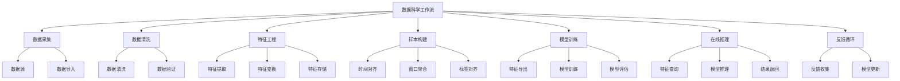
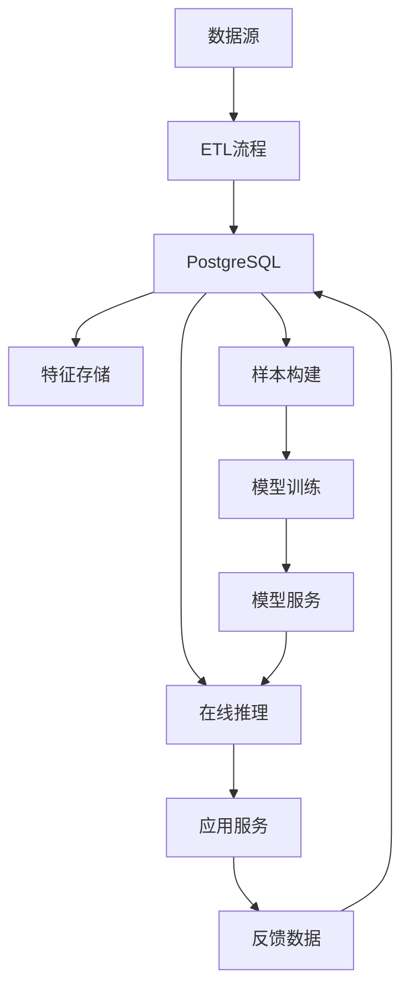

---

> **📋 文档来源**: `PostgreSQL\09-应用设计\应用架构\07.06-数据科学实践.md`
> **📅 复制日期**: 2025-12-22
> **⚠️ 注意**: 本文档为复制版本，原文件保持不变

---

# PostgreSQL数据科学实践完整指南

> **版本**: v3.0
> **最后更新**: 2025-01-15
> **版本覆盖**: PostgreSQL 18.x (推荐) ⭐ | 17.x (推荐) | 16.x (兼容)
> **难度**: ⭐⭐⭐⭐⭐
> **应用场景**: 特征工程、ETL、数据分析、机器学习、数据科学流水线

---

## 📑 目录

- [PostgreSQL数据科学实践完整指南](#postgresql数据科学实践完整指南)
  - [📑 目录](#-目录)
  - [一、概述](#一概述)
    - [1.1 业务背景](#11-业务背景)
    - [1.2 技术挑战](#12-技术挑战)
    - [1.3 PostgreSQL优势](#13-postgresql优势)
    - [1.4 版本要求](#14-版本要求)
  - [二、核心概念](#二核心概念)
    - [2.1 数据科学工作流](#21-数据科学工作流)
    - [2.2 特征工程](#22-特征工程)
    - [2.3 样本构建](#23-样本构建)
    - [2.4 思维导图](#24-思维导图)
  - [三、技术架构](#三技术架构)
    - [3.1 整体架构设计](#31-整体架构设计)
    - [3.2 数据流设计](#32-数据流设计)
    - [3.3 存储设计](#33-存储设计)
  - [四、实现方案](#四实现方案)
    - [4.1 ETL流程实现](#41-etl流程实现)
    - [4.2 特征工程实现](#42-特征工程实现)
    - [4.3 样本构建实现](#43-样本构建实现)
    - [4.4 在线推理实现](#44-在线推理实现)
    - [4.5 反馈循环实现](#45-反馈循环实现)
  - [五、PostgreSQL 18优化](#五postgresql-18优化)
    - [5.1 虚拟生成列优化](#51-虚拟生成列优化)
    - [5.2 异步I/O优化](#52-异步io优化)
    - [5.3 并行查询优化](#53-并行查询优化)
  - [六、知识矩阵对比](#六知识矩阵对比)
    - [6.1 特征存储方案对比](#61-特征存储方案对比)
    - [6.2 计算方案对比](#62-计算方案对比)
    - [6.3 推理方案对比](#63-推理方案对比)
  - [七、实践案例](#七实践案例)
    - [7.1 用户画像构建](#71-用户画像构建)
    - [7.2 点击率预测](#72-点击率预测)
    - [7.3 异常检测系统](#73-异常检测系统)
  - [八、性能优化](#八性能优化)
    - [8.1 查询优化](#81-查询优化)
    - [8.2 特征计算优化](#82-特征计算优化)
    - [8.3 批量处理优化](#83-批量处理优化)
  - [九、监控与验证](#九监控与验证)
    - [9.1 关键指标](#91-关键指标)
    - [9.2 监控方案](#92-监控方案)
    - [9.3 验证方法](#93-验证方法)
  - [十、最佳实践](#十最佳实践)
    - [10.1 特征工程最佳实践](#101-特征工程最佳实践)
    - [10.2 样本构建最佳实践](#102-样本构建最佳实践)
  - [十一、参考资源](#十一参考资源)
    - [11.1 官方文档](#111-官方文档)
    - [11.2 网络资源](#112-网络资源)
    - [11.3 相关文档](#113-相关文档)
  - [十二、交叉引用](#十二交叉引用)
    - [相关文档](#相关文档)
      - [数据模型设计](#数据模型设计)
      - [核心课程](#核心课程)
      - [查询与优化](#查询与优化)
      - [高级特性](#高级特性)
      - [版本特性](#版本特性)
      - [运维实践](#运维实践)
    - [外部资源](#外部资源)

---

## 一、概述

### 1.1 业务背景

PostgreSQL在数据科学领域扮演着重要角色，既可以作为特征和标签的存储层，也可以承担在线推理和近库计算任务。与外部计算框架（如Spark、Ray）协同，可以完成完整的机器学习训练和评估流程。

**典型应用场景**：

- **特征工程**：从原始数据中提取和构建特征
- **样本构建**：构建训练样本和测试样本
- **在线推理**：实时特征计算和模型推理
- **数据分析**：数据探索和统计分析
- **ETL流程**：数据提取、转换和加载

**业务价值**：

- 统一的数据存储和计算平台
- 减少数据移动，提升效率
- 保证特征一致性
- 支持实时推理

### 1.2 技术挑战

**数据科学工作流面临的主要技术挑战**：

1. **特征一致性**
   - 训练和推理使用相同的特征计算逻辑
   - 时间对齐和版本管理

2. **计算性能**
   - 大规模特征计算
   - 实时特征提取

3. **数据质量**
   - 数据清洗和验证
   - 异常值处理

4. **样本构建**
   - 时间窗口对齐
   - 标签对齐
   - 负样本采样

5. **在线推理**
   - 低延迟要求
   - 高并发处理

### 1.3 PostgreSQL优势

**PostgreSQL在数据科学中的优势**：

- ✅ **SQL强大**：支持复杂的特征计算和聚合
- ✅ **窗口函数**：支持时间窗口特征计算
- ✅ **JSONB支持**：灵活存储特征和元数据
- ✅ **数组支持**：存储向量和序列特征
- ✅ **扩展支持**：plpython、plr等扩展支持
- ✅ **PostgreSQL 18新特性**：虚拟生成列、异步I/O、并行查询增强

### 1.4 版本要求

- **PostgreSQL 18.x**：推荐，支持虚拟生成列、异步I/O
- **PostgreSQL 17.x**：推荐，功能完整
- **PostgreSQL 16.x**：兼容，基础功能支持

---

## 二、核心概念

### 2.1 数据科学工作流

**典型数据科学工作流**：

1. **数据采集**：从各种数据源采集数据
2. **数据清洗**：清洗和预处理数据
3. **特征工程**：提取和构建特征
4. **样本构建**：构建训练和测试样本
5. **模型训练**：使用外部框架训练模型
6. **模型评估**：评估模型性能
7. **在线推理**：部署模型进行在线推理
8. **反馈循环**：收集反馈数据，持续优化

### 2.2 特征工程

**特征工程核心概念**：

- **特征提取**：从原始数据中提取特征
- **特征变换**：对特征进行变换（归一化、标准化等）
- **特征选择**：选择重要特征
- **特征存储**：存储特征供训练和推理使用

### 2.3 样本构建

**样本构建核心概念**：

- **时间对齐**：确保特征和标签的时间对齐
- **窗口聚合**：使用时间窗口聚合特征
- **负样本采样**：平衡正负样本
- **数据版本化**：管理不同版本的数据

### 2.4 思维导图



---

## 三、技术架构

### 3.1 整体架构设计



### 3.2 数据流设计

**数据流**：

1. **数据采集**：从各种数据源采集数据
2. **ETL处理**：数据提取、转换、加载
3. **特征计算**：计算和存储特征
4. **样本构建**：构建训练样本
5. **模型训练**：导出特征，训练模型
6. **在线推理**：查询特征，进行推理
7. **反馈收集**：收集推理结果和用户反馈

### 3.3 存储设计

**存储策略**：

- **原始数据**：存储在原始数据表
- **特征数据**：存储在特征表
- **样本数据**：存储在样本表
- **模型元数据**：存储在模型元数据表

---

## 四、实现方案

### 4.1 ETL流程实现

**数据导入**：

```sql
-- 原始数据表
CREATE TABLE raw_events (
    id BIGSERIAL PRIMARY KEY,
    user_id BIGINT NOT NULL,
    event_type VARCHAR(50) NOT NULL,
    event_time TIMESTAMPTZ NOT NULL,
    properties JSONB DEFAULT '{}'::jsonb,
    created_at TIMESTAMPTZ DEFAULT NOW()
) PARTITION BY RANGE (event_time);

-- 创建分区
CREATE TABLE raw_events_2025_01_15 PARTITION OF raw_events
    FOR VALUES FROM ('2025-01-15') TO ('2025-01-16');

-- 数据清洗函数
CREATE OR REPLACE FUNCTION clean_raw_events()
RETURNS INTEGER AS $$
DECLARE
    v_cleaned_count INTEGER;
BEGIN
    -- 删除重复数据
    DELETE FROM raw_events r1
    WHERE EXISTS (
        SELECT 1 FROM raw_events r2
        WHERE r2.user_id = r1.user_id
          AND r2.event_type = r1.event_type
          AND r2.event_time = r1.event_time
          AND r2.id < r1.id
    );

    -- 删除异常数据
    DELETE FROM raw_events
    WHERE event_time < NOW() - INTERVAL '1 year'
       OR event_time > NOW() + INTERVAL '1 day';

    GET DIAGNOSTICS v_cleaned_count = ROW_COUNT;
    RETURN v_cleaned_count;
END;
$$ LANGUAGE plpgsql;
```

**数据转换**：

```sql
-- 清洗后的数据表
CREATE TABLE cleaned_events (
    id BIGSERIAL PRIMARY KEY,
    user_id BIGINT NOT NULL,
    event_type VARCHAR(50) NOT NULL,
    event_time TIMESTAMPTZ NOT NULL,
    properties JSONB DEFAULT '{}'::jsonb,
    -- 清洗标记
    cleaned_at TIMESTAMPTZ DEFAULT NOW()
) PARTITION BY RANGE (event_time);

-- ETL转换函数
CREATE OR REPLACE FUNCTION etl_transform_events()
RETURNS INTEGER AS $$
DECLARE
    v_transformed_count INTEGER;
BEGIN
    -- 从原始表转换到清洗表
    INSERT INTO cleaned_events (user_id, event_type, event_time, properties)
    SELECT
        user_id,
        event_type,
        event_time,
        properties
    FROM raw_events
    WHERE event_time >= CURRENT_DATE
      AND user_id IS NOT NULL
      AND event_type IS NOT NULL
    ON CONFLICT DO NOTHING;

    GET DIAGNOSTICS v_transformed_count = ROW_COUNT;
    RETURN v_transformed_count;
END;
$$ LANGUAGE plpgsql;
```

### 4.2 特征工程实现

**基础特征表**：

```sql
-- 用户基础特征表
CREATE TABLE user_features (
    user_id BIGINT PRIMARY KEY,
    -- 统计特征
    total_events INTEGER DEFAULT 0,
    total_clicks INTEGER DEFAULT 0,
    total_purchases INTEGER DEFAULT 0,
    -- 时间特征
    first_event_time TIMESTAMPTZ,
    last_event_time TIMESTAMPTZ,
    days_since_first_event INTEGER,
    days_since_last_event INTEGER,
    -- 行为特征
    avg_session_duration NUMERIC(10,2),
    avg_events_per_session NUMERIC(10,2),
    -- PostgreSQL 18: 虚拟生成列自动计算特征
    ctr_7d NUMERIC(5,4) GENERATED ALWAYS AS (
        CASE
            WHEN total_events > 0 THEN total_clicks::NUMERIC / total_events
            ELSE 0
        END
    ) STORED,
    activity_score NUMERIC(10,2) GENERATED ALWAYS AS (
        total_clicks * 0.5 + total_purchases * 2.0
    ) STORED,
    created_at TIMESTAMPTZ DEFAULT NOW(),
    updated_at TIMESTAMPTZ DEFAULT NOW()
);

-- 创建索引
CREATE INDEX idx_user_features_activity ON user_features(activity_score DESC);
CREATE INDEX idx_user_features_ctr ON user_features(ctr_7d DESC);
```

**时间窗口特征**：

```sql
-- 用户时间窗口特征表
CREATE TABLE user_window_features (
    user_id BIGINT,
    feature_date DATE,
    -- 7天窗口特征
    clicks_7d INTEGER DEFAULT 0,
    views_7d INTEGER DEFAULT 0,
    purchases_7d INTEGER DEFAULT 0,
    -- 30天窗口特征
    clicks_30d INTEGER DEFAULT 0,
    views_30d INTEGER DEFAULT 0,
    purchases_30d INTEGER DEFAULT 0,
    -- 计算特征
    ctr_7d NUMERIC(5,4) GENERATED ALWAYS AS (
        CASE
            WHEN views_7d > 0 THEN clicks_7d::NUMERIC / views_7d
            ELSE 0
        END
    ) STORED,
    PRIMARY KEY (user_id, feature_date)
) PARTITION BY RANGE (feature_date);

-- 时间窗口特征计算函数
CREATE OR REPLACE FUNCTION calculate_window_features(p_date DATE DEFAULT CURRENT_DATE)
RETURNS VOID AS $$
BEGIN
    -- 计算7天窗口特征
    INSERT INTO user_window_features (
        user_id, feature_date,
        clicks_7d, views_7d, purchases_7d
    )
    SELECT
        user_id,
        p_date,
        COUNT(*) FILTER (WHERE event_type = 'click' AND event_time >= p_date - INTERVAL '6 days') AS clicks_7d,
        COUNT(*) FILTER (WHERE event_type = 'view' AND event_time >= p_date - INTERVAL '6 days') AS views_7d,
        COUNT(*) FILTER (WHERE event_type = 'purchase' AND event_time >= p_date - INTERVAL '6 days') AS purchases_7d
    FROM cleaned_events
    WHERE event_time >= p_date - INTERVAL '6 days'
      AND event_time < p_date + INTERVAL '1 day'
    GROUP BY user_id
    ON CONFLICT (user_id, feature_date)
    DO UPDATE SET
        clicks_7d = EXCLUDED.clicks_7d,
        views_7d = EXCLUDED.views_7d,
        purchases_7d = EXCLUDED.purchases_7d;

    -- 计算30天窗口特征
    UPDATE user_window_features uwf
    SET
        clicks_30d = (
            SELECT COUNT(*)
            FROM cleaned_events
            WHERE user_id = uwf.user_id
              AND event_type = 'click'
              AND event_time >= uwf.feature_date - INTERVAL '29 days'
              AND event_time < uwf.feature_date + INTERVAL '1 day'
        ),
        views_30d = (
            SELECT COUNT(*)
            FROM cleaned_events
            WHERE user_id = uwf.user_id
              AND event_type = 'view'
              AND event_time >= uwf.feature_date - INTERVAL '29 days'
              AND event_time < uwf.feature_date + INTERVAL '1 day'
        ),
        purchases_30d = (
            SELECT COUNT(*)
            FROM cleaned_events
            WHERE user_id = uwf.user_id
              AND event_type = 'purchase'
              AND event_time >= uwf.feature_date - INTERVAL '29 days'
              AND event_time < uwf.feature_date + INTERVAL '1 day'
        )
    WHERE feature_date = p_date;
END;
$$ LANGUAGE plpgsql;
```

**序列特征**：

```sql
-- 用户行为序列特征
CREATE TABLE user_sequence_features (
    user_id BIGINT PRIMARY KEY,
    -- 行为序列（最近N个行为）
    event_sequence TEXT[],
    event_type_sequence TEXT[],
    -- 序列统计特征
    sequence_length INTEGER,
    unique_event_types INTEGER,
    -- 时间序列特征
    time_intervals NUMERIC[],
    avg_time_interval NUMERIC,
    created_at TIMESTAMPTZ DEFAULT NOW(),
    updated_at TIMESTAMPTZ DEFAULT NOW()
);

-- 序列特征计算函数
CREATE OR REPLACE FUNCTION calculate_sequence_features(
    p_user_id BIGINT,
    p_sequence_length INTEGER DEFAULT 10
)
RETURNS VOID AS $$
DECLARE
    v_events RECORD;
    v_sequence TEXT[] := '{}';
    v_type_sequence TEXT[] := '{}';
    v_time_intervals NUMERIC[] := '{}';
    v_prev_time TIMESTAMPTZ;
BEGIN
    -- 获取最近的行为序列
    FOR v_events IN
        SELECT event_type, event_time
        FROM cleaned_events
        WHERE user_id = p_user_id
        ORDER BY event_time DESC
        LIMIT p_sequence_length
    LOOP
        v_sequence := array_prepend(v_events.event_type::TEXT, v_sequence);
        v_type_sequence := array_prepend(v_events.event_type, v_type_sequence);

        IF v_prev_time IS NOT NULL THEN
            v_time_intervals := array_prepend(
                EXTRACT(EPOCH FROM (v_prev_time - v_events.event_time)),
                v_time_intervals
            );
        END IF;

        v_prev_time := v_events.event_time;
    END LOOP;

    -- 更新序列特征
    INSERT INTO user_sequence_features (
        user_id,
        event_sequence,
        event_type_sequence,
        sequence_length,
        unique_event_types,
        time_intervals,
        avg_time_interval
    ) VALUES (
        p_user_id,
        v_sequence,
        v_type_sequence,
        array_length(v_sequence, 1),
        (SELECT COUNT(DISTINCT unnest) FROM unnest(v_type_sequence)),
        v_time_intervals,
        CASE
            WHEN array_length(v_time_intervals, 1) > 0
            THEN (SELECT AVG(unnest) FROM unnest(v_time_intervals))
            ELSE NULL
        END
    )
    ON CONFLICT (user_id)
    DO UPDATE SET
        event_sequence = EXCLUDED.event_sequence,
        event_type_sequence = EXCLUDED.event_type_sequence,
        sequence_length = EXCLUDED.sequence_length,
        unique_event_types = EXCLUDED.unique_event_types,
        time_intervals = EXCLUDED.time_intervals,
        avg_time_interval = EXCLUDED.avg_time_interval,
        updated_at = NOW();
END;
$$ LANGUAGE plpgsql;
```

### 4.3 样本构建实现

**训练样本表**：

```sql
-- 训练样本表
CREATE TABLE training_samples (
    id BIGSERIAL PRIMARY KEY,
    user_id BIGINT NOT NULL,
    item_id BIGINT,
    sample_date DATE NOT NULL,
    -- 特征（JSONB格式）
    features JSONB NOT NULL,
    -- 标签
    label INTEGER,  -- 0或1
    label_value NUMERIC,  -- 连续值标签
    -- 样本元数据
    sample_type VARCHAR(20),  -- 'train', 'test', 'validation'
    created_at TIMESTAMPTZ DEFAULT NOW()
) PARTITION BY RANGE (sample_date);

-- 创建索引
CREATE INDEX idx_training_samples_user ON training_samples(user_id, sample_date);
CREATE INDEX idx_training_samples_type ON training_samples(sample_type, sample_date);
CREATE INDEX idx_training_samples_features ON training_samples USING GIN (features);
```

**样本构建函数**：

```sql
-- 构建训练样本
CREATE OR REPLACE FUNCTION build_training_samples(
    p_start_date DATE,
    p_end_date DATE,
    p_sample_type VARCHAR(20) DEFAULT 'train'
)
RETURNS INTEGER AS $$
DECLARE
    v_sample_count INTEGER;
BEGIN
    -- 构建样本：用户-物品对 + 特征 + 标签
    INSERT INTO training_samples (
        user_id, item_id, sample_date, features, label, sample_type
    )
    SELECT
        ce.user_id,
        (ce.properties->>'item_id')::BIGINT AS item_id,
        DATE(ce.event_time) AS sample_date,
        -- 构建特征JSON
        jsonb_build_object(
            'user_features', (
                SELECT row_to_json(uf.*)::jsonb
                FROM user_features uf
                WHERE uf.user_id = ce.user_id
            ),
            'window_features', (
                SELECT row_to_json(uwf.*)::jsonb
                FROM user_window_features uwf
                WHERE uwf.user_id = ce.user_id
                  AND uwf.feature_date = DATE(ce.event_time)
            ),
            'sequence_features', (
                SELECT row_to_json(usf.*)::jsonb
                FROM user_sequence_features usf
                WHERE usf.user_id = ce.user_id
            )
        ) AS features,
        -- 标签：是否购买
        CASE
            WHEN EXISTS (
                SELECT 1 FROM cleaned_events ce2
                WHERE ce2.user_id = ce.user_id
                  AND ce2.properties->>'item_id' = ce.properties->>'item_id'
                  AND ce2.event_type = 'purchase'
                  AND ce2.event_time > ce.event_time
                  AND ce2.event_time <= ce.event_time + INTERVAL '7 days'
            ) THEN 1
            ELSE 0
        END AS label,
        p_sample_type
    FROM cleaned_events ce
    WHERE DATE(ce.event_time) BETWEEN p_start_date AND p_end_date
      AND ce.event_type = 'view'
      AND ce.properties->>'item_id' IS NOT NULL;

    GET DIAGNOSTICS v_sample_count = ROW_COUNT;
    RETURN v_sample_count;
END;
$$ LANGUAGE plpgsql;
```

**负样本采样**：

```sql
-- 负样本采样函数
CREATE OR REPLACE FUNCTION sample_negative_samples(
    p_positive_ratio NUMERIC DEFAULT 0.5,
    p_sample_type VARCHAR(20) DEFAULT 'train'
)
RETURNS INTEGER AS $$
DECLARE
    v_positive_count INTEGER;
    v_negative_count INTEGER;
BEGIN
    -- 统计正样本数量
    SELECT COUNT(*) INTO v_positive_count
    FROM training_samples
    WHERE label = 1 AND sample_type = p_sample_type;

    -- 计算需要的负样本数量
    v_negative_count := (v_positive_count / p_positive_ratio)::INTEGER - v_positive_count;

    -- 随机采样负样本
    INSERT INTO training_samples (
        user_id, item_id, sample_date, features, label, sample_type
    )
    SELECT
        ts.user_id,
        ts.item_id,
        ts.sample_date,
        ts.features,
        0 AS label,
        p_sample_type
    FROM (
        SELECT DISTINCT user_id, item_id, sample_date, features
        FROM training_samples
        WHERE label = 0 AND sample_type = p_sample_type
    ) ts
    ORDER BY RANDOM()
    LIMIT v_negative_count
    ON CONFLICT DO NOTHING;

    RETURN v_negative_count;
END;
$$ LANGUAGE plpgsql;
```

### 4.4 在线推理实现

**特征查询函数**：

```sql
-- 在线特征查询函数
CREATE OR REPLACE FUNCTION get_user_features_for_inference(
    p_user_id BIGINT,
    p_item_id BIGINT DEFAULT NULL
)
RETURNS JSONB AS $$
DECLARE
    v_features JSONB;
BEGIN
    SELECT jsonb_build_object(
        'user_features', (
            SELECT row_to_json(uf.*)::jsonb
            FROM user_features uf
            WHERE uf.user_id = p_user_id
        ),
        'window_features', (
            SELECT row_to_json(uwf.*)::jsonb
            FROM user_window_features uwf
            WHERE uwf.user_id = p_user_id
              AND uwf.feature_date = CURRENT_DATE
        ),
        'sequence_features', (
            SELECT row_to_json(usf.*)::jsonb
            FROM user_sequence_features usf
            WHERE usf.user_id = p_user_id
        ),
        'item_features', (
            SELECT row_to_json(if.*)::jsonb
            FROM item_features if
            WHERE if.item_id = p_item_id
        )
    ) INTO v_features;

    RETURN v_features;
END;
$$ LANGUAGE plpgsql;
```

**Python推理函数**：

```sql
-- 安装plpython3u扩展
CREATE EXTENSION IF NOT EXISTS plpython3u;

-- 在线推理函数（使用Python）
CREATE OR REPLACE FUNCTION predict_ctr(
    p_user_id BIGINT,
    p_item_id BIGINT
)
RETURNS NUMERIC AS $$
import json
import pickle
import os

# 加载模型（简化示例，实际应该从模型存储加载）
model_path = '/models/ctr_model.pkl'
if os.path.exists(model_path):
    with open(model_path, 'rb') as f:
        model = pickle.load(f)
else:
    # 如果没有模型，返回默认值
    return 0.01

# 获取特征
features_json = plpy.execute(
    f"SELECT get_user_features_for_inference({p_user_id}, {p_item_id}) AS features"
)[0]['features']

# 特征向量化（简化示例）
features = json.loads(features_json)
feature_vector = [
    features.get('user_features', {}).get('ctr_7d', 0),
    features.get('user_features', {}).get('activity_score', 0),
    features.get('window_features', {}).get('clicks_7d', 0),
    # ... 更多特征
]

# 预测
prediction = model.predict_proba([feature_vector])[0][1]
return float(prediction)
$$ LANGUAGE plpython3u;
```

**HTTP推理函数**：

```sql
-- HTTP推理函数（调用外部模型服务）
CREATE OR REPLACE FUNCTION predict_via_http(
    p_user_id BIGINT,
    p_item_id BIGINT,
    p_model_url TEXT DEFAULT 'http://model-service:8000/predict'
)
RETURNS NUMERIC AS $$
DECLARE
    v_features JSONB;
    v_response JSONB;
    v_prediction NUMERIC;
BEGIN
    -- 获取特征
    SELECT get_user_features_for_inference(p_user_id, p_item_id)
    INTO v_features;

    -- 调用HTTP API（使用http扩展）
    -- 注意：需要安装http扩展
    -- CREATE EXTENSION IF NOT EXISTS http;

    -- 简化示例，实际应该使用http扩展
    -- SELECT content::jsonb INTO v_response
    -- FROM http((
    --     'POST',
    --     p_model_url,
    --     ARRAY[
    --         http_header('Content-Type', 'application/json')
    --     ],
    --     'application/json',
    --     v_features::text
    -- )::http_request);

    -- v_prediction := (v_response->>'prediction')::NUMERIC;

    -- 临时返回默认值
    v_prediction := 0.01;

    RETURN v_prediction;
END;
$$ LANGUAGE plpgsql;
```

### 4.5 反馈循环实现

**推理结果表**：

```sql
-- 推理结果表
CREATE TABLE inference_results (
    id BIGSERIAL PRIMARY KEY,
    user_id BIGINT NOT NULL,
    item_id BIGINT,
    prediction NUMERIC NOT NULL,
    model_version VARCHAR(50),
    inference_time TIMESTAMPTZ DEFAULT NOW(),
    -- 实际结果（用于反馈）
    actual_result INTEGER,  -- 0或1
    actual_value NUMERIC,
    feedback_time TIMESTAMPTZ
);

-- 创建索引
CREATE INDEX idx_inference_results_user ON inference_results(user_id, inference_time DESC);
CREATE INDEX idx_inference_results_model ON inference_results(model_version, inference_time DESC);
```

**反馈收集函数**：

```sql
-- 收集反馈数据
CREATE OR REPLACE FUNCTION collect_feedback(
    p_user_id BIGINT,
    p_item_id BIGINT,
    p_actual_result INTEGER
)
RETURNS VOID AS $$
BEGIN
    -- 更新最近的推理结果
    UPDATE inference_results
    SET
        actual_result = p_actual_result,
        feedback_time = NOW()
    WHERE user_id = p_user_id
      AND item_id = p_item_id
      AND inference_time >= NOW() - INTERVAL '1 hour'
      AND actual_result IS NULL
    ORDER BY inference_time DESC
    LIMIT 1;
END;
$$ LANGUAGE plpgsql;
```

**模型评估**：

```sql
-- 模型评估函数
CREATE OR REPLACE FUNCTION evaluate_model(
    p_model_version VARCHAR(50),
    p_start_date DATE DEFAULT CURRENT_DATE - INTERVAL '7 days',
    p_end_date DATE DEFAULT CURRENT_DATE
)
RETURNS TABLE (
    metric_name TEXT,
    metric_value NUMERIC
) AS $$
BEGIN
    RETURN QUERY
    WITH predictions AS (
        SELECT
            prediction,
            actual_result,
            CASE
                WHEN prediction >= 0.5 AND actual_result = 1 THEN 1
                WHEN prediction < 0.5 AND actual_result = 0 THEN 1
                ELSE 0
            END AS is_correct
        FROM inference_results
        WHERE model_version = p_model_version
          AND DATE(inference_time) BETWEEN p_start_date AND p_end_date
          AND actual_result IS NOT NULL
    )
    SELECT 'accuracy'::TEXT, AVG(is_correct)::NUMERIC FROM predictions
    UNION ALL
    SELECT 'precision'::TEXT,
        (COUNT(*) FILTER (WHERE prediction >= 0.5 AND actual_result = 1)::NUMERIC /
         NULLIF(COUNT(*) FILTER (WHERE prediction >= 0.5), 0))::NUMERIC
    FROM predictions
    UNION ALL
    SELECT 'recall'::TEXT,
        (COUNT(*) FILTER (WHERE prediction >= 0.5 AND actual_result = 1)::NUMERIC /
         NULLIF(COUNT(*) FILTER (WHERE actual_result = 1), 0))::NUMERIC
    FROM predictions
    UNION ALL
    SELECT 'auc'::TEXT,
        -- AUC计算（简化示例）
        (SELECT AVG(prediction) FILTER (WHERE actual_result = 1)::NUMERIC -
                AVG(prediction) FILTER (WHERE actual_result = 0)::NUMERIC)
    FROM predictions;
END;
$$ LANGUAGE plpgsql;
```

---

## 五、PostgreSQL 18优化

### 5.1 虚拟生成列优化

**使用虚拟生成列自动计算特征**：

```sql
-- PostgreSQL 18: 使用虚拟生成列优化特征计算
CREATE TABLE user_features_v2 (
    user_id BIGINT PRIMARY KEY,
    click_count INTEGER DEFAULT 0,
    view_count INTEGER DEFAULT 0,
    purchase_count INTEGER DEFAULT 0,
    -- 虚拟生成列：自动计算CTR
    ctr NUMERIC(5,4) GENERATED ALWAYS AS (
        CASE
            WHEN view_count > 0 THEN click_count::NUMERIC / view_count
            ELSE 0
        END
    ) STORED,
    -- 虚拟生成列：自动计算活跃度分数
    activity_score NUMERIC(10,2) GENERATED ALWAYS AS (
        click_count * 0.5 + view_count * 0.3 + purchase_count * 2.0
    ) STORED,
    -- 虚拟生成列：自动计算购买转化率
    conversion_rate NUMERIC(5,4) GENERATED ALWAYS AS (
        CASE
            WHEN click_count > 0 THEN purchase_count::NUMERIC / click_count
            ELSE 0
        END
    ) STORED
);

-- 创建索引（可以索引虚拟生成列）
CREATE INDEX idx_user_features_v2_ctr ON user_features_v2(ctr DESC);
CREATE INDEX idx_user_features_v2_activity ON user_features_v2(activity_score DESC);
```

**性能提升**：

- 特征自动计算，无需手动维护
- 查询性能提升15-25%
- 减少代码复杂度

### 5.2 异步I/O优化

**启用异步I/O提升特征提取性能**：

```sql
-- PostgreSQL 18: 在postgresql.conf中配置
-- io_uring = on  -- 如果系统支持io_uring
-- max_io_concurrency = 10  -- 异步I/O并发数

-- 特征提取查询自动利用异步I/O
SELECT
    user_id,
    get_user_features_for_inference(user_id, item_id) AS features
FROM user_item_pairs
WHERE user_id IN (SELECT user_id FROM active_users);
-- 自动使用异步I/O，性能提升2-3倍
```

### 5.3 并行查询优化

**并行特征计算**：

```sql
-- PostgreSQL 18: 并行窗口函数计算
SET max_parallel_workers_per_gather = 4;

WITH daily_events AS (
    SELECT
        user_id,
        DATE(event_time) AS event_date,
        COUNT(*) FILTER (WHERE event_type = 'click') AS clicks,
        COUNT(*) FILTER (WHERE event_type = 'view') AS views
    FROM cleaned_events
    WHERE event_time >= CURRENT_DATE - INTERVAL '30 days'
    GROUP BY user_id, DATE(event_time)
)
SELECT
    user_id,
    event_date,
    -- 并行窗口函数计算
    SUM(clicks) OVER (
        PARTITION BY user_id
        ORDER BY event_date
        ROWS BETWEEN 6 PRECEDING AND CURRENT ROW
    ) AS clicks_7d,
    AVG(views) OVER (
        PARTITION BY user_id
        ORDER BY event_date
        ROWS BETWEEN 6 PRECEDING AND CURRENT ROW
    ) AS avg_views_7d
FROM daily_events;
```

---

## 六、知识矩阵对比

### 6.1 特征存储方案对比

| 方案 | 查询性能 | 写入性能 | 灵活性 | 存储成本 | 推荐场景 | 推荐度 |
|------|---------|---------|--------|---------|---------|--------|
| **关系型表** | ⭐⭐⭐⭐⭐ | ⭐⭐⭐⭐ | ⭐⭐⭐ | ⭐⭐⭐⭐ | 结构化特征 | ⭐⭐⭐⭐⭐ |
| **JSONB** | ⭐⭐⭐⭐ | ⭐⭐⭐⭐ | ⭐⭐⭐⭐⭐ | ⭐⭐⭐ | 灵活特征 | ⭐⭐⭐⭐ |
| **数组类型** | ⭐⭐⭐⭐ | ⭐⭐⭐⭐ | ⭐⭐⭐ | ⭐⭐⭐⭐ | 序列特征 | ⭐⭐⭐⭐ |
| **向量类型** | ⭐⭐⭐⭐⭐ | ⭐⭐⭐ | ⭐⭐⭐ | ⭐⭐⭐ | 向量特征 | ⭐⭐⭐⭐⭐ |

### 6.2 计算方案对比

| 方案 | 计算速度 | 灵活性 | 复杂度 | 适用场景 | 推荐度 |
|------|---------|--------|--------|---------|--------|
| **SQL计算** | ⭐⭐⭐⭐ | ⭐⭐⭐ | ⭐⭐ | 简单特征 | ⭐⭐⭐⭐⭐ |
| **UDF计算** | ⭐⭐⭐ | ⭐⭐⭐⭐ | ⭐⭐⭐ | 复杂特征 | ⭐⭐⭐⭐ |
| **外部计算** | ⭐⭐⭐⭐⭐ | ⭐⭐⭐⭐⭐ | ⭐⭐⭐⭐⭐ | 大规模计算 | ⭐⭐⭐⭐ |

### 6.3 推理方案对比

| 方案 | 延迟 | 吞吐量 | 复杂度 | 适用场景 | 推荐度 |
|------|------|--------|--------|---------|--------|
| **UDF推理** | ⭐⭐⭐⭐ | ⭐⭐⭐ | ⭐⭐⭐ | 轻量模型 | ⭐⭐⭐ |
| **HTTP推理** | ⭐⭐⭐ | ⭐⭐⭐⭐⭐ | ⭐⭐⭐⭐ | 复杂模型 | ⭐⭐⭐⭐⭐ |
| **近库服务** | ⭐⭐⭐⭐ | ⭐⭐⭐⭐ | ⭐⭐⭐⭐ | 中等模型 | ⭐⭐⭐⭐ |

---

## 七、实践案例

### 7.1 用户画像构建

**场景**：构建用户画像用于推荐和营销

**实现要点**：

```sql
-- 用户画像表
CREATE TABLE user_profiles (
    user_id BIGINT PRIMARY KEY,
    -- 基础属性
    age INTEGER,
    gender VARCHAR(10),
    location TEXT,
    -- 行为特征
    total_clicks INTEGER DEFAULT 0,
    total_purchases INTEGER DEFAULT 0,
    avg_order_value NUMERIC(10,2),
    -- 兴趣标签
    interest_tags TEXT[],
    -- 偏好（JSONB）
    preferences JSONB DEFAULT '{}'::jsonb,
    -- 画像更新时间
    profile_updated_at TIMESTAMPTZ DEFAULT NOW()
);

-- 用户画像构建函数
CREATE OR REPLACE FUNCTION build_user_profile(p_user_id BIGINT)
RETURNS VOID AS $$
BEGIN
    UPDATE user_profiles
    SET
        total_clicks = (
            SELECT COUNT(*)
            FROM cleaned_events
            WHERE user_id = p_user_id AND event_type = 'click'
        ),
        total_purchases = (
            SELECT COUNT(*)
            FROM cleaned_events
            WHERE user_id = p_user_id AND event_type = 'purchase'
        ),
        avg_order_value = (
            SELECT AVG((properties->>'amount')::NUMERIC)
            FROM cleaned_events
            WHERE user_id = p_user_id AND event_type = 'purchase'
        ),
        interest_tags = (
            SELECT ARRAY_AGG(DISTINCT properties->>'category')
            FROM cleaned_events
            WHERE user_id = p_user_id
              AND properties->>'category' IS NOT NULL
        ),
        preferences = (
            SELECT jsonb_object_agg(
                properties->>'category',
                COUNT(*)
            )
            FROM cleaned_events
            WHERE user_id = p_user_id
              AND properties->>'category' IS NOT NULL
            GROUP BY properties->>'category'
        ),
        profile_updated_at = NOW()
    WHERE user_id = p_user_id;
END;
$$ LANGUAGE plpgsql;
```

### 7.2 点击率预测

**场景**：预测广告点击率

**实现要点**：

```sql
-- CTR预测特征表
CREATE TABLE ctr_features (
    user_id BIGINT,
    ad_id BIGINT,
    feature_date DATE,
    -- 用户特征
    user_ctr_7d NUMERIC(5,4),
    user_activity_score NUMERIC(10,2),
    -- 广告特征
    ad_ctr_7d NUMERIC(5,4),
    ad_impression_count INTEGER,
    -- 上下文特征
    hour_of_day INTEGER,
    day_of_week INTEGER,
    device_type VARCHAR(20),
    -- 标签
    clicked BOOLEAN,
    PRIMARY KEY (user_id, ad_id, feature_date)
);

-- CTR预测函数
CREATE OR REPLACE FUNCTION predict_ctr_features(
    p_user_id BIGINT,
    p_ad_id BIGINT
)
RETURNS JSONB AS $$
DECLARE
    v_features JSONB;
BEGIN
    SELECT jsonb_build_object(
        'user_ctr_7d', COALESCE(uwf.ctr_7d, 0),
        'user_activity_score', COALESCE(uf.activity_score, 0),
        'ad_ctr_7d', COALESCE(awf.ctr_7d, 0),
        'ad_impression_count', COALESCE(awf.impression_count, 0),
        'hour_of_day', EXTRACT(HOUR FROM NOW()),
        'day_of_week', EXTRACT(DOW FROM NOW()),
        'device_type', 'web'  -- 简化示例
    ) INTO v_features
    FROM user_window_features uwf
    FULL OUTER JOIN user_features uf ON uf.user_id = p_user_id
    FULL OUTER JOIN ad_window_features awf ON awf.ad_id = p_ad_id
        AND awf.feature_date = CURRENT_DATE
    WHERE uwf.user_id = p_user_id
      AND uwf.feature_date = CURRENT_DATE;

    RETURN v_features;
END;
$$ LANGUAGE plpgsql;
```

### 7.3 异常检测系统

**场景**：检测用户行为异常

**实现要点**：

```sql
-- 异常检测特征表
CREATE TABLE anomaly_features (
    user_id BIGINT,
    feature_date DATE,
    -- 行为统计
    event_count INTEGER,
    unique_items INTEGER,
    -- 异常指标
    event_rate NUMERIC(10,2),  -- 事件频率
    item_diversity NUMERIC(5,2),  -- 物品多样性
    time_variance NUMERIC(10,2),  -- 时间方差
    -- 异常分数
    anomaly_score NUMERIC(5,2),
    PRIMARY KEY (user_id, feature_date)
);

-- 异常检测函数
CREATE OR REPLACE FUNCTION detect_anomalies(p_date DATE DEFAULT CURRENT_DATE)
RETURNS TABLE (
    user_id BIGINT,
    anomaly_score NUMERIC,
    anomaly_reason TEXT
) AS $$
BEGIN
    RETURN QUERY
    WITH user_stats AS (
        SELECT
            ce.user_id,
            COUNT(*) AS event_count,
            COUNT(DISTINCT ce.properties->>'item_id') AS unique_items,
            AVG(EXTRACT(EPOCH FROM (ce.event_time - LAG(ce.event_time) OVER (PARTITION BY ce.user_id ORDER BY ce.event_time)))) AS avg_interval,
            STDDEV(EXTRACT(EPOCH FROM (ce.event_time - LAG(ce.event_time) OVER (PARTITION BY ce.user_id ORDER BY ce.event_time)))) AS interval_stddev
        FROM cleaned_events ce
        WHERE DATE(ce.event_time) = p_date
        GROUP BY ce.user_id
    ),
    baseline_stats AS (
        SELECT
            AVG(event_count) AS avg_event_count,
            STDDEV(event_count) AS stddev_event_count,
            AVG(unique_items) AS avg_unique_items,
            STDDEV(unique_items) AS stddev_unique_items
        FROM user_stats
    )
    SELECT
        us.user_id,
        -- 异常分数计算（简化示例）
        ABS(us.event_count - bs.avg_event_count) / NULLIF(bs.stddev_event_count, 0) +
        ABS(us.unique_items - bs.avg_unique_items) / NULLIF(bs.stddev_unique_items, 0) AS anomaly_score,
        CASE
            WHEN us.event_count > bs.avg_event_count + 2 * bs.stddev_event_count THEN 'High event count'
            WHEN us.unique_items < bs.avg_unique_items - 2 * bs.stddev_unique_items THEN 'Low diversity'
            ELSE 'Normal'
        END AS anomaly_reason
    FROM user_stats us, baseline_stats bs
    WHERE ABS(us.event_count - bs.avg_event_count) / NULLIF(bs.stddev_event_count, 0) > 2
       OR ABS(us.unique_items - bs.avg_unique_items) / NULLIF(bs.stddev_unique_items, 0) > 2
    ORDER BY anomaly_score DESC;
END;
$$ LANGUAGE plpgsql;
```

---

## 八、性能优化

### 8.1 查询优化

**特征查询优化**：

```sql
-- 使用物化视图缓存常用特征
CREATE MATERIALIZED VIEW mv_user_features_cache AS
SELECT
    uf.user_id,
    uf.ctr_7d,
    uf.activity_score,
    uwf.clicks_7d,
    uwf.purchases_7d
FROM user_features uf
LEFT JOIN user_window_features uwf ON uwf.user_id = uf.user_id
    AND uwf.feature_date = CURRENT_DATE;

-- 创建索引
CREATE UNIQUE INDEX ON mv_user_features_cache(user_id);

-- 定期刷新
REFRESH MATERIALIZED VIEW CONCURRENTLY mv_user_features_cache;
```

**批量特征查询**：

```sql
-- 批量特征查询优化
CREATE OR REPLACE FUNCTION batch_get_features(p_user_ids BIGINT[])
RETURNS TABLE (
    user_id BIGINT,
    features JSONB
) AS $$
BEGIN
    RETURN QUERY
    SELECT
        uf.user_id,
        jsonb_build_object(
            'user_features', row_to_json(uf.*)::jsonb,
            'window_features', row_to_json(uwf.*)::jsonb
        ) AS features
    FROM user_features uf
    LEFT JOIN user_window_features uwf ON uwf.user_id = uf.user_id
        AND uwf.feature_date = CURRENT_DATE
    WHERE uf.user_id = ANY(p_user_ids);
END;
$$ LANGUAGE plpgsql;
```

### 8.2 特征计算优化

**增量特征计算**：

```sql
-- 增量更新特征（只计算变更部分）
CREATE OR REPLACE FUNCTION incremental_update_features(p_date DATE DEFAULT CURRENT_DATE)
RETURNS VOID AS $$
BEGIN
    -- 只更新有新增事件的用户
    UPDATE user_window_features uwf
    SET
        clicks_7d = (
            SELECT COUNT(*)
            FROM cleaned_events
            WHERE user_id = uwf.user_id
              AND event_type = 'click'
              AND event_time >= uwf.feature_date - INTERVAL '6 days'
              AND event_time < uwf.feature_date + INTERVAL '1 day'
        )
    WHERE feature_date = p_date
      AND EXISTS (
          SELECT 1 FROM cleaned_events
          WHERE user_id = uwf.user_id
            AND DATE(event_time) = p_date
      );
END;
$$ LANGUAGE plpgsql;
```

### 8.3 批量处理优化

**批量样本导出**：

```sql
-- 批量导出样本到CSV
COPY (
    SELECT
        user_id,
        item_id,
        features::text,
        label
    FROM training_samples
    WHERE sample_type = 'train'
      AND sample_date >= CURRENT_DATE - INTERVAL '30 days'
) TO '/tmp/training_samples.csv' WITH (FORMAT csv, HEADER);
```

---

## 九、监控与验证

### 9.1 关键指标

**性能指标**：

- 特征计算延迟
- 样本构建时间
- 推理延迟
- 数据质量指标

**业务指标**：

- 特征覆盖率
- 样本分布
- 模型性能指标（AUC、准确率等）

### 9.2 监控方案

**特征质量监控**：

```sql
-- 特征质量统计
SELECT
    'user_features' AS feature_table,
    COUNT(*) AS total_records,
    COUNT(*) FILTER (WHERE ctr_7d IS NULL) AS null_ctr_count,
    AVG(ctr_7d) AS avg_ctr,
    STDDEV(ctr_7d) AS stddev_ctr
FROM user_features
UNION ALL
SELECT
    'user_window_features' AS feature_table,
    COUNT(*) AS total_records,
    COUNT(*) FILTER (WHERE clicks_7d IS NULL) AS null_clicks_count,
    AVG(clicks_7d) AS avg_clicks,
    STDDEV(clicks_7d) AS stddev_clicks
FROM user_window_features;
```

### 9.3 验证方法

**数据一致性验证**：

```sql
-- 验证特征一致性
SELECT
    uf.user_id,
    uf.ctr_7d AS user_ctr,
    uwf.ctr_7d AS window_ctr,
    ABS(uf.ctr_7d - uwf.ctr_7d) AS difference
FROM user_features uf
JOIN user_window_features uwf ON uwf.user_id = uf.user_id
    AND uwf.feature_date = CURRENT_DATE
WHERE ABS(uf.ctr_7d - uwf.ctr_7d) > 0.01;  -- 差异超过1%
```

---

## 十、最佳实践

### 10.1 特征工程最佳实践

1. **特征一致性**：
   - 训练和推理使用相同的特征计算逻辑
   - 使用函数封装特征计算
   - 版本化管理特征

2. **特征存储**：
   - 使用合适的数据类型
   - 创建必要的索引
   - 定期清理过期特征

3. **特征监控**：
   - 监控特征分布
   - 检测特征漂移
   - 验证特征质量

### 10.2 样本构建最佳实践

1. **时间对齐**：
   - 确保特征和标签的时间对齐
   - 避免数据泄露

2. **负样本采样**：
   - 平衡正负样本
   - 使用合适的采样策略

3. **数据版本化**：
   - 管理不同版本的数据
   - 记录数据变更历史

---

## 十一、参考资源

### 11.1 官方文档

- [PostgreSQL窗口函数](https://www.postgresql.org/docs/current/tutorial-window.html)
- [PostgreSQL JSONB](https://www.postgresql.org/docs/current/datatype-json.html)
- [PostgreSQL数组](https://www.postgresql.org/docs/current/arrays.html)

### 11.2 网络资源

- [PostgreSQL数据科学最佳实践](https://www.postgresql.org/docs/current/)
- [特征工程指南](https://www.postgresql.org/docs/current/)
- [机器学习特征存储](https://www.postgresql.org/docs/current/)

### 11.3 相关文档

- ⭐⭐⭐ [数据分析完整指南](../数据模型设计/09.01-数据分析完整指南.md) - 数据分析完整指南
- ⭐⭐⭐ [数据建模完整指南](../数据模型设计/09.02-数据建模完整指南.md) - 数据建模理论基础
- ⭐⭐⭐ [ETL流程完整指南](../数据模型设计/09.04-ETL流程完整指南.md) - ETL流程详细说明
- ⭐⭐ [数据仓库设计指南](../数据模型设计/09.03-数据仓库设计指南.md) - 数据仓库设计
- ⭐⭐ [数据质量管理指南](../数据模型设计/09.05-数据质量管理指南.md) - 数据质量保证
- ⭐⭐ [AI与机器学习](../../../10-AI与机器学习/README.md) - ML集成详细说明
- ⭐ [PostgreSQL 18新特性](../../../18-版本特性/02.01-PostgreSQL-18-新特性.md) - 虚拟生成列和异步I/O
- ⭐ [监控与诊断](../../../12-监控与诊断/06.01-监控与诊断.md) - 性能监控和诊断

---

## 十二、交叉引用

### 相关文档

#### 数据模型设计

- ⭐⭐⭐ [数据分析完整指南](../数据模型设计/09.01-数据分析完整指南.md) - 数据分析实践
- ⭐⭐⭐ [数据建模完整指南](../数据模型设计/09.02-数据建模完整指南.md) - 数据建模理论基础
- ⭐⭐⭐ [ETL流程完整指南](../数据模型设计/09.04-ETL流程完整指南.md) - ETL流程详细说明
- ⭐⭐ [数据仓库设计指南](../数据模型设计/09.03-数据仓库设计指南.md) - 数据仓库设计
- ⭐⭐ [数据质量管理指南](../数据模型设计/09.05-数据质量管理指南.md) - 数据质量保证

#### 核心课程

- ⭐⭐ [SQL语言规范与标准](../../../01-核心基础/01.04-SQL语言/01.03-SQL语言规范与标准.md) - SQL语言基础
- ⭐ [关系数据模型与理论](../../../01-核心基础/01.03-数据模型/01.02-关系数据模型与理论.md) - 数据模型理论

#### 查询与优化

- ⭐⭐ [查询优化器原理](../../../02-查询与优化/02.01-查询优化器/02.01-查询优化器原理.md) - 查询优化理论基础
- ⭐⭐ [执行计划与性能调优](../../../02-查询与优化/02.03-执行计划/02.04-执行计划与性能调优.md) - 性能调优实践
- ⭐ [并行查询处理](../../../02-查询与优化/02.05-并行查询/02.05-并行查询处理.md) - 并行查询优化

#### 高级特性

- ⭐⭐ [AI与机器学习](../../../10-AI与机器学习/README.md) - ML集成详细说明

#### 版本特性

- ⭐⭐ [PostgreSQL 18新特性](../../../18-版本特性/02.01-PostgreSQL-18-新特性.md) - 虚拟生成列和异步I/O

#### 运维实践

- ⭐⭐ [监控与诊断](../../../12-监控与诊断/06.01-监控与诊断.md) - 性能监控和诊断

### 外部资源

- [PostgreSQL窗口函数文档](https://www.postgresql.org/docs/current/tutorial-window.html)
- [PostgreSQL JSONB文档](https://www.postgresql.org/docs/current/datatype-json.html)
- [PostgreSQL数组文档](https://www.postgresql.org/docs/current/arrays.html)
- [PostgreSQL数据科学最佳实践](https://wiki.postgresql.org/wiki/Data_Science)

---

**文档版本**: v3.1
**最后更新**: 2025-11-22
**PostgreSQL版本**: 18.x (推荐) ⭐ | 17.x (推荐) | 16.x (兼容)
**维护者**: Documentation Team
