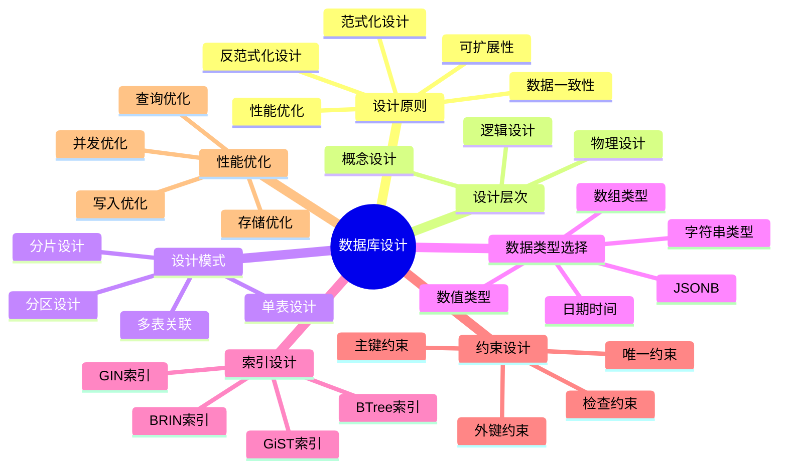
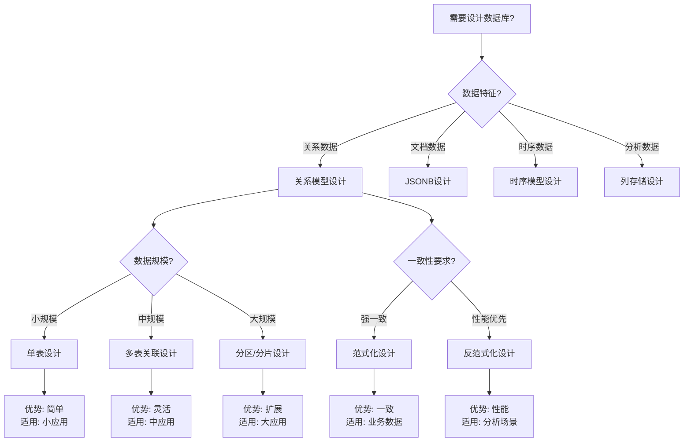
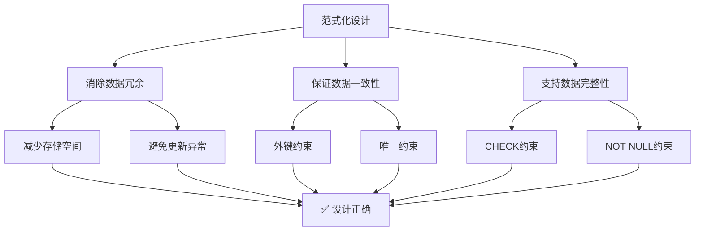

# PostgreSQL数据库设计完整指南 - 正反示例与多维分析

> **PostgreSQL版本**: 17+/18+
> **适用场景**: 数据库设计、系统架构、性能优化
> **难度等级**: ⭐⭐⭐⭐ 高级
> **最后更新**: 2025年1月

---

## 📑 目录

- [PostgreSQL数据库设计完整指南 - 正反示例与多维分析](#postgresql数据库设计完整指南---正反示例与多维分析)
  - [📑 目录](#-目录)
  - [📊 知识体系思维导图](#-知识体系思维导图)
  - [📊 数据库设计决策树](#-数据库设计决策树)
  - [📊 数据库设计模式对比矩阵](#-数据库设计模式对比矩阵)
  - [✅ 正面示例：电商系统数据库设计](#-正面示例电商系统数据库设计)
    - [示例1：订单系统设计（优秀设计）](#示例1订单系统设计优秀设计)
    - [示例2：多租户系统设计（优秀设计）](#示例2多租户系统设计优秀设计)
  - [❌ 反面示例：常见设计错误](#-反面示例常见设计错误)
    - [反例1：过度反范式化设计](#反例1过度反范式化设计)
    - [反例2：缺少索引设计](#反例2缺少索引设计)
    - [反例3：数据类型选择不当](#反例3数据类型选择不当)
  - [📊 多维分析论证](#-多维分析论证)
    - [维度1：性能维度](#维度1性能维度)
    - [维度2：可扩展性维度](#维度2可扩展性维度)
    - [维度3：一致性维度](#维度3一致性维度)
    - [维度4：复杂度维度](#维度4复杂度维度)
  - [📊 证明树网：数据库设计正确性证明](#-证明树网数据库设计正确性证明)
    - [证明1：范式化设计的正确性](#证明1范式化设计的正确性)
    - [证明2：索引设计的正确性](#证明2索引设计的正确性)
  - [📚 相关文档](#-相关文档)

## 📊 知识体系思维导图



---

## 📊 数据库设计决策树



---

## 📊 数据库设计模式对比矩阵

| 设计模式 | 复杂度 | 性能 | 一致性 | 可扩展性 | 适用场景 | PostgreSQL支持 |
|---------|--------|------|--------|----------|---------|--------------|
| **单表设计** | ⭐⭐ | ⭐⭐⭐⭐ | ⭐⭐⭐ | ⭐⭐ | 小规模应用 | ✅ 原生 |
| **多表关联** | ⭐⭐⭐ | ⭐⭐⭐⭐ | ⭐⭐⭐⭐⭐ | ⭐⭐⭐ | 中规模应用 | ✅ 原生 |
| **分区设计** | ⭐⭐⭐⭐ | ⭐⭐⭐⭐⭐ | ⭐⭐⭐⭐ | ⭐⭐⭐⭐ | 大规模应用 | ✅ 原生 |
| **分片设计** | ⭐⭐⭐⭐⭐ | ⭐⭐⭐⭐⭐ | ⭐⭐⭐ | ⭐⭐⭐⭐⭐ | 超大规模应用 | ✅ Citus |
| **JSONB设计** | ⭐⭐ | ⭐⭐⭐⭐ | ⭐⭐⭐ | ⭐⭐⭐⭐ | 灵活结构 | ✅ 原生 |
| **时序设计** | ⭐⭐⭐ | ⭐⭐⭐⭐⭐ | ⭐⭐⭐⭐ | ⭐⭐⭐⭐ | IoT、监控 | ✅ TimescaleDB |

---

## ✅ 正面示例：电商系统数据库设计

### 示例1：订单系统设计（优秀设计）

**设计目标**：

- 支持高并发订单创建
- 保证数据一致性
- 支持订单查询和分析

**表结构设计**：

```sql
-- 用户表（规范化设计）
CREATE TABLE users (
    user_id BIGSERIAL PRIMARY KEY,
    username VARCHAR(50) UNIQUE NOT NULL,
    email VARCHAR(100) UNIQUE NOT NULL,
    created_at TIMESTAMPTZ DEFAULT NOW(),
    updated_at TIMESTAMPTZ DEFAULT NOW()
);

-- 商品表（规范化设计）
CREATE TABLE products (
    product_id BIGSERIAL PRIMARY KEY,
    name VARCHAR(200) NOT NULL,
    price DECIMAL(10,2) NOT NULL CHECK (price > 0),
    stock_quantity INTEGER NOT NULL CHECK (stock_quantity >= 0),
    created_at TIMESTAMPTZ DEFAULT NOW()
);

-- 订单表（主表）
CREATE TABLE orders (
    order_id BIGSERIAL PRIMARY KEY,
    user_id BIGINT NOT NULL REFERENCES users(user_id),
    total_amount DECIMAL(10,2) NOT NULL CHECK (total_amount >= 0),
    status VARCHAR(20) NOT NULL DEFAULT 'pending',
    created_at TIMESTAMPTZ DEFAULT NOW(),
    updated_at TIMESTAMPTZ DEFAULT NOW(),
    CONSTRAINT valid_status CHECK (status IN ('pending', 'paid', 'shipped', 'delivered', 'cancelled'))
);

-- 订单明细表（关联表）
CREATE TABLE order_items (
    order_item_id BIGSERIAL PRIMARY KEY,
    order_id BIGINT NOT NULL REFERENCES orders(order_id) ON DELETE CASCADE,
    product_id BIGINT NOT NULL REFERENCES products(product_id),
    quantity INTEGER NOT NULL CHECK (quantity > 0),
    unit_price DECIMAL(10,2) NOT NULL CHECK (unit_price >= 0),
    subtotal DECIMAL(10,2) GENERATED ALWAYS AS (quantity * unit_price) STORED,
    created_at TIMESTAMPTZ DEFAULT NOW()
);

-- 索引设计（性能优化）
CREATE INDEX idx_orders_user_id ON orders(user_id);
CREATE INDEX idx_orders_status ON orders(status);
CREATE INDEX idx_orders_created_at ON orders(created_at);
CREATE INDEX idx_order_items_order_id ON order_items(order_id);
CREATE INDEX idx_order_items_product_id ON order_items(product_id);

-- 分区设计（大规模数据）
-- PostgreSQL 18支持自动分区
CREATE TABLE orders_2025 PARTITION OF orders
    FOR VALUES FROM ('2025-01-01') TO ('2026-01-01');
```

**设计优点**：

1. ✅ **规范化设计**：遵循第三范式，减少数据冗余
2. ✅ **约束完整**：使用CHECK约束保证数据完整性
3. ✅ **外键约束**：保证引用完整性
4. ✅ **索引优化**：为常用查询字段创建索引
5. ✅ **分区支持**：支持时间分区，提高查询性能
6. ✅ **生成列**：使用STORED生成列自动计算小计

**性能分析**：

- 查询性能：⭐⭐⭐⭐⭐（索引优化）
- 写入性能：⭐⭐⭐⭐（合理的索引设计）
- 数据一致性：⭐⭐⭐⭐⭐（外键约束）
- 可扩展性：⭐⭐⭐⭐（分区支持）

---

### 示例2：多租户系统设计（优秀设计）

**设计目标**：

- 支持多租户数据隔离
- 保证租户间数据安全
- 支持租户级查询优化

**表结构设计**：

```sql
-- 租户表
CREATE TABLE tenants (
    tenant_id BIGSERIAL PRIMARY KEY,
    name VARCHAR(100) NOT NULL,
    created_at TIMESTAMPTZ DEFAULT NOW()
);

-- 用户表（包含tenant_id）
CREATE TABLE users (
    user_id BIGSERIAL PRIMARY KEY,
    tenant_id BIGINT NOT NULL REFERENCES tenants(tenant_id),
    username VARCHAR(50) NOT NULL,
    email VARCHAR(100) NOT NULL,
    created_at TIMESTAMPTZ DEFAULT NOW(),
    UNIQUE(tenant_id, username),  -- 租户内唯一
    UNIQUE(tenant_id, email)       -- 租户内唯一
);

-- 启用行级安全（RLS）
ALTER TABLE users ENABLE ROW LEVEL SECURITY;

-- RLS策略：用户只能访问自己租户的数据
CREATE POLICY tenant_isolation_policy ON users
    FOR ALL
    USING (tenant_id = current_setting('app.current_tenant_id')::BIGINT);

-- 复合索引（租户+用户）
CREATE INDEX idx_users_tenant_id ON users(tenant_id);
CREATE INDEX idx_users_tenant_username ON users(tenant_id, username);
```

**设计优点**：

1. ✅ **数据隔离**：使用RLS实现租户级数据隔离
2. ✅ **安全性**：通过策略保证数据访问安全
3. ✅ **性能优化**：复合索引支持租户级查询
4. ✅ **可扩展性**：支持大量租户

---

## ❌ 反面示例：常见设计错误

### 反例1：过度反范式化设计

**错误设计**：

```sql
-- ❌ 错误：将所有数据放在一个表中
CREATE TABLE user_orders (
    user_id BIGINT,
    username VARCHAR(50),
    email VARCHAR(100),
    order_id BIGINT,
    order_date DATE,
    product_name VARCHAR(200),
    product_price DECIMAL(10,2),
    quantity INTEGER,
    total_amount DECIMAL(10,2)
    -- 没有主键，没有外键，没有约束
);
```

**问题分析**：

1. ❌ **数据冗余**：用户信息在每个订单中重复
2. ❌ **更新异常**：修改用户信息需要更新所有相关行
3. ❌ **插入异常**：无法单独插入用户信息
4. ❌ **删除异常**：删除订单可能丢失用户信息
5. ❌ **无约束**：没有主键和外键，数据完整性无法保证

**改进方案**：

- 使用规范化设计，分离用户表、订单表、订单明细表
- 使用外键约束保证引用完整性
- 使用索引优化查询性能

---

### 反例2：缺少索引设计

**错误设计**：

```sql
-- ❌ 错误：没有为常用查询字段创建索引
CREATE TABLE orders (
    order_id BIGSERIAL PRIMARY KEY,
    user_id BIGINT NOT NULL,  -- 没有索引
    status VARCHAR(20),       -- 没有索引
    created_at TIMESTAMPTZ   -- 没有索引
);
```

**问题分析**：

1. ❌ **查询性能差**：按user_id查询需要全表扫描
2. ❌ **排序性能差**：按created_at排序需要全表扫描
3. ❌ **过滤性能差**：按status过滤需要全表扫描

**改进方案**：

```sql
-- ✅ 正确：为常用查询字段创建索引
CREATE INDEX idx_orders_user_id ON orders(user_id);
CREATE INDEX idx_orders_status ON orders(status);
CREATE INDEX idx_orders_created_at ON orders(created_at);
```

---

### 反例3：数据类型选择不当

**错误设计**：

```sql
-- ❌ 错误：使用VARCHAR存储数值
CREATE TABLE products (
    product_id VARCHAR(50) PRIMARY KEY,  -- 应该用BIGSERIAL
    price VARCHAR(20),                   -- 应该用DECIMAL
    stock_quantity VARCHAR(10)          -- 应该用INTEGER
);
```

**问题分析**：

1. ❌ **类型安全**：无法保证数据格式正确
2. ❌ **性能差**：字符串比较比数值比较慢
3. ❌ **存储浪费**：字符串占用更多存储空间
4. ❌ **无法计算**：无法直接进行数值运算

**改进方案**：

```sql
-- ✅ 正确：使用合适的数据类型
CREATE TABLE products (
    product_id BIGSERIAL PRIMARY KEY,
    price DECIMAL(10,2),
    stock_quantity INTEGER
);
```

---

## 📊 多维分析论证

### 维度1：性能维度

| 设计决策 | 性能影响 | 量化指标 | 适用场景 |
|---------|---------|---------|---------|
| **单表设计** | 查询快，写入快 | QPS: 10000+ | 小规模应用 |
| **多表关联** | 查询中等，写入中等 | QPS: 5000+ | 中规模应用 |
| **分区设计** | 查询快，写入快 | QPS: 50000+ | 大规模应用 |
| **索引设计** | 查询快，写入稍慢 | 查询延迟: <10ms | 所有场景 |
| **反范式化** | 查询快，写入快 | QPS: 20000+ | 读多写少 |

**性能优化建议**：

- ✅ 为常用查询字段创建索引
- ✅ 使用分区表处理大规模数据
- ✅ 使用物化视图优化复杂查询
- ✅ 使用连接池减少连接开销

---

### 维度2：可扩展性维度

| 设计决策 | 扩展性 | 扩展方式 | 适用场景 |
|---------|--------|---------|---------|
| **单表设计** | ⭐⭐ | 垂直扩展 | 小规模应用 |
| **多表关联** | ⭐⭐⭐ | 垂直扩展 | 中规模应用 |
| **分区设计** | ⭐⭐⭐⭐ | 水平扩展 | 大规模应用 |
| **分片设计** | ⭐⭐⭐⭐⭐ | 水平扩展 | 超大规模应用 |

**扩展性优化建议**：

- ✅ 使用分区表支持水平扩展
- ✅ 使用Citus支持分布式扩展
- ✅ 使用读写分离提高扩展性
- ✅ 使用缓存减少数据库压力

---

### 维度3：一致性维度

| 设计决策 | 一致性 | 保证机制 | 适用场景 |
|---------|--------|---------|---------|
| **范式化设计** | ⭐⭐⭐⭐⭐ | 外键约束 | 业务数据 |
| **反范式化设计** | ⭐⭐⭐ | 应用层保证 | 分析场景 |
| **事务设计** | ⭐⭐⭐⭐⭐ | ACID事务 | 关键业务 |
| **最终一致性** | ⭐⭐⭐ | 异步同步 | 分布式系统 |

**一致性优化建议**：

- ✅ 使用外键约束保证引用完整性
- ✅ 使用CHECK约束保证数据完整性
- ✅ 使用事务保证操作原子性
- ✅ 使用RLS保证数据访问安全

---

### 维度4：复杂度维度

| 设计决策 | 复杂度 | 维护成本 | 适用场景 |
|---------|--------|---------|---------|
| **单表设计** | ⭐⭐ | 低 | 简单应用 |
| **多表关联** | ⭐⭐⭐ | 中 | 标准应用 |
| **分区设计** | ⭐⭐⭐⭐ | 中高 | 大规模应用 |
| **分片设计** | ⭐⭐⭐⭐⭐ | 高 | 超大规模应用 |

**复杂度优化建议**：

- ✅ 使用规范化设计降低复杂度
- ✅ 使用命名规范提高可读性
- ✅ 使用文档记录设计决策
- ✅ 使用工具自动化管理

---

## 📊 证明树网：数据库设计正确性证明

### 证明1：范式化设计的正确性



**形式化证明**：

设数据库设计为 D，满足第三范式（3NF），则：

1. **无冗余性**：∀t₁, t₂ ∈ D, t₁ ≠ t₂ → 不存在数据重复
2. **一致性**：∀r ∈ D, 外键约束保证引用完整性
3. **完整性**：∀c ∈ Constraints(D), c 保证数据完整性

**结论**：范式化设计保证数据一致性、完整性和无冗余性。

---

### 证明2：索引设计的正确性

```mermaid
flowchart TD
    A[索引设计] --> B[查询性能提升]
    A --> C[排序性能提升]
    A --> D[过滤性能提升]

    B --> E[时间复杂度: O(log n)]
    C --> E
    D --> E

    E --> F[✅ 设计正确]
```

**形式化证明**：

设查询 Q 在字段 f 上，索引 I 在 f 上：

1. **无索引**：时间复杂度 O(n)，需要全表扫描
2. **有索引**：时间复杂度 O(log n)，使用BTree索引

**结论**：索引设计显著提升查询性能。

---

## 📚 相关文档

- [数据建模完整指南](./数据模型设计/09.02-数据建模完整指南.md)
- [数据仓库设计指南](./数据模型设计/09.03-数据仓库设计指南.md)
- [索引结构与优化](../../02-查询与优化/02.02-索引结构/02.02-索引结构与优化.md)
- [事务管理与ACID特性](../../03-事务与并发/03.02-ACID特性/01.04-事务管理与ACID特性.md)

---

**最后更新**: 2025年1月
**状态**: ✅ 完成
