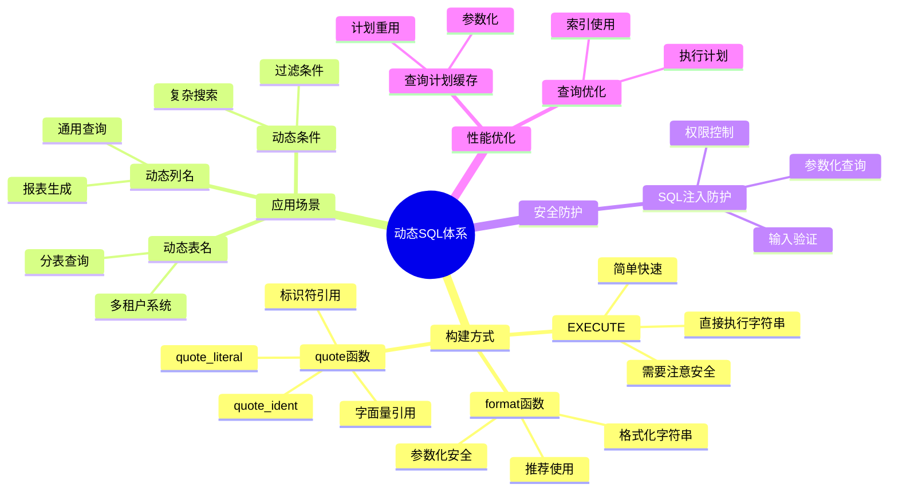
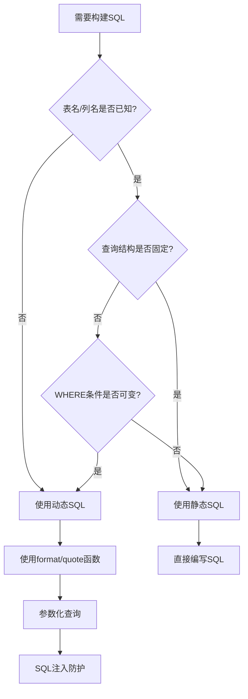
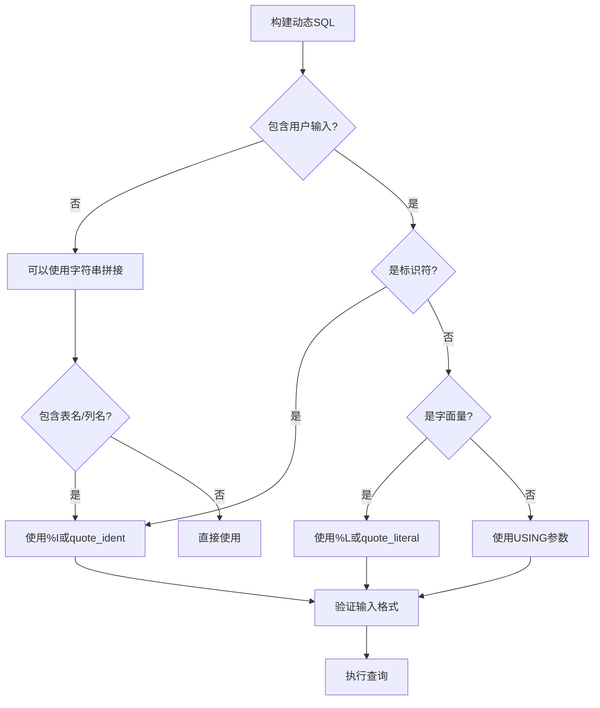
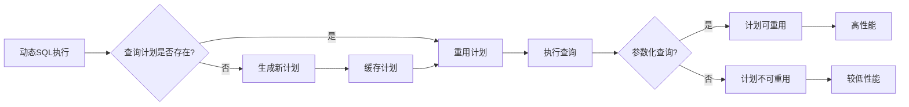

# PostgreSQL查询函数与动态SQL完整指南

## 元数据

- **文档版本**: v2.0
- **创建日期**: 2025-01
- **技术栈**: PostgreSQL 17+/18+ | PL/pgSQL | 动态SQL | 查询函数
- **难度级别**: ⭐⭐⭐⭐⭐ (专家级)
- **预计阅读**: 160分钟
- **前置要求**: 熟悉PostgreSQL基础、PL/pgSQL基础、SQL基础

---

## 📋 完整目录

- [PostgreSQL查询函数与动态SQL完整指南](#postgresql查询函数与动态sql完整指南)
  - [元数据](#元数据)
  - [📋 完整目录](#-完整目录)
  - [1. 动态SQL概述](#1-动态sql概述)
    - [1.1 动态SQL概念](#11-动态sql概念)
      - [核心概念](#核心概念)
      - [动态SQL体系思维导图](#动态sql体系思维导图)
    - [1.2 动态SQL vs 静态SQL](#12-动态sql-vs-静态sql)
      - [对比矩阵](#对比矩阵)
      - [决策图网：选择静态SQL还是动态SQL](#决策图网选择静态sql还是动态sql)
    - [1.3 动态SQL应用场景](#13-动态sql应用场景)
      - [应用场景分类](#应用场景分类)
  - [2. 动态SQL基础](#2-动态sql基础)
    - [2.1 EXECUTE语句](#21-execute语句)
      - [基本用法](#基本用法)
      - [带参数的EXECUTE](#带参数的execute)
    - [2.2 format函数](#22-format函数)
      - [format函数用法](#format函数用法)
      - [format函数格式化选项](#format函数格式化选项)
      - [安全构建动态查询](#安全构建动态查询)
    - [2.3 quote\_ident和quote\_literal](#23-quote_ident和quote_literal)
      - [quote函数详解](#quote函数详解)
    - [2.4 SQL注入防护](#24-sql注入防护)
      - [SQL注入风险对比矩阵](#sql注入风险对比矩阵)
      - [SQL注入防护决策图](#sql注入防护决策图)
      - [安全示例对比](#安全示例对比)
  - [3. 查询函数](#3-查询函数)
    - [3.1 返回表的函数](#31-返回表的函数)
      - [RETURNS TABLE](#returns-table)
      - [动态返回表结构](#动态返回表结构)
    - [3.2 返回集合的函数](#32-返回集合的函数)
      - [RETURNS SETOF](#returns-setof)
    - [3.3 动态查询构建](#33-动态查询构建)
      - [通用查询构建器](#通用查询构建器)
  - [4. 查询结果处理](#4-查询结果处理)
    - [4.1 游标处理](#41-游标处理)
      - [使用游标处理动态查询结果](#使用游标处理动态查询结果)
    - [4.2 FOR循环处理](#42-for循环处理)
      - [FOR循环处理动态查询](#for循环处理动态查询)
  - [5. 动态表名和列名](#5-动态表名和列名)
    - [5.1 动态表名处理](#51-动态表名处理)
      - [安全处理动态表名](#安全处理动态表名)
    - [5.2 动态列名处理](#52-动态列名处理)
      - [安全处理动态列名](#安全处理动态列名)
  - [6. 查询计划缓存](#6-查询计划缓存)
    - [6.1 计划缓存机制](#61-计划缓存机制)
      - [查询计划缓存概念图](#查询计划缓存概念图)
      - [计划缓存优化](#计划缓存优化)
  - [7. 性能优化](#7-性能优化)
    - [7.1 动态SQL性能优化](#71-动态sql性能优化)
      - [性能优化决策矩阵](#性能优化决策矩阵)
      - [性能优化最佳实践](#性能优化最佳实践)
  - [8. 实战案例](#8-实战案例)
    - [8.1 通用查询构建器](#81-通用查询构建器)
      - [完整实现](#完整实现)
  - [📚 参考资源](#-参考资源)
  - [📝 更新日志](#-更新日志)

---

## 1. 动态SQL概述

### 1.1 动态SQL概念

#### 核心概念

```text
动态SQL（Dynamic SQL）:
- 在运行时构建和执行SQL语句
- 使用EXECUTE语句执行动态构建的SQL
- 适用于表名、列名、条件等在运行时确定的情况
- 需要特别注意SQL注入防护
```

#### 动态SQL体系思维导图



### 1.2 动态SQL vs 静态SQL

#### 对比矩阵

| 维度 | 静态SQL | 动态SQL |
| --- | --- | --- |
| **构建时机** | 编译时 | 运行时 |
| **性能** | 高（计划缓存） | 中等（需要重新规划） |
| **安全性** | 高（无注入风险） | 中等（需要防护） |
| **灵活性** | 低（固定结构） | 高（可动态构建） |
| **适用场景** | 固定查询 | 动态查询、通用查询 |
| **表名/列名** | 必须已知 | 可以动态 |
| **WHERE条件** | 固定结构 | 可动态构建 |
| **维护性** | 高 | 中等 |
| **调试难度** | 低 | 中等 |

#### 决策图网：选择静态SQL还是动态SQL



### 1.3 动态SQL应用场景

#### 应用场景分类

```text
场景1: 通用查询构建器
- 用户自定义查询条件
- 动态选择表名和列名
- 构建复杂WHERE子句

场景2: 报表生成系统
- 动态选择数据源
- 动态选择统计维度
- 动态构建聚合查询

场景3: 多租户系统
- 按租户分表
- 动态选择租户表
- 统一查询接口

场景4: 数据库管理工具
- 动态DDL操作
- 表结构查询
- 数据迁移脚本
```

---

## 2. 动态SQL基础

### 2.1 EXECUTE语句

#### 基本用法

```sql
-- 基本的EXECUTE语句
CREATE OR REPLACE FUNCTION execute_dynamic_query(query_text TEXT)
RETURNS VOID
LANGUAGE plpgsql
AS $$
BEGIN
    EXECUTE query_text;
END;
$$;

-- 使用示例
SELECT execute_dynamic_query('SELECT * FROM users LIMIT 10');
```

#### 带参数的EXECUTE

```sql
-- 使用USING子句传递参数（带完整错误处理和安全验证）
CREATE OR REPLACE FUNCTION update_user_dynamic(
    p_user_id INTEGER,
    p_column_name TEXT,
    p_new_value TEXT
)
RETURNS VOID
LANGUAGE plpgsql
AS $$
DECLARE
    v_query TEXT;
    v_allowed_columns TEXT[] := ARRAY['name', 'email', 'phone', 'display_name'];
BEGIN
    -- 参数验证
    IF p_user_id IS NULL OR p_user_id <= 0 THEN
        RAISE EXCEPTION '用户ID无效: %', p_user_id;
    END IF;

    IF p_column_name IS NULL OR length(trim(p_column_name)) = 0 THEN
        RAISE EXCEPTION '列名不能为空';
    END IF;

    IF p_new_value IS NULL THEN
        RAISE EXCEPTION '新值不能为空';
    END IF;

    -- 验证列名格式（防止SQL注入）
    IF p_column_name !~ '^[a-zA-Z_][a-zA-Z0-9_]*$' THEN
        RAISE EXCEPTION '列名格式无效: %', p_column_name;
    END IF;

    -- 白名单验证：只允许更新指定列（增强安全性）
    IF NOT (p_column_name = ANY(v_allowed_columns)) THEN
        RAISE EXCEPTION '不允许更新列: % (允许的列: %)', p_column_name, array_to_string(v_allowed_columns, ', ');
    END IF;

    -- 检查表是否存在
    IF NOT EXISTS (SELECT 1 FROM information_schema.tables WHERE table_schema = 'public' AND table_name = 'users') THEN
        RAISE EXCEPTION 'users表不存在';
    END IF;

    -- 检查列是否存在
    IF NOT EXISTS (
        SELECT 1 FROM information_schema.columns
        WHERE table_schema = 'public'
          AND table_name = 'users'
          AND column_name = p_column_name
    ) THEN
        RAISE EXCEPTION '列不存在: users.%', p_column_name;
    END IF;

    -- 使用format和quote_ident安全构建查询
    BEGIN
        v_query := format(
            'UPDATE users SET %I = $1 WHERE id = $2',
            p_column_name
        );

        EXECUTE v_query USING p_new_value, p_user_id;

        IF NOT FOUND THEN
            RAISE WARNING '用户不存在或未更新: user_id=%', p_user_id;
        ELSE
            RAISE NOTICE '更新成功: users.% = % (user_id=%)', p_column_name, p_new_value, p_user_id;
        END IF;
    EXCEPTION
        WHEN undefined_table THEN
            RAISE EXCEPTION 'users表不存在';
        WHEN undefined_column THEN
            RAISE EXCEPTION '列不存在: %', p_column_name;
        WHEN OTHERS THEN
            RAISE EXCEPTION '更新失败: %', SQLERRM;
    END;
EXCEPTION
    WHEN OTHERS THEN
        RAISE EXCEPTION 'update_user_dynamic执行失败: %', SQLERRM;
END;
$$;
```

### 2.2 format函数

#### format函数用法

```sql
-- format函数基本用法
CREATE OR REPLACE FUNCTION format_example()
RETURNS TEXT
LANGUAGE plpgsql
AS $$
DECLARE
    v_result TEXT;
BEGIN
    -- %I: 标识符（自动加引号）
    -- %L: 字面量（自动转义）
    -- %s: 字符串（简单替换）

    v_result := format('SELECT * FROM %I WHERE name = %L', 'users', 'John');
    -- 结果: SELECT * FROM "users" WHERE name = 'John'

    RETURN v_result;
END;
$$;
```

#### format函数格式化选项

```text
格式化选项说明:

%s - 字符串替换（不安全，不推荐用于标识符）
%I - 标识符引用（安全，自动加引号）
%L - 字面量引用（安全，自动转义）
%T - 类型名引用
```

#### 安全构建动态查询

```sql
-- 安全构建动态查询
CREATE OR REPLACE FUNCTION safe_dynamic_query(
    table_name TEXT,
    column_name TEXT,
    filter_value TEXT
)
RETURNS TABLE(id INTEGER, name TEXT)
LANGUAGE plpgsql
AS $$
DECLARE
    v_query TEXT;
BEGIN
    -- 使用%I和%L确保安全
    v_query := format(
        'SELECT id, name FROM %I WHERE %I = %L',
        table_name,
        column_name,
        filter_value
    );

    RETURN QUERY EXECUTE v_query;
END;
$$;
```

### 2.3 quote_ident和quote_literal

#### quote函数详解

```sql
-- quote_ident: 引用标识符
CREATE OR REPLACE FUNCTION quote_ident_example()
RETURNS TEXT
LANGUAGE plpgsql
AS $$
BEGIN
    -- quote_ident('users') -> "users"
    -- quote_ident('user name') -> "user name"
    RETURN quote_ident('users');
END;
$$;

-- quote_literal: 引用字面量
CREATE OR REPLACE FUNCTION quote_literal_example()
RETURNS TEXT
LANGUAGE plpgsql
AS $$
BEGIN
    -- quote_literal('John') -> 'John'
    -- quote_literal('O''Brien') -> 'O''Brien'
    RETURN quote_literal('John');
END;
$$;

-- quote_nullable: 处理NULL值
CREATE OR REPLACE FUNCTION quote_nullable_example(value TEXT)
RETURNS TEXT
LANGUAGE plpgsql
AS $$
BEGIN
    -- 如果value为NULL，返回'NULL'，否则返回引用的字面量
    RETURN quote_nullable(value);
END;
$$;
```

### 2.4 SQL注入防护

#### SQL注入风险对比矩阵

| 方法 | 安全性 | 示例 | 风险等级 |
| --- | --- | --- | --- |
| **字符串拼接** | ❌ 不安全 | `'SELECT * FROM ' \|\| table_name` | 🔴 高危 |
| **%s格式化** | ⚠️ 较不安全 | `format('SELECT * FROM %s', table_name)` | 🟡 中危 |
| **%I格式化** | ✅ 安全 | `format('SELECT * FROM %I', table_name)` | 🟢 安全 |
| **USING参数** | ✅ 安全 | `EXECUTE query USING param1, param2` | 🟢 安全 |
| **quote_ident** | ✅ 安全 | `quote_ident(table_name)` | 🟢 安全 |

#### SQL注入防护决策图



#### 安全示例对比

```sql
-- ❌ 不安全：字符串拼接
CREATE OR REPLACE FUNCTION unsafe_query(user_input TEXT)
RETURNS TABLE(id INTEGER)
LANGUAGE plpgsql
AS $$
DECLARE
    v_query TEXT;
BEGIN
    -- 危险：容易SQL注入
    v_query := 'SELECT id FROM users WHERE name = ''' || user_input || '''';
    RETURN QUERY EXECUTE v_query;
END;
$$;

-- ✅ 安全：使用format和%L（带完整错误处理）
CREATE OR REPLACE FUNCTION safe_query(p_user_input TEXT)
RETURNS TABLE(id INTEGER)
LANGUAGE plpgsql
AS $$
DECLARE
    v_query TEXT;
BEGIN
    -- 参数验证
    IF p_user_input IS NULL OR length(trim(p_user_input)) = 0 THEN
        RAISE EXCEPTION '用户输入不能为空';
    END IF;

    -- 检查输入长度（防止DoS攻击）
    IF length(p_user_input) > 1000 THEN
        RAISE EXCEPTION '输入过长: % (最大1000字符)', length(p_user_input);
    END IF;

    -- 检查表是否存在
    IF NOT EXISTS (SELECT 1 FROM information_schema.tables WHERE table_schema = 'public' AND table_name = 'users') THEN
        RAISE EXCEPTION 'users表不存在';
    END IF;

    -- 安全：%L自动转义（防止SQL注入）
    BEGIN
        v_query := format('SELECT id FROM users WHERE name = %L', trim(p_user_input));
        RETURN QUERY EXECUTE v_query;
    EXCEPTION
        WHEN undefined_table THEN
            RAISE EXCEPTION 'users表不存在';
        WHEN syntax_error THEN
            RAISE EXCEPTION 'SQL语法错误';
        WHEN OTHERS THEN
            RAISE EXCEPTION '查询失败: %', SQLERRM;
    END;
EXCEPTION
    WHEN OTHERS THEN
        RAISE EXCEPTION 'safe_query执行失败: %', SQLERRM;
END;
$$;

-- ✅ 最安全：使用USING参数（带完整错误处理）
CREATE OR REPLACE FUNCTION safest_query(p_user_input TEXT)
RETURNS TABLE(id INTEGER)
LANGUAGE plpgsql
AS $$
DECLARE
    v_query TEXT;
BEGIN
    -- 参数验证
    IF p_user_input IS NULL OR length(trim(p_user_input)) = 0 THEN
        RAISE EXCEPTION '用户输入不能为空';
    END IF;

    -- 检查输入长度（防止DoS攻击）
    IF length(p_user_input) > 1000 THEN
        RAISE EXCEPTION '输入过长: % (最大1000字符)', length(p_user_input);
    END IF;

    -- 检查表是否存在
    IF NOT EXISTS (SELECT 1 FROM information_schema.tables WHERE table_schema = 'public' AND table_name = 'users') THEN
        RAISE EXCEPTION 'users表不存在';
    END IF;

    -- 最安全：使用USING参数（完全防止SQL注入）
    BEGIN
        v_query := 'SELECT id FROM users WHERE name = $1';
        RETURN QUERY EXECUTE v_query USING trim(p_user_input);
    EXCEPTION
        WHEN undefined_table THEN
            RAISE EXCEPTION 'users表不存在';
        WHEN syntax_error THEN
            RAISE EXCEPTION 'SQL语法错误';
        WHEN OTHERS THEN
            RAISE EXCEPTION '查询失败: %', SQLERRM;
    END;
EXCEPTION
    WHEN OTHERS THEN
        RAISE EXCEPTION 'safest_query执行失败: %', SQLERRM;
END;
$$;
```

---

## 3. 查询函数

### 3.1 返回表的函数

#### RETURNS TABLE

```sql
-- 返回表的函数
CREATE OR REPLACE FUNCTION get_users_by_age(
    min_age INTEGER,
    max_age INTEGER
)
RETURNS TABLE(
    id INTEGER,
    name TEXT,
    age INTEGER,
    email TEXT
)
LANGUAGE plpgsql
AS $$
BEGIN
    RETURN QUERY
    SELECT u.id, u.name, u.age, u.email
    FROM users u
    WHERE u.age BETWEEN min_age AND max_age
    ORDER BY u.age;
END;
$$;

-- 使用示例
SELECT * FROM get_users_by_age(25, 35);
```

#### 动态返回表结构

```sql
-- 动态构建返回表的查询
CREATE OR REPLACE FUNCTION dynamic_table_query(
    table_name TEXT,
    where_condition TEXT DEFAULT '1=1'
)
RETURNS TABLE(result JSONB)
LANGUAGE plpgsql
AS $$
DECLARE
    v_query TEXT;
    v_record RECORD;
BEGIN
    -- 构建查询（注意：需要知道表结构）
    v_query := format(
        'SELECT to_jsonb(t.*) FROM %I t WHERE %s',
        table_name,
        where_condition
    );

    FOR v_record IN EXECUTE v_query
    LOOP
        RETURN NEXT v_record;
    END LOOP;

    RETURN;
END;
$$;
```

### 3.2 返回集合的函数

#### RETURNS SETOF

```sql
-- 返回集合的函数
CREATE OR REPLACE FUNCTION generate_numbers(
    start_num INTEGER,
    end_num INTEGER
)
RETURNS SETOF INTEGER
LANGUAGE plpgsql
AS $$
DECLARE
    i INTEGER;
BEGIN
    FOR i IN start_num..end_num
    LOOP
        RETURN NEXT i;
    END LOOP;

    RETURN;
END;
$$;

-- 使用示例
SELECT * FROM generate_numbers(1, 10);
```

### 3.3 动态查询构建

#### 通用查询构建器

```sql
-- 通用查询构建器
CREATE OR REPLACE FUNCTION build_dynamic_query(
    p_table_name TEXT,
    p_columns TEXT[],
    p_filters JSONB DEFAULT '{}'::JSONB,
    p_order_by TEXT DEFAULT NULL,
    p_limit INTEGER DEFAULT NULL
)
RETURNS TABLE(result JSONB)
LANGUAGE plpgsql
AS $$
DECLARE
    v_query TEXT;
    v_select_list TEXT;
    v_where_clause TEXT := '';
    v_key TEXT;
    v_value TEXT;
    v_filter TEXT;
BEGIN
    -- 构建SELECT列表
    IF p_columns IS NULL OR array_length(p_columns, 1) IS NULL THEN
        v_select_list := '*';
    ELSE
        SELECT string_agg(quote_ident(col), ', ')
        INTO v_select_list
        FROM unnest(p_columns) AS col;
    END IF;

    -- 构建WHERE子句
    IF p_filters IS NOT NULL AND p_filters != '{}'::JSONB THEN
        SELECT string_agg(
            format('%I = %L', key, value::TEXT),
            ' AND '
        )
        INTO v_where_clause
        FROM jsonb_each_text(p_filters) AS t(key, value);
    END IF;

    -- 构建完整查询
    v_query := format('SELECT to_jsonb(t.*) FROM %I t', p_table_name);

    IF v_where_clause != '' THEN
        v_query := v_query || format(' WHERE %s', v_where_clause);
    END IF;

    IF p_order_by IS NOT NULL THEN
        v_query := v_query || format(' ORDER BY %s', p_order_by);
    END IF;

    IF p_limit IS NOT NULL THEN
        v_query := v_query || format(' LIMIT %s', p_limit);
    END IF;

    -- 执行查询
    RETURN QUERY EXECUTE v_query;
END;
$$;

-- 使用示例
SELECT * FROM build_dynamic_query(
    'users',
    ARRAY['id', 'name', 'email'],
    '{"age": 30}'::JSONB,
    'name',
    10
);
```

---

## 4. 查询结果处理

### 4.1 游标处理

#### 使用游标处理动态查询结果

```sql
-- 使用游标处理动态查询
CREATE OR REPLACE FUNCTION process_dynamic_cursor(
    query_text TEXT
)
RETURNS TABLE(
    row_num INTEGER,
    row_data JSONB
)
LANGUAGE plpgsql
AS $$
DECLARE
    v_cursor REFCURSOR;
    v_record RECORD;
    v_row_num INTEGER := 0;
BEGIN
    -- 打开游标
    OPEN v_cursor FOR EXECUTE query_text;

    LOOP
        FETCH v_cursor INTO v_record;
        EXIT WHEN NOT FOUND;

        v_row_num := v_row_num + 1;

        -- 转换为JSONB返回
        RETURN NEXT (
            v_row_num,
            to_jsonb(v_record)
        );
    END LOOP;

    CLOSE v_cursor;

    RETURN;
END;
$$;
```

### 4.2 FOR循环处理

#### FOR循环处理动态查询

```sql
-- 使用FOR循环处理动态查询结果
CREATE OR REPLACE FUNCTION process_dynamic_for_loop(
    query_text TEXT
)
RETURNS INTEGER
LANGUAGE plpgsql
AS $$
DECLARE
    v_record RECORD;
    v_count INTEGER := 0;
BEGIN
    FOR v_record IN EXECUTE query_text
    LOOP
        -- 处理每条记录
        v_count := v_count + 1;

        -- 可以在这里添加业务逻辑
        -- 例如：插入到其他表、更新数据等
    END LOOP;

    RETURN v_count;
END;
$$;
```

---

## 5. 动态表名和列名

### 5.1 动态表名处理

#### 安全处理动态表名

```sql
-- 安全处理动态表名（带完整错误处理和安全验证）
CREATE OR REPLACE FUNCTION query_dynamic_table(
    p_table_name TEXT,
    p_limit_count INTEGER DEFAULT 100
)
RETURNS TABLE(result JSONB)
LANGUAGE plpgsql
AS $$
DECLARE
    v_query TEXT;
    v_allowed_tables TEXT[] := ARRAY['users', 'orders', 'products', 'categories'];
BEGIN
    -- 参数验证
    IF p_table_name IS NULL OR length(trim(p_table_name)) = 0 THEN
        RAISE EXCEPTION '表名不能为空';
    END IF;

    IF p_limit_count IS NULL OR p_limit_count <= 0 THEN
        RAISE EXCEPTION '限制数量无效: % (必须大于0)', p_limit_count;
    END IF;

    IF p_limit_count > 10000 THEN
        RAISE EXCEPTION '限制数量过大: % (最大10000)', p_limit_count;
    END IF;

    -- 验证表名格式（只允许字母、数字、下划线）
    IF p_table_name !~ '^[a-zA-Z_][a-zA-Z0-9_]*$' THEN
        RAISE EXCEPTION '表名格式无效: % (只允许字母、数字、下划线)', p_table_name;
    END IF;

    -- 白名单验证：只允许查询指定表（增强安全性）
    IF NOT (p_table_name = ANY(v_allowed_tables)) THEN
        RAISE EXCEPTION '不允许查询表: % (允许的表: %)', p_table_name, array_to_string(v_allowed_tables, ', ');
    END IF;

    -- 检查表是否存在
    IF NOT EXISTS (
        SELECT 1 FROM information_schema.tables
        WHERE table_schema = 'public'
          AND table_name = p_table_name
    ) THEN
        RAISE EXCEPTION '表不存在: %', p_table_name;
    END IF;

    -- 安全构建查询
    BEGIN
        v_query := format(
            'SELECT to_jsonb(t.*) FROM %I t LIMIT %s',
            p_table_name,
            p_limit_count
        );

        RETURN QUERY EXECUTE v_query;
    EXCEPTION
        WHEN undefined_table THEN
            RAISE EXCEPTION '表不存在: %', p_table_name;
        WHEN syntax_error THEN
            RAISE EXCEPTION 'SQL语法错误: %', SQLERRM;
        WHEN OTHERS THEN
            RAISE EXCEPTION '查询失败: %', SQLERRM;
    END;
EXCEPTION
    WHEN OTHERS THEN
        RAISE EXCEPTION 'query_dynamic_table执行失败: %', SQLERRM;
END;
$$;
```

### 5.2 动态列名处理

#### 安全处理动态列名

```sql
-- 安全处理动态列名（带完整错误处理和安全验证）
CREATE OR REPLACE FUNCTION query_dynamic_columns(
    p_table_name TEXT,
    p_column_names TEXT[]
)
RETURNS TABLE(result JSONB)
LANGUAGE plpgsql
AS $$
DECLARE
    v_query TEXT;
    v_column_list TEXT;
    v_col TEXT;
    v_valid_columns TEXT[];
    v_allowed_columns TEXT[];
BEGIN
    -- 参数验证
    IF p_table_name IS NULL OR length(trim(p_table_name)) = 0 THEN
        RAISE EXCEPTION '表名不能为空';
    END IF;

    IF p_column_names IS NULL OR array_length(p_column_names, 1) IS NULL OR array_length(p_column_names, 1) = 0 THEN
        RAISE EXCEPTION '列名数组不能为空';
    END IF;

    IF array_length(p_column_names, 1) > 50 THEN
        RAISE EXCEPTION '列数量过多: % (最大50个)', array_length(p_column_names, 1);
    END IF;

    -- 验证表名格式
    IF p_table_name !~ '^[a-zA-Z_][a-zA-Z0-9_]*$' THEN
        RAISE EXCEPTION '表名格式无效: %', p_table_name;
    END IF;

    -- 检查表是否存在
    IF NOT EXISTS (
        SELECT 1 FROM information_schema.tables
        WHERE table_schema = 'public'
          AND table_name = p_table_name
    ) THEN
        RAISE EXCEPTION '表不存在: %', p_table_name;
    END IF;

    -- 验证每个列名格式
    FOREACH v_col IN ARRAY p_column_names
    LOOP
        IF v_col !~ '^[a-zA-Z_][a-zA-Z0-9_]*$' THEN
            RAISE EXCEPTION '列名格式无效: %', v_col;
        END IF;
    END LOOP;

    -- 验证列名存在并获取有效列
    BEGIN
        SELECT array_agg(column_name)
        INTO v_valid_columns
        FROM information_schema.columns
        WHERE table_schema = 'public'
          AND table_name = p_table_name
          AND column_name = ANY(p_column_names);

        IF v_valid_columns IS NULL OR array_length(v_valid_columns, 1) IS NULL THEN
            RAISE EXCEPTION '没有找到有效列: 表=%，请求的列=%', p_table_name, array_to_string(p_column_names, ', ');
        END IF;

        -- 检查是否有无效列
        IF array_length(v_valid_columns, 1) < array_length(p_column_names, 1) THEN
            RAISE WARNING '部分列不存在: 表=%，有效列=%', p_table_name, array_to_string(v_valid_columns, ', ');
        END IF;

        -- 构建查询（使用jsonb_object_agg构建JSONB对象）
        v_query := format(
            'SELECT jsonb_object_agg(key, value) AS result FROM (SELECT %s FROM %I) t',
            (
                SELECT string_agg(
                    format('%I AS key, %I AS value', col, col),
                    ', '
                )
                FROM unnest(v_valid_columns) AS col
            ),
            p_table_name
        );

        RETURN QUERY EXECUTE v_query;
    EXCEPTION
        WHEN undefined_table THEN
            RAISE EXCEPTION '表不存在: %', p_table_name;
        WHEN undefined_column THEN
            RAISE EXCEPTION '列不存在';
        WHEN syntax_error THEN
            RAISE EXCEPTION 'SQL语法错误: %', SQLERRM;
        WHEN OTHERS THEN
            RAISE EXCEPTION '查询失败: %', SQLERRM;
    END;
EXCEPTION
    WHEN OTHERS THEN
        RAISE EXCEPTION 'query_dynamic_columns执行失败: %', SQLERRM;
END;
$$;
```

---

## 6. 查询计划缓存

### 6.1 计划缓存机制

#### 查询计划缓存概念图



#### 计划缓存优化

```sql
-- 参数化查询（计划可缓存）
CREATE OR REPLACE FUNCTION parameterized_query(
    user_id INTEGER
)
RETURNS TABLE(id INTEGER, name TEXT)
LANGUAGE plpgsql
AS $$
DECLARE
    v_query TEXT;
BEGIN
    -- 使用参数化查询，计划可以被缓存
    v_query := 'SELECT id, name FROM users WHERE id = $1';
    RETURN QUERY EXECUTE v_query USING user_id;
END;
$$;

-- 非参数化查询（计划不可缓存）
CREATE OR REPLACE FUNCTION non_parameterized_query(
    user_id INTEGER
)
RETURNS TABLE(id INTEGER, name TEXT)
LANGUAGE plpgsql
AS $$
DECLARE
    v_query TEXT;
BEGIN
    -- 每次执行都需要重新规划
    v_query := format('SELECT id, name FROM users WHERE id = %s', user_id);
    RETURN QUERY EXECUTE v_query;
END;
$$;
```

---

## 7. 性能优化

### 7.1 动态SQL性能优化

#### 性能优化决策矩阵

| 优化策略 | 适用场景 | 性能提升 | 实现复杂度 |
| --- | --- | --- | --- |
| **参数化查询** | 值变化，结构固定 | 🟢🟢🟢 高 | 🟢 低 |
| **计划缓存** | 重复查询 | 🟢🟢🟢 高 | 🟢 低 |
| **预编译语句** | 高频查询 | 🟢🟢 中 | 🟡 中 |
| **查询简化** | 复杂查询 | 🟢🟢 中 | 🟡 中 |
| **索引优化** | 过滤条件 | 🟢🟢🟢 高 | 🟡 中 |

#### 性能优化最佳实践

```sql
-- 优化的动态查询函数
CREATE OR REPLACE FUNCTION optimized_dynamic_query(
    table_name TEXT,
    filter_column TEXT,
    filter_value TEXT
)
RETURNS TABLE(result JSONB)
LANGUAGE plpgsql
STABLE  -- 标记为STABLE，优化器可以更好地优化
AS $$
DECLARE
    v_query TEXT;
BEGIN
    -- 使用参数化查询
    v_query := format(
        'SELECT to_jsonb(t.*) FROM %I t WHERE %I = $1',
        table_name,
        filter_column
    );

    -- 使用USING传递参数，支持计划缓存
    RETURN QUERY EXECUTE v_query USING filter_value;
END;
$$;
```

---

## 8. 实战案例

### 8.1 通用查询构建器

#### 完整实现

```sql
-- 通用查询构建器（完整版）
CREATE OR REPLACE FUNCTION universal_query_builder(
    p_table_name TEXT,
    p_select_columns TEXT[] DEFAULT NULL,
    p_filters JSONB DEFAULT '{}'::JSONB,
    p_order_by TEXT DEFAULT NULL,
    p_order_direction TEXT DEFAULT 'ASC',
    p_limit INTEGER DEFAULT NULL,
    p_offset INTEGER DEFAULT 0
)
RETURNS TABLE(
    total_count BIGINT,
    result_data JSONB
)
LANGUAGE plpgsql
AS $$
DECLARE
    v_count_query TEXT;
    v_select_query TEXT;
    v_select_list TEXT;
    v_where_clause TEXT;
    v_total_count BIGINT;
BEGIN
    -- 构建SELECT列表
    IF p_select_columns IS NULL OR array_length(p_select_columns, 1) IS NULL THEN
        v_select_list := '*';
    ELSE
        SELECT string_agg(quote_ident(col), ', ')
        INTO v_select_list
        FROM unnest(p_select_columns) AS col;
    END IF;

    -- 构建WHERE子句
    SELECT string_agg(
        format('%I = %L', key, value::TEXT),
        ' AND '
    )
    INTO v_where_clause
    FROM jsonb_each_text(p_filters) AS t(key, value)
    WHERE p_filters != '{}'::JSONB;

    -- 构建COUNT查询
    v_count_query := format('SELECT COUNT(*) FROM %I', p_table_name);
    IF v_where_clause IS NOT NULL THEN
        v_count_query := v_count_query || format(' WHERE %s', v_where_clause);
    END IF;

    EXECUTE v_count_query INTO v_total_count;

    -- 构建SELECT查询
    v_select_query := format('SELECT to_jsonb(t.*) FROM %I t', p_table_name);
    IF v_where_clause IS NOT NULL THEN
        v_select_query := v_select_query || format(' WHERE %s', v_where_clause);
    END IF;

    IF p_order_by IS NOT NULL THEN
        v_select_query := v_select_query || format(
            ' ORDER BY %I %s',
            p_order_by,
            upper(p_order_direction)
        );
    END IF;

    IF p_limit IS NOT NULL THEN
        v_select_query := v_select_query || format(' LIMIT %s', p_limit);
    END IF;

    IF p_offset > 0 THEN
        v_select_query := v_select_query || format(' OFFSET %s', p_offset);
    END IF;

    -- 返回总计数
    RETURN QUERY SELECT v_total_count, NULL::JSONB;

    -- 返回数据
    RETURN QUERY EXECUTE v_select_query;
END;
$$;
```

---

## 📚 参考资源

1. **PostgreSQL官方文档**: <https://www.postgresql.org/docs/current/plpgsql-statements.html#PLPGSQL-STATEMENTS-EXECUTING-DYN>
2. **format函数**: <https://www.postgresql.org/docs/current/functions-string.html#FUNCTIONS-STRING-FORMAT>
3. **SQL注入防护**: <https://www.postgresql.org/docs/current/sql-prepare.html>

---

## 📝 更新日志

- **v2.0** (2025-01): 完整指南
  - 补充动态SQL基础（EXECUTE、format、quote函数）
  - 补充SQL注入防护
  - 补充查询函数（返回表、返回集合）
  - 补充查询结果处理
  - 补充动态表名和列名处理
  - 补充查询计划缓存
  - 补充性能优化
  - 补充实战案例
  - 添加思维导图、对比矩阵、决策图网

---

**状态**: ✅ **文档完成** | [返回目录](./README.md)
