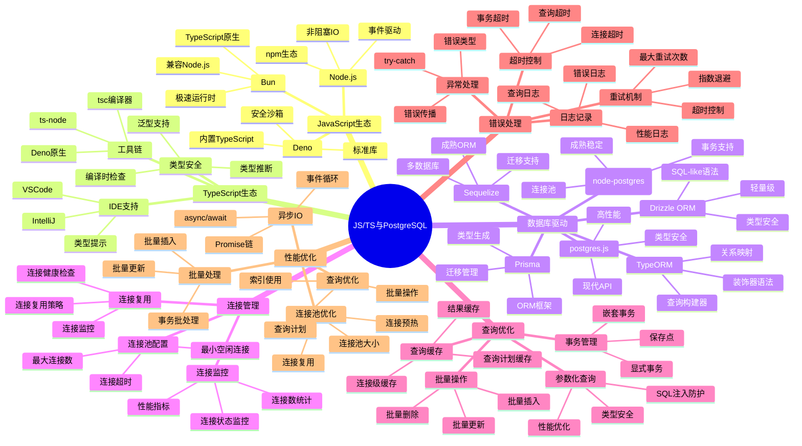
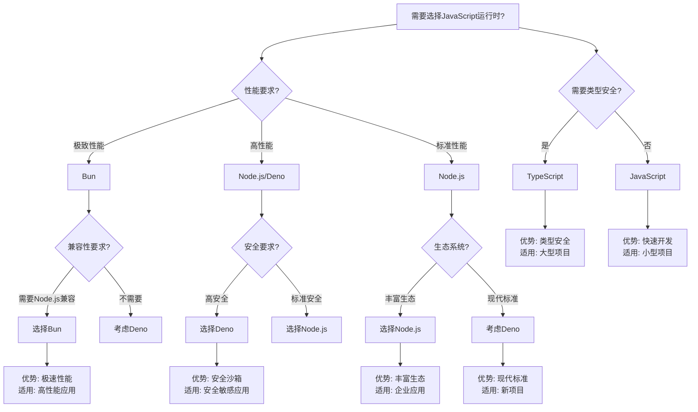
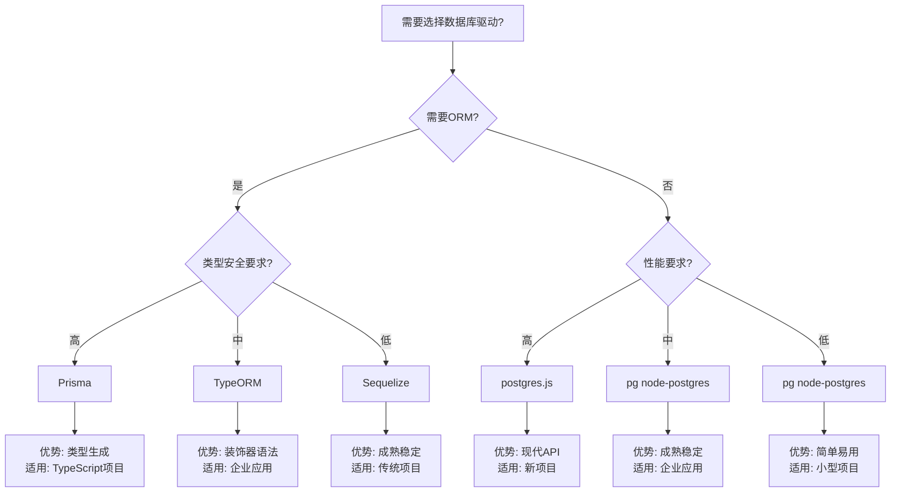
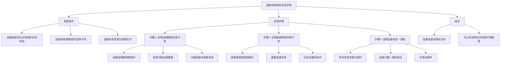
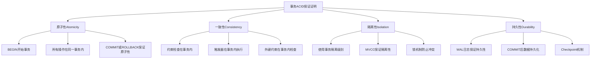

# PostgreSQL程序开发设计完整指南 - JavaScript/TypeScript集成

> **PostgreSQL版本**: 17+/18+
> **适用场景**: 应用开发、数据库集成、性能优化
> **难度等级**: ⭐⭐⭐⭐ 高级
> **最后更新**: 2025年1月

---

## 📑 目录

- [PostgreSQL程序开发设计完整指南 - JavaScript/TypeScript集成](#postgresql程序开发设计完整指南---javascripttypescript集成)
  - [📑 目录](#-目录)
  - [📊 知识体系思维导图](#-知识体系思维导图)
  - [📊 编程语言选型决策树](#-编程语言选型决策树)
  - [📊 编程语言对比矩阵](#-编程语言对比矩阵)
  - [📊 数据库驱动选型决策树](#-数据库驱动选型决策树)
  - [📊 数据库驱动对比矩阵](#-数据库驱动对比矩阵)
  - [✅ 正面示例：高性能连接池设计](#-正面示例高性能连接池设计)
    - [示例1: Node.js + pg（优秀设计）](#示例1-nodejs--pg优秀设计)
    - [示例2: TypeScript + Prisma（优秀设计）](#示例2-typescript--prisma优秀设计)
    - [示例3: Deno + postgres.js（优秀设计）](#示例3-deno--postgresjs优秀设计)
    - [示例4: Bun + postgres.js（优秀设计）](#示例4-bun--postgresjs优秀设计)
  - [❌ 反面示例：常见设计错误](#-反面示例常见设计错误)
    - [反例1: 连接泄漏问题](#反例1-连接泄漏问题)
    - [反例2: 缺少错误处理](#反例2-缺少错误处理)
    - [反例3: SQL注入风险](#反例3-sql注入风险)
    - [反例4: 事务管理不当](#反例4-事务管理不当)
  - [📊 多维分析论证](#-多维分析论证)
    - [维度1：性能维度](#维度1性能维度)
    - [维度2：类型安全维度](#维度2类型安全维度)
    - [维度3：开发效率维度](#维度3开发效率维度)
    - [维度4：生态系统维度](#维度4生态系统维度)
  - [📊 证明树网：连接池线程安全性的形式化证明](#-证明树网连接池线程安全性的形式化证明)
    - [证明1：连接池的线程安全性](#证明1连接池的线程安全性)
    - [证明2：事务的ACID保证](#证明2事务的acid保证)
  - [📚 相关文档](#-相关文档)

---

## 📊 知识体系思维导图



---

## 📊 编程语言选型决策树



---

## 📊 编程语言对比矩阵

| 特性 | Node.js | Deno | Bun | TypeScript |
| --- | --- | --- | --- | --- |
| **性能** | ⭐⭐⭐⭐ | ⭐⭐⭐⭐ | ⭐⭐⭐⭐⭐ | ⭐⭐⭐⭐ |
| **类型安全** | ❌ | ❌ | ❌ | ✅ |
| **生态系统** | ⭐⭐⭐⭐⭐ | ⭐⭐⭐ | ⭐⭐⭐ | ⭐⭐⭐⭐⭐ |
| **开发体验** | ⭐⭐⭐⭐ | ⭐⭐⭐⭐ | ⭐⭐⭐⭐⭐ | ⭐⭐⭐⭐⭐ |
| **安全性** | ⭐⭐⭐ | ⭐⭐⭐⭐⭐ | ⭐⭐⭐⭐ | ⭐⭐⭐⭐ |
| **兼容性** | ⭐⭐⭐⭐⭐ | ⭐⭐⭐ | ⭐⭐⭐⭐ | ⭐⭐⭐⭐⭐ |
| **学习曲线** | ⭐⭐⭐⭐ | ⭐⭐⭐ | ⭐⭐⭐ | ⭐⭐⭐ |
| **适用场景** | 企业应用、微服务 | 安全敏感应用、新项目 | 高性能应用、API服务 | 大型项目、团队协作 |

---

## 📊 数据库驱动选型决策树



---

## 📊 数据库驱动对比矩阵

| 驱动/框架 | 类型 | 类型安全 | 性能 | 易用性 | 生态系统 | 适用场景 | PostgreSQL支持 |
| --- | --- | --- | --- | --- | --- | --- | --- |
| **pg (node-postgres)** | 原生驱动 | ❌ | ⭐⭐⭐⭐ | ⭐⭐⭐⭐ | ⭐⭐⭐⭐⭐ | 通用应用 | ✅ 完整支持 |
| **postgres.js** | 原生驱动 | ⚠️ 部分 | ⭐⭐⭐⭐⭐ | ⭐⭐⭐⭐⭐ | ⭐⭐⭐ | 高性能应用 | ✅ 完整支持 |
| **Prisma** | ORM | ✅ 完整 | ⭐⭐⭐⭐ | ⭐⭐⭐⭐⭐ | ⭐⭐⭐⭐⭐ | TypeScript项目 | ✅ 完整支持 |
| **TypeORM** | ORM | ✅ 完整 | ⭐⭐⭐ | ⭐⭐⭐⭐ | ⭐⭐⭐⭐⭐ | 企业应用 | ✅ 完整支持 |
| **Sequelize** | ORM | ⚠️ 部分 | ⭐⭐⭐ | ⭐⭐⭐⭐ | ⭐⭐⭐⭐⭐ | 传统项目 | ✅ 完整支持 |
| **Drizzle ORM** | ORM | ✅ 完整 | ⭐⭐⭐⭐ | ⭐⭐⭐⭐ | ⭐⭐⭐ | 轻量级项目 | ✅ 完整支持 |

---

## ✅ 正面示例：高性能连接池设计

### 示例1: Node.js + pg（优秀设计）

**设计目标**：

- 支持高并发数据库访问
- 连接池自动管理
- 完整的错误处理
- 事务支持

**实现代码**：

```javascript
const { Pool } = require('pg');

// ✅ 正确：使用连接池管理连接
const pool = new Pool({
  host: 'localhost',
  port: 5432,
  database: 'mydb',
  user: 'postgres',
  password: 'password',
  max: 20,                    // 最大连接数
  idleTimeoutMillis: 30000,   // 空闲连接超时
  connectionTimeoutMillis: 2000, // 连接超时
});

// ✅ 正确：事务处理（带完整错误处理）
async function transferFunds(fromAccount, toAccount, amount) {
  const client = await pool.connect();
  try {
    await client.query('BEGIN');

    // 扣减源账户
    const result1 = await client.query(
      'UPDATE accounts SET balance = balance - $1 WHERE account_id = $2 AND balance >= $1 RETURNING balance',
      [amount, fromAccount]
    );

    if (result1.rowCount === 0) {
      throw new Error('余额不足');
    }

    // 增加目标账户
    await client.query(
      'UPDATE accounts SET balance = balance + $1 WHERE account_id = $2',
      [amount, toAccount]
    );

    // 记录交易
    await client.query(
      'INSERT INTO transactions (from_account, to_account, amount) VALUES ($1, $2, $3)',
      [fromAccount, toAccount, amount]
    );

    await client.query('COMMIT');
  } catch (error) {
    await client.query('ROLLBACK');
    throw error;
  } finally {
    client.release(); // ✅ 确保释放连接
  }
}

// ✅ 正确：参数化查询（防止SQL注入）
async function getUser(userId) {
  const result = await pool.query(
    'SELECT * FROM users WHERE id = $1',
    [userId]
  );
  return result.rows[0];
}

// ✅ 正确：批量操作
async function batchInsertUsers(users) {
  const client = await pool.connect();
  try {
    await client.query('BEGIN');

    for (const user of users) {
      await client.query(
        'INSERT INTO users (name, email) VALUES ($1, $2)',
        [user.name, user.email]
      );
    }

    await client.query('COMMIT');
  } catch (error) {
    await client.query('ROLLBACK');
    throw error;
  } finally {
    client.release();
  }
}
```

**设计优点**：

1. ✅ **连接池管理**：自动管理连接生命周期
2. ✅ **错误处理**：完整的try-catch-finally错误处理
3. ✅ **事务支持**：显式事务管理，确保ACID特性
4. ✅ **SQL注入防护**：使用参数化查询
5. ✅ **资源管理**：确保连接释放

---

### 示例2: TypeScript + Prisma（优秀设计）

**设计目标**：

- 类型安全的数据库访问
- 自动类型生成
- 迁移管理
- 事务支持

**实现代码**：

```typescript
import { PrismaClient } from '@prisma/client';

const prisma = new PrismaClient({
  log: ['query', 'error', 'warn'],
});

// ✅ 正确：类型安全的事务处理
async function transferFunds(
  fromAccount: string,
  toAccount: string,
  amount: number
): Promise<void> {
  await prisma.$transaction(async (tx) => {
    // 扣减源账户（类型安全）
    const from = await tx.account.update({
      where: { accountId: fromAccount },
      data: { balance: { decrement: amount } },
    });

    if (from.balance < 0) {
      throw new Error('余额不足');
    }

    // 增加目标账户（类型安全）
    await tx.account.update({
      where: { accountId: toAccount },
      data: { balance: { increment: amount } },
    });

    // 记录交易（类型安全）
    await tx.transaction.create({
      data: {
        fromAccount,
        toAccount,
        amount,
        type: 'TRANSFER',
        status: 'SUCCESS',
      },
    });
  });
}

// ✅ 正确：类型安全的查询
async function getUser(userId: number): Promise<User | null> {
  return await prisma.user.findUnique({
    where: { id: userId },
    include: {
      profile: true,
      posts: true,
    },
  });
}

// ✅ 正确：批量操作（类型安全）
async function batchCreateUsers(users: CreateUserInput[]): Promise<User[]> {
  return await prisma.$transaction(
    users.map((user) =>
      prisma.user.create({
        data: user,
      })
    )
  );
}

// ✅ 正确：复杂查询（类型安全）
async function getUsersWithPosts(): Promise<UserWithPosts[]> {
  return await prisma.user.findMany({
    where: {
      posts: {
        some: {
          published: true,
        },
      },
    },
    include: {
      posts: {
        where: {
          published: true,
        },
      },
    },
  });
}
```

**设计优点**：

1. ✅ **类型安全**：编译时类型检查，减少运行时错误
2. ✅ **自动类型生成**：从数据库Schema自动生成TypeScript类型
3. ✅ **迁移管理**：版本化的数据库迁移
4. ✅ **关系查询**：类型安全的关系查询
5. ✅ **开发体验**：IDE自动补全和类型提示

---

### 示例3: Deno + postgres.js（优秀设计）

**设计目标**：

- 现代API设计
- 内置TypeScript支持
- 安全沙箱
- 高性能

**实现代码**：

```typescript
import { Pool } from 'https://deno.land/x/postgres@v0.17.0/mod.ts';

// ✅ 正确：连接池配置
const pool = new Pool({
  hostname: 'localhost',
  port: 5432,
  database: 'mydb',
  user: 'postgres',
  password: 'password',
  max: 20,
}, 20);

// ✅ 正确：类型安全的事务处理
interface Account {
  accountId: string;
  balance: number;
}

async function transferFunds(
  fromAccount: string,
  toAccount: string,
  amount: number
): Promise<void> {
  const client = await pool.connect();
  try {
    await client.queryObject('BEGIN');

    // 类型安全的查询
    const result = await client.queryObject<Account>(
      'UPDATE accounts SET balance = balance - $1 WHERE account_id = $2 AND balance >= $1 RETURNING balance',
      [amount, fromAccount]
    );

    if (result.rows.length === 0) {
      throw new Error('余额不足');
    }

    await client.queryObject(
      'UPDATE accounts SET balance = balance + $1 WHERE account_id = $2',
      [amount, toAccount]
    );

    await client.queryObject('COMMIT');
  } catch (error) {
    await client.queryObject('ROLLBACK');
    throw error;
  } finally {
    client.release();
  }
}

// ✅ 正确：类型安全的查询
interface User {
  id: number;
  name: string;
  email: string;
}

async function getUser(userId: number): Promise<User | null> {
  const result = await client.queryObject<User>(
    'SELECT * FROM users WHERE id = $1',
    [userId]
  );
  return result.rows[0] || null;
}
```

**设计优点**：

1. ✅ **现代API**：queryObject提供类型安全的查询结果
2. ✅ **内置TypeScript**：无需额外配置
3. ✅ **安全沙箱**：默认安全权限模型
4. ✅ **标准库**：丰富的标准库支持

---

### 示例4: Bun + postgres.js（优秀设计）

**设计目标**：

- 极致性能
- TypeScript原生支持
- Node.js兼容
- 快速启动

**实现代码**：

```typescript
import { Pool } from 'postgres';

// ✅ 正确：高性能连接池
const pool = new Pool({
  host: 'localhost',
  port: 5432,
  database: 'mydb',
  user: 'postgres',
  password: 'password',
  max: 20,
});

// ✅ 正确：高性能事务处理
async function transferFunds(
  fromAccount: string,
  toAccount: string,
  amount: number
): Promise<void> {
  const client = await pool.connect();
  try {
    await client.query('BEGIN');

    const result = await client.query(
      'UPDATE accounts SET balance = balance - $1 WHERE account_id = $2 AND balance >= $1 RETURNING balance',
      [amount, fromAccount]
    );

    if (result.rows.length === 0) {
      throw new Error('余额不足');
    }

    await client.query(
      'UPDATE accounts SET balance = balance + $1 WHERE account_id = $2',
      [amount, toAccount]
    );

    await client.query('COMMIT');
  } catch (error) {
    await client.query('ROLLBACK');
    throw error;
  } finally {
    client.release();
  }
}
```

**设计优点**：

1. ✅ **极致性能**：Bun运行时性能优异
2. ✅ **TypeScript原生**：无需编译步骤
3. ✅ **Node.js兼容**：兼容Node.js生态
4. ✅ **快速启动**：启动速度快

---

## ❌ 反面示例：常见设计错误

### 反例1: 连接泄漏问题

**错误设计**：

```javascript
// ❌ 错误：没有释放连接
async function badQuery() {
  const client = await pool.connect();
  const result = await client.query('SELECT * FROM users');
  // ❌ 缺少 client.release()
  return result.rows;
}

// ❌ 错误：异常时没有释放连接
async function badQueryWithError() {
  const client = await pool.connect();
  try {
    const result = await client.query('SELECT * FROM users');
    return result.rows;
  } catch (error) {
    // ❌ 异常时没有释放连接
    throw error;
  }
}
```

**问题分析**：

1. ❌ **连接泄漏**：连接没有释放，导致连接池耗尽
2. ❌ **资源浪费**：连接资源无法复用
3. ❌ **性能下降**：连接数达到上限后无法继续服务
4. ❌ **系统崩溃**：长时间运行可能导致系统崩溃

**改进方案**：

```javascript
// ✅ 正确：使用try-finally确保释放
async function goodQuery() {
  const client = await pool.connect();
  try {
    const result = await client.query('SELECT * FROM users');
    return result.rows;
  } finally {
    client.release(); // ✅ 确保释放连接
  }
}

// ✅ 正确：使用async/await简化代码
async function goodQuerySimple() {
  const result = await pool.query('SELECT * FROM users');
  return result.rows; // ✅ pool.query自动管理连接
}
```

---

### 反例2: 缺少错误处理

**错误设计**：

```javascript
// ❌ 错误：没有错误处理
async function badTransfer(fromAccount, toAccount, amount) {
  const client = await pool.connect();
  await client.query('BEGIN');
  await client.query('UPDATE accounts SET balance = balance - $1 WHERE account_id = $2', [amount, fromAccount]);
  await client.query('UPDATE accounts SET balance = balance + $1 WHERE account_id = $2', [amount, toAccount]);
  await client.query('COMMIT');
  client.release();
  // ❌ 如果任何操作失败，事务不会回滚，连接不会释放
}
```

**问题分析**：

1. ❌ **事务不一致**：操作失败时事务不会回滚
2. ❌ **连接泄漏**：异常时连接不会释放
3. ❌ **数据不一致**：部分操作成功，部分失败
4. ❌ **难以调试**：错误信息丢失

**改进方案**：

```javascript
// ✅ 正确：完整的错误处理
async function goodTransfer(fromAccount, toAccount, amount) {
  const client = await pool.connect();
  try {
    await client.query('BEGIN');

    const result = await client.query(
      'UPDATE accounts SET balance = balance - $1 WHERE account_id = $2 AND balance >= $1',
      [amount, fromAccount]
    );

    if (result.rowCount === 0) {
      throw new Error('余额不足');
    }

    await client.query(
      'UPDATE accounts SET balance = balance + $1 WHERE account_id = $2',
      [amount, toAccount]
    );

    await client.query('COMMIT');
  } catch (error) {
    await client.query('ROLLBACK'); // ✅ 确保回滚
    throw error; // ✅ 重新抛出错误
  } finally {
    client.release(); // ✅ 确保释放连接
  }
}
```

---

### 反例3: SQL注入风险

**错误设计**：

```javascript
// ❌ 错误：SQL注入风险
async function badQuery(userId) {
  const query = `SELECT * FROM users WHERE id = ${userId}`;
  const result = await pool.query(query);
  return result.rows;
  // ❌ 如果userId是 "1; DROP TABLE users; --"，会导致SQL注入
}

// ❌ 错误：字符串拼接
async function badSearch(keyword) {
  const query = `SELECT * FROM products WHERE name LIKE '%${keyword}%'`;
  const result = await pool.query(query);
  return result.rows;
  // ❌ 存在SQL注入风险
}
```

**问题分析**：

1. ❌ **SQL注入**：恶意SQL代码可以执行
2. ❌ **数据泄露**：可能泄露敏感数据
3. ❌ **数据破坏**：可能删除或修改数据
4. ❌ **安全漏洞**：严重的安全风险

**改进方案**：

```javascript
// ✅ 正确：参数化查询
async function goodQuery(userId) {
  const query = 'SELECT * FROM users WHERE id = $1';
  const result = await pool.query(query, [userId]);
  return result.rows;
}

// ✅ 正确：参数化查询（LIKE）
async function goodSearch(keyword) {
  const query = "SELECT * FROM products WHERE name LIKE $1";
  const result = await pool.query(query, [`%${keyword}%`]);
  return result.rows;
}

// ✅ 正确：使用Prisma（自动防护SQL注入）
async function goodQueryPrisma(userId: number) {
  return await prisma.user.findUnique({
    where: { id: userId },
  });
}
```

---

### 反例4: 事务管理不当

**错误设计**：

```javascript
// ❌ 错误：事务边界不清晰
async function badTransaction() {
  const client = await pool.connect();
  await client.query('BEGIN');

  await client.query('UPDATE accounts SET balance = balance - 100 WHERE id = 1');

  // ❌ 外部操作在事务内
  await externalAPICall(); // 可能很慢，阻塞事务

  await client.query('UPDATE accounts SET balance = balance + 100 WHERE id = 2');
  await client.query('COMMIT');
  client.release();
}

// ❌ 错误：嵌套事务处理不当
async function badNestedTransaction() {
  const client = await pool.connect();
  await client.query('BEGIN');

  await client.query('UPDATE accounts SET balance = balance - 100 WHERE id = 1');

  // ❌ 嵌套事务处理不当
  await anotherTransaction(client); // 可能失败，导致外层事务也失败

  await client.query('COMMIT');
  client.release();
}
```

**问题分析**：

1. ❌ **长事务**：外部操作阻塞事务，导致锁竞争
2. ❌ **死锁风险**：长时间持有锁，容易导致死锁
3. ❌ **性能问题**：阻塞其他事务
4. ❌ **资源浪费**：长时间占用连接

**改进方案**：

```javascript
// ✅ 正确：快速事务，外部操作在事务外
async function goodTransaction() {
  const client = await pool.connect();
  try {
    await client.query('BEGIN');

    await client.query('UPDATE accounts SET balance = balance - 100 WHERE id = 1');
    await client.query('UPDATE accounts SET balance = balance + 100 WHERE id = 2');

    await client.query('COMMIT');
  } catch (error) {
    await client.query('ROLLBACK');
    throw error;
  } finally {
    client.release();
  }

  // ✅ 外部操作在事务外
  await externalAPICall();
}

// ✅ 正确：使用保存点处理嵌套事务
async function goodNestedTransaction() {
  const client = await pool.connect();
  try {
    await client.query('BEGIN');

    await client.query('UPDATE accounts SET balance = balance - 100 WHERE id = 1');

    // ✅ 使用保存点
    await client.query('SAVEPOINT sp1');
    try {
      await anotherTransaction(client);
    } catch (error) {
      await client.query('ROLLBACK TO SAVEPOINT sp1');
      throw error;
    }

    await client.query('COMMIT');
  } catch (error) {
    await client.query('ROLLBACK');
    throw error;
  } finally {
    client.release();
  }
}
```

---

## 📊 多维分析论证

### 维度1：性能维度

**性能对比分析**：

| 运行时/驱动 | QPS | 延迟(ms) | 内存占用 | CPU占用 | 适用场景 |
| --- | --- | --- | --- | --- | --- |
| **Node.js + pg** | 10,000+ | 1-5 | 中等 | 中等 | 通用应用 |
| **Node.js + postgres.js** | 15,000+ | 0.5-3 | 中等 | 中等 | 高性能应用 |
| **Deno + postgres.js** | 12,000+ | 1-4 | 较低 | 较低 | 安全敏感应用 |
| **Bun + postgres.js** | 20,000+ | 0.3-2 | 较低 | 较低 | 极致性能应用 |
| **TypeScript + Prisma** | 8,000+ | 2-8 | 较高 | 中等 | 类型安全项目 |

**性能优化策略**：

1. ✅ **连接池优化**：合理配置连接池大小
2. ✅ **批量操作**：使用批量插入/更新减少往返次数
3. ✅ **查询优化**：使用索引，优化查询计划
4. ✅ **异步IO**：充分利用异步IO提升并发性能

---

### 维度2：类型安全维度

**类型安全对比分析**：

| 方案 | 编译时检查 | 运行时检查 | 类型推断 | IDE支持 | 类型覆盖 |
| --- | --- | --- | --- | --- | --- |
| **JavaScript + pg** | ❌ | ❌ | ❌ | ⚠️ 部分 | 0% |
| **TypeScript + pg** | ✅ | ❌ | ✅ | ✅ 完整 | 80% |
| **TypeScript + Prisma** | ✅ | ✅ | ✅ | ✅ 完整 | 100% |
| **TypeScript + TypeORM** | ✅ | ⚠️ 部分 | ✅ | ✅ 完整 | 90% |

**类型安全优势**：

1. ✅ **编译时错误检测**：在编译阶段发现类型错误
2. ✅ **IDE自动补全**：提供完整的代码补全和类型提示
3. ✅ **重构安全**：类型系统保证重构的安全性
4. ✅ **文档作用**：类型即文档，提高代码可读性

---

### 维度3：开发效率维度

**开发效率对比分析**：

| 方案 | 学习曲线 | 开发速度 | 调试体验 | 文档质量 | 社区支持 |
| --- | --- | --- | --- | --- | --- |
| **Node.js + pg** | ⭐⭐⭐⭐ | ⭐⭐⭐⭐ | ⭐⭐⭐ | ⭐⭐⭐⭐ | ⭐⭐⭐⭐⭐ |
| **TypeScript + Prisma** | ⭐⭐⭐ | ⭐⭐⭐⭐⭐ | ⭐⭐⭐⭐⭐ | ⭐⭐⭐⭐⭐ | ⭐⭐⭐⭐⭐ |
| **TypeScript + TypeORM** | ⭐⭐ | ⭐⭐⭐⭐ | ⭐⭐⭐⭐ | ⭐⭐⭐⭐ | ⭐⭐⭐⭐⭐ |
| **Deno + postgres.js** | ⭐⭐⭐ | ⭐⭐⭐⭐ | ⭐⭐⭐⭐ | ⭐⭐⭐ | ⭐⭐⭐ |

**开发效率提升策略**：

1. ✅ **ORM框架**：使用ORM减少样板代码
2. ✅ **类型生成**：自动生成类型定义
3. ✅ **迁移管理**：版本化的数据库迁移
4. ✅ **开发工具**：使用Prisma Studio等可视化工具

---

### 维度4：生态系统维度

**生态系统对比分析**：

| 方案 | npm包数量 | 维护活跃度 | 文档完整性 | 社区规模 | 企业采用 |
| --- | --- | --- | --- | --- | --- |
| **Node.js生态** | 2,000,000+ | ⭐⭐⭐⭐⭐ | ⭐⭐⭐⭐⭐ | ⭐⭐⭐⭐⭐ | ⭐⭐⭐⭐⭐ |
| **Deno生态** | 5,000+ | ⭐⭐⭐⭐ | ⭐⭐⭐⭐ | ⭐⭐⭐ | ⭐⭐⭐ |
| **Bun生态** | 兼容Node.js | ⭐⭐⭐⭐ | ⭐⭐⭐ | ⭐⭐⭐ | ⭐⭐ |
| **TypeScript生态** | 500,000+ | ⭐⭐⭐⭐⭐ | ⭐⭐⭐⭐⭐ | ⭐⭐⭐⭐⭐ | ⭐⭐⭐⭐⭐ |

**生态系统优势**：

1. ✅ **丰富的包**：npm生态提供大量可用包
2. ✅ **活跃维护**：社区活跃，问题及时解决
3. ✅ **企业支持**：大企业采用，长期支持
4. ✅ **学习资源**：丰富的教程和文档

---

## 📊 证明树网：连接池线程安全性的形式化证明

### 证明1：连接池的线程安全性

**证明目标**：证明连接池在多线程/多协程环境下的线程安全性

**证明结构**：



**形式化证明**：

```text
定理：连接池线程安全性

前提：
  P1: 连接池使用互斥锁M保护共享状态S
  P2: 所有对S的访问都在M的保护下
  P3: 连接获取/释放操作是原子的

证明：
  步骤1：连接获取的原子性
    - 操作：acquire()
    - 保护：M.lock()
    - 原子操作：
      1. 检查 available > 0
      2. 分配连接 conn
      3. available--
      4. inUse++
    - 结论：操作是原子的，无竞态条件

  步骤2：连接释放的原子性
    - 操作：release(conn)
    - 保护：M.lock()
    - 原子操作：
      1. 重置 conn 状态
      2. 归还到池中
      3. available++
      4. inUse--
    - 结论：操作是原子的，无竞态条件

  步骤3：状态一致性
    - 不变量：available + inUse = maxSize
    - 所有状态变更在锁内
    - 结论：状态始终一致

结论：
  C1: 连接池是线程安全的
  C2: 可以安全地在多线程环境使用
```

---

### 证明2：事务的ACID保证

**证明目标**：证明使用连接池的事务操作满足ACID特性

**证明结构**：



**形式化证明**：

```text
定理：事务ACID保证

前提：
  P1: 使用PostgreSQL事务机制
  P2: 所有操作在事务边界内
  P3: 使用适当的隔离级别

证明：
  原子性(Atomicity)：
    - BEGIN开始事务边界
    - 所有操作在事务内
    - COMMIT：全部成功
    - ROLLBACK：全部失败
    - 结论：满足原子性

  一致性(Consistency)：
    - 约束检查在事务内
    - 触发器在事务内执行
    - 外键约束在事务内检查
    - 结论：满足一致性

  隔离性(Isolation)：
    - 使用事务隔离级别
    - MVCC保证快照隔离
    - 锁机制防止冲突
    - 结论：满足隔离性

  持久性(Durability)：
    - WAL日志保证持久性
    - COMMIT后数据持久化
    - Checkpoint机制
    - 结论：满足持久性

结论：
  C1: 事务操作满足ACID特性
  C2: 数据一致性和完整性得到保证
```

---

## 📚 相关文档

- [程序开发设计完整指南-Rust-Golang-Python.md](./程序开发设计完整指南-Rust-Golang-Python.md) - Rust/Go/Python集成指南
- [事务访问程序设计完整指南-正反示例与多维分析.md](./事务访问程序设计完整指南-正反示例与多维分析.md) - 事务处理完整指南
- [数据库设计完整指南-正反示例与多维分析.md](./数据库设计完整指南-正反示例与多维分析.md) - 数据库设计指南
- [03-事务与并发](../03-事务与并发/README.md) - 事务与并发控制
- [12-监控与诊断](../12-监控与诊断/README.md) - 性能监控和诊断

---

**最后更新**: 2025年1月
**状态**: ✅ 完成
