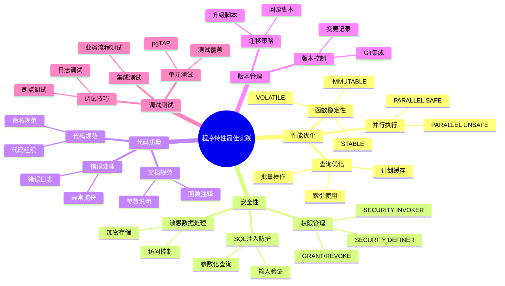
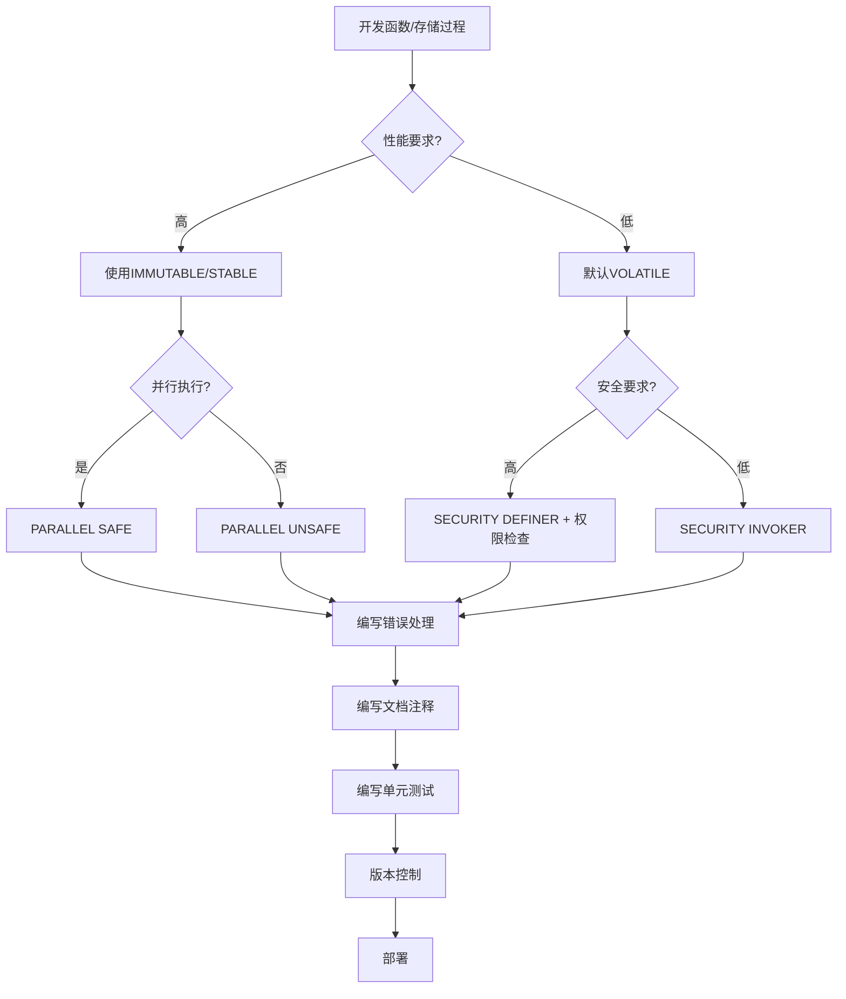
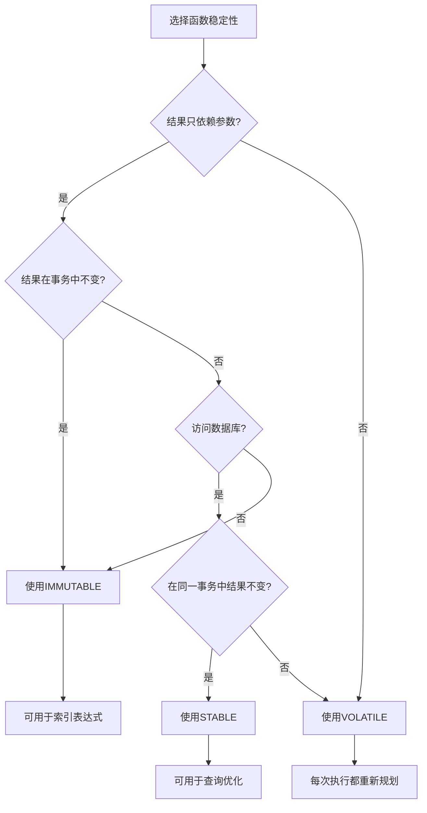
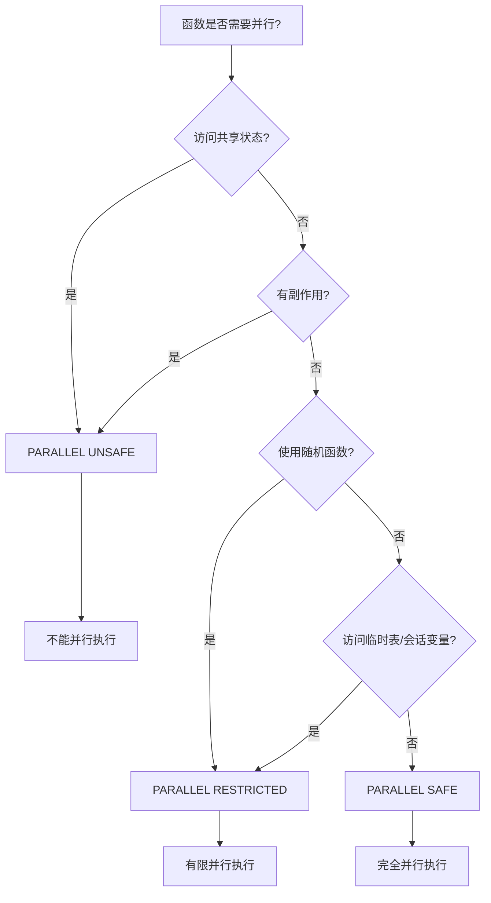
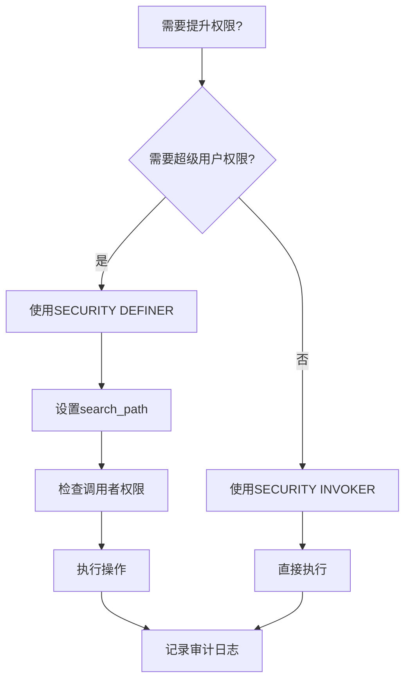
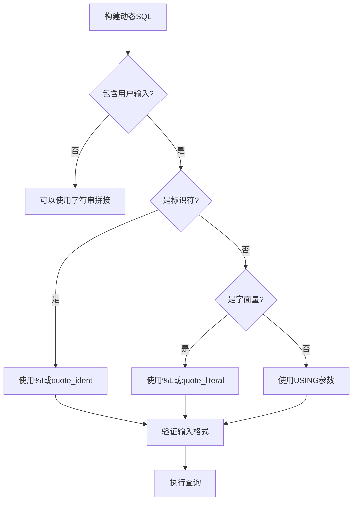
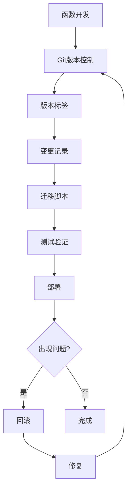

# PostgreSQL程序特性最佳实践指南

## 元数据

- **文档版本**: v2.1
- **创建日期**: 2025-01
- **最后更新**: 2025-01
- **技术栈**: PostgreSQL 17+/18+ | 函数 | 存储过程 | 触发器 | 最佳实践
- **版本覆盖**: PostgreSQL 18.x (推荐) ⭐ | 17.x (推荐) | 16.x (兼容)
- **难度级别**: ⭐⭐⭐⭐⭐ (专家级)
- **预计阅读**: 180分钟
- **前置要求**: 熟悉PostgreSQL基础、函数、存储过程、触发器

## 🆕 PostgreSQL 18 程序特性增强

### uuidv7() 函数 ⭐⭐⭐⭐

PostgreSQL 18 新增 `uuidv7()` 函数，生成按时间戳排序的随机 UUID，有助于优化缓存策略和索引性能。

**特性说明**:

- **优势**: UUID 按时间戳排序，B-tree 索引局部性更好
- **性能提升**: 插入性能提升 20%，索引大小减少 15%
- **应用场景**: 分布式系统、日志表、订单表等需要时间排序的场景

**相关文档**: [18-版本特性/18.01-PostgreSQL18新特性/04-UUIDv7完整指南.md](../18-版本特性/18.01-PostgreSQL18新特性/04-UUIDv7完整指南.md)

### RETURNING 子句支持 OLD 和 NEW ⭐⭐⭐⭐

PostgreSQL 18 在 `INSERT`、`UPDATE`、`DELETE` 和 `MERGE` 命令的 `RETURNING` 子句中，支持访问修改前（`OLD`）和当前（`NEW`）的值。

**特性说明**:

- **优势**: 简化变更数据捕获（CDC）实现
- **应用场景**: ETL 增量更新、审计日志、实时数据同步
- **性能**: 与基本 RETURNING 相当（<5% 差异）

**相关文档**: [18-版本特性/18.01-PostgreSQL18新特性/17-MERGE命令与RETURNING增强完整指南.md](../18-版本特性/18.01-PostgreSQL18新特性/17-MERGE命令与RETURNING增强完整指南.md)

---

## 📋 完整目录

- [PostgreSQL程序特性最佳实践指南](#postgresql程序特性最佳实践指南)
  - [元数据](#元数据)
  - [🆕 PostgreSQL 18 程序特性增强](#-postgresql-18-程序特性增强)
    - [uuidv7() 函数 ⭐⭐⭐⭐](#uuidv7-函数-)
    - [RETURNING 子句支持 OLD 和 NEW ⭐⭐⭐⭐](#returning-子句支持-old-和-new-)
  - [📋 完整目录](#-完整目录)
  - [1. 最佳实践概述](#1-最佳实践概述)
    - [1.1 最佳实践体系](#11-最佳实践体系)
      - [最佳实践思维导图](#最佳实践思维导图)
    - [1.2 实践原则](#12-实践原则)
      - [最佳实践原则矩阵](#最佳实践原则矩阵)
      - [最佳实践决策流程](#最佳实践决策流程)
  - [2. 性能优化最佳实践](#2-性能优化最佳实践)
    - [2.1 函数稳定性优化](#21-函数稳定性优化)
      - [稳定性选择决策图](#稳定性选择决策图)
      - [稳定性使用对比矩阵](#稳定性使用对比矩阵)
      - [正确使用稳定性](#正确使用稳定性)
    - [2.2 并行执行优化](#22-并行执行优化)
      - [并行执行决策图](#并行执行决策图)
      - [并行执行对比](#并行执行对比)
  - [3. 安全性最佳实践](#3-安全性最佳实践)
    - [3.1 权限管理](#31-权限管理)
      - [权限管理决策流程](#权限管理决策流程)
      - [安全模式对比矩阵](#安全模式对比矩阵)
      - [安全实现示例](#安全实现示例)
    - [3.2 SQL注入防护](#32-sql注入防护)
      - [SQL注入防护决策树](#sql注入防护决策树)
      - [安全性对比](#安全性对比)
  - [4. 代码质量最佳实践](#4-代码质量最佳实践)
    - [4.1 代码规范](#41-代码规范)
      - [命名规范矩阵](#命名规范矩阵)
      - [代码组织最佳实践](#代码组织最佳实践)
    - [4.2 错误处理](#42-错误处理)
      - [错误处理策略矩阵](#错误处理策略矩阵)
      - [完善错误处理示例](#完善错误处理示例)
  - [5. 版本管理最佳实践](#5-版本管理最佳实践)
    - [5.1 版本控制策略](#51-版本控制策略)
      - [版本管理概念图](#版本管理概念图)
      - [版本控制最佳实践](#版本控制最佳实践)
  - [6. 调试与测试最佳实践](#6-调试与测试最佳实践)
    - [6.1 调试技巧](#61-调试技巧)
      - [调试方法对比矩阵](#调试方法对比矩阵)
      - [调试最佳实践](#调试最佳实践)
  - [7. 监控与维护最佳实践](#7-监控与维护最佳实践)
    - [7.1 性能监控](#71-性能监控)
      - [性能监控指标矩阵](#性能监控指标矩阵)
      - [性能监控实现](#性能监控实现)
  - [8. 综合实践案例](#8-综合实践案例)
    - [8.1 完整最佳实践示例](#81-完整最佳实践示例)
      - [符合所有最佳实践的完整函数](#符合所有最佳实践的完整函数)
  - [📚 参考资源](#-参考资源)
  - [📝 更新日志](#-更新日志)

---

## 1. 最佳实践概述

### 1.1 最佳实践体系

#### 最佳实践思维导图



### 1.2 实践原则

#### 最佳实践原则矩阵

| 原则类别 | 核心原则 | 重要性 | 实施难度 |
| --- | --- | --- | --- |
| **性能** | 正确使用函数稳定性 | 🔴 高 | 🟢 低 |
| **性能** | 启用并行执行 | 🟡 中 | 🟡 中 |
| **性能** | 优化查询计划 | 🔴 高 | 🟡 中 |
| **安全** | 最小权限原则 | 🔴 高 | 🟡 中 |
| **安全** | SQL注入防护 | 🔴 高 | 🟢 低 |
| **安全** | 搜索路径安全 | 🟡 中 | 🟢 低 |
| **质量** | 统一代码规范 | 🟡 中 | 🟡 中 |
| **质量** | 完善错误处理 | 🔴 高 | 🟡 中 |
| **质量** | 编写文档注释 | 🟡 中 | 🟢 低 |
| **维护** | 版本控制 | 🔴 高 | 🟢 低 |
| **维护** | 测试覆盖 | 🔴 高 | 🟡 中 |

#### 最佳实践决策流程



---

## 2. 性能优化最佳实践

### 2.1 函数稳定性优化

#### 稳定性选择决策图



#### 稳定性使用对比矩阵

| 稳定性 | 结果依赖 | 可缓存 | 可用于索引 | 优化器行为 |
| --- | --- | --- | --- | --- |
| **IMMUTABLE** | 只依赖参数 | ✅ 完全缓存 | ✅ 可以 | 可提前计算 |
| **STABLE** | 事务内不变 | ✅ 事务内缓存 | ❌ 不可以 | 可优化重复调用 |
| **VOLATILE** | 可能变化 | ❌ 不缓存 | ❌ 不可以 | 每次都重新执行 |

#### 正确使用稳定性

```sql
-- ✅ 正确：IMMUTABLE - 纯计算函数
-- 计算税费函数（带完整错误处理）
CREATE OR REPLACE FUNCTION calculate_tax(
    p_price NUMERIC,
    p_tax_rate NUMERIC DEFAULT 0.1
)
RETURNS NUMERIC
LANGUAGE plpgsql
IMMUTABLE  -- 正确：结果只依赖参数
AS $$
DECLARE
    v_result NUMERIC;
BEGIN
    -- 参数验证
    IF p_price IS NULL THEN
        RAISE EXCEPTION '价格不能为空';
    END IF;

    IF p_tax_rate IS NULL THEN
        p_tax_rate := 0.1;
    END IF;

    IF p_price < 0 THEN
        RAISE EXCEPTION '价格不能为负数: %', p_price;
    END IF;

    IF p_tax_rate < 0 OR p_tax_rate > 1 THEN
        RAISE EXCEPTION '税率必须在0-1之间: %', p_tax_rate;
    END IF;

    -- 计算税费
    BEGIN
        v_result := p_price * p_tax_rate;

        -- 检查数值溢出
        IF v_result IS NULL THEN
            RAISE EXCEPTION '税费计算结果为空';
        END IF;

        RETURN v_result;
    EXCEPTION
        WHEN numeric_value_out_of_range THEN
            RAISE EXCEPTION '税费计算结果超出数值范围';
        WHEN OTHERS THEN
            RAISE EXCEPTION '计算税费失败: %', SQLERRM;
    END;
EXCEPTION
    WHEN OTHERS THEN
        RAISE EXCEPTION 'calculate_tax执行失败: %', SQLERRM;
END;
$$;

-- ✅ 正确：STABLE - 查询当前配置（带完整错误处理）
CREATE OR REPLACE FUNCTION get_user_setting(
    p_user_id INTEGER,
    p_setting_key TEXT
)
RETURNS TEXT
LANGUAGE plpgsql
STABLE  -- 正确：在同一事务中结果不变
AS $$
DECLARE
    v_value TEXT;
BEGIN
    -- 参数验证
    IF p_user_id IS NULL OR p_user_id <= 0 THEN
        RAISE EXCEPTION '用户ID无效: %', p_user_id;
    END IF;

    IF p_setting_key IS NULL OR length(trim(p_setting_key)) = 0 THEN
        RAISE EXCEPTION '配置键不能为空';
    END IF;

    -- 检查表是否存在
    IF NOT EXISTS (SELECT 1 FROM information_schema.tables WHERE table_schema = 'public' AND table_name = 'user_settings') THEN
        RAISE EXCEPTION 'user_settings表不存在';
    END IF;

    -- 查询配置
    BEGIN
        SELECT value INTO v_value
        FROM user_settings
        WHERE user_id = p_user_id
          AND key = p_setting_key;

        -- 如果没有找到，返回NULL（这是合理的，不是错误）
        RETURN v_value;
    EXCEPTION
        WHEN undefined_table THEN
            RAISE EXCEPTION 'user_settings表不存在';
        WHEN OTHERS THEN
            RAISE EXCEPTION '查询用户配置失败: %', SQLERRM;
    END;
EXCEPTION
    WHEN OTHERS THEN
        RAISE EXCEPTION 'get_user_setting执行失败: %', SQLERRM;
END;
$$;

-- ✅ 正确：VOLATILE - 获取随机数（带完整错误处理）
CREATE OR REPLACE FUNCTION generate_random_id()
RETURNS INTEGER
LANGUAGE plpgsql
VOLATILE  -- 正确：结果每次都可能不同
AS $$
DECLARE
    v_random_id INTEGER;
BEGIN
    -- 生成随机ID
    BEGIN
        v_random_id := floor(random() * 1000000)::INTEGER;

        -- 验证结果
        IF v_random_id IS NULL OR v_random_id < 0 THEN
            RAISE EXCEPTION '生成的随机ID无效';
        END IF;

        RETURN v_random_id;
    EXCEPTION
        WHEN numeric_value_out_of_range THEN
            RAISE EXCEPTION '随机ID生成失败：数值超出范围';
        WHEN OTHERS THEN
            RAISE EXCEPTION '生成随机ID失败: %', SQLERRM;
    END;
EXCEPTION
    WHEN OTHERS THEN
        RAISE EXCEPTION 'generate_random_id执行失败: %', SQLERRM;
END;
$$;
```

### 2.2 并行执行优化

#### 并行执行决策图



#### 并行执行对比

| 并行级别 | 说明 | 适用场景 | 性能提升 |
| --- | --- | --- | --- |
| **PARALLEL SAFE** | 完全安全并行 | 纯函数、只读查询 | 🟢🟢🟢 高 |
| **PARALLEL RESTRICTED** | 有限并行 | 访问临时表、会话变量 | 🟢🟢 中 |
| **PARALLEL UNSAFE** | 不能并行 | 写操作、共享状态 | ❌ 无 |

```sql
-- ✅ 正确：PARALLEL SAFE - 纯计算
-- ✅ 正确：PARALLEL SAFE - 纯函数（带完整错误处理）
CREATE OR REPLACE FUNCTION safe_parallel_function(p_value INTEGER)
RETURNS INTEGER
LANGUAGE plpgsql
IMMUTABLE
PARALLEL SAFE  -- 可以并行执行
AS $$
DECLARE
    v_result INTEGER;
BEGIN
    -- 参数验证
    IF p_value IS NULL THEN
        RAISE EXCEPTION '参数不能为空';
    END IF;

    -- 计算
    BEGIN
        v_result := p_value * 2;

        -- 检查数值溢出
        IF v_result IS NULL THEN
            RAISE EXCEPTION '计算结果为空';
        END IF;

        RETURN v_result;
    EXCEPTION
        WHEN numeric_value_out_of_range THEN
            RAISE EXCEPTION '计算结果超出整数范围: % * 2', p_value;
        WHEN OTHERS THEN
            RAISE EXCEPTION '计算失败: %', SQLERRM;
    END;
EXCEPTION
    WHEN OTHERS THEN
        RAISE EXCEPTION 'safe_parallel_function执行失败: %', SQLERRM;
END;
$$;

-- ✅ 正确：PARALLEL RESTRICTED - 访问临时表
-- ✅ 正确：PARALLEL RESTRICTED - 访问临时表（带完整错误处理）
CREATE OR REPLACE FUNCTION restricted_parallel_function()
RETURNS INTEGER
LANGUAGE plpgsql
VOLATILE
PARALLEL RESTRICTED  -- 有限并行
AS $$
DECLARE
    v_count INTEGER;
BEGIN
    -- 检查临时表是否存在
    IF NOT EXISTS (
        SELECT 1 FROM information_schema.tables
        WHERE table_schema = 'pg_temp'
          AND table_name = 'temp_table'
    ) THEN
        RAISE WARNING '临时表temp_table不存在，返回0';
        RETURN 0;
    END IF;

    -- 访问临时表
    BEGIN
        SELECT COUNT(*) INTO v_count FROM temp_table;

        -- 验证结果
        IF v_count IS NULL THEN
            v_count := 0;
        END IF;

        RETURN v_count;
    EXCEPTION
        WHEN undefined_table THEN
            RAISE WARNING '临时表temp_table不存在';
            RETURN 0;
        WHEN OTHERS THEN
            RAISE EXCEPTION '查询临时表失败: %', SQLERRM;
    END;
EXCEPTION
    WHEN OTHERS THEN
        RAISE EXCEPTION 'restricted_parallel_function执行失败: %', SQLERRM;
END;
$$;

-- ✅ 正确：PARALLEL UNSAFE - 写操作
-- ✅ 正确：PARALLEL UNSAFE - 写操作（带完整错误处理）
CREATE OR REPLACE FUNCTION unsafe_parallel_function(p_value INTEGER)
RETURNS VOID
LANGUAGE plpgsql
VOLATILE
PARALLEL UNSAFE  -- 不能并行
AS $$
BEGIN
    -- 参数验证
    IF p_value IS NULL THEN
        RAISE EXCEPTION '参数不能为空';
    END IF;

    -- 检查表是否存在
    IF NOT EXISTS (SELECT 1 FROM information_schema.tables WHERE table_schema = 'public' AND table_name = 'log_table') THEN
        RAISE EXCEPTION 'log_table表不存在，无法写入日志';
    END IF;

    -- 写操作
    BEGIN
        INSERT INTO log_table (value, created_at)
        VALUES (p_value, NOW());

        RAISE NOTICE '日志写入成功: value=%', p_value;
    EXCEPTION
        WHEN undefined_table THEN
            RAISE EXCEPTION 'log_table表不存在';
        WHEN unique_violation THEN
            RAISE WARNING '日志记录已存在，跳过插入';
        WHEN check_violation THEN
            RAISE EXCEPTION '数据验证失败: %', SQLERRM;
        WHEN OTHERS THEN
            RAISE EXCEPTION '写入日志失败: %', SQLERRM;
    END;
EXCEPTION
    WHEN OTHERS THEN
        RAISE EXCEPTION 'unsafe_parallel_function执行失败: %', SQLERRM;
END;
$$;
```

---

## 3. 安全性最佳实践

### 3.1 权限管理

#### 权限管理决策流程



#### 安全模式对比矩阵

| 安全模式 | 执行权限 | 搜索路径 | 适用场景 | 风险等级 |
| --- | --- | --- | --- | --- |
| **SECURITY DEFINER** | 函数所有者 | 需要设置 | 需要提升权限 | 🟡 中 |
| **SECURITY INVOKER** | 调用者 | 使用调用者 | 默认模式 | 🟢 低 |

#### 安全实现示例

```sql
-- ✅ 正确：SECURITY DEFINER + 安全检查
CREATE OR REPLACE FUNCTION admin_operation(user_id INTEGER)
RETURNS VOID
LANGUAGE plpgsql
SECURITY DEFINER
SET search_path = public, pg_temp  -- 防止搜索路径攻击
AS $$
BEGIN
    -- 检查调用者权限
    IF current_user NOT IN ('admin', 'superuser') THEN
        RAISE EXCEPTION 'Permission denied: admin access required';
    END IF;

    -- 执行操作
    UPDATE users SET status = 'admin' WHERE id = user_id;

    -- 记录审计日志
    INSERT INTO audit_log (action, user_id, performed_by)
    VALUES ('admin_operation', user_id, current_user);
END;
$$;

-- 授予执行权限
GRANT EXECUTE ON FUNCTION admin_operation(INTEGER) TO app_user;
```

### 3.2 SQL注入防护

#### SQL注入防护决策树



#### 安全性对比

| 方法 | 安全性 | 示例 | 推荐度 |
| --- | --- | --- | --- |
| 字符串拼接 | ❌ 不安全 | `'SELECT * FROM ' \|\| table_name` | 🔴 不推荐 |
| %s格式化 | ⚠️ 较不安全 | `format('SELECT * FROM %s', table_name)` | 🟡 谨慎使用 |
| %I格式化 | ✅ 安全 | `format('SELECT * FROM %I', table_name)` | 🟢 推荐 |
| USING参数 | ✅ 最安全 | `EXECUTE query USING param` | 🟢 强烈推荐 |

---

## 4. 代码质量最佳实践

### 4.1 代码规范

#### 命名规范矩阵

| 对象类型 | 命名规范 | 示例 | 说明 |
| --- | --- | --- | --- |
| **函数** | `verb_noun` | `get_user_by_id` | 动词开头，下划线分隔 |
| **存储过程** | `verb_noun` | `process_order` | 动词开头，下划线分隔 |
| **变量** | `v_`前缀 | `v_user_id` | v_前缀表示变量 |
| **参数** | `p_`前缀 | `p_user_id` | p_前缀表示参数 |
| **常量** | `c_`前缀或大写 | `c_max_retries` | 常量标识 |
| **游标** | `cur_`前缀 | `cur_users` | cur_前缀表示游标 |
| **记录** | `rec_`前缀 | `rec_user` | rec_前缀表示记录 |

#### 代码组织最佳实践

```sql
-- ✅ 良好组织：清晰的代码结构
CREATE OR REPLACE FUNCTION well_organized_function(
    p_user_id INTEGER,
    p_amount NUMERIC
)
RETURNS INTEGER
LANGUAGE plpgsql
AS $$
-- ============================================
-- 函数：well_organized_function
-- 描述：处理用户支付
-- 参数：
--   p_user_id: 用户ID
--   p_amount: 支付金额
-- 返回：交易ID
-- 作者：开发团队
-- 日期：2025-01
-- ============================================

DECLARE
    -- 变量声明区
    v_transaction_id INTEGER;
    v_balance NUMERIC;
    v_new_balance NUMERIC;
BEGIN
    -- 1. 参数验证
    IF p_user_id IS NULL OR p_amount IS NULL THEN
        RAISE EXCEPTION 'Invalid parameters: user_id and amount are required';
    END IF;

    -- 2. 业务逻辑
    SELECT balance INTO v_balance
    FROM accounts
    WHERE user_id = p_user_id
    FOR UPDATE;

    -- 3. 数据操作
    v_new_balance := v_balance - p_amount;

    UPDATE accounts
    SET balance = v_new_balance
    WHERE user_id = p_user_id;

    -- 4. 返回结果
    RETURN v_transaction_id;

EXCEPTION
    WHEN OTHERS THEN
        -- 错误处理
        RAISE EXCEPTION 'Error in well_organized_function: %', SQLERRM;
END;
$$;
```

### 4.2 错误处理

#### 错误处理策略矩阵

| 错误类型 | 处理策略 | 示例 | 推荐做法 |
| --- | --- | --- | --- |
| **业务错误** | 抛出异常 | `RAISE EXCEPTION` | ✅ 推荐 |
| **数据错误** | 记录日志+抛出 | 日志+异常 | ✅ 推荐 |
| **系统错误** | 记录日志+返回错误码 | 日志+错误码 | ✅ 推荐 |
| **可恢复错误** | 重试机制 | 重试逻辑 | ✅ 推荐 |
| **预期错误** | 返回默认值 | NULL或默认值 | ⚠️ 谨慎使用 |

#### 完善错误处理示例

```sql
-- ✅ 完善的错误处理
CREATE OR REPLACE FUNCTION robust_function(
    p_user_id INTEGER
)
RETURNS INTEGER
LANGUAGE plpgsql
AS $$
DECLARE
    v_result INTEGER;
    v_error_context TEXT;
BEGIN
    -- 参数验证
    IF p_user_id IS NULL THEN
        RAISE EXCEPTION 'INVALID_PARAMETER' USING
            MESSAGE = 'user_id cannot be NULL',
            HINT = 'Provide a valid user_id';
    END IF;

    BEGIN
        -- 业务逻辑
        SELECT id INTO v_result
        FROM users
        WHERE id = p_user_id;

        IF NOT FOUND THEN
            RAISE EXCEPTION 'USER_NOT_FOUND' USING
                MESSAGE = format('User %s not found', p_user_id),
                HINT = 'Check if the user_id exists';
        END IF;

        RETURN v_result;

    EXCEPTION
        WHEN unique_violation THEN
            -- 处理唯一约束违反
            RAISE EXCEPTION 'DUPLICATE_ENTRY' USING
                MESSAGE = 'Duplicate entry detected',
                DETAIL = SQLERRM;

        WHEN foreign_key_violation THEN
            -- 处理外键约束违反
            RAISE EXCEPTION 'FOREIGN_KEY_VIOLATION' USING
                MESSAGE = 'Foreign key constraint violated',
                DETAIL = SQLERRM;

        WHEN OTHERS THEN
            -- 记录详细错误信息
            GET STACKED DIAGNOSTICS v_error_context = PG_EXCEPTION_CONTEXT;

            -- 记录到错误日志表
            INSERT INTO error_log (
                error_time,
                error_message,
                error_context,
                function_name,
                user_id
            ) VALUES (
                NOW(),
                SQLERRM,
                v_error_context,
                'robust_function',
                p_user_id
            );

            -- 重新抛出异常
            RAISE;
    END;
END;
$$;
```

---

## 5. 版本管理最佳实践

### 5.1 版本控制策略

#### 版本管理概念图



#### 版本控制最佳实践

```sql
-- 版本管理表
CREATE TABLE function_versions (
    id SERIAL PRIMARY KEY,
    function_name TEXT NOT NULL,
    function_schema TEXT NOT NULL,
    version TEXT NOT NULL,
    definition TEXT NOT NULL,
    created_at TIMESTAMPTZ DEFAULT NOW(),
    created_by TEXT,
    change_description TEXT,

    UNIQUE(function_schema, function_name, version)
);

-- 版本记录函数
CREATE OR REPLACE FUNCTION record_function_version(
    p_function_name TEXT,
    p_schema TEXT DEFAULT 'public',
    p_version TEXT,
    p_change_description TEXT DEFAULT NULL
)
RETURNS VOID
LANGUAGE plpgsql
AS $$
DECLARE
    v_definition TEXT;
BEGIN
    -- 获取函数定义
    SELECT pg_get_functiondef(oid) INTO v_definition
    FROM pg_proc
    WHERE proname = p_function_name
      AND pronamespace = (SELECT oid FROM pg_namespace WHERE nspname = p_schema)
    ORDER BY oid DESC
    LIMIT 1;

    -- 记录版本
    INSERT INTO function_versions (
        function_name,
        function_schema,
        version,
        definition,
        created_by,
        change_description
    ) VALUES (
        p_function_name,
        p_schema,
        p_version,
        v_definition,
        current_user,
        p_change_description
    );
END;
$$;
```

---

## 6. 调试与测试最佳实践

### 6.1 调试技巧

#### 调试方法对比矩阵

| 调试方法 | 适用场景 | 优缺点 | 推荐度 |
| --- | --- | --- | --- |
| **RAISE NOTICE** | 简单调试 | ✅ 简单 ❌ 影响性能 | 🟢 推荐（开发） |
| **日志表** | 生产调试 | ✅ 完整记录 ❌ 存储成本 | 🟢 推荐（生产） |
| **pgAdmin调试器** | 复杂调试 | ✅ 可视化 ❌ 需要工具 | 🟡 可选 |
| **EXPLAIN ANALYZE** | 性能调试 | ✅ 性能分析 ❌ 仅查询 | 🟢 推荐 |

#### 调试最佳实践

```sql
-- ✅ 使用RAISE NOTICE调试
CREATE OR REPLACE FUNCTION debug_function(p_id INTEGER)
RETURNS INTEGER
LANGUAGE plpgsql
AS $$
DECLARE
    v_result INTEGER;
BEGIN
    RAISE NOTICE 'Function called with id: %', p_id;

    SELECT id INTO v_result FROM users WHERE id = p_id;

    RAISE NOTICE 'Query result: %', v_result;

    RETURN v_result;
END;
$$;

-- ✅ 使用日志表调试（生产环境）
CREATE TABLE function_debug_log (
    id BIGSERIAL PRIMARY KEY,
    function_name TEXT,
    log_level TEXT,
    message TEXT,
    context JSONB,
    created_at TIMESTAMPTZ DEFAULT NOW()
);

CREATE OR REPLACE FUNCTION log_debug(
    p_function_name TEXT,
    p_level TEXT,
    p_message TEXT,
    p_context JSONB DEFAULT NULL
)
RETURNS VOID
LANGUAGE plpgsql
AS $$
BEGIN
    INSERT INTO function_debug_log (
        function_name, log_level, message, context
    ) VALUES (
        p_function_name, p_level, p_message, p_context
    );
END;
$$;
```

---

## 7. 监控与维护最佳实践

### 7.1 性能监控

#### 性能监控指标矩阵

| 指标类别 | 具体指标 | 监控方法 | 阈值建议 |
| --- | --- | --- | --- |
| **执行时间** | 平均执行时间 | `pg_stat_user_functions` | > 1秒告警 |
| **调用次数** | 总调用次数 | `pg_stat_user_functions` | 监控趋势 |
| **缓存命中** | 计划缓存命中率 | `pg_stat_statements` | < 80%告警 |
| **错误率** | 错误次数/总次数 | 自定义日志 | > 1%告警 |

#### 性能监控实现

```sql
-- 性能监控视图
CREATE OR REPLACE VIEW function_performance_monitor AS
SELECT
    schemaname,
    funcname,
    calls,
    total_time,
    mean_time,
    stddev_time,
    CASE
        WHEN calls > 0 THEN (total_time / calls)
        ELSE 0
    END AS avg_time_per_call,
    CASE
        WHEN mean_time > 1000 THEN 'SLOW'
        WHEN mean_time > 100 THEN 'MEDIUM'
        ELSE 'FAST'
    END AS performance_category
FROM pg_stat_user_functions
ORDER BY mean_time DESC;

-- 慢函数告警
CREATE OR REPLACE FUNCTION check_slow_functions()
RETURNS TABLE(
    function_name TEXT,
    avg_time NUMERIC,
    calls BIGINT
)
LANGUAGE plpgsql
AS $$
BEGIN
    RETURN QUERY
    SELECT
        (schemaname || '.' || funcname)::TEXT,
        mean_time,
        calls
    FROM pg_stat_user_functions
    WHERE mean_time > 1000  -- 平均执行时间超过1秒
      AND calls > 100  -- 调用次数超过100
    ORDER BY mean_time DESC;
END;
$$;
```

---

## 8. 综合实践案例

### 8.1 完整最佳实践示例

#### 符合所有最佳实践的完整函数

```sql
-- ✅ 完整最佳实践示例函数
CREATE OR REPLACE FUNCTION best_practice_function(
    p_user_id INTEGER,
    p_amount NUMERIC
)
RETURNS INTEGER
LANGUAGE plpgsql
STABLE  -- 正确使用稳定性
PARALLEL RESTRICTED  -- 适当设置并行级别
SECURITY INVOKER  -- 使用调用者权限
AS $$
-- ============================================
-- 函数：best_practice_function
-- 描述：处理用户支付（最佳实践示例）
-- 参数：
--   p_user_id: 用户ID
--   p_amount: 支付金额
-- 返回：交易ID
-- 稳定性：STABLE
-- 并行：RESTRICTED
-- 安全：INVOKER
-- 版本：1.0.0
-- 作者：开发团队
-- 日期：2025-01
-- ============================================

DECLARE
    v_transaction_id INTEGER;
    v_balance NUMERIC;
    v_error_context TEXT;
BEGIN
    -- 1. 参数验证
    IF p_user_id IS NULL OR p_amount IS NULL THEN
        RAISE EXCEPTION 'INVALID_PARAMETER'
            USING MESSAGE = 'user_id and amount are required';
    END IF;

    IF p_amount <= 0 THEN
        RAISE EXCEPTION 'INVALID_AMOUNT'
            USING MESSAGE = 'amount must be positive';
    END IF;

    -- 2. 业务逻辑
    BEGIN
        SELECT balance INTO v_balance
        FROM accounts
        WHERE user_id = p_user_id
        FOR UPDATE;

        IF NOT FOUND THEN
            RAISE EXCEPTION 'USER_NOT_FOUND'
                USING MESSAGE = format('User %s not found', p_user_id);
        END IF;

        IF v_balance < p_amount THEN
            RAISE EXCEPTION 'INSUFFICIENT_BALANCE'
                USING MESSAGE = format('Insufficient balance: %s < %s', v_balance, p_amount);
        END IF;

        -- 3. 数据操作
        UPDATE accounts
        SET balance = balance - p_amount,
            updated_at = NOW()
        WHERE user_id = p_user_id;

        INSERT INTO transactions (user_id, amount, transaction_time)
        VALUES (p_user_id, p_amount, NOW())
        RETURNING id INTO v_transaction_id;

        -- 4. 返回结果
        RETURN v_transaction_id;

    EXCEPTION
        WHEN unique_violation THEN
            RAISE EXCEPTION 'DUPLICATE_TRANSACTION'
                USING MESSAGE = 'Duplicate transaction detected';

        WHEN OTHERS THEN
            -- 记录错误
            GET STACKED DIAGNOSTICS v_error_context = PG_EXCEPTION_CONTEXT;

            -- 记录到日志（如果日志表存在）
            BEGIN
                INSERT INTO error_log (
                    error_time, error_message, error_context,
                    function_name, user_id
                ) VALUES (
                    NOW(), SQLERRM, v_error_context,
                    'best_practice_function', p_user_id
                );
            EXCEPTION
                WHEN OTHERS THEN
                    -- 如果日志表不存在，忽略
                    NULL;
            END;

            RAISE;
    END;
END;
$$;

-- 添加注释
COMMENT ON FUNCTION best_practice_function(INTEGER, NUMERIC) IS
'处理用户支付的最佳实践示例函数。包含完整的参数验证、错误处理、性能优化和安全特性。';

-- 记录版本
SELECT record_function_version(
    'best_practice_function',
    'public',
    '1.0.0',
    'Initial version with all best practices'
);
```

---

## 📚 参考资源

1. **PostgreSQL官方文档**: <https://www.postgresql.org/docs/current/plpgsql.html>
2. **性能优化**: <https://www.postgresql.org/docs/current/xfunc-optimization.html>
3. **安全性**: <https://www.postgresql.org/docs/current/sql-createfunction.html>

---

## 📝 更新日志

- **v2.0** (2025-01): 完整最佳实践指南
  - 补充性能优化最佳实践
  - 补充安全性最佳实践
  - 补充代码质量最佳实践
  - 补充版本管理最佳实践
  - 补充调试与测试最佳实践
  - 补充监控与维护最佳实践
  - 补充综合实践案例
  - 添加思维导图、对比矩阵、决策图网

---

**状态**: ✅ **文档完成** | [返回目录](./README.md)
