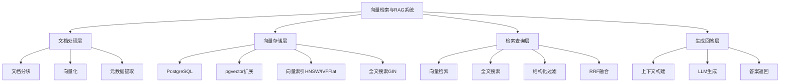

---

> **📋 文档来源**: `PostgreSQL\09-应用设计\行业案例\向量检索与RAG.md`
> **📅 复制日期**: 2025-12-22
> **⚠️ 注意**: 本文档为复制版本，原文件保持不变

---

# 向量检索与RAG系统案例：PostgreSQL + pgvector实践

> **版本**: PostgreSQL 18.x + pgvector 2.0
> **最后更新**: 2025-01-15
> **难度**: ⭐⭐⭐⭐⭐
> **应用场景**: 知识库检索、智能问答、语义搜索、文档检索

---

## 📑 目录

- [向量检索与RAG系统案例：PostgreSQL + pgvector实践](#向量检索与rag系统案例postgresql--pgvector实践)
  - [📑 目录](#-目录)
  - [一、概述](#一概述)
    - [1.1 业务背景](#11-业务背景)
    - [1.2 技术挑战](#12-技术挑战)
    - [1.3 适用场景](#13-适用场景)
    - [1.4 版本要求](#14-版本要求)
  - [二、核心概念](#二核心概念)
    - [2.1 向量检索](#21-向量检索)
    - [2.2 RAG架构](#22-rag架构)
    - [2.3 混合检索](#23-混合检索)
    - [2.4 思维导图](#24-思维导图)
  - [三、技术架构](#三技术架构)
    - [3.1 整体架构设计](#31-整体架构设计)
    - [3.2 数据流设计](#32-数据流设计)
    - [3.3 存储设计](#33-存储设计)
  - [四、实现方案](#四实现方案)
    - [4.1 pgvector扩展配置](#41-pgvector扩展配置)
    - [4.2 向量索引设计](#42-向量索引设计)
    - [4.3 混合检索实现](#43-混合检索实现)
    - [4.4 批量导入优化](#44-批量导入优化)
    - [4.5 近实时更新策略](#45-近实时更新策略)
  - [五、知识矩阵对比](#五知识矩阵对比)
    - [5.1 索引算法对比](#51-索引算法对比)
    - [5.2 技术方案对比](#52-技术方案对比)
    - [5.3 性能对比](#53-性能对比)
  - [六、实践案例](#六实践案例)
    - [6.1 知识库检索系统](#61-知识库检索系统)
    - [6.2 智能问答系统](#62-智能问答系统)
    - [6.3 语义搜索系统](#63-语义搜索系统)
  - [七、性能优化](#七性能优化)
    - [7.1 索引参数调优](#71-索引参数调优)
    - [7.2 查询优化](#72-查询优化)
    - [7.3 延迟与召回权衡](#73-延迟与召回权衡)
  - [八、监控与验证](#八监控与验证)
    - [8.1 关键指标](#81-关键指标)
    - [8.2 监控方案](#82-监控方案)
    - [8.3 验证方法](#83-验证方法)
  - [九、最佳实践](#九最佳实践)
  - [十、参考资源](#十参考资源)
    - [10.1 官方文档](#101-官方文档)
    - [10.2 网络资源](#102-网络资源)
    - [10.3 学术论文](#103-学术论文)
    - [10.4 相关案例](#104-相关案例)
  - [十一、交叉引用](#十一交叉引用)
    - [相关文档](#相关文档)
    - [外部资源](#外部资源)

---

## 一、概述

### 1.1 业务背景

向量检索与RAG（Retrieval-Augmented Generation）系统是现代AI应用的核心基础设施，广泛应用于知识库检索、智能问答、语义搜索等场景。PostgreSQL通过pgvector扩展提供了强大的向量检索能力，结合其成熟的关系数据库特性，成为构建RAG系统的理想选择。

**典型业务场景**：

- **知识库检索**：企业内部知识库、技术文档库的语义检索
- **智能问答**：基于文档的问答系统、客服机器人
- **语义搜索**：电商商品搜索、内容推荐
- **文档检索**：法律文档检索、医疗文献检索

**业务价值**：

- 提升搜索准确度和相关性
- 支持自然语言查询
- 降低AI模型成本（通过检索减少上下文长度）
- 提供可解释的检索结果

### 1.2 技术挑战

向量检索与RAG系统面临以下技术挑战：

1. **高维向量存储**
   - 向量维度通常为384-1536维
   - 大规模数据存储和索引

2. **检索性能**
   - 低延迟要求（<100ms）
   - 高召回率要求（>95%）
   - 高QPS要求（>1000 QPS）

3. **混合检索**
   - 向量检索 + 全文搜索
   - 向量检索 + 结构化过滤
   - 多路召回融合（RRF）

4. **数据更新**
   - 近实时更新（分钟级）
   - 批量导入性能
   - 索引重建成本

5. **资源消耗**
   - 内存占用（HNSW索引）
   - 存储空间（向量数据）
   - CPU计算（相似度计算）

### 1.3 适用场景

本案例适用于以下场景：

- ✅ **中小型知识库**（文档数 < 1000万）
- ✅ **中等查询量**（QPS < 5000）
- ✅ **延迟要求适中**（<200ms）
- ✅ **需要混合检索**（向量+全文+结构化）

不适用于以下场景：

- ❌ **超大规模系统**（文档数 > 1亿）
- ❌ **极低延迟要求**（<10ms）
- ❌ **纯向量检索**（不需要关系数据库特性）

### 1.4 版本要求

- **PostgreSQL 18.x**（推荐）- 支持异步I/O，向量检索性能提升2-3倍
- **pgvector 2.0+**（推荐）- 支持HNSW、IVFFlat、PQ等索引算法
- **PostgreSQL 17.x**（兼容）- 基础功能可用
- **PostgreSQL 16.x**（部分支持）- 基础功能可用

---

## 二、核心概念

### 2.1 向量检索

**向量检索**（Vector Search）是一种基于向量相似度的检索方法，通过计算查询向量与文档向量的相似度来找到最相关的文档。

**核心概念**：

- **向量嵌入**（Embedding）：将文本、图像等数据转换为高维向量
- **相似度度量**：L2距离、内积、余弦相似度
- **近似最近邻**（ANN）：在大规模数据中快速找到相似向量

**在PostgreSQL中的应用**：

- **pgvector扩展**：提供`vector(n)`类型和向量操作符
- **向量索引**：HNSW、IVFFlat、PQ等索引算法
- **相似度查询**：`<->`（L2/余弦）、`<#>`（内积）操作符

### 2.2 RAG架构

**RAG**（Retrieval-Augmented Generation）是一种结合检索和生成的AI架构，通过向量数据库检索相关文档，然后输入给LLM生成答案。

**核心流程**：

1. **文档处理**：文档分块、向量化
2. **向量存储**：存储到PostgreSQL + pgvector
3. **查询检索**：用户查询向量化，检索相关文档
4. **上下文构建**：将检索到的文档作为上下文
5. **答案生成**：LLM基于上下文生成答案

**优势**：

- 减少幻觉（基于真实文档）
- 可解释性（提供来源）
- 成本控制（减少上下文长度）
- 知识更新（更新文档即可）

### 2.3 混合检索

**混合检索**（Hybrid Search）结合多种检索方式，提升检索效果：

- **向量检索**：语义相似度
- **全文搜索**：关键词匹配
- **结构化过滤**：元数据过滤

**融合方法**：

- **RRF**（Reciprocal Rank Fusion）：多路召回结果融合
- **加权融合**：不同检索方式加权组合
- **重排序**：基于多特征重新排序

### 2.4 思维导图



---

## 三、技术架构

### 3.1 整体架构设计

```text
┌─────────────┐
│  文档输入    │
│ (PDF/Word)  │
└──────┬──────┘
       │
       ▼
┌─────────────┐
│ 文档处理     │  ← 分块、向量化
│ (LangChain) │
└──────┬──────┘
       │
       ▼
┌─────────────┐
│ PostgreSQL  │  ← 向量存储
│ + pgvector  │
│  - 文档表    │
│  - 向量索引  │
│  - 全文索引  │
└──────┬──────┘
       │
       ▼
┌─────────────┐
│ 检索服务     │  ← 混合检索
│ (FastAPI)   │
└──────┬──────┘
       │
       ▼
┌─────────────┐
│ LLM生成     │  ← 答案生成
│ (OpenAI)    │
└─────────────┘
```

### 3.2 数据流设计

**数据流路径**：

1. **文档处理**
   - 文档上传和解析
   - 文档分块（chunking）
   - 向量化（embedding）
   - 元数据提取

2. **向量存储**
   - 存储文档块和向量
   - 创建向量索引
   - 创建全文搜索索引
   - 创建元数据索引

3. **查询检索**
   - 用户查询向量化
   - 向量相似度检索
   - 全文搜索
   - 结构化过滤
   - RRF融合

4. **答案生成**
   - 构建上下文
   - 调用LLM生成答案
   - 返回答案和来源

### 3.3 存储设计

**核心表结构**：

```sql
-- 安装pgvector扩展
CREATE EXTENSION IF NOT EXISTS vector;

-- 文档表
CREATE TABLE documents (
    id BIGSERIAL PRIMARY KEY,
    title TEXT NOT NULL,
    content TEXT NOT NULL,

    -- 文档分块信息
    chunk_index INT DEFAULT 0,
    chunk_total INT DEFAULT 1,
    parent_doc_id BIGINT,

    -- 元数据
    source TEXT,
    category TEXT,
    tags TEXT[],
    metadata JSONB DEFAULT '{}'::jsonb,

    -- 全文搜索向量（自动生成）
    content_tsv TSVECTOR GENERATED ALWAYS AS (
        to_tsvector('simple', coalesce(title, '') || ' ' || coalesce(content, ''))
    ) STORED,

    -- 向量嵌入（1536维，OpenAI text-embedding-3-large）
    embedding vector(1536),

    -- 时间戳
    created_at TIMESTAMPTZ DEFAULT NOW(),
    updated_at TIMESTAMPTZ DEFAULT NOW()
);

-- 创建全文搜索索引（GIN）
CREATE INDEX idx_docs_tsv ON documents USING GIN (content_tsv);

-- 创建向量索引（HNSW，PostgreSQL 18 异步 I/O 提升性能 2-3 倍）
CREATE INDEX idx_docs_embed ON documents USING hnsw (embedding vector_cosine_ops)
WITH (m = 16, ef_construction = 64);

-- 创建元数据索引
CREATE INDEX idx_docs_category ON documents (category);
CREATE INDEX idx_docs_tags ON documents USING GIN (tags);
CREATE INDEX idx_docs_source ON documents (source);
CREATE INDEX idx_docs_parent ON documents (parent_doc_id);
```

---

## 四、实现方案

### 4.1 pgvector扩展配置

**安装pgvector扩展**：

```sql
-- 安装扩展
CREATE EXTENSION IF NOT EXISTS vector;

-- 查看版本
SELECT extversion FROM pg_extension WHERE extname = 'vector';

-- 配置参数（PostgreSQL 18+）
-- 启用异步I/O提升向量检索性能
ALTER SYSTEM SET max_parallel_workers_per_gather = 4;
ALTER SYSTEM SET maintenance_work_mem = '2GB';
SELECT pg_reload_conf();
```

### 4.2 向量索引设计

**HNSW索引**（推荐用于高召回率场景）：

```sql
-- HNSW索引配置
CREATE INDEX idx_docs_embed_hnsw ON documents
USING hnsw (embedding vector_cosine_ops)
WITH (
    m = 16,              -- 每个节点的连接数（4-64，默认16）
    ef_construction = 64 -- 构建时的搜索范围（10-1000，默认64）
);

-- 查询时设置ef_search参数
SET hnsw.ef_search = 100;  -- 查询时的搜索范围（默认40）
```

**IVFFlat索引**（推荐用于大规模数据）：

```sql
-- IVFFlat索引配置
CREATE INDEX idx_docs_embed_ivfflat ON documents
USING ivfflat (embedding vector_cosine_ops)
WITH (lists = 100);  -- 聚类中心数（建议：rows/1000 到 rows/10000）

-- 查询时设置probes参数
SET ivfflat.probes = 10;  -- 搜索的聚类数（1到lists，默认1）
```

**索引选择建议**：

| 场景 | 推荐索引 | 原因 |
|------|---------|------|
| 高召回率要求 | HNSW | 召回率高，查询快 |
| 大规模数据 | IVFFlat | 内存占用小，适合大规模 |
| 批量查询 | IVFFlat | 批量查询性能好 |
| 实时更新 | HNSW | 支持增量更新 |

### 4.3 混合检索实现

**向量检索 + 全文搜索 + 结构化过滤**：

```sql
-- 混合检索查询
WITH vector_results AS (
    -- 向量检索
    SELECT
        id,
        title,
        content,
        embedding <-> '[0.1,0.2,...]'::vector AS vector_distance,
        1.0 / (1.0 + (embedding <-> '[0.1,0.2,...]'::vector)) AS vector_score
    FROM documents
    WHERE embedding <-> '[0.1,0.2,...]'::vector < 0.5  -- 相似度阈值
    ORDER BY embedding <-> '[0.1,0.2,...]'::vector
    LIMIT 100
),
text_results AS (
    -- 全文搜索
    SELECT
        id,
        title,
        content,
        ts_rank(content_tsv, plainto_tsquery('simple', '查询关键词')) AS text_score
    FROM documents
    WHERE content_tsv @@ plainto_tsquery('simple', '查询关键词')
    ORDER BY text_score DESC
    LIMIT 100
),
combined_results AS (
    -- RRF融合
    SELECT
        COALESCE(v.id, t.id) AS id,
        COALESCE(v.title, t.title) AS title,
        COALESCE(v.content, t.content) AS content,
        COALESCE(1.0 / (60 + v.rank), 0) + COALESCE(1.0 / (60 + t.rank), 0) AS rrf_score
    FROM (
        SELECT id, title, content, ROW_NUMBER() OVER (ORDER BY vector_distance) AS rank
        FROM vector_results
    ) v
    FULL OUTER JOIN (
        SELECT id, title, content, ROW_NUMBER() OVER (ORDER BY text_score DESC) AS rank
        FROM text_results
    ) t ON v.id = t.id
    WHERE COALESCE(v.id, t.id) IN (
        SELECT id FROM documents
        WHERE category = '技术文档'  -- 结构化过滤
          AND 'PostgreSQL' = ANY(tags)
    )
)
SELECT id, title, content, rrf_score
FROM combined_results
ORDER BY rrf_score DESC
LIMIT 10;
```

**RRF融合函数**：

```sql
-- 创建RRF融合函数
CREATE OR REPLACE FUNCTION rrf_fusion(
    vector_rank INT,
    text_rank INT,
    k INT DEFAULT 60
)
RETURNS NUMERIC AS $$
    SELECT
        COALESCE(1.0 / (k + vector_rank), 0) +
        COALESCE(1.0 / (k + text_rank), 0);
$$ LANGUAGE sql IMMUTABLE;
```

### 4.4 批量导入优化

**批量导入策略**：

```python
# Python批量导入示例
import psycopg2
from psycopg2.extras import execute_batch
import numpy as np

def batch_import_documents(documents, embeddings, batch_size=1000):
    conn = psycopg2.connect("dbname=rag_db user=postgres")
    cur = conn.cursor()

    # 1. 先导入数据（不创建索引）
    for i in range(0, len(documents), batch_size):
        batch_docs = documents[i:i+batch_size]
        batch_embeddings = embeddings[i:i+batch_size]

        execute_batch(
            cur,
            """INSERT INTO documents (title, content, embedding, category, tags)
               VALUES (%s, %s, %s::vector, %s, %s)""",
            [(doc['title'], doc['content'],
              '[' + ','.join(map(str, emb)) + ']',
              doc.get('category'), doc.get('tags', []))
             for doc, emb in zip(batch_docs, batch_embeddings)],
            page_size=batch_size
        )

        if i % 10000 == 0:
            conn.commit()
            print(f"Imported {i} documents")

    conn.commit()

    # 2. 创建索引（在数据导入后）
    print("Creating vector index...")
    cur.execute("""
        CREATE INDEX CONCURRENTLY idx_docs_embed_hnsw
        ON documents USING hnsw (embedding vector_cosine_ops)
        WITH (m = 16, ef_construction = 64);
    """)

    conn.commit()
    cur.close()
    conn.close()
```

**使用COPY命令批量导入**：

```python
# 使用COPY命令（更快）
import psycopg2
from io import StringIO

def copy_import_documents(documents, embeddings):
    conn = psycopg2.connect("dbname=rag_db user=postgres")
    cur = conn.cursor()

    # 准备数据
    data = StringIO()
    for doc, emb in zip(documents, embeddings):
        data.write(f"{doc['title']}\t{doc['content']}\t"
                  f"[{','.join(map(str, emb))}]\t"
                  f"{doc.get('category', '')}\t"
                  f"{{{','.join(doc.get('tags', []))}}}\n")
    data.seek(0)

    # 使用COPY命令
    cur.copy_from(
        data,
        'documents',
        columns=('title', 'content', 'embedding', 'category', 'tags')
    )

    conn.commit()
    cur.close()
    conn.close()
```

### 4.5 近实时更新策略

**增量更新策略**：

```sql
-- 创建更新函数
CREATE OR REPLACE FUNCTION update_document_embedding(
    doc_id BIGINT,
    new_embedding vector(1536)
)
RETURNS void AS $$
BEGIN
    UPDATE documents
    SET embedding = new_embedding,
        updated_at = NOW()
    WHERE id = doc_id;

    -- HNSW索引支持增量更新，无需重建
    -- IVFFlat索引需要定期重建
END;
$$ LANGUAGE plpgsql;

-- 定期重建IVFFlat索引（如果需要）
CREATE OR REPLACE FUNCTION rebuild_ivfflat_index()
RETURNS void AS $$
BEGIN
    DROP INDEX IF EXISTS idx_docs_embed_ivfflat;
    CREATE INDEX idx_docs_embed_ivfflat
    ON documents USING ivfflat (embedding vector_cosine_ops)
    WITH (lists = 100);
END;
$$ LANGUAGE plpgsql;
```

---

## 五、知识矩阵对比

### 5.1 索引算法对比

| 维度 | HNSW | IVFFlat | PQ/IVFPQ | 推荐场景 |
|------|------|---------|----------|---------|
| **召回率** | ⭐⭐⭐⭐⭐ 95%+ | ⭐⭐⭐⭐ 90-95% | ⭐⭐⭐ 85-90% | HNSW适合高召回率 |
| **查询速度** | ⭐⭐⭐⭐⭐ 快 | ⭐⭐⭐⭐ 较快 | ⭐⭐⭐ 中等 | HNSW查询最快 |
| **内存占用** | ⭐⭐ 高 | ⭐⭐⭐⭐ 中等 | ⭐⭐⭐⭐⭐ 低 | PQ适合内存受限 |
| **索引构建** | ⭐⭐⭐⭐ 较快 | ⭐⭐⭐⭐⭐ 快 | ⭐⭐⭐ 慢 | IVFFlat构建最快 |
| **更新支持** | ⭐⭐⭐⭐⭐ 支持增量 | ⭐⭐ 需重建 | ⭐⭐ 需重建 | HNSW更新友好 |
| **数据规模** | <1000万 | <1亿 | <10亿 | 根据规模选择 |
| **适用场景** | 高召回率、实时更新 | 大规模数据、批量查询 | 超大规模、内存受限 | 根据需求选择 |

### 5.2 技术方案对比

| 维度 | PostgreSQL+pgvector | 专用向量数据库 | 混合方案 | 推荐场景 |
|------|-------------------|--------------|---------|---------|
| **向量检索** | ⭐⭐⭐⭐ 优秀 | ⭐⭐⭐⭐⭐ 卓越 | ⭐⭐⭐⭐⭐ 卓越 | 专用向量数据库性能最好 |
| **关系查询** | ⭐⭐⭐⭐⭐ 卓越 | ⭐⭐ 有限 | ⭐⭐⭐⭐ 良好 | PostgreSQL关系查询最强 |
| **混合检索** | ⭐⭐⭐⭐⭐ 原生支持 | ⭐⭐⭐ 需集成 | ⭐⭐⭐⭐ 良好 | PostgreSQL混合检索最好 |
| **运维复杂度** | ⭐⭐⭐⭐⭐ 低 | ⭐⭐⭐ 中 | ⭐⭐ 高 | PostgreSQL运维最简单 |
| **成本** | ⭐⭐⭐⭐⭐ 低 | ⭐⭐⭐ 中 | ⭐⭐ 高 | PostgreSQL成本最低 |
| **扩展性** | ⭐⭐⭐ 垂直扩展 | ⭐⭐⭐⭐⭐ 水平扩展 | ⭐⭐⭐⭐ 良好 | 专用向量数据库扩展最好 |
| **适用场景** | 中小规模、混合检索 | 超大规模、纯向量 | 大规模、复杂需求 | 根据场景选择 |

### 5.3 性能对比

| 指标 | HNSW | IVFFlat | PQ |
|------|------|---------|-----|
| **查询延迟** | 10-50ms | 50-200ms | 100-500ms |
| **召回率@10** | 95%+ | 90-95% | 85-90% |
| **索引大小** | 2-3x向量大小 | 1.5-2x向量大小 | 0.3-0.5x向量大小 |
| **构建时间** | 中等 | 快 | 慢 |
| **内存占用** | 高 | 中等 | 低 |

---

## 六、实践案例

### 6.1 知识库检索系统

**业务场景**：

- 企业内部技术文档库
- 支持语义搜索和关键词搜索
- 文档数：10万+

**实现方案**：

```sql
-- 知识库文档表
CREATE TABLE kb_documents (
    id BIGSERIAL PRIMARY KEY,
    title TEXT NOT NULL,
    content TEXT NOT NULL,
    doc_type TEXT,  -- 'api', 'tutorial', 'faq'
    section TEXT,
    embedding vector(1536),
    content_tsv TSVECTOR GENERATED ALWAYS AS (
        to_tsvector('english', coalesce(title, '') || ' ' || coalesce(content, ''))
    ) STORED,
    created_at TIMESTAMPTZ DEFAULT NOW()
);

-- 创建索引
CREATE INDEX idx_kb_embed ON kb_documents
USING hnsw (embedding vector_cosine_ops)
WITH (m = 16, ef_construction = 64);

CREATE INDEX idx_kb_tsv ON kb_documents USING GIN (content_tsv);
CREATE INDEX idx_kb_type ON kb_documents (doc_type);

-- 混合检索查询
WITH vector_search AS (
    SELECT id, title, content,
           embedding <-> $1::vector AS distance,
           ROW_NUMBER() OVER (ORDER BY embedding <-> $1::vector) AS v_rank
    FROM kb_documents
    WHERE embedding <-> $1::vector < 0.5
    LIMIT 50
),
text_search AS (
    SELECT id, title, content,
           ts_rank(content_tsv, plainto_tsquery('english', $2)) AS score,
           ROW_NUMBER() OVER (ORDER BY ts_rank(content_tsv, plainto_tsquery('english', $2)) DESC) AS t_rank
    FROM kb_documents
    WHERE content_tsv @@ plainto_tsquery('english', $2)
    LIMIT 50
)
SELECT
    COALESCE(v.id, t.id) AS id,
    COALESCE(v.title, t.title) AS title,
    COALESCE(v.content, t.content) AS content,
    rrf_fusion(COALESCE(v.v_rank, 999), COALESCE(t.t_rank, 999)) AS rrf_score
FROM vector_search v
FULL OUTER JOIN text_search t ON v.id = t.id
ORDER BY rrf_score DESC
LIMIT 10;
```

### 6.2 智能问答系统

**业务场景**：

- 基于文档的问答系统
- 支持多轮对话
- 提供答案来源

**实现方案**：

```python
# Python实现示例
import psycopg2
import openai
from langchain.text_splitter import RecursiveCharacterTextSplitter

def retrieve_context(query: str, top_k: int = 5):
    """检索相关文档"""
    conn = psycopg2.connect("dbname=rag_db user=postgres")
    cur = conn.cursor()

    # 1. 查询向量化
    query_embedding = openai.Embedding.create(
        input=query,
        model="text-embedding-3-large"
    )['data'][0]['embedding']

    # 2. 向量检索
    cur.execute("""
        SELECT id, title, content,
               embedding <-> %s::vector AS distance
        FROM documents
        ORDER BY embedding <-> %s::vector
        LIMIT %s
    """, (str(query_embedding), str(query_embedding), top_k))

    results = cur.fetchall()
    cur.close()
    conn.close()

    return results

def generate_answer(query: str, context_docs: list):
    """生成答案"""
    # 构建上下文
    context = "\n\n".join([f"文档{i+1}: {doc[2]}" for i, doc in enumerate(context_docs)])

    # 调用LLM生成答案
    response = openai.ChatCompletion.create(
        model="gpt-4",
        messages=[
            {"role": "system", "content": "你是一个基于文档的问答助手，请根据提供的文档回答问题。"},
            {"role": "user", "content": f"上下文：\n{context}\n\n问题：{query}"}
        ]
    )

    answer = response['choices'][0]['message']['content']
    sources = [{"id": doc[0], "title": doc[1]} for doc in context_docs]

    return answer, sources
```

### 6.3 语义搜索系统

**业务场景**：

- 电商商品语义搜索
- 支持自然语言查询
- 结合商品属性过滤

**实现方案**：

```sql
-- 商品表
CREATE TABLE products (
    id BIGSERIAL PRIMARY KEY,
    name TEXT NOT NULL,
    description TEXT,
    category TEXT,
    price NUMERIC,
    embedding vector(1536),
    description_tsv TSVECTOR GENERATED ALWAYS AS (
        to_tsvector('english', coalesce(name, '') || ' ' || coalesce(description, ''))
    ) STORED
);

-- 创建索引
CREATE INDEX idx_products_embed ON products
USING hnsw (embedding vector_cosine_ops)
WITH (m = 16, ef_construction = 64);

CREATE INDEX idx_products_tsv ON products USING GIN (description_tsv);
CREATE INDEX idx_products_category ON products (category);
CREATE INDEX idx_products_price ON products (price);

-- 语义搜索查询（带属性过滤）
SELECT
    id,
    name,
    description,
    price,
    embedding <-> $1::vector AS distance,
    ts_rank(description_tsv, plainto_tsquery('english', $2)) AS text_score
FROM products
WHERE category = $3  -- 类别过滤
  AND price BETWEEN $4 AND $5  -- 价格过滤
  AND (embedding <-> $1::vector < 0.6  -- 向量相似度
       OR description_tsv @@ plainto_tsquery('english', $2))  -- 全文搜索
ORDER BY
    (embedding <-> $1::vector) * 0.7 +  -- 向量权重70%
    (1.0 - ts_rank(description_tsv, plainto_tsquery('english', $2))) * 0.3  -- 文本权重30%
LIMIT 20;
```

---

## 七、性能优化

### 7.1 索引参数调优

**HNSW参数调优**：

```sql
-- m参数：每个节点的连接数
-- 越大：召回率越高，但索引更大、构建更慢
-- 推荐值：4-64，默认16
CREATE INDEX idx_docs_embed_hnsw ON documents
USING hnsw (embedding vector_cosine_ops)
WITH (m = 32);  -- 提高召回率

-- ef_construction参数：构建时的搜索范围
-- 越大：索引质量越高，但构建更慢
-- 推荐值：10-1000，默认64
CREATE INDEX idx_docs_embed_hnsw ON documents
USING hnsw (embedding vector_cosine_ops)
WITH (m = 16, ef_construction = 200);  -- 提高索引质量

-- ef_search参数：查询时的搜索范围
-- 越大：召回率越高，但查询更慢
-- 推荐值：40-1000，默认40
SET hnsw.ef_search = 100;  -- 提高召回率
```

**IVFFlat参数调优**：

```sql
-- lists参数：聚类中心数
-- 推荐值：rows/1000 到 rows/10000
-- 例如：100万行数据，lists = 100-1000
CREATE INDEX idx_docs_embed_ivfflat ON documents
USING ivfflat (embedding vector_cosine_ops)
WITH (lists = 500);

-- probes参数：搜索的聚类数
-- 越大：召回率越高，但查询更慢
-- 推荐值：1到lists，默认1
SET ivfflat.probes = 10;  -- 搜索10个聚类
```

### 7.2 查询优化

**查询优化技巧**：

```sql
-- 1. 使用LIMIT减少计算
SELECT id, title, embedding <-> $1::vector AS distance
FROM documents
ORDER BY embedding <-> $1::vector
LIMIT 10;  -- 限制返回数量

-- 2. 使用阈值过滤
SELECT id, title, embedding <-> $1::vector AS distance
FROM documents
WHERE embedding <-> $1::vector < 0.5  -- 相似度阈值
ORDER BY embedding <-> $1::vector
LIMIT 10;

-- 3. 结合结构化过滤
SELECT id, title, embedding <-> $1::vector AS distance
FROM documents
WHERE category = '技术文档'  -- 先过滤
  AND embedding <-> $1::vector < 0.5
ORDER BY embedding <-> $1::vector
LIMIT 10;

-- 4. 使用覆盖索引（PostgreSQL 18+）
CREATE INDEX idx_docs_embed_covering ON documents
USING hnsw (embedding vector_cosine_ops)
INCLUDE (id, title, content);
```

### 7.3 延迟与召回权衡

**延迟与召回权衡策略**：

| 场景 | ef_search/probes | 召回率 | 延迟 | 推荐 |
|------|-----------------|--------|------|------|
| **低延迟优先** | 40/1 | 85-90% | <50ms | 实时搜索 |
| **平衡** | 100/10 | 90-95% | 50-200ms | 一般搜索 |
| **高召回优先** | 200/50 | 95%+ | 200-500ms | 精确搜索 |

**动态调整策略**：

```sql
-- 根据查询类型动态调整
CREATE OR REPLACE FUNCTION search_documents(
    query_embedding vector(1536),
    search_type TEXT DEFAULT 'balanced'
)
RETURNS TABLE(id BIGINT, title TEXT, distance FLOAT) AS $$
BEGIN
    -- 根据搜索类型设置参数
    IF search_type = 'fast' THEN
        SET LOCAL hnsw.ef_search = 40;
    ELSIF search_type = 'balanced' THEN
        SET LOCAL hnsw.ef_search = 100;
    ELSIF search_type = 'accurate' THEN
        SET LOCAL hnsw.ef_search = 200;
    END IF;

    RETURN QUERY
    SELECT d.id, d.title, d.embedding <-> query_embedding AS distance
    FROM documents d
    ORDER BY d.embedding <-> query_embedding
    LIMIT 10;
END;
$$ LANGUAGE plpgsql;
```

---

## 八、监控与验证

### 8.1 关键指标

**性能指标**：

- **查询延迟**：P50, P95, P99延迟
- **查询QPS**：每秒查询请求数
- **召回率@K**：Top-K召回率
- **索引大小**：向量索引占用空间

**业务指标**：

- **检索准确度**：用户点击率、满意度
- **检索覆盖率**：检索到的相关文档比例
- **更新延迟**：文档更新到可检索的延迟

### 8.2 监控方案

**使用pg_stat_statements监控查询**：

```sql
-- 启用pg_stat_statements
CREATE EXTENSION IF NOT EXISTS pg_stat_statements;

-- 查看向量检索查询统计
SELECT
    query,
    calls,
    total_exec_time,
    mean_exec_time,
    max_exec_time
FROM pg_stat_statements
WHERE query LIKE '%<->%'  -- 向量相似度查询
   OR query LIKE '%<#%'   -- 向量内积查询
ORDER BY mean_exec_time DESC
LIMIT 10;
```

**监控索引使用情况**：

```sql
-- 查看索引大小
SELECT
    schemaname,
    tablename,
    indexname,
    pg_size_pretty(pg_relation_size(indexrelid)) AS index_size
FROM pg_stat_user_indexes
WHERE indexname LIKE '%embed%'
ORDER BY pg_relation_size(indexrelid) DESC;
```

### 8.3 验证方法

**召回率验证**：

```python
# Python召回率验证
def validate_recall(query_embeddings, ground_truth, top_k=10):
    """验证召回率"""
    recalls = []

    for query_emb, gt_ids in zip(query_embeddings, ground_truth):
        # 执行查询
        results = search_documents(query_emb, top_k=top_k)
        retrieved_ids = [r[0] for r in results]

        # 计算召回率
        recall = len(set(retrieved_ids) & set(gt_ids)) / len(gt_ids)
        recalls.append(recall)

    return {
        'mean_recall': np.mean(recalls),
        'p95_recall': np.percentile(recalls, 95),
        'p99_recall': np.percentile(recalls, 99)
    }
```

**性能验证**：

```sql
-- 查询性能测试
EXPLAIN (ANALYZE, BUFFERS, VERBOSE)
SELECT id, title, embedding <-> '[0.1,0.2,...]'::vector AS distance
FROM documents
ORDER BY embedding <-> '[0.1,0.2,...]'::vector
LIMIT 10;
```

---

## 九、最佳实践

1. **索引选择**
   - 高召回率要求：使用HNSW
   - 大规模数据：使用IVFFlat
   - 内存受限：使用PQ/IVFPQ

2. **参数调优**
   - 根据数据规模和查询需求调整参数
   - 平衡召回率和延迟
   - 定期测试和优化

3. **混合检索**
   - 结合向量检索和全文搜索
   - 使用RRF融合多路召回
   - 根据业务需求调整权重

4. **批量导入**
   - 先导入数据，后创建索引
   - 使用COPY命令提升性能
   - 分批导入避免内存溢出

5. **更新策略**
   - HNSW支持增量更新
   - IVFFlat需要定期重建
   - 监控索引质量

6. **监控告警**
   - 监控查询延迟和QPS
   - 监控召回率
   - 设置告警阈值

---

## 十、参考资源

### 10.1 官方文档

- [pgvector官方文档](https://github.com/pgvector/pgvector)
- [PostgreSQL全文搜索文档](https://www.postgresql.org/docs/current/textsearch.html)
- [PostgreSQL索引文档](https://www.postgresql.org/docs/current/indexes.html)

### 10.2 网络资源

- [pgvector性能调优指南](https://github.com/pgvector/pgvector#performance)
- [RAG架构最佳实践](https://www.pinecone.io/learn/retrieval-augmented-generation/)
- [混合检索实现](https://www.elastic.co/guide/en/elasticsearch/reference/current/hybrid-search.html)

### 10.3 学术论文

- "Efficient and Robust Approximate Nearest Neighbor Search Using Hierarchical Navigable Small World Graphs" - Y. Malkov, 2016
- "Retrieval-Augmented Generation for Knowledge-Intensive NLP Tasks" - Lewis et al., 2020

### 10.4 相关案例

- [Supabase向量搜索案例](https://supabase.com/docs/guides/ai/vector-columns)
- [LangChain PostgreSQL集成](https://python.langchain.com/docs/integrations/vectorstores/pgvector)

---

## 十一、交叉引用

### 相关文档

- ⭐⭐⭐ [向量数据库支持](../../03-高级特性/03.05-向量数据库支持.md) - pgvector详细说明
- ⭐⭐ [数据分析完整指南](../数据模型设计/09.01-数据分析完整指南.md) - 向量数据分析
- ⭐⭐ [数据建模完整指南](../数据模型设计/09.02-数据建模完整指南.md) - RAG数据建模
- ⭐ [索引结构与优化](../../03-查询与优化/02.02-索引结构与优化.md) - 向量索引优化
- ⭐ [PostgreSQL 18新特性](../../02-版本特性/02.01-PostgreSQL-18-新特性.md) - 异步I/O优化

### 外部资源

- [pgvector官方文档](https://github.com/pgvector/pgvector)
- [PostgreSQL全文搜索文档](https://www.postgresql.org/docs/current/textsearch.html)
- [RAG架构最佳实践](https://www.pinecone.io/learn/retrieval-augmented-generation/)

---

**文档版本**: v1.0
**最后更新**: 2025-11-22
**PostgreSQL版本**: 18.x (推荐) ⭐ | 17.x (推荐) | 16.x (兼容)
**维护者**: Data-Science Team
