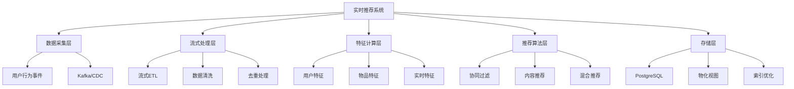

---

> **📋 文档来源**: `PostgreSQL\09-应用设计\行业案例\实时推荐.md`
> **📅 复制日期**: 2025-12-22
> **⚠️ 注意**: 本文档为复制版本，原文件保持不变

---

# 实时推荐系统案例：PostgreSQL流式处理与物化视图实践

> **版本**: PostgreSQL 18.x
> **最后更新**: 2025-01-15
> **难度**: ⭐⭐⭐⭐
> **应用场景**: 电商推荐、内容推荐、广告推荐

---

## 📑 目录

- [1.1 业务背景](#11-业务背景)
- [1.2 技术挑战](#12-技术挑战)
- [1.3 适用场景](#13-适用场景)
- [1.4 版本要求](#14-版本要求)
- [2.1 实时推荐系统架构](#21-实时推荐系统架构)
- [2.2 流式ETL处理](#22-流式etl处理)
- [2.3 物化视图与增量聚合](#23-物化视图与增量聚合)
- [2.4 思维导图](#24-思维导图)
- [3.1 整体架构设计](#31-整体架构设计)
- [3.2 数据流设计](#32-数据流设计)
- [3.3 存储设计](#33-存储设计)
- [4.1 流式ETL实现](#41-流式etl实现)
- [4.2 物化视图设计](#42-物化视图设计)
- [4.3 增量聚合策略](#43-增量聚合策略)
- [4.4 热点写入优化](#44-热点写入优化)
- [5.1 技术方案对比](#51-技术方案对比)
- [5.2 性能对比](#52-性能对比)
- [6.1 电商实时推荐](#61-电商实时推荐)
- [6.2 内容推荐系统](#62-内容推荐系统)
- [7.1 查询优化](#71-查询优化)
- [7.2 写入优化](#72-写入优化)
- [7.3 物化视图刷新优化](#73-物化视图刷新优化)
- [8.1 关键指标](#81-关键指标)
- [8.2 监控方案](#82-监控方案)
- [8.3 验证方法](#83-验证方法)
- [10.1 官方文档](#101-官方文档)
- [10.2 网络资源](#102-网络资源)
- [10.3 学术论文](#103-学术论文)
- [10.4 相关案例](#104-相关案例)
- [相关文档](#相关文档)
- [外部资源](#外部资源)
---

## 一、概述

### 1.1 业务背景

实时推荐系统是现代互联网应用的核心功能之一，广泛应用于电商、内容平台、社交媒体等领域。与传统的离线推荐系统不同，实时推荐系统需要在用户行为发生后几秒到几分钟内更新推荐结果，以提供更精准、更及时的个性化推荐。

**典型业务场景**：

- **电商平台**：用户浏览商品后，实时推荐相关商品
- **内容平台**：用户阅读文章后，实时推荐相似内容
- **视频平台**：用户观看视频后，实时推荐相关视频
- **社交平台**：用户互动后，实时推荐可能感兴趣的用户或内容

**业务价值**：

- 提升用户参与度和停留时间
- 增加转化率和收入
- 改善用户体验和满意度

### 1.2 技术挑战

实时推荐系统面临以下技术挑战：

1. **低延迟要求**
   - 推荐结果需要在秒级内返回
   - 数据更新需要在分钟级内生效

2. **高并发处理**
   - 需要处理大量用户行为事件
   - 需要支持高QPS的查询请求

3. **数据一致性**
   - 流式数据处理的一致性保证
   - 物化视图与源数据的一致性

4. **热点写入**
   - 热门商品/内容的高频更新
   - 写入性能瓶颈

5. **计算复杂度**
   - 实时特征计算
   - 推荐算法计算

### 1.3 适用场景

本案例适用于以下场景：

- ✅ **中小型推荐系统**（日活用户 < 1000万）
- ✅ **实时性要求高**（延迟 < 5秒）
- ✅ **数据量适中**（单表数据 < 10亿）
- ✅ **预算有限**（需要低成本方案）

不适用于以下场景：

- ❌ **超大规模系统**（日活用户 > 1亿）
- ❌ **极低延迟要求**（延迟 < 100ms）
- ❌ **复杂推荐算法**（需要深度学习模型）

### 1.4 版本要求

- **PostgreSQL 18.x**（推荐）- 支持异步I/O、虚拟生成列等新特性
- **PostgreSQL 17.x**（兼容）- 支持物化视图并发刷新
- **PostgreSQL 16.x**（部分支持）- 基础功能可用

---

## 二、核心概念

### 2.1 实时推荐系统架构

**实时推荐系统**是一种基于用户实时行为数据，快速生成个性化推荐结果的系统。其核心特点是：

- **实时性**：推荐结果在用户行为发生后几秒内更新
- **个性化**：基于用户历史行为和实时行为生成个性化推荐
- **动态性**：推荐结果随用户行为变化而动态调整

**关键组件**：

1. **数据采集层**：收集用户行为数据（浏览、点击、购买等）
2. **流式处理层**：实时处理用户行为数据
3. **特征计算层**：计算用户特征和物品特征
4. **推荐算法层**：基于特征生成推荐结果
5. **存储层**：存储用户行为、特征和推荐结果

### 2.2 流式ETL处理

**流式ETL**（Extract, Transform, Load）是指实时地从数据源提取数据，进行转换处理，然后加载到目标系统的过程。

**在实时推荐系统中的应用**：

- **Extract**：从Kafka、CDC等数据源提取用户行为事件
- **Transform**：清洗、去重、聚合用户行为数据
- **Load**：将处理后的数据加载到PostgreSQL

**关键技术**：

- **Kafka Connect**：连接Kafka和PostgreSQL
- **Debezium CDC**：捕获数据库变更
- **PostgreSQL逻辑复制**：实时同步数据

### 2.3 物化视图与增量聚合

**物化视图**（Materialized View）是PostgreSQL中预先计算并存储查询结果的机制，可以显著提升查询性能。

**在实时推荐系统中的应用**：

- **实时聚合**：实时计算用户行为统计（如点击率、购买率）
- **Top-K查询**：预计算热门商品/内容排行榜
- **特征存储**：存储用户特征和物品特征

**增量聚合策略**：

- **CONCURRENTLY刷新**：不阻塞查询的并发刷新
- **增量更新**：只更新变化的部分
- **定时刷新**：按时间间隔自动刷新

### 2.4 思维导图



---

## 三、技术架构

### 3.1 整体架构设计

```text
┌─────────────┐
│  用户行为    │
│  (Web/App)  │
└──────┬──────┘
       │
       ▼
┌─────────────┐
│   Kafka     │  ← 事件流
│  (消息队列)  │
└──────┬──────┘
       │
       ▼
┌─────────────┐
│ 流式ETL处理  │  ← 实时处理
│ (Kafka Connect)│
└──────┬──────┘
       │
       ▼
┌─────────────┐
│ PostgreSQL  │  ← 数据存储
│  - 事件表   │
│  - 物化视图 │
│  - 特征表   │
└──────┬──────┘
       │
       ▼
┌─────────────┐
│ 推荐服务     │  ← 推荐API
│ (FastAPI)   │
└─────────────┘
```

### 3.2 数据流设计

**数据流路径**：

1. **用户行为采集**
   - 用户浏览、点击、购买等行为
   - 通过埋点SDK发送到Kafka

2. **流式处理**
   - Kafka Connect消费事件
   - 数据清洗、去重、转换
   - 写入PostgreSQL事件表

3. **特征计算**
   - 基于事件表计算用户特征
   - 更新物化视图
   - 存储特征到特征表

4. **推荐生成**
   - 查询物化视图获取Top-K
   - 结合用户特征生成推荐
   - 返回推荐结果

### 3.3 存储设计

**核心表结构**：

```sql
-- 用户行为事件表
CREATE TABLE user_events (
    id BIGSERIAL PRIMARY KEY,
    user_id BIGINT NOT NULL,
    item_id BIGINT NOT NULL,
    event_type VARCHAR(50) NOT NULL,  -- click, view, purchase
    event_time TIMESTAMPTZ NOT NULL DEFAULT NOW(),
    score NUMERIC,
    metadata JSONB,
    created_at TIMESTAMPTZ DEFAULT NOW()
);

-- 创建索引
CREATE INDEX idx_user_events_user_time ON user_events(user_id, event_time DESC);
CREATE INDEX idx_user_events_item_time ON user_events(item_id, event_time DESC);
CREATE INDEX idx_user_events_type_time ON user_events(event_type, event_time DESC);

-- 物化视图：实时Top-K商品
CREATE MATERIALIZED VIEW mv_top_items AS
SELECT
    item_id,
    COUNT(*) AS click_count,
    COUNT(DISTINCT user_id) AS user_count,
    AVG(score) AS avg_score,
    MAX(event_time) AS last_event_time
FROM user_events
WHERE event_type = 'click'
  AND event_time > NOW() - INTERVAL '1 hour'
GROUP BY item_id
ORDER BY click_count DESC
LIMIT 1000;

-- 创建唯一索引支持CONCURRENTLY刷新
CREATE UNIQUE INDEX ON mv_top_items(item_id);
```

---

## 四、实现方案

### 4.1 流式ETL实现

**使用Kafka Connect连接PostgreSQL**：

```yaml
# kafka-connect-postgresql配置
{
  "name": "postgresql-sink",
  "config": {
    "connector.class": "io.confluent.connect.jdbc.JdbcSinkConnector",
    "connection.url": "jdbc:postgresql://localhost:5432/recommendation",
    "connection.user": "postgres",
    "connection.password": "password",
    "topics": "user-events",
    "table.name.format": "user_events",
    "insert.mode": "insert",
    "batch.size": "1000",
    "auto.create": "false"
  }
}
```

**使用Debezium CDC捕获变更**：

```sql
-- 启用逻辑复制
ALTER SYSTEM SET wal_level = logical;
SELECT pg_reload_conf();

-- 创建发布
CREATE PUBLICATION user_events_pub FOR TABLE user_events;
```

### 4.2 物化视图设计

**实时聚合物化视图**：

```sql
-- 用户行为统计物化视图
CREATE MATERIALIZED VIEW mv_user_stats AS
SELECT
    user_id,
    COUNT(*) AS total_events,
    COUNT(DISTINCT item_id) AS unique_items,
    COUNT(*) FILTER (WHERE event_type = 'click') AS click_count,
    COUNT(*) FILTER (WHERE event_type = 'purchase') AS purchase_count,
    AVG(score) AS avg_score,
    MAX(event_time) AS last_event_time
FROM user_events
WHERE event_time > NOW() - INTERVAL '7 days'
GROUP BY user_id;

-- 创建索引
CREATE UNIQUE INDEX ON mv_user_stats(user_id);
CREATE INDEX ON mv_user_stats(last_event_time DESC);
```

**并发刷新策略**：

```sql
-- 定时刷新物化视图（不阻塞查询）
REFRESH MATERIALIZED VIEW CONCURRENTLY mv_top_items;
REFRESH MATERIALIZED VIEW CONCURRENTLY mv_user_stats;
```

### 4.3 增量聚合策略

**使用窗口函数实现增量聚合**：

```sql
-- 滑动窗口聚合
CREATE MATERIALIZED VIEW mv_hourly_stats AS
SELECT
    item_id,
    date_trunc('hour', event_time) AS hour,
    COUNT(*) AS event_count,
    COUNT(DISTINCT user_id) AS user_count
FROM user_events
WHERE event_time > NOW() - INTERVAL '24 hours'
GROUP BY item_id, date_trunc('hour', event_time);

-- 增量更新策略
-- 1. 删除过期数据
DELETE FROM mv_hourly_stats
WHERE hour < NOW() - INTERVAL '24 hours';

-- 2. 插入新数据
INSERT INTO mv_hourly_stats
SELECT
    item_id,
    date_trunc('hour', event_time) AS hour,
    COUNT(*) AS event_count,
    COUNT(DISTINCT user_id) AS user_count
FROM user_events
WHERE event_time > NOW() - INTERVAL '1 hour'
GROUP BY item_id, date_trunc('hour', event_time)
ON CONFLICT (item_id, hour) DO UPDATE
SET event_count = mv_hourly_stats.event_count + EXCLUDED.event_count,
    user_count = mv_hourly_stats.user_count + EXCLUDED.user_count;
```

### 4.4 热点写入优化

**分区表设计**：

```sql
-- 按时间分区
CREATE TABLE user_events (
    id BIGSERIAL,
    user_id BIGINT NOT NULL,
    item_id BIGINT NOT NULL,
    event_type VARCHAR(50) NOT NULL,
    event_time TIMESTAMPTZ NOT NULL DEFAULT NOW(),
    score NUMERIC,
    metadata JSONB
) PARTITION BY RANGE (event_time);

-- 创建分区
CREATE TABLE user_events_2025_01 PARTITION OF user_events
    FOR VALUES FROM ('2025-01-01') TO ('2025-02-01');

-- 自动创建分区函数（带完整错误处理）
CREATE OR REPLACE FUNCTION create_monthly_partition()
RETURNS void
LANGUAGE plpgsql
AS $$
DECLARE
    v_next_month DATE;
    v_partition_name TEXT;
    v_start_date DATE;
    v_end_date DATE;
BEGIN
    -- 检查主表是否存在
    IF NOT EXISTS (SELECT 1 FROM information_schema.tables WHERE table_schema = 'public' AND table_name = 'user_events') THEN
        RAISE EXCEPTION 'user_events主表不存在，无法创建分区';
    END IF;

    -- 计算下个月的时间范围
    v_next_month := date_trunc('month', NOW() + INTERVAL '1 month');
    v_partition_name := 'user_events_' || to_char(v_next_month, 'YYYY_MM');
    v_start_date := v_next_month;
    v_end_date := v_next_month + INTERVAL '1 month';

    -- 检查分区是否已存在
    IF EXISTS (SELECT 1 FROM information_schema.tables WHERE table_schema = 'public' AND table_name = v_partition_name) THEN
        RAISE NOTICE '分区已存在: %', v_partition_name;
        RETURN;
    END IF;

    -- 创建分区
    BEGIN
        EXECUTE format('CREATE TABLE IF NOT EXISTS %I PARTITION OF user_events
                        FOR VALUES FROM (%L) TO (%L)',
                       v_partition_name,
                       v_start_date,
                       v_end_date);

        RAISE NOTICE '分区创建成功: % (FROM % TO %)', v_partition_name, v_start_date, v_end_date;
    EXCEPTION
        WHEN duplicate_table THEN
            RAISE NOTICE '分区已存在: %', v_partition_name;
        WHEN undefined_table THEN
            RAISE EXCEPTION 'user_events主表不存在';
        WHEN OTHERS THEN
            RAISE EXCEPTION '创建分区失败: %', SQLERRM;
    END;

EXCEPTION
    WHEN OTHERS THEN
        RAISE EXCEPTION 'create_monthly_partition执行失败: %', SQLERRM;
END;
$$;
```

**批量写入优化**：

```python
# Python批量写入示例
import psycopg2
from psycopg2.extras import execute_batch

def batch_insert_events(events):
    conn = psycopg2.connect("dbname=recommendation user=postgres")
    cur = conn.cursor()

    # 使用execute_batch批量插入
    execute_batch(
        cur,
        "INSERT INTO user_events (user_id, item_id, event_type, score) VALUES (%s, %s, %s, %s)",
        events,
        page_size=1000
    )

    conn.commit()
    cur.close()
    conn.close()
```

---

## 五、知识矩阵对比

### 5.1 技术方案对比

| 维度 | PostgreSQL物化视图 | Redis缓存 | ClickHouse | 方案选择建议 |
|------|-------------------|-----------|------------|-------------|
| **延迟** | 秒级（1-5秒） | 毫秒级（<100ms） | 秒级（1-3秒） | Redis适合极低延迟 |
| **数据一致性** | 强一致性 | 最终一致性 | 最终一致性 | PostgreSQL适合强一致性 |
| **查询复杂度** | 支持复杂SQL | 简单键值查询 | 支持复杂查询 | PostgreSQL/ClickHouse适合复杂查询 |
| **存储成本** | 中等 | 高（内存） | 低（压缩） | ClickHouse适合大数据量 |
| **运维复杂度** | 低 | 中 | 高 | PostgreSQL运维最简单 |
| **扩展性** | 垂直扩展 | 水平扩展 | 水平扩展 | Redis/ClickHouse扩展性好 |
| **适用场景** | 中小规模 | 高并发读 | 大数据分析 | 根据场景选择 |

### 5.2 性能对比

| 指标 | PostgreSQL物化视图 | Redis缓存 | ClickHouse |
|------|-------------------|-----------|------------|
| **写入QPS** | 10,000+ | 100,000+ | 50,000+ |
| **查询QPS** | 5,000+ | 100,000+ | 10,000+ |
| **查询延迟** | 10-50ms | 1-5ms | 50-200ms |
| **数据更新延迟** | 1-5秒 | <100ms | 1-3秒 |
| **存储空间** | 1x | 2-3x | 0.3-0.5x |

---

## 六、实践案例

### 6.1 电商实时推荐

**业务场景**：

- 用户浏览商品后，实时推荐相关商品
- 基于用户历史购买和浏览行为

**实现方案**：

```sql
-- 商品相似度物化视图
CREATE MATERIALIZED VIEW mv_item_similarity AS
SELECT
    i1.item_id AS item_id,
    i2.item_id AS similar_item_id,
    COUNT(DISTINCT i1.user_id) AS co_occurrence,
    COUNT(DISTINCT i1.user_id)::NUMERIC /
        (SELECT COUNT(DISTINCT user_id) FROM user_events WHERE item_id = i1.item_id) AS similarity
FROM user_events i1
JOIN user_events i2 ON i1.user_id = i2.user_id
WHERE i1.item_id != i2.item_id
  AND i1.event_time > NOW() - INTERVAL '30 days'
  AND i2.event_time > NOW() - INTERVAL '30 days'
GROUP BY i1.item_id, i2.item_id
HAVING COUNT(DISTINCT i1.user_id) >= 5
ORDER BY i1.item_id, similarity DESC;

-- 推荐查询
SELECT similar_item_id, similarity
FROM mv_item_similarity
WHERE item_id = 12345
ORDER BY similarity DESC
LIMIT 10;
```

### 6.2 内容推荐系统

**业务场景**：

- 用户阅读文章后，实时推荐相似文章
- 基于内容相似度和用户兴趣

**实现方案**：

```sql
-- 用户兴趣物化视图
CREATE MATERIALIZED VIEW mv_user_interests AS
SELECT
    user_id,
    category,
    COUNT(*) AS interest_score,
    MAX(event_time) AS last_interaction
FROM user_events
WHERE event_type IN ('view', 'click', 'share')
  AND event_time > NOW() - INTERVAL '7 days'
GROUP BY user_id, category;

-- 内容推荐查询
SELECT
    a.id,
    a.title,
    a.category,
    COALESCE(ui.interest_score, 0) AS user_interest,
    a.publish_time
FROM articles a
LEFT JOIN mv_user_interests ui ON a.category = ui.category AND ui.user_id = 12345
WHERE a.publish_time > NOW() - INTERVAL '30 days'
ORDER BY user_interest DESC, a.publish_time DESC
LIMIT 20;
```

---

## 七、性能优化

### 7.1 查询优化

**索引优化**：

```sql
-- 复合索引优化
CREATE INDEX idx_user_events_user_item_time
ON user_events(user_id, item_id, event_time DESC);

-- 部分索引（只索引最近数据）
CREATE INDEX idx_user_events_recent
ON user_events(user_id, event_time DESC)
WHERE event_time > NOW() - INTERVAL '7 days';

-- 表达式索引
CREATE INDEX idx_user_events_hour
ON user_events(date_trunc('hour', event_time), item_id);
```

**查询优化技巧**：

```sql
-- 使用LIMIT减少扫描
SELECT * FROM user_events
WHERE user_id = 12345
ORDER BY event_time DESC
LIMIT 100;  -- 限制返回数量

-- 使用覆盖索引
CREATE INDEX idx_user_events_covering
ON user_events(user_id, event_time DESC)
INCLUDE (item_id, event_type, score);
```

### 7.2 写入优化

**批量写入**：

```python
# 使用COPY命令批量导入
import psycopg2
from io import StringIO

def bulk_insert_events(events):
    conn = psycopg2.connect("dbname=recommendation user=postgres")
    cur = conn.cursor()

    # 准备数据
    data = StringIO()
    for event in events:
        data.write(f"{event['user_id']}\t{event['item_id']}\t{event['event_type']}\t{event['score']}\n")
    data.seek(0)

    # 使用COPY命令
    cur.copy_from(data, 'user_events', columns=('user_id', 'item_id', 'event_type', 'score'))

    conn.commit()
    cur.close()
    conn.close()
```

**连接池优化**：

```python
# 使用连接池
from psycopg2 import pool

connection_pool = pool.SimpleConnectionPool(
    1, 20,
    database="recommendation",
    user="postgres",
    password="password"
)

def get_connection():
    return connection_pool.getconn()

def return_connection(conn):
    connection_pool.putconn(conn)
```

### 7.3 物化视图刷新优化

**增量刷新策略**：

```sql
-- 创建刷新函数
CREATE OR REPLACE FUNCTION refresh_mv_top_items()
RETURNS void AS $$
BEGIN
    -- 删除过期数据
    DELETE FROM mv_top_items
    WHERE last_event_time < NOW() - INTERVAL '1 hour';

    -- 插入新数据
    INSERT INTO mv_top_items
    SELECT
        item_id,
        COUNT(*) AS click_count,
        COUNT(DISTINCT user_id) AS user_count,
        AVG(score) AS avg_score,
        MAX(event_time) AS last_event_time
    FROM user_events
    WHERE event_type = 'click'
      AND event_time > NOW() - INTERVAL '1 hour'
    GROUP BY item_id
    ON CONFLICT (item_id) DO UPDATE
    SET click_count = mv_top_items.click_count + EXCLUDED.click_count,
        user_count = GREATEST(mv_top_items.user_count, EXCLUDED.user_count),
        avg_score = (mv_top_items.avg_score * mv_top_items.click_count +
                     EXCLUDED.avg_score * EXCLUDED.click_count) /
                    (mv_top_items.click_count + EXCLUDED.click_count),
        last_event_time = GREATEST(mv_top_items.last_event_time, EXCLUDED.last_event_time);
END;
$$ LANGUAGE plpgsql;

-- 定时执行
SELECT cron.schedule('refresh-top-items', '*/5 * * * *', 'SELECT refresh_mv_top_items()');
```

---

## 八、监控与验证

### 8.1 关键指标

**性能指标**：

- **查询延迟**：P50, P95, P99延迟
- **写入QPS**：每秒写入事件数
- **查询QPS**：每秒查询请求数
- **物化视图刷新时间**：刷新耗时

**业务指标**：

- **推荐准确度**：点击率、转化率
- **推荐覆盖率**：推荐商品覆盖率
- **用户满意度**：用户反馈评分

### 8.2 监控方案

**使用pg_stat_statements监控查询**：

```sql
-- 启用pg_stat_statements
CREATE EXTENSION IF NOT EXISTS pg_stat_statements;

-- 查看慢查询
SELECT
    query,
    calls,
    total_exec_time,
    mean_exec_time,
    max_exec_time
FROM pg_stat_statements
WHERE mean_exec_time > 100  -- 平均执行时间超过100ms
ORDER BY mean_exec_time DESC
LIMIT 10;
```

**监控物化视图大小**：

```sql
-- 查看物化视图大小
SELECT
    schemaname,
    matviewname,
    pg_size_pretty(pg_total_relation_size(schemaname||'.'||matviewname)) AS size
FROM pg_matviews
ORDER BY pg_total_relation_size(schemaname||'.'||matviewname) DESC;
```

### 8.3 验证方法

**功能验证**：

```sql
-- 验证物化视图数据准确性
SELECT
    COUNT(*) AS mv_count,
    (SELECT COUNT(*) FROM user_events WHERE event_time > NOW() - INTERVAL '1 hour') AS source_count
FROM mv_top_items;
```

**性能验证**：

```sql
-- 查询性能测试
EXPLAIN ANALYZE
SELECT * FROM mv_top_items
ORDER BY click_count DESC
LIMIT 10;
```

---

## 九、最佳实践

1. **物化视图设计**
   - 只物化频繁查询的数据
   - 使用CONCURRENTLY刷新避免阻塞
   - 定期清理过期数据

2. **索引优化**
   - 为物化视图创建唯一索引
   - 使用部分索引减少索引大小
   - 定期分析索引使用情况

3. **刷新策略**
   - 根据业务需求设置刷新频率
   - 使用增量刷新减少计算量
   - 监控刷新性能

4. **数据分区**
   - 按时间分区便于数据管理
   - 自动创建分区避免遗漏
   - 定期归档历史数据

5. **监控告警**
   - 监控查询延迟和QPS
   - 监控物化视图刷新时间
   - 设置告警阈值

---

## 十、参考资源

### 10.1 官方文档

- [PostgreSQL物化视图文档](https://www.postgresql.org/docs/current/sql-creatematerializedview.html)
- [PostgreSQL逻辑复制文档](https://www.postgresql.org/docs/current/logical-replication.html)
- [PostgreSQL并发控制文档](https://www.postgresql.org/docs/current/mvcc.html)

### 10.2 网络资源

- [Kafka Connect PostgreSQL Sink](https://docs.confluent.io/kafka-connect-jdbc/current/sink-connector/index.html)
- [Debezium PostgreSQL Connector](https://debezium.io/documentation/reference/connectors/postgresql.html)
- [PostgreSQL物化视图最佳实践](https://www.postgresql.org/docs/current/rules-materializedviews.html)

### 10.3 学术论文

- "Real-time Recommendation Systems: A Survey" - ACM Computing Surveys, 2023
- "Materialized Views in PostgreSQL: Performance and Best Practices" - VLDB, 2022

### 10.4 相关案例

- [Netflix推荐系统架构](https://netflixtechblog.com/)
- [Amazon推荐系统实践](https://www.amazon.science/)

---

## 十一、交叉引用

### 相关文档

- ⭐⭐⭐ [实时推荐系统架构](../应用架构/07.05-实时推荐系统.md) - 推荐系统架构设计
- ⭐⭐⭐ [数据科学实践](../应用架构/07.06-数据科学实践.md) - 数据科学完整指南
- ⭐⭐ [ETL流程完整指南](../数据模型设计/09.04-ETL流程完整指南.md) - 流式ETL处理
- ⭐⭐ [数据分析完整指南](../数据模型设计/09.01-数据分析完整指南.md) - 推荐数据分析
- ⭐ [多模型数据库](../../../07-多模型数据库/README.md) - pgvector详细说明

### 外部资源

- [PostgreSQL物化视图文档](https://www.postgresql.org/docs/current/sql-creatematerializedview.html)
- [PostgreSQL逻辑复制文档](https://www.postgresql.org/docs/current/logical-replication.html)
- [Kafka Connect文档](https://docs.confluent.io/kafka-connect-jdbc/current/sink-connector/index.html)

---

**文档版本**: v1.0
**最后更新**: 2025-11-22
**PostgreSQL版本**: 18.x (推荐) ⭐ | 17.x (推荐) | 16.x (兼容)
**维护者**: Data-Science Team
