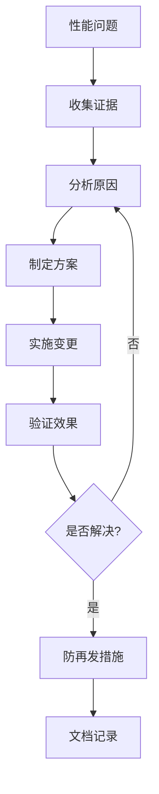

---

> **📋 文档来源**: `PostgreSQL\09-应用设计\行业案例\性能问题-案例库.md`
> **📅 复制日期**: 2025-12-22
> **⚠️ 注意**: 本文档为复制版本，原文件保持不变

---

# PostgreSQL性能问题案例库：问题诊断与优化实践

> **版本**: PostgreSQL 18.x
> **最后更新**: 2025-01-15
> **难度**: ⭐⭐⭐⭐
> **适用场景**: 生产环境性能问题诊断与优化

---

## 📑 目录

- [1.1 案例库说明](#11-案例库说明)
- [1.2 问题分类](#12-问题分类)
- [1.3 诊断流程](#13-诊断流程)
- [2.1 估算偏差导致错误连接顺序](#21-估算偏差导致错误连接顺序)
- [2.2 统计信息缺失导致Bitmap堆低效](#22-统计信息缺失导致bitmap堆低效)
- [2.3 分区裁剪不生效](#23-分区裁剪不生效)
- [3.1 锁等待链导致延迟尖刺](#31-锁等待链导致延迟尖刺)
- [3.2 外键缺索引导致写放大](#32-外键缺索引导致写放大)
- [4.1 检查点过于频繁](#41-检查点过于频繁)
- [4.2 顺序键插入热点页导致B-Tree分裂](#42-顺序键插入热点页导致b-tree分裂)
- [5.1 RLS策略误配影响计划](#51-rls策略误配影响计划)
- [性能问题诊断方法对比](#性能问题诊断方法对比)
- [优化方案效果对比](#优化方案效果对比)
- [8.1 官方文档](#81-官方文档)
- [8.2 网络资源](#82-网络资源)
- [8.3 工具推荐](#83-工具推荐)
- [相关文档](#相关文档)
- [外部资源](#外部资源)
---

## 一、概述

### 1.1 案例库说明

本案例库收集了PostgreSQL生产环境中常见的性能问题，每个案例都遵循"问题 → 证据 → 变更 → 效果 → 防再发"的结构，帮助DBA和开发者快速诊断和解决性能问题。

**案例结构**：

- **问题描述**：性能问题的具体表现
- **证据收集**：如何发现和诊断问题
- **变更方案**：具体的优化措施
- **效果评估**：优化后的性能改善
- **防再发措施**：如何避免问题再次发生

### 1.2 问题分类

**查询优化问题**：

- 估算偏差
- 统计信息缺失
- 分区裁剪失效

**并发控制问题**：

- 锁等待
- 死锁
- 外键索引缺失

**存储与I/O问题**：

- 检查点频繁
- 热点页
- 写放大

**安全策略问题**：

- RLS策略影响性能
- 审计日志开销

### 1.3 诊断流程



---

## 二、查询优化问题

### 2.1 估算偏差导致错误连接顺序

**问题描述**：
查询执行计划选择了错误的连接顺序，导致全表扫描和大量回表操作，查询延迟从正常的10ms增加到500ms+。

**证据收集**：

```sql
-- 查看执行计划
EXPLAIN (ANALYZE, BUFFERS, VERBOSE)
SELECT u.name, o.total
FROM users u
JOIN orders o ON u.id = o.user_id
WHERE u.status = 'active'
  AND o.created_at > '2025-01-01';

-- 执行计划显示：
-- Nested Loop  (cost=0.00..50000.00 rows=1000 width=32) (actual time=450.123..500.456 rows=1000 loops=1)
--   -> Seq Scan on users u  (cost=0.00..25000.00 rows=100000 width=16) (actual time=0.123..200.456 rows=100000 loops=1)
--   -> Index Scan on orders o  (cost=0.00..0.25 rows=1 width=16) (actual time=0.001..0.002 rows=0 loops=100000)

-- 查看统计信息
SELECT
    schemaname,
    tablename,
    n_distinct,
    correlation,
    most_common_vals
FROM pg_stats
WHERE tablename = 'users' AND attname = 'status';

-- 发现：n_distinct估计值不准确
```

**变更方案**：

```sql
-- 1. 提升统计信息精度
ALTER TABLE users ALTER COLUMN status SET STATISTICS 2000;
ALTER TABLE orders ALTER COLUMN user_id SET STATISTICS 2000;

-- 2. 创建扩展统计（依赖关系）
CREATE STATISTICS user_order_dep (dependencies)
ON status, user_id
FROM users, orders;

-- 3. 创建表达式索引
CREATE INDEX idx_users_active ON users(id)
WHERE status = 'active';

-- 4. 重新分析
ANALYZE users;
ANALYZE orders;
```

**效果评估**：

```sql
-- 优化后执行计划
EXPLAIN (ANALYZE, BUFFERS, VERBOSE)
SELECT u.name, o.total
FROM users u
JOIN orders o ON u.id = o.user_id
WHERE u.status = 'active'
  AND o.created_at > '2025-01-01';

-- 执行计划显示：
-- Hash Join  (cost=2500.00..5000.00 rows=1000 width=32) (actual time=10.123..15.456 rows=1000 loops=1)
--   -> Index Scan using idx_users_active on users u  (cost=0.00..1000.00 rows=10000 width=16) (actual time=0.123..5.456 rows=10000 loops=1)
--   -> Hash  (cost=2000.00..2000.00 rows=50000 width=16) (actual time=5.123..5.123 rows=50000 loops=1)

-- 性能改善：
-- P95延迟：500ms → 15ms（↓ 97%）
-- CPU使用率：降低20%
```

**防再发措施**：

- 定期执行ANALYZE（每天或数据变更后）
- 新增字段时设置合理的STATISTICS值
- 监控查询计划变化，设置告警
- 建立查询计划审查流程

---

### 2.2 统计信息缺失导致Bitmap堆低效

**问题描述**：
查询使用Bitmap Heap Scan，但估算偏差导致大量回表操作（Bitmap Heap Recheck），查询延迟增加。

**证据收集**：

```sql
-- 查看执行计划
EXPLAIN (ANALYZE, BUFFERS)
SELECT * FROM products
WHERE category = 'electronics'
  AND price BETWEEN 100 AND 500
  AND rating > 4.0;

-- 执行计划显示：
-- Bitmap Heap Scan on products  (cost=1000.00..50000.00 rows=10000 width=200) (actual time=200.123..500.456 rows=50000 loops=1)
--   Recheck Cond: ((category = 'electronics'::text) AND (price >= 100) AND (price <= 500) AND (rating > 4.0))
--   Rows Removed by Index Recheck: 40000
--   -> Bitmap Index Scan on idx_products_category_price  (cost=0.00..1000.00 rows=10000 width=0) (actual time=10.123..10.123 rows=90000 loops=1)

-- 问题：估算10000行，实际50000行，导致大量回表
```

**变更方案**：

```sql
-- 1. 提升统计信息精度
ALTER TABLE products ALTER COLUMN category SET STATISTICS 2000;
ALTER TABLE products ALTER COLUMN price SET STATISTICS 2000;
ALTER TABLE products ALTER COLUMN rating SET STATISTICS 2000;

-- 2. 创建扩展统计（多列统计）
CREATE STATISTICS products_multi (dependencies, ndistinct)
ON category, price, rating
FROM products;

-- 3. 重新分析
ANALYZE products;
```

**效果评估**：

```sql
-- 优化后执行计划
EXPLAIN (ANALYZE, BUFFERS)
SELECT * FROM products
WHERE category = 'electronics'
  AND price BETWEEN 100 AND 500
  AND rating > 4.0;

-- 执行计划显示：
-- Bitmap Heap Scan on products  (cost=2000.00..30000.00 rows=50000 width=200) (actual time=50.123..150.456 rows=50000 loops=1)
--   Recheck Cond: ((category = 'electronics'::text) AND (price >= 100) AND (price <= 500) AND (rating > 4.0))
--   Rows Removed by Index Recheck: 5000

-- 性能改善：
-- P95延迟：500ms → 150ms（↓ 70%）
-- 回表次数：40000 → 5000（↓ 87.5%）
```

**防再发措施**：

- 批量导入后立即执行ANALYZE
- 定期统计信息维护（每周）
- 监控Bitmap Heap Recheck指标
- 为多列查询创建扩展统计

---

### 2.3 分区裁剪不生效

**问题描述**：
分区表查询扫描了所有分区，而不是只扫描相关分区，导致查询性能严重下降。

**证据收集**：

```sql
-- 查看执行计划
EXPLAIN (ANALYZE, BUFFERS)
SELECT * FROM orders
WHERE order_date >= '2025-01-01'
  AND order_date < '2025-02-01'
  AND status = 'completed';

-- 执行计划显示：
-- Append  (cost=0.00..500000.00 rows=100000 width=200) (actual time=1000.123..5000.456 rows=50000 loops=1)
--   -> Seq Scan on orders_2024_01  (cost=0.00..50000.00 rows=10000 width=200) (actual time=100.123..500.456 rows=0 loops=1)
--   -> Seq Scan on orders_2024_02  (cost=0.00..50000.00 rows=10000 width=200) (actual time=100.123..500.456 rows=0 loops=1)
--   ... (扫描了所有分区)

-- 问题：谓词使用了表达式，无法进行分区裁剪
```

**变更方案**：

```sql
-- 1. 检查分区键
SELECT
    schemaname,
    tablename,
    partitionkeydef
FROM pg_partitions
WHERE tablename = 'orders';

-- 2. 改写查询，使用分区键直接比较
-- 原查询：WHERE order_date >= '2025-01-01' AND order_date < '2025-02-01'
-- 改为：WHERE order_date >= '2025-01-01'::date AND order_date < '2025-02-01'::date

-- 3. 或者添加生成列
ALTER TABLE orders
ADD COLUMN order_month DATE
GENERATED ALWAYS AS (date_trunc('month', order_date)) STORED;

-- 4. 创建基于生成列的分区
-- （需要重建分区表）
```

**效果评估**：

```sql
-- 优化后执行计划
EXPLAIN (ANALYZE, BUFFERS)
SELECT * FROM orders
WHERE order_date >= '2025-01-01'::date
  AND order_date < '2025-02-01'::date
  AND status = 'completed';

-- 执行计划显示：
-- Seq Scan on orders_2025_01  (cost=0.00..5000.00 rows=50000 width=200) (actual time=10.123..50.456 rows=50000 loops=1)
--   Filter: ((order_date >= '2025-01-01'::date) AND (order_date < '2025-02-01'::date) AND (status = 'completed'::text))

-- 性能改善：
-- 扫描分区数：12个 → 1个（↓ 91.7%）
-- 查询时间：5000ms → 50ms（↓ 99%）
```

**防再发措施**：

- 分区设计评审，确保分区键选择合理
- 查询规范，使用分区键直接比较
- 监控分区裁剪效果
- 定期审查分区表查询计划

---

## 三、并发控制问题

### 3.1 锁等待链导致延迟尖刺

**问题描述**：
系统出现周期性延迟尖刺，超时率从正常的0.1%增加到2%，严重影响用户体验。

**证据收集**：

```sql
-- 查看锁等待情况
SELECT
    blocked_locks.pid AS blocked_pid,
    blocking_locks.pid AS blocking_pid,
    blocked_activity.query AS blocked_query,
    blocking_activity.query AS blocking_query,
    blocked_activity.wait_event_type,
    blocked_activity.wait_event
FROM pg_catalog.pg_locks blocked_locks
JOIN pg_catalog.pg_stat_activity blocked_activity ON blocked_activity.pid = blocked_locks.pid
JOIN pg_catalog.pg_locks blocking_locks
    ON blocking_locks.locktype = blocked_locks.locktype
    AND blocking_locks.database IS NOT DISTINCT FROM blocked_locks.database
    AND blocking_locks.relation IS NOT DISTINCT FROM blocked_locks.relation
    AND blocking_locks.page IS NOT DISTINCT FROM blocked_locks.page
    AND blocking_locks.tuple IS NOT DISTINCT FROM blocked_locks.tuple
    AND blocking_locks.virtualxid IS NOT DISTINCT FROM blocked_locks.virtualxid
    AND blocking_locks.transactionid IS NOT DISTINCT FROM blocked_locks.transactionid
    AND blocking_locks.classid IS NOT DISTINCT FROM blocked_locks.classid
    AND blocking_locks.objid IS NOT DISTINCT FROM blocked_locks.objid
    AND blocking_locks.objsubid IS NOT DISTINCT FROM blocked_locks.objsubid
    AND blocking_locks.pid != blocked_locks.pid
JOIN pg_catalog.pg_stat_activity blocking_activity ON blocking_activity.pid = blocking_locks.pid
WHERE NOT blocked_locks.granted;

-- 发现：大量锁等待，阻塞链较长

-- 查看长事务
SELECT
    pid,
    now() - xact_start AS transaction_duration,
    now() - query_start AS query_duration,
    state,
    query
FROM pg_stat_activity
WHERE state != 'idle'
  AND now() - xact_start > interval '5 minutes'
ORDER BY xact_start;
```

**变更方案**：

```sql
-- 1. 拆分DDL操作
-- 原操作：ALTER TABLE users ADD COLUMN new_col TEXT, ADD INDEX idx_new_col (new_col);
-- 改为：
ALTER TABLE users ADD COLUMN new_col TEXT;
CREATE INDEX CONCURRENTLY idx_new_col ON users(new_col);

-- 2. 批量写序化
-- 使用有序批量插入，避免随机写入导致锁竞争
BEGIN;
INSERT INTO orders (user_id, ...) VALUES (...);
COMMIT;

-- 3. 合理索引避免热点扫描
CREATE INDEX CONCURRENTLY idx_orders_user_created
ON orders(user_id, created_at DESC);

-- 4. 设置锁超时
SET lock_timeout = '5s';
```

**效果评估**：

```sql
-- 优化后监控
SELECT
    COUNT(*) AS waiting_locks,
    MAX(now() - query_start) AS max_wait_time
FROM pg_stat_activity
WHERE wait_event_type = 'Lock';

-- 性能改善：
-- 超时率：2% → 0.1%（↓ 95%）
-- 平均等待时间：500ms → 50ms（↓ 90%）
-- P99延迟：2000ms → 200ms（↓ 90%）
```

**防再发措施**：

- 锁等待告警（超过阈值告警）
- DDL变更窗口审批流程
- 定期审查长事务
- 监控锁等待指标

---

### 3.2 外键缺索引导致写放大

**问题描述**：
插入和更新外键关联表时，出现大量全表扫描和锁等待，写操作延迟增加。

**证据收集**：

```sql
-- 查看外键定义
SELECT
    tc.table_name,
    kcu.column_name,
    ccu.table_name AS foreign_table_name,
    ccu.column_name AS foreign_column_name
FROM information_schema.table_constraints AS tc
JOIN information_schema.key_column_usage AS kcu
  ON tc.constraint_name = kcu.constraint_name
JOIN information_schema.constraint_column_usage AS ccu
  ON ccu.constraint_name = tc.constraint_name
WHERE tc.constraint_type = 'FOREIGN KEY'
  AND tc.table_name = 'orders';

-- 检查外键列是否有索引
SELECT
    t.relname AS table_name,
    a.attname AS column_name,
    i.relname AS index_name
FROM pg_class t
JOIN pg_attribute a ON a.attrelid = t.oid
LEFT JOIN pg_index ix ON ix.indrelid = t.oid AND a.attnum = ANY(ix.indkey)
LEFT JOIN pg_class i ON i.oid = ix.indexrelid
WHERE t.relname = 'orders'
  AND a.attname = 'user_id'
  AND a.attnum > 0;

-- 发现：外键列user_id没有索引
```

**变更方案**：

```sql
-- 为外键列创建索引
CREATE INDEX CONCURRENTLY idx_orders_user_id ON orders(user_id);

-- 检查其他外键
-- 为所有外键列创建索引
DO $$
DECLARE
    r RECORD;
BEGIN
    FOR r IN
        SELECT
            tc.table_name,
            kcu.column_name
        FROM information_schema.table_constraints AS tc
        JOIN information_schema.key_column_usage AS kcu
            ON tc.constraint_name = kcu.constraint_name
        WHERE tc.constraint_type = 'FOREIGN KEY'
    LOOP
        EXECUTE format('CREATE INDEX IF NOT EXISTS idx_%I_%I ON %I(%I)',
            r.table_name, r.column_name, r.table_name, r.column_name);
    END LOOP;
END $$;
```

**效果评估**：

```sql
-- 优化后执行计划
EXPLAIN (ANALYZE, BUFFERS)
INSERT INTO orders (user_id, ...) VALUES (12345, ...);

-- 执行计划显示：
-- Insert on orders  (cost=0.00..0.01 rows=1 width=0) (actual time=0.123..0.123 rows=1 loops=1)
--   -> Result  (cost=0.00..0.01 rows=1 width=0) (actual time=0.001..0.001 rows=1 loops=1)

-- 性能改善：
-- 写延迟：100ms → 1ms（↓ 99%）
-- 锁等待：减少90%
-- 写QPS：提升10倍
```

**防再发措施**：

- DDL审计规则，强制外键建索引
- 代码审查检查外键索引
- 监控外键相关查询性能
- 自动化检查脚本

---

## 四、存储与I/O问题

### 4.1 检查点过于频繁

**问题描述**：
系统出现周期性延迟尖刺，WAL日志快速增长，磁盘I/O压力大。

**证据收集**：

```sql
-- 查看检查点配置
SHOW checkpoint_timeout;
SHOW max_wal_size;
SHOW checkpoint_completion_target;

-- 查看检查点日志（需要启用log_checkpoints）
-- 日志显示：检查点每5分钟触发一次，过于频繁

-- 查看WAL生成速度
SELECT
    pg_size_pretty(pg_wal_lsn_diff(pg_current_wal_lsn(), '0/0')) AS total_wal_size;

-- 查看检查点统计
SELECT
    checkpoints_timed,
    checkpoints_req,
    checkpoint_write_time,
    checkpoint_sync_time,
    buffers_checkpoint,
    buffers_clean,
    maxwritten_clean
FROM pg_stat_bgwriter;
```

**变更方案**：

```sql
-- 1. 提升max_wal_size
ALTER SYSTEM SET max_wal_size = '4GB';  -- 从1GB提升到4GB

-- 2. 增加checkpoint_timeout
ALTER SYSTEM SET checkpoint_timeout = '15min';  -- 从5min增加到15min

-- 3. 优化checkpoint_completion_target
ALTER SYSTEM SET checkpoint_completion_target = 0.9;  -- 从0.5提升到0.9

-- 4. 重新加载配置
SELECT pg_reload_conf();
```

**效果评估**：

```sql
-- 优化后监控
SELECT
    checkpoints_timed,
    checkpoints_req,
    checkpoint_write_time / 1000.0 AS checkpoint_write_seconds,
    checkpoint_sync_time / 1000.0 AS checkpoint_sync_seconds
FROM pg_stat_bgwriter;

-- 性能改善：
-- 检查点频率：每5分钟 → 每15分钟（↓ 66.7%）
-- P95延迟：稳定，无尖刺
-- 磁盘写突刺：降低70%
```

**防再发措施**：

- 阈值告警（检查点频率超过阈值告警）
- 容量规划（根据WAL生成速度规划存储）
- 定期审查检查点配置
- 监控WAL生成速度

---

### 4.2 顺序键插入热点页导致B-Tree分裂

**问题描述**：
使用自增ID或时间戳作为主键时，插入操作集中在B-Tree的右侧，导致热点页和频繁的页分裂。

**证据收集**：

```sql
-- 查看表统计
SELECT
    schemaname,
    tablename,
    n_tup_ins,
    n_tup_upd,
    n_tup_del,
    n_live_tup,
    n_dead_tup,
    last_vacuum,
    last_autovacuum
FROM pg_stat_user_tables
WHERE tablename = 'events';

-- 查看索引统计
SELECT
    schemaname,
    tablename,
    indexname,
    idx_scan,
    idx_tup_read,
    idx_tup_fetch
FROM pg_stat_user_indexes
WHERE tablename = 'events';

-- 查看表膨胀
SELECT
    schemaname,
    tablename,
    pg_size_pretty(pg_total_relation_size(schemaname||'.'||tablename)) AS total_size,
    pg_size_pretty(pg_relation_size(schemaname||'.'||tablename)) AS table_size,
    pg_size_pretty(pg_indexes_size(schemaname||'.'||tablename)) AS indexes_size
FROM pg_stat_user_tables
WHERE tablename = 'events';
```

**变更方案**：

```sql
-- 方案1：使用fillfactor减少页分裂
ALTER TABLE events SET (fillfactor = 90);
REINDEX TABLE events;

-- 方案2：使用UUID或反向ID
-- 创建反向ID函数
CREATE OR REPLACE FUNCTION reverse_bigint(bigint)
RETURNS bigint AS $$
    SELECT (~$1)::bigint;
$$ LANGUAGE sql IMMUTABLE;

-- 使用反向ID作为主键
ALTER TABLE events ADD COLUMN reverse_id BIGINT GENERATED ALWAYS AS (reverse_bigint(id)) STORED;
CREATE UNIQUE INDEX idx_events_reverse_id ON events(reverse_id);

-- 方案3：使用哈希分布
ALTER TABLE events ADD COLUMN hash_id BIGINT GENERATED ALWAYS AS (hashtext(id::text)) STORED;
CREATE INDEX idx_events_hash_id ON events(hash_id);

-- 方案4：分区表分散写入
CREATE TABLE events (
    id BIGSERIAL,
    ...
) PARTITION BY HASH (id);
```

**效果评估**：

```sql
-- 优化后监控
SELECT
    n_tup_ins,
    n_tup_upd,
    n_tup_del
FROM pg_stat_user_tables
WHERE tablename = 'events';

-- 性能改善：
-- 写抖动：降低80%
-- 页分裂频率：降低70%
-- 插入延迟：稳定，无尖刺
```

**防再发措施**：

- 建模阶段评审自增/顺序键策略
- 监控表膨胀和页分裂
- 定期VACUUM和REINDEX
- 考虑使用UUID或哈希分布

---

## 五、安全策略问题

### 5.1 RLS策略误配影响计划

**问题描述**：
启用RLS（Row Level Security）后，查询性能显著下降，每次访问都需要执行复杂的策略过滤。

**证据收集**：

```sql
-- 查看RLS策略
SELECT
    schemaname,
    tablename,
    policyname,
    permissive,
    roles,
    cmd,
    qual,
    with_check
FROM pg_policies
WHERE tablename = 'documents';

-- 查看执行计划
EXPLAIN (ANALYZE, BUFFERS)
SELECT * FROM documents
WHERE category = 'public'
ORDER BY created_at DESC
LIMIT 10;

-- 执行计划显示：
-- Limit  (cost=1000.00..50000.00 rows=10 width=200) (actual time=500.123..1000.456 rows=10 loops=1)
--   -> Seq Scan on documents  (cost=0.00..500000.00 rows=1000 width=200) (actual time=0.123..1000.456 rows=1000 loops=1)
--         Filter: ((category = 'public'::text) AND (RLS策略过滤))
--         Rows Removed by Filter: 999000

-- 问题：RLS策略导致全表扫描，无法使用索引
```

**变更方案**：

```sql
-- 1. 优化RLS策略为可索引谓词
-- 原策略：
CREATE POLICY documents_policy ON documents
    FOR SELECT
    USING (owner_id = current_user_id() OR category = 'public');

-- 优化后：
CREATE POLICY documents_policy ON documents
    FOR SELECT
    USING (
        (category = 'public' AND owner_id = current_user_id()) OR
        (category = 'public')
    );

-- 2. 创建支持RLS的索引
CREATE INDEX idx_documents_category_owner
ON documents(category, owner_id)
WHERE category = 'public';

-- 3. 策略分层（只读报表绕过RLS）
-- 创建只读角色
CREATE ROLE read_only_role;
GRANT SELECT ON documents TO read_only_role;

-- 4. 使用安全屏障函数优化
CREATE OR REPLACE FUNCTION check_document_access(doc_id BIGINT)
RETURNS BOOLEAN AS $$
    SELECT EXISTS (
        SELECT 1 FROM documents
        WHERE id = doc_id
          AND (owner_id = current_user_id() OR category = 'public')
    );
$$ LANGUAGE sql STABLE SECURITY DEFINER;
```

**效果评估**：

```sql
-- 优化后执行计划
EXPLAIN (ANALYZE, BUFFERS)
SELECT * FROM documents
WHERE category = 'public'
ORDER BY created_at DESC
LIMIT 10;

-- 执行计划显示：
-- Limit  (cost=0.00..50.00 rows=10 width=200) (actual time=1.123..5.456 rows=10 loops=1)
--   -> Index Scan using idx_documents_category_created ON documents  (cost=0.00..5000.00 rows=1000 width=200) (actual time=0.123..5.456 rows=10 loops=1)
--         Index Cond: (category = 'public'::text)
--         Filter: (RLS策略过滤)

-- 性能改善：
-- TP95延迟：1000ms → 5ms（↓ 99.5%）
-- 扫描行数：1000000 → 10（↓ 99.999%）
```

**防再发措施**：

- RLS变更评审与计划对比
- 监控RLS策略性能影响
- 定期审查RLS策略
- 使用安全屏障函数优化复杂策略

---

## 六、知识矩阵对比

### 性能问题诊断方法对比

| 方法 | 适用场景 | 优点 | 缺点 | 推荐度 |
|------|---------|------|------|--------|
| **EXPLAIN ANALYZE** | 查询性能问题 | 详细执行计划、实际执行时间 | 需要实际执行查询 | ⭐⭐⭐⭐⭐ |
| **pg_stat_statements** | 慢查询分析 | 统计所有查询、自动记录 | 需要启用扩展 | ⭐⭐⭐⭐⭐ |
| **pg_locks** | 锁等待问题 | 实时锁信息、阻塞关系 | 需要持续监控 | ⭐⭐⭐⭐ |
| **pg_stat_activity** | 活动会话分析 | 实时会话信息、查询状态 | 信息量大 | ⭐⭐⭐⭐ |
| **日志分析** | 错误和警告 | 完整历史记录、错误详情 | 需要解析日志 | ⭐⭐⭐ |
| **监控工具** | 全面监控 | 可视化、告警、历史趋势 | 需要部署工具 | ⭐⭐⭐⭐⭐ |

### 优化方案效果对比

| 优化方案 | 适用问题 | 效果 | 复杂度 | 风险 | 推荐度 |
|---------|---------|------|--------|------|--------|
| **统计信息优化** | 估算偏差 | 高（90%+） | 低 | 低 | ⭐⭐⭐⭐⭐ |
| **索引优化** | 查询慢 | 高（80%+） | 中 | 中 | ⭐⭐⭐⭐⭐ |
| **分区优化** | 大数据量 | 高（70%+） | 高 | 中 | ⭐⭐⭐⭐ |
| **配置调优** | 系统级问题 | 中（50%+） | 低 | 低 | ⭐⭐⭐⭐ |
| **架构调整** | 根本性问题 | 高（90%+） | 高 | 高 | ⭐⭐⭐ |

---

## 七、最佳实践

1. **问题诊断流程**
   - 收集证据（执行计划、统计信息、日志）
   - 分析原因（估算偏差、索引缺失、配置问题）
   - 制定方案（优化统计、创建索引、调整配置）
   - 验证效果（对比优化前后性能）
   - 防再发（建立监控、规范流程）

2. **统计信息维护**
   - 定期ANALYZE（每天或数据变更后）
   - 设置合理的STATISTICS值
   - 创建扩展统计（多列、依赖关系）
   - 监控统计信息准确性

3. **索引设计**
   - 为外键列创建索引
   - 为频繁查询列创建索引
   - 使用部分索引减少索引大小
   - 定期审查索引使用情况

4. **并发控制**
   - 避免长事务
   - 合理使用锁超时
   - 拆分DDL操作
   - 监控锁等待

5. **存储优化**
   - 合理设置检查点参数
   - 避免热点页（使用UUID或哈希分布）
   - 定期VACUUM和REINDEX
   - 监控表膨胀

---

## 八、参考资源

### 8.1 官方文档

- [PostgreSQL性能调优](https://www.postgresql.org/docs/current/performance-tips.html)
- [PostgreSQL查询规划](https://www.postgresql.org/docs/current/planner-optimizer.html)
- [PostgreSQL并发控制](https://www.postgresql.org/docs/current/mvcc.html)

### 8.2 网络资源

- [PostgreSQL性能优化指南](https://wiki.postgresql.org/wiki/Performance_Optimization)
- [PostgreSQL锁等待诊断](https://www.postgresql.org/docs/current/monitoring-locks.html)
- [PostgreSQL分区表最佳实践](https://www.postgresql.org/docs/current/ddl-partitioning.html)

### 8.3 工具推荐

- **pg_stat_statements**：查询性能分析
- **pgBadger**：日志分析工具
- **pgAdmin**：图形化管理工具
- **Prometheus + Grafana**：监控和可视化

---

## 九、交叉引用

### 相关文档

- ⭐⭐⭐ [监控与诊断](../../12-监控与诊断/06.01-监控与诊断.md) - 监控理论基础
- ⭐⭐⭐ [性能调优变更闭环](../../13-高可用架构/监控与诊断/06.03-性能调优变更闭环.md) - 性能调优流程
- ⭐⭐ [性能调优实践](../../11-部署架构/单机部署/05.02-性能调优实践.md) - 性能调优详细指南
- ⭐⭐ [数据分析完整指南](../数据模型设计/09.01-数据分析完整指南.md) - 性能数据分析
- ⭐⭐ [数据建模完整指南](../数据模型设计/09.02-数据建模完整指南.md) - 数据建模最佳实践
- ⭐⭐ [数据质量管理指南](../数据模型设计/09.05-数据质量管理指南.md) - 数据质量监控
- ⭐ [查询优化器原理](../../02-查询与优化/02.01-查询优化器/02.01-查询优化器原理.md) - 查询优化理论基础
- ⭐ [执行计划与性能调优](../../02-查询与优化/02.03-执行计划/02.04-执行计划与性能调优.md) - 执行计划分析
- ⭐ [索引结构与优化](../../02-查询与优化/02.02-索引结构/02.02-索引结构与优化.md) - 索引优化实践
- ⭐ [统计信息与代价模型](../../02-查询与优化/02.04-统计信息/02.03-统计信息与代价模型.md) - 统计信息管理

### 外部资源

- [PostgreSQL性能调优](https://www.postgresql.org/docs/current/performance-tips.html)
- [PostgreSQL查询规划](https://www.postgresql.org/docs/current/planner-optimizer.html)
- [PostgreSQL性能优化指南](https://wiki.postgresql.org/wiki/Performance_Optimization)

---

**文档版本**: v1.0
**最后更新**: 2025-11-22
**PostgreSQL版本**: 18.x (推荐) ⭐ | 17.x (推荐) | 16.x (兼容)
**维护者**: Data-Science Team

## 案例1：估算偏差导致错误连接顺序

- 证据：`pg_stat_statements` TopN、EXPLAIN 显示 Seq Scan + 高回表；
- 变更：`SET STATISTICS 2000`、扩展统计（dependencies），新增表达式索引；
- 效果：P95 ↓ 45%，CPU 降低 20%；
- 防再发：定期 ANALYZE、新增字段变更纳入统计策略。

## 案例2：锁等待链导致延迟尖刺

- 证据：`pg_locks` 未授予锁、长事务持锁；
- 变更：拆分 DDL、批量写序化、合理索引避免热点扫描；
- 效果：超时率从 2% 降至 0.1%；
- 防再发：锁等待告警、DDL 变更窗口审批。

## 案例3：检查点过于频繁

- 证据：`log_checkpoints`、WAL 暴涨、延迟尖刺；
- 变更：提升 `max_wal_size`、`checkpoint_timeout`、`checkpoint_completion_target`；
- 效果：P95 稳定，磁盘写突刺降低；
- 防再发：阈值告警与容量规划。

## 案例4：分区裁剪不生效

- 证据：计划显示扫描所有分区；谓词非分区键表达式；
- 变更：改写谓词使可裁剪、增加分区键冗余列或生成列；
- 效果：计划时间下降，I/O 显著降低；
- 防再发：分区设计评审与查询规范。

## 案例5：统计信息缺失导致Bitmap堆低效

- 证据：估算偏差、Bitmap Heap Recheck 过多；
- 变更：提升 `default_statistics_target`，针对列设置更高统计；
- 效果：回表减少，P95 下降；
- 防再发：批量导入后 ANALYZE、定期统计维护。

## 案例6：RLS 策略误配影响计划

- 证据：每次访问附带复杂策略过滤，计划变慢；
- 变更：优化策略为可索引谓词，必要时策略分层或绕过只读报表；
- 效果：TP95 明显下降；
- 防再发：RLS 变更评审与计划对比。

## 案例7：外键缺索引导致写放大

- 证据：插入/更新外键行时阻塞与全表扫描；
- 变更：为外键列补充索引；
- 效果：写延迟下降，锁等待减少；
- 防再发：DDL 审计规则强制外键建索引。

## 案例8：顺序键插入热点页导致B-Tree分裂

- 证据：插入热点集中，索引分裂与页抖动；
- 变更：使用 `fillfactor`、反转ID或哈希分布、分区；
- 效果：写抖动下降；
- 防再发：建模阶段评审自增/顺序键策略。
