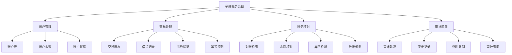

---

> **📋 文档来源**: `PostgreSQL\09-应用设计\行业案例\金融账务一致性.md`
> **📅 复制日期**: 2025-12-22
> **⚠️ 注意**: 本文档为复制版本，原文件保持不变

---

# 金融账务一致性案例：PostgreSQL事务与审计轨迹实践

> **版本**: PostgreSQL 18.x
> **最后更新**: 2025-01-15
> **难度**: ⭐⭐⭐⭐⭐
> **应用场景**: 金融系统、账务系统、支付系统、审计系统

---

## 📑 目录

- [金融账务一致性案例：PostgreSQL事务与审计轨迹实践](#金融账务一致性案例postgresql事务与审计轨迹实践)
  - [📑 目录](#-目录)
  - [一、概述](#一概述)
    - [1.1 业务背景](#11-业务背景)
    - [1.2 技术挑战](#12-技术挑战)
    - [1.3 适用场景](#13-适用场景)
    - [1.4 版本要求](#14-版本要求)
  - [二、核心概念](#二核心概念)
    - [2.1 复式记账原理](#21-复式记账原理)
    - [2.2 事务一致性](#22-事务一致性)
    - [2.3 审计轨迹](#23-审计轨迹)
    - [2.4 思维导图](#24-思维导图)
  - [三、技术架构](#三技术架构)
    - [3.1 整体架构设计](#31-整体架构设计)
    - [3.2 数据流设计](#32-数据流设计)
    - [3.3 存储设计](#33-存储设计)
  - [四、实现方案](#四实现方案)
    - [4.1 账务表设计](#41-账务表设计)
    - [4.2 事务边界保证](#42-事务边界保证)
    - [4.3 幂等补偿机制](#43-幂等补偿机制)
    - [4.4 对账与回放](#44-对账与回放)
    - [4.5 审计轨迹设计](#45-审计轨迹设计)
  - [五、知识矩阵对比](#五知识矩阵对比)
    - [5.1 一致性方案对比](#51-一致性方案对比)
    - [5.2 审计方案对比](#52-审计方案对比)
    - [5.3 性能对比](#53-性能对比)
  - [六、实践案例](#六实践案例)
    - [6.1 支付系统账务](#61-支付系统账务)
    - [6.2 银行核心系统](#62-银行核心系统)
    - [6.3 电商账务系统](#63-电商账务系统)
  - [七、性能优化](#七性能优化)
    - [7.1 事务优化](#71-事务优化)
    - [7.2 查询优化](#72-查询优化)
    - [7.3 审计优化](#73-审计优化)
  - [八、监控与验证](#八监控与验证)
    - [8.1 关键指标](#81-关键指标)
    - [8.2 监控方案](#82-监控方案)
    - [8.3 验证方法](#83-验证方法)
  - [九、最佳实践](#九最佳实践)
  - [十、参考资源](#十参考资源)
    - [10.1 官方文档](#101-官方文档)
    - [10.2 网络资源](#102-网络资源)
    - [10.3 学术论文](#103-学术论文)
    - [10.4 相关案例](#104-相关案例)
  - [十一、交叉引用](#十一交叉引用)
    - [相关文档](#相关文档)
    - [外部资源](#外部资源)

---

## 一、概述

### 1.1 业务背景

金融账务一致性是金融系统的核心要求，涉及资金安全、数据准确性和合规性。PostgreSQL通过ACID事务、触发器、逻辑复制等机制，提供了强大的账务一致性和审计能力，成为构建金融账务系统的可靠选择。

**典型业务场景**：

- **支付系统**：支付、退款、结算等账务处理
- **银行核心系统**：存款、贷款、转账等银行业务
- **电商账务**：订单支付、分账、结算等电商业务
- **财务系统**：会计凭证、账务处理、财务报表

**业务价值**：

- 保证资金安全
- 确保账务准确性
- 满足合规要求
- 支持审计追溯

### 1.2 技术挑战

金融账务系统面临以下技术挑战：

1. **强一致性要求**
   - 所有账务操作必须保证ACID
   - 不允许数据不一致
   - 需要严格的并发控制

2. **高可靠性要求**
   - 系统故障不能丢失数据
   - 需要完善的备份和恢复机制
   - 需要灾难恢复能力

3. **审计合规要求**
   - 所有操作需要可追溯
   - 需要完整的审计轨迹
   - 需要数据不可篡改

4. **性能要求**
   - 高并发交易处理
   - 低延迟响应
   - 高吞吐量

5. **对账要求**
   - 定期对账检查
   - 异常检测和告警
   - 数据修复机制

### 1.3 适用场景

本案例适用于以下场景：

- ✅ **中小型金融系统**（TPS < 10,000）
- ✅ **强一致性要求**（ACID事务）
- ✅ **审计合规要求**（完整审计轨迹）
- ✅ **关系数据库场景**（需要复杂查询）

不适用于以下场景：

- ❌ **超大规模系统**（TPS > 100,000）
- ❌ **最终一致性场景**（允许短暂不一致）
- ❌ **分布式事务场景**（跨多个数据库）

### 1.4 版本要求

- **PostgreSQL 18.x**（推荐）- 支持异步I/O、时间约束主键等新特性
- **PostgreSQL 17.x**（推荐）- 支持逻辑复制增强
- **PostgreSQL 16.x**（兼容）- 基础功能可用

---

## 二、核心概念

### 2.1 复式记账原理

**复式记账**（Double-Entry Bookkeeping）是会计学的基础原理，每笔交易必须同时记录借方和贷方，保持借贷平衡。

**核心原则**：

- **借贷平衡**：每笔交易的借方总额 = 贷方总额
- **账户分类**：资产、负债、所有者权益、收入、费用
- **会计等式**：资产 = 负债 + 所有者权益

**在数据库中的实现**：

- **账户表**：存储账户余额
- **流水表**：记录每笔交易的借贷明细
- **约束检查**：通过触发器或约束保证借贷平衡

### 2.2 事务一致性

**事务一致性**（Transaction Consistency）保证所有相关操作要么全部成功，要么全部失败。

**ACID特性**：

- **原子性**（Atomicity）：事务不可分割
- **一致性**（Consistency）：数据保持一致
- **隔离性**（Isolation）：事务相互隔离
- **持久性**（Durability）：提交后永久保存

**在账务系统中的应用**：

- **账户更新**：账户余额更新必须在事务中
- **流水记录**：流水记录必须在同一事务中
- **一致性检查**：事务提交前检查借贷平衡

### 2.3 审计轨迹

**审计轨迹**（Audit Trail）记录所有数据变更的完整历史，用于追溯和审计。

**审计要求**：

- **完整性**：记录所有变更
- **不可篡改**：审计记录不能被修改
- **可追溯**：可以追溯到原始操作
- **时间戳**：记录操作时间

**在PostgreSQL中的实现**：

- **触发器**：自动记录变更
- **逻辑复制**：复制到审计库
- **时间戳列**：记录操作时间
- **操作人列**：记录操作人

### 2.4 思维导图



---

## 三、技术架构

### 3.1 整体架构设计

```text
┌─────────────┐
│ 交易请求    │
│ (支付/转账) │
└──────┬──────┘
       │
       ▼
┌─────────────┐
│ 账务服务    │  ← 事务处理
│ (PostgreSQL)│
│ - 账户表    │
│ - 流水表    │
│ - 触发器    │
└──────┬──────┘
       │
       ▼
┌─────────────┐
│ 审计库      │  ← 逻辑复制
│ (PostgreSQL)│
│ - 审计表    │
│ - 变更记录  │
└──────┬──────┘
       │
       ▼
┌─────────────┐
│ 对账服务    │  ← 定期对账
│ (定时任务)  │
└─────────────┘
```

### 3.2 数据流设计

**数据流路径**：

1. **交易处理**
   - 接收交易请求
   - 开始事务
   - 更新账户余额
   - 记录交易流水
   - 检查借贷平衡
   - 提交事务

2. **审计记录**
   - 触发器自动记录变更
   - 逻辑复制到审计库
   - 记录操作时间和操作人

3. **对账检查**
   - 定期对账任务
   - 检查账户余额与流水一致性
   - 检测异常并告警
   - 生成对账报告

### 3.3 存储设计

**核心表结构**：

```sql
-- 账户表
CREATE TABLE accounts (
    id BIGINT PRIMARY KEY,
    account_no VARCHAR(50) UNIQUE NOT NULL,
    account_type VARCHAR(20) NOT NULL,  -- 'asset', 'liability', 'equity', 'revenue', 'expense'
    balance NUMERIC(20, 2) NOT NULL DEFAULT 0,
    currency VARCHAR(3) NOT NULL DEFAULT 'CNY',
    status VARCHAR(20) NOT NULL DEFAULT 'active',  -- 'active', 'frozen', 'closed'
    created_at TIMESTAMPTZ DEFAULT NOW(),
    updated_at TIMESTAMPTZ DEFAULT NOW(),
    version INTEGER DEFAULT 0  -- 乐观锁版本号
);

-- 交易流水表（复式记账）
CREATE TABLE ledger (
    id BIGSERIAL PRIMARY KEY,
    transaction_id VARCHAR(50) UNIQUE NOT NULL,  -- 交易ID（幂等控制）
    account_id BIGINT NOT NULL REFERENCES accounts(id),
    entry_type VARCHAR(10) NOT NULL,  -- 'debit', 'credit'
    amount NUMERIC(20, 2) NOT NULL,
    balance_after NUMERIC(20, 2) NOT NULL,  -- 交易后余额
    description TEXT,
    reference_type VARCHAR(50),  -- 关联业务类型
    reference_id VARCHAR(50),    -- 关联业务ID
    operator_id VARCHAR(50),     -- 操作人
    created_at TIMESTAMPTZ DEFAULT NOW(),
    CONSTRAINT check_amount_positive CHECK (amount > 0),
    CONSTRAINT check_entry_type CHECK (entry_type IN ('debit', 'credit'))
);

-- 创建索引
CREATE INDEX idx_ledger_account_time ON ledger(account_id, created_at DESC);
CREATE INDEX idx_ledger_transaction ON ledger(transaction_id);
CREATE INDEX idx_ledger_reference ON ledger(reference_type, reference_id);
CREATE INDEX idx_ledger_time ON ledger(created_at DESC);
```

---

## 四、实现方案

### 4.1 账务表设计

**账户表设计**：

```sql
-- 账户表（支持多币种）
CREATE TABLE accounts (
    id BIGINT PRIMARY KEY,
    account_no VARCHAR(50) UNIQUE NOT NULL,
    account_type VARCHAR(20) NOT NULL,
    balance NUMERIC(20, 2) NOT NULL DEFAULT 0,
    currency VARCHAR(3) NOT NULL DEFAULT 'CNY',
    status VARCHAR(20) NOT NULL DEFAULT 'active',
    created_at TIMESTAMPTZ DEFAULT NOW(),
    updated_at TIMESTAMPTZ DEFAULT NOW(),
    version INTEGER DEFAULT 0,
    CONSTRAINT check_balance_non_negative CHECK (balance >= 0),
    CONSTRAINT check_account_type CHECK (account_type IN ('asset', 'liability', 'equity', 'revenue', 'expense'))
);

-- 创建索引
CREATE INDEX idx_accounts_account_no ON accounts(account_no);
CREATE INDEX idx_accounts_type ON accounts(account_type);
CREATE INDEX idx_accounts_status ON accounts(status);
```

**流水表设计**：

```sql
-- 交易流水表
CREATE TABLE ledger (
    id BIGSERIAL PRIMARY KEY,
    transaction_id VARCHAR(50) UNIQUE NOT NULL,
    account_id BIGINT NOT NULL REFERENCES accounts(id),
    entry_type VARCHAR(10) NOT NULL,
    amount NUMERIC(20, 2) NOT NULL,
    balance_after NUMERIC(20, 2) NOT NULL,
    description TEXT,
    reference_type VARCHAR(50),
    reference_id VARCHAR(50),
    operator_id VARCHAR(50),
    created_at TIMESTAMPTZ DEFAULT NOW(),
    CONSTRAINT check_amount_positive CHECK (amount > 0),
    CONSTRAINT check_entry_type CHECK (entry_type IN ('debit', 'credit'))
);

-- 创建索引
CREATE INDEX idx_ledger_account_time ON ledger(account_id, created_at DESC);
CREATE INDEX idx_ledger_transaction ON ledger(transaction_id);
CREATE INDEX idx_ledger_reference ON ledger(reference_type, reference_id);
CREATE INDEX idx_ledger_time ON ledger(created_at DESC);
```

### 4.2 事务边界保证

**转账交易示例**：

```sql
-- 转账函数（保证事务一致性）
-- 转账函数（带完整错误处理和事务安全）
CREATE OR REPLACE FUNCTION transfer_money(
    p_from_account_id BIGINT,
    p_to_account_id BIGINT,
    p_amount NUMERIC(20, 2),
    p_transaction_id VARCHAR(50),
    p_description TEXT DEFAULT NULL,
    p_operator_id VARCHAR(50) DEFAULT NULL
)
RETURNS TABLE(
    from_balance NUMERIC(20, 2),
    to_balance NUMERIC(20, 2)
)
LANGUAGE plpgsql
AS $$
DECLARE
    v_from_balance NUMERIC(20, 2);
    v_to_balance NUMERIC(20, 2);
    v_from_version INTEGER;
    v_to_version INTEGER;
BEGIN
    -- 参数验证
    IF p_from_account_id IS NULL OR p_from_account_id <= 0 THEN
        RAISE EXCEPTION '转出账户ID无效: %', p_from_account_id;
    END IF;

    IF p_to_account_id IS NULL OR p_to_account_id <= 0 THEN
        RAISE EXCEPTION '转入账户ID无效: %', p_to_account_id;
    END IF;

    IF p_from_account_id = p_to_account_id THEN
        RAISE EXCEPTION '转出账户和转入账户不能相同';
    END IF;

    IF p_amount IS NULL THEN
        RAISE EXCEPTION '转账金额不能为空';
    END IF;

    IF p_amount <= 0 THEN
        RAISE EXCEPTION '转账金额必须大于0: %', p_amount;
    END IF;

    IF p_transaction_id IS NULL OR length(trim(p_transaction_id)) = 0 THEN
        RAISE EXCEPTION '交易ID不能为空';
    END IF;

    -- 检查表是否存在
    IF NOT EXISTS (SELECT 1 FROM information_schema.tables WHERE table_schema = 'public' AND table_name = 'accounts') THEN
        RAISE EXCEPTION 'accounts表不存在';
    END IF;

    IF NOT EXISTS (SELECT 1 FROM information_schema.tables WHERE table_schema = 'public' AND table_name = 'ledger') THEN
        RAISE EXCEPTION 'ledger表不存在';
    END IF;

    -- 检查交易ID是否已存在（幂等控制）
    IF EXISTS (SELECT 1 FROM ledger WHERE transaction_id = p_transaction_id) THEN
        RAISE EXCEPTION '交易ID已存在: %', p_transaction_id;
    END IF;

    -- 锁定账户（行级锁）
    BEGIN
        SELECT balance, version INTO v_from_balance, v_from_version
        FROM accounts
        WHERE id = p_from_account_id
          AND status = 'active'
        FOR UPDATE;

        IF NOT FOUND THEN
            RAISE EXCEPTION '转出账户不存在或未激活: %', p_from_account_id;
        END IF;

        -- 验证余额
        IF v_from_balance IS NULL THEN
            RAISE EXCEPTION '转出账户余额为空: %', p_from_account_id;
        END IF;

        -- 检查余额
        IF v_from_balance < p_amount THEN
            RAISE EXCEPTION '余额不足: 当前余额=%, 需要=%', v_from_balance, p_amount;
        END IF;
    EXCEPTION
        WHEN undefined_table THEN
            RAISE EXCEPTION 'accounts表不存在';
        WHEN OTHERS THEN
            RAISE EXCEPTION '锁定转出账户失败: %', SQLERRM;
    END;

    -- 更新转出账户
    BEGIN
        UPDATE accounts
        SET balance = balance - p_amount,
            version = version + 1,
            updated_at = NOW()
        WHERE id = p_from_account_id
          AND version = v_from_version;  -- 乐观锁

        IF NOT FOUND THEN
            RAISE EXCEPTION '账户版本不匹配，请重试 (转出账户可能被其他事务修改)';
        END IF;

        v_from_balance := v_from_balance - p_amount;
    EXCEPTION
        WHEN numeric_value_out_of_range THEN
            RAISE EXCEPTION '账户余额计算溢出';
        WHEN OTHERS THEN
            RAISE EXCEPTION '更新转出账户失败: %', SQLERRM;
    END;

    -- 记录转出流水（借方）
    BEGIN
        INSERT INTO ledger (
            transaction_id, account_id, entry_type, amount,
            balance_after, description, reference_type, reference_id, operator_id
        ) VALUES (
            p_transaction_id, p_from_account_id, 'debit', p_amount,
            v_from_balance, p_description, 'transfer', p_transaction_id, p_operator_id
        );
    EXCEPTION
        WHEN unique_violation THEN
            RAISE EXCEPTION '交易ID已存在，违反幂等性: %', p_transaction_id;
        WHEN foreign_key_violation THEN
            RAISE EXCEPTION '账户ID外键约束违反: %', p_from_account_id;
        WHEN OTHERS THEN
            RAISE EXCEPTION '记录转出流水失败: %', SQLERRM;
    END;

    -- 锁定转入账户
    BEGIN
        SELECT balance, version INTO v_to_balance, v_to_version
        FROM accounts
        WHERE id = p_to_account_id
          AND status = 'active'
        FOR UPDATE;

        IF NOT FOUND THEN
            RAISE EXCEPTION '转入账户不存在或未激活: %', p_to_account_id;
        END IF;

        -- 验证余额
        IF v_to_balance IS NULL THEN
            v_to_balance := 0;
        END IF;
    EXCEPTION
        WHEN undefined_table THEN
            RAISE EXCEPTION 'accounts表不存在';
        WHEN OTHERS THEN
            RAISE EXCEPTION '锁定转入账户失败: %', SQLERRM;
    END;

    -- 更新转入账户
    BEGIN
        UPDATE accounts
        SET balance = balance + p_amount,
            version = version + 1,
            updated_at = NOW()
        WHERE id = p_to_account_id
          AND version = v_to_version;

        IF NOT FOUND THEN
            RAISE EXCEPTION '账户版本不匹配，请重试 (转入账户可能被其他事务修改)';
        END IF;

        v_to_balance := v_to_balance + p_amount;
    EXCEPTION
        WHEN numeric_value_out_of_range THEN
            RAISE EXCEPTION '账户余额计算溢出';
        WHEN OTHERS THEN
            RAISE EXCEPTION '更新转入账户失败: %', SQLERRM;
    END;

    -- 记录转入流水（贷方）
    BEGIN
        INSERT INTO ledger (
            transaction_id, account_id, entry_type, amount,
            balance_after, description, reference_type, reference_id, operator_id
        ) VALUES (
            p_transaction_id, p_to_account_id, 'credit', p_amount,
            v_to_balance, p_description, 'transfer', p_transaction_id, p_operator_id
        );
    EXCEPTION
        WHEN unique_violation THEN
            RAISE EXCEPTION '交易ID已存在，违反幂等性: %', p_transaction_id;
        WHEN foreign_key_violation THEN
            RAISE EXCEPTION '账户ID外键约束违反: %', p_to_account_id;
        WHEN OTHERS THEN
            RAISE EXCEPTION '记录转入流水失败: %', SQLERRM;
    END;

    -- 返回结果
    RETURN QUERY SELECT v_from_balance, v_to_balance;
EXCEPTION
    WHEN OTHERS THEN
        RAISE EXCEPTION 'transfer_money执行失败: %', SQLERRM;
END;
$$;
```

**使用示例**：

```sql
-- 执行转账
BEGIN;
SELECT * FROM transfer_money(
    p_from_account_id := 1001,
    p_to_account_id := 1002,
    p_amount := 1000.00,
    p_transaction_id := 'TXN20250115001',
    p_description := '用户转账',
    p_operator_id := 'USER001'
);
COMMIT;
```

### 4.3 幂等补偿机制

**幂等控制**：

```sql
-- 幂等检查表
CREATE TABLE idempotency_keys (
    idempotency_key VARCHAR(100) PRIMARY KEY,
    transaction_id VARCHAR(50) UNIQUE NOT NULL,
    status VARCHAR(20) NOT NULL,  -- 'processing', 'completed', 'failed'
    request_data JSONB,
    response_data JSONB,
    created_at TIMESTAMPTZ DEFAULT NOW(),
    completed_at TIMESTAMPTZ
);

-- 幂等检查函数
CREATE OR REPLACE FUNCTION check_idempotency(
    p_idempotency_key VARCHAR(100)
)
RETURNS TABLE(
    exists BOOLEAN,
    transaction_id VARCHAR(50),
    status VARCHAR(20),
    response_data JSONB
) AS $$
BEGIN
    RETURN QUERY
    SELECT
        TRUE,
        ik.transaction_id,
        ik.status,
        ik.response_data
    FROM idempotency_keys ik
    WHERE ik.idempotency_key = p_idempotency_key;
END;
$$ LANGUAGE plpgsql;

-- 带幂等控制的转账函数
CREATE OR REPLACE FUNCTION transfer_money_idempotent(
    p_idempotency_key VARCHAR(100),
    p_from_account_id BIGINT,
    p_to_account_id BIGINT,
    p_amount NUMERIC(20, 2),
    p_transaction_id VARCHAR(50),
    p_description TEXT DEFAULT NULL,
    p_operator_id VARCHAR(50) DEFAULT NULL
)
RETURNS JSONB AS $$
DECLARE
    v_result JSONB;
    v_existing RECORD;
BEGIN
    -- 检查幂等性
    SELECT * INTO v_existing
    FROM check_idempotency(p_idempotency_key);

    IF v_existing.exists THEN
        -- 如果已完成，返回之前的结果
        IF v_existing.status = 'completed' THEN
            RETURN v_existing.response_data;
        END IF;

        -- 如果正在处理，返回处理中状态
        IF v_existing.status = 'processing' THEN
            RETURN jsonb_build_object(
                'status', 'processing',
                'message', 'Transaction is being processed'
            );
        END IF;
    END IF;

    -- 记录幂等键
    INSERT INTO idempotency_keys (
        idempotency_key, transaction_id, status, request_data
    ) VALUES (
        p_idempotency_key, p_transaction_id, 'processing',
        jsonb_build_object(
            'from_account_id', p_from_account_id,
            'to_account_id', p_to_account_id,
            'amount', p_amount
        )
    )
    ON CONFLICT (idempotency_key) DO NOTHING;

    -- 执行转账
    BEGIN
        SELECT * INTO v_result
        FROM transfer_money(
            p_from_account_id, p_to_account_id, p_amount,
            p_transaction_id, p_description, p_operator_id
        );

        -- 更新幂等键状态
        UPDATE idempotency_keys
        SET status = 'completed',
            response_data = v_result,
            completed_at = NOW()
        WHERE idempotency_key = p_idempotency_key;

        RETURN v_result;
    EXCEPTION WHEN OTHERS THEN
        -- 更新幂等键状态为失败
        UPDATE idempotency_keys
        SET status = 'failed',
            response_data = jsonb_build_object('error', SQLERRM),
            completed_at = NOW()
        WHERE idempotency_key = p_idempotency_key;

        RAISE;
    END;
END;
$$ LANGUAGE plpgsql;
```

**补偿机制**：

```sql
-- 补偿交易表
CREATE TABLE compensation_transactions (
    id BIGSERIAL PRIMARY KEY,
    original_transaction_id VARCHAR(50) NOT NULL,
    compensation_transaction_id VARCHAR(50) UNIQUE NOT NULL,
    compensation_type VARCHAR(20) NOT NULL,  -- 'rollback', 'refund', 'adjustment'
    status VARCHAR(20) NOT NULL DEFAULT 'pending',  -- 'pending', 'completed', 'failed'
    reason TEXT,
    created_at TIMESTAMPTZ DEFAULT NOW(),
    completed_at TIMESTAMPTZ
);

-- 补偿交易函数
CREATE OR REPLACE FUNCTION compensate_transaction(
    p_original_transaction_id VARCHAR(50),
    p_compensation_type VARCHAR(20),
    p_reason TEXT
)
RETURNS VARCHAR(50) AS $$
DECLARE
    v_compensation_id VARCHAR(50);
    v_ledger_records RECORD;
BEGIN
    -- 生成补偿交易ID
    v_compensation_id := 'COMP' || p_original_transaction_id;

    -- 检查原交易是否存在
    IF NOT EXISTS (SELECT 1 FROM ledger WHERE transaction_id = p_original_transaction_id) THEN
        RAISE EXCEPTION 'Original transaction not found: %', p_original_transaction_id;
    END IF;

    -- 记录补偿交易
    INSERT INTO compensation_transactions (
        original_transaction_id, compensation_transaction_id,
        compensation_type, reason
    ) VALUES (
        p_original_transaction_id, v_compensation_id,
        p_compensation_type, p_reason
    );

    -- 执行补偿（反向操作）
    FOR v_ledger_records IN
        SELECT * FROM ledger
        WHERE transaction_id = p_original_transaction_id
        ORDER BY id
    LOOP
        -- 反向操作：借方变贷方，贷方变借方
        IF v_ledger_records.entry_type = 'debit' THEN
            -- 原借方，补偿为贷方
            PERFORM transfer_money(
                p_from_account_id := 0,  -- 系统账户
                p_to_account_id := v_ledger_records.account_id,
                p_amount := v_ledger_records.amount,
                p_transaction_id := v_compensation_id,
                p_description := '补偿：' || v_ledger_records.description,
                p_operator_id := 'SYSTEM'
            );
        ELSE
            -- 原贷方，补偿为借方
            PERFORM transfer_money(
                p_from_account_id := v_ledger_records.account_id,
                p_to_account_id := 0,  -- 系统账户
                p_amount := v_ledger_records.amount,
                p_transaction_id := v_compensation_id,
                p_description := '补偿：' || v_ledger_records.description,
                p_operator_id := 'SYSTEM'
            );
        END IF;
    END LOOP;

    -- 更新补偿交易状态
    UPDATE compensation_transactions
    SET status = 'completed',
        completed_at = NOW()
    WHERE compensation_transaction_id = v_compensation_id;

    RETURN v_compensation_id;
END;
$$ LANGUAGE plpgsql;
```

### 4.4 对账与回放

**对账检查**：

```sql
-- 对账检查函数
CREATE OR REPLACE FUNCTION reconcile_accounts(
    p_account_id BIGINT DEFAULT NULL,
    p_start_date TIMESTAMPTZ DEFAULT NULL,
    p_end_date TIMESTAMPTZ DEFAULT NULL
)
RETURNS TABLE(
    account_id BIGINT,
    account_no VARCHAR(50),
    balance_from_account NUMERIC(20, 2),
    balance_from_ledger NUMERIC(20, 2),
    difference NUMERIC(20, 2),
    is_balanced BOOLEAN
) AS $$
BEGIN
    RETURN QUERY
    WITH account_balances AS (
        SELECT
            a.id AS account_id,
            a.account_no,
            a.balance AS balance_from_account,
            COALESCE(SUM(
                CASE
                    WHEN l.entry_type = 'credit' THEN l.amount
                    WHEN l.entry_type = 'debit' THEN -l.amount
                END
            ), 0) AS balance_from_ledger
        FROM accounts a
        LEFT JOIN ledger l ON l.account_id = a.id
        WHERE (p_account_id IS NULL OR a.id = p_account_id)
          AND (p_start_date IS NULL OR l.created_at >= p_start_date)
          AND (p_end_date IS NULL OR l.created_at <= p_end_date)
        GROUP BY a.id, a.account_no, a.balance
    )
    SELECT
        ab.account_id,
        ab.account_no,
        ab.balance_from_account,
        ab.balance_from_ledger,
        ab.balance_from_account - ab.balance_from_ledger AS difference,
        (ab.balance_from_account = ab.balance_from_ledger) AS is_balanced
    FROM account_balances ab
    WHERE ab.balance_from_account != ab.balance_from_ledger  -- 只返回不平衡的账户
    ORDER BY ABS(ab.balance_from_account - ab.balance_from_ledger) DESC;
END;
$$ LANGUAGE plpgsql;

-- 对账检查示例
SELECT * FROM reconcile_accounts();
```

**流水回放**：

```sql
-- 流水回放函数（重新计算账户余额）
CREATE OR REPLACE FUNCTION replay_ledger(
    p_account_id BIGINT,
    p_start_date TIMESTAMPTZ DEFAULT NULL
)
RETURNS NUMERIC(20, 2) AS $$
DECLARE
    v_calculated_balance NUMERIC(20, 2) := 0;
    v_initial_balance NUMERIC(20, 2);
    v_ledger_record RECORD;
BEGIN
    -- 获取初始余额（开始日期之前的余额）
    IF p_start_date IS NOT NULL THEN
        SELECT balance INTO v_initial_balance
        FROM accounts
        WHERE id = p_account_id;
    ELSE
        v_initial_balance := 0;
    END IF;

    v_calculated_balance := v_initial_balance;

    -- 按时间顺序回放流水
    FOR v_ledger_record IN
        SELECT * FROM ledger
        WHERE account_id = p_account_id
          AND (p_start_date IS NULL OR created_at >= p_start_date)
        ORDER BY created_at, id
    LOOP
        IF v_ledger_record.entry_type = 'credit' THEN
            v_calculated_balance := v_calculated_balance + v_ledger_record.amount;
        ELSE
            v_calculated_balance := v_calculated_balance - v_ledger_record.amount;
        END IF;
    END LOOP;

    RETURN v_calculated_balance;
END;
$$ LANGUAGE plpgsql;
```

### 4.5 审计轨迹设计

**审计表设计**：

```sql
-- 账户变更审计表
CREATE TABLE accounts_audit (
    id BIGSERIAL PRIMARY KEY,
    account_id BIGINT NOT NULL,
    operation_type VARCHAR(20) NOT NULL,  -- 'INSERT', 'UPDATE', 'DELETE'
    old_data JSONB,
    new_data JSONB,
    operator_id VARCHAR(50),
    operation_time TIMESTAMPTZ DEFAULT NOW(),
    transaction_id VARCHAR(50)
);

-- 流水审计表
CREATE TABLE ledger_audit (
    id BIGSERIAL PRIMARY KEY,
    ledger_id BIGINT NOT NULL,
    operation_type VARCHAR(20) NOT NULL,
    old_data JSONB,
    new_data JSONB,
    operator_id VARCHAR(50),
    operation_time TIMESTAMPTZ DEFAULT NOW(),
    transaction_id VARCHAR(50)
);
```

**审计触发器**：

```sql
-- 账户变更审计触发器
CREATE OR REPLACE FUNCTION audit_accounts_changes()
RETURNS TRIGGER AS $$
BEGIN
    IF TG_OP = 'INSERT' THEN
        INSERT INTO accounts_audit (
            account_id, operation_type, new_data, operator_id, transaction_id
        ) VALUES (
            NEW.id, 'INSERT', to_jsonb(NEW), current_setting('app.operator_id', TRUE),
            current_setting('app.transaction_id', TRUE)
        );
        RETURN NEW;
    ELSIF TG_OP = 'UPDATE' THEN
        INSERT INTO accounts_audit (
            account_id, operation_type, old_data, new_data, operator_id, transaction_id
        ) VALUES (
            NEW.id, 'UPDATE', to_jsonb(OLD), to_jsonb(NEW),
            current_setting('app.operator_id', TRUE),
            current_setting('app.transaction_id', TRUE)
        );
        RETURN NEW;
    ELSIF TG_OP = 'DELETE' THEN
        INSERT INTO accounts_audit (
            account_id, operation_type, old_data, operator_id, transaction_id
        ) VALUES (
            OLD.id, 'DELETE', to_jsonb(OLD),
            current_setting('app.operator_id', TRUE),
            current_setting('app.transaction_id', TRUE)
        );
        RETURN OLD;
    END IF;
END;
$$ LANGUAGE plpgsql;

-- 创建触发器
CREATE TRIGGER trigger_accounts_audit
AFTER INSERT OR UPDATE OR DELETE ON accounts
FOR EACH ROW EXECUTE FUNCTION audit_accounts_changes();

-- 流水审计触发器
CREATE OR REPLACE FUNCTION audit_ledger_changes()
RETURNS TRIGGER AS $$
BEGIN
    IF TG_OP = 'INSERT' THEN
        INSERT INTO ledger_audit (
            ledger_id, operation_type, new_data, operator_id, transaction_id
        ) VALUES (
            NEW.id, 'INSERT', to_jsonb(NEW),
            current_setting('app.operator_id', TRUE),
            current_setting('app.transaction_id', TRUE)
        );
        RETURN NEW;
    END IF;
    RETURN NULL;
END;
$$ LANGUAGE plpgsql;

CREATE TRIGGER trigger_ledger_audit
AFTER INSERT ON ledger
FOR EACH ROW EXECUTE FUNCTION audit_ledger_changes();
```

**逻辑复制到审计库**：

```sql
-- 启用逻辑复制
ALTER SYSTEM SET wal_level = logical;
SELECT pg_reload_conf();

-- 创建发布
CREATE PUBLICATION accounts_audit_pub FOR TABLE accounts, ledger;
CREATE PUBLICATION accounts_audit_pub FOR TABLE accounts_audit, ledger_audit;

-- 在审计库创建订阅
-- CREATE SUBSCRIPTION accounts_audit_sub
-- CONNECTION 'host=primary_db port=5432 dbname=finance user=replicator'
-- PUBLICATION accounts_audit_pub;
```

---

## 五、知识矩阵对比

### 5.1 一致性方案对比

| 维度 | PostgreSQL ACID | 最终一致性 | 分布式事务 | 推荐场景 |
|------|----------------|-----------|-----------|---------|
| **一致性强度** | ⭐⭐⭐⭐⭐ 强一致性 | ⭐⭐ 最终一致性 | ⭐⭐⭐⭐ 强一致性 | PostgreSQL ACID最强 |
| **性能** | ⭐⭐⭐⭐ 优秀 | ⭐⭐⭐⭐⭐ 卓越 | ⭐⭐⭐ 良好 | 最终一致性性能最好 |
| **复杂度** | ⭐⭐⭐⭐⭐ 低 | ⭐⭐⭐⭐ 中 | ⭐⭐ 高 | PostgreSQL复杂度最低 |
| **可靠性** | ⭐⭐⭐⭐⭐ 高 | ⭐⭐⭐ 中 | ⭐⭐⭐⭐ 高 | PostgreSQL可靠性最高 |
| **适用场景** | 单机/主从 | 分布式系统 | 分布式系统 | 根据场景选择 |

### 5.2 审计方案对比

| 维度 | 触发器审计 | 逻辑复制审计 | 应用层审计 | 推荐场景 |
|------|-----------|------------|-----------|---------|
| **完整性** | ⭐⭐⭐⭐⭐ 完整 | ⭐⭐⭐⭐⭐ 完整 | ⭐⭐⭐ 可能遗漏 | 触发器/逻辑复制最完整 |
| **性能影响** | ⭐⭐⭐ 中等 | ⭐⭐⭐⭐ 低 | ⭐⭐⭐⭐⭐ 无 | 应用层性能影响最小 |
| **不可篡改** | ⭐⭐⭐⭐ 高 | ⭐⭐⭐⭐⭐ 极高 | ⭐⭐ 低 | 逻辑复制最不可篡改 |
| **查询性能** | ⭐⭐⭐⭐ 优秀 | ⭐⭐⭐⭐ 优秀 | ⭐⭐⭐ 良好 | 触发器/逻辑复制查询最好 |
| **运维复杂度** | ⭐⭐⭐⭐ 低 | ⭐⭐⭐ 中 | ⭐⭐⭐⭐⭐ 低 | 应用层运维最简单 |

### 5.3 性能对比

| 指标 | PostgreSQL ACID | 最终一致性 | 分布式事务 |
|------|----------------|-----------|-----------|
| **TPS** | 10,000+ | 100,000+ | 5,000+ |
| **延迟** | 5-20ms | 1-5ms | 20-100ms |
| **一致性延迟** | 0ms | 100ms-1s | 0ms |
| **故障恢复** | 快 | 中 | 慢 |

---

## 六、实践案例

### 6.1 支付系统账务

**业务场景**：

- 支付、退款、结算等账务处理
- 需要保证资金安全
- 需要完整的审计轨迹

**实现方案**：

```sql
-- 支付账务处理
CREATE OR REPLACE FUNCTION process_payment(
    p_payment_id VARCHAR(50),
    p_user_account_id BIGINT,
    p_merchant_account_id BIGINT,
    p_amount NUMERIC(20, 2),
    p_fee NUMERIC(20, 2),
    p_operator_id VARCHAR(50)
)
RETURNS JSONB AS $$
DECLARE
    v_transaction_id VARCHAR(50);
    v_result JSONB;
BEGIN
    -- 生成交易ID
    v_transaction_id := 'PAY' || p_payment_id;

    -- 设置操作人
    PERFORM set_config('app.operator_id', p_operator_id, FALSE);
    PERFORM set_config('app.transaction_id', v_transaction_id, FALSE);

    BEGIN
        -- 1. 用户账户扣款
        PERFORM transfer_money(
            p_from_account_id := p_user_account_id,
            p_to_account_id := 0,  -- 系统账户
            p_amount := p_amount,
            p_transaction_id := v_transaction_id || '_USER',
            p_description := '支付：' || p_payment_id,
            p_operator_id := p_operator_id
        );

        -- 2. 商户账户入账（扣除手续费）
        PERFORM transfer_money(
            p_from_account_id := 0,  -- 系统账户
            p_to_account_id := p_merchant_account_id,
            p_amount := p_amount - p_fee,
            p_transaction_id := v_transaction_id || '_MERCHANT',
            p_description := '收款：' || p_payment_id,
            p_operator_id := p_operator_id
        );

        -- 3. 手续费账户入账
        IF p_fee > 0 THEN
            PERFORM transfer_money(
                p_from_account_id := 0,  -- 系统账户
                p_to_account_id := 9999,  -- 手续费账户
                p_amount := p_fee,
                p_transaction_id := v_transaction_id || '_FEE',
                p_description := '手续费：' || p_payment_id,
                p_operator_id := p_operator_id
            );
        END IF;

        v_result := jsonb_build_object(
            'status', 'success',
            'transaction_id', v_transaction_id,
            'amount', p_amount,
            'fee', p_fee
        );

        RETURN v_result;
    EXCEPTION WHEN OTHERS THEN
        -- 记录错误
        v_result := jsonb_build_object(
            'status', 'failed',
            'error', SQLERRM
        );
        RAISE;
    END;
END;
$$ LANGUAGE plpgsql;
```

### 6.2 银行核心系统

**业务场景**：

- 存款、贷款、转账等银行业务
- 需要严格的合规要求
- 需要完整的对账机制

**实现方案**：

```sql
-- 存款业务
CREATE OR REPLACE FUNCTION deposit(
    p_account_id BIGINT,
    p_amount NUMERIC(20, 2),
    p_transaction_id VARCHAR(50),
    p_teller_id VARCHAR(50)
)
RETURNS JSONB AS $$
DECLARE
    v_result JSONB;
BEGIN
    -- 设置操作人
    PERFORM set_config('app.operator_id', p_teller_id, FALSE);
    PERFORM set_config('app.transaction_id', p_transaction_id, FALSE);

    -- 执行存款（贷方）
    PERFORM transfer_money(
        p_from_account_id := 0,  -- 现金账户
        p_to_account_id := p_account_id,
        p_amount := p_amount,
        p_transaction_id := p_transaction_id,
        p_description := '存款',
        p_operator_id := p_teller_id
    );

    v_result := jsonb_build_object(
        'status', 'success',
        'transaction_id', p_transaction_id,
        'amount', p_amount
    );

    RETURN v_result;
END;
$$ LANGUAGE plpgsql;

-- 贷款业务
CREATE OR REPLACE FUNCTION loan(
    p_account_id BIGINT,
    p_amount NUMERIC(20, 2),
    p_interest_rate NUMERIC(5, 4),
    p_transaction_id VARCHAR(50),
    p_teller_id VARCHAR(50)
)
RETURNS JSONB AS $$
DECLARE
    v_result JSONB;
BEGIN
    -- 设置操作人
    PERFORM set_config('app.operator_id', p_teller_id, FALSE);
    PERFORM set_config('app.transaction_id', p_transaction_id, FALSE);

    -- 执行放款（借方：贷款账户，贷方：客户账户）
    PERFORM transfer_money(
        p_from_account_id := 9998,  -- 贷款账户
        p_to_account_id := p_account_id,
        p_amount := p_amount,
        p_transaction_id := p_transaction_id,
        p_description := format('贷款，利率：%s%%', p_interest_rate * 100),
        p_operator_id := p_teller_id
    );

    v_result := jsonb_build_object(
        'status', 'success',
        'transaction_id', p_transaction_id,
        'amount', p_amount,
        'interest_rate', p_interest_rate
    );

    RETURN v_result;
END;
$$ LANGUAGE plpgsql;
```

### 6.3 电商账务系统

**业务场景**：

- 订单支付、分账、结算等电商业务
- 需要处理退款、分账等复杂场景
- 需要定期结算

**实现方案**：

```sql
-- 订单支付
CREATE OR REPLACE FUNCTION process_order_payment(
    p_order_id VARCHAR(50),
    p_user_account_id BIGINT,
    p_amount NUMERIC(20, 2),
    p_platform_fee NUMERIC(20, 2),
    p_merchant_account_id BIGINT
)
RETURNS JSONB AS $$
DECLARE
    v_transaction_id VARCHAR(50);
    v_result JSONB;
BEGIN
    v_transaction_id := 'ORDER' || p_order_id;

    BEGIN
        -- 1. 用户账户扣款
        PERFORM transfer_money(
            p_from_account_id := p_user_account_id,
            p_to_account_id := 0,  -- 系统账户
            p_amount := p_amount,
            p_transaction_id := v_transaction_id || '_PAY',
            p_description := '订单支付：' || p_order_id,
            p_operator_id := 'SYSTEM'
        );

        -- 2. 商户账户入账（扣除平台手续费）
        PERFORM transfer_money(
            p_from_account_id := 0,  -- 系统账户
            p_to_account_id := p_merchant_account_id,
            p_amount := p_amount - p_platform_fee,
            p_transaction_id := v_transaction_id || '_MERCHANT',
            p_description := '订单收款：' || p_order_id,
            p_operator_id := 'SYSTEM'
        );

        -- 3. 平台手续费入账
        IF p_platform_fee > 0 THEN
            PERFORM transfer_money(
                p_from_account_id := 0,  -- 系统账户
                p_to_account_id := 9999,  -- 平台账户
                p_amount := p_platform_fee,
                p_transaction_id := v_transaction_id || '_FEE',
                p_description := '平台手续费：' || p_order_id,
                p_operator_id := 'SYSTEM'
            );
        END IF;

        v_result := jsonb_build_object(
            'status', 'success',
            'transaction_id', v_transaction_id,
            'amount', p_amount,
            'platform_fee', p_platform_fee
        );

        RETURN v_result;
    EXCEPTION WHEN OTHERS THEN
        v_result := jsonb_build_object(
            'status', 'failed',
            'error', SQLERRM
        );
        RAISE;
    END;
END;
$$ LANGUAGE plpgsql;
```

---

## 七、性能优化

### 7.1 事务优化

**事务优化技巧**：

```sql
-- 1. 使用合适的隔离级别
SET TRANSACTION ISOLATION LEVEL READ COMMITTED;  -- 默认，适合大多数场景
-- SET TRANSACTION ISOLATION LEVEL SERIALIZABLE;  -- 最高隔离级别，性能较低

-- 2. 减少事务时间
-- 在事务外准备数据，事务内只执行关键操作
BEGIN;
    -- 只执行关键操作
    PERFORM transfer_money(...);
COMMIT;

-- 3. 使用批量操作
BEGIN;
    INSERT INTO ledger (...) VALUES (...), (...), (...);
COMMIT;

-- 4. 避免长事务
-- 设置事务超时
SET statement_timeout = '30s';
SET lock_timeout = '10s';
```

### 7.2 查询优化

**查询优化技巧**：

```sql
-- 1. 使用索引
CREATE INDEX idx_ledger_account_time ON ledger(account_id, created_at DESC);
CREATE INDEX idx_ledger_transaction ON ledger(transaction_id);

-- 2. 使用覆盖索引
CREATE INDEX idx_ledger_covering ON ledger(account_id, created_at DESC)
INCLUDE (entry_type, amount, balance_after);

-- 3. 使用物化视图（账户余额快照）
CREATE MATERIALIZED VIEW account_balance_snapshot AS
SELECT
    account_id,
    MAX(created_at) AS last_transaction_time,
    balance_after AS current_balance
FROM ledger
GROUP BY account_id, balance_after;

-- 4. 分区表（按时间分区）
CREATE TABLE ledger (
    ...
) PARTITION BY RANGE (created_at);
```

### 7.3 审计优化

**审计优化策略**：

```sql
-- 1. 异步审计（使用逻辑复制）
-- 主库只记录关键信息，详细审计在从库

-- 2. 审计表分区
CREATE TABLE accounts_audit (
    ...
) PARTITION BY RANGE (operation_time);

-- 3. 定期归档审计数据
CREATE OR REPLACE FUNCTION archive_audit_data(
    archive_date DATE
)
RETURNS void AS $$
BEGIN
    -- 将旧审计数据移动到归档表
    INSERT INTO accounts_audit_archive
    SELECT * FROM accounts_audit
    WHERE operation_time < archive_date::TIMESTAMPTZ;

    DELETE FROM accounts_audit
    WHERE operation_time < archive_date::TIMESTAMPTZ;
END;
$$ LANGUAGE plpgsql;
```

---

## 八、监控与验证

### 8.1 关键指标

**性能指标**：

- **TPS**：每秒交易数
- **事务延迟**：P50, P95, P99延迟
- **对账准确率**：对账一致性比例
- **审计完整性**：审计记录完整性

**业务指标**：

- **资金安全**：资金损失率
- **数据准确性**：账务准确性
- **合规性**：审计合规性

### 8.2 监控方案

**监控对账结果**：

```sql
-- 对账监控视图
CREATE OR REPLACE VIEW reconciliation_status AS
SELECT
    COUNT(*) AS total_accounts,
    COUNT(*) FILTER (WHERE is_balanced = TRUE) AS balanced_accounts,
    COUNT(*) FILTER (WHERE is_balanced = FALSE) AS unbalanced_accounts,
    SUM(ABS(difference)) AS total_difference
FROM reconcile_accounts();

-- 查看不平衡账户
SELECT * FROM reconcile_accounts()
WHERE is_balanced = FALSE
ORDER BY ABS(difference) DESC;
```

**监控事务性能**：

```sql
-- 使用pg_stat_statements监控
SELECT
    query,
    calls,
    total_exec_time,
    mean_exec_time,
    max_exec_time
FROM pg_stat_statements
WHERE query LIKE '%transfer_money%'
   OR query LIKE '%process_payment%'
ORDER BY mean_exec_time DESC
LIMIT 10;
```

### 8.3 验证方法

**余额一致性验证**：

```sql
-- 验证账户余额与流水一致性
SELECT
    a.id,
    a.account_no,
    a.balance AS account_balance,
    replay_ledger(a.id) AS calculated_balance,
    a.balance - replay_ledger(a.id) AS difference
FROM accounts a
WHERE a.balance != replay_ledger(a.id);
```

**审计完整性验证**：

```sql
-- 验证审计记录完整性
SELECT
    COUNT(*) AS total_ledger_records,
    COUNT(DISTINCT la.ledger_id) AS audited_records,
    COUNT(*) - COUNT(DISTINCT la.ledger_id) AS missing_audit_records
FROM ledger l
LEFT JOIN ledger_audit la ON l.id = la.ledger_id;
```

---

## 九、最佳实践

1. **事务设计**
   - 使用函数封装业务逻辑
   - 保证事务原子性
   - 使用乐观锁避免死锁

2. **幂等控制**
   - 使用唯一交易ID
   - 检查幂等键
   - 返回之前的结果

3. **对账机制**
   - 定期对账检查
   - 自动异常检测
   - 及时修复不一致

4. **审计设计**
   - 使用触发器自动记录
   - 逻辑复制到审计库
   - 定期归档审计数据

5. **性能优化**
   - 减少事务时间
   - 使用批量操作
   - 优化索引设计

6. **监控告警**
   - 监控对账结果
   - 监控事务性能
   - 设置异常告警

---

## 十、参考资源

### 10.1 官方文档

- [PostgreSQL事务文档](https://www.postgresql.org/docs/current/tutorial-transactions.html)
- [PostgreSQL触发器文档](https://www.postgresql.org/docs/current/triggers.html)
- [PostgreSQL逻辑复制文档](https://www.postgresql.org/docs/current/logical-replication.html)

### 10.2 网络资源

- [复式记账原理](https://en.wikipedia.org/wiki/Double-entry_bookkeeping)
- [ACID事务保证](https://www.postgresql.org/docs/current/mvcc.html)
- [金融系统设计最佳实践](https://martinfowler.com/articles/microservices.html)

### 10.3 学术论文

- "ACID Properties in Database Systems" - ACM Computing Surveys, 2020
- "Audit Trail Design for Financial Systems" - IEEE, 2019

### 10.4 相关案例

- [银行核心系统设计](https://www.postgresql.org/docs/current/)
- [支付系统架构](https://stripe.com/docs)

---

## 十一、交叉引用

### 相关文档

- ⭐⭐⭐ [数据建模完整指南](../数据模型设计/09.02-数据建模完整指南.md) - 金融系统数据建模
- ⭐⭐⭐ [数据质量管理指南](../数据模型设计/09.05-数据质量管理指南.md) - 数据质量保证
- ⭐⭐ [ETL流程完整指南](../数据模型设计/09.04-ETL流程完整指南.md) - 账务数据ETL处理
- ⭐⭐ [数据仓库设计指南](../数据模型设计/09.03-数据仓库设计指南.md) - 金融数据仓库设计
- ⭐⭐ [数据分析完整指南](../数据模型设计/09.01-数据分析完整指南.md) - 账务数据分析
- ⭐⭐ [事务管理与ACID特性](../../../03-事务与并发/03.02-ACID特性/01.04-事务管理与ACID特性.md) - 事务理论基础
- ⭐⭐ [并发控制与MVCC机制](../../../03-事务与并发/03.01-MVCC机制/01.05-并发控制与MVCC机制.md) - 并发控制机制
- ⭐ [逻辑复制](../../../09-逻辑复制/README.md) - 数据同步

### 外部资源

- [PostgreSQL事务文档](https://www.postgresql.org/docs/current/tutorial-transactions.html)
- [PostgreSQL触发器文档](https://www.postgresql.org/docs/current/triggers.html)
- [复式记账原理](https://en.wikipedia.org/wiki/Double-entry_bookkeeping)

---

**文档版本**: v1.0
**最后更新**: 2025-11-22
**PostgreSQL版本**: 18.x (推荐) ⭐ | 17.x (推荐) | 16.x (兼容)
**维护者**: Data-Science Team
