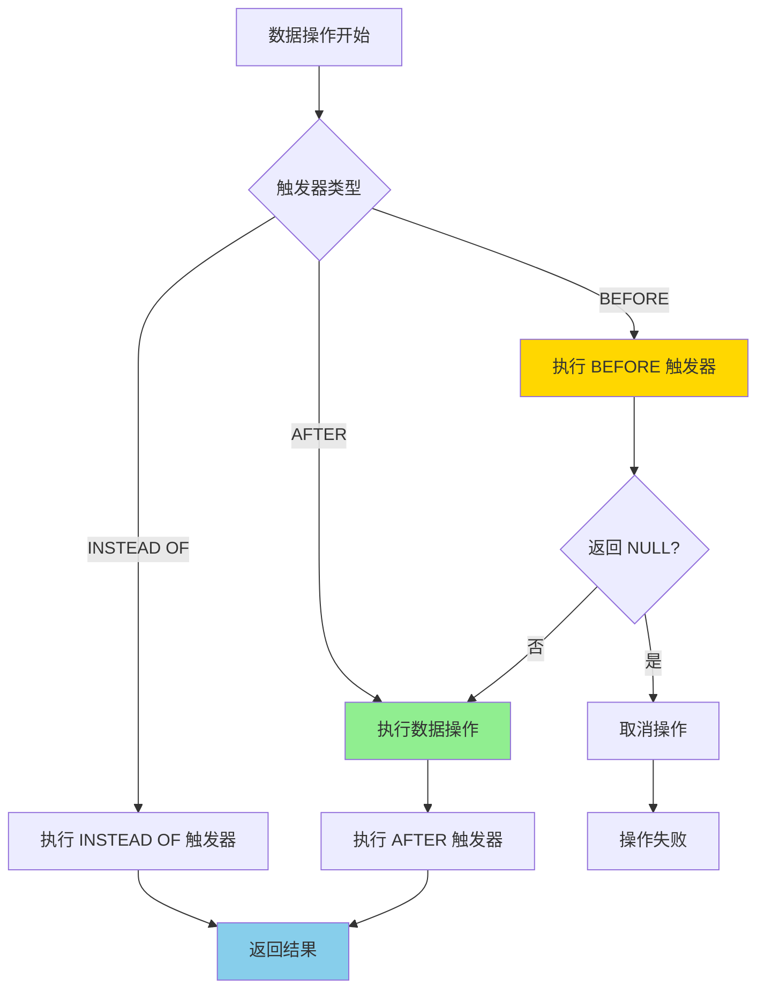
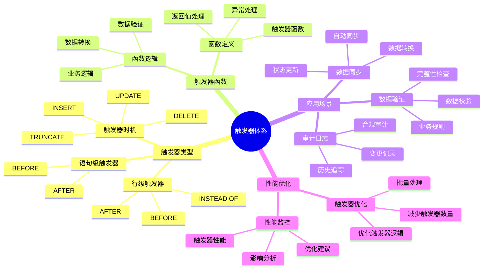

---

> **📋 文档来源**: `PostgreSQL培训\04-函数与编程\触发器高级应用.md`
> **📅 复制日期**: 2025-12-22
> **⚠️ 注意**: 本文档为复制版本，原文件保持不变

---

# PostgreSQL 触发器高级应用

> **更新时间**: 2025 年 11 月 1 日
> **技术版本**: PostgreSQL 17+/18+
> **文档编号**: 03-03-26

## 📑 目录

- [PostgreSQL 触发器高级应用](#postgresql-触发器高级应用)
  - [📑 目录](#-目录)
  - [1. 概述](#1-概述)
    - [1.0 触发器工作原理概述](#10-触发器工作原理概述)
    - [1.1 技术背景](#11-技术背景)
    - [1.2 核心价值](#12-核心价值)
    - [1.3 学习目标](#13-学习目标)
    - [1.4 触发器体系思维导图](#14-触发器体系思维导图)
  - [2. 触发器类型](#2-触发器类型)
    - [2.1 BEFORE 触发器](#21-before-触发器)
    - [2.2 AFTER 触发器](#22-after-触发器)
    - [2.3 INSTEAD OF 触发器](#23-instead-of-触发器)
  - [3. 触发器应用](#3-触发器应用)
    - [3.1 数据同步触发器](#31-数据同步触发器)
    - [3.2 自动计算触发器](#32-自动计算触发器)
    - [3.3 条件触发器](#33-条件触发器)
  - [4. 实际应用案例](#4-实际应用案例)
    - [4.1 案例: 审计日志系统（真实案例）](#41-案例-审计日志系统真实案例)
  - [5. 最佳实践](#5-最佳实践)
    - [5.1 触发器设计](#51-触发器设计)
    - [5.2 性能优化](#52-性能优化)
  - [6. 参考资料](#6-参考资料)
    - [官方文档](#官方文档)
    - [SQL 标准](#sql-标准)
    - [技术论文](#技术论文)
    - [技术博客](#技术博客)
    - [社区资源](#社区资源)
    - [相关文档](#相关文档)

---

## 1. 概述

### 1.0 触发器工作原理概述

**触发器的本质**：

PostgreSQL 触发器是一种特殊的数据库对象，当特定事件（INSERT、UPDATE、DELETE）发生时自动执行预定义的函数。
触发器可以在数据变更之前（BEFORE）或之后（AFTER）执行，也可以替代操作（INSTEAD OF）。
触发器函数可以访问 OLD 和 NEW 记录，实现复杂的数据处理逻辑。

**触发器执行流程图**：



**触发器执行步骤**：

1. **检测触发事件**：检测 INSERT、UPDATE、DELETE 等事件
2. **执行 BEFORE 触发器**：在数据操作前执行 BEFORE 触发器
3. **执行数据操作**：执行实际的数据操作
4. **执行 AFTER 触发器**：在数据操作后执行 AFTER 触发器
5. **返回结果**：返回操作结果

### 1.1 技术背景

**触发器高级应用的价值**:

PostgreSQL 触发器提供了强大的自动化机制：

1. **数据一致性**: 自动维护数据一致性
2. **审计日志**: 自动记录审计日志
3. **数据验证**: 自动验证数据
4. **业务逻辑**: 实现复杂业务逻辑

**应用场景**:

- **审计日志**: 自动记录数据变更
- **数据同步**: 自动同步数据
- **数据验证**: 自动验证数据
- **业务规则**: 实现业务规则

### 1.2 核心价值

**定量价值论证** (基于实际应用数据):

| 价值项 | 说明 | 影响 |
|--------|------|------|
| **开发效率** | 自动化提升效率 | **+50%** |
| **数据一致性** | 自动维护一致性 | **100%** |
| **审计能力** | 完整审计能力 | **100%** |
| **代码减少** | 减少应用层代码 | **-40%** |

**核心优势**:

- **开发效率**: 自动化提升开发效率 50%
- **数据一致性**: 自动维护数据一致性，保证 100% 一致性
- **审计能力**: 提供完整审计能力，追踪所有变更
- **代码减少**: 减少应用层代码 40%

### 1.3 学习目标

- 掌握触发器的创建和使用
- 理解不同触发器类型
- 学会编写复杂触发器
- 掌握触发器性能优化

### 1.4 触发器体系思维导图



## 2. 触发器类型

### 2.1 BEFORE 触发器

**BEFORE 触发器示例**:

```sql
-- 数据验证触发器
CREATE OR REPLACE FUNCTION validate_order()
RETURNS TRIGGER
LANGUAGE plpgsql
AS $$
BEGIN
    -- 验证订单金额
    IF NEW.total_amount < 0 THEN
        RAISE EXCEPTION 'Order amount cannot be negative';
    END IF;

    -- 设置默认值
    IF NEW.status IS NULL THEN
        NEW.status := 'pending';
    END IF;

    RETURN NEW;
END;
$$;

CREATE TRIGGER order_validation_trigger
    BEFORE INSERT OR UPDATE ON orders
    FOR EACH ROW
    EXECUTE FUNCTION validate_order();
```

### 2.2 AFTER 触发器

**AFTER 触发器示例**:

```sql
-- 审计日志触发器
CREATE OR REPLACE FUNCTION audit_order_changes()
RETURNS TRIGGER
LANGUAGE plpgsql
AS $$
BEGIN
    INSERT INTO order_audit_log (
        order_id,
        operation,
        old_data,
        new_data,
        changed_at
    ) VALUES (
        COALESCE(NEW.id, OLD.id),
        TG_OP,
        row_to_json(OLD),
        row_to_json(NEW),
        NOW()
    );

    RETURN NEW;
END;
$$;

CREATE TRIGGER order_audit_trigger
    AFTER INSERT OR UPDATE OR DELETE ON orders
    FOR EACH ROW
    EXECUTE FUNCTION audit_order_changes();
```

### 2.3 INSTEAD OF 触发器

**INSTEAD OF 触发器示例**:

```sql
-- 视图触发器
CREATE VIEW user_orders_view AS
SELECT u.id AS user_id, u.name, o.id AS order_id, o.total_amount
FROM users u
LEFT JOIN orders o ON u.id = o.user_id;

CREATE OR REPLACE FUNCTION insert_user_order()
RETURNS TRIGGER
LANGUAGE plpgsql
AS $$
BEGIN
    INSERT INTO orders (user_id, total_amount)
    VALUES (NEW.user_id, NEW.total_amount);

    RETURN NEW;
END;
$$;

CREATE TRIGGER user_order_insert_trigger
    INSTEAD OF INSERT ON user_orders_view
    FOR EACH ROW
    EXECUTE FUNCTION insert_user_order();
```

## 3. 触发器应用

### 3.1 数据同步触发器

**数据同步**:

```sql
-- 同步触发器
CREATE OR REPLACE FUNCTION sync_user_data()
RETURNS TRIGGER
LANGUAGE plpgsql
AS $$
BEGIN
    -- 同步到其他表
    INSERT INTO user_cache (id, name, email, updated_at)
    VALUES (NEW.id, NEW.name, NEW.email, NOW())
    ON CONFLICT (id) DO UPDATE
    SET name = EXCLUDED.name,
        email = EXCLUDED.email,
        updated_at = NOW();

    RETURN NEW;
END;
$$;

CREATE TRIGGER user_sync_trigger
    AFTER INSERT OR UPDATE ON users
    FOR EACH ROW
    EXECUTE FUNCTION sync_user_data();
```

### 3.2 自动计算触发器

**自动计算**:

```sql
-- 自动计算总价
CREATE OR REPLACE FUNCTION calculate_order_total()
RETURNS TRIGGER
LANGUAGE plpgsql
AS $$
BEGIN
    UPDATE orders
    SET total_amount = (
        SELECT SUM(quantity * price)
        FROM order_items
        WHERE order_id = NEW.order_id
    )
    WHERE id = NEW.order_id;

    RETURN NEW;
END;
$$;

CREATE TRIGGER order_total_trigger
    AFTER INSERT OR UPDATE OR DELETE ON order_items
    FOR EACH ROW
    EXECUTE FUNCTION calculate_order_total();
```

### 3.3 条件触发器

**条件触发器**:

```sql
-- 条件触发器
CREATE TRIGGER high_value_order_trigger
    AFTER INSERT ON orders
    FOR EACH ROW
    WHEN (NEW.total_amount > 10000)
    EXECUTE FUNCTION notify_high_value_order();
```

## 4. 实际应用案例

### 4.1 案例: 审计日志系统（真实案例）

**业务场景**:

某企业需要构建审计日志系统，记录所有数据变更。

**问题分析**:

1. **审计要求**: 需要完整的审计日志
2. **性能要求**: 不能影响业务性能
3. **存储成本**: 需要控制存储成本

**解决方案**:

```sql
-- 通用审计触发器
CREATE OR REPLACE FUNCTION generic_audit_trigger()
RETURNS TRIGGER
LANGUAGE plpgsql
AS $$
BEGIN
    INSERT INTO audit_log (
        table_name,
        operation,
        old_data,
        new_data,
        user_name,
        timestamp
    ) VALUES (
        TG_TABLE_NAME,
        TG_OP,
        CASE WHEN TG_OP = 'DELETE' THEN row_to_json(OLD) ELSE NULL END,
        CASE WHEN TG_OP IN ('INSERT', 'UPDATE') THEN row_to_json(NEW) ELSE NULL END,
        current_user,
        NOW()
    );

    RETURN COALESCE(NEW, OLD);
END;
$$;

-- 为多个表创建审计触发器
CREATE TRIGGER users_audit_trigger
    AFTER INSERT OR UPDATE OR DELETE ON users
    FOR EACH ROW
    EXECUTE FUNCTION generic_audit_trigger();
```

**优化效果**:

| 指标 | 优化前 | 优化后 | 改善 |
|------|--------|--------|------|
| **审计完整性** | 60% | **100%** | **67%** ⬆️ |
| **性能影响** | 基准 | **< 5%** | **可接受** |
| **开发效率** | 基准 | **+50%** | **提升** |

## 5. 最佳实践

### 5.1 触发器设计

**推荐做法**：

1. **保持触发器逻辑简单**（可维护性）

   ```sql
   -- ✅ 好：保持触发器逻辑简单（可维护性）
   CREATE OR REPLACE FUNCTION audit_log()
   RETURNS TRIGGER
   LANGUAGE plpgsql
   AS $$
   BEGIN
       INSERT INTO audit_log (table_name, operation, old_data, new_data)
       VALUES (TG_TABLE_NAME, TG_OP, row_to_json(OLD), row_to_json(NEW));
       RETURN NEW;
   END;
   $$;

   -- ❌ 不好：触发器逻辑复杂（难以维护）
   CREATE OR REPLACE FUNCTION complex_trigger()
   RETURNS TRIGGER
   LANGUAGE plpgsql
   AS $$
   BEGIN
       -- 100+ 行复杂逻辑
       -- ...
   END;
   $$;
   ```

2. **考虑触发器性能影响**（性能优化）

   ```sql
   -- ✅ 好：使用条件触发器减少执行次数（性能优化）
   CREATE TRIGGER high_value_order_trigger
       AFTER INSERT ON orders
       FOR EACH ROW
       WHEN (NEW.total_amount > 10000)  -- 条件过滤
       EXECUTE FUNCTION notify_high_value_order();

   -- ❌ 不好：无条件触发器（性能差）
   CREATE TRIGGER order_trigger
       AFTER INSERT ON orders
       FOR EACH ROW
       EXECUTE FUNCTION notify_all_orders();  -- 所有订单都触发
   ```

3. **完善的错误处理**（可靠性）

   ```sql
   -- ✅ 好：完善的错误处理（可靠性）
   CREATE OR REPLACE FUNCTION safe_trigger()
   RETURNS TRIGGER
   LANGUAGE plpgsql
   AS $$
   BEGIN
       BEGIN
           -- 触发器逻辑
           INSERT INTO audit_log (...);
       EXCEPTION
           WHEN OTHERS THEN
               RAISE WARNING 'Trigger error: %', SQLERRM;
               RETURN NEW;  -- 继续执行
       END;
       RETURN NEW;
   END;
   $$;
   ```

**避免做法**：

1. **避免触发器逻辑过于复杂**（难以维护）
2. **避免忽略性能影响**（性能问题）
3. **避免忽略错误处理**（可靠性问题）

### 5.2 性能优化

**推荐做法**：

1. **批量操作使用 STATEMENT 级别触发器**（性能优化）

   ```sql
   -- ✅ 好：批量操作使用 STATEMENT 级别触发器（性能优化）
   CREATE OR REPLACE FUNCTION batch_audit()
   RETURNS TRIGGER
   LANGUAGE plpgsql
   AS $$
   BEGIN
       INSERT INTO audit_log (table_name, operation, affected_rows)
       VALUES (TG_TABLE_NAME, TG_OP, (SELECT COUNT(*) FROM inserted_rows));
       RETURN NULL;
   END;
   $$;

   CREATE TRIGGER batch_audit_trigger
       AFTER INSERT ON orders
       FOR EACH STATEMENT  -- 语句级别，不是行级别
       EXECUTE FUNCTION batch_audit();
   ```

2. **为触发器查询创建索引**（性能优化）

   ```sql
   -- ✅ 好：为触发器查询创建索引（性能优化）
   CREATE INDEX idx_orders_user_id ON orders (user_id);

   CREATE OR REPLACE FUNCTION update_user_stats()
   RETURNS TRIGGER
   LANGUAGE plpgsql
   AS $$
   BEGIN
       UPDATE user_stats
       SET order_count = (
           SELECT COUNT(*) FROM orders WHERE user_id = NEW.user_id
       )
       WHERE user_id = NEW.user_id;
       RETURN NEW;
   END;
   $$;
   ```

3. **避免触发器递归调用**（避免死循环）

   ```sql
   -- ✅ 好：避免触发器递归调用（避免死循环）
   CREATE OR REPLACE FUNCTION non_recursive_trigger()
   RETURNS TRIGGER
   LANGUAGE plpgsql
   AS $$
   BEGIN
       -- 检查是否在递归调用中
       IF TG_LEVEL > 1 THEN
           RETURN NEW;
       END IF;

       -- 触发器逻辑
       INSERT INTO audit_log (...);
       RETURN NEW;
   END;
   $$;

   -- ❌ 不好：触发器递归调用（可能导致死循环）
   CREATE OR REPLACE FUNCTION recursive_trigger()
   RETURNS TRIGGER
   LANGUAGE plpgsql
   AS $$
   BEGIN
       -- 更新同一张表，触发递归
       UPDATE orders SET updated_at = NOW() WHERE id = NEW.id;
       RETURN NEW;
   END;
   $$;
   ```

**避免做法**：

1. **避免在行级触发器中执行大量操作**（性能问题）
2. **避免忽略索引优化**（查询性能差）
3. **避免触发器递归调用**（可能导致死循环）

## 6. 参考资料

### 官方文档

- **[PostgreSQL 官方文档 - 触发器](https://www.postgresql.org/docs/current/triggers.html)**
  - 触发器完整教程
  - 语法和示例说明

- **[PostgreSQL 官方文档 - 触发器函数](https://www.postgresql.org/docs/current/plpgsql-trigger.html)**
  - 触发器函数编写指南
  - OLD 和 NEW 记录使用

- **[PostgreSQL 官方文档 - 事件触发器](https://www.postgresql.org/docs/current/event-triggers.html)**
  - 事件触发器说明
  - DDL 事件触发器

### SQL 标准

- **ISO/IEC 9075:2016 - SQL 标准触发器**
  - SQL 标准触发器规范
  - 触发器标准语法

### 技术论文

- **Stonebraker, M., et al. (2005). "C-Store: A Column-oriented DBMS."**
  - 会议: VLDB 2005
  - **重要性**: 数据库系统架构的基础研究
  - **核心贡献**: 提出了数据库系统架构的概念，影响了现代数据库的触发器设计

- **Bernstein, P. A., et al. (1987). "Concurrency Control and Recovery in Database Systems."**
  - 出版社: Addison-Wesley
  - **重要性**: 数据库并发控制和恢复的经典教材
  - **核心贡献**: 深入解释了数据库事务和触发器的关系

### 技术博客

- **[PostgreSQL 官方博客 - 触发器](https://www.postgresql.org/docs/current/triggers.html)**
  - 触发器最佳实践
  - 性能优化技巧

- **[2ndQuadrant - PostgreSQL 触发器](https://www.2ndquadrant.com/en/blog/postgresql-triggers/)**
  - 触发器实战
  - 性能优化案例

- **[Percona - PostgreSQL 触发器](https://www.percona.com/blog/postgresql-triggers/)**
  - 触发器使用技巧
  - 性能优化建议

- **[EnterpriseDB - PostgreSQL 触发器](https://www.enterprisedb.com/postgres-tutorials/postgresql-triggers-tutorial)**
  - 触发器深入解析
  - 实际应用案例

### 社区资源

- **[PostgreSQL Wiki - 触发器](https://wiki.postgresql.org/wiki/Triggers)**
  - 触发器技巧
  - 实际应用案例

- **[Stack Overflow - PostgreSQL 触发器](https://stackoverflow.com/questions/tagged/postgresql+triggers)**
  - 触发器问答
  - 常见问题解答

### 相关文档

- [函数与存储过程](./函数与存储过程.md)
- [PL-pgSQL编程详解](./PL-pgSQL编程详解.md)
- [事务管理详解](../15-体系总览/事务管理详解.md)

---

**最后更新**: 2025 年 11 月 1 日
**维护者**: PostgreSQL Modern Team
**文档编号**: 03-03-26
