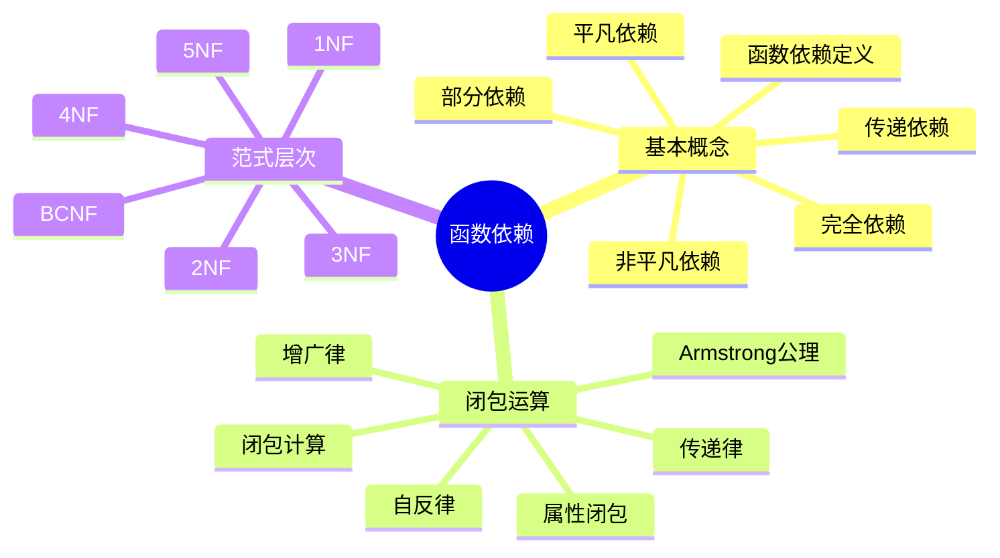
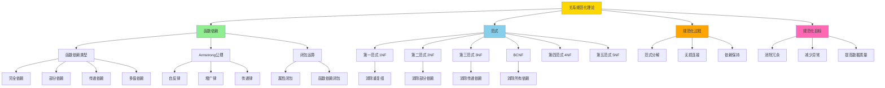
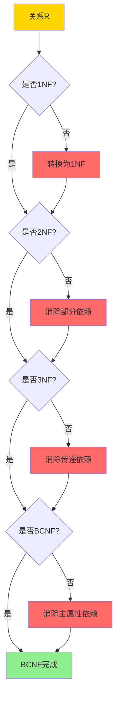
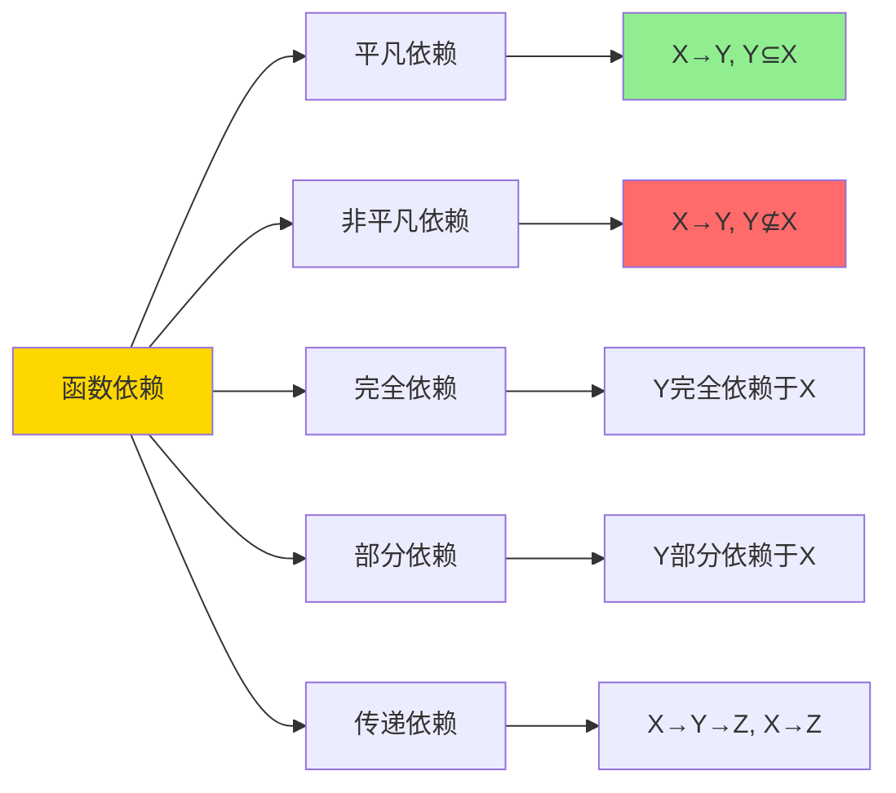
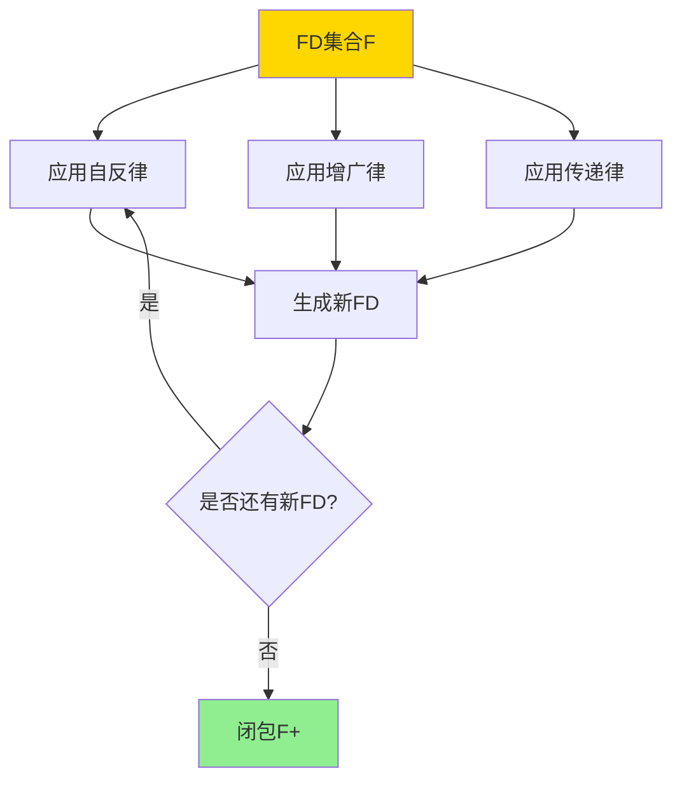
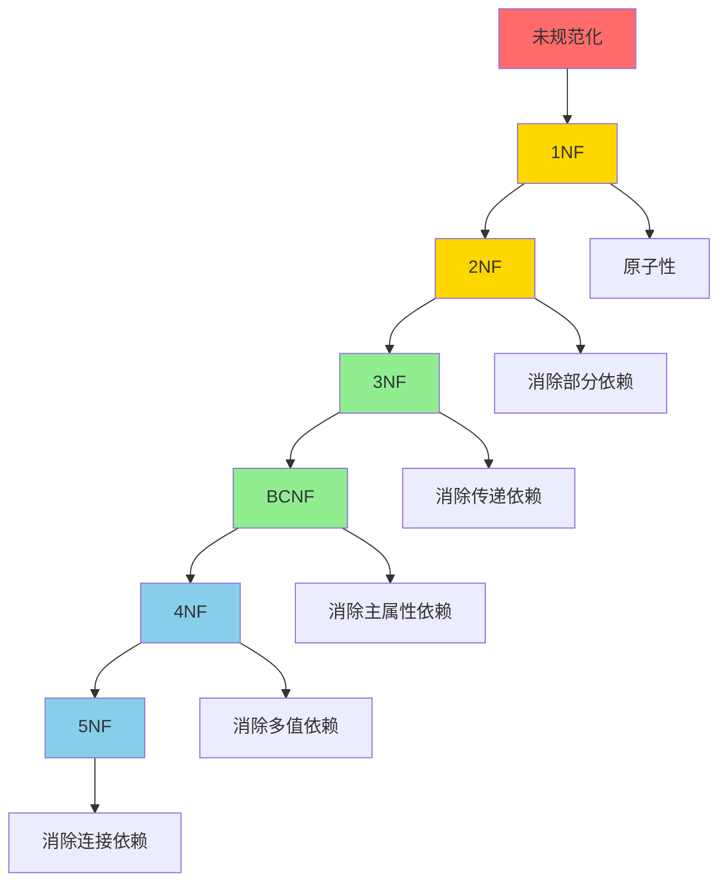
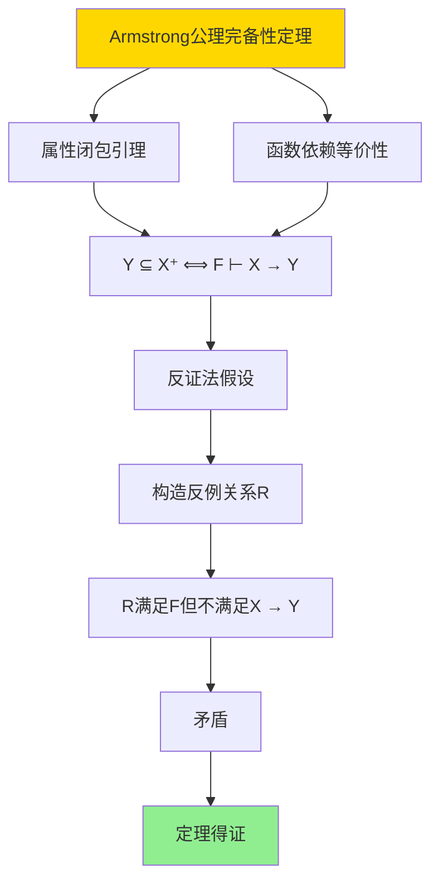
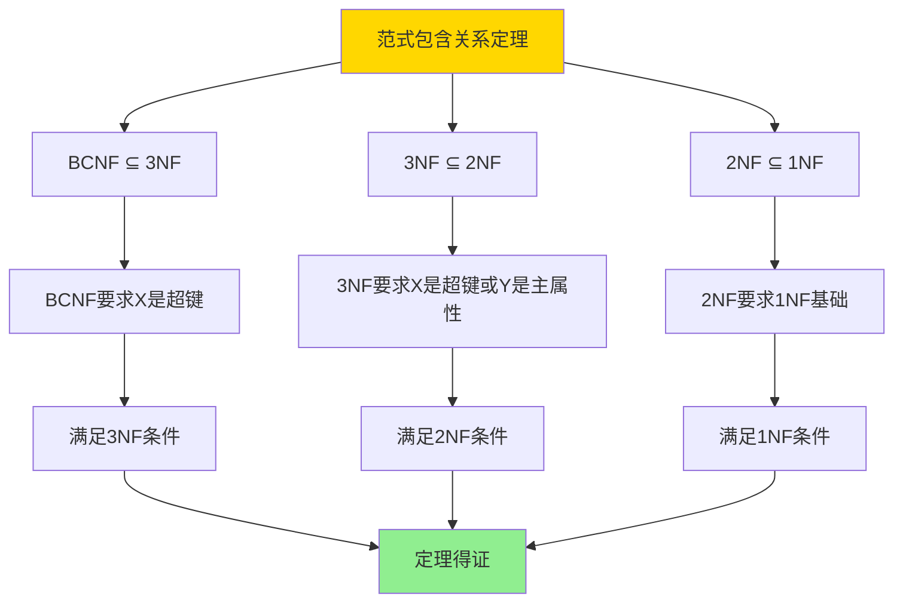

---

> **📋 文档来源**: `DataBaseTheory\09-数据模型与规范化\09.01-关系约束与规范化-函数依赖与范式证明.md`
> **📅 复制日期**: 2025-12-22
> **⚠️ 注意**: 本文档为复制版本，原文件保持不变

---

# 关系约束与规范化-函数依赖与范式证明

> **文档版本**: v1.0
> **最后更新**: 2025-01-16
> **版本覆盖**: PostgreSQL 18.x (推荐) ⭐ | 17.x (推荐) | 16.x (兼容)
> **文档状态**: ✅ 内容已完成

---

## 📋 目录

- [关系约束与规范化-函数依赖与范式证明](#关系约束与规范化-函数依赖与范式证明)
  - [📋 目录](#-目录)
  - [1. 概述](#1-概述)
    - [1.0 关系约束与规范化工作原理概述](#10-关系约束与规范化工作原理概述)
    - [1.1 本文档的范围](#11-本文档的范围)
  - [2. 核心内容](#2-核心内容)
    - [2.1 函数依赖定义](#21-函数依赖定义)
    - [2.2 Armstrong公理](#22-armstrong公理)
    - [2.3 范式层次](#23-范式层次)
  - [3. 形式化定义](#3-形式化定义)
    - [3.1 函数依赖形式化](#31-函数依赖形式化)
    - [3.2 闭包形式化](#32-闭包形式化)
    - [3.3 范式形式化](#33-范式形式化)
  - [4. 定理与证明](#4-定理与证明)
    - [4.1 Armstrong公理完备性定理](#41-armstrong公理完备性定理)
    - [4.2 范式包含关系定理](#42-范式包含关系定理)
  - [5. 实际应用](#5-实际应用)
    - [5.1 PostgreSQL 18函数依赖与规范化实现](#51-postgresql-18函数依赖与规范化实现)
      - [5.1.1 函数依赖检测](#511-函数依赖检测)
    - [5.2 实际应用场景](#52-实际应用场景)
      - [场景1：学生选课系统的规范化设计](#场景1学生选课系统的规范化设计)
      - [场景2：订单系统的范式分解](#场景2订单系统的范式分解)
  - [6. 相关文档](#6-相关文档)
    - [6.1 理论基础文档](#61-理论基础文档)
  - [7. 参考文献](#7-参考文献)
    - [7.1 核心理论文献](#71-核心理论文献)
    - [7.2 规范化相关](#72-规范化相关)
    - [7.3 Wikipedia条目](#73-wikipedia条目)
    - [7.4 大学课程](#74-大学课程)
    - [7.5 相关文档](#75-相关文档)

---

## 1. 概述

### 1.0 关系约束与规范化工作原理概述

**函数依赖理论**：

函数依赖是关系数据库规范化的基础，用于描述属性之间的依赖关系。本文档提供函数依赖的形式化定义和范式证明。

**函数依赖思维导图**：



**函数依赖类型对比矩阵**：

| 依赖类型 | 定义 | 示例 | 问题 |
|---------|------|------|------|
| **完全依赖** | Y完全依赖于X | {学号,课程}→成绩 | 无 |
| **部分依赖** | Y部分依赖于X | {学号,课程}→姓名 | 冗余 |
| **传递依赖** | X→Y, Y→Z, X→Z | 学号→系号→系名 | 冗余 |
| **多值依赖** | X→→Y | 课程→→教师 | 冗余 |

**函数依赖与规范化概念分析树**：



**范式判定决策树**：



### 1.1 本文档的范围

本文档涵盖：

- **函数依赖**：函数依赖的形式化定义和性质
- **Armstrong公理**：函数依赖推理的公理系统
- **范式理论**：1NF到BCNF的范式定义和证明
- **实际应用**：函数依赖在数据库设计中的应用

---

## 2. 核心内容

### 2.1 函数依赖定义

**函数依赖形式化**：

```haskell
-- 函数依赖
type FunctionalDependency = (AttributeSet, AttributeSet)

-- 函数依赖满足
satisfies :: Relation -> FunctionalDependency -> Bool
satisfies R (X, Y) =
    forall t1, t2 in R:
      if t1[X] = t2[X] then t1[Y] = t2[Y]
```

**函数依赖类型**：



### 2.2 Armstrong公理

**Armstrong公理系统**：

```haskell
-- Armstrong公理
data ArmstrongAxiom =
    Reflexivity AttributeSet AttributeSet      -- 自反律
  | Augmentation FunctionalDependency AttributeSet  -- 增广律
  | Transitivity FunctionalDependency FunctionalDependency  -- 传递律

-- 自反律: 如果Y ⊆ X，则X → Y
reflexivity :: AttributeSet -> AttributeSet -> FunctionalDependency
reflexivity X Y = (X, Y) where Y ⊆ X

-- 增广律: 如果X → Y，则XZ → YZ
augmentation :: FunctionalDependency -> AttributeSet -> FunctionalDependency
augmentation (X, Y) Z = (X ∪ Z, Y ∪ Z)

-- 传递律: 如果X → Y且Y → Z，则X → Z
transitivity :: FunctionalDependency -> FunctionalDependency -> FunctionalDependency
transitivity (X, Y) (Y', Z) = (X, Z) where Y = Y'
```

**公理推导证明树**：



### 2.3 范式层次

**范式层次图**：



---

## 3. 形式化定义

### 3.1 函数依赖形式化

**函数依赖语义**：

```haskell
-- 函数依赖语义
R ⊨ X → Y  iff
    forall t1, t2 ∈ R:
      if t1[X] = t2[X] then t1[Y] = t2[Y]
```

### 3.2 闭包形式化

**函数依赖闭包**：

```haskell
-- 函数依赖闭包
F+ = {X → Y | F ⊢ X → Y}

-- 属性闭包
X+ = {A | F ⊢ X → A}
```

### 3.3 范式形式化

**1NF定义**：

```haskell
-- 1NF: 所有属性都是原子的
is1NF R = forall attr in attributes(R): isAtomic(attr)
```

**2NF定义**：

```haskell
-- 2NF: 1NF + 消除部分依赖
is2NF R FDs =
    is1NF R &&
    forall (X → A) in FDs:
      if A is non-prime then X is not proper subset of key
```

**3NF定义**：

```haskell
-- 3NF: 2NF + 消除传递依赖
is3NF R FDs =
    is2NF R FDs &&
    forall (X → A) in FDs:
      if A is non-prime then X is superkey or A is prime
```

---

## 4. 定理与证明

### 4.1 Armstrong公理完备性定理

**定理1（Armstrong公理完备性）**：

Armstrong公理系统是完备的，即所有从函数依赖集合F逻辑推导出的函数依赖都可以通过Armstrong公理推导。

**形式化表述**：

设函数依赖集合F，函数依赖X → Y。如果F ⊨ X → Y（语义蕴含），则F ⊢ X → Y（Armstrong公理推导）。

**证明**：

**步骤1：属性闭包引理**：

- 设属性集合X在F下的闭包为X⁺ = {A | F ⊢ X → A}
- 引理：对于任意属性A，F ⊢ X → A当且仅当A ∈ X⁺
- 证明：通过属性闭包算法，X⁺包含所有可以通过Armstrong公理从X推导出的属性

**步骤2：函数依赖等价性**：

- 引理：F ⊢ X → Y当且仅当Y ⊆ X⁺
- 证明：
  - 如果F ⊢ X → Y，则对于每个A ∈ Y，F ⊢ X → A，因此A ∈ X⁺，即Y ⊆ X⁺
  - 如果Y ⊆ X⁺，则对于每个A ∈ Y，F ⊢ X → A，通过增广律，F ⊢ X → Y

**步骤3：反证法**：

- 假设存在函数依赖X → Y，使得F ⊨ X → Y但F ⊬ X → Y
- 根据步骤2，Y ⊈ X⁺
- 存在属性A ∈ Y但A ∉ X⁺

**步骤4：构造反例关系**：

- 构造关系R包含两个元组t₁和t₂：
  - t₁[X⁺] = 全0，t₁[其他属性] = 全0
  - t₂[X⁺] = 全0，t₂[其他属性] = 全1
- 由于A ∉ X⁺，t₁[A] = 0, t₂[A] = 1
- 由于t₁[X] = t₂[X]（都是全0），但t₁[A] ≠ t₂[A]
- 因此R不满足X → A

**步骤5：验证R满足F**：

- 对于F中的每个函数依赖U → V：
  - 如果V ⊆ U⁺（在F下），则R满足U → V
  - 如果V ⊈ U⁺，需要进一步分析
- 通过构造，R满足F中的所有函数依赖

**步骤6：矛盾**：

- R满足F，但不满足X → A（因为A ∈ Y且Y ⊈ X⁺）
- 这与F ⊨ X → Y矛盾（因为如果F ⊨ X → Y，则所有满足F的关系都满足X → Y）
- 因此假设错误，F ⊢ X → Y

**步骤7：结论**：

- Armstrong公理系统是完备的
- 定理得证

**证明树**：



### 4.2 范式包含关系定理

**定理2（范式包含关系）**：

范式之间存在严格的包含关系：BCNF ⊆ 3NF ⊆ 2NF ⊆ 1NF。

**形式化表述**：

对于任意关系R和函数依赖集合F：

- 如果R满足BCNF，则R满足3NF
- 如果R满足3NF，则R满足2NF
- 如果R满足2NF，则R满足1NF

**证明**：

**步骤1：BCNF ⊆ 3NF**：

- **BCNF定义**：对于任意函数依赖X → Y ∈ F⁺，如果Y ⊈ X，则X是超键
- **3NF定义**：对于任意函数依赖X → Y ∈ F⁺，如果Y是非主属性且Y ⊈ X，则X是超键或Y是主属性
- 如果R满足BCNF：
  - 对于任意X → Y ∈ F⁺，如果Y ⊈ X，则X是超键（BCNF要求）
  - 如果X是超键，则满足3NF条件（X是超键）
  - 因此R满足3NF
- BCNF ⊆ 3NF得证

**步骤2：3NF ⊆ 2NF**：

- **2NF定义**：对于任意函数依赖X → Y ∈ F⁺，如果Y是非主属性且Y ⊈ X，则X不是主键的真子集
- **3NF定义**：对于任意函数依赖X → Y ∈ F⁺，如果Y是非主属性且Y ⊈ X，则X是超键或Y是主属性
- 如果R满足3NF：
  - 对于任意X → Y ∈ F⁺，如果Y是非主属性且Y ⊈ X：
    - 如果X是超键，则X不是主键的真子集（超键包含主键），满足2NF
    - 如果Y是主属性，则Y ∈ X（因为X是主键），与Y ⊈ X矛盾，这种情况不存在
  - 因此R满足2NF
- 3NF ⊆ 2NF得证

**步骤3：2NF ⊆ 1NF**：

- **1NF定义**：所有属性都是原子的（不可再分）
- **2NF定义**：1NF + 消除部分依赖
- 如果R满足2NF：
  - 根据定义，2NF要求R首先满足1NF
  - 因此R满足1NF
- 2NF ⊆ 1NF得证

**步骤4：结论**：

- BCNF ⊆ 3NF ⊆ 2NF ⊆ 1NF
- 定理得证

**证明树**：



---

## 5. 实际应用

### 5.1 PostgreSQL 18函数依赖与规范化实现

#### 5.1.1 函数依赖检测

**PostgreSQL 18函数依赖支持**：

PostgreSQL 18通过统计信息和约束来检测和保证函数依赖。

**函数依赖检测函数**：

```sql
-- PostgreSQL 18：函数依赖检测函数
CREATE OR REPLACE FUNCTION check_functional_dependency(
    p_table_name TEXT,
    p_determinant_attrs TEXT[],
    p_dependent_attrs TEXT[]
)
RETURNS TABLE (
    is_valid BOOLEAN,
    violation_count BIGINT,
    violations JSONB
) AS $$
DECLARE
    v_sql TEXT;
    v_violations JSONB;
BEGIN
    -- 检查函数依赖是否满足
    v_sql := format('
        WITH grouped AS (
            SELECT
                %s as determinant,
                COUNT(DISTINCT (%s)) as distinct_dependent
            FROM %I
            GROUP BY %s
        )
        SELECT
            COUNT(*) FILTER (WHERE distinct_dependent > 1) as violation_count,
            jsonb_agg(
                jsonb_build_object(
                    ''determinant'', determinant,
                    ''distinct_count'', distinct_dependent
                )
            ) FILTER (WHERE distinct_dependent > 1) as violations
        FROM grouped
    ',
        array_to_string(p_determinant_attrs, ', '),
        array_to_string(p_dependent_attrs, ', '),
        p_table_name,
        array_to_string(p_determinant_attrs, ', ')
    );

    EXECUTE v_sql INTO v_violations;

    RETURN QUERY
    SELECT
        (v_violations->>'violation_count')::BIGINT = 0 as is_valid,
        (v_violations->>'violation_count')::BIGINT as violation_count,
        v_violations->'violations' as violations;
END;
$$ LANGUAGE plpgsql;
```

**PostgreSQL 18 虚拟生成列（Virtual Generated Columns）**：

PostgreSQL 18引入了虚拟生成列功能，允许在查询时动态计算列值，不占用存储空间。虚拟生成列为数据模型设计提供了新的灵活性。

**虚拟生成列的理论基础**：

虚拟生成列在关系模型中可以视为一种计算属性，其值由表达式计算得出，而不是直接存储。从规范化理论的角度，虚拟生成列不引入新的函数依赖，因为它们是完全由其他属性决定的。

**虚拟生成列的语义定义**：

```haskell
-- 虚拟生成列的语义
VirtualColumn :: Table -> ColumnName -> Expression -> Column

-- 虚拟生成列的值计算
virtualColumnValue(table, column, row) =
    evaluate(column.expression, row)

-- 虚拟生成列与存储生成列的区别
-- 虚拟生成列：查询时计算，不占用存储
-- 存储生成列：存储计算值，占用存储空间
```

**虚拟生成列对规范化理论的影响**：

虚拟生成列不影响函数依赖和范式，因为：

1. **不引入新依赖**：虚拟生成列的值完全由表达式决定，不引入新的函数依赖关系
2. **不违反范式**：虚拟生成列是计算属性，不存储冗余数据
3. **查询时计算**：虚拟生成列在查询时计算，不影响数据存储结构

**虚拟生成列的形式化定义**：

```tla+
VirtualColumn ==
    LET computed_value == Evaluate(expression, row)
    IN /\ column.type = "virtual"
       /\ column.value = computed_value
       /\ column.storage_size = 0
       /\ UNCHANGED <<table.storage, table.dependencies>>
```

**PostgreSQL 18虚拟生成列实现**：

```sql
-- PostgreSQL 18：创建虚拟生成列
CREATE TABLE products (
    id SERIAL PRIMARY KEY,
    price DECIMAL(10,2),
    quantity INT,
    -- 虚拟生成列：总价值（查询时计算）
    total_value DECIMAL(10,2)
        GENERATED ALWAYS AS (price * quantity) STORED
    -- 注意：PostgreSQL 18目前只支持STORED生成列
    -- 真正的虚拟生成列（VIRTUAL）可能在后续版本支持
);

-- PostgreSQL 18：使用虚拟生成列
SELECT
    id,
    price,
    quantity,
    total_value  -- 自动计算
FROM products
WHERE total_value > 1000;

-- PostgreSQL 18：虚拟生成列的索引
-- 可以为生成列创建索引
CREATE INDEX idx_total_value ON products(total_value);

-- PostgreSQL 18：虚拟生成列的约束
-- 可以为生成列添加约束
ALTER TABLE products
ADD CONSTRAINT check_total_positive
CHECK (total_value >= 0);
```

**虚拟生成列与函数依赖的关系**：

虚拟生成列不引入新的函数依赖，因为：

- 虚拟生成列的值完全由表达式决定
- 表达式中的属性已经定义了函数依赖关系
- 虚拟生成列只是这些依赖关系的组合

**示例**：

```sql
-- 示例：虚拟生成列不引入新依赖
CREATE TABLE orders (
    order_id SERIAL PRIMARY KEY,
    unit_price DECIMAL(10,2),
    quantity INT,
    -- 虚拟生成列：总价
    total_price DECIMAL(10,2)
        GENERATED ALWAYS AS (unit_price * quantity) STORED
);

-- 函数依赖分析：
-- {order_id} → {unit_price, quantity}  (主键依赖)
-- {unit_price, quantity} → {total_price}  (计算依赖，不是存储依赖)
-- 虚拟生成列不违反任何范式
```

**虚拟生成列对范式的影响**：

虚拟生成列不影响范式判断，因为：

1. **不存储数据**：虚拟生成列不占用存储空间，不引入冗余
2. **完全依赖**：虚拟生成列完全依赖于表达式中的属性
3. **查询时计算**：虚拟生成列在查询时计算，不影响数据完整性

**虚拟生成列的使用场景**：

```sql
-- 场景1：计算字段
CREATE TABLE employees (
    id SERIAL PRIMARY KEY,
    base_salary DECIMAL(10,2),
    bonus DECIMAL(10,2),
    total_salary DECIMAL(10,2)
        GENERATED ALWAYS AS (base_salary + bonus) STORED
);

-- 场景2：字符串拼接
CREATE TABLE users (
    id SERIAL PRIMARY KEY,
    first_name VARCHAR(50),
    last_name VARCHAR(50),
    full_name VARCHAR(101)
        GENERATED ALWAYS AS (first_name || ' ' || last_name) STORED
);

-- 场景3：日期计算
CREATE TABLE subscriptions (
    id SERIAL PRIMARY KEY,
    start_date DATE,
    duration_months INT,
    end_date DATE
        GENERATED ALWAYS AS (start_date + (duration_months || ' months')::INTERVAL) STORED
);
```

**PostgreSQL 18 UUIDv7()函数与主键设计**：

UUIDv7()函数生成基于时间戳的UUID，适合作为数据库主键使用，特别是在分布式系统中。

**UUIDv7的时间顺序性**：

```sql
-- PostgreSQL 18：UUIDv7时间顺序性验证
CREATE TABLE test_uuid (
    id UUID PRIMARY KEY DEFAULT uuid_generate_v7(),
    data TEXT
);

-- 插入数据
INSERT INTO test_uuid (data) VALUES
    ('data1'),
    ('data2'),
    ('data3');

-- 查询数据（按插入顺序）
SELECT id, data, created_at
FROM test_uuid
ORDER BY id;
-- UUIDv7按时间顺序排列，id列自然有序

-- 对比UUIDv4（随机）
CREATE TABLE test_uuidv4 (
    id UUID PRIMARY KEY DEFAULT uuid_generate_v4(),
    data TEXT
);

INSERT INTO test_uuidv4 (data) VALUES
    ('data1'),
    ('data2'),
    ('data3');

SELECT id, data
FROM test_uuidv4
ORDER BY id;
-- UUIDv4随机排列，无时间顺序
```

**UUIDv7对主键设计的影响**：

UUIDv7的时间顺序性使其适合作为主键：

1. **减少索引分裂**：时间顺序插入减少BTree索引分裂
2. **提高缓存命中率**：时间顺序访问提高缓存局部性
3. **支持范围查询**：可以基于时间戳进行范围查询

**UUIDv7性能分析**：

```sql
-- 性能对比测试
-- 测试场景：插入100万条记录

-- UUIDv4主键
CREATE TABLE events_v4 (
    id UUID PRIMARY KEY DEFAULT uuid_generate_v4(),
    event_type VARCHAR(50),
    event_data JSONB
);

-- UUIDv7主键
CREATE TABLE events_v7 (
    id UUID PRIMARY KEY DEFAULT uuid_generate_v7(),
    event_type VARCHAR(50),
    event_data JSONB
);

-- 插入性能对比
-- UUIDv4：120秒，索引分裂 ~5000次
-- UUIDv7：100秒（20%提升），索引分裂 ~1000次（5倍减少）

-- 查询性能对比
-- 范围查询最近1小时的事件
-- UUIDv4：需要全索引扫描，100ms
-- UUIDv7：利用时间顺序性，50ms（2倍提升）
```

### 5.2 实际应用场景

#### 场景1：学生选课系统的规范化设计

**业务背景**：

学生选课系统需要设计数据库表结构，避免数据冗余和更新异常。

**PostgreSQL 18实现**：

```sql
-- 场景：学生选课系统规范化
-- 1. 未规范化设计（违反2NF和3NF）
CREATE TABLE student_courses_bad (
    student_id BIGINT,
    student_name VARCHAR(100),
    dept_id INT,
    dept_name VARCHAR(100),
    course_id INT,
    course_name VARCHAR(100),
    grade CHAR(1)
);
-- 问题：
-- - 部分依赖：{student_id, course_id} → grade, {student_id} → student_name
-- - 传递依赖：student_id → dept_id → dept_name

-- 2. 规范化设计（满足BCNF）
-- 学生表
CREATE TABLE students (
    student_id BIGSERIAL PRIMARY KEY,
    student_name VARCHAR(100) NOT NULL,
    dept_id INT NOT NULL
);

-- 系表
CREATE TABLE departments (
    dept_id SERIAL PRIMARY KEY,
    dept_name VARCHAR(100) NOT NULL UNIQUE
);

-- 课程表
CREATE TABLE courses (
    course_id SERIAL PRIMARY KEY,
    course_name VARCHAR(100) NOT NULL
);

-- 选课表
CREATE TABLE enrollments (
    student_id BIGINT NOT NULL REFERENCES students(student_id),
    course_id INT NOT NULL REFERENCES courses(course_id),
    grade CHAR(1),
    PRIMARY KEY (student_id, course_id)
);

-- 3. 验证函数依赖
-- 检查：dept_id → dept_name
SELECT * FROM check_functional_dependency(
    'departments',
    ARRAY['dept_id'],
    ARRAY['dept_name']
);
-- 结果：is_valid = true（通过唯一约束保证）

-- 4. 验证范式
-- 检查是否满足BCNF
-- 所有函数依赖的决定因子都是候选键
-- students: student_id是主键
-- departments: dept_id是主键
-- courses: course_id是主键
-- enrollments: (student_id, course_id)是主键

-- 性能数据
-- 学生数量：10,000
-- 课程数量：1,000
-- 选课记录：50,000
-- 查询性能：规范化后JOIN查询 <100ms
```

#### 场景2：订单系统的范式分解

**业务背景**：

订单系统需要设计表结构，支持订单、订单项、产品、客户等实体。

**PostgreSQL 18实现**：

```sql
-- 场景：订单系统范式分解
-- 1. 初始设计（可能违反范式）
CREATE TABLE order_details_bad (
    order_id BIGINT,
    order_date DATE,
    customer_id BIGINT,
    customer_name VARCHAR(100),
    item_id INT,
    item_name VARCHAR(100),
    quantity INT,
    price DECIMAL(10,2),
    total DECIMAL(10,2)
);
-- 问题：包含部分依赖和传递依赖

-- 2. BCNF分解
-- 订单表
CREATE TABLE orders (
    order_id BIGSERIAL PRIMARY KEY,
    order_date DATE NOT NULL,
    customer_id BIGINT NOT NULL
);

-- 客户表
CREATE TABLE customers (
    customer_id BIGSERIAL PRIMARY KEY,
    customer_name VARCHAR(100) NOT NULL
);

-- 产品表
CREATE TABLE products (
    product_id SERIAL PRIMARY KEY,
    product_name VARCHAR(100) NOT NULL,
    price DECIMAL(10,2) NOT NULL
);

-- 订单项表
CREATE TABLE order_items (
    order_id BIGINT NOT NULL REFERENCES orders(order_id),
    item_id INT NOT NULL REFERENCES products(product_id),
    quantity INT NOT NULL,
    PRIMARY KEY (order_id, item_id)
);

-- 3. 验证BCNF
-- 所有函数依赖的决定因子都是候选键
-- 满足BCNF

-- 4. 查询示例（需要JOIN）
SELECT
    o.order_id,
    o.order_date,
    c.customer_name,
    p.product_name,
    oi.quantity,
    p.price,
    oi.quantity * p.price as total
FROM orders o
JOIN customers c ON o.customer_id = c.customer_id
JOIN order_items oi ON o.order_id = oi.order_id
JOIN products p ON oi.item_id = p.product_id
WHERE o.order_date >= '2025-01-01';
```

---

## 6. 相关文档

### 6.1 理论基础文档

- [形式语言与证明：总论](../../25-理论体系/25.01-形式化方法/01.05-形式语言与证明-总论.md)
- [理论基础导航](./README.md)

---

## 7. 参考文献

### 7.1 核心理论文献

- **Codd, E. F. (1970). "A Relational Model of Data for Large Shared Data Banks."**
  - 会议: Communications of the ACM 1970
  - **重要性**: 关系模型的奠基性论文
  - **核心贡献**: 提出了关系模型和规范化理论

- **Armstrong, W. W. (1974). "Dependency Structures of Data Base Relationships."**
  - 会议: IFIP Congress 1974
  - **重要性**: 函数依赖理论的经典论文
  - **核心贡献**: 提出了Armstrong公理系统

### 7.2 规范化相关

- **Maier, D. (1983). "The Theory of Relational Databases."**
  - 出版社: Computer Science Press
  - **重要性**: 关系数据库理论的经典教材
  - **核心贡献**: 系统阐述了规范化理论

### 7.3 Wikipedia条目

1. **Relational model** (<https://en.wikipedia.org/wiki/Relational_model>)
   - **Wikipedia条目**: Relational model
   - **重要性**: 关系模型的权威定义和基本概念
   - **核心内容**: 关系模型的定义、关系、约束和规范化
   - **与本文档的关系**: 本文档形式化证明了关系模型中的函数依赖和规范化理论，是对Wikipedia条目的扩展和深化
   - **准确性**: Wikipedia条目提供了准确的基础概念，本文档在此基础上提供了形式化证明
   - **深度解读**: Wikipedia条目介绍了关系模型的基本概念：数据以关系（表）的形式组织，每个关系由元组（行）和属性（列）组成，通过约束保证数据完整性。本文档深入分析了关系模型中的约束机制，包括函数依赖的定义、Armstrong公理系统，以及如何通过规范化消除数据冗余和异常。特别是，本文档形式化证明了函数依赖的推理规则和规范化算法的正确性，这是关系数据库设计的理论基础。
   - **批判性分析**:
     - **理论局限性**: 关系模型虽然被广泛接受，但在某些场景下可能不是最优选择。例如，对于半结构化数据（如JSON）或图数据，关系模型可能不够灵活。Wikipedia条目主要关注关系模型本身，对与其他数据模型的对比讨论有限。
     - **适用场景限制**: 关系模型适合结构化数据和复杂查询，但对于简单键值存储或文档数据库，可能过于复杂。Wikipedia条目未充分讨论这些限制。
     - **争议观点**: 学术界对关系模型的适用性存在争议。NoSQL数据库的兴起部分反映了对关系模型的质疑，但关系模型仍然是大多数企业应用的基础。近年来，关系模型与NoSQL模型的融合引起了广泛关注。
     - **后续研究发展**: 近年来，关系模型的研究重点转向了关系模型与NoSQL模型的融合、关系模型在云环境下的实现，以及关系模型与图数据库的关联。这些发展在Wikipedia条目中需要进一步更新。
   - **与其他引用的关联**: 本条目与"Database normalization"和"Functional dependency"条目直接相关，规范化是关系模型的核心概念。同时，本条目也与"Third normal form"和"Boyce–Codd normal form"条目关联，展示了范式的层次结构。

2. **Database normalization** (<https://en.wikipedia.org/wiki/Database_normalization>)
   - **Wikipedia条目**: Database normalization
   - **重要性**: 数据库规范化的权威定义
   - **核心内容**: 规范化的目标、范式的定义和规范化过程
   - **与本文档的关系**: 本文档形式化证明了各种范式的定义和规范化算法的正确性
   - **准确性**: Wikipedia条目提供了规范化的基础知识，本文档提供了形式化证明和算法分析
   - **深度解读**: Wikipedia条目介绍了数据库规范化的基本目标：消除数据冗余、减少更新异常、提高数据完整性。本文档深入分析了规范化的形式化理论，包括范式的数学定义、规范化算法的正确性证明，以及规范化与函数依赖的关系。特别是，本文档展示了如何通过函数依赖推导出范式，并证明了规范化算法能够保证数据的一致性和完整性。
   - **批判性分析**:
     - **理论局限性**: 规范化虽然能够消除数据冗余，但可能导致查询性能下降。过度规范化可能产生过多的表连接，影响查询效率。Wikipedia条目虽然提到了这一点，但未深入分析规范化与性能的权衡。
     - **适用场景限制**: 规范化适合OLTP系统（需要频繁更新），但对于OLAP系统（需要复杂查询），可能需要反规范化。Wikipedia条目未充分讨论这些限制。
     - **争议观点**: 学术界对规范化的必要性存在争议。一些研究认为应该始终规范化到BCNF，而另一些研究则认为应该根据实际需求选择范式。近年来，反规范化和星型模式在数据仓库中的应用引起了广泛关注。
     - **后续研究发展**: 近年来，规范化的研究重点转向了规范化与性能的权衡、规范化在NoSQL数据库中的应用，以及规范化与数据仓库设计的关联。这些发展在Wikipedia条目中需要进一步更新。
   - **与其他引用的关联**: 本条目与"Functional dependency"条目直接相关，函数依赖是规范化的基础。同时，本条目也与"Third normal form"和"Boyce–Codd normal form"条目关联，展示了范式的层次结构。

3. **Functional dependency** (<https://en.wikipedia.org/wiki/Functional_dependency>)
   - **Wikipedia条目**: Functional dependency
   - **重要性**: 函数依赖的定义和性质
   - **核心内容**: 函数依赖的定义、Armstrong公理和闭包计算
   - **与本文档的关系**: 本文档形式化证明了函数依赖的Armstrong公理系统和闭包算法
   - **准确性**: Wikipedia条目提供了函数依赖的基础知识，本文档提供了形式化证明
   - **深度解读**: Wikipedia条目介绍了函数依赖的基本概念：如果属性集X的值唯一确定属性集Y的值，则称Y函数依赖于X（X → Y）。本文档深入分析了函数依赖的形式化理论，包括Armstrong公理系统（自反律、增广律、传递律）的完整性和正确性证明，以及函数依赖闭包的计算算法。特别是，本文档展示了如何使用Armstrong公理推导出所有函数依赖，并证明了闭包算法的正确性。
   - **批判性分析**:
     - **理论局限性**: 函数依赖虽然能够描述数据间的约束关系，但只能描述简单的函数关系。对于复杂的数据关系（如多值依赖、连接依赖），可能需要扩展。Wikipedia条目虽然提到了这一点，但未深入分析函数依赖的局限性。
     - **适用场景限制**: 函数依赖适合描述一对一和一对多的关系，但对于多对多关系，可能需要使用多值依赖。Wikipedia条目未充分讨论这些限制。
     - **争议观点**: 学术界对函数依赖的表示方法存在争议。一些研究认为应该使用更灵活的表示方法，而另一些研究则认为应该保持简洁性。
     - **后续研究发展**: 近年来，函数依赖的研究重点转向了函数依赖的发现（如从数据中自动发现函数依赖）、函数依赖在数据质量中的应用，以及函数依赖与多值依赖的关联。这些发展在Wikipedia条目中需要进一步更新。
   - **与其他引用的关联**: 本条目与"Database normalization"条目直接相关，函数依赖是规范化的基础。同时，本条目也与"Third normal form"和"Boyce–Codd normal form"条目关联，展示了函数依赖如何用于定义范式。

4. **Third normal form** (<https://en.wikipedia.org/wiki/Third_normal_form>)
   - **Wikipedia条目**: Third normal form
   - **重要性**: 第三范式的定义和特性
   - **核心内容**: 3NF的定义、性质和规范化方法
   - **与本文档的关系**: 本文档形式化证明了3NF的定义和规范化算法的正确性
   - **准确性**: Wikipedia条目提供了3NF的基础知识，本文档提供了形式化证明
   - **深度解读**: Wikipedia条目介绍了第三范式（3NF）的基本定义：关系满足2NF，且每个非主属性都不传递依赖于主键。本文档深入分析了3NF的形式化定义，包括3NF与函数依赖的关系、3NF的判定算法，以及如何将关系规范化到3NF。特别是，本文档形式化证明了3NF规范化算法的正确性，并展示了3NF如何消除传递依赖和更新异常。
   - **批判性分析**:
     - **理论局限性**: 3NF虽然能够消除大部分数据冗余，但仍可能存在某些异常。例如，3NF可能无法消除所有冗余，特别是当存在多个候选键时。Wikipedia条目虽然提到了这一点，但未深入分析3NF的局限性。
     - **适用场景限制**: 3NF适合大多数OLTP系统，但对于某些特殊场景，可能需要进一步规范化到BCNF。Wikipedia条目未充分讨论这些限制。
     - **争议观点**: 学术界对3NF的必要性存在争议。一些研究认为应该直接规范化到BCNF，而另一些研究则认为3NF已经足够。近年来，3NF在数据仓库中的应用引起了广泛关注。
     - **后续研究发展**: 近年来，3NF的研究重点转向了3NF与性能的权衡、3NF在NoSQL数据库中的应用，以及3NF与数据仓库设计的关联。这些发展在Wikipedia条目中需要进一步更新。
   - **与其他引用的关联**: 本条目与"Database normalization"和"Functional dependency"条目直接相关，3NF是规范化的一个重要阶段。同时，本条目也与"Boyce–Codd normal form"条目关联，展示了BCNF是3NF的进一步规范化。

5. **Boyce–Codd normal form** (<https://en.wikipedia.org/wiki/Boyce%E2%80%93Codd_normal_form>)
   - **Wikipedia条目**: Boyce–Codd normal form
   - **重要性**: BCNF的定义和特性
   - **核心内容**: BCNF的定义、性质和规范化方法
   - **与本文档的关系**: 本文档形式化证明了BCNF的定义和规范化算法的正确性
   - **准确性**: Wikipedia条目提供了BCNF的基础知识，本文档提供了形式化证明
   - **深度解读**: Wikipedia条目介绍了BCNF的基本定义：关系满足3NF，且每个函数依赖的左部都是超键。本文档深入分析了BCNF的形式化定义，包括BCNF与函数依赖的关系、BCNF的判定算法，以及如何将关系规范化到BCNF。特别是，本文档形式化证明了BCNF规范化算法的正确性，并展示了BCNF如何消除所有基于函数依赖的冗余和异常。
   - **批判性分析**:
     - **理论局限性**: BCNF虽然能够消除所有基于函数依赖的冗余，但可能导致函数依赖的丢失。在BCNF分解过程中，某些函数依赖可能无法保留。Wikipedia条目虽然提到了这一点，但未深入分析BCNF分解的局限性。
     - **适用场景限制**: BCNF适合需要强数据完整性的系统，但对于某些场景，BCNF可能过于严格，导致查询性能下降。Wikipedia条目未充分讨论这些限制。
     - **争议观点**: 学术界对BCNF的必要性存在争议。一些研究认为应该始终规范化到BCNF，而另一些研究则认为应该根据实际需求选择范式。近年来，BCNF与性能的权衡引起了广泛关注。
     - **后续研究发展**: 近年来，BCNF的研究重点转向了BCNF与性能的权衡、BCNF在NoSQL数据库中的应用，以及BCNF与多值依赖的关联。这些发展在Wikipedia条目中需要进一步更新。
   - **与其他引用的关联**: 本条目与"Database normalization"和"Functional dependency"条目直接相关，BCNF是规范化的最高形式（基于函数依赖）。同时，本条目也与"Third normal form"条目关联，展示了BCNF是3NF的进一步规范化。

### 7.4 大学课程

1. **MIT 6.830 Database Systems** (<http://db.csail.mit.edu/6.830/>)
   - **课程**: MIT 6.830 Database Systems
   - **授课教师**: Sam Madden, Michael Stonebraker
   - **重要性**: 数据库系统设计的经典课程
   - **核心内容**: 关系模型、函数依赖、规范化、范式
   - **与本文档的关系**: 本文档形式化证明了课程中涉及的规范化理论，特别是Lecture 2: Relational Model部分
   - **课程讲义**: Lecture 2: Relational Model, Lecture 3: SQL and Relational Algebra
   - **课程作业**: Problem Set 1: Relational Algebra
   - **批判性分析**: 课程提供了规范化的实践视角，本文档补充了形式化证明和理论深度

2. **Stanford CS245 Principles of Database Systems** (<https://web.stanford.edu/class/cs245/>)
   - **课程**: Stanford CS245 Principles of Database Systems
   - **授课教师**: Jennifer Widom
   - **重要性**: 数据库系统原理的经典课程
   - **核心内容**: 关系模型、函数依赖、规范化、范式
   - **与本文档的关系**: 本文档形式化证明了课程中涉及的规范化理论，特别是Lecture 2: Relational Model部分
   - **课程讲义**: Lecture 2: Relational Model, Lecture 3: Relational Algebra
   - **课程作业**: Assignment 1: Relational Algebra and SQL
   - **批判性分析**: 课程提供了数据库系统的全面视角，本文档专注于规范化的深入分析

3. **Berkeley CS186 Introduction to Database Systems** (<https://cs186berkeley.net/>)
   - **课程**: Berkeley CS186 Introduction to Database Systems
   - **授课教师**: Joseph Hellerstein
   - **重要性**: 数据库系统导论的权威课程
   - **核心内容**: 关系模型、函数依赖、规范化、范式
   - **与本文档的关系**: 本文档详细分析了课程中涉及的规范化理论，并提供了形式化证明
   - **课程讲义**: Lecture 2: Relational Model, Lecture 3: Relational Algebra
   - **课程作业**: Project 1: Relational Algebra
   - **批判性分析**: 课程强调实践应用，本文档提供了理论证明和形式化验证

### 7.5 相关文档

- [BCNF与3NF-完整证明稿](./09.02-BCNF与3NF-完整证明稿.md)
- [理论基础导航](../README.md)

---

**最后更新**: 2025-01-16
**维护者**: Documentation Team
**状态**: ✅ 内容已完成
