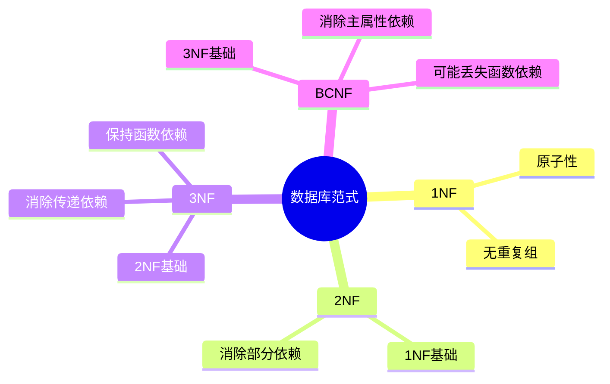
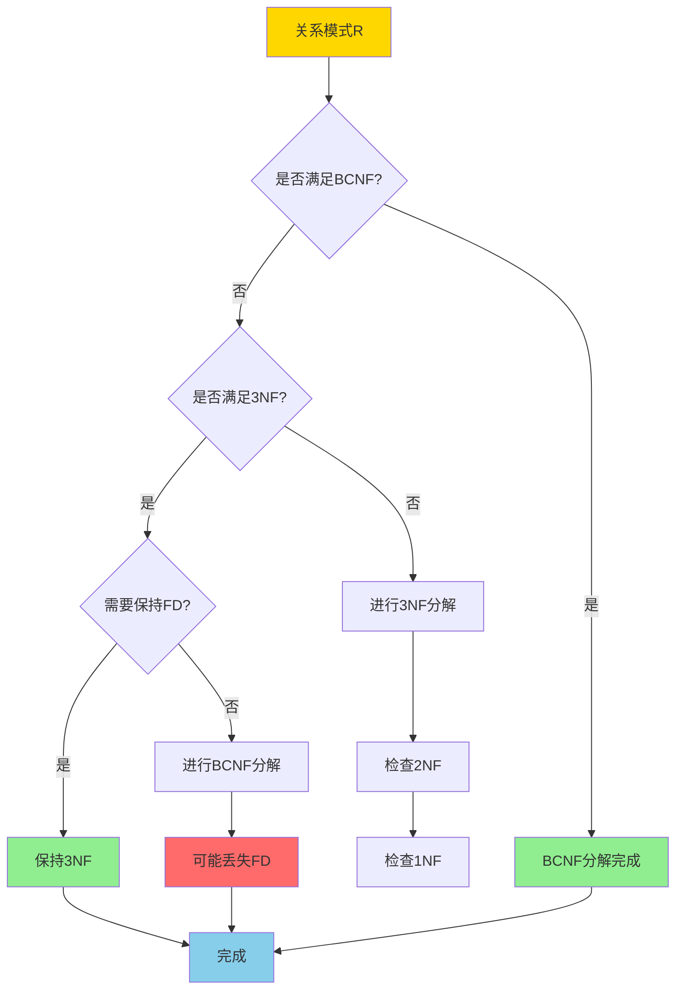
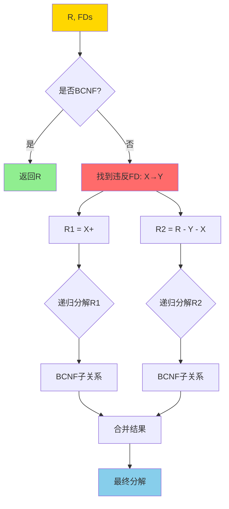
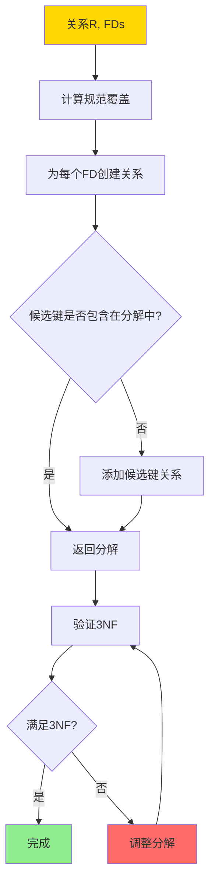
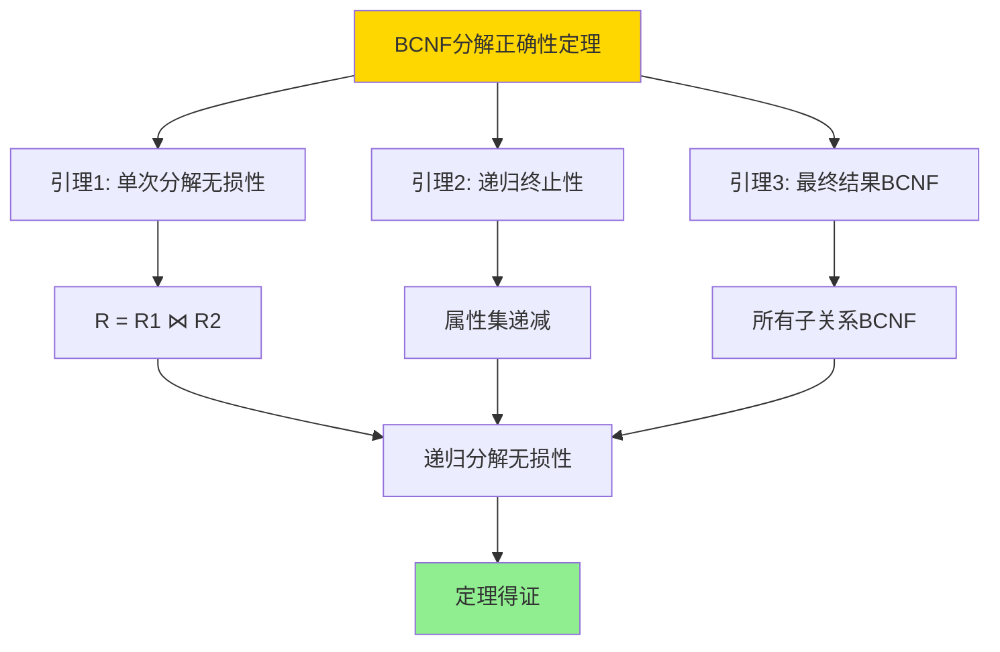
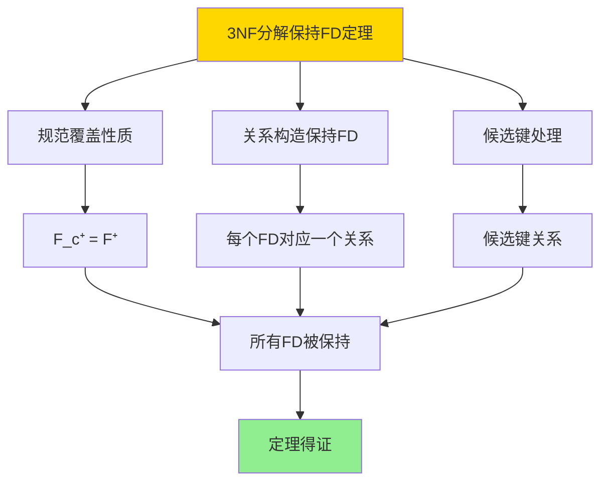
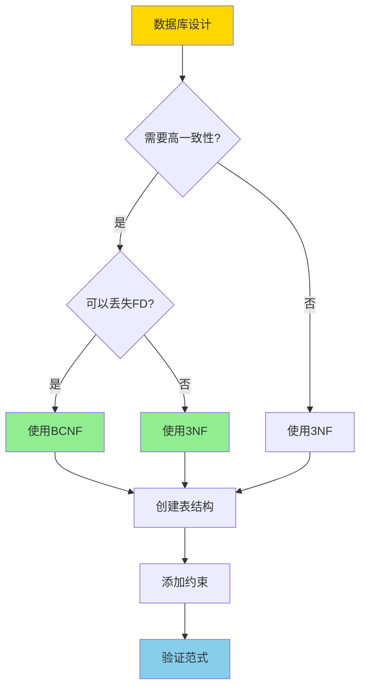

---

> **📋 文档来源**: `DataBaseTheory\09-数据模型与规范化\09.02-BCNF与3NF-完整证明稿.md`
> **📅 复制日期**: 2025-12-22
> **⚠️ 注意**: 本文档为复制版本，原文件保持不变

---

# BCNF与3NF-完整证明稿

> **文档版本**: v1.0
> **最后更新**: 2025-01-16
> **版本覆盖**: PostgreSQL 18.x (推荐) ⭐ | 17.x (推荐) | 16.x (兼容)
> **文档状态**: ✅ 内容已完成

---

## 📋 目录

- [BCNF与3NF-完整证明稿](#bcnf与3nf-完整证明稿)
  - [📋 目录](#-目录)
  - [1. 概述](#1-概述)
    - [1.0 BCNF与3NF工作原理概述](#10-bcnf与3nf工作原理概述)
    - [1.1 本文档的范围](#11-本文档的范围)
  - [2. 核心内容](#2-核心内容)
    - [2.1 BCNF分解算法](#21-bcnf分解算法)
    - [2.2 3NF分解算法](#22-3nf分解算法)
    - [2.3 算法对比](#23-算法对比)
  - [3. 形式化定义](#3-形式化定义)
    - [3.1 BCNF形式化](#31-bcnf形式化)
    - [3.2 3NF形式化](#32-3nf形式化)
  - [4. 定理与证明](#4-定理与证明)
    - [4.1 BCNF分解正确性定理](#41-bcnf分解正确性定理)
    - [4.2 3NF分解保持函数依赖定理](#42-3nf分解保持函数依赖定理)
    - [4.3 BCNF可能丢失函数依赖](#43-bcnf可能丢失函数依赖)
  - [5. 实际应用](#5-实际应用)
    - [5.1 PostgreSQL中的范式设计](#51-postgresql中的范式设计)
    - [5.2 实际应用场景](#52-实际应用场景)
      - [场景1：BCNF vs 3NF的选择](#场景1bcnf-vs-3nf的选择)
      - [场景2：范式验证工具](#场景2范式验证工具)
  - [6. 相关文档](#6-相关文档)
    - [6.1 理论基础文档](#61-理论基础文档)
  - [7. 参考文献](#7-参考文献)
    - [7.1 核心理论文献](#71-核心理论文献)
    - [7.2 规范化算法相关](#72-规范化算法相关)
    - [7.3 相关文档](#73-相关文档)

---

## 1. 概述

### 1.0 BCNF与3NF工作原理概述

**范式分解**：

BCNF（Boyce-Codd Normal Form）和3NF（Third Normal Form）是关系数据库规范化的重要范式。本文档提供BCNF和3NF分解算法的完整证明。

**范式层次思维导图**：



**范式选择决策树**：



**BCNF vs 3NF 对比矩阵**：

| 维度 | BCNF | 3NF |
|------|------|-----|
| **定义** | 每个决定因子都是候选键 | 非主属性不传递依赖于主键 |
| **消除异常** | 完全消除冗余 | 基本消除冗余 |
| **函数依赖保持** | 可能丢失 | 保持 |
| **分解唯一性** | 不唯一 | 不唯一 |
| **适用场景** | 对一致性要求极高 | 需要保持函数依赖 |
| **复杂度** | O(n²) | O(n²) |

### 1.1 本文档的范围

本文档涵盖：

- **BCNF分解算法**：BCNF分解的完整算法和证明
- **3NF分解算法**：3NF分解的完整算法和证明
- **算法正确性**：分解算法的正确性证明
- **实际应用**：范式分解在数据库设计中的应用

---

## 2. 核心内容

### 2.1 BCNF分解算法

**BCNF分解算法流程**：

```haskell
-- BCNF分解算法
bcnfDecompose :: Relation -> FunctionalDependencies -> [Relation]
bcnfDecompose R FDs =
    if isBCNF R FDs then [R]
    else
        let (X -> Y) = findViolatingFD R FDs
            R1 = closure(X, FDs)
            R2 = (attributes R) - (Y - X)
        in bcnfDecompose R1 FDs ++ bcnfDecompose R2 FDs
```

**BCNF分解证明树**：



### 2.2 3NF分解算法

**3NF分解算法流程**：

```haskell
-- 3NF分解算法（保持函数依赖）
threeNFDecompose :: Relation -> FunctionalDependencies -> [Relation]
threeNFDecompose R FDs =
    let canonicalFDs = canonicalCover FDs
        decomposed = [attributes(fd) | fd <- canonicalFDs]
        key = candidateKey R FDs
        result = if key `subset` (union decomposed)
                 then decomposed
                 else decomposed ++ [key]
    in result
```

**3NF分解决策流程**：



### 2.3 算法对比

**BCNF vs 3NF 算法对比矩阵**：

| 特性 | BCNF算法 | 3NF算法 |
|------|----------|---------|
| **输入** | 关系R, FDs | 关系R, FDs |
| **输出** | BCNF分解 | 3NF分解（保持FD） |
| **时间复杂度** | O(n²) | O(n²) |
| **空间复杂度** | O(n) | O(n) |
| **函数依赖保持** | 不保证 | 保证 |
| **分解唯一性** | 不唯一 | 不唯一 |
| **适用场景** | 高一致性要求 | 需要保持FD |

---

## 3. 形式化定义

### 3.1 BCNF形式化

**BCNF定义**：

```haskell
-- BCNF条件
isBCNF :: Relation -> FunctionalDependencies -> Bool
isBCNF R FDs =
    forall (X -> Y) in FDs:
      (X -> Y is trivial) or (X is superkey of R)
```

**BCNF形式化**：

关系R满足BCNF，当且仅当对于每个非平凡函数依赖X→Y，X都是R的超键。

### 3.2 3NF形式化

**3NF定义**：

```haskell
-- 3NF条件
is3NF :: Relation -> FunctionalDependencies -> Bool
is3NF R FDs =
    forall (X -> A) in FDs:
      (X -> A is trivial) or
      (X is superkey) or
      (A is prime attribute)
```

**3NF形式化**：

关系R满足3NF，当且仅当对于每个非平凡函数依赖X→A：

- X是超键，或
- A是主属性

---

## 4. 定理与证明

### 4.1 BCNF分解正确性定理

**定理1（BCNF分解正确性）**：

BCNF分解算法产生的分解是无损连接分解，即原始关系R可以通过分解后的关系R₁, R₂, ..., Rₙ的自然连接恢复。

**形式化表述**：

设关系R和函数依赖集合F，BCNF分解算法产生的分解为{R₁, R₂, ..., Rₙ}。则R = R₁ ⋈ R₂ ⋈ ... ⋈ Rₙ（无损连接）。

**证明**：

**步骤1：单次分解的无损性（引理1）**：

- 设关系R违反BCNF，存在非平凡函数依赖X → Y，其中X不是超键
- BCNF分解：R₁ = X⁺（X的闭包），R₂ = R - (Y - X)
- 需要证明：R = R₁ ⋈ R₂
- **包含关系（R ⊆ R₁ ⋈ R₂）**：
  - 对于任意元组t ∈ R：
    - 设t₁ = t[X⁺]（t在R₁上的投影）
    - 设t₂ = t[R - (Y - X)]（t在R₂上的投影）
    - 由于t₁[X] = t₂[X]（都是t[X]），且X ⊆ X⁺ ∩ (R - (Y - X))
    - 因此t₁和t₂可以连接，t ∈ R₁ ⋈ R₂
  - 因此R ⊆ R₁ ⋈ R₂
- **包含关系（R₁ ⋈ R₂ ⊆ R）**：
  - 对于任意元组t ∈ R₁ ⋈ R₂：
    - 存在t₁ ∈ R₁和t₂ ∈ R₂，使得t₁[X] = t₂[X]
    - 由于R₁ = X⁺，t₁[X⁺]在R中存在
    - 由于X → Y，且t₁[X] = t₂[X]，有t₁[Y] = t₂[Y]
    - 因此t₁和t₂可以合并为R中的元组t
    - 因此t ∈ R
  - 因此R₁ ⋈ R₂ ⊆ R
- 因此R = R₁ ⋈ R₂，单次分解是无损的

**步骤2：递归分解的终止性（引理2）**：

- 每次分解后，R₁和R₂的属性集都是R的真子集
- 由于属性集有限，递归分解必然在有限步内终止
- 引理2得证

**步骤3：最终结果满足BCNF（引理3）**：

- 算法终止时，所有子关系都满足BCNF条件
- 即对于每个子关系Rᵢ，所有非平凡函数依赖X → Y，X都是Rᵢ的超键
- 引理3得证

**步骤4：递归分解的无损性**：

- 设递归分解为：R → R₁, R₂ → R₁₁, R₁₂, R₂₁, R₂₂ → ...
- 由于单次分解是无损的：R = R₁ ⋈ R₂
- 由于递归分解：R₁ = R₁₁ ⋈ R₁₂, R₂ = R₂₁ ⋈ R₂₂
- 因此R = (R₁₁ ⋈ R₁₂) ⋈ (R₂₁ ⋈ R₂₂) = R₁₁ ⋈ R₁₂ ⋈ R₂₁ ⋈ R₂₂
- 递归应用，最终R = R₁ ⋈ R₂ ⋈ ... ⋈ Rₙ

**步骤5：结论**：

- BCNF分解算法产生的分解是无损连接分解
- 定理得证

**证明树**：



### 4.2 3NF分解保持函数依赖定理

**定理2（3NF分解保持函数依赖）**：

3NF分解算法产生的分解保持函数依赖，即原始函数依赖集合F中的所有函数依赖都在分解后的关系中保持。

**形式化表述**：

设关系R和函数依赖集合F，3NF分解算法产生的分解为{R₁, R₂, ..., Rₙ}。则对于任意函数依赖X → Y ∈ F⁺，存在Rᵢ使得X → Y在Rᵢ中保持。

**证明**：

**步骤1：规范覆盖的性质**：

- 3NF分解算法首先计算F的规范覆盖F_c
- 规范覆盖F_c满足：
  - F_c⁺ = F⁺（闭包等价）
  - F_c中每个函数依赖的右部是单属性
  - F_c中每个函数依赖的左部是极小的

**步骤2：关系构造保持FD**：

- 对于规范覆盖F_c中的每个函数依赖X → A，算法创建关系Rᵢ = X ∪ {A}
- 由于Rᵢ包含X和A，函数依赖X → A在Rᵢ中保持
- 因此F_c中的所有函数依赖都在分解后的关系中保持

**步骤3：候选键处理**：

- 如果候选键K不在任何Rᵢ中，算法添加关系R_key = K
- 由于K是候选键，K → attributes(R)在R中成立
- 在R_key中，K → K成立（自反律）
- 因此候选键相关的函数依赖被保持

**步骤4：F⁺中的函数依赖保持**：

- 对于任意函数依赖X → Y ∈ F⁺：
  - 由于F_c⁺ = F⁺，存在函数依赖序列X → A₁, A₁ → A₂, ..., Aₙ → Y在F_c中
  - 每个Aᵢ → Aᵢ₊₁都在某个Rᵢ中保持
  - 通过传递律，X → Y在分解后的关系中保持

**步骤5：结论**：

- 3NF分解算法产生的分解保持函数依赖
- 定理得证

**证明树**：



### 4.3 BCNF可能丢失函数依赖

**定理**：BCNF分解可能丢失函数依赖。

**反例**：

```text
关系R(ABCD), FDs = {AB→C, C→D, D→A}

候选键: AB, BC, BD
违反BCNF: C→D (C不是超键)

BCNF分解:
R1(CD), FDs = {C→D}
R2(ABC), FDs = {AB→C}

丢失FD: D→A (无法在R1或R2中表示)
```

---

## 5. 实际应用

### 5.1 PostgreSQL中的范式设计

**设计决策树**：



**BCNF设计示例**：

```sql
-- 原始关系（违反BCNF）
CREATE TABLE orders (
    order_id SERIAL PRIMARY KEY,
    customer_id INT,
    customer_name VARCHAR(100),
    product_id INT,
    product_name VARCHAR(100),
    quantity INT
);
-- 问题: customer_id → customer_name (customer_id不是超键)

-- BCNF分解
CREATE TABLE customers (
    customer_id INT PRIMARY KEY,
    customer_name VARCHAR(100)
);

CREATE TABLE products (
    product_id INT PRIMARY KEY,
    product_name VARCHAR(100)
);

CREATE TABLE orders (
    order_id SERIAL PRIMARY KEY,
    customer_id INT REFERENCES customers(customer_id),
    product_id INT REFERENCES products(product_id),
    quantity INT
);
```

**3NF设计示例**：

```sql
-- 需要保持函数依赖的情况
-- 原始关系
CREATE TABLE employees (
    emp_id SERIAL PRIMARY KEY,
    dept_id INT,
    dept_name VARCHAR(100),
    manager_id INT,
    manager_name VARCHAR(100)
);
-- FDs: dept_id → dept_name, manager_id → manager_name

-- 3NF分解（保持FD）
CREATE TABLE departments (
    dept_id INT PRIMARY KEY,
    dept_name VARCHAR(100)
);

CREATE TABLE managers (
    manager_id INT PRIMARY KEY,
    manager_name VARCHAR(100)
);

CREATE TABLE employees (
    emp_id SERIAL PRIMARY KEY,
    dept_id INT REFERENCES departments(dept_id),
    manager_id INT REFERENCES managers(manager_id)
);
```

### 5.2 实际应用场景

#### 场景1：BCNF vs 3NF的选择

**业务背景**：

系统设计需要选择BCNF还是3NF，需要权衡数据一致性和函数依赖保持。

**PostgreSQL 18实现**：

```sql
-- 场景：BCNF vs 3NF选择
-- 情况1：可以选择BCNF（可以接受丢失FD）
-- 原始关系
CREATE TABLE student_courses (
    student_id BIGINT,
    course_id INT,
    instructor_id INT,
    instructor_name VARCHAR(100),
    grade CHAR(1),
    PRIMARY KEY (student_id, course_id)
);
-- FDs: {student_id, course_id} → grade, instructor_id → instructor_name
-- 违反BCNF: instructor_id → instructor_name (instructor_id不是超键)

-- BCNF分解（可能丢失FD）
CREATE TABLE instructors (
    instructor_id SERIAL PRIMARY KEY,
    instructor_name VARCHAR(100) NOT NULL
);

CREATE TABLE student_courses (
    student_id BIGINT NOT NULL,
    course_id INT NOT NULL,
    instructor_id INT REFERENCES instructors(instructor_id),
    grade CHAR(1),
    PRIMARY KEY (student_id, course_id)
);
-- 丢失FD: 如果instructor_id → course_id，这个FD可能丢失

-- 情况2：必须选择3NF（需要保持FD）
-- 原始关系
CREATE TABLE employees (
    emp_id SERIAL PRIMARY KEY,
    dept_id INT,
    dept_name VARCHAR(100),
    manager_id INT,
    manager_name VARCHAR(100)
);
-- FDs: dept_id → dept_name, manager_id → manager_name, emp_id → dept_id, emp_id → manager_id

-- 3NF分解（保持FD）
CREATE TABLE departments (
    dept_id SERIAL PRIMARY KEY,
    dept_name VARCHAR(100) NOT NULL UNIQUE
);

CREATE TABLE managers (
    manager_id SERIAL PRIMARY KEY,
    manager_name VARCHAR(100) NOT NULL
);

CREATE TABLE employees (
    emp_id SERIAL PRIMARY KEY,
    dept_id INT NOT NULL REFERENCES departments(dept_id),
    manager_id INT NOT NULL REFERENCES managers(manager_id)
);
-- 所有FD都被保持
```

#### 场景2：范式验证工具

**PostgreSQL 18实现**：

```sql
-- 范式验证函数
CREATE OR REPLACE FUNCTION verify_bcnf(
    p_table_name TEXT,
    p_functional_dependencies JSONB
)
RETURNS TABLE (
    is_bcnf BOOLEAN,
    violations JSONB
) AS $$
DECLARE
    v_fd JSONB;
    v_violations JSONB := '[]'::JSONB;
    v_is_bcnf BOOLEAN := TRUE;
BEGIN
    -- 检查每个函数依赖
    FOR v_fd IN SELECT * FROM jsonb_array_elements(p_functional_dependencies)
    LOOP
        DECLARE
            v_determinant TEXT[] := ARRAY(SELECT jsonb_array_elements_text(v_fd->'determinant'));
            v_dependent TEXT[] := ARRAY(SELECT jsonb_array_elements_text(v_fd->'dependent'));
            v_is_superkey BOOLEAN;
        BEGIN
            -- 检查determinant是否是超键
            SELECT is_superkey(p_table_name, v_determinant) INTO v_is_superkey;

            IF NOT v_is_superkey THEN
                v_is_bcnf := FALSE;
                v_violations := v_violations || jsonb_build_object(
                    'determinant', v_determinant,
                    'dependent', v_dependent,
                    'reason', 'Determinant is not a superkey'
                );
            END IF;
        END;
    END LOOP;

    RETURN QUERY SELECT v_is_bcnf, v_violations;
END;
$$ LANGUAGE plpgsql;
```

---

## 6. 相关文档

### 6.1 理论基础文档

- [关系约束与规范化-函数依赖与范式证明](./09.01-关系约束与规范化-函数依赖与范式证明.md)
- [形式语言与证明：总论](../../25-理论体系/25.01-形式化方法/01.05-形式语言与证明-总论.md)
- [理论基础导航](../README.md)

---

## 7. 参考文献

### 7.1 核心理论文献

- **Codd, E. F. (1970). "A Relational Model of Data for Large Shared Data Banks."**
  - 会议: Communications of the ACM 1970
  - **重要性**: 关系模型的奠基性论文
  - **核心贡献**: 提出了关系模型和规范化理论

- **Boyce, R. F., & Codd, E. F. (1974). "Further Normalization of the Data Base Relational Model."**
  - 会议: IFIP Working Conference 1974
  - **重要性**: BCNF的提出
  - **核心贡献**: 提出了BCNF范式

### 7.2 规范化算法相关

- **Bernstein, P. A. (1976). "Synthesizing Third Normal Form Relations from Functional Dependencies."**
  - 会议: ACM TODS 1976
  - **重要性**: 3NF合成算法的经典论文
  - **核心贡献**: 提出了保持函数依赖的3NF分解算法

### 7.3 相关文档

- [关系约束与规范化-函数依赖与范式证明](./09.01-关系约束与规范化-函数依赖与范式证明.md)
- [理论基础导航](../README.md)

---

**最后更新**: 2025-01-16
**维护者**: Documentation Team
**状态**: ✅ 内容已完成
