---

> **📋 文档来源**: `PostgreSQL\09-应用设计\数据模型设计\09.03-数据仓库设计指南.md`
> **📅 复制日期**: 2025-12-22
> **⚠️ 注意**: 本文档为复制版本，原文件保持不变

---

# PostgreSQL数据仓库设计完整指南

> **版本**: v1.1
> **最后更新**: 2025-11-22
> **版本覆盖**: PostgreSQL 18.x (推荐) ⭐ | 17.x (推荐) | 16.x (兼容)
> **难度**: ⭐⭐⭐⭐⭐
> **应用场景**: 数据仓库、商业智能、OLAP分析、报表系统、数据挖掘

---

## 📋 目录

- [PostgreSQL数据仓库设计完整指南](#postgresql数据仓库设计完整指南)
  - [📋 目录](#-目录)
  - [一、概述](#一概述)
    - [1.1 数据仓库概念](#11-数据仓库概念)
    - [1.2 数据仓库架构](#12-数据仓库架构)
    - [1.3 PostgreSQL数据仓库优势](#13-postgresql数据仓库优势)
    - [1.4 版本要求](#14-版本要求)
  - [二、数据仓库建模](#二数据仓库建模)
    - [2.1 星型模型](#21-星型模型)
    - [2.2 雪花模型](#22-雪花模型)
    - [2.3 事实表设计](#23-事实表设计)
    - [2.4 维度表设计](#24-维度表设计)
  - [三、ETL流程设计](#三etl流程设计)
    - [3.1 数据抽取](#31-数据抽取)
    - [3.2 数据转换](#32-数据转换)
    - [3.3 数据加载](#33-数据加载)
    - [3.4 增量更新](#34-增量更新)
  - [四、性能优化](#四性能优化)
    - [4.1 分区策略](#41-分区策略)
    - [4.2 索引优化](#42-索引优化)
    - [4.3 物化视图](#43-物化视图)
    - [4.4 并行查询](#44-并行查询)
    - [4.5 列存储优化 🆕](#45-列存储优化-)
      - [📊 数据仓库列存储方案选择决策树](#-数据仓库列存储方案选择决策树)
      - [📊 列存储方案对比矩阵](#-列存储方案对比矩阵)
      - [📊 数据仓库列存储架构图](#-数据仓库列存储架构图)
      - [📊 数据仓库ETL到列存储数据流图](#-数据仓库etl到列存储数据流图)
      - [📊 数据仓库星型模型列存储ER图](#-数据仓库星型模型列存储er图)
      - [📊 列存储ETL流程时序图](#-列存储etl流程时序图)
  - [五、数据质量](#五数据质量)
    - [5.1 数据清洗](#51-数据清洗)
    - [5.2 数据验证](#52-数据验证)
    - [5.3 数据一致性](#53-数据一致性)
  - [六、实践案例](#六实践案例)
    - [6.1 零售数据仓库](#61-零售数据仓库)
    - [6.2 金融数据仓库](#62-金融数据仓库)
    - [6.3 电商数据仓库](#63-电商数据仓库)
  - [七、现代数据仓库架构](#七现代数据仓库架构)
    - [7.1 实时数据仓库](#71-实时数据仓库)
    - [7.2 数据湖集成](#72-数据湖集成)
    - [7.3 AI辅助数据仓库建模](#73-ai辅助数据仓库建模)
    - [7.4 数据网格（Data Mesh）架构 🆕](#74-数据网格data-mesh架构-)
  - [八、PostgreSQL 18新特性](#八postgresql-18新特性)
    - [8.1 并行查询增强](#81-并行查询增强)
    - [8.2 异步I/O优化](#82-异步io优化)
    - [8.3 增量备份优化](#83-增量备份优化)
  - [九、最佳实践](#九最佳实践)
  - [十、参考资源](#十参考资源)
    - [9.1 官方文档](#91-官方文档)
    - [9.2 相关文档](#92-相关文档)
    - [9.3 外部资源](#93-外部资源)
  - [十一、交叉引用](#十一交叉引用)
    - [相关文档](#相关文档)
    - [外部资源](#外部资源)

---

## 一、概述

### 1.1 数据仓库概念

**数据仓库（Data Warehouse）**是一个面向主题的、集成的、相对稳定的、反映历史变化的数据集合，用于支持管理决策。

**数据仓库特征**：

- **面向主题**：围绕业务主题组织数据
- **集成性**：整合多个数据源
- **非易失性**：数据相对稳定，主要进行查询
- **时变性**：反映历史变化

**数据仓库与OLTP的区别**：

| 特性 | OLTP | 数据仓库（OLAP） |
| --- | --- | --- |
| **用途** | 事务处理 | 分析决策 |
| **数据模型** | 规范化模型 | 维度模型 |
| **查询类型** | 简单查询，频繁更新 | 复杂查询，批量加载 |
| **数据量** | 相对较小 | 通常很大 |
| **性能要求** | 低延迟写入 | 快速查询 |

### 1.2 数据仓库架构

**数据仓库架构层次**：

```text
┌─────────────┐
│  数据源层    │  ← OLTP系统、外部数据源
└──────┬──────┘
       │
       ▼
┌─────────────┐
│  ETL层      │  ← 数据抽取、转换、加载
└──────┬──────┘
       │
       ▼
┌─────────────┐
│  数据仓库层  │  ← 事实表、维度表
└──────┬──────┘
       │
       ▼
┌─────────────┐
│  数据集市层  │  ← 面向特定主题的数据集市
└──────┬──────┘
       │
       ▼
┌─────────────┐
│  应用层      │  ← BI工具、报表系统
└─────────────┘
```

### 1.3 PostgreSQL数据仓库优势

**PostgreSQL在数据仓库中的优势**：

- ✅ **强大的SQL功能**：支持复杂的分析查询
- ✅ **并行查询**：支持并行处理大数据集
- ✅ **分区支持**：支持多种分区策略
- ✅ **物化视图**：支持预计算和缓存
- ✅ **扩展支持**：支持PostGIS、pgvector等扩展
- ✅ **成本效益**：开源免费，成本低

### 1.4 版本要求

- **PostgreSQL 18.x**（推荐）- 支持并行查询增强、异步I/O
- **PostgreSQL 17.x**（推荐）- 功能完整
- **PostgreSQL 16.x**（兼容）- 基础功能支持

---

## 二、数据仓库建模

### 2.1 星型模型

**星型模型**是数据仓库最常用的模型，由一个事实表和多个维度表组成。

**星型模型结构**：

```sql
-- 事实表（Fact Table）
CREATE TABLE sales_fact (
    sale_id BIGSERIAL,
    -- 维度键（Dimension Keys）
    date_id INTEGER NOT NULL REFERENCES date_dim(date_id),
    product_id INTEGER NOT NULL REFERENCES product_dim(product_id),
    customer_id INTEGER NOT NULL REFERENCES customer_dim(customer_id),
    store_id INTEGER NOT NULL REFERENCES store_dim(store_id),
    -- 度量（Measures）
    quantity INTEGER NOT NULL,
    amount NUMERIC(10,2) NOT NULL,
    cost NUMERIC(10,2) NOT NULL,
    profit NUMERIC(10,2) GENERATED ALWAYS AS (amount - cost) STORED,
    discount_amount NUMERIC(10,2) DEFAULT 0,
    PRIMARY KEY (sale_id, date_id)
) PARTITION BY RANGE (date_id);

-- 日期维度表
CREATE TABLE date_dim (
    date_id INTEGER PRIMARY KEY,
    date DATE NOT NULL UNIQUE,
    -- 日期属性
    year INTEGER NOT NULL,
    quarter INTEGER NOT NULL,
    month INTEGER NOT NULL,
    week INTEGER NOT NULL,
    day_of_month INTEGER NOT NULL,
    day_of_week INTEGER NOT NULL,
    day_name VARCHAR(20) NOT NULL,
    is_weekend BOOLEAN NOT NULL,
    is_holiday BOOLEAN NOT NULL,
    holiday_name VARCHAR(100),
    -- 财务年度
    fiscal_year INTEGER,
    fiscal_quarter INTEGER,
    fiscal_month INTEGER
);

-- 产品维度表（扁平化）
CREATE TABLE product_dim (
    product_id INTEGER PRIMARY KEY,
    product_code VARCHAR(50) UNIQUE NOT NULL,
    product_name VARCHAR(200) NOT NULL,
    -- 直接存储分类信息（不规范化）
    category_id INTEGER NOT NULL,
    category_name VARCHAR(100) NOT NULL,
    category_group VARCHAR(50),
    -- 直接存储品牌信息
    brand_id INTEGER NOT NULL,
    brand_name VARCHAR(100) NOT NULL,
    manufacturer VARCHAR(200),
    -- 产品属性
    price NUMERIC(10,2) NOT NULL,
    cost NUMERIC(10,2) NOT NULL,
    unit VARCHAR(20),
    -- SCD类型2：版本控制
    effective_date DATE NOT NULL,
    expiry_date DATE,
    is_current BOOLEAN DEFAULT TRUE
);

-- 客户维度表
CREATE TABLE customer_dim (
    customer_id INTEGER PRIMARY KEY,
    customer_code VARCHAR(50) UNIQUE NOT NULL,
    customer_name VARCHAR(100) NOT NULL,
    -- 人口统计信息
    gender VARCHAR(10),
    age INTEGER,
    age_group VARCHAR(20),
    -- 地理信息
    city VARCHAR(100),
    province VARCHAR(100),
    region VARCHAR(100),
    country VARCHAR(100),
    -- 客户分类
    customer_segment VARCHAR(50),
    customer_type VARCHAR(50),
    -- SCD类型2：版本控制
    effective_date DATE NOT NULL,
    expiry_date DATE,
    is_current BOOLEAN DEFAULT TRUE
);

-- 门店维度表
CREATE TABLE store_dim (
    store_id INTEGER PRIMARY KEY,
    store_code VARCHAR(50) UNIQUE NOT NULL,
    store_name VARCHAR(200) NOT NULL,
    -- 地理信息
    city VARCHAR(100),
    province VARCHAR(100),
    region VARCHAR(100),
    country VARCHAR(100),
    address TEXT,
    -- 门店属性
    store_type VARCHAR(50),
    store_size NUMERIC(10,2),
    opening_date DATE,
    -- SCD类型2：版本控制
    effective_date DATE NOT NULL,
    expiry_date DATE,
    is_current BOOLEAN DEFAULT TRUE
);
```

### 2.2 雪花模型

**雪花模型**是规范化的维度模型，维度表进一步规范化。

```sql
-- 雪花模型：维度表规范化
CREATE TABLE product_dim (
    product_id INTEGER PRIMARY KEY,
    product_code VARCHAR(50) UNIQUE NOT NULL,
    product_name VARCHAR(200) NOT NULL,
    category_id INTEGER NOT NULL REFERENCES category_dim(category_id),
    brand_id INTEGER NOT NULL REFERENCES brand_dim(brand_id),
    price NUMERIC(10,2) NOT NULL,
    cost NUMERIC(10,2) NOT NULL
);

CREATE TABLE category_dim (
    category_id INTEGER PRIMARY KEY,
    category_name VARCHAR(100) NOT NULL,
    category_group_id INTEGER NOT NULL REFERENCES category_group_dim(category_group_id)
);

CREATE TABLE category_group_dim (
    category_group_id INTEGER PRIMARY KEY,
    category_group_name VARCHAR(100) NOT NULL
);

CREATE TABLE brand_dim (
    brand_id INTEGER PRIMARY KEY,
    brand_name VARCHAR(100) NOT NULL,
    manufacturer_id INTEGER NOT NULL REFERENCES manufacturer_dim(manufacturer_id)
);

CREATE TABLE manufacturer_dim (
    manufacturer_id INTEGER PRIMARY KEY,
    manufacturer_name VARCHAR(200) NOT NULL,
    country VARCHAR(100),
    region VARCHAR(100)
);
```

### 2.3 事实表设计

**事实表类型**：

**1. 事务事实表**：记录每个事务事件

```sql
-- 事务事实表：记录每笔销售
CREATE TABLE sales_fact (
    sale_id BIGSERIAL,
    date_id INTEGER NOT NULL,
    product_id INTEGER NOT NULL,
    customer_id INTEGER NOT NULL,
    store_id INTEGER NOT NULL,
    -- 度量
    quantity INTEGER NOT NULL,
    amount NUMERIC(10,2) NOT NULL,
    cost NUMERIC(10,2) NOT NULL,
    PRIMARY KEY (sale_id, date_id)
) PARTITION BY RANGE (date_id);
```

**2. 快照事实表**：记录特定时间点的状态

```sql
-- 快照事实表：每日库存快照
CREATE TABLE inventory_snapshot_fact (
    snapshot_id BIGSERIAL,
    date_id INTEGER NOT NULL,
    product_id INTEGER NOT NULL,
    store_id INTEGER NOT NULL,
    -- 度量
    quantity_on_hand INTEGER NOT NULL,
    quantity_on_order INTEGER DEFAULT 0,
    reorder_level INTEGER,
    PRIMARY KEY (snapshot_id, date_id)
) PARTITION BY RANGE (date_id);
```

**3. 累积快照事实表**：记录过程的多个阶段

```sql
-- 累积快照事实表：订单处理流程
CREATE TABLE order_process_fact (
    order_id BIGINT NOT NULL,
    order_date_id INTEGER NOT NULL,
    ship_date_id INTEGER,
    delivery_date_id INTEGER,
    customer_id INTEGER NOT NULL,
    product_id INTEGER NOT NULL,
    -- 度量
    order_amount NUMERIC(10,2) NOT NULL,
    shipping_cost NUMERIC(10,2),
    days_to_ship INTEGER,
    days_to_deliver INTEGER,
    PRIMARY KEY (order_id, order_date_id)
);
```

### 2.4 维度表设计

**维度表设计原则**：

```sql
-- 维度表设计示例：产品维度（SCD类型2）
CREATE TABLE product_dim (
    product_id INTEGER PRIMARY KEY,
    product_code VARCHAR(50) NOT NULL,
    product_name VARCHAR(200) NOT NULL,
    category_id INTEGER NOT NULL,
    brand_id INTEGER NOT NULL,
    price NUMERIC(10,2) NOT NULL,
    -- SCD类型2字段
    effective_date DATE NOT NULL,
    expiry_date DATE,
    is_current BOOLEAN DEFAULT TRUE,
    -- 代理键
    surrogate_key BIGSERIAL UNIQUE NOT NULL
);

-- 查询当前版本的产品
SELECT * FROM product_dim WHERE is_current = TRUE;

-- 查询历史版本的产品
SELECT * FROM product_dim WHERE product_code = 'P001' ORDER BY effective_date;
```

**缓慢变化维度（SCD）类型**：

- **SCD类型1**：覆盖旧值
- **SCD类型2**：创建新记录（推荐）
- **SCD类型3**：添加新列

---

## 三、ETL流程设计

### 3.1 数据抽取

**数据抽取**从各种数据源提取数据。

```sql
-- 使用外部数据包装器（FDW）抽取数据
CREATE EXTENSION IF NOT EXISTS postgres_fdw;

-- 创建外部服务器
CREATE SERVER source_db
FOREIGN DATA WRAPPER postgres_fdw
OPTIONS (host 'source_host', port '5432', dbname 'source_db');

-- 创建用户映射
CREATE USER MAPPING FOR CURRENT_USER
SERVER source_db
OPTIONS (user 'source_user', password 'source_password');

-- 创建外部表
CREATE FOREIGN TABLE source_orders (
    order_id BIGINT,
    user_id BIGINT,
    order_date DATE,
    amount NUMERIC(10,2)
) SERVER source_db
OPTIONS (schema_name 'public', table_name 'orders');

-- 抽取数据到临时表
CREATE TEMP TABLE temp_orders AS
SELECT * FROM source_orders
WHERE order_date >= CURRENT_DATE - INTERVAL '1 day';
```

### 3.2 数据转换

**数据转换**清洗和转换数据。

```sql
-- 数据清洗和转换函数
-- 转换订单数据函数（带完整错误处理）
CREATE OR REPLACE FUNCTION transform_orders()
RETURNS INTEGER
LANGUAGE plpgsql
AS $$
DECLARE
    v_transformed_count INTEGER := 0;
BEGIN
    -- 检查必需表是否存在
    IF NOT EXISTS (SELECT 1 FROM information_schema.tables WHERE table_schema = 'public' AND table_name = 'temp_orders') THEN
        RAISE EXCEPTION 'temp_orders表不存在';
    END IF;

    IF NOT EXISTS (SELECT 1 FROM information_schema.tables WHERE table_schema = 'public' AND table_name = 'staging_orders') THEN
        RAISE EXCEPTION 'staging_orders表不存在';
    END IF;

    IF NOT EXISTS (SELECT 1 FROM information_schema.tables WHERE table_schema = 'public' AND table_name = 'date_dim') THEN
        RAISE EXCEPTION 'date_dim表不存在';
    END IF;

    IF NOT EXISTS (SELECT 1 FROM information_schema.tables WHERE table_schema = 'public' AND table_name = 'customer_dim') THEN
        RAISE EXCEPTION 'customer_dim表不存在';
    END IF;

    -- 清洗和转换订单数据
    BEGIN
        INSERT INTO staging_orders (
            order_id, date_id, customer_id, amount, status
        )
        SELECT
            o.order_id,
            d.date_id,
            c.customer_id,
            COALESCE(o.amount, 0) AS amount,
            CASE
                WHEN o.status = 'completed' THEN 'delivered'
                WHEN o.status = 'pending' THEN 'pending'
                ELSE 'other'
            END AS status
        FROM temp_orders o
        INNER JOIN date_dim d ON d.date = o.order_date
        INNER JOIN customer_dim c ON c.customer_code = o.user_id::text
        WHERE COALESCE(o.amount, 0) > 0  -- 过滤无效数据
          AND o.order_date >= '2024-01-01'  -- 只处理有效日期范围
          AND o.order_date IS NOT NULL
          AND o.user_id IS NOT NULL;

        GET DIAGNOSTICS v_transformed_count = ROW_COUNT;
        RAISE NOTICE '转换订单数据: % 条', v_transformed_count;
    EXCEPTION
        WHEN unique_violation THEN
            RAISE WARNING '存在重复的订单ID';
        WHEN foreign_key_violation THEN
            RAISE EXCEPTION '违反外键约束，请检查date_dim和customer_dim数据';
        WHEN numeric_value_out_of_range THEN
            RAISE EXCEPTION '金额数值溢出';
        WHEN OTHERS THEN
            RAISE EXCEPTION '转换订单数据失败: %', SQLERRM;
    END;

    RETURN v_transformed_count;
EXCEPTION
    WHEN OTHERS THEN
        RAISE EXCEPTION 'transform_orders执行失败: %', SQLERRM;
END;
$$;
```

### 3.3 数据加载

**数据加载**将转换后的数据加载到数据仓库。

```sql
-- 数据加载函数（带完整错误处理）
CREATE OR REPLACE FUNCTION load_sales_fact()
RETURNS INTEGER
LANGUAGE plpgsql
AS $$
DECLARE
    v_loaded_count INTEGER := 0;
BEGIN
    -- 检查必需表是否存在
    IF NOT EXISTS (SELECT 1 FROM information_schema.tables WHERE table_schema = 'public' AND table_name = 'sales_fact') THEN
        RAISE EXCEPTION 'sales_fact表不存在';
    END IF;

    IF NOT EXISTS (SELECT 1 FROM information_schema.tables WHERE table_schema = 'public' AND table_name = 'staging_orders') THEN
        RAISE EXCEPTION 'staging_orders表不存在';
    END IF;

    IF NOT EXISTS (SELECT 1 FROM information_schema.tables WHERE table_schema = 'public' AND table_name = 'staging_order_items') THEN
        RAISE EXCEPTION 'staging_order_items表不存在';
    END IF;

    -- 加载到事实表
    BEGIN
        INSERT INTO sales_fact (
            date_id, product_id, customer_id, store_id,
            quantity, amount, cost
        )
        SELECT
            so.date_id,
            p.product_id,
            so.customer_id,
            s.store_id,
            COALESCE(oi.quantity, 0) AS quantity,
            COALESCE(oi.amount, 0) AS amount,
            COALESCE(oi.cost, 0) AS cost
        FROM staging_orders so
        INNER JOIN staging_order_items oi ON oi.order_id = so.order_id
        INNER JOIN product_dim p ON p.product_code = oi.product_code
            AND p.is_current = TRUE
        INNER JOIN store_dim s ON s.store_code = so.store_code
            AND s.is_current = TRUE
        WHERE NOT EXISTS (
            SELECT 1 FROM sales_fact sf
            WHERE sf.sale_id = so.order_id
              AND sf.date_id = so.date_id
        )  -- 避免重复加载
          AND so.date_id IS NOT NULL
          AND p.product_id IS NOT NULL
          AND so.customer_id IS NOT NULL
          AND s.store_id IS NOT NULL;

        GET DIAGNOSTICS v_loaded_count = ROW_COUNT;
        RAISE NOTICE '加载销售事实数据: % 条', v_loaded_count;
    EXCEPTION
        WHEN unique_violation THEN
            RAISE WARNING '存在重复的销售事实记录';
        WHEN foreign_key_violation THEN
            RAISE EXCEPTION '违反外键约束，请检查维度表数据';
        WHEN numeric_value_out_of_range THEN
            RAISE EXCEPTION '金额或数量数值溢出';
        WHEN OTHERS THEN
            RAISE EXCEPTION '加载销售事实数据失败: %', SQLERRM;
    END;

    RETURN v_loaded_count;
EXCEPTION
    WHEN OTHERS THEN
        RAISE EXCEPTION 'load_sales_fact执行失败: %', SQLERRM;
END;
$$;
```

### 3.4 增量更新

**增量更新**只处理变更的数据。

```sql
-- 增量更新函数（带完整错误处理）
CREATE OR REPLACE FUNCTION incremental_update_sales()
RETURNS INTEGER
LANGUAGE plpgsql
AS $$
DECLARE
    v_last_update_date DATE;
    v_updated_count INTEGER := 0;
BEGIN
    -- 检查必需表是否存在
    IF NOT EXISTS (SELECT 1 FROM information_schema.tables WHERE table_schema = 'public' AND table_name = 'sales_fact') THEN
        RAISE EXCEPTION 'sales_fact表不存在';
    END IF;

    IF NOT EXISTS (SELECT 1 FROM information_schema.tables WHERE table_schema = 'public' AND table_name = 'date_dim') THEN
        RAISE EXCEPTION 'date_dim表不存在';
    END IF;

    -- 获取上次更新时间
    BEGIN
        SELECT MAX(d.date) INTO v_last_update_date
        FROM date_dim d
        INNER JOIN sales_fact sf ON sf.date_id = d.date_id;
    EXCEPTION
        WHEN OTHERS THEN
            RAISE WARNING '获取上次更新时间失败: %', SQLERRM;
            v_last_update_date := NULL;
    END;

    -- 如果没有历史数据，从指定日期开始
    IF v_last_update_date IS NULL THEN
        v_last_update_date := '2024-01-01';
        RAISE NOTICE '没有历史数据，从 % 开始增量更新', v_last_update_date;
    ELSE
        RAISE NOTICE '上次更新日期: %', v_last_update_date;
    END IF;

    -- 增量加载新数据
    BEGIN
        INSERT INTO sales_fact (
            date_id, product_id, customer_id, store_id,
            quantity, amount, cost
        )
        SELECT
            so.date_id,
            p.product_id,
            so.customer_id,
            s.store_id,
            COALESCE(oi.quantity, 0) AS quantity,
            COALESCE(oi.amount, 0) AS amount,
            COALESCE(oi.cost, 0) AS cost
        FROM staging_orders so
        INNER JOIN staging_order_items oi ON oi.order_id = so.order_id
        INNER JOIN product_dim p ON p.product_code = oi.product_code
            AND p.is_current = TRUE
        INNER JOIN store_dim s ON s.store_code = so.store_code
            AND s.is_current = TRUE
        INNER JOIN date_dim d ON d.date_id = so.date_id
        WHERE d.date > v_last_update_date
          AND so.date_id IS NOT NULL
          AND p.product_id IS NOT NULL
          AND so.customer_id IS NOT NULL
          AND s.store_id IS NOT NULL
          AND NOT EXISTS (
              SELECT 1 FROM sales_fact sf
              WHERE sf.sale_id = so.order_id
                AND sf.date_id = so.date_id
          );

        GET DIAGNOSTICS v_updated_count = ROW_COUNT;
        RAISE NOTICE '增量更新销售数据: % 条', v_updated_count;
    EXCEPTION
        WHEN unique_violation THEN
            RAISE WARNING '存在重复的销售事实记录';
        WHEN foreign_key_violation THEN
            RAISE EXCEPTION '违反外键约束，请检查维度表数据';
        WHEN numeric_value_out_of_range THEN
            RAISE EXCEPTION '金额或数量数值溢出';
        WHEN OTHERS THEN
            RAISE EXCEPTION '增量加载新数据失败: %', SQLERRM;
    END;

    RETURN v_updated_count;
EXCEPTION
    WHEN OTHERS THEN
        RAISE EXCEPTION 'incremental_update_sales执行失败: %', SQLERRM;
END;
$$;
```

---

## 四、性能优化

### 4.1 分区策略

**分区策略**用于管理大数据表。

```sql
-- 按日期分区事实表
CREATE TABLE sales_fact (
    sale_id BIGSERIAL,
    date_id INTEGER NOT NULL,
    product_id INTEGER NOT NULL,
    customer_id INTEGER NOT NULL,
    store_id INTEGER NOT NULL,
    quantity INTEGER NOT NULL,
    amount NUMERIC(10,2) NOT NULL,
    cost NUMERIC(10,2) NOT NULL,
    PRIMARY KEY (sale_id, date_id)
) PARTITION BY RANGE (date_id);

-- 创建月度分区
CREATE TABLE sales_fact_2024_01 PARTITION OF sales_fact
    FOR VALUES FROM (20240101) TO (20240201);

CREATE TABLE sales_fact_2024_02 PARTITION OF sales_fact
    FOR VALUES FROM (20240201) TO (20240301);

-- 自动创建分区函数（带完整错误处理）
CREATE OR REPLACE FUNCTION create_monthly_partition(p_table_name TEXT, p_start_date DATE)
RETURNS void
LANGUAGE plpgsql
AS $$
DECLARE
    v_partition_name TEXT;
    v_start_date DATE;
    v_end_date DATE;
    v_start_int INTEGER;
    v_end_int INTEGER;
BEGIN
    -- 参数验证
    IF p_table_name IS NULL OR TRIM(p_table_name) = '' THEN
        RAISE EXCEPTION '表名不能为空';
    END IF;

    IF p_start_date IS NULL THEN
        RAISE EXCEPTION '开始日期不能为空';
    END IF;

    -- 表名格式验证（防止SQL注入）
    IF p_table_name !~ '^[a-zA-Z_][a-zA-Z0-9_]*$' THEN
        RAISE EXCEPTION '表名格式无效: %', p_table_name;
    END IF;

    -- 检查主表是否存在
    IF NOT EXISTS (SELECT 1 FROM information_schema.tables WHERE table_schema = 'public' AND table_name = p_table_name) THEN
        RAISE EXCEPTION '主表不存在: %', p_table_name;
    END IF;

    -- 计算分区日期范围
    v_start_date := date_trunc('month', p_start_date);
    v_end_date := v_start_date + INTERVAL '1 month';
    v_start_int := to_char(v_start_date, 'YYYYMMDD')::INTEGER;
    v_end_int := to_char(v_end_date, 'YYYYMMDD')::INTEGER;
    v_partition_name := p_table_name || '_' || to_char(v_start_date, 'YYYY_MM');

    -- 检查分区是否已存在
    IF EXISTS (SELECT 1 FROM information_schema.tables WHERE table_schema = 'public' AND table_name = v_partition_name) THEN
        RAISE NOTICE '分区已存在: %', v_partition_name;
        RETURN;
    END IF;

    -- 创建分区
    BEGIN
        EXECUTE format('CREATE TABLE %I PARTITION OF %I
                        FOR VALUES FROM (%L) TO (%L)',
                       v_partition_name, p_table_name,
                       v_start_int, v_end_int);
        RAISE NOTICE '成功创建分区: % (日期范围: % 至 %)', v_partition_name, v_start_date, v_end_date;
    EXCEPTION
        WHEN duplicate_table THEN
            RAISE NOTICE '分区已存在: %', v_partition_name;
        WHEN OTHERS THEN
            RAISE EXCEPTION '创建分区失败: % (错误: %)', v_partition_name, SQLERRM;
    END;
EXCEPTION
    WHEN OTHERS THEN
        RAISE EXCEPTION 'create_monthly_partition执行失败: %', SQLERRM;
END;
$$;
```

### 4.2 索引优化

**索引优化**提升查询性能。

```sql
-- 事实表索引
CREATE INDEX idx_sales_fact_date ON sales_fact(date_id);
CREATE INDEX idx_sales_fact_product ON sales_fact(product_id);
CREATE INDEX idx_sales_fact_customer ON sales_fact(customer_id);
CREATE INDEX idx_sales_fact_store ON sales_fact(store_id);
CREATE INDEX idx_sales_fact_date_product ON sales_fact(date_id, product_id);

-- 维度表索引
CREATE INDEX idx_product_dim_code ON product_dim(product_code) WHERE is_current = TRUE;
CREATE INDEX idx_customer_dim_code ON customer_dim(customer_code) WHERE is_current = TRUE;
CREATE INDEX idx_store_dim_code ON store_dim(store_code) WHERE is_current = TRUE;
```

### 4.3 物化视图

**物化视图**预计算常用查询。

```sql
-- 创建物化视图
CREATE MATERIALIZED VIEW mv_sales_summary AS
SELECT
    d.year,
    d.quarter,
    d.month,
    p.category_name,
    c.region,
    s.store_type,
    COUNT(*) AS order_count,
    SUM(sf.quantity) AS total_quantity,
    SUM(sf.amount) AS total_amount,
    SUM(sf.cost) AS total_cost,
    SUM(sf.profit) AS total_profit,
    AVG(sf.amount) AS avg_amount
FROM sales_fact sf
JOIN date_dim d ON d.date_id = sf.date_id
JOIN product_dim p ON p.product_id = sf.product_id AND p.is_current = TRUE
JOIN customer_dim c ON c.customer_id = sf.customer_id AND c.is_current = TRUE
JOIN store_dim s ON s.store_id = sf.store_id AND s.is_current = TRUE
GROUP BY d.year, d.quarter, d.month, p.category_name, c.region, s.store_type;

-- 创建唯一索引支持CONCURRENTLY刷新
CREATE UNIQUE INDEX ON mv_sales_summary(year, quarter, month, category_name, region, store_type);

-- 定期刷新
REFRESH MATERIALIZED VIEW CONCURRENTLY mv_sales_summary;
```

### 4.4 并行查询

**并行查询**提升大数据查询性能。

```sql
-- 启用并行查询
SET max_parallel_workers_per_gather = 4;
SET parallel_setup_cost = 100;
SET parallel_tuple_cost = 0.01;

-- 并行聚合查询
EXPLAIN ANALYZE
SELECT
    p.category_name,
    SUM(sf.amount) AS total_amount,
    COUNT(*) AS order_count
FROM sales_fact sf
JOIN product_dim p ON p.product_id = sf.product_id AND p.is_current = TRUE
WHERE sf.date_id >= 20240101
GROUP BY p.category_name;
```

### 4.5 列存储优化 🆕

**列存储概述**：

数据仓库场景中，大量查询是**分析型查询（OLAP）**，特点：

- 只查询部分列（如：只查询销售金额、数量）
- 大量聚合操作（SUM、AVG、COUNT）
- 扫描大量数据行
- 很少更新操作

列存储在这些场景下具有显著优势：

- **I/O减少**：只读取需要的列，I/O减少50-90%
- **压缩率高**：同列数据类型相同，压缩率提升3-10倍
- **聚合性能**：列数据可批量处理，聚合性能提升10-100倍

#### 📊 数据仓库列存储方案选择决策树

```mermaid
flowchart TD
    A[选择列存储方案] --> B{数据规模}

    B -->|< 1TB| C{部署复杂度}
    B -->|1TB - 10TB| D{扩展需求}
    B -->|> 10TB| E[考虑Greenplum或Citus]

    C -->|简单部署| F[cstore_fdw ✅<br/>单机列存储]
    C -->|需要分布式| G[Citus列存储 ✅]

    D -->|需要水平扩展| G
    D -->|单机可处理| F

    E -->|企业级需求| H[Greenplum ✅<br/>完整列存储]
    E -->|PostgreSQL生态| G

    F --> F1[优势: 简单易用<br/>劣势: 只读]
    G --> G1[优势: 分布式<br/>劣势: 需要集群]
    H --> H1[优势: 高性能<br/>劣势: 独立系统]

    style F fill:#90EE90
    style G fill:#87CEEB
    style H fill:#FFD700
```



**列存储方案选择**：

PostgreSQL支持多种列存储方案：

#### 📊 列存储方案对比矩阵

| 维度 | cstore_fdw | Citus列存储 | Greenplum | 最佳选择 |
| --- | --- | --- | --- | --- |
| **类型** | 单机扩展 | 分布式扩展 | 独立系统 | - |
| **性能** | ⭐⭐⭐ | ⭐⭐⭐⭐ | ⭐⭐⭐⭐⭐ | Greenplum |
| **压缩率** | ⭐⭐⭐⭐ (70-80%) | ⭐⭐⭐⭐ (70-80%) | ⭐⭐⭐⭐⭐ (80-90%) | Greenplum |
| **易用性** | ⭐⭐⭐⭐⭐ | ⭐⭐⭐ | ⭐⭐⭐ | cstore_fdw |
| **扩展性** | ⭐⭐ (单机) | ⭐⭐⭐⭐⭐ (水平扩展) | ⭐⭐⭐⭐ (集群) | Citus |
| **PostgreSQL兼容** | ✅ 完全兼容 | ✅ 兼容 | ⚠️ 基于PostgreSQL | cstore_fdw |
| **部署复杂度** | ⭐⭐⭐⭐⭐ (低) | ⭐⭐⭐ (中) | ⭐⭐ (高) | cstore_fdw |
| **成本** | ⭐⭐⭐⭐⭐ (免费) | ⭐⭐⭐⭐ (开源) | ⭐⭐⭐ (商业/开源) | cstore_fdw |
| **适用场景** | 单机数据仓库、历史数据 | 大规模分布式数据仓库 | 企业级数据仓库 | - |
| **数据规模** | < 1TB | 1TB - 100TB | > 10TB | - |
| **更新支持** | ❌ 只读 | ⚠️ 有限支持 | ✅ 支持 | Greenplum |

**cstore_fdw列存储实现**：

```sql
-- 1. 安装cstore_fdw扩展
CREATE EXTENSION IF NOT EXISTS cstore_fdw;

-- 2. 创建列存储服务器
CREATE SERVER cstore_server
FOREIGN DATA WRAPPER cstore_fdw;

-- 3. 创建列存储表（历史数据查询）
CREATE FOREIGN TABLE fact_sales_columnar (
    sale_id BIGINT,
    date_id INTEGER,
    product_id INTEGER,
    customer_id INTEGER,
    store_id INTEGER,
    quantity INTEGER,
    amount DECIMAL(10,2),
    cost DECIMAL(10,2),
    profit DECIMAL(10,2)
) SERVER cstore_server
OPTIONS (
    compression 'pglz',  -- 压缩算法
    stripe_row_count '150000'  -- 条带行数
);

-- 4. 从行存储表导入数据到列存储表
INSERT INTO fact_sales_columnar
SELECT sale_id, date_id, product_id, customer_id, store_id,
       quantity, amount, cost, profit
FROM sales_fact
WHERE date_id < 20240101;  -- 历史数据

-- 5. 列存储查询示例
-- 查询：按产品统计销售金额和数量
SELECT
    product_id,
    SUM(amount) as total_amount,
    SUM(quantity) as total_quantity,
    AVG(amount) as avg_amount
FROM fact_sales_columnar
WHERE date_id BETWEEN 20230101 AND 20231231
GROUP BY product_id
ORDER BY total_amount DESC
LIMIT 100;

-- 性能对比：
-- 行存储：扫描所有列，I/O大，查询时间：10-30秒
-- 列存储：只扫描product_id, amount, quantity, date_id，I/O小，查询时间：1-3秒
-- 性能提升：5-10倍
```

**列存储压缩优化**：

```sql
-- 使用zstd压缩（更高压缩率）
CREATE FOREIGN TABLE analytics_columnar_zstd (
    id BIGINT,
    metric_name TEXT,
    metric_value DOUBLE PRECISION,
    timestamp TIMESTAMP
) SERVER cstore_server
OPTIONS (
    compression 'zstd',  -- zstd压缩，压缩率80%
    stripe_row_count '150000'
);

-- 压缩算法对比：
-- 原始数据：100GB
-- pglz压缩：30GB（压缩率70%）
-- zstd压缩：20GB（压缩率80%）
-- 存储节省：80GB
```

#### 📊 数据仓库列存储架构图

```mermaid
graph TB
    subgraph "数据仓库列存储架构"
        A[数据源] --> B[ETL流程]
        B --> C{数据分类}

        C -->|热数据| D[行存储表<br/>sales_fact]
        C -->|温数据| E[行存储分区表<br/>sales_fact_2023]
        C -->|冷数据| F[列存储表<br/>fact_sales_columnar]

        D --> D1[支持更新<br/>点查询快]
        E --> E1[只读分区<br/>分区查询]
        F --> F1[cstore_fdw<br/>压缩存储]

        F1 --> G1[压缩块1]
        F1 --> G2[压缩块2]
        F1 --> G3[压缩块N]

        G1 --> H[字典编码]
        G2 --> I[增量编码]
        G3 --> J[通用压缩]
    end

    style D fill:#90EE90
    style E fill:#FFD700
    style F fill:#87CEEB
```



#### 📊 数据仓库ETL到列存储数据流图

```mermaid
flowchart LR
    subgraph "ETL流程"
        A[源数据] --> B[数据抽取]
        B --> C[数据转换]
        C --> D[数据清洗]
        D --> E{数据分类}
    end

    subgraph "数据加载"
        E -->|热数据| F[加载到行存储表]
        E -->|温数据| G[加载到分区表]
        E -->|冷数据| H[加载到列存储表]
    end

    subgraph "列存储处理"
        H --> I[列式组织]
        I --> J[压缩处理]
        J --> K[存储到列文件]
    end

    subgraph "查询路由"
        L[查询请求] --> M{查询时间范围}
        M -->|最近3个月| N[查询行存储表]
        M -->|3-12个月| O[查询分区表]
        M -->|历史数据| P[查询列存储表]
    end

    style F fill:#90EE90
    style G fill:#FFD700
    style H fill:#87CEEB
    style P fill:#87CEEB
```



**混合存储架构**：

```text
混合存储架构：
  ┌─────────────────────────────────┐
  │  热数据（最近3个月）              │
  │  行存储表：sales_fact            │
  │  特点：支持更新、点查询快         │
  └─────────────────────────────────┘
           │
           │ 定期归档
           │
  ┌─────────────────────────────────┐
  │  温数据（3-12个月）              │
  │  行存储分区表：sales_fact_2023   │
  │  特点：只读、分区查询             │
  └─────────────────────────────────┘
           │
           │ 定期归档
           │
  ┌─────────────────────────────────┐
  │  冷数据（12个月以上）             │
  │  列存储表：fact_sales_columnar   │
  │  特点：只读、分析查询、压缩率高   │
  └─────────────────────────────────┘
```

#### 📊 数据仓库星型模型列存储ER图

```mermaid
erDiagram
    FACT_SALES_COLUMNAR ||--|| DATE_DIM : "关联"
    FACT_SALES_COLUMNAR ||--|| PRODUCT_DIM : "关联"
    FACT_SALES_COLUMNAR ||--|| CUSTOMER_DIM : "关联"
    FACT_SALES_COLUMNAR ||--|| STORE_DIM : "关联"

    FACT_SALES_COLUMNAR {
        bigint sale_id PK
        integer date_id FK
        integer product_id FK
        integer customer_id FK
        integer store_id FK
        integer quantity
        decimal amount
        decimal cost
        decimal profit
    }

    DATE_DIM {
        integer date_id PK
        date date_value
        integer year
        integer quarter
        integer month
        integer week
        varchar day_name
    }

    PRODUCT_DIM {
        integer product_id PK
        varchar product_code
        varchar product_name
        integer category_id
        decimal price
    }

    CUSTOMER_DIM {
        integer customer_id PK
        varchar customer_code
        varchar customer_name
        varchar city
        varchar region
    }

    STORE_DIM {
        integer store_id PK
        varchar store_code
        varchar store_name
        varchar city
        varchar region
    }
```



#### 📊 列存储ETL流程时序图

```mermaid
sequenceDiagram
    participant ETL
    participant SourceDB
    participant Staging
    participant RowStore
    participant ColumnStore
    participant Compression

    ETL->>SourceDB: 抽取数据
    SourceDB-->>ETL: 返回源数据

    ETL->>Staging: 数据转换和清洗
    Staging-->>ETL: 返回清洗后数据

    ETL->>ETL: 数据分类（热/温/冷）

    alt 热数据
        ETL->>RowStore: 加载到行存储表
    else 温数据
        ETL->>RowStore: 加载到分区表
    else 冷数据
        ETL->>ColumnStore: 加载到列存储表
        ColumnStore->>Compression: 列式组织
        Compression->>Compression: 压缩处理
        Compression-->>ColumnStore: 存储压缩数据
    end

    Note over ETL,ColumnStore: 定期归档：将历史数据迁移到列存储
```



**列存储ETL流程**：

```sql
-- 1. 定期将历史数据迁移到列存储
-- 归档到列存储函数（带完整错误处理）
CREATE OR REPLACE FUNCTION archive_to_columnar()
RETURNS void
LANGUAGE plpgsql
AS $$
DECLARE
    v_archive_date DATE;
    v_archive_date_id INTEGER;
    v_archived_count INTEGER := 0;
BEGIN
    -- 检查必需表是否存在
    IF NOT EXISTS (SELECT 1 FROM information_schema.tables WHERE table_schema = 'public' AND table_name = 'sales_fact') THEN
        RAISE EXCEPTION 'sales_fact表不存在';
    END IF;

    IF NOT EXISTS (SELECT 1 FROM information_schema.tables WHERE table_schema = 'public' AND table_name = 'fact_sales_columnar') THEN
        RAISE EXCEPTION 'fact_sales_columnar表不存在';
    END IF;

    IF NOT EXISTS (SELECT 1 FROM information_schema.tables WHERE table_schema = 'public' AND table_name = 'date_dim') THEN
        RAISE EXCEPTION 'date_dim表不存在';
    END IF;

    -- 计算归档日期（12个月前）
    v_archive_date := CURRENT_DATE - INTERVAL '12 months';

    -- 获取归档日期ID
    BEGIN
        SELECT date_id INTO v_archive_date_id
        FROM date_dim
        WHERE date = v_archive_date;

        IF v_archive_date_id IS NULL THEN
            RAISE EXCEPTION '无法找到归档日期对应的date_id: %', v_archive_date;
        END IF;
    EXCEPTION
        WHEN OTHERS THEN
            RAISE EXCEPTION '获取归档日期ID失败: %', SQLERRM;
    END;

    -- 将12个月前的数据迁移到列存储
    BEGIN
        INSERT INTO fact_sales_columnar
        SELECT sale_id, date_id, product_id, customer_id, store_id,
               COALESCE(quantity, 0), COALESCE(amount, 0), COALESCE(cost, 0), COALESCE(profit, 0)
        FROM sales_fact
        WHERE date_id < v_archive_date_id
          AND sale_id NOT IN (SELECT sale_id FROM fact_sales_columnar)
          AND sale_id IS NOT NULL
          AND date_id IS NOT NULL
          AND product_id IS NOT NULL
          AND customer_id IS NOT NULL
          AND store_id IS NOT NULL;

        GET DIAGNOSTICS v_archived_count = ROW_COUNT;
        RAISE NOTICE '归档到列存储: % 条记录', v_archived_count;
    EXCEPTION
        WHEN unique_violation THEN
            RAISE WARNING '存在重复的归档记录';
        WHEN foreign_key_violation THEN
            RAISE EXCEPTION '违反外键约束';
        WHEN numeric_value_out_of_range THEN
            RAISE EXCEPTION '金额或数量数值溢出';
        WHEN OTHERS THEN
            RAISE EXCEPTION '归档到列存储失败: %', SQLERRM;
    END;

    -- 删除已迁移的数据（可选，根据需求决定是否启用）
    -- BEGIN
    --     DELETE FROM sales_fact
    --     WHERE date_id < v_archive_date_id
    --       AND sale_id IN (SELECT sale_id FROM fact_sales_columnar);
    --     RAISE NOTICE '删除已归档数据完成';
    -- EXCEPTION
    --     WHEN OTHERS THEN
    --         RAISE WARNING '删除已归档数据失败: %', SQLERRM;
    -- END;
EXCEPTION
    WHEN OTHERS THEN
        RAISE EXCEPTION 'archive_to_columnar执行失败: %', SQLERRM;
END;
$$;

-- 2. 定时任务（使用pg_cron扩展）
SELECT cron.schedule(
    'archive-to-columnar',  -- 任务名
    '0 2 * * *',  -- 每天凌晨2点执行
    $$SELECT archive_to_columnar()$$
);
```

**列存储查询优化**：

```sql
-- 1. 列存储适合的查询模式
-- ✅ 只查询部分列
SELECT product_id, SUM(amount)
FROM fact_sales_columnar
WHERE date_id BETWEEN 20230101 AND 20231231
GROUP BY product_id;

-- ✅ 大量聚合操作
SELECT
    date_id,
    product_id,
    COUNT(*) as sale_count,
    SUM(amount) as total_amount,
    AVG(amount) as avg_amount,
    MAX(amount) as max_amount,
    MIN(amount) as min_amount
FROM fact_sales_columnar
GROUP BY date_id, product_id;

-- ❌ 不适合的查询模式
-- 查询所有列（列存储优势不明显）
SELECT * FROM fact_sales_columnar WHERE sale_id = 12345;

-- 频繁更新（列存储不支持更新）
UPDATE fact_sales_columnar SET amount = 100 WHERE sale_id = 12345;
```

**列存储性能效果**：

| 指标 | 行存储 | 列存储 | 提升 |
| --- | --- | --- | --- |
| **存储空间** | 100GB | 20-30GB | 70-80% |
| **列扫描I/O** | 100% | 10-20% | 80-90% |
| **聚合查询** | 10秒 | 1-2秒 | 5-10倍 |
| **压缩率** | 10-20% | 70-80% | 3-10倍 |
| **分析查询** | 基准 | 5-10倍 | 5-10倍 |

---

## 五、数据质量

### 5.1 数据清洗

**数据清洗**处理脏数据。

```sql
-- 数据清洗函数
CREATE OR REPLACE FUNCTION clean_staging_data()
RETURNS TABLE (
    cleaned_count INTEGER,
    error_count INTEGER
) AS $$
DECLARE
    v_cleaned_count INTEGER := 0;
    v_error_count INTEGER := 0;
BEGIN
    -- 删除重复数据
    DELETE FROM staging_orders o1
    WHERE EXISTS (
        SELECT 1 FROM staging_orders o2
        WHERE o2.order_id = o1.order_id
          AND o2.ctid < o1.ctid
    );
    GET DIAGNOSTICS v_cleaned_count = ROW_COUNT;

    -- 删除无效数据
    DELETE FROM staging_orders
    WHERE amount < 0
       OR order_date < '2020-01-01'
       OR order_date > CURRENT_DATE;
    GET DIAGNOSTICS v_error_count = ROW_COUNT;

    RETURN QUERY SELECT v_cleaned_count, v_error_count;
END;
$$ LANGUAGE plpgsql;
```

### 5.2 数据验证

**数据验证**验证数据质量。

```sql
-- 数据验证函数
CREATE OR REPLACE FUNCTION validate_staging_data()
RETURNS TABLE (
    validation_rule TEXT,
    passed BOOLEAN,
    error_count INTEGER
) AS $$
BEGIN
    RETURN QUERY
    -- 验证1：订单金额必须大于0
    SELECT
        '订单金额必须大于0'::TEXT,
        COUNT(*) FILTER (WHERE amount <= 0) = 0,
        COUNT(*) FILTER (WHERE amount <= 0)
    FROM staging_orders
    UNION ALL
    -- 验证2：订单日期必须在有效范围内
    SELECT
        '订单日期必须在有效范围内'::TEXT,
        COUNT(*) FILTER (WHERE order_date < '2020-01-01' OR order_date > CURRENT_DATE) = 0,
        COUNT(*) FILTER (WHERE order_date < '2020-01-01' OR order_date > CURRENT_DATE)
    FROM staging_orders
    UNION ALL
    -- 验证3：所有维度键必须存在
    SELECT
        '产品维度键必须存在'::TEXT,
        COUNT(*) FILTER (WHERE product_code NOT IN (SELECT product_code FROM product_dim WHERE is_current = TRUE)) = 0,
        COUNT(*) FILTER (WHERE product_code NOT IN (SELECT product_code FROM product_dim WHERE is_current = TRUE))
    FROM staging_order_items;
END;
$$ LANGUAGE plpgsql;
```

### 5.3 数据一致性

**数据一致性**保证数据的一致性。

```sql
-- 数据一致性检查
CREATE OR REPLACE FUNCTION check_data_consistency()
RETURNS TABLE (
    check_name TEXT,
    is_consistent BOOLEAN,
    error_message TEXT
) AS $$
BEGIN
    RETURN QUERY
    -- 检查1：事实表与维度表的一致性
    SELECT
        '事实表与维度表一致性'::TEXT,
        NOT EXISTS (
            SELECT 1 FROM sales_fact sf
            LEFT JOIN product_dim p ON p.product_id = sf.product_id AND p.is_current = TRUE
            WHERE p.product_id IS NULL
        ),
        CASE
            WHEN EXISTS (
                SELECT 1 FROM sales_fact sf
                LEFT JOIN product_dim p ON p.product_id = sf.product_id AND p.is_current = TRUE
                WHERE p.product_id IS NULL
            ) THEN '存在孤立的事实记录'
            ELSE NULL
        END
    UNION ALL
    -- 检查2：度量值的合理性
    SELECT
        '度量值合理性'::TEXT,
        NOT EXISTS (
            SELECT 1 FROM sales_fact
            WHERE amount < 0 OR cost < 0 OR quantity < 0
        ),
        CASE
            WHEN EXISTS (
                SELECT 1 FROM sales_fact
                WHERE amount < 0 OR cost < 0 OR quantity < 0
            ) THEN '存在负数的度量值'
            ELSE NULL
        END;
END;
$$ LANGUAGE plpgsql;
```

---

## 六、实践案例

### 6.1 零售数据仓库

**零售数据仓库完整设计**：

```sql
-- 零售数据仓库事实表
CREATE TABLE retail_sales_fact (
    sale_id BIGSERIAL,
    date_id INTEGER NOT NULL,
    product_id INTEGER NOT NULL,
    customer_id INTEGER NOT NULL,
    store_id INTEGER NOT NULL,
    promotion_id INTEGER,
    quantity INTEGER NOT NULL,
    amount NUMERIC(10,2) NOT NULL,
    cost NUMERIC(10,2) NOT NULL,
    discount_amount NUMERIC(10,2) DEFAULT 0,
    PRIMARY KEY (sale_id, date_id)
) PARTITION BY RANGE (date_id);

-- 促销维度表
CREATE TABLE promotion_dim (
    promotion_id INTEGER PRIMARY KEY,
    promotion_code VARCHAR(50) UNIQUE NOT NULL,
    promotion_name VARCHAR(200) NOT NULL,
    promotion_type VARCHAR(50),
    discount_type VARCHAR(50),
    discount_value NUMERIC(10,2),
    start_date DATE NOT NULL,
    end_date DATE NOT NULL
);
```

### 6.2 金融数据仓库

**金融数据仓库设计**：

```sql
-- 交易事实表
CREATE TABLE transaction_fact (
    transaction_id BIGSERIAL,
    date_id INTEGER NOT NULL,
    account_id INTEGER NOT NULL,
    transaction_type_id INTEGER NOT NULL,
    channel_id INTEGER NOT NULL,
    amount NUMERIC(15,2) NOT NULL,
    fee NUMERIC(10,2) DEFAULT 0,
    balance_after NUMERIC(15,2),
    PRIMARY KEY (transaction_id, date_id)
) PARTITION BY RANGE (date_id);

-- 账户维度表
CREATE TABLE account_dim (
    account_id INTEGER PRIMARY KEY,
    account_number VARCHAR(50) UNIQUE NOT NULL,
    account_type VARCHAR(50) NOT NULL,
    customer_id INTEGER NOT NULL,
    branch_id INTEGER NOT NULL,
    currency VARCHAR(10) NOT NULL,
    open_date DATE NOT NULL,
    status VARCHAR(20) NOT NULL
);
```

### 6.3 电商数据仓库

**电商数据仓库设计**：

```sql
-- 电商销售事实表
CREATE TABLE ecommerce_sales_fact (
    sale_id BIGSERIAL,
    date_id INTEGER NOT NULL,
    product_id INTEGER NOT NULL,
    customer_id INTEGER NOT NULL,
    channel_id INTEGER NOT NULL,
    payment_method_id INTEGER NOT NULL,
    shipping_method_id INTEGER NOT NULL,
    quantity INTEGER NOT NULL,
    amount NUMERIC(10,2) NOT NULL,
    shipping_cost NUMERIC(10,2) DEFAULT 0,
    tax_amount NUMERIC(10,2) DEFAULT 0,
    PRIMARY KEY (sale_id, date_id)
) PARTITION BY RANGE (date_id);

-- 渠道维度表
CREATE TABLE channel_dim (
    channel_id INTEGER PRIMARY KEY,
    channel_code VARCHAR(50) UNIQUE NOT NULL,
    channel_name VARCHAR(100) NOT NULL,
    channel_type VARCHAR(50) NOT NULL
);
```

---

## 七、现代数据仓库架构

### 7.1 实时数据仓库

**实时数据仓库**支持近实时的数据更新和查询，满足实时分析和决策需求。

**架构设计**：

```sql
-- 1. 实时数据流：使用逻辑复制实现实时同步
-- 源数据库创建发布
CREATE PUBLICATION realtime_pub FOR TABLE orders, order_items, customers;

-- 目标数据仓库创建订阅
CREATE SUBSCRIPTION realtime_sub
CONNECTION 'host=source_host dbname=source_db user=replicator'
PUBLICATION realtime_pub
WITH (copy_data = false, create_slot = true);

-- 2. 实时事实表：支持实时插入
CREATE TABLE sales_fact_realtime (
    sale_id BIGSERIAL,
    date_id INTEGER NOT NULL,
    product_id INTEGER NOT NULL,
    customer_id INTEGER NOT NULL,
    amount NUMERIC(10,2) NOT NULL,
    created_at TIMESTAMPTZ DEFAULT NOW() NOT NULL,
    PRIMARY KEY (sale_id, date_id)
) PARTITION BY RANGE (date_id);

-- 3. 实时物化视图：自动刷新
CREATE MATERIALIZED VIEW mv_realtime_sales_summary AS
SELECT
    DATE_TRUNC('hour', created_at) AS hour,
    product_id,
    COUNT(*) AS sale_count,
    SUM(amount) AS total_amount
FROM sales_fact_realtime
WHERE created_at >= NOW() - INTERVAL '24 hours'
GROUP BY DATE_TRUNC('hour', created_at), product_id;

CREATE UNIQUE INDEX ON mv_realtime_sales_summary(hour, product_id);

-- 自动刷新函数（使用pg_cron扩展）
-- SELECT cron.schedule('refresh-realtime-summary', '*/5 * * * *',
--   'REFRESH MATERIALIZED VIEW CONCURRENTLY mv_realtime_sales_summary;');

-- 4. 实时聚合：使用窗口函数
CREATE VIEW v_realtime_metrics AS
SELECT
    product_id,
    COUNT(*) OVER (
        PARTITION BY product_id
        ORDER BY created_at
        RANGE BETWEEN INTERVAL '1 hour' PRECEDING AND CURRENT ROW
    ) AS sales_last_hour,
    SUM(amount) OVER (
        PARTITION BY product_id
        ORDER BY created_at
        RANGE BETWEEN INTERVAL '1 hour' PRECEDING AND CURRENT ROW
    ) AS revenue_last_hour
FROM sales_fact_realtime
WHERE created_at >= NOW() - INTERVAL '1 hour';
```

**实时数据仓库优势**：

- **低延迟**：数据更新延迟在秒级
- **实时分析**：支持实时查询和分析
- **流式处理**：支持流式数据处理

### 7.2 数据湖集成

**数据湖集成**将数据仓库与数据湖结合，支持结构化、半结构化和非结构化数据的统一管理。

**PostgreSQL数据湖集成架构**：

```sql
-- 1. 外部数据包装器：连接数据湖（如S3、HDFS）
CREATE EXTENSION IF NOT EXISTS aws_s3;

-- 创建外部表（从S3读取数据）
CREATE FOREIGN TABLE s3_sales_data (
    sale_id BIGINT,
    sale_date DATE,
    product_id INTEGER,
    amount NUMERIC(10,2)
) SERVER s3_server
OPTIONS (
    bucket 'data-lake-bucket',
    object_path 'sales/',
    format 'csv'
);

-- 2. 数据湖到数据仓库ETL
CREATE TABLE sales_fact_staging AS
SELECT * FROM s3_sales_data
WHERE sale_date >= CURRENT_DATE - INTERVAL '1 day';

-- 3. JSONB支持：处理半结构化数据
CREATE TABLE data_lake_events (
    event_id BIGSERIAL PRIMARY KEY,
    event_type VARCHAR(50) NOT NULL,
    event_data JSONB NOT NULL,
    event_time TIMESTAMPTZ DEFAULT NOW(),
    source_system VARCHAR(100)
);

CREATE INDEX idx_events_data ON data_lake_events USING GIN (event_data);
CREATE INDEX idx_events_type_time ON data_lake_events(event_type, event_time DESC);

-- 查询JSONB数据
SELECT
    event_type,
    event_data->>'user_id' AS user_id,
    event_data->>'action' AS action,
    event_time
FROM data_lake_events
WHERE event_data->>'action' = 'purchase'
AND event_time >= NOW() - INTERVAL '1 day';

-- 4. 数据湖数据质量检查
CREATE OR REPLACE FUNCTION validate_lake_data()
RETURNS TABLE (
    table_name TEXT,
    total_rows BIGINT,
    valid_rows BIGINT,
    invalid_rows BIGINT,
    quality_score NUMERIC
) AS $$
BEGIN
    RETURN QUERY
    SELECT
        's3_sales_data'::TEXT,
        COUNT(*)::BIGINT,
        COUNT(*) FILTER (WHERE sale_id IS NOT NULL AND amount > 0)::BIGINT,
        COUNT(*) FILTER (WHERE sale_id IS NULL OR amount <= 0)::BIGINT,
        (COUNT(*) FILTER (WHERE sale_id IS NOT NULL AND amount > 0) * 100.0 / COUNT(*))::NUMERIC
    FROM s3_sales_data;
END;
$$ LANGUAGE plpgsql;
```

**数据湖集成优势**：

- **统一管理**：统一管理结构化、半结构化和非结构化数据
- **灵活存储**：支持多种数据格式
- **成本优化**：利用对象存储降低成本

### 7.3 AI辅助数据仓库建模

**AI辅助建模**利用机器学习技术自动发现数据关系、优化模型设计。

**PostgreSQL中的AI辅助建模**：

```sql
-- 1. 自动发现数据关系：使用统计信息分析
CREATE OR REPLACE FUNCTION discover_relationships(p_schema_name TEXT)
RETURNS TABLE (
    table1_name TEXT,
    table2_name TEXT,
    relationship_type TEXT,
    confidence NUMERIC,
    suggested_fk TEXT
) AS $$
BEGIN
    RETURN QUERY
    SELECT
        t1.table_name::TEXT,
        t2.table_name::TEXT,
        CASE
            WHEN COUNT(DISTINCT t1.column_name) = 1 AND COUNT(DISTINCT t2.column_name) = 1 THEN 'One-to-One'
            WHEN COUNT(DISTINCT t1.column_name) = 1 THEN 'One-to-Many'
            ELSE 'Many-to-Many'
        END::TEXT AS relationship_type,
        -- 基于数据分布计算置信度
        (COUNT(DISTINCT t1.column_value)::NUMERIC / NULLIF(COUNT(DISTINCT t2.column_value), 0)) AS confidence,
        format('%s.%s -> %s.%s', t1.table_name, t1.column_name, t2.table_name, t2.column_name)::TEXT AS suggested_fk
    FROM (
        SELECT table_name, column_name, column_value
        FROM information_schema.columns
        WHERE table_schema = p_schema_name
    ) t1
    JOIN (
        SELECT table_name, column_name, column_value
        FROM information_schema.columns
        WHERE table_schema = p_schema_name
    ) t2 ON t1.column_name = t2.column_name
    WHERE t1.table_name != t2.table_name
    GROUP BY t1.table_name, t2.table_name;
END;
$$ LANGUAGE plpgsql;

-- 2. 自动优化分区策略：基于查询模式
CREATE OR REPLACE FUNCTION suggest_partition_strategy(p_table_name TEXT)
RETURNS TABLE (
    partition_column TEXT,
    partition_type TEXT,
    partition_count INTEGER,
    estimated_benefit NUMERIC
) AS $$
BEGIN
    RETURN QUERY
    SELECT
        column_name::TEXT,
        CASE
            WHEN data_type IN ('date', 'timestamp', 'timestamptz') THEN 'RANGE'
            WHEN data_type IN ('integer', 'bigint') THEN 'RANGE'
            WHEN data_type IN ('varchar', 'text') THEN 'LIST'
            ELSE 'HASH'
        END::TEXT AS partition_type,
        CASE
            WHEN data_type IN ('date', 'timestamp', 'timestamptz') THEN 12  -- 按月分区
            WHEN data_type IN ('integer', 'bigint') THEN 10  -- 按范围分区
            ELSE 4  -- 默认分区数
        END::INTEGER AS partition_count,
        -- 基于查询频率估算收益
        (query_count * avg_query_time)::NUMERIC AS estimated_benefit
    FROM (
        SELECT
            column_name,
            data_type,
            COUNT(*) AS query_count,
            AVG(execution_time) AS avg_query_time
        FROM pg_stat_statements
        WHERE query LIKE '%' || p_table_name || '%'
        GROUP BY column_name, data_type
    ) stats;
END;
$$ LANGUAGE plpgsql;

-- 3. 自动索引推荐：基于查询模式
CREATE OR REPLACE FUNCTION suggest_indexes(p_table_name TEXT)
RETURNS TABLE (
    index_name TEXT,
    index_columns TEXT,
    index_type TEXT,
    estimated_benefit NUMERIC
) AS $$
BEGIN
    RETURN QUERY
    SELECT
        format('idx_%s_%s', p_table_name, column_list)::TEXT AS index_name,
        column_list::TEXT,
        CASE
            WHEN column_count = 1 THEN 'B-Tree'
            WHEN has_jsonb THEN 'GIN'
            WHEN has_array THEN 'GIN'
            ELSE 'B-Tree'
        END::TEXT AS index_type,
        (query_count * avg_query_time)::NUMERIC AS estimated_benefit
    FROM (
        SELECT
            STRING_AGG(column_name, ', ' ORDER BY column_name) AS column_list,
            COUNT(*) AS column_count,
            BOOL_OR(data_type = 'jsonb') AS has_jsonb,
            BOOL_OR(data_type LIKE '%[]') AS has_array,
            COUNT(*) AS query_count,
            AVG(execution_time) AS avg_query_time
        FROM pg_stat_statements
        WHERE query LIKE '%' || p_table_name || '%'
        GROUP BY column_list
    ) stats
    ORDER BY estimated_benefit DESC
    LIMIT 10;
END;
$$ LANGUAGE plpgsql;
```

**AI辅助建模优势**：

- **自动化**：自动发现数据关系和优化机会
- **智能化**：基于查询模式智能推荐
- **效率提升**：减少手动分析和设计时间

### 7.4 数据网格（Data Mesh）架构 🆕

**数据网格（Data Mesh）**是一种分布式数据架构范式，强调领域导向、数据产品化、自助式数据基础设施和联合治理。

**PostgreSQL中的数据网格实现**：

```sql
-- 1. 领域数据产品：每个领域拥有独立的数据产品
-- 销售领域数据产品
CREATE SCHEMA sales_domain;
CREATE TABLE sales_domain.sales_data_product (
    product_id BIGINT PRIMARY KEY,
    product_name VARCHAR(200) NOT NULL,
    sales_amount NUMERIC(10,2) NOT NULL,
    sales_date DATE NOT NULL,
    domain_owner VARCHAR(100) NOT NULL,
    data_product_version INTEGER DEFAULT 1,
    created_at TIMESTAMPTZ DEFAULT NOW(),
    updated_at TIMESTAMPTZ DEFAULT NOW()
);

-- 客户领域数据产品
CREATE SCHEMA customer_domain;
CREATE TABLE customer_domain.customer_data_product (
    customer_id BIGINT PRIMARY KEY,
    customer_name VARCHAR(200) NOT NULL,
    customer_segment VARCHAR(50),
    domain_owner VARCHAR(100) NOT NULL,
    data_product_version INTEGER DEFAULT 1,
    created_at TIMESTAMPTZ DEFAULT NOW(),
    updated_at TIMESTAMPTZ DEFAULT NOW()
);

-- 2. 数据产品目录：元数据管理
CREATE TABLE data_product_catalog (
    data_product_id BIGSERIAL PRIMARY KEY,
    domain_name VARCHAR(100) NOT NULL,
    data_product_name VARCHAR(200) NOT NULL,
    schema_name VARCHAR(100) NOT NULL,
    table_name VARCHAR(200) NOT NULL,
    domain_owner VARCHAR(100) NOT NULL,
    data_product_version INTEGER DEFAULT 1,
    description TEXT,
    tags TEXT[],
    quality_metrics JSONB DEFAULT '{}'::jsonb,
    access_policy JSONB DEFAULT '{}'::jsonb,
    created_at TIMESTAMPTZ DEFAULT NOW(),
    updated_at TIMESTAMPTZ DEFAULT NOW(),
    UNIQUE(domain_name, data_product_name, data_product_version)
);

CREATE INDEX idx_data_product_catalog_domain ON data_product_catalog(domain_name);
CREATE INDEX idx_data_product_catalog_tags ON data_product_catalog USING GIN (tags);

-- 注册数据产品
INSERT INTO data_product_catalog (
    domain_name, data_product_name, schema_name, table_name,
    domain_owner, description, tags
) VALUES (
    'sales', 'sales_data_product', 'sales_domain', 'sales_data_product',
    'sales-team@example.com',
    '销售领域数据产品，包含产品销售数据',
    ARRAY['sales', 'revenue', 'analytics']
);

-- 3. 数据产品访问层：统一查询接口
CREATE VIEW v_data_product_access AS
SELECT
    dpc.domain_name,
    dpc.data_product_name,
    dpc.schema_name,
    dpc.table_name,
    dpc.domain_owner,
    dpc.description,
    dpc.tags,
    dpc.quality_metrics,
    dpc.access_policy
FROM data_product_catalog dpc
WHERE dpc.data_product_version = (
    SELECT MAX(dpc2.data_product_version)
    FROM data_product_catalog dpc2
    WHERE dpc2.domain_name = dpc.domain_name
    AND dpc2.data_product_name = dpc.data_product_name
);

-- 4. 领域数据服务：领域特定的数据服务
CREATE OR REPLACE FUNCTION get_sales_domain_data(
    p_start_date DATE DEFAULT NULL,
    p_end_date DATE DEFAULT NULL
)
RETURNS TABLE (
    product_id BIGINT,
    product_name VARCHAR(200),
    sales_amount NUMERIC(10,2),
    sales_date DATE
) AS $$
BEGIN
    RETURN QUERY
    SELECT
        sdp.product_id,
        sdp.product_name,
        sdp.sales_amount,
        sdp.sales_date
    FROM sales_domain.sales_data_product sdp
    WHERE (p_start_date IS NULL OR sdp.sales_date >= p_start_date)
    AND (p_end_date IS NULL OR sdp.sales_date <= p_end_date)
    ORDER BY sdp.sales_date DESC;
END;
$$ LANGUAGE plpgsql SECURITY DEFINER;

-- 5. 数据产品版本管理
CREATE TABLE data_product_versions (
    version_id BIGSERIAL PRIMARY KEY,
    domain_name VARCHAR(100) NOT NULL,
    data_product_name VARCHAR(200) NOT NULL,
    version_number INTEGER NOT NULL,
    schema_snapshot JSONB NOT NULL,
    migration_script TEXT,
    created_at TIMESTAMPTZ DEFAULT NOW(),
    created_by VARCHAR(100) NOT NULL,
    UNIQUE(domain_name, data_product_name, version_number)
);

-- 6. 数据产品质量监控
CREATE TABLE data_product_quality_metrics (
    metric_id BIGSERIAL PRIMARY KEY,
    domain_name VARCHAR(100) NOT NULL,
    data_product_name VARCHAR(200) NOT NULL,
    metric_type VARCHAR(50) NOT NULL,
    metric_value NUMERIC NOT NULL,
    threshold NUMERIC,
    status VARCHAR(20) NOT NULL,
    check_time TIMESTAMPTZ DEFAULT NOW()
);

CREATE INDEX idx_dp_quality_metrics ON data_product_quality_metrics(domain_name, data_product_name, check_time DESC);

-- 7. 数据产品访问日志
CREATE TABLE data_product_access_log (
    access_id BIGSERIAL PRIMARY KEY,
    domain_name VARCHAR(100) NOT NULL,
    data_product_name VARCHAR(200) NOT NULL,
    user_id VARCHAR(100) NOT NULL,
    access_type VARCHAR(50) NOT NULL,
    access_time TIMESTAMPTZ DEFAULT NOW(),
    query_text TEXT,
    rows_returned INTEGER
);

CREATE INDEX idx_dp_access_log ON data_product_access_log(domain_name, data_product_name, access_time DESC);
```

**数据网格架构优势**：

- **领域导向**：数据按业务领域组织，提高可理解性
- **数据产品化**：数据作为产品管理，提高数据质量
- **自助式访问**：提供统一的数据访问接口
- **联合治理**：分散治理，集中协调

---

## 八、PostgreSQL 18新特性

### 8.1 并行查询增强

**并行查询增强**提升分析查询性能。

```sql
-- PostgreSQL 18并行查询增强
SET max_parallel_workers_per_gather = 8;
SET parallel_setup_cost = 50;
SET parallel_tuple_cost = 0.005;

-- 并行聚合查询性能提升30-40%
EXPLAIN ANALYZE
SELECT
    p.category_name,
    SUM(sf.amount) AS total_amount
FROM sales_fact sf
JOIN product_dim p ON p.product_id = sf.product_id
WHERE sf.date_id >= 20240101
GROUP BY p.category_name;
```

### 8.2 异步I/O优化

**异步I/O优化**提升I/O性能。

```sql
-- PostgreSQL 18异步I/O自动启用
-- 在postgresql.conf中配置：
-- io_uring = on
-- max_io_concurrency = 10

-- 数据仓库查询自动受益于异步I/O
-- I/O性能提升2-3倍
```

### 8.3 增量备份优化

**增量备份优化**减少备份时间。

```sql
-- PostgreSQL 18增量备份
-- 使用pg_basebackup --incremental
-- 备份时间减少94%
```

---

## 九、最佳实践

1. **建模原则**：
   - 使用星型模型或雪花模型
   - 合理设计事实表和维度表
   - 使用SCD类型2处理缓慢变化维度

2. **性能优化**：
   - 使用分区管理大数据表
   - 创建合适的索引
   - 使用物化视图预计算

3. **数据质量**：
   - 建立数据清洗流程
   - 实施数据验证规则
   - 定期检查数据一致性

4. **ETL流程**：
   - 设计可重复的ETL流程
   - 支持增量更新
   - 记录ETL执行日志

---

## 十、参考资源

### 9.1 官方文档

- [PostgreSQL分区](https://www.postgresql.org/docs/current/ddl-partitioning.html)
- [PostgreSQL并行查询](https://www.postgresql.org/docs/current/parallel-query.html)
- [PostgreSQL物化视图](https://www.postgresql.org/docs/current/sql-creatematerializedview.html)

### 9.2 相关文档

- [数据建模完整指南](./09.02-数据建模完整指南.md) - 数据建模理论基础、存储架构选择 🆕
- [ETL流程完整指南](./09.04-ETL流程完整指南.md) - ETL流程详细说明
- [数据分析完整指南](./09.01-数据分析完整指南.md) - 数据分析实践、列存储优化 🆕
- [存储管理与数据持久化](../../04-存储与恢复/01.06-存储管理与数据持久化.md) - 列存储架构分析、列压缩技术详解 🆕
- [扩展系统](../../06-扩展系统/README.md) - 列存储扩展（cstore_fdw）🆕
- [索引结构与优化](../../02-查询与优化/02.02-索引结构/02.02-索引结构与优化.md) - 列存储索引优化 🆕
- [执行计划与性能调优](../../02-查询与优化/02.03-执行计划/02.04-执行计划与性能调优.md) - 列存储查询优化 🆕
- [实战案例](../../19-实战案例/README.md) - 数据仓库实践案例 🆕

### 9.3 外部资源

- [数据仓库设计最佳实践](https://www.postgresql.org/docs/current/)
- [Kimball维度建模](https://www.kimballgroup.com/)
- [Inmon企业数据仓库](https://www.inmoncif.com/)

---

## 十一、交叉引用

### 相关文档

- ⭐⭐⭐ [数据建模完整指南](./09.02-数据建模完整指南.md) - 数据建模理论基础、存储架构选择 🆕
- ⭐⭐⭐ [ETL流程完整指南](./09.04-ETL流程完整指南.md) - ETL流程详细说明
- ⭐⭐⭐ [数据分析完整指南](./09.01-数据分析完整指南.md) - 数据分析实践、列存储优化 🆕
- ⭐⭐ [数据质量管理指南](./09.05-数据质量管理指南.md) - 数据质量保证
- ⭐⭐ [数据科学实践](../../16-应用设计与开发/应用架构/07.06-数据科学实践.md) - 数据科学完整指南
- ⭐⭐⭐ [存储管理与数据持久化](../../04-存储与恢复/01.06-存储管理与数据持久化.md) - 列存储架构分析、列压缩技术详解 🆕
- ⭐⭐ [扩展系统](../../06-扩展系统/README.md) - 列存储扩展（cstore_fdw）🆕
- ⭐⭐ [索引结构与优化](../../02-查询与优化/02.02-索引结构/02.02-索引结构与优化.md) - 列存储索引优化 🆕
- ⭐⭐ [执行计划与性能调优](../../02-查询与优化/02.03-执行计划/02.04-执行计划与性能调优.md) - 列存储查询优化 🆕
- ⭐⭐ [实战案例](../../19-实战案例/README.md) - 数据仓库实践案例 🆕
- ⭐ [并行查询处理](../../02-查询与优化/02.05-并行查询/02.05-并行查询处理.md) - 并行查询优化

### 外部资源

- [PostgreSQL分区文档](https://www.postgresql.org/docs/current/ddl-partitioning.html)
- [PostgreSQL并行查询文档](https://www.postgresql.org/docs/current/parallel-query.html)
- [PostgreSQL物化视图文档](https://www.postgresql.org/docs/current/sql-creatematerializedview.html)

---

**文档版本**: v1.1
**最后更新**: 2025-11-22
**PostgreSQL版本**: 18.x (推荐) ⭐ | 17.x (推荐) | 16.x (兼容)
**维护者**: Documentation Team
