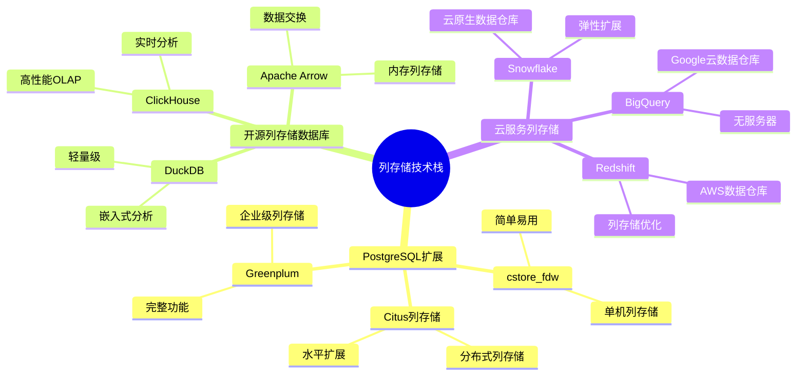
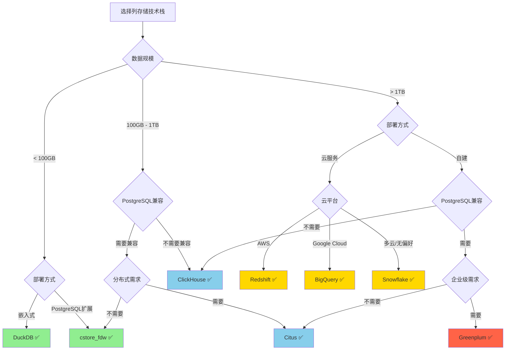

---

> **📋 文档来源**: `PostgreSQL\09-应用设计\数据模型设计\09.06-列存储技术栈对比指南.md`
> **📅 复制日期**: 2025-12-22
> **⚠️ 注意**: 本文档为复制版本，原文件保持不变

---

# PostgreSQL列存储技术栈对比指南

> **版本**: v1.0
> **创建日期**: 2025-01-15
> **最后更新**: 2025-01-15
> **版本覆盖**: PostgreSQL 18.x (推荐) ⭐ | 17.x (推荐) | 16.x (兼容)
> **难度**: ⭐⭐⭐⭐
> **应用场景**: 列存储技术选型、数据仓库架构设计、OLAP系统设计

---

## 📋 目录

- [PostgreSQL列存储技术栈对比指南](#postgresql列存储技术栈对比指南)
  - [📋 目录](#-目录)
  - [一、概述](#一概述)
    - [1.1 列存储技术栈概述](#11-列存储技术栈概述)
    - [1.2 技术栈分类](#12-技术栈分类)
    - [1.3 选型原则](#13-选型原则)
  - [二、PostgreSQL列存储扩展对比](#二postgresql列存储扩展对比)
    - [2.1 cstore\_fdw](#21-cstore_fdw)
    - [2.2 Citus列存储](#22-citus列存储)
    - [2.3 Greenplum](#23-greenplum)
  - [三、开源列存储数据库对比](#三开源列存储数据库对比)
    - [3.1 ClickHouse](#31-clickhouse)
    - [3.2 DuckDB](#32-duckdb)
    - [3.3 Apache Arrow / Polars](#33-apache-arrow--polars)
  - [四、云服务列存储对比](#四云服务列存储对比)
    - [4.1 Snowflake](#41-snowflake)
    - [4.2 BigQuery](#42-bigquery)
    - [4.3 Redshift](#43-redshift)
  - [五、技术栈综合对比](#五技术栈综合对比)
    - [5.1 功能对比矩阵](#51-功能对比矩阵)
    - [5.2 性能对比矩阵](#52-性能对比矩阵)
    - [5.3 成本对比矩阵](#53-成本对比矩阵)
    - [5.4 选型决策树](#54-选型决策树)
  - [六、应用场景推荐](#六应用场景推荐)
    - [6.1 单机数据仓库](#61-单机数据仓库)
    - [6.2 分布式数据仓库](#62-分布式数据仓库)
    - [6.3 实时分析系统](#63-实时分析系统)
    - [6.4 混合负载系统](#64-混合负载系统)
  - [七、迁移与集成](#七迁移与集成)
    - [7.1 PostgreSQL到列存储迁移](#71-postgresql到列存储迁移)
    - [7.2 列存储到PostgreSQL集成](#72-列存储到postgresql集成)
  - [八、最佳实践](#八最佳实践)
  - [九、参考资源](#九参考资源)
    - [相关文档](#相关文档)
    - [外部资源](#外部资源)

---

## 一、概述

### 1.1 列存储技术栈概述

**列存储技术栈**是指用于实现列存储架构的各种技术方案，包括：

1. **PostgreSQL扩展**：在PostgreSQL基础上扩展列存储功能
2. **开源列存储数据库**：独立的列存储数据库系统
3. **云服务列存储**：云平台提供的列存储服务

### 1.2 技术栈分类

### 1.3 选型原则

**技术栈选型考虑因素**：

1. **数据规模**：单机 vs 分布式
2. **查询模式**：OLTP vs OLAP
3. **部署复杂度**：简单 vs 复杂
4. **成本**：开源 vs 商业
5. **PostgreSQL兼容性**：完全兼容 vs 部分兼容
6. **性能要求**：查询性能、写入性能
7. **运维复杂度**：运维成本、监控难度

---

## 二、PostgreSQL列存储扩展对比

### 2.1 cstore_fdw

**概述**：PostgreSQL的列存储外部数据包装器，提供单机列存储功能。

**特点**：

- ✅ **简单易用**：安装配置简单
- ✅ **PostgreSQL兼容**：完全兼容PostgreSQL生态
- ✅ **压缩率高**：支持pglz、zstd压缩，压缩率70-80%
- ❌ **只读**：不支持更新操作
- ❌ **单机**：不支持分布式

**适用场景**：

- 单机数据仓库
- 历史数据查询
- 分析报表系统

**技术规格**：

| 特性 | 规格 |
|------|------|
| **压缩率** | 70-80% |
| **查询性能** | 比行存储快5-10倍（分析查询） |
| **写入性能** | 批量插入，不支持更新 |
| **数据规模** | < 1TB推荐 |
| **PostgreSQL版本** | 9.4+ |

### 2.2 Citus列存储

**概述**：Citus是PostgreSQL的分布式扩展，支持列存储功能。

**特点**：

- ✅ **分布式**：支持水平扩展
- ✅ **PostgreSQL兼容**：基于PostgreSQL
- ✅ **可扩展**：支持PB级数据
- ⚠️ **部署复杂**：需要Citus集群
- ⚠️ **成本**：商业版功能更完整

**适用场景**：

- 大规模分布式数据仓库
- 需要水平扩展的场景
- PostgreSQL生态内的分布式分析

**技术规格**：

| 特性 | 规格 |
|------|------|
| **扩展性** | 支持数百节点 |
| **数据规模** | PB级 |
| **查询性能** | 分布式并行查询 |
| **PostgreSQL版本** | 12+ |

### 2.3 Greenplum

**概述**：基于PostgreSQL的企业级数据仓库，完整支持列存储。

**特点**：

- ✅ **企业级**：完整的数据仓库功能
- ✅ **高性能**：优化的列存储引擎
- ✅ **完整功能**：支持更新、事务
- ❌ **独立系统**：不是PostgreSQL扩展
- ❌ **部署复杂**：需要独立部署

**适用场景**：

- 企业级数据仓库
- 需要完整OLAP功能
- 大规模数据分析

**技术规格**：

| 特性 | 规格 |
|------|------|
| **压缩率** | 80-90% |
| **查询性能** | 高性能列存储引擎 |
| **数据规模** | PB级 |
| **PostgreSQL版本** | 基于PostgreSQL 9.x |

---

## 三、开源列存储数据库对比

### 3.1 ClickHouse

**概述**：Yandex开发的高性能列存储OLAP数据库。

**特点**：

- ✅ **高性能**：查询性能极佳
- ✅ **实时分析**：支持实时数据插入和分析
- ✅ **压缩率高**：压缩率80-90%
- ❌ **PostgreSQL不兼容**：独立系统
- ❌ **学习曲线**：需要学习新的SQL方言

**适用场景**：

- 实时分析系统
- 大规模OLAP查询
- 时序数据分析

**技术规格**：

| 特性 | 规格 |
|------|------|
| **压缩率** | 80-90% |
| **查询性能** | 极高性能 |
| **写入性能** | 支持实时写入 |
| **数据规模** | PB级 |

### 3.2 DuckDB

**概述**：嵌入式分析数据库，支持列存储。

**特点**：

- ✅ **轻量级**：嵌入式，无需服务器
- ✅ **易用**：SQL兼容性好
- ✅ **快速**：查询性能好
- ❌ **单机**：不支持分布式
- ❌ **数据规模**：适合中小规模数据

**适用场景**：

- 嵌入式分析
- 数据科学分析
- 中小规模数据分析

**技术规格**：

| 特性 | 规格 |
|------|------|
| **压缩率** | 60-70% |
| **查询性能** | 高性能 |
| **数据规模** | < 100GB推荐 |
| **部署** | 嵌入式 |

### 3.3 Apache Arrow / Polars

**概述**：内存列存储格式和分析引擎。

**特点**：

- ✅ **内存列存储**：零拷贝数据交换
- ✅ **高性能**：内存分析性能极佳
- ✅ **跨语言**：支持多种编程语言
- ❌ **内存限制**：受内存大小限制
- ❌ **持久化**：需要配合其他存储系统

**适用场景**：

- 内存分析
- 数据科学
- 数据交换格式

---

## 四、云服务列存储对比

### 4.1 Snowflake

**概述**：云原生数据仓库，支持列存储。

**特点**：

- ✅ **云原生**：完全托管，无需运维
- ✅ **弹性扩展**：按需扩展
- ✅ **高性能**：优化的列存储引擎
- ❌ **成本**：按使用量付费，成本较高
- ❌ **厂商锁定**：云服务锁定

**适用场景**：

- 云原生数据仓库
- 需要弹性扩展
- 无运维需求

### 4.2 BigQuery

**概述**：Google Cloud的完全托管数据仓库。

**特点**：

- ✅ **无服务器**：完全托管
- ✅ **PB级**：支持PB级数据
- ✅ **机器学习**：集成ML功能
- ❌ **成本**：按查询量付费
- ❌ **Google生态**：绑定Google Cloud

**适用场景**：

- Google Cloud生态
- 需要ML集成
- 无服务器架构

### 4.3 Redshift

**概述**：AWS的数据仓库服务，支持列存储。

**特点**：

- ✅ **AWS集成**：与AWS服务深度集成
- ✅ **列存储优化**：优化的列存储引擎
- ✅ **可扩展**：支持大规模数据
- ❌ **成本**：按节点付费
- ❌ **AWS锁定**：绑定AWS

**适用场景**：

- AWS生态
- 需要AWS服务集成
- 企业级数据仓库

---

## 五、技术栈综合对比

### 5.1 功能对比矩阵

| 特性 | cstore_fdw | Citus | Greenplum | ClickHouse | DuckDB | Snowflake | BigQuery | Redshift |
|------|-----------|-------|-----------|------------|--------|-----------|----------|----------|
| **类型** | PostgreSQL扩展 | PostgreSQL扩展 | 独立系统 | 独立系统 | 嵌入式 | 云服务 | 云服务 | 云服务 |
| **PostgreSQL兼容** | ✅ 完全 | ✅ 完全 | ⚠️ 部分 | ❌ 不兼容 | ⚠️ 部分 | ❌ 不兼容 | ❌ 不兼容 | ⚠️ 部分 |
| **分布式** | ❌ | ✅ | ✅ | ✅ | ❌ | ✅ | ✅ | ✅ |
| **更新支持** | ❌ 只读 | ⚠️ 有限 | ✅ | ✅ | ✅ | ✅ | ✅ | ✅ |
| **压缩率** | ⭐⭐⭐⭐ (70-80%) | ⭐⭐⭐⭐ (70-80%) | ⭐⭐⭐⭐⭐ (80-90%) | ⭐⭐⭐⭐⭐ (80-90%) | ⭐⭐⭐ (60-70%) | ⭐⭐⭐⭐⭐ (80-90%) | ⭐⭐⭐⭐⭐ (80-90%) | ⭐⭐⭐⭐ (70-80%) |
| **查询性能** | ⭐⭐⭐ | ⭐⭐⭐⭐ | ⭐⭐⭐⭐⭐ | ⭐⭐⭐⭐⭐ | ⭐⭐⭐⭐ | ⭐⭐⭐⭐⭐ | ⭐⭐⭐⭐⭐ | ⭐⭐⭐⭐ |
| **写入性能** | ⭐⭐ | ⭐⭐⭐ | ⭐⭐⭐⭐ | ⭐⭐⭐⭐⭐ | ⭐⭐⭐⭐ | ⭐⭐⭐⭐ | ⭐⭐⭐⭐ | ⭐⭐⭐ |
| **易用性** | ⭐⭐⭐⭐⭐ | ⭐⭐⭐ | ⭐⭐⭐ | ⭐⭐⭐ | ⭐⭐⭐⭐ | ⭐⭐⭐⭐⭐ | ⭐⭐⭐⭐⭐ | ⭐⭐⭐⭐ |
| **部署复杂度** | ⭐⭐⭐⭐⭐ (低) | ⭐⭐⭐ (中) | ⭐⭐ (高) | ⭐⭐⭐ (中) | ⭐⭐⭐⭐⭐ (低) | ⭐⭐⭐⭐⭐ (低) | ⭐⭐⭐⭐⭐ (低) | ⭐⭐⭐⭐ (中) |
| **成本** | ⭐⭐⭐⭐⭐ (免费) | ⭐⭐⭐⭐ (开源/商业) | ⭐⭐⭐ (商业/开源) | ⭐⭐⭐⭐⭐ (免费) | ⭐⭐⭐⭐⭐ (免费) | ⭐⭐ (按使用付费) | ⭐⭐ (按使用付费) | ⭐⭐⭐ (按节点付费) |
| **数据规模** | < 1TB | PB级 | PB级 | PB级 | < 100GB | PB级 | PB级 | PB级 |
| **运维复杂度** | ⭐⭐⭐⭐⭐ (低) | ⭐⭐⭐ (中) | ⭐⭐ (高) | ⭐⭐⭐ (中) | ⭐⭐⭐⭐⭐ (低) | ⭐⭐⭐⭐⭐ (低) | ⭐⭐⭐⭐⭐ (低) | ⭐⭐⭐ (中) |

### 5.2 性能对比矩阵

| 性能指标 | cstore_fdw | Citus | Greenplum | ClickHouse | DuckDB | Snowflake | BigQuery | Redshift |
|---------|-----------|-------|-----------|------------|--------|-----------|----------|----------|
| **分析查询性能** | ⭐⭐⭐ | ⭐⭐⭐⭐ | ⭐⭐⭐⭐⭐ | ⭐⭐⭐⭐⭐ | ⭐⭐⭐⭐ | ⭐⭐⭐⭐⭐ | ⭐⭐⭐⭐⭐ | ⭐⭐⭐⭐ |
| **点查询性能** | ⭐⭐ | ⭐⭐⭐ | ⭐⭐⭐ | ⭐⭐ | ⭐⭐⭐ | ⭐⭐⭐⭐ | ⭐⭐⭐⭐ | ⭐⭐⭐ |
| **聚合查询性能** | ⭐⭐⭐⭐ | ⭐⭐⭐⭐ | ⭐⭐⭐⭐⭐ | ⭐⭐⭐⭐⭐ | ⭐⭐⭐⭐ | ⭐⭐⭐⭐⭐ | ⭐⭐⭐⭐⭐ | ⭐⭐⭐⭐ |
| **并发查询** | ⭐⭐⭐ | ⭐⭐⭐⭐ | ⭐⭐⭐⭐ | ⭐⭐⭐⭐⭐ | ⭐⭐⭐ | ⭐⭐⭐⭐⭐ | ⭐⭐⭐⭐⭐ | ⭐⭐⭐⭐ |
| **实时写入** | ❌ | ⚠️ | ✅ | ✅ | ✅ | ✅ | ✅ | ✅ |

### 5.3 成本对比矩阵

| 成本维度 | cstore_fdw | Citus | Greenplum | ClickHouse | DuckDB | Snowflake | BigQuery | Redshift |
|---------|-----------|-------|-----------|------------|--------|-----------|----------|----------|
| **软件成本** | 免费 | 开源/商业 | 商业/开源 | 免费 | 免费 | 按使用付费 | 按使用付费 | 按节点付费 |
| **硬件成本** | 低 | 中 | 高 | 中 | 低 | 无（托管） | 无（托管） | 中 |
| **运维成本** | 低 | 中 | 高 | 中 | 低 | 无（托管） | 无（托管） | 中 |
| **总拥有成本** | ⭐⭐⭐⭐⭐ | ⭐⭐⭐⭐ | ⭐⭐⭐ | ⭐⭐⭐⭐ | ⭐⭐⭐⭐⭐ | ⭐⭐⭐ | ⭐⭐⭐ | ⭐⭐⭐ |

### 5.4 选型决策树

---

## 六、应用场景推荐

### 6.1 单机数据仓库

**推荐技术栈**：

1. **cstore_fdw**：PostgreSQL生态，简单易用
2. **DuckDB**：嵌入式，适合数据科学

**适用场景**：

- 数据量 < 1TB
- 单机部署
- PostgreSQL生态

### 6.2 分布式数据仓库

**推荐技术栈**：

1. **Citus**：PostgreSQL生态，分布式
2. **Greenplum**：企业级，完整功能
3. **ClickHouse**：高性能，实时分析

**适用场景**：

- 数据量 > 1TB
- 需要水平扩展
- 大规模分析

### 6.3 实时分析系统

**推荐技术栈**：

1. **ClickHouse**：高性能实时分析
2. **Snowflake**：云原生，弹性扩展

**适用场景**：

- 实时数据插入
- 实时分析查询
- 流式数据处理

### 6.4 混合负载系统

**推荐技术栈**：

1. **PostgreSQL + cstore_fdw**：热数据行存储 + 冷数据列存储
2. **Greenplum**：支持OLTP和OLAP

**适用场景**：

- 既有OLTP又有OLAP
- 热冷数据分离
- 混合查询模式

---

## 七、迁移与集成

### 7.1 PostgreSQL到列存储迁移

**迁移策略**：

1. **数据抽取**：从PostgreSQL抽取数据
2. **数据转换**：转换为列存储格式
3. **数据加载**：加载到列存储系统
4. **查询路由**：根据查询类型路由到不同存储

### 7.2 列存储到PostgreSQL集成

**集成方式**：

1. **外部表**：使用FDW访问列存储
2. **数据同步**：定期同步数据到PostgreSQL
3. **查询联邦**：使用PostgreSQL查询列存储数据

---

## 八、最佳实践

1. **选择合适的技术栈**：根据数据规模、查询模式、成本等因素选择
2. **混合存储架构**：热数据行存储 + 冷数据列存储
3. **查询优化**：针对列存储特性优化查询
4. **压缩优化**：选择合适的压缩算法
5. **监控和调优**：持续监控和优化性能

---

## 九、参考资源

### 相关文档

- [存储管理与数据持久化](../../04-存储与恢复/01.06-存储管理与数据持久化.md) - 列存储架构分析
- [数据仓库设计指南](./09.03-数据仓库设计指南.md) - 列存储优化
- [数据建模完整指南](./09.02-数据建模完整指南.md) - 存储架构选择
- [执行计划与性能调优](../../02-查询与优化/02.03-执行计划/02.04-执行计划与性能调优.md) - 列存储查询优化
- [列存储最佳实践指南](./09.07-列存储最佳实践指南.md) - 列存储最佳实践

### 外部资源

- [cstore_fdw GitHub](https://github.com/citusdata/cstore_fdw)
- [Citus官方文档](https://docs.citusdata.com/)
- [ClickHouse官方文档](https://clickhouse.com/docs)
- [DuckDB官方文档](https://duckdb.org/docs/)

---
