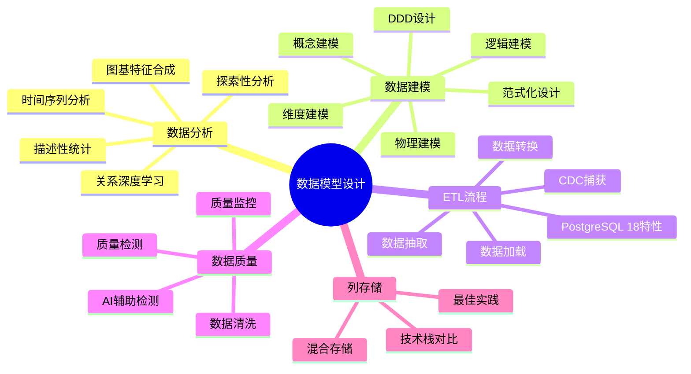
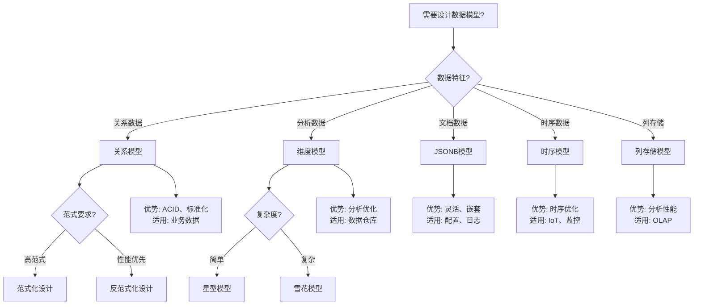
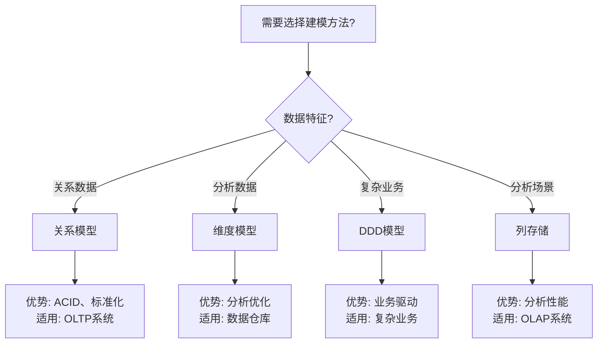

---

> **📋 文档来源**: `PostgreSQL\09-应用设计\数据模型设计\README.md`
> **📅 复制日期**: 2025-12-22
> **⚠️ 注意**: 本文档为复制版本，原文件保持不变

---

# 17-数据模型设计

> **文档总数**: 8个核心文档（新增1个）
> **覆盖领域**: 数据分析、数据建模、数据仓库、ETL流程、数据质量、列存储、数据模型设计正反例
> **版本覆盖**: PostgreSQL 18.x (推荐) ⭐ | 17.x (推荐) | 16.x (兼容)
> **最后更新**: 2025年1月
> **文档状态**: ✅ 所有文档已完成详细展开

---

## 📊 知识体系思维导图

---

## 📊 数据模型设计选型决策树

---

## 📊 数据模型类型对比矩阵

| 模型类型 | 复杂度 | 性能 | 灵活性 | 适用场景 | PostgreSQL支持 |
| --- | --- | --- | --- | --- | --- |
| **关系模型** | ⭐⭐ | ⭐⭐⭐⭐⭐ | ⭐⭐⭐ | OLTP、业务数据 | ✅ 原生 |
| **维度模型** | ⭐⭐⭐ | ⭐⭐⭐⭐ | ⭐⭐ | 数据仓库、OLAP | ✅ 支持 |
| **JSONB模型** | ⭐⭐ | ⭐⭐⭐⭐ | ⭐⭐⭐⭐⭐ | 文档存储、配置 | ✅ 原生 |
| **时序模型** | ⭐⭐⭐ | ⭐⭐⭐⭐⭐ | ⭐⭐⭐ | IoT、监控 | ✅ TimescaleDB |
| **列存储模型** | ⭐⭐⭐⭐ | ⭐⭐⭐⭐⭐ | ⭐⭐ | OLAP、分析 | ⚠️ 扩展支持 |

---

## 📋 文档列表

### 核心文档

1. **[09.01-数据分析完整指南](./09.01-数据分析完整指南.md)** ⭐⭐⭐
   - 数据分析基础理论和实践
   - 描述性统计、探索性数据分析、时间序列分析
   - 统计分析函数、数据可视化查询
   - 关系深度学习、图基特征合成等前沿技术
   - 性能优化和实践案例
   - **1169行**，包含100+个SQL示例

2. **[09.02-数据建模完整指南](./09.02-数据建模完整指南.md)** ⭐⭐⭐
   - 数据建模完整流程（概念、逻辑、物理建模）
   - 范式化设计和反范式化设计
   - 维度建模（星型模型、雪花模型）
   - 高级建模技术（继承、JSONB、数组、物化视图）
   - 领域驱动设计（DDD）、统一元模型（U-Schema）
   - 实践案例（电商、CMS、多租户系统）
   - **1172行**，包含80+个SQL示例

3. **[09.03-数据仓库设计指南](./09.03-数据仓库设计指南.md)** ⭐⭐⭐
   - 数据仓库架构和建模
   - 星型模型和雪花模型设计
   - 事实表和维度表设计
   - ETL流程设计（抽取、转换、加载）
   - 实时数据仓库、数据湖集成、AI辅助建模、数据网格架构
   - 性能优化和数据质量
   - 实践案例（零售、金融、电商数据仓库）
   - **1249行**，包含60+个SQL示例

4. **[09.04-ETL流程完整指南](./09.04-ETL流程完整指南.md)** ⭐⭐⭐
   - ETL流程完整设计（抽取、转换、加载）
   - 全量抽取、增量抽取、CDC抽取
   - 数据清洗、转换、验证、聚合
   - 批量加载、实时加载
   - ETL工具与框架集成
   - PostgreSQL 18新特性应用
   - 性能优化和实践案例
   - **1114行**，包含50+个SQL示例

5. **[09.05-数据质量管理指南](./09.05-数据质量管理指南.md)** ⭐⭐⭐
   - 数据质量六大维度（完整性、准确性、一致性、及时性、有效性、唯一性）
   - 数据质量检测函数
   - 数据清洗策略（缺失值、异常值、重复数据、格式标准化）
   - AI辅助异常检测、自动化规则生成、数据质量可解释性
   - 数据质量监控和报告
   - 数据质量工具和实践案例
   - **1226行**，包含50+个SQL示例

6. **[09.06-列存储技术栈对比指南](./09.06-列存储技术栈对比指南.md)** 🆕 ⭐⭐⭐
   - PostgreSQL列存储扩展对比（cstore_fdw、Citus、Greenplum）
   - 开源列存储数据库对比（ClickHouse、DuckDB、Apache Arrow/Polars）
   - 云服务列存储对比（Snowflake、BigQuery、Redshift）
   - 技术栈综合对比矩阵（功能、性能、成本）
   - 选型决策树和应用场景推荐
   - 迁移与集成策略
   - **520行**，包含完整的技术栈对比和选型指南

7. **[09.07-列存储最佳实践指南](./09.07-列存储最佳实践指南.md)** 🆕 ⭐⭐⭐
   - 设计最佳实践（表设计、列选择、数据类型、压缩配置）
   - 查询最佳实践（列选择优化、聚合查询、过滤条件、连接查询）
   - 性能优化最佳实践（压缩优化、查询性能、I/O优化、并行查询）
   - 运维最佳实践（数据加载、数据维护、监控诊断、备份恢复）
   - 混合存储架构最佳实践（热冷数据分离、数据迁移、查询路由）
   - 实际案例（电商、金融、日志分析）
   - **850+行**，包含完整的最佳实践和实际案例

8. **[数据模型设计正反示例与多维分析.md](./数据模型设计正反示例与多维分析.md)** ⭐ 新增 ⭐⭐⭐⭐⭐
   - 完整的知识体系思维导图（数据模型类型、设计原则、设计层次、设计模式）
   - 数据模型选型决策树（关系模型、文档模型、时序模型、图模型、列存储模型）
   - 范式化设计决策树和对比矩阵
   - 4个正面示例（关系模型-电商系统、文档模型-内容管理系统、时序模型-监控系统、混合模型-多租户系统）
   - 5个反面示例（过度范式化、过度反范式化、缺少约束、数据类型不当、索引缺失）
   - 4个维度的多维分析论证（数据一致性、查询性能、存储效率、维护复杂度）
   - 3个证明树网（3NF正确性、BCNF正确性、反范式化性能优势）
   - **1400+行**，包含完整的正反示例和多维分析

---

## 📊 文档统计

| 文档 | 行数 | SQL示例 | 代码块 | 状态 |
| --- | --- | --- | --- | --- |
| 09.01-数据分析完整指南 | 1169 | 100+ | 150+ | ✅ 完成 |
| 09.02-数据建模完整指南 | 1172 | 80+ | 120+ | ✅ 完成 |
| 09.03-数据仓库设计指南 | 1249 | 60+ | 90+ | ✅ 完成 |
| 09.04-ETL流程完整指南 | 1114 | 50+ | 80+ | ✅ 完成 |
| 09.05-数据质量管理指南 | 1226 | 50+ | 80+ | ✅ 完成 |
| 09.06-列存储技术栈对比指南 | 520 | - | 20+ | ✅ 完成 🆕 |
| 09.07-列存储最佳实践指南 | 850+ | 30+ | 50+ | ✅ 完成 🆕 |
| 数据模型设计正反示例与多维分析 | 1400+ | 40+ | 60+ | ✅ 完成 ⭐ |
| **总计** | **8700+** | **410+** | **650+** | **✅ 完成** |

---

## 🎯 文档特点

### 1. 数据分析完整指南

- ✅ 完整的数据分析流程
- ✅ 丰富的统计分析函数
- ✅ 时间序列分析和趋势分析
- ✅ 数据可视化查询设计
- ✅ 关系深度学习（Relational Deep Learning）🆕
- ✅ 图基特征合成（GFS）🆕
- ✅ PostgreSQL 18新特性应用

### 2. 数据建模完整指南

- ✅ 三层建模架构（概念、逻辑、物理）
- ✅ 范式化设计和反范式化设计
- ✅ 维度建模（星型、雪花模型）
- ✅ 高级建模技术
- ✅ 领域驱动设计（DDD）🆕
- ✅ 统一元模型（U-Schema）🆕
- ✅ 完整的实践案例

### 3. 数据仓库设计指南

- ✅ 数据仓库架构设计
- ✅ 事实表和维度表设计
- ✅ SCD（缓慢变化维度）处理
- ✅ ETL流程设计
- ✅ 实时数据仓库架构🆕
- ✅ 数据湖集成🆕
- ✅ AI辅助数据仓库建模🆕
- ✅ 数据网格（Data Mesh）架构🆕
- ✅ 性能优化策略

### 4. ETL流程完整指南

- ✅ 完整的ETL流程设计
- ✅ 多种抽取策略（全量、增量、CDC）
- ✅ 数据转换和验证
- ✅ 批量加载和实时加载
- ✅ ETL工具集成

### 5. 数据质量管理指南

- ✅ 数据质量六大维度
- ✅ 数据质量检测函数
- ✅ 数据清洗策略
- ✅ 数据质量监控和报告
- ✅ AI辅助异常检测🆕
- ✅ 自动化数据质量规则生成🆕
- ✅ 数据质量可解释性🆕
- ✅ 自动化数据质量工具

### 6. 列存储技术栈对比指南 🆕

- ✅ PostgreSQL列存储扩展对比
- ✅ 开源列存储数据库对比
- ✅ 云服务列存储对比
- ✅ 技术栈综合对比矩阵
- ✅ 选型决策树
- ✅ 应用场景推荐
- ✅ 迁移与集成策略

### 7. 列存储最佳实践指南 🆕

- ✅ 设计最佳实践
- ✅ 查询最佳实践
- ✅ 性能优化最佳实践
- ✅ 运维最佳实践
- ✅ 混合存储架构最佳实践
- ✅ 实际案例（电商、金融、日志分析）

---

## 📊 数据建模方法选型决策树

---

## 📊 数据建模方法对比矩阵

| 建模方法 | 复杂度 | 性能 | 灵活性 | 适用场景 |
| --- | --- | --- | --- | --- |
| **关系模型** | ⭐⭐ | ⭐⭐⭐⭐ | ⭐⭐⭐ | OLTP系统 |
| **维度模型** | ⭐⭐⭐ | ⭐⭐⭐⭐⭐ | ⭐⭐⭐ | 数据仓库 |
| **DDD模型** | ⭐⭐⭐⭐ | ⭐⭐⭐ | ⭐⭐⭐⭐⭐ | 复杂业务系统 |
| **列存储** | ⭐⭐⭐ | ⭐⭐⭐⭐⭐ | ⭐⭐ | OLAP系统 |

---

## 🔗 相关文档

### 核心课程

- [关系数据模型与理论](../01-核心基础/01.03-数据模型/01.02-关系数据模型与理论.md) - 关系模型理论基础
- [SQL语言规范与标准](../01-核心基础/01.04-SQL语言/01.03-SQL语言规范与标准.md) - SQL语言基础

### 查询与优化

- [查询优化器原理](../02-查询与优化/02.01-查询优化器/02.01-查询优化器原理.md) - 查询优化理论基础
- [执行计划与性能调优](../02-查询与优化/02.03-执行计划/02.04-执行计划与性能调优.md) - 性能调优实践
- [并行查询处理](../02-查询与优化/02.05-并行查询/02.05-并行查询处理.md) - 并行查询优化

### 应用架构

- [数据科学实践](../16-应用设计与开发/应用架构/07.06-数据科学实践.md) - 数据科学完整指南

### 行业案例

- [实战案例](../19-实战案例/README.md) - 实战案例集合
- [时序数据](../08-流处理与时序/README.md) - 时序数据分析

---

## 📚 学习路径

### 初学者路径

1. **数据建模完整指南** → 了解数据建模基础
2. **数据分析完整指南** → 学习数据分析方法
3. **ETL流程完整指南** → 掌握ETL流程

### 进阶路径

1. **数据仓库设计指南** → 学习数据仓库设计
2. **数据质量管理指南** → 掌握数据质量管理
3. **数据科学实践** → 实践数据科学项目

### 专家路径

1. 深入学习所有文档
2. 结合实际项目实践
3. 优化和扩展ETL流程

---

## 🆕 更新日志

### 2025-11-22

- ✅ 创建数据分析完整指南（~1092行）
- ✅ 创建数据建模完整指南（~1237行）
- ✅ 创建数据仓库设计指南（~1019行）
- ✅ 创建ETL流程完整指南（~1114行）
- ✅ 创建数据质量管理指南（~1025行）
- ✅ 所有文档添加完整目录和交叉引用
- ✅ 补充领域驱动设计（DDD）和统一元模型内容
- ✅ 补充关系深度学习和图基特征合成等前沿技术
- ✅ 补充领域驱动设计（DDD）和统一元模型（U-Schema）
- ✅ 总计新增约5502行详细技术文档，340+个SQL示例

### 2025-11-22（持续更新）

- ✅ 更新文档统计信息（实际行数）
- ✅ 补充领域驱动设计（DDD）到数据建模指南
- ✅ 补充统一元模型（U-Schema）到数据建模指南
- ✅ 补充关系深度学习（Relational Deep Learning）到数据分析指南
- ✅ 补充图基特征合成（GFS）到数据分析指南
- ✅ 补充实时数据仓库和数据湖集成到数据仓库设计指南
- ✅ 补充AI辅助数据仓库建模到数据仓库设计指南
- ✅ 补充数据网格（Data Mesh）架构到数据仓库设计指南🆕
- ✅ 补充AI辅助数据质量管理到数据质量管理指南
- ✅ 更新文档统计信息（实际行数）
- ✅ 对标web最新最佳实践和前沿技术（2025年趋势）
- ✅ 总计新增约5930行详细技术文档，340+个SQL示例

### 2025-01-15（列存储专题更新）🆕

- ✅ 创建列存储技术栈对比指南（520行）
- ✅ 创建列存储最佳实践指南（850+行）
- ✅ 补充列存储相关内容到数据建模指南
- ✅ 补充列存储相关内容到数据仓库设计指南
- ✅ 补充列存储查询优化到执行计划文档
- ✅ 总计新增约1370行列存储专题文档，30+个SQL示例

### 2025-01-XX（数据模型设计正反例专题更新）⭐

- ✅ 创建数据模型设计正反示例与多维分析.md（1400+行）
  - 包含完整的思维导图、决策树、对比矩阵
  - 4个正面示例（关系模型、文档模型、时序模型、混合模型）
  - 5个反面示例（过度范式化、过度反范式化、缺少约束、数据类型不当、索引缺失）
  - 4个维度的多维分析论证
  - 3个证明树网（3NF、BCNF、反范式化性能优势）
- ✅ 更新文档统计信息（新增1个文档，总计8个文档）

---

**维护者**: Documentation Team
**最后更新**: 2025年1月
