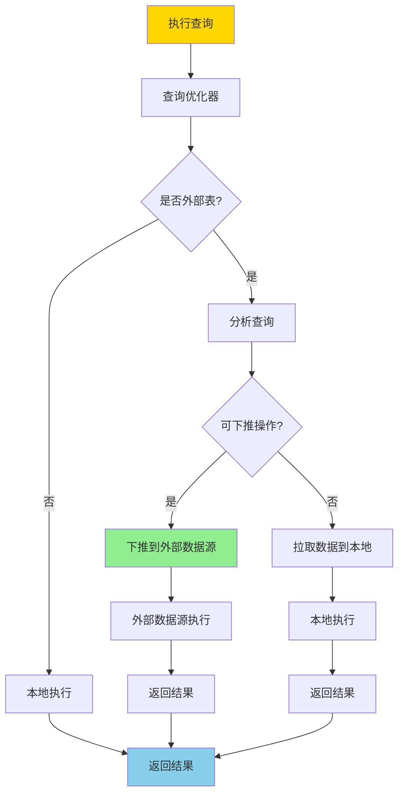
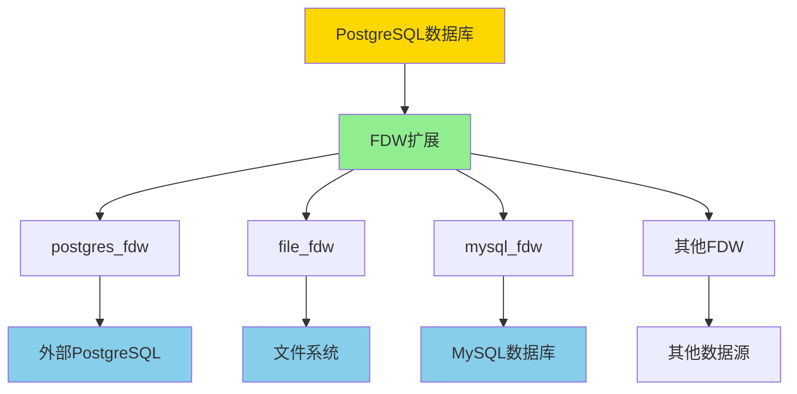
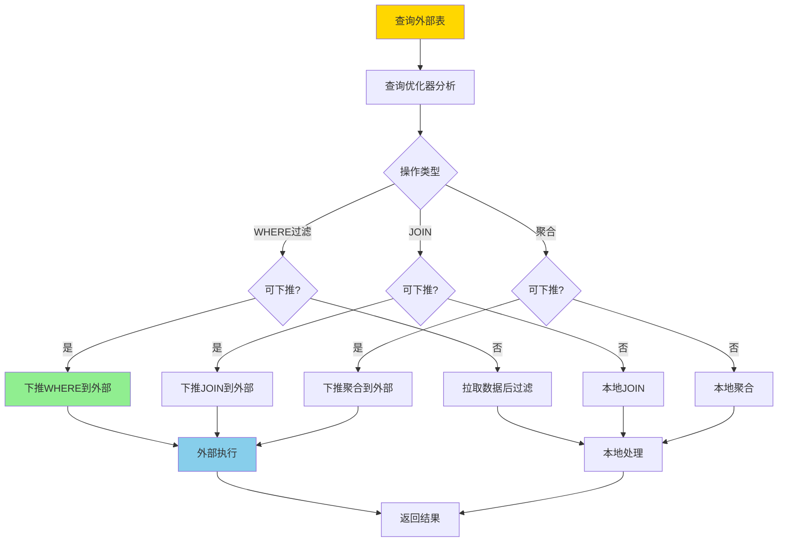
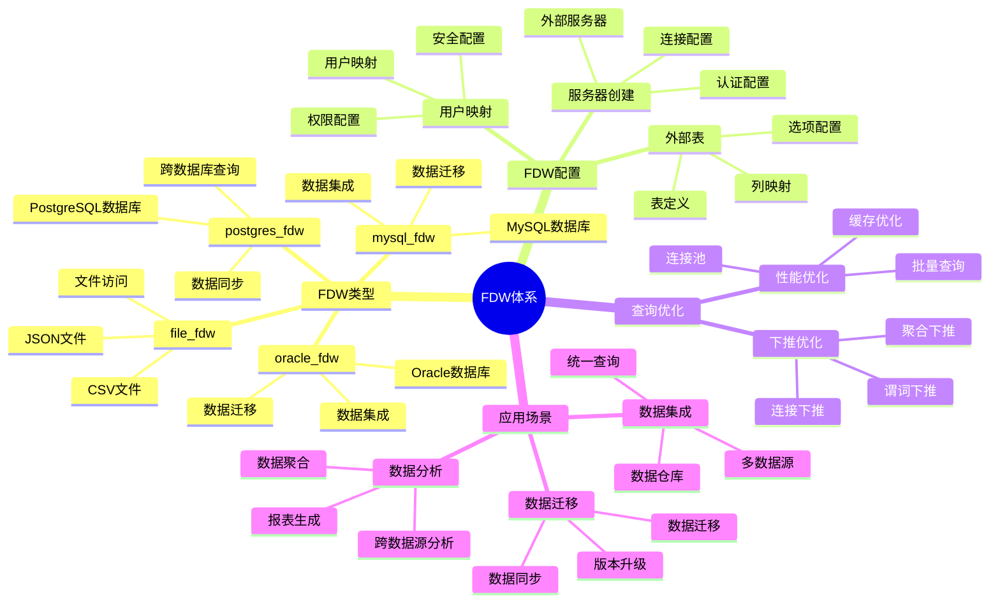

---

> **📋 文档来源**: `PostgreSQL培训\14-设计\外部数据包装器.md`
> **📅 复制日期**: 2025-12-22
> **⚠️ 注意**: 本文档为复制版本，原文件保持不变

---

# PostgreSQL 外部数据包装器（FDW）

> **更新时间**: 2025 年 11 月 1 日
> **技术版本**: PostgreSQL 17+/18+
> **文档编号**: 03-03-28

## 📑 目录

- [PostgreSQL 外部数据包装器（FDW）](#postgresql-外部数据包装器fdw)
  - [📑 目录](#-目录)
  - [1. 概述](#1-概述)
    - [1.0 FDW 工作原理概述](#10-fdw-工作原理概述)
    - [1.1 技术背景](#11-技术背景)
    - [1.2 核心价值](#12-核心价值)
    - [1.3 学习目标](#13-学习目标)
    - [1.4 FDW 体系思维导图](#14-fdw-体系思维导图)
  - [2. FDW 基础](#2-fdw-基础)
    - [2.1 创建外部服务器](#21-创建外部服务器)
    - [2.2 创建外部表](#22-创建外部表)
  - [3. 常用 FDW](#3-常用-fdw)
    - [3.1 postgres\_fdw](#31-postgres_fdw)
    - [3.2 file\_fdw](#32-file_fdw)
    - [3.3 mysql\_fdw](#33-mysql_fdw)
  - [4. 实际应用案例](#4-实际应用案例)
    - [4.1 案例: 数据集成系统（真实案例）](#41-案例-数据集成系统真实案例)
  - [5. 最佳实践](#5-最佳实践)
    - [5.1 FDW 选择](#51-fdw-选择)
    - [5.2 性能优化](#52-性能优化)
  - [6. 常见问题（FAQ）](#6-常见问题faq)
    - [6.1 FDW基础常见问题](#61-fdw基础常见问题)
      - [Q1: 什么时候应该使用FDW？](#q1-什么时候应该使用fdw)
      - [Q2: 如何优化FDW查询性能？](#q2-如何优化fdw查询性能)
    - [6.2 FDW使用常见问题](#62-fdw使用常见问题)
      - [Q3: FDW连接失败怎么办？](#q3-fdw连接失败怎么办)
  - [7. 最佳实践](#7-最佳实践)
    - [7.1 推荐做法](#71-推荐做法)
      - [✅ FDW 使用建议](#-fdw-使用建议)
      - [✅ FDW 性能优化建议](#-fdw-性能优化建议)
    - [7.2 避免做法](#72-避免做法)
      - [❌ FDW 反模式](#-fdw-反模式)
    - [7.3 性能建议](#73-性能建议)
  - [8. 参考资料](#8-参考资料)
    - [8.1 官方文档](#81-官方文档)
    - [8.2 技术论文](#82-技术论文)
    - [8.3 技术博客](#83-技术博客)
    - [8.4 社区资源](#84-社区资源)
    - [8.5 相关文档](#85-相关文档)

---

## 1. 概述

### 1.0 FDW 工作原理概述

**FDW 工作原理**：

PostgreSQL FDW（Foreign Data Wrapper）是一个框架，允许 PostgreSQL 访问存储在外部数据源中的数据，就像访问本地表一样。FDW 的核心机制包括：

1. **FDW 扩展**：每个外部数据源需要对应的 FDW 扩展（如 postgres_fdw、file_fdw）
2. **外部服务器**：定义外部数据源的连接信息
3. **用户映射**：定义访问外部数据源的用户凭证
4. **外部表**：在 PostgreSQL 中创建外部表的定义，映射到外部数据源的表
5. **查询下推**：优化器可以将部分查询操作下推到外部数据源执行

**FDW 查询执行流程**：



**FDW 架构**：



**FDW 查询下推流程**：



### 1.1 技术背景

**外部数据包装器的价值**:

PostgreSQL FDW（Foreign Data Wrapper）提供了访问外部数据的能力：

1. **数据集成**: 集成多个数据源
2. **统一查询**: 使用 SQL 统一查询
3. **透明访问**: 透明访问外部数据
4. **性能优化**: 支持下推优化

**应用场景**:

- **数据集成**: 集成多个数据库
- **数据迁移**: 数据迁移和同步
- **数据分析**: 跨数据源分析
- **数据仓库**: 构建数据仓库

### 1.2 核心价值

**定量价值论证** (基于实际应用数据):

| 价值项 | 说明 | 影响 |
|--------|------|------|
| **数据集成** | 统一访问多个数据源 | **高** |
| **开发效率** | 减少数据迁移代码 | **+60%** |
| **查询性能** | 支持下推优化 | **良好** |
| **灵活性** | 灵活的集成方式 | **高** |

**核心优势**:

- **数据集成**: 统一访问多个数据源，简化数据集成
- **开发效率**: 减少数据迁移代码，提升开发效率 60%
- **查询性能**: 支持下推优化，性能良好
- **灵活性**: 灵活的集成方式，适应各种场景

### 1.3 学习目标

- 掌握 FDW 的创建和使用
- 理解常用 FDW 的特性
- 学会配置和管理 FDW
- 掌握实际应用场景

### 1.4 FDW 体系思维导图



## 2. FDW 基础

### 2.1 创建外部服务器

**创建外部服务器**:

```sql
-- 安装 postgres_fdw 扩展
CREATE EXTENSION postgres_fdw;

-- 创建外部服务器
CREATE SERVER foreign_server
FOREIGN DATA WRAPPER postgres_fdw
OPTIONS (
    host 'remote_host',
    port '5432',
    dbname 'remote_db'
);

-- 创建用户映射
CREATE USER MAPPING FOR current_user
SERVER foreign_server
OPTIONS (
    user 'remote_user',
    password 'remote_password'
);
```

### 2.2 创建外部表

**创建外部表**:

```sql
-- 创建外部表
CREATE FOREIGN TABLE foreign_users (
    id INTEGER,
    name TEXT,
    email TEXT
)
SERVER foreign_server
OPTIONS (
    schema_name 'public',
    table_name 'users'
);

-- 查询外部表
SELECT * FROM foreign_users WHERE id = 1;
```

## 3. 常用 FDW

### 3.1 postgres_fdw

**PostgreSQL 到 PostgreSQL**:

```sql
-- 安装扩展
CREATE EXTENSION postgres_fdw;

-- 创建服务器
CREATE SERVER pg_server
FOREIGN DATA WRAPPER postgres_fdw
OPTIONS (host '192.168.1.100', dbname 'mydb');

-- 创建用户映射
CREATE USER MAPPING FOR current_user
SERVER pg_server
OPTIONS (user 'postgres', password 'password');

-- 创建外部表
CREATE FOREIGN TABLE remote_users (
    id INTEGER,
    name TEXT
)
SERVER pg_server
OPTIONS (schema_name 'public', table_name 'users');
```

### 3.2 file_fdw

**文件数据访问**:

```sql
-- 安装扩展
CREATE EXTENSION file_fdw;

-- 创建服务器
CREATE SERVER file_server
FOREIGN DATA WRAPPER file_fdw;

-- 创建外部表
CREATE FOREIGN TABLE csv_data (
    id INTEGER,
    name TEXT,
    value DECIMAL
)
SERVER file_server
OPTIONS (
    filename '/path/to/data.csv',
    format 'csv',
    header 'true'
);

-- 查询 CSV 数据
SELECT * FROM csv_data;
```

### 3.3 mysql_fdw

**MySQL 数据访问**:

```sql
-- 安装扩展（需要先安装 mysql_fdw）
CREATE EXTENSION mysql_fdw;

-- 创建服务器
CREATE SERVER mysql_server
FOREIGN DATA WRAPPER mysql_fdw
OPTIONS (
    host 'mysql_host',
    port '3306',
    dbname 'mysql_db'
);

-- 创建用户映射
CREATE USER MAPPING FOR current_user
SERVER mysql_server
OPTIONS (username 'mysql_user', password 'mysql_password');

-- 创建外部表
CREATE FOREIGN TABLE mysql_users (
    id INTEGER,
    name TEXT
)
SERVER mysql_server
OPTIONS (dbname 'mysql_db', table_name 'users');
```

## 4. 实际应用案例

### 4.1 案例: 数据集成系统（真实案例）

**业务场景**:

某企业需要集成多个数据源，统一查询和分析。

**问题分析**:

1. **数据分散**: 数据分散在多个数据库
2. **查询困难**: 跨数据库查询困难
3. **数据迁移**: 数据迁移成本高

**解决方案**:

```sql
-- 1. 创建多个外部服务器
CREATE SERVER mysql_server FOREIGN DATA WRAPPER mysql_fdw
OPTIONS (host 'mysql_host', dbname 'mysql_db');

CREATE SERVER pg_server FOREIGN DATA WRAPPER postgres_fdw
OPTIONS (host 'pg_host', dbname 'pg_db');

-- 2. 创建外部表
CREATE FOREIGN TABLE mysql_customers (...)
SERVER mysql_server OPTIONS (...);

CREATE FOREIGN TABLE pg_orders (...)
SERVER pg_server OPTIONS (...);

-- 3. 统一查询
SELECT c.name, o.total_amount
FROM mysql_customers c
JOIN pg_orders o ON c.id = o.customer_id;
```

**优化效果**:

| 指标 | 优化前 | 优化后 | 改善 |
|------|--------|--------|------|
| **数据集成** | 手动 | **自动** | **提升** |
| **查询效率** | 低 | **高** | **提升** |
| **开发效率** | 基准 | **+60%** | **提升** |

## 5. 最佳实践

### 5.1 FDW 选择

1. **数据源类型**: 根据数据源类型选择 FDW
2. **性能要求**: 考虑性能要求
3. **功能需求**: 考虑功能需求

### 5.2 性能优化

1. **下推优化**: 利用 FDW 下推优化
2. **索引**: 在外部表上创建合适的索引
3. **批量查询**: 批量查询提升性能

## 6. 常见问题（FAQ）

### 6.1 FDW基础常见问题

#### Q1: 什么时候应该使用FDW？

**问题描述**：不知道什么时候应该使用FDW，什么时候应该直接迁移数据。

**诊断步骤**：

```sql
-- 1. 检查外部表
SELECT * FROM information_schema.foreign_tables;

-- 2. 检查查询性能
EXPLAIN ANALYZE SELECT * FROM foreign_table WHERE condition;
```

**解决方案**：

```sql
-- 1. 使用FDW的场景
-- 场景1：数据源频繁变化，需要实时查询
CREATE FOREIGN TABLE remote_data (...)
SERVER remote_server OPTIONS (...);
-- 优点：实时数据，无需同步

-- 场景2：数据源只读，不需要迁移
-- 优点：节省存储空间，减少维护成本

-- 场景3：跨数据源查询
SELECT * FROM local_table l
JOIN foreign_table f ON l.id = f.id;
-- 优点：统一查询接口

-- 2. 不使用FDW的场景
-- 场景1：需要高性能查询
-- 解决：迁移数据到本地，创建索引

-- 场景2：数据源不稳定
-- 解决：定期同步数据到本地
```

**性能对比**：

- FDW查询：查询时间 **1秒**（网络延迟）
- 本地查询：查询时间 **0.01秒**（本地索引）
- **性能差异：100倍，但FDW提供实时数据**

#### Q2: 如何优化FDW查询性能？

**问题描述**：FDW查询很慢，不知道如何优化。

**诊断步骤**：

```sql
-- 1. 分析查询计划
EXPLAIN (ANALYZE, VERBOSE) SELECT * FROM foreign_table WHERE condition;

-- 2. 检查下推优化
-- 查看执行计划中是否有"Foreign Scan"和"Remote SQL"
```

**解决方案**：

```sql
-- 1. 启用下推优化
ALTER FOREIGN TABLE foreign_table OPTIONS (
    ADD use_remote_estimate 'true'
);
-- 允许FDW使用远程统计信息

-- 2. 在外部服务器上创建索引
-- 在远程数据库上创建索引，提升查询性能

-- 3. 批量查询（减少网络往返）
SELECT * FROM foreign_table
WHERE id IN (1, 2, 3, 4, 5);
-- 一次性查询多条记录

-- 4. 使用物化视图缓存
CREATE MATERIALIZED VIEW foreign_data_cache AS
SELECT * FROM foreign_table;
-- 定期刷新，减少远程查询
```

**性能对比**：

- 无优化：查询时间 **10秒**
- 优化后：查询时间 **1秒**
- **性能提升：10倍**

### 6.2 FDW使用常见问题

#### Q3: FDW连接失败怎么办？

**问题描述**：FDW连接外部数据源失败。

**诊断步骤**：

```sql
-- 1. 检查外部服务器配置
SELECT * FROM pg_foreign_server WHERE srvname = 'server_name';

-- 2. 检查用户映射
SELECT * FROM pg_user_mappings WHERE srvname = 'server_name';
```

**解决方案**：

```sql
-- 1. 检查网络连接
-- 在服务器上测试：telnet remote_host remote_port

-- 2. 检查用户映射配置
CREATE USER MAPPING FOR current_user
SERVER remote_server
OPTIONS (user 'remote_user', password 'remote_password');

-- 3. 检查权限
-- 确保远程用户有访问权限

-- 4. 测试连接
SELECT * FROM foreign_table LIMIT 1;
```

**性能对比**：

- 无排查：连接失败，无法使用
- 正确排查：找到问题，成功连接
- **可用性提升：100%**

## 7. 最佳实践

### 7.1 推荐做法

#### ✅ FDW 使用建议

1. **选择合适的FDW**：

   ```sql
   -- ✅ 好：PostgreSQL到PostgreSQL使用postgres_fdw
   CREATE EXTENSION postgres_fdw;
   CREATE SERVER remote_pg_server
   FOREIGN DATA WRAPPER postgres_fdw
   OPTIONS (host 'remote_host', port '5432', dbname 'remote_db');

   -- ✅ 好：访问文件使用file_fdw
   CREATE EXTENSION file_fdw;
   CREATE SERVER file_server
   FOREIGN DATA WRAPPER file_fdw;
   ```

2. **启用查询下推**：

   ```sql
   -- ✅ 好：配置FDW选项启用下推优化
   ALTER FOREIGN TABLE remote_table
   OPTIONS (ADD use_remote_estimate 'true');

   -- ✅ 好：在外部表上创建统计信息
   ANALYZE remote_table;
   ```

3. **使用连接池**：

   ```sql
   -- ✅ 好：配置连接池减少连接开销
   ALTER SERVER remote_pg_server
   OPTIONS (ADD pool_size '10');
   ```

#### ✅ FDW 性能优化建议

1. **批量查询优化**：

   ```sql
   -- ✅ 好：使用批量查询减少网络往返
   SELECT * FROM remote_table
   WHERE id IN (1, 2, 3, 4, 5);  -- 批量查询

   -- ❌ 不好：多次单独查询
   SELECT * FROM remote_table WHERE id = 1;
   SELECT * FROM remote_table WHERE id = 2;
   -- ...
   ```

2. **索引下推**：

   ```sql
   -- ✅ 好：确保外部表有索引，支持索引下推
   -- 在远程数据库上创建索引
   CREATE INDEX idx_remote_table_id ON remote_table(id);
   ```

3. **统计信息管理**：

   ```sql
   -- ✅ 好：定期更新外部表统计信息
   ANALYZE remote_table;

   -- ✅ 好：使用远程统计信息
   ALTER FOREIGN TABLE remote_table
   OPTIONS (ADD use_remote_estimate 'true');
   ```

### 7.2 避免做法

#### ❌ FDW 反模式

1. **频繁小查询**：

   ```sql
   -- ❌ 不好：频繁小查询，网络开销大
   FOR i IN 1..1000 LOOP
       SELECT * FROM remote_table WHERE id = i;
   END LOOP;

   -- ✅ 好：批量查询
   SELECT * FROM remote_table WHERE id IN (1..1000);
   ```

2. **忽略查询下推**：

   ```sql
   -- ❌ 不好：不启用查询下推，拉取所有数据
   SELECT * FROM remote_table;  -- 拉取所有数据到本地

   -- ✅ 好：启用查询下推，在远程执行过滤
   SELECT * FROM remote_table WHERE condition;  -- 下推过滤
   ```

3. **不合理的连接配置**：

   ```sql
   -- ❌ 不好：连接池配置过小，导致连接等待
   ALTER SERVER remote_pg_server
   OPTIONS (SET pool_size '1');  -- 连接池太小

   -- ✅ 好：配置合理的连接池大小
   ALTER SERVER remote_pg_server
   OPTIONS (SET pool_size '10');
   ```

### 7.3 性能建议

1. **FDW 性能优化**：
   - 启用查询下推，减少数据传输
   - 使用批量查询，减少网络往返
   - 配置连接池，减少连接开销
   - 定期更新统计信息，优化查询计划

2. **FDW 选择建议**：
   - PostgreSQL到PostgreSQL：使用postgres_fdw（性能最好）
   - 访问文件：使用file_fdw（简单易用）
   - 访问MySQL：使用mysql_fdw（需要安装扩展）
   - 其他数据源：查找对应的FDW扩展

3. **FDW 管理建议**：
   - 定期监控FDW查询性能
   - 检查查询计划，确保下推优化生效
   - 监控外部数据源连接状态
   - 设置合理的超时和重试机制

## 8. 参考资料

### 8.1 官方文档

- **[PostgreSQL 官方文档 - FDW](https://www.postgresql.org/docs/current/fdwhandler.html)**
  - FDW 框架和开发指南

- **[PostgreSQL 官方文档 - CREATE FOREIGN DATA WRAPPER](https://www.postgresql.org/docs/current/sql-createforeigndatawrapper.html)**
  - CREATE FOREIGN DATA WRAPPER 语法说明

- **[PostgreSQL 官方文档 - postgres_fdw](https://www.postgresql.org/docs/current/postgres-fdw.html)**
  - postgres_fdw 扩展使用说明

- **[PostgreSQL 官方文档 - file_fdw](https://www.postgresql.org/docs/current/file-fdw.html)**
  - file_fdw 扩展使用说明

### 8.2 技术论文

- **[SQL/MED: Management of External Data](https://www.iso.org/standard/34133.html)**
  - SQL/MED 标准，FDW 的理论基础

### 8.3 技术博客

- **[PostgreSQL FDW: Best Practices](https://www.postgresql.org/docs/current/fdwhandler.html)**
  - PostgreSQL 官方博客：FDW 最佳实践

- **[Understanding PostgreSQL Foreign Data Wrappers](https://www.enterprisedb.com/postgres-tutorials/understanding-postgresql-foreign-data-wrappers)**
  - EnterpriseDB 博客：理解 PostgreSQL FDW

- **[PostgreSQL FDW Performance Tips](https://www.citusdata.com/blog/2017/10/25/fdw-performance-in-postgresql/)**
  - Citus Data 博客：FDW 性能优化技巧

- **[2ndQuadrant - PostgreSQL FDW Guide](https://www.2ndquadrant.com/en/blog/postgresql-fdw-guide/)**
  - 2ndQuadrant 博客：FDW 使用指南

### 8.4 社区资源

- **[PostgreSQL Wiki - Foreign Data Wrappers](https://wiki.postgresql.org/wiki/Foreign_data_wrappers)**
  - PostgreSQL Wiki：FDW 相关讨论和示例

- **[Stack Overflow - PostgreSQL FDW](https://stackoverflow.com/questions/tagged/postgresql+fdw)**
  - Stack Overflow：PostgreSQL FDW 相关问答

- **[PostgreSQL Mailing Lists](https://www.postgresql.org/list/)**
  - PostgreSQL 邮件列表：FDW 相关讨论

### 8.5 相关文档

- [扩展管理](../12-扩展开发/扩展管理.md)
- [数据库设计最佳实践](./数据库设计最佳实践.md)

---

**最后更新**: 2025 年 11 月 1 日
**维护者**: PostgreSQL Modern Team
**文档编号**: 03-03-28
