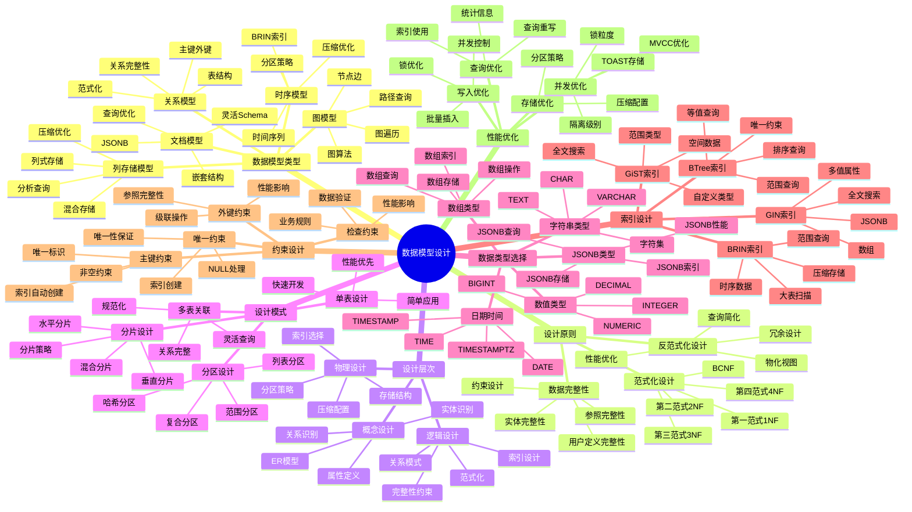
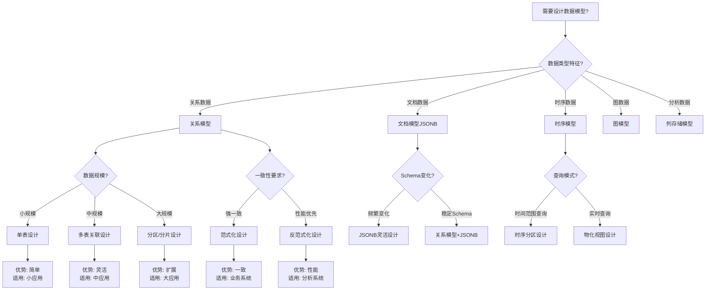
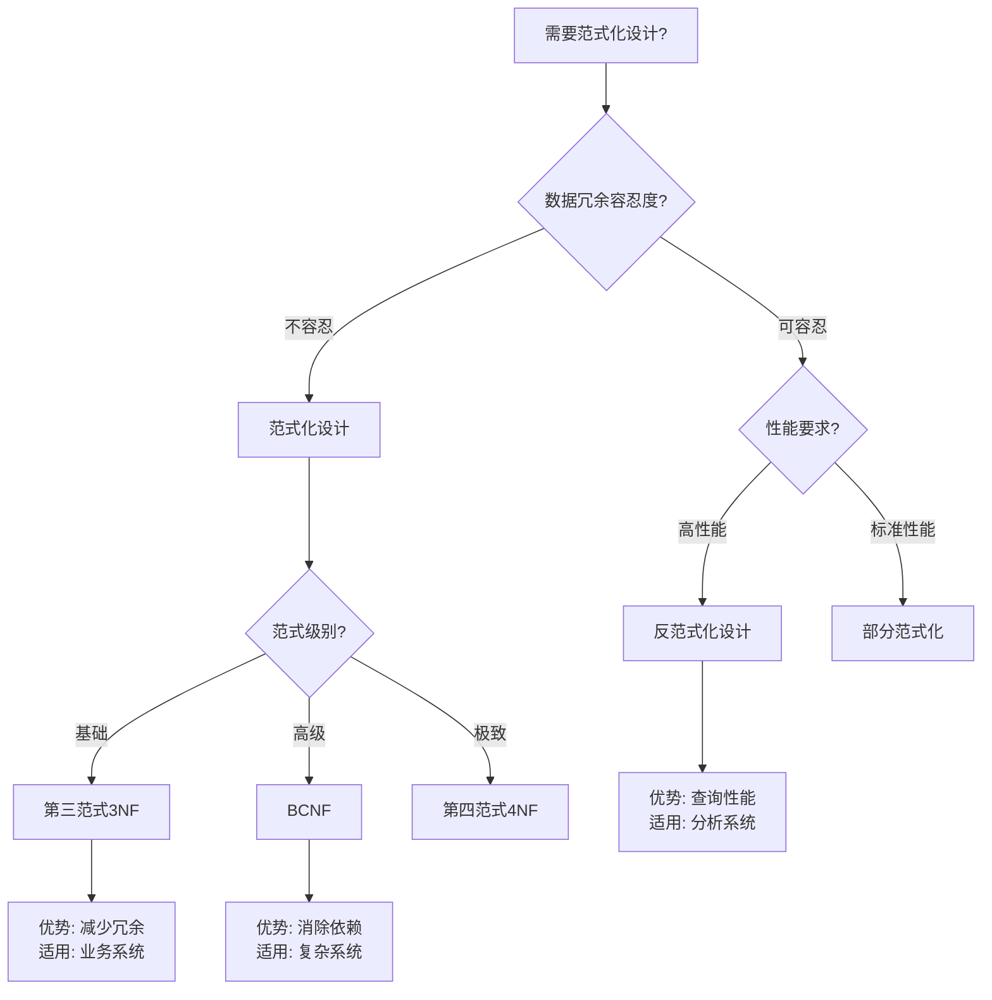
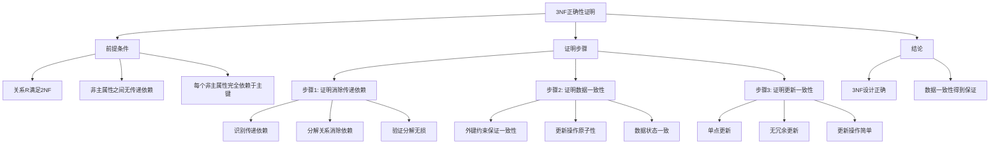
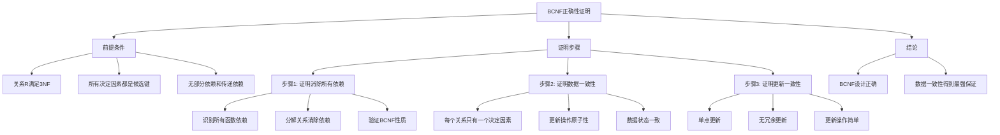
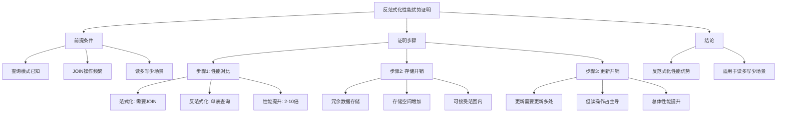

# PostgreSQL数据模型设计正反示例与多维分析

> **PostgreSQL版本**: 17+/18+
> **适用场景**: 数据模型设计、数据库设计、系统架构
> **难度等级**: ⭐⭐⭐⭐ 高级
> **最后更新**: 2025年1月

---

## 📑 目录

- [示例1：关系模型设计（电商系统）](#示例1关系模型设计电商系统)
- [示例2：文档模型设计（内容管理系统）](#示例2文档模型设计内容管理系统)
- [示例3：时序模型设计（监控系统）](#示例3时序模型设计监控系统)
- [示例4：混合模型设计（多租户系统）](#示例4混合模型设计多租户系统)
- [反例1：过度范式化设计](#反例1过度范式化设计)
- [反例2：过度反范式化设计](#反例2过度反范式化设计)
- [反例3：缺少约束设计](#反例3缺少约束设计)
- [反例4：数据类型选择不当](#反例4数据类型选择不当)
- [反例5：索引设计缺失](#反例5索引设计缺失)
- [维度1：数据一致性维度](#维度1数据一致性维度)
- [维度2：查询性能维度](#维度2查询性能维度)
- [维度3：存储效率维度](#维度3存储效率维度)
- [维度4：维护复杂度维度](#维度4维护复杂度维度)
- [证明1：第三范式（3NF）的正确性证明](#证明1第三范式3nf的正确性证明)
- [证明2：BCNF的正确性证明](#证明2bcnf的正确性证明)
- [证明3：反范式化设计的性能优势证明](#证明3反范式化设计的性能优势证明)
---

## 📊 知识体系思维导图



---

## 📊 数据模型选型决策树



---

## 📊 数据模型类型对比矩阵

| 模型类型 | 复杂度 | 性能 | 灵活性 | 一致性 | 适用场景 | PostgreSQL支持 |
| --- | --- | --- | --- | --- | --- | --- |
| **关系模型** | ⭐⭐ | ⭐⭐⭐⭐ | ⭐⭐⭐ | ⭐⭐⭐⭐⭐ | OLTP、业务数据 | ✅ 原生 |
| **文档模型（JSONB）** | ⭐⭐ | ⭐⭐⭐⭐ | ⭐⭐⭐⭐⭐ | ⭐⭐⭐ | 文档存储、配置 | ✅ 原生 |
| **时序模型** | ⭐⭐⭐ | ⭐⭐⭐⭐⭐ | ⭐⭐⭐ | ⭐⭐⭐⭐ | IoT、监控 | ✅ TimescaleDB |
| **图模型** | ⭐⭐⭐⭐ | ⭐⭐⭐ | ⭐⭐⭐⭐⭐ | ⭐⭐⭐ | 社交网络、推荐 | ⚠️ 扩展支持 |
| **列存储模型** | ⭐⭐⭐⭐ | ⭐⭐⭐⭐⭐ | ⭐⭐ | ⭐⭐⭐ | OLAP、分析 | ⚠️ 扩展支持 |

---

## 📊 范式化设计决策树



---

## 📊 范式化设计对比矩阵

| 范式级别 | 冗余度 | 一致性 | 查询性能 | 维护复杂度 | 适用场景 |
| --- | --- | --- | --- | --- | --- |
| **1NF** | ⭐⭐⭐⭐ | ⭐⭐ | ⭐⭐⭐⭐ | ⭐⭐⭐⭐ | 基础设计 |
| **2NF** | ⭐⭐⭐ | ⭐⭐⭐ | ⭐⭐⭐⭐ | ⭐⭐⭐ | 简单系统 |
| **3NF** | ⭐⭐ | ⭐⭐⭐⭐ | ⭐⭐⭐ | ⭐⭐ | 大多数系统 |
| **BCNF** | ⭐ | ⭐⭐⭐⭐⭐ | ⭐⭐⭐ | ⭐⭐ | 复杂系统 |
| **反范式化** | ⭐⭐⭐⭐⭐ | ⭐⭐ | ⭐⭐⭐⭐⭐ | ⭐⭐⭐ | 分析系统 |

---

## ✅ 正面示例：优秀数据模型设计

### 示例1：关系模型设计（电商系统）

**设计目标**：

- 强一致性保证
- 减少数据冗余
- 支持复杂查询
- 易于维护

**实现代码**：

```sql
-- ✅ 正确：范式化设计（第三范式3NF）

-- 用户表
CREATE TABLE users (
    user_id BIGSERIAL PRIMARY KEY,
    username VARCHAR(50) UNIQUE NOT NULL,
    email VARCHAR(100) UNIQUE NOT NULL,
    password_hash VARCHAR(255) NOT NULL,
    created_at TIMESTAMPTZ DEFAULT NOW(),
    updated_at TIMESTAMPTZ DEFAULT NOW(),
    CONSTRAINT email_format CHECK (email ~* '^[A-Za-z0-9._%+-]+@[A-Za-z0-9.-]+\.[A-Z|a-z]{2,}$')
);

-- 商品表
CREATE TABLE products (
    product_id BIGSERIAL PRIMARY KEY,
    name VARCHAR(200) NOT NULL,
    description TEXT,
    price NUMERIC(10, 2) NOT NULL CHECK (price > 0),
    stock_quantity INTEGER NOT NULL CHECK (stock_quantity >= 0),
    category_id BIGINT REFERENCES categories(category_id),
    created_at TIMESTAMPTZ DEFAULT NOW(),
    updated_at TIMESTAMPTZ DEFAULT NOW()
);

-- 分类表（消除冗余）
CREATE TABLE categories (
    category_id BIGSERIAL PRIMARY KEY,
    name VARCHAR(100) NOT NULL UNIQUE,
    parent_id BIGINT REFERENCES categories(category_id),
    created_at TIMESTAMPTZ DEFAULT NOW()
);

-- 订单表
CREATE TABLE orders (
    order_id BIGSERIAL PRIMARY KEY,
    user_id BIGINT NOT NULL REFERENCES users(user_id),
    status VARCHAR(20) NOT NULL DEFAULT 'pending',
    total_amount NUMERIC(10, 2) NOT NULL CHECK (total_amount >= 0),
    created_at TIMESTAMPTZ DEFAULT NOW(),
    updated_at TIMESTAMPTZ DEFAULT NOW(),
    CONSTRAINT valid_status CHECK (status IN ('pending', 'paid', 'shipped', 'delivered', 'cancelled'))
);

-- 订单项表（消除冗余）
CREATE TABLE order_items (
    order_item_id BIGSERIAL PRIMARY KEY,
    order_id BIGINT NOT NULL REFERENCES orders(order_id) ON DELETE CASCADE,
    product_id BIGINT NOT NULL REFERENCES products(product_id),
    quantity INTEGER NOT NULL CHECK (quantity > 0),
    unit_price NUMERIC(10, 2) NOT NULL CHECK (unit_price > 0),
    subtotal NUMERIC(10, 2) NOT NULL CHECK (subtotal >= 0),
    created_at TIMESTAMPTZ DEFAULT NOW()
);

-- ✅ 正确：索引设计
CREATE INDEX idx_orders_user_id ON orders(user_id);
CREATE INDEX idx_orders_status ON orders(status);
CREATE INDEX idx_orders_created_at ON orders(created_at);
CREATE INDEX idx_order_items_order_id ON order_items(order_id);
CREATE INDEX idx_order_items_product_id ON order_items(product_id);
CREATE INDEX idx_products_category_id ON products(category_id);

-- ✅ 正确：触发器自动更新updated_at
CREATE OR REPLACE FUNCTION update_updated_at_column()
RETURNS TRIGGER AS $$
BEGIN
    NEW.updated_at = NOW();
    RETURN NEW;
END;
$$ LANGUAGE plpgsql;

CREATE TRIGGER update_users_updated_at BEFORE UPDATE ON users
    FOR EACH ROW EXECUTE FUNCTION update_updated_at_column();

CREATE TRIGGER update_products_updated_at BEFORE UPDATE ON products
    FOR EACH ROW EXECUTE FUNCTION update_updated_at_column();

CREATE TRIGGER update_orders_updated_at BEFORE UPDATE ON orders
    FOR EACH ROW EXECUTE FUNCTION update_updated_at_column();
```

**设计优点**：

1. ✅ **范式化设计**：第三范式，减少数据冗余
2. ✅ **完整性约束**：外键、检查约束保证数据一致性
3. ✅ **索引优化**：合理的索引设计提升查询性能
4. ✅ **自动维护**：触发器自动更新时间戳

---

### 示例2：文档模型设计（内容管理系统）

**设计目标**：

- 灵活的Schema
- 嵌套数据结构
- 快速开发
- JSONB查询优化

**实现代码**：

```sql
-- ✅ 正确：JSONB文档模型设计

-- 文章表（使用JSONB存储灵活内容）
CREATE TABLE articles (
    article_id BIGSERIAL PRIMARY KEY,
    title VARCHAR(200) NOT NULL,
    slug VARCHAR(200) UNIQUE NOT NULL,
    author_id BIGINT NOT NULL REFERENCES users(user_id),
    content JSONB NOT NULL,
    metadata JSONB DEFAULT '{}',
    tags TEXT[],
    status VARCHAR(20) DEFAULT 'draft',
    published_at TIMESTAMPTZ,
    created_at TIMESTAMPTZ DEFAULT NOW(),
    updated_at TIMESTAMPTZ DEFAULT NOW(),
    CONSTRAINT valid_status CHECK (status IN ('draft', 'published', 'archived'))
);

-- ✅ 正确：JSONB索引设计
-- GIN索引支持JSONB查询
CREATE INDEX idx_articles_content_gin ON articles USING GIN (content);
CREATE INDEX idx_articles_metadata_gin ON articles USING GIN (metadata);
CREATE INDEX idx_articles_tags_gin ON articles USING GIN (tags);
CREATE INDEX idx_articles_author_id ON articles(author_id);
CREATE INDEX idx_articles_status ON articles(status);

-- ✅ 正确：JSONB查询示例
-- 查询包含特定字段的文章
SELECT article_id, title, content->>'body' as body
FROM articles
WHERE content ? 'body'
  AND content->>'body' LIKE '%PostgreSQL%';

-- 查询metadata中的特定值
SELECT article_id, title, metadata->>'category' as category
FROM articles
WHERE metadata->>'category' = 'technology';

-- 查询数组包含特定标签
SELECT article_id, title, tags
FROM articles
WHERE 'database' = ANY(tags);

-- ✅ 正确：JSONB更新示例
UPDATE articles
SET content = jsonb_set(content, '{views}', '100'),
    metadata = jsonb_set(metadata, '{last_updated}', to_jsonb(NOW()))
WHERE article_id = 1;
```

**设计优点**：

1. ✅ **灵活Schema**：JSONB支持动态结构
2. ✅ **嵌套数据**：支持复杂嵌套结构
3. ✅ **查询优化**：GIN索引支持高效JSONB查询
4. ✅ **类型安全**：PostgreSQL 18支持JSONB类型检查

---

### 示例3：时序模型设计（监控系统）

**设计目标**：

- 高效的时间序列存储
- 快速时间范围查询
- 数据压缩
- 自动分区

**实现代码**：

```sql
-- ✅ 正确：时序模型设计（使用TimescaleDB）

-- 启用TimescaleDB扩展
CREATE EXTENSION IF NOT EXISTS timescaledb;

-- 指标表（时序表）
CREATE TABLE metrics (
    time TIMESTAMPTZ NOT NULL,
    device_id VARCHAR(50) NOT NULL,
    metric_name VARCHAR(100) NOT NULL,
    value DOUBLE PRECISION NOT NULL,
    tags JSONB DEFAULT '{}'
);

-- ✅ 正确：转换为时序表
SELECT create_hypertable('metrics', 'time');

-- ✅ 正确：BRIN索引（时序数据优化）
CREATE INDEX idx_metrics_time_brin ON metrics USING BRIN (time);
CREATE INDEX idx_metrics_device_time ON metrics (device_id, time DESC);
CREATE INDEX idx_metrics_name_time ON metrics (metric_name, time DESC);

-- ✅ 正确：分区策略（按时间分区）
-- TimescaleDB自动管理分区

-- ✅ 正确：时序查询优化
-- 时间范围查询（利用BRIN索引）
SELECT
    time_bucket('1 hour', time) AS hour,
    device_id,
    AVG(value) as avg_value,
    MAX(value) as max_value,
    MIN(value) as min_value
FROM metrics
WHERE time >= NOW() - INTERVAL '24 hours'
  AND device_id = 'device-001'
GROUP BY hour, device_id
ORDER BY hour;

-- ✅ 正确：数据保留策略
SELECT add_retention_policy('metrics', INTERVAL '90 days');
```

**设计优点**：

1. ✅ **时序优化**：TimescaleDB针对时序数据优化
2. ✅ **自动分区**：按时间自动分区
3. ✅ **压缩存储**：自动压缩历史数据
4. ✅ **快速查询**：BRIN索引优化时间范围查询

---

### 示例4：混合模型设计（多租户系统）

**设计目标**：

- 多租户数据隔离
- 共享Schema设计
- 性能优化
- 灵活扩展

**实现代码**：

```sql
-- ✅ 正确：多租户混合模型设计

-- 租户表
CREATE TABLE tenants (
    tenant_id BIGSERIAL PRIMARY KEY,
    name VARCHAR(100) NOT NULL,
    subdomain VARCHAR(50) UNIQUE NOT NULL,
    settings JSONB DEFAULT '{}',
    created_at TIMESTAMPTZ DEFAULT NOW(),
    updated_at TIMESTAMPTZ DEFAULT NOW()
);

-- 用户表（多租户）
CREATE TABLE users (
    user_id BIGSERIAL PRIMARY KEY,
    tenant_id BIGINT NOT NULL REFERENCES tenants(tenant_id) ON DELETE CASCADE,
    username VARCHAR(50) NOT NULL,
    email VARCHAR(100) NOT NULL,
    profile JSONB DEFAULT '{}',
    created_at TIMESTAMPTZ DEFAULT NOW(),
    updated_at TIMESTAMPTZ DEFAULT NOW(),
    CONSTRAINT unique_tenant_username UNIQUE (tenant_id, username),
    CONSTRAINT unique_tenant_email UNIQUE (tenant_id, email)
);

-- 订单表（多租户）
CREATE TABLE orders (
    order_id BIGSERIAL PRIMARY KEY,
    tenant_id BIGINT NOT NULL REFERENCES tenants(tenant_id) ON DELETE CASCADE,
    user_id BIGINT NOT NULL REFERENCES users(user_id) ON DELETE CASCADE,
    order_number VARCHAR(50) NOT NULL,
    total_amount NUMERIC(10, 2) NOT NULL,
    status VARCHAR(20) NOT NULL,
    metadata JSONB DEFAULT '{}',
    created_at TIMESTAMPTZ DEFAULT NOW(),
    CONSTRAINT unique_tenant_order_number UNIQUE (tenant_id, order_number)
);

-- ✅ 正确：多租户索引设计
CREATE INDEX idx_users_tenant_id ON users(tenant_id);
CREATE INDEX idx_orders_tenant_id ON orders(tenant_id);
CREATE INDEX idx_orders_tenant_user ON orders(tenant_id, user_id);
CREATE INDEX idx_orders_tenant_status ON orders(tenant_id, status);

-- ✅ 正确：RLS行级安全（PostgreSQL 18优化）
ALTER TABLE users ENABLE ROW LEVEL SECURITY;
ALTER TABLE orders ENABLE ROW LEVEL SECURITY;

-- 租户隔离策略（PostgreSQL 18性能优化）
CREATE POLICY tenant_isolation_users ON users
    FOR ALL
    USING (tenant_id = current_setting('app.tenant_id')::BIGINT);

CREATE POLICY tenant_isolation_orders ON orders
    FOR ALL
    USING (tenant_id = current_setting('app.tenant_id')::BIGINT);

-- ✅ 正确：多租户查询示例
-- 设置当前租户
SET app.tenant_id = '1';

-- 查询自动过滤租户数据
SELECT * FROM users;  -- 只返回当前租户的用户
SELECT * FROM orders; -- 只返回当前租户的订单
```

**设计优点**：

1. ✅ **数据隔离**：RLS保证租户数据隔离
2. ✅ **共享Schema**：所有租户共享同一Schema
3. ✅ **性能优化**：PostgreSQL 18 RLS性能优化
4. ✅ **灵活扩展**：JSONB支持租户特定配置

---

## ❌ 反面示例：常见设计错误

### 反例1：过度范式化设计

**错误设计**：

```sql
-- ❌ 错误：过度范式化，导致查询复杂

-- 用户基本信息表
CREATE TABLE users (
    user_id BIGSERIAL PRIMARY KEY,
    username VARCHAR(50) UNIQUE NOT NULL
);

-- 用户联系信息表（过度拆分）
CREATE TABLE user_contacts (
    user_id BIGINT PRIMARY KEY REFERENCES users(user_id),
    email VARCHAR(100),
    phone VARCHAR(20),
    address_line1 VARCHAR(200),
    address_line2 VARCHAR(200),
    city VARCHAR(100),
    state VARCHAR(100),
    zip_code VARCHAR(20),
    country VARCHAR(100)
);

-- 用户偏好表（过度拆分）
CREATE TABLE user_preferences (
    user_id BIGINT PRIMARY KEY REFERENCES users(user_id),
    theme VARCHAR(20),
    language VARCHAR(10),
    timezone VARCHAR(50)
);

-- ❌ 查询需要多次JOIN
SELECT u.user_id, u.username, uc.email, uc.phone, up.theme
FROM users u
LEFT JOIN user_contacts uc ON u.user_id = uc.user_id
LEFT JOIN user_preferences up ON u.user_id = up.user_id
WHERE u.user_id = 1;
```

**问题分析**：

1. ❌ **查询复杂**：需要多次JOIN
2. ❌ **性能下降**：JOIN开销大
3. ❌ **维护困难**：表结构复杂
4. ❌ **过度设计**：不必要的拆分

**改进方案**：

```sql
-- ✅ 正确：适度范式化
CREATE TABLE users (
    user_id BIGSERIAL PRIMARY KEY,
    username VARCHAR(50) UNIQUE NOT NULL,
    email VARCHAR(100) UNIQUE NOT NULL,
    phone VARCHAR(20),
    address JSONB,  -- 地址信息使用JSONB
    preferences JSONB DEFAULT '{}',  -- 偏好使用JSONB
    created_at TIMESTAMPTZ DEFAULT NOW()
);

-- ✅ 查询简单高效
SELECT user_id, username, email, phone, address, preferences
FROM users
WHERE user_id = 1;
```

---

### 反例2：过度反范式化设计

**错误设计**：

```sql
-- ❌ 错误：过度反范式化，数据冗余严重

CREATE TABLE orders (
    order_id BIGSERIAL PRIMARY KEY,
    user_id BIGINT NOT NULL,
    -- ❌ 冗余：用户信息直接存储在订单表
    username VARCHAR(50) NOT NULL,
    user_email VARCHAR(100) NOT NULL,
    user_phone VARCHAR(20),
    -- ❌ 冗余：商品信息直接存储
    product_name VARCHAR(200) NOT NULL,
    product_price NUMERIC(10, 2) NOT NULL,
    product_category VARCHAR(100),
    -- ❌ 冗余：订单项信息
    quantity INTEGER NOT NULL,
    subtotal NUMERIC(10, 2) NOT NULL,
    -- 订单信息
    order_date TIMESTAMPTZ DEFAULT NOW(),
    total_amount NUMERIC(10, 2) NOT NULL
);

-- ❌ 问题：用户信息更新需要更新所有订单
UPDATE users SET email = 'new@example.com' WHERE user_id = 1;
-- 需要手动更新所有相关订单
UPDATE orders SET user_email = 'new@example.com' WHERE user_id = 1;
```

**问题分析**：

1. ❌ **数据冗余**：大量重复数据
2. ❌ **更新困难**：需要更新多处
3. ❌ **数据不一致**：容易产生不一致
4. ❌ **存储浪费**：占用大量存储空间

**改进方案**：

```sql
-- ✅ 正确：范式化设计
CREATE TABLE orders (
    order_id BIGSERIAL PRIMARY KEY,
    user_id BIGINT NOT NULL REFERENCES users(user_id),
    order_date TIMESTAMPTZ DEFAULT NOW(),
    total_amount NUMERIC(10, 2) NOT NULL
);

CREATE TABLE order_items (
    order_item_id BIGSERIAL PRIMARY KEY,
    order_id BIGINT NOT NULL REFERENCES orders(order_id),
    product_id BIGINT NOT NULL REFERENCES products(product_id),
    quantity INTEGER NOT NULL,
    unit_price NUMERIC(10, 2) NOT NULL,
    subtotal NUMERIC(10, 2) NOT NULL
);

-- ✅ 查询使用JOIN（性能可通过索引优化）
SELECT o.order_id, u.username, u.email, oi.product_name, oi.quantity
FROM orders o
JOIN users u ON o.user_id = u.user_id
JOIN order_items oi ON o.order_id = oi.order_id
WHERE o.order_id = 1;
```

---

### 反例3：缺少约束设计

**错误设计**：

```sql
-- ❌ 错误：缺少约束，数据质量无法保证

CREATE TABLE users (
    user_id BIGSERIAL PRIMARY KEY,
    username VARCHAR(50),  -- ❌ 缺少NOT NULL和UNIQUE
    email VARCHAR(100),     -- ❌ 缺少NOT NULL、UNIQUE和格式检查
    age INTEGER,            -- ❌ 缺少CHECK约束
    balance NUMERIC(10, 2)  -- ❌ 缺少CHECK约束
);

-- ❌ 可以插入无效数据
INSERT INTO users (username, email, age, balance) VALUES
    (NULL, 'invalid-email', -5, -100);  -- 所有数据都无效
```

**问题分析**：

1. ❌ **数据质量差**：可以插入无效数据
2. ❌ **业务逻辑错误**：缺少业务规则约束
3. ❌ **难以维护**：需要在应用层检查
4. ❌ **数据不一致**：容易产生脏数据

**改进方案**：

```sql
-- ✅ 正确：完整的约束设计
CREATE TABLE users (
    user_id BIGSERIAL PRIMARY KEY,
    username VARCHAR(50) UNIQUE NOT NULL,
    email VARCHAR(100) UNIQUE NOT NULL,
    age INTEGER CHECK (age >= 0 AND age <= 150),
    balance NUMERIC(10, 2) DEFAULT 0 CHECK (balance >= 0),
    created_at TIMESTAMPTZ DEFAULT NOW(),
    CONSTRAINT email_format CHECK (email ~* '^[A-Za-z0-9._%+-]+@[A-Za-z0-9.-]+\.[A-Z|a-z]{2,}$')
);

-- ✅ 约束自动检查，防止无效数据
INSERT INTO users (username, email, age, balance) VALUES
    ('user1', 'user1@example.com', 25, 100);  -- ✅ 有效数据

-- ❌ 约束自动拒绝无效数据
INSERT INTO users (username, email, age, balance) VALUES
    (NULL, 'invalid', -5, -100);  -- ❌ 约束错误，插入失败
```

---

### 反例4：数据类型选择不当

**错误设计**：

```sql
-- ❌ 错误：数据类型选择不当

CREATE TABLE products (
    product_id VARCHAR(50) PRIMARY KEY,  -- ❌ 应该使用BIGSERIAL
    name TEXT,                            -- ❌ 应该使用VARCHAR
    price VARCHAR(20),                   -- ❌ 应该使用NUMERIC
    stock VARCHAR(10),                    -- ❌ 应该使用INTEGER
    created_at VARCHAR(50)               -- ❌ 应该使用TIMESTAMPTZ
);

-- ❌ 问题：无法进行数值计算和比较
SELECT * FROM products WHERE price > 100;  -- ❌ 字符串比较，结果错误
SELECT SUM(price) FROM products;           -- ❌ 无法对字符串求和
```

**问题分析**：

1. ❌ **类型错误**：数据类型不匹配业务需求
2. ❌ **查询错误**：无法进行正确的数值操作
3. ❌ **性能问题**：字符串比较和计算性能差
4. ❌ **存储浪费**：字符串占用更多空间

**改进方案**：

```sql
-- ✅ 正确：合适的数据类型
CREATE TABLE products (
    product_id BIGSERIAL PRIMARY KEY,      -- ✅ 自增整数
    name VARCHAR(200) NOT NULL,           -- ✅ 变长字符串
    price NUMERIC(10, 2) NOT NULL,        -- ✅ 精确数值
    stock INTEGER NOT NULL,                -- ✅ 整数
    created_at TIMESTAMPTZ DEFAULT NOW()  -- ✅ 时间戳
);

-- ✅ 可以进行正确的数值操作
SELECT * FROM products WHERE price > 100;  -- ✅ 数值比较
SELECT SUM(price) FROM products;           -- ✅ 数值求和
SELECT AVG(price) FROM products;           -- ✅ 数值平均
```

---

### 反例5：索引设计缺失

**错误设计**：

```sql
-- ❌ 错误：缺少索引设计

CREATE TABLE orders (
    order_id BIGSERIAL PRIMARY KEY,
    user_id BIGINT NOT NULL,              -- ❌ 缺少索引
    status VARCHAR(20) NOT NULL,          -- ❌ 缺少索引
    created_at TIMESTAMPTZ DEFAULT NOW(), -- ❌ 缺少索引
    total_amount NUMERIC(10, 2) NOT NULL
);

-- ❌ 查询性能差（全表扫描）
SELECT * FROM orders WHERE user_id = 1;        -- ❌ 全表扫描
SELECT * FROM orders WHERE status = 'pending'; -- ❌ 全表扫描
SELECT * FROM orders WHERE created_at > NOW() - INTERVAL '7 days'; -- ❌ 全表扫描
```

**问题分析**：

1. ❌ **查询性能差**：全表扫描，性能极差
2. ❌ **无法扩展**：数据量大时查询极慢
3. ❌ **资源浪费**：CPU和IO资源浪费
4. ❌ **用户体验差**：查询响应时间长

**改进方案**：

```sql
-- ✅ 正确：合理的索引设计
CREATE TABLE orders (
    order_id BIGSERIAL PRIMARY KEY,
    user_id BIGINT NOT NULL,
    status VARCHAR(20) NOT NULL,
    created_at TIMESTAMPTZ DEFAULT NOW(),
    total_amount NUMERIC(10, 2) NOT NULL
);

-- ✅ 为常用查询创建索引
CREATE INDEX idx_orders_user_id ON orders(user_id);
CREATE INDEX idx_orders_status ON orders(status);
CREATE INDEX idx_orders_created_at ON orders(created_at);
CREATE INDEX idx_orders_user_status ON orders(user_id, status);  -- 复合索引

-- ✅ 查询性能优化（使用索引）
SELECT * FROM orders WHERE user_id = 1;        -- ✅ 使用索引
SELECT * FROM orders WHERE status = 'pending'; -- ✅ 使用索引
SELECT * FROM orders
WHERE user_id = 1 AND status = 'pending';      -- ✅ 使用复合索引
```

---

## 📊 多维分析论证

### 维度1：数据一致性维度

**一致性保证对比分析**：

| 设计模式 | 范式化程度 | 冗余度 | 一致性保证 | 更新复杂度 | 适用场景 |
| --- | --- | --- | --- | --- | --- |
| **完全范式化（3NF+）** | ⭐⭐⭐⭐⭐ | ⭐ | ⭐⭐⭐⭐⭐ | ⭐⭐ | 业务系统 |
| **部分范式化（2NF）** | ⭐⭐⭐ | ⭐⭐⭐ | ⭐⭐⭐⭐ | ⭐⭐⭐ | 中等系统 |
| **反范式化** | ⭐ | ⭐⭐⭐⭐⭐ | ⭐⭐ | ⭐⭐⭐⭐ | 分析系统 |
| **混合设计** | ⭐⭐⭐ | ⭐⭐⭐ | ⭐⭐⭐⭐ | ⭐⭐⭐ | 复杂系统 |

**一致性保证机制**：

1. ✅ **外键约束**：保证参照完整性
2. ✅ **检查约束**：保证数据有效性
3. ✅ **唯一约束**：保证数据唯一性
4. ✅ **触发器**：保证业务规则一致性

---

### 维度2：查询性能维度

**查询性能对比分析**：

| 设计模式 | 简单查询 | 复杂查询 | JOIN性能 | 聚合性能 | 适用场景 |
| --- | --- | --- | --- | --- | --- |
| **单表设计** | ⭐⭐⭐⭐⭐ | ⭐⭐⭐⭐⭐ | N/A | ⭐⭐⭐⭐⭐ | 简单应用 |
| **范式化设计** | ⭐⭐⭐ | ⭐⭐ | ⭐⭐⭐ | ⭐⭐⭐ | 业务系统 |
| **反范式化设计** | ⭐⭐⭐⭐⭐ | ⭐⭐⭐⭐ | ⭐⭐⭐⭐⭐ | ⭐⭐⭐⭐⭐ | 分析系统 |
| **混合设计** | ⭐⭐⭐⭐ | ⭐⭐⭐ | ⭐⭐⭐⭐ | ⭐⭐⭐⭐ | 复杂系统 |

**性能优化策略**：

1. ✅ **索引优化**：为常用查询创建索引
2. ✅ **物化视图**：预计算复杂查询
3. ✅ **分区策略**：大表分区提升性能
4. ✅ **反范式化**：适度反范式化减少JOIN

---

### 维度3：存储效率维度

**存储效率对比分析**：

| 设计模式 | 存储空间 | 冗余度 | 压缩效果 | 扩展性 | 适用场景 |
| --- | --- | --- | --- | --- | --- |
| **完全范式化** | ⭐⭐⭐⭐⭐ | ⭐ | ⭐⭐⭐⭐ | ⭐⭐⭐⭐ | 业务系统 |
| **部分范式化** | ⭐⭐⭐⭐ | ⭐⭐⭐ | ⭐⭐⭐ | ⭐⭐⭐ | 中等系统 |
| **反范式化** | ⭐⭐ | ⭐⭐⭐⭐⭐ | ⭐⭐ | ⭐⭐ | 分析系统 |
| **混合设计** | ⭐⭐⭐ | ⭐⭐⭐ | ⭐⭐⭐ | ⭐⭐⭐⭐ | 复杂系统 |

**存储优化策略**：

1. ✅ **数据类型优化**：选择合适的数据类型
2. ✅ **压缩配置**：使用TOAST和压缩
3. ✅ **分区策略**：历史数据归档
4. ✅ **JSONB优化**：合理使用JSONB减少表数量

---

### 维度4：维护复杂度维度

**维护复杂度对比分析**：

| 设计模式 | 表数量 | 关系复杂度 | 更新复杂度 | 迁移复杂度 | 适用场景 |
| --- | --- | --- | --- | --- | --- |
| **单表设计** | ⭐⭐⭐⭐⭐ | ⭐⭐⭐⭐⭐ | ⭐⭐⭐⭐⭐ | ⭐⭐⭐⭐⭐ | 简单应用 |
| **范式化设计** | ⭐⭐ | ⭐⭐ | ⭐⭐ | ⭐⭐ | 业务系统 |
| **反范式化设计** | ⭐⭐⭐⭐ | ⭐⭐⭐⭐ | ⭐⭐⭐ | ⭐⭐⭐ | 分析系统 |
| **混合设计** | ⭐⭐⭐ | ⭐⭐⭐ | ⭐⭐⭐ | ⭐⭐⭐ | 复杂系统 |

**维护优化策略**：

1. ✅ **文档完善**：详细的设计文档
2. ✅ **命名规范**：统一的命名规范
3. ✅ **版本控制**：数据库迁移版本控制
4. ✅ **自动化测试**：数据模型测试

---

## 📊 证明树网：范式化设计的正确性证明

### 证明1：第三范式（3NF）的正确性证明

**证明目标**：证明第三范式设计能够消除传递依赖，保证数据一致性

**证明结构**：



**形式化证明**：

```text
定理：第三范式（3NF）的正确性

前提：
  P1: 关系R满足第二范式（2NF）
  P2: R的所有非主属性都不传递依赖于主键
  P3: 每个非主属性完全依赖于主键

定义：
  R(A, B, C): 关系R，属性A为主键
  传递依赖：A → B, B → C, 则A → C（传递）

证明：
  步骤1：消除传递依赖
    假设：R中存在传递依赖 A → B → C
    分解：
      R1(A, B): A → B（直接依赖）
      R2(B, C): B → C（直接依赖）
    验证：
      R1 ⨝ R2 = R（无损分解）
    结论：传递依赖被消除

  步骤2：数据一致性保证
    更新操作：
      - 更新R1中的B：单点更新，无冗余
      - 更新R2中的C：单点更新，无冗余
    外键约束：
      - R2.B REFERENCES R1.B
      - 保证参照完整性
    结论：数据更新一致

  步骤3：查询一致性
    查询操作：
      - JOIN R1和R2恢复完整信息
      - 外键保证数据关联正确
    结论：查询结果一致

结论：
  C1: 3NF设计正确
  C2: 数据一致性得到保证
  C3: 更新操作简单高效
```

---

### 证明2：BCNF的正确性证明

**证明目标**：证明BCNF设计能够消除所有函数依赖，保证数据一致性

**证明结构**：



**形式化证明**：

```text
定理：BCNF的正确性

前提：
  P1: 关系R满足第三范式（3NF）
  P2: R的所有决定因素都是候选键
  P3: 不存在非平凡函数依赖 X → Y，其中X不是超键

定义：
  BCNF: 对于R中的每个非平凡函数依赖 X → Y，X必须是超键

证明：
  步骤1：BCNF性质
    对于每个函数依赖 X → Y：
      - 如果X是超键：满足BCNF
      - 如果X不是超键：违反BCNF，需要分解
    分解策略：
      - R1(X, Y): X → Y（X是主键）
      - R2(R - Y): 移除Y
    结论：所有决定因素都是候选键

  步骤2：数据一致性
    更新操作：
      - 每个关系只有一个决定因素（主键）
      - 更新操作单点更新
      - 无冗余更新
    外键约束：
      - 保证参照完整性
    结论：数据更新一致

  步骤3：查询一致性
    查询操作：
      - JOIN操作恢复完整信息
      - 外键保证数据关联
    结论：查询结果一致

结论：
  C1: BCNF设计正确
  C2: 数据一致性得到最强保证
  C3: 更新操作最简单
```

---

### 证明3：反范式化设计的性能优势证明

**证明目标**：证明适度反范式化能够提升查询性能

**证明结构**：



**形式化证明**：

```text
定理：反范式化设计的性能优势

前提：
  P1: 查询模式已知且稳定
  P2: 读操作频率 >> 写操作频率
  P3: JOIN操作是性能瓶颈

定义：
  Q_read: 读操作频率
  Q_write: 写操作频率
  T_join: JOIN操作时间
  T_single: 单表查询时间
  S_redundant: 冗余存储空间

证明：
  步骤1：查询性能提升
    范式化设计：
      T_query = T_single + T_join
      T_join >> T_single
    反范式化设计：
      T_query = T_single
    性能提升：
      Speedup = T_join / T_single
      通常：Speedup = 2-10倍

  步骤2：存储开销
    冗余数据：
      S_redundant = Σ(redundant_data_size)
    存储增加：
      Storage_increase = S_redundant / S_total
    通常：Storage_increase < 20%（可接受）

  步骤3：更新开销
    范式化设计：
      T_update = T_single（单点更新）
    反范式化设计：
      T_update = T_single × N（N个冗余点）
    但：Q_write << Q_read
    总体性能：
      T_total = Q_read × T_query + Q_write × T_update
      反范式化：T_total < 范式化（读多写少）

结论：
  C1: 反范式化在读多写少场景下性能优势明显
  C2: 存储开销在可接受范围内
  C3: 适用于分析系统、报表系统
```

---

## 📚 相关文档

- [数据库设计完整指南-正反示例与多维分析.md](../16-应用设计与开发/数据库设计完整指南-正反示例与多维分析.md) - 数据库设计指南
- [数据建模完整指南](./09.02-数据建模完整指南.md) - 数据建模完整指南
- [数据分析完整指南](./09.01-数据分析完整指南.md) - 数据分析指南
- [数据仓库设计指南](./09.03-数据仓库设计指南.md) - 数据仓库设计
- [01-核心基础](../01-核心基础/README.md) - 核心基础理论

---

**最后更新**: 2025年1月
**状态**: ✅ 完成
