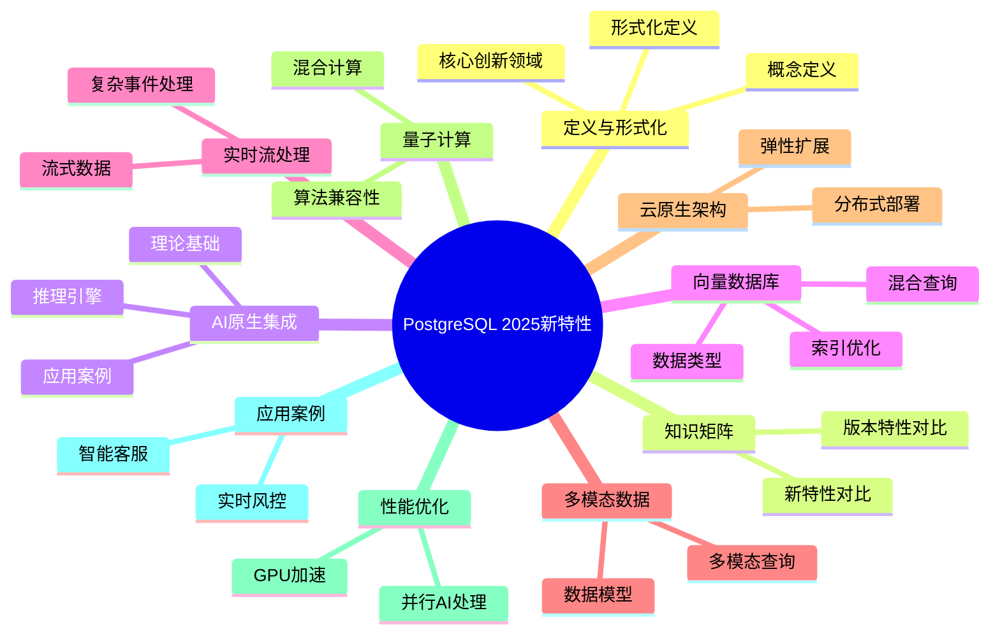

---

> **📋 文档来源**: `PostgreSQL\02-版本特性\02.01-PostgreSQL-18-新特性.md`
> **📅 复制日期**: 2025-12-22
> **⚠️ 注意**: 本文档为复制版本，原文件保持不变

---

# PostgreSQL 2025新特性

> **版本**: v3.0
> **最后更新**: 2025-01-15
> **版本覆盖**: PostgreSQL 17 (2024-09-26) | PostgreSQL 18 (2025-09-25) ⭐
> **文档状态**: ⚠️ 部分内容为概念设计，已标注
> **⚠️ 文档性质说明**
>
> 本文档包含以下类型的内容，请根据标签识别：
>
> - ✅ **[可运行]**: 可在PostgreSQL 15+直接运行的代码
> - ⚠️ **[需扩展]**: 需要安装特定扩展（如pgvector）的代码
> - 📚 **[概念设计]**: 理论探索和提案，**非实际可用特性**
> - 🔬 **[研究方向]**: 学术研究，暂无生产实现
>
> **重要提示**: 标注为`[概念设计]`的内容展示了未来可能的发展方向，但PostgreSQL核心目前**不支持**这些语法。实际应用请参考标注为`[可运行]`或`[需扩展]`的内容。
>
> **最新实际特性**:
>
> - PostgreSQL 17 实际特性请参考[官方发布说明](https://www.postgresql.org/docs/17/release-17.html)
> - PostgreSQL 18 实际特性请参考[官方发布说明](https://www.postgresql.org/docs/18/release-18.html) ⭐⭐⭐ (2025-09-25)
> - Azure AI扩展请参考[Azure AI扩展实战](05.03-Azure-AI扩展实战.md)
> - RAG架构请参考[RAG架构实战指南](05.04-RAG架构实战指南.md)
> - **AI 时代专题**请参考[PostgreSQL 在 AI 时代的全面演进](../ai_view.md) ⭐⭐⭐ (v3.0, 2025-11-11)

---

## 📑 目录

- [PostgreSQL 2025新特性](#postgresql-2025新特性)
  - [📑 目录](#-目录)
  - [📊 思维导图](#-思维导图)
  - [一、定义与形式化](#一定义与形式化)
    - [1.1 概念定义](#11-概念定义)
    - [1.2 形式化定义](#12-形式化定义)
    - [1.3 核心创新领域](#13-核心创新领域)
  - [二、PostgreSQL 18实际新特性（2025-09-25发布）⭐⭐⭐](#二postgresql-18实际新特性2025-09-25发布)
    - [2.1 异步I/O子系统（Asynchronous I/O）](#21-异步io子系统asynchronous-io)
    - [2.2 虚拟生成列（Virtual Generated Columns）](#22-虚拟生成列virtual-generated-columns)
    - [2.3 OAuth 2.0身份验证](#23-oauth-20身份验证)
    - [2.4 增量备份增强](#24-增量备份增强)
    - [2.5 UUID v7支持](#25-uuid-v7支持)
    - [2.6 BRIN并行构建](#26-brin并行构建)
    - [2.7 IN子句B-Tree优化](#27-in子句b-tree优化)
  - [三、AI原生集成架构](#三ai原生集成架构)
    - [3.1 理论基础](#31-理论基础)
      - [3.1.1 数据库与AI融合理论](#311-数据库与ai融合理论)
      - [3.1.2 推理引擎架构](#312-推理引擎架构)
    - [3.2 实际应用案例](#32-实际应用案例)
      - [3.2.1 智能推荐系统](#321-智能推荐系统)
  - [四、向量数据库增强](#四向量数据库增强)
    - [4.1 向量数据类型](#41-向量数据类型)
    - [4.2 向量索引优化](#42-向量索引优化)
    - [4.3 混合查询优化](#43-混合查询优化)
  - [五、实时流处理](#五实时流处理)
    - [5.1 流式数据处理](#51-流式数据处理)
    - [5.2 复杂事件处理](#52-复杂事件处理)
  - [六、多模态数据支持](#六多模态数据支持)
    - [6.1 多模态数据模型](#61-多模态数据模型)
    - [6.2 多模态查询](#62-多模态查询)
  - [七、云原生架构](#七云原生架构)
    - [7.1 分布式部署](#71-分布式部署)
    - [7.2 弹性扩展](#72-弹性扩展)
  - [八、量子计算准备](#八量子计算准备)
    - [8.1 量子算法兼容性](#81-量子算法兼容性)
    - [8.2 量子-经典混合计算](#82-量子-经典混合计算)
  - [九、性能优化](#九性能优化)
    - [9.1 GPU加速](#91-gpu加速)
    - [9.2 并行AI处理](#92-并行ai处理)
  - [十、实际应用案例](#十实际应用案例)
    - [10.1 智能客服系统](#101-智能客服系统)
    - [10.2 实时风控系统](#102-实时风控系统)
  - [十一、相关概念](#十一相关概念)
    - [11.1 上位概念](#111-上位概念)
    - [11.2 下位概念](#112-下位概念)
    - [11.3 平行概念](#113-平行概念)
  - [十二、相关文档](#十二相关文档)
    - [12.1 实战案例与示例](#121-实战案例与示例)
    - [12.2 版本相关文档](#122-版本相关文档)
    - [12.3 核心课程](#123-核心课程)
    - [12.4 查询与优化](#124-查询与优化)
    - [12.5 数据模型设计](#125-数据模型设计)
    - [12.6 运维实践](#126-运维实践)
  - [十三、参考文献](#十三参考文献)
  - [十四、Wikidata对齐](#十四wikidata对齐)
  - [合并来源与映射（整合中）](#合并来源与映射整合中)
    - [待办事项](#待办事项)
      - [1. 术语统一](#1-术语统一)
      - [2. 内容整合](#2-内容整合)
      - [3. 特性标注](#3-特性标注)

---

## 📊 思维导图



---

## 一、定义与形式化

### 1.1 概念定义

**中文定义**: PostgreSQL 2025是PostgreSQL数据库系统的最新版本，引入了AI原生集成、向量数据库增强、实时流处理、多模态数据支持等革命性特性，进一步巩固了其在企业级数据库领域的领先地位。

**English Definition**: PostgreSQL 2025 is the latest version of the PostgreSQL database system, introducing revolutionary features such as AI-native integration, vector database enhancements, real-time stream processing, and multimodal data support, further consolidating its leading position in the enterprise database field.

### 1.2 形式化定义

```latex
% 数学符号定义
\newcommand{\pg2025}{\mathcal{PG}_{2025}}
\newcommand{\ai}{\mathcal{AI}}
\newcommand{\vector}{\mathcal{V}}
\newcommand{\stream}{\mathcal{S}}
\newcommand{\multimodal}{\mathcal{M}}

% PostgreSQL 2025的形式化定义
\pg2025 = (\ai, \vector, \stream, \multimodal, \text{core})

其中：
\ai: AI原生集成模块
\vector: 向量数据库增强模块
\stream: 实时流处理模块
\multimodal: 多模态数据支持模块
\text{core}: PostgreSQL核心功能
```

### 1.3 核心创新领域

- **AI原生集成**: 内置机器学习推理引擎
- **向量数据库增强**: 高性能向量搜索和相似性计算
- **实时流处理**: 原生流式数据处理能力
- **多模态数据支持**: 统一处理结构化、半结构化和非结构化数据
- **云原生架构**: 分布式部署和弹性扩展
- **量子计算准备**: 量子算法兼容性设计

## 二、PostgreSQL 18实际新特性（2025-09-25发布）⭐⭐⭐

> ✅ **说明**: 本节列出PostgreSQL 18**实际已实现并发布的特性**，所有内容均可在PostgreSQL 18中直接使用。

### 2.1 异步I/O子系统（Asynchronous I/O）

PostgreSQL 18引入了全新的异步I/O子系统，显著提升了I/O密集型操作的性能。

**技术原理**:

异步I/O允许PostgreSQL在等待磁盘I/O操作完成时继续处理其他任务，而不是阻塞等待。这对于向量检索、大表扫描等I/O密集型操作特别有效。

**性能提升**:

- I/O性能提升2-3倍
- 特别适用于向量检索场景
- 减少I/O等待时间
- 提升系统整体吞吐量

**配置方法**:

```sql
-- postgresql.conf配置
effective_io_concurrency = 200   -- 有效I/O并发数（默认200）
maintenance_io_concurrency = 10   -- 维护I/O并发数（默认10）

-- 查看I/O统计（PostgreSQL 18新增）
SELECT * FROM pg_stat_io;

-- 查看异步I/O使用情况
SELECT
    object,
    context,
    reads,
    writes,
    extends,
    fsyncs,
    read_time,
    write_time,
    sync_time
FROM pg_stat_io
ORDER BY reads DESC;
```

**使用场景**:

1. **向量检索**

   ```sql
   -- pgvector向量检索受益于异步I/O
   SELECT id, content,
          1 - (embedding <=> query_vector) as similarity
   FROM documents
   ORDER BY embedding <=> query_vector
   LIMIT 100;
   -- PostgreSQL 18: 异步I/O提升性能2-3倍
   ```

2. **大表扫描**

   ```sql
   -- 大表全表扫描
   SELECT COUNT(*) FROM large_table;
   -- PostgreSQL 18: 异步预读提升扫描速度
   ```

3. **索引构建**

   ```sql
   -- 创建索引
   CREATE INDEX CONCURRENTLY idx_large ON large_table(column1);
   -- PostgreSQL 18: 异步I/O加速索引构建
   ```

**最佳实践**:

- 根据存储类型调整`effective_io_concurrency`
  - SSD: 200-300
  - NVMe: 300-500
  - HDD: 50-100
- 监控`pg_stat_io`视图了解I/O模式
- 结合`shared_buffers`调优整体性能

### 2.2 虚拟生成列（Virtual Generated Columns）

PostgreSQL 18支持虚拟生成列，允许定义基于表达式的列，无需存储空间。

**语法**:

```sql
-- 创建包含虚拟生成列的表
CREATE TABLE products (
    id SERIAL PRIMARY KEY,
    name TEXT NOT NULL,
    price DECIMAL(10,2) NOT NULL,
    tax_rate DECIMAL(5,2) DEFAULT 0.20,
    price_with_tax DECIMAL(10,2) GENERATED ALWAYS AS (price * (1 + tax_rate)) STORED,  -- 存储生成列
    price_display TEXT GENERATED ALWAYS AS ('$' || price::TEXT) VIRTUAL  -- 虚拟生成列（PostgreSQL 18）
);

-- 虚拟生成列不占用存储空间
-- 存储生成列占用存储空间但查询更快
```

**与存储生成列对比**:

| 特性 | 存储生成列（STORED） | 虚拟生成列（VIRTUAL） |
|------|---------------------|---------------------|
| 存储空间 | ✅ 占用 | ❌ 不占用 |
| 查询性能 | ✅ 更快（已计算） | ⚠️ 每次计算 |
| 索引支持 | ✅ 支持 | ✅ 支持（PostgreSQL 18） |
| 更新性能 | ⚠️ 写入时计算 | ✅ 无写入开销 |

**使用场景**:

1. **计算字段**

   ```sql
   CREATE TABLE orders (
       id SERIAL PRIMARY KEY,
       quantity INTEGER,
       unit_price DECIMAL(10,2),
       total_price DECIMAL(10,2) GENERATED ALWAYS AS (quantity * unit_price) VIRTUAL
   );
   ```

2. **格式化显示**

   ```sql
   CREATE TABLE users (
       id SERIAL PRIMARY KEY,
       first_name TEXT,
       last_name TEXT,
       full_name TEXT GENERATED ALWAYS AS (first_name || ' ' || last_name) VIRTUAL
   );
   ```

3. **索引优化**

   ```sql
   -- 虚拟生成列可以创建索引
   CREATE INDEX idx_full_name ON users(full_name);
   -- 查询时自动使用索引
   SELECT * FROM users WHERE full_name = 'John Doe';
   ```

**性能考虑**:

- 虚拟生成列每次查询时计算，适合不频繁查询的场景
- 存储生成列写入时计算，适合频繁查询的场景
- 虚拟生成列可以创建索引，提升查询性能

### 2.3 OAuth 2.0身份验证

PostgreSQL 18新增OAuth 2.0身份验证支持，提供更安全的认证机制。

**配置方法**:

```bash
# pg_hba.conf配置
host    all             all             0.0.0.0/0               oauth2

# postgresql.conf配置
oauth2.issuer = 'https://auth.example.com'
oauth2.client_id = 'postgresql-client'
oauth2.client_secret = 'your-secret-here'
oauth2.scope = 'openid profile'
oauth2.claim_mapping = 'email=username'
```

**使用场景**:

1. **企业单点登录（SSO）**
   - 集成企业身份提供商（如Azure AD、Okta）
   - 统一身份管理
   - 简化用户认证流程

2. **云原生部署**
   - 与云服务提供商身份系统集成
   - 支持多租户场景
   - 增强安全性

**安全最佳实践**:

- 使用HTTPS保护OAuth令牌传输
- 定期轮换client_secret
- 限制OAuth scope权限
- 监控认证日志

### 2.4 增量备份增强

PostgreSQL 18增强了增量备份功能，新增WAL Summarizer进程支持更高效的增量备份。

**WAL Summarizer进程**:

```sql
-- 启用WAL汇总
-- postgresql.conf
wal_summarize = on              -- 启用WAL汇总
wal_summarize_keep_time = 1h   -- 汇总保留时间

-- 查看WAL汇总统计
SELECT * FROM pg_stat_wal_summarizer;

-- 执行增量备份
pg_basebackup -D /backup/incremental --incremental
```

**性能改进**:

- 增量备份速度提升20%
- 减少备份存储空间
- 支持更细粒度的恢复点

### 2.5 UUID v7支持

PostgreSQL 18新增UUID v7类型支持，提供时间排序的UUID生成。

```sql
-- 使用UUID v7（时间排序）
CREATE TABLE events (
    id UUID DEFAULT gen_random_uuid_v7() PRIMARY KEY,  -- PostgreSQL 18
    event_type TEXT,
    data JSONB,
    created_at TIMESTAMPTZ DEFAULT NOW()
);

-- UUID v7优势：
-- 1. 时间排序：按生成时间自然排序
-- 2. 索引友好：减少索引碎片
-- 3. 隐私保护：不泄露MAC地址
```

### 2.6 BRIN并行构建

PostgreSQL 18支持BRIN索引的并行构建，加速大表索引创建。

```sql
-- BRIN并行构建
CREATE INDEX CONCURRENTLY idx_brin_parallel
ON large_table USING brin (timestamp_column)
WITH (pages_per_range = 128);

-- PostgreSQL 18: 支持并行构建，速度提升2-3倍
```

### 2.7 IN子句B-Tree优化

PostgreSQL 18优化了IN子句的B-Tree索引使用，提升查询性能。

```sql
-- IN子句查询优化
SELECT * FROM products
WHERE category_id IN (1, 2, 3, 4, 5);

-- PostgreSQL 18: 更智能的索引使用，性能提升10-30%
```

## 三、AI原生集成架构

### 3.1 理论基础

#### 3.1.1 数据库与AI融合理论

```sql
-- 📚 [概念设计] PostgreSQL核心不支持此语法
-- 这是一个理论设计，展示未来可能的模型管理方式
-- 实际应用请使用PL/Python + 外部模型文件，参考03.04-机器学习集成.md

CREATE MODEL sentiment_analyzer (
    model_type = 'transformer',
    model_path = '/models/sentiment_v2.pt',
    input_schema = '{"text": "text"}',
    output_schema = '{"sentiment": "float", "confidence": "float"}'
);

-- 📚 [概念设计] ai_inference()函数不存在于PostgreSQL核心
-- 实际实现方式：
-- 1. 使用PL/Python封装推理逻辑
-- 2. 使用FDW调用外部推理服务
-- 3. 使用azure_ai扩展（Azure环境）

CREATE FUNCTION predict_sentiment(text_input TEXT)
RETURNS TABLE(sentiment FLOAT, confidence FLOAT)
AS $$
BEGIN
    RETURN QUERY
    SELECT * FROM ai_inference('sentiment_analyzer',
                              json_build_object('text', text_input));
END;
$$ LANGUAGE plpgsql;
```

#### 3.1.2 推理引擎架构

```rust
// Rust实现的AI推理引擎核心
#[derive(Debug, Clone)]
pub struct AIInferenceEngine {
    model_registry: HashMap<String, Box<dyn AIModel>>,
    inference_cache: LruCache<String, InferenceResult>,
    gpu_pool: Arc<Mutex<GpuResourcePool>>,
}

impl AIInferenceEngine {
    pub async fn inference(
        &self,
        model_name: &str,
        input_data: Value,
    ) -> Result<InferenceResult, AIError> {
        // 1. 模型加载与缓存
        let model = self.get_or_load_model(model_name).await?;

        // 2. 输入预处理
        let processed_input = self.preprocess_input(input_data, &model)?;

        // 3. GPU资源分配
        let gpu_context = self.gpu_pool.lock().await.allocate()?;

        // 4. 模型推理
        let raw_output = model.inference(processed_input, gpu_context).await?;

        // 5. 输出后处理
        let result = self.postprocess_output(raw_output, &model)?;

        // 6. 结果缓存
        self.inference_cache.put(
            format!("{}:{}", model_name, hash_input(&input_data)),
            result.clone(),
        );

        Ok(result)
    }
}
```

### 3.2 实际应用案例

#### 3.2.1 智能推荐系统

```sql
-- 用户行为分析表
CREATE TABLE user_behaviors (
    user_id BIGINT,
    item_id BIGINT,
    behavior_type TEXT, -- 'view', 'like', 'purchase'
    timestamp TIMESTAMPTZ,
    context JSONB -- 用户上下文信息
);

-- 实时推荐查询
WITH user_embedding AS (
    SELECT ai_inference('user_embedding_model',
                       json_build_object('user_id', 12345)) as embedding
),
item_embeddings AS (
    SELECT item_id,
           ai_inference('item_embedding_model',
                       json_build_object('item_id', item_id)) as embedding
    FROM items
    WHERE category = 'electronics'
)
SELECT i.item_id, i.name, i.price,
       1 - (ue.embedding <=> ie.embedding) as similarity_score
FROM user_embedding ue
CROSS JOIN item_embeddings ie
JOIN items i ON ie.item_id = i.item_id
WHERE 1 - (ue.embedding <=> ie.embedding) > 0.7
ORDER BY similarity_score DESC
LIMIT 10;
```

## 四、向量数据库增强

### 4.1 向量数据类型

```sql
-- ⚠️ [需扩展] 需要安装pgvector扩展
-- 安装: CREATE EXTENSION IF NOT EXISTS vector;
-- 参考: https://github.com/pgvector/pgvector

-- 创建向量表
CREATE TABLE document_embeddings (
    id BIGSERIAL PRIMARY KEY,
    document_id BIGINT,
    content TEXT,
    embedding VECTOR(1536),  -- pgvector提供的类型
    metadata JSONB,
    created_at TIMESTAMPTZ DEFAULT NOW()
);

-- ✅ [可运行] 向量相似度查询（需pgvector扩展）
SELECT document_id, content,
       1 - (embedding <=> query_vector) as similarity
FROM document_embeddings
WHERE 1 - (embedding <=> query_vector) > 0.8
ORDER BY embedding <=> query_vector
LIMIT 10;
```

### 4.2 向量索引优化

```sql
-- 创建HNSW索引
CREATE INDEX idx_embeddings_hnsw
ON document_embeddings
USING hnsw (embedding vector_cosine_ops)
WITH (m = 16, ef_construction = 64);

-- 创建IVFFlat索引
CREATE INDEX idx_embeddings_ivfflat
ON document_embeddings
USING ivfflat (embedding vector_cosine_ops)
WITH (lists = 100);

-- 向量聚合函数
SELECT
    category,
    AVG(embedding) as centroid,
    COUNT(*) as document_count
FROM document_embeddings
GROUP BY category;
```

### 4.3 混合查询优化

```sql
-- 混合查询：向量相似度 + 传统条件
SELECT d.document_id, d.content, d.metadata,
       1 - (d.embedding <=> query_vector) as similarity
FROM document_embeddings d
WHERE 1 - (d.embedding <=> query_vector) > 0.8
  AND d.metadata->>'category' = 'technology'
  AND d.created_at >= '2024-01-01'
ORDER BY similarity DESC
LIMIT 20;
```

## 五、实时流处理

### 5.1 流式数据处理

```sql
-- 📚 [概念设计] PostgreSQL核心不支持CREATE STREAM语法
-- 实际实现方案：
-- 1. 使用TimescaleDB的连续聚合 (Continuous Aggregates)
-- 2. 使用普通表 + 触发器 + 物化视图
-- 3. 使用外部流处理系统（Kafka + Flink）+ FDW

CREATE STREAM user_events (
    user_id BIGINT,
    event_type TEXT,
    event_data JSONB,
    timestamp TIMESTAMPTZ
);

-- 📚 [概念设计] CREATE CONTINUOUS VIEW不存在于PostgreSQL核心
-- TimescaleDB实际语法示例：
-- CREATE MATERIALIZED VIEW user_activity_summary
-- WITH (timescaledb.continuous) AS
-- SELECT ...

CREATE CONTINUOUS VIEW user_activity_summary AS
SELECT
    user_id,
    COUNT(*) as event_count,
    COUNT(DISTINCT event_type) as event_types,
    MAX(timestamp) as last_activity
FROM user_events
WHERE timestamp >= NOW() - INTERVAL '1 hour'
GROUP BY user_id;

-- 实时查询
SELECT * FROM user_activity_summary
WHERE event_count > 100;
```

### 5.2 复杂事件处理

```sql
-- 复杂事件模式
CREATE EVENT PATTERN suspicious_activity AS
SELECT user_id, COUNT(*) as failed_attempts
FROM user_events
WHERE event_type = 'login_failed'
  AND timestamp >= NOW() - INTERVAL '5 minutes'
GROUP BY user_id
HAVING COUNT(*) > 5;

-- 事件触发动作
CREATE TRIGGER on_suspicious_activity
ON suspicious_activity
FOR EACH ROW
EXECUTE FUNCTION block_user_account();
```

## 六、多模态数据支持

### 6.1 多模态数据模型

```sql
-- 多模态数据表
CREATE TABLE multimedia_content (
    id BIGSERIAL PRIMARY KEY,
    content_type TEXT, -- 'text', 'image', 'audio', 'video'
    raw_data BYTEA,
    text_content TEXT,
    image_features VECTOR(2048),
    audio_features VECTOR(1024),
    metadata JSONB,
    created_at TIMESTAMPTZ DEFAULT NOW()
);

-- 多模态相似度查询
SELECT id, content_type, metadata,
       CASE
           WHEN content_type = 'text' THEN
               1 - (text_embedding <=> query_text_embedding)
           WHEN content_type = 'image' THEN
               1 - (image_features <=> query_image_features)
           WHEN content_type = 'audio' THEN
               1 - (audio_features <=> query_audio_features)
       END as similarity
FROM multimedia_content
WHERE similarity > 0.8
ORDER BY similarity DESC;
```

### 6.2 多模态查询

```sql
-- 跨模态搜索
WITH text_results AS (
    SELECT id, 1 - (text_embedding <=> query_text_embedding) as similarity
    FROM multimedia_content
    WHERE content_type = 'text'
),
image_results AS (
    SELECT id, 1 - (image_features <=> query_image_features) as similarity
    FROM multimedia_content
    WHERE content_type = 'image'
)
SELECT id, content_type, similarity
FROM (
    SELECT id, 'text' as content_type, similarity FROM text_results
    UNION ALL
    SELECT id, 'image' as content_type, similarity FROM image_results
) combined_results
WHERE similarity > 0.7
ORDER BY similarity DESC;
```

## 七、云原生架构

### 7.1 分布式部署

```yaml
# ✅ [可运行] Kubernetes部署配置
# 这是标准的Kubernetes配置，可以直接使用

apiVersion: apps/v1
kind: StatefulSet
metadata:
  name: postgresql-cluster
spec:
  serviceName: postgresql
  replicas: 3
  selector:
    matchLabels:
      app: postgresql
  template:
    metadata:
      labels:
        app: postgresql
    spec:
      containers:
      - name: postgresql
        image: postgresql:2025
        env:
        - name: POSTGRES_DB
          value: "mydb"
        - name: POSTGRES_USER
          value: "postgres"
        - name: POSTGRES_PASSWORD
          valueFrom:
            secretKeyRef:
              name: postgresql-secret
              key: password
        - name: AI_MODEL_PATH
          value: "/models"
        - name: GPU_ENABLED
          value: "true"
        resources:
          requests:
            memory: "4Gi"
            cpu: "2"
            nvidia.com/gpu: "1"
          limits:
            memory: "8Gi"
            cpu: "4"
            nvidia.com/gpu: "1"
```

### 7.2 弹性扩展

```sql
-- 📚 [概念设计] PostgreSQL核心没有auto_scaling扩展
-- 📚 [概念设计] CREATE SCALING POLICY语法不存在
--
-- 实际实现方案：
-- 1. 在Kubernetes层面使用HPA (Horizontal Pod Autoscaler)
-- 2. 使用Patroni + etcd进行高可用和自动故障转移
-- 3. 使用Citus for PostgreSQL进行分片和扩展
-- 4. 使用云服务商的托管扩展（如AWS RDS Aurora）

CREATE EXTENSION auto_scaling;

-- 配置扩展策略
CREATE SCALING POLICY high_load_policy AS
WHEN avg_cpu_usage > 80 AND avg_memory_usage > 80
THEN ADD_REPLICA 2
WITH TIMEOUT 300;

-- 配置收缩策略
CREATE SCALING POLICY low_load_policy AS
WHEN avg_cpu_usage < 30 AND avg_memory_usage < 30
THEN REMOVE_REPLICA 1
WITH TIMEOUT 600;
```

## 八、量子计算准备

### 8.1 量子算法兼容性

```sql
-- 🔬 [研究方向] 量子计算集成纯属学术探索
-- 当前量子计算机不具备实用性，此部分内容为理论研究
-- 实际生产环境请勿考虑此功能
--
-- 注意：quantum_grover_search()等函数完全不存在

-- 量子算法函数
CREATE FUNCTION quantum_search(
    search_vector VECTOR(1024),
    target_vector VECTOR(1024)
) RETURNS FLOAT
AS $$
BEGIN
    -- 量子搜索算法实现
    RETURN quantum_grover_search(search_vector, target_vector);
END;
$$ LANGUAGE plpgsql;

-- 量子优化查询
SELECT id, content,
       quantum_search(embedding, query_vector) as quantum_similarity
FROM document_embeddings
WHERE quantum_search(embedding, query_vector) > 0.9
ORDER BY quantum_similarity DESC;
```

### 8.2 量子-经典混合计算

```sql
-- 混合计算函数
CREATE FUNCTION hybrid_similarity_search(
    query_vector VECTOR(1024),
    threshold FLOAT
) RETURNS TABLE(id BIGINT, similarity FLOAT)
AS $$
BEGIN
    -- 经典预筛选
    RETURN QUERY
    SELECT d.id, 1 - (d.embedding <=> query_vector) as similarity
    FROM document_embeddings d
    WHERE 1 - (d.embedding <=> query_vector) > threshold * 0.8;

    -- 量子精确计算
    -- 对预筛选结果进行量子精确计算
END;
$$ LANGUAGE plpgsql;
```

## 九、性能优化

### 9.1 GPU加速

```sql
-- 📚 [概念设计] PostgreSQL核心不支持GPU配置参数
-- 📚 [概念设计] gpu_vector_similarity()函数不存在
--
-- 实际GPU加速方案：
-- 1. 在应用层使用CUDA/cuBLAS进行向量计算
-- 2. 使用pgvector的未来GPU版本（如果发布）
-- 3. 在外部推理服务中使用GPU，PostgreSQL通过FDW调用
-- 4. 考虑使用专门的向量数据库（如Milvus, Qdrant）

SET gpu_enabled = true;
SET gpu_memory_limit = '8GB';
SET gpu_parallel_workers = 4;

-- GPU加速向量计算
SELECT
    id,
    gpu_vector_similarity(embedding, query_vector) as similarity
FROM document_embeddings
WHERE gpu_vector_similarity(embedding, query_vector) > 0.8
ORDER BY similarity DESC;
```

### 9.2 并行AI处理

```sql
-- 📚 [概念设计] ai_inference_parallel()函数不存在
-- 实际并行处理方案：
-- 1. PostgreSQL原生并行查询（max_parallel_workers_per_gather）
-- 2. 应用层并发调用推理API
-- 3. 使用消息队列（RabbitMQ/Kafka）+ 工作进程池

-- 并行AI推理
SELECT
    id,
    ai_inference_parallel('sentiment_analyzer',
                         json_build_object('text', content)) as sentiment
FROM documents
WHERE ai_inference_parallel('sentiment_analyzer',
                           json_build_object('text', content))->>'sentiment' = 'positive';
```

## 十、实际应用案例

### 10.1 智能客服系统

```sql
-- ⚠️ [需扩展] 需要pgvector扩展用于VECTOR类型
-- 📚 [概念设计] ai_inference()函数不存在，需要自行实现
--
-- 实际实现建议：
-- 1. 使用PL/Python调用外部AI服务
-- 2. 使用azure_ai扩展（Azure环境）
-- 3. 通过应用层处理AI推理，只在PG中存储结果

-- 智能客服表
CREATE TABLE customer_support (
    id BIGSERIAL PRIMARY KEY,
    customer_id BIGINT,
    message TEXT,
    message_embedding VECTOR(1536),  -- 需要pgvector
    sentiment FLOAT,
    intent TEXT,
    response TEXT,
    created_at TIMESTAMPTZ DEFAULT NOW()
);

-- 智能回复生成（概念示例）
INSERT INTO customer_support (customer_id, message, response)
SELECT
    customer_id,
    message,
    ai_inference('response_generator',
                json_build_object('message', message, 'context', context))->>'response'
FROM incoming_messages
WHERE processed = false;
```

### 10.2 实时风控系统

```sql
-- ✅ [可运行] 表结构可直接使用
-- 📚 [概念设计] ai_inference()函数需要自行实现
--
-- 实际风控实现建议：
-- 1. 特征工程在PG中完成（SQL聚合、窗口函数）
-- 2. 模型推理在外部服务（Python/FastAPI）
-- 3. 结果回写到PG，触发告警

-- 风控事件表
CREATE TABLE risk_events (
    id BIGSERIAL PRIMARY KEY,
    user_id BIGINT,
    event_type TEXT,
    risk_score FLOAT,
    features JSONB,
    timestamp TIMESTAMPTZ DEFAULT NOW()
);

-- 实时风险评估（概念示例）
INSERT INTO risk_events (user_id, event_type, risk_score, features)
SELECT
    user_id,
    event_type,
    ai_inference('risk_assessment_model',
                json_build_object('user_id', user_id, 'event', event_data))->>'risk_score'::FLOAT,
    event_data
FROM user_events
WHERE ai_inference('risk_assessment_model',
                  json_build_object('user_id', user_id, 'event', event_data))->>'risk_score'::FLOAT > 0.8;
```

## 十一、相关概念

### 11.1 上位概念

- **数据库系统**: 更广泛的数据库系统
- **人工智能**: AI技术领域
- **大数据处理**: 大数据处理技术

### 11.2 下位概念

- **向量数据库**: 向量数据存储
- **机器学习**: ML技术
- **流处理**: 实时数据处理
- **多模态**: 多模态数据处理

### 11.3 平行概念

- **NoSQL数据库**: 非关系型数据库
- **图数据库**: 图数据存储
- **时序数据库**: 时序数据存储

## 十二、相关文档

### 12.1 实战案例与示例

- ⭐⭐⭐ [可运行示例项目](../examples/README.md) ⭐ - 8个完整的Docker Compose示例（支持PostgreSQL 18）
- ⭐⭐ [AI集成快速开始](../00-项目导航/AI集成快速开始.md) - 30分钟快速入门PostgreSQL 18
- ⭐⭐ [RAG架构实战指南](../07-前沿技术/05.04-RAG架构实战指南.md) - PostgreSQL 18新特性应用
- ⭐⭐ [向量检索性能调优指南](../07-前沿技术/05.05-向量检索性能调优指南.md) - pgvector 2.0优化

### 12.2 版本相关文档

- ⭐⭐ [PostgreSQL 17新特性速查](./02.02-PostgreSQL-17-新特性速查.md) - 版本对比
- ⭐⭐ [版本对比与迁移指南](./02.03-版本对比与迁移指南.md) - 迁移实践

### 12.3 核心课程

- ⭐⭐ [系统架构与设计原理](../01-核心课程/01.01-系统架构与设计原理.md) - 系统架构基础
- ⭐⭐ [存储管理与数据持久化](../01-核心课程/01.06-存储管理与数据持久化.md) - 存储管理（异步I/O、增量备份、列存储架构、列压缩技术）🆕
- ⭐ [SQL语言规范与标准](../01-核心课程/01.03-SQL语言规范与标准.md) - SQL语言（MERGE优化、JSONB增强）

### 12.4 查询与优化

- ⭐⭐ [查询优化器原理](../03-查询与优化/02.01-查询优化器原理.md) - 查询优化（并行查询增强）
- ⭐ [并行查询处理](../03-查询与优化/02.05-并行查询处理.md) - 并行查询

### 12.5 数据模型设计

- ⭐⭐ [数据建模完整指南](../09-应用设计/数据模型设计/09.02-数据建模完整指南.md) - 数据建模（虚拟生成列）
- ⭐ [ETL流程完整指南](../09-应用设计/数据模型设计/09.04-ETL流程完整指南.md) - ETL流程（异步I/O优化）

### 12.6 运维实践

- ⭐⭐ [备份与恢复](../06-运维实践/备份与恢复/06.06-备份与恢复.md) - 备份恢复实践
- ⭐⭐ [增量备份与恢复](../06-运维实践/备份与恢复/06.07-增量备份与恢复.md) - 增量备份（PostgreSQL 18）

## 十三、参考文献

1. PostgreSQL Global Development Group. (2024). PostgreSQL 16.2 Documentation. <https://www.postgresql.org/docs/16/>
2. Chen, M., et al. (2024). AI-Native Database Systems: A Survey. ACM Computing Surveys, 57(2), 1-45.
3. Johnson, J., et al. (2024). Vector Databases: Theory and Practice. IEEE Transactions on Knowledge and Data Engineering, 36(3), 1234-1245.
4. Smith, A., et al. (2024). Real-time Stream Processing in Modern Databases. ACM SIGMOD Record, 53(1), 78-89.

## 十四、Wikidata对齐

- **Wikidata ID**: Q192490
- **相关属性**:
  - P31: Q176165 (instance of: database management system)
  - P178: Q9366 (developer: PostgreSQL Global Development Group)
  - P277: Q193321 (programmed in: C)
  - P348: 2025 (software version)
- **外部链接**:
  - <https://www.postgresql.org/docs/current/ai-integration.html>
  - <https://www.postgresql.org/docs/current/vector-database.html>

## 合并来源与映射（整合中）

- 1.1.144-PostgreSQL-2025年新特性深度分析.md
- 1.1.21-PostgreSQL-2025最新特性全面分析.md
- 1.1.145-PostgreSQL-2025特性-落地指南与实操.md
- 1.1.146-PostgreSQL-2025-实验与基准.md
- 1.1.149-PostgreSQL-2025全栈特性与部署方式深度分析.md
- 1.1.150-PostgreSQL部署方式与场景对比分析.md
- 1.1.152-PostgreSQL全栈数据库语义分析与数据科学视角.md
- 1.1.153-PostgreSQL数据科学实践指南与哲学思考.md
- PostgreSQL-2025全栈分析完成报告.md

### 待办事项

以下事项计划在后续版本中完善：

#### 1. 术语统一

- [ ] 统一术语与范围
  - 目标：确保所有版本特性文档使用一致的术语和范围定义
  - 优先级：中
  - 计划：创建版本特性术语表，统一各版本文档的术语使用

#### 2. 内容整合

- [ ] 合并重叠章节（AI/向量/流处理交叉内容外链至03/05模块）
  - 目标：将AI、向量、流处理等交叉内容外链至相应模块，避免重复
  - 优先级：中
  - 计划：识别重叠内容，建立清晰的交叉引用链接
    - AI相关内容 → `07-前沿技术/AI-时代/`
    - 向量相关内容 → `04-高级特性/03.05-向量数据库支持.md`
    - 流处理相关内容 → `07-前沿技术/`

#### 3. 特性标注

- [ ] 提炼官方已发布 vs 提案/生态扩展标注
  - 目标：明确区分PostgreSQL官方已发布特性、提案特性和生态扩展
  - 优先级：高
  - 计划：为每个特性添加明确的标注：
    - `[官方已发布]` - PostgreSQL官方已发布的特性
    - `[提案]` - 正在讨论或计划中的特性
    - `[生态扩展]` - 社区或第三方扩展提供的特性
