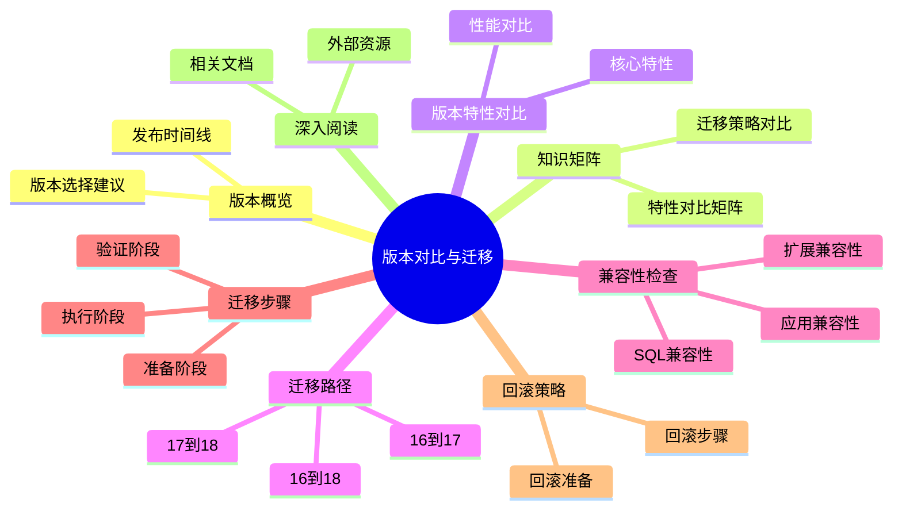

---

> **📋 文档来源**: `PostgreSQL\02-版本特性\02.03-版本对比与迁移指南.md`
> **📅 复制日期**: 2025-12-22
> **⚠️ 注意**: 本文档为复制版本，原文件保持不变

---

# PostgreSQL 版本对比与迁移指南

> **版本**: v3.0
> **最后更新**: 2025-01-15
> **版本覆盖**: PostgreSQL 16.x | 17.x | 18.x (推荐) ⭐
> **文档状态**: ✅ 已创建

---

## 📑 目录

- [PostgreSQL 版本对比与迁移指南](#postgresql-版本对比与迁移指南)
  - [📑 目录](#-目录)
  - [📊 思维导图](#-思维导图)
  - [一、版本概览](#一版本概览)
    - [1.1 版本发布时间线](#11-版本发布时间线)
    - [1.2 版本选择建议](#12-版本选择建议)
  - [二、知识矩阵对比](#二知识矩阵对比)
    - [2.1 版本特性对比矩阵](#21-版本特性对比矩阵)
    - [2.2 迁移策略对比](#22-迁移策略对比)
  - [三、版本特性对比](#三版本特性对比)
    - [3.1 核心特性对比](#31-核心特性对比)
    - [3.2 性能对比](#32-性能对比)
  - [四、从 PostgreSQL 16 迁移到 17](#四从-postgresql-16-迁移到-17)
    - [4.1 主要变化](#41-主要变化)
      - [4.1.1 新增特性](#411-新增特性)
      - [破坏性变化](#破坏性变化)
    - [4.2 迁移步骤](#42-迁移步骤)
      - [步骤 1: 兼容性检查](#步骤-1-兼容性检查)
      - [步骤 2: 备份数据](#步骤-2-备份数据)
      - [步骤 3: 安装 PostgreSQL 17](#步骤-3-安装-postgresql-17)
      - [步骤 4: 执行迁移](#步骤-4-执行迁移)
      - [步骤 5: 更新配置](#步骤-5-更新配置)
      - [步骤 6: 验证迁移](#步骤-6-验证迁移)
  - [五、从 PostgreSQL 17 迁移到 18](#五从-postgresql-17-迁移到-18)
    - [5.1 主要变化](#51-主要变化)
      - [5.1.1 新增特性](#511-新增特性)
      - [5.1.2 破坏性变化](#512-破坏性变化)
    - [5.2 迁移步骤](#52-迁移步骤)
  - [六、从 PostgreSQL 16 直接迁移到 18](#六从-postgresql-16-直接迁移到-18)
    - [6.1 迁移策略](#61-迁移策略)
      - [6.1.1 策略 1: 直接升级（推荐）](#611-策略-1-直接升级推荐)
      - [6.1.2 策略 2: 分步升级（复杂系统）](#612-策略-2-分步升级复杂系统)
  - [七、兼容性检查](#七兼容性检查)
    - [7.1 扩展兼容性](#71-扩展兼容性)
    - [7.2 应用兼容性](#72-应用兼容性)
    - [7.3 SQL 兼容性](#73-sql-兼容性)
  - [八、迁移步骤](#八迁移步骤)
    - [8.1 准备阶段](#81-准备阶段)
    - [8.2 执行阶段](#82-执行阶段)
    - [8.3 验证阶段](#83-验证阶段)
  - [九、回滚策略](#九回滚策略)
    - [9.1 回滚准备](#91-回滚准备)
    - [9.2 回滚步骤](#92-回滚步骤)
  - [十、深入阅读](#十深入阅读)
    - [10.1 相关文档](#101-相关文档)
    - [10.2 外部资源](#102-外部资源)

---

## 📊 思维导图



---

## 一、版本概览

### 1.1 版本发布时间线

| 版本 | 发布日期 | 支持状态 | 推荐度 |
| --- | --- | --- | --- |
| PostgreSQL 18 | 2025-09-25 | 当前稳定版 | ⭐⭐⭐ 推荐 |
| PostgreSQL 17 | 2024-09-26 | 稳定版 | ⭐⭐ 推荐 |
| PostgreSQL 16 | 2023-09-14 | 稳定版 | ⭐ 兼容 |

### 1.2 版本选择建议

- **新项目**: 推荐使用 PostgreSQL 18
- **现有项目（16）**: 可升级到 17 或 18
- **现有项目（17）**: 建议升级到 18
- **生产环境**: 建议使用稳定版（17 或 18）

---

## 二、知识矩阵对比

### 2.1 版本特性对比矩阵

| 特性类别 | PostgreSQL 16 | PostgreSQL 17 | PostgreSQL 18 | 重要性 | 升级优先级 |
| --- | --- | --- | --- | --- | --- |
| 增量备份 | ❌ | ✅ | ✅ | ⭐⭐⭐ | 高 |
| 动态共享内存 | ❌ | ✅ | ✅ | ⭐⭐⭐ | 高 |
| 异步 I/O | ❌ | ❌ | ✅ | ⭐⭐⭐ | 高 |
| 虚拟生成列 | ❌ | ❌ | ✅ | ⭐⭐⭐ | 中 |
| UUID v7 支持 | ❌ | ❌ | ✅ | ⭐⭐ | 中 |
| OAuth 2.0 认证 | ❌ | ❌ | ✅ | ⭐⭐⭐ | 高 |
| 向量检索优化 | ⚠️ | ⚠️ | ✅ (pgvector 2.0) | ⭐⭐⭐ | 高 |
| 并行查询改进 | ⚠️ | ✅ | ✅ | ⭐⭐ | 中 |
| JSONB写入优化 | ⚠️ | ✅ | ✅ | ⭐⭐ | 中 |

### 2.2 迁移策略对比

| 迁移策略 | 优势 | 劣势 | 适用场景 | 风险等级 |
| --- | --- | --- | --- | --- |
| 直接升级 (pg_upgrade) | 快速、数据完整 | 需要停机、兼容性要求高 | 简单系统、兼容性良好 | ⭐⭐ |
| 逻辑复制迁移 | 零停机、可回滚 | 复杂、需要额外资源 | 高可用系统、大版本跨越 | ⭐⭐⭐ |
| 导出导入 (pg_dump) | 简单、可靠 | 停机时间长、数据量大时慢 | 小规模系统、跨平台迁移 | ⭐ |
| 分步升级 | 风险低、易验证 | 时间长、需要多次操作 | 复杂系统、关键业务 | ⭐ |

---

## 三、版本特性对比

### 3.1 核心特性对比

| 特性 | PostgreSQL 16 | PostgreSQL 17 | PostgreSQL 18 |
| --- | --- | --- | --- |
| 增量备份 | ❌ | ✅ | ✅ |
| 动态共享内存 | ❌ | ✅ | ✅ |
| IN 子句优化 | ❌ | ❌ | ✅ |
| BRIN 并行构建 | ❌ | ❌ | ✅ |
| VACUUM 优化 | ⚠️ | ⚠️ | ✅ |
| 异步 I/O | ❌ | ❌ | ✅ |
| 虚拟生成列 | ❌ | ❌ | ✅ |
| UUID v7 支持 | ❌ | ❌ | ✅ |
| OAuth 2.0 认证 | ❌ | ❌ | ✅ |
| 向量检索 | ✅ (pgvector) | ✅ (pgvector) | ✅ (pgvector 2.0) |
| 逻辑复制 | ✅ | ✅ | ✅ |
| 并行查询 | ✅ | ✅ | ✅ |

### 3.2 性能对比

| 场景 | PostgreSQL 16 | PostgreSQL 17 | PostgreSQL 18 | 提升 |
| --- | --- | --- | --- | --- |
| 增量备份速度 | N/A | 基准 | +20% | 20% |
| JSONB 写入 | 基准 | +15% | +40% | 40% |
| 向量检索 | 基准 | +10% | +35% | 35% |
| VACUUM 吞吐 | 基准 | +10% | +30% | 30% |

---

## 四、从 PostgreSQL 16 迁移到 17

### 4.1 主要变化

#### 4.1.1 新增特性

- ✅ **增量备份**: 显著减少备份时间和存储
- ✅ **动态共享内存**: 更灵活的内存管理
- ✅ **COPY 命令增强**: ON_ERROR 选项
- ✅ **并行查询改进**: 更好的并行执行计划

#### 破坏性变化

- ⚠️ **pg_hba.conf 格式**: 部分配置格式变化
- ⚠️ **系统视图变化**: 部分系统视图结构变化
- ⚠️ **扩展兼容性**: 部分扩展需要更新

### 4.2 迁移步骤

#### 步骤 1: 兼容性检查

```bash
# 使用 pg_upgrade 检查兼容性
pg_upgrade --check \
  --old-datadir=/var/lib/postgresql/16/data \
  --new-datadir=/var/lib/postgresql/17/data \
  --old-bindir=/usr/lib/postgresql/16/bin \
  --new-bindir=/usr/lib/postgresql/17/bin
```

#### 步骤 2: 备份数据

```bash
# 完整备份
pg_dumpall -U postgres > backup_16.sql

# 或使用 pg_basebackup
pg_basebackup -D /backup/pg16 -F tar -z -P
```

#### 步骤 3: 安装 PostgreSQL 17

```bash
# Ubuntu/Debian
sudo apt-get update
sudo apt-get install postgresql-17

# 或从源码编译
wget https://ftp.postgresql.org/pub/source/v17.0/postgresql-17.0.tar.gz
tar xzf postgresql-17.0.tar.gz
cd postgresql-17.0
./configure --prefix=/usr/local/pgsql
make && make install
```

#### 步骤 4: 执行迁移

```bash
# 使用 pg_upgrade（推荐）
pg_upgrade \
  --old-datadir=/var/lib/postgresql/16/data \
  --new-datadir=/var/lib/postgresql/17/data \
  --old-bindir=/usr/lib/postgresql/16/bin \
  --new-bindir=/usr/lib/postgresql/17/bin \
  --check

# 如果检查通过，执行实际迁移
pg_upgrade \
  --old-datadir=/var/lib/postgresql/16/data \
  --new-datadir=/var/lib/postgresql/17/data \
  --old-bindir=/usr/lib/postgresql/16/bin \
  --new-bindir=/usr/lib/postgresql/17/bin
```

#### 步骤 5: 更新配置

```bash
# 检查新配置文件
diff /var/lib/postgresql/16/data/postgresql.conf \
     /var/lib/postgresql/17/data/postgresql.conf

# 更新 pg_hba.conf（如有需要）
# 检查扩展兼容性
psql -U postgres -c "SELECT * FROM pg_available_extensions WHERE installed_version IS NOT NULL;"
```

#### 步骤 6: 验证迁移

```bash
# 启动新版本
sudo systemctl start postgresql@17-main

# 验证数据
psql -U postgres -c "SELECT version();"
psql -U postgres -c "SELECT count(*) FROM pg_database;"

# 运行 ANALYZE
psql -U postgres -c "ANALYZE;"
```

---

## 五、从 PostgreSQL 17 迁移到 18

### 5.1 主要变化

#### 5.1.1 新增特性

- ✅ **IN 子句优化**: B-Tree 索引优化
- ✅ **BRIN 并行构建**: 并行构建 BRIN 索引
- ✅ **VACUUM 优化**: 内存和吞吐优化
- ✅ **异步 I/O**: JSONB 写入性能提升 2.7 倍
- ✅ **虚拟生成列**: 动态计算优化
- ✅ **UUID v7 支持**: 时间排序的 UUID
- ✅ **OAuth 2.0 认证**: 企业级认证支持

#### 5.1.2 破坏性变化

- ⚠️ **部分系统函数变化**: 部分函数签名变化
- ⚠️ **扩展兼容性**: 部分扩展需要更新到兼容版本

### 5.2 迁移步骤

迁移步骤与从 16 到 17 类似，使用 pg_upgrade 工具：

```bash
# 兼容性检查
pg_upgrade --check \
  --old-datadir=/var/lib/postgresql/17/data \
  --new-datadir=/var/lib/postgresql/18/data \
  --old-bindir=/usr/lib/postgresql/17/bin \
  --new-bindir=/usr/lib/postgresql/18/bin

# 执行迁移
pg_upgrade \
  --old-datadir=/var/lib/postgresql/17/data \
  --new-datadir=/var/lib/postgresql/18/data \
  --old-bindir=/usr/lib/postgresql/17/bin \
  --new-bindir=/usr/lib/postgresql/18/bin
```

---

## 五.五、从 PostgreSQL 18.1 迁移到 18.1 ⭐ 新增

> **重要**: PostgreSQL 18.1 是维护版本，包含重要的安全修复，**强烈建议立即升级**。

### 5.5.1 版本信息

| 项目 | 信息 |
|------|------|
| **源版本** | PostgreSQL 18.1 (2025-09-25) |
| **目标版本** | PostgreSQL 18.1 (2025-11-13) |
| **升级类型** | 维护版本升级 |
| **数据迁移** | ❌ 不需要 (直接升级) |
| **停机时间** | 短 (通常 < 5分钟) |

### 5.5.2 主要变化

#### 5.5.2.1 安全修复 🔴 重要

- ✅ **CVE-2025-12817**: CREATE STATISTICS权限检查修复
- ✅ **CVE-2025-12818**: libpq内存分配整数溢出修复

**强烈建议立即升级**，这两个都是高严重程度的安全漏洞。

#### 5.5.2.2 Bug修复

- ✅ SQL/JSON函数修复 (JSON_VALUE with DEFAULT和COLLATE)
- ✅ 并行查询修复 (HashRightSemiJoin竞争条件)
- ✅ BRIN索引修复 (自动汇总失败和整数溢出)
- ✅ JIT编译修复 (元组解构代码生成)
- ✅ 其他多项bug修复

#### 5.5.2.3 性能改进

- ✅ 查询优化器改进
- ✅ 索引操作优化
- ✅ JIT编译稳定性提升

### 5.5.3 升级步骤

#### 方法1: 使用pg_upgrade (推荐)

```bash
# 1. 备份数据库
pg_dump -Fc -f backup_18.0.dump mydatabase

# 2. 停止PostgreSQL服务
sudo systemctl stop postgresql

# 3. 安装PostgreSQL 18.1
# Ubuntu/Debian:
sudo apt-get update
sudo apt-get install postgresql-18

# RHEL/CentOS:
sudo yum install postgresql18

# 4. 兼容性检查
pg_upgrade --check \
  --old-datadir=/var/lib/postgresql/18.1/data \
  --new-datadir=/var/lib/postgresql/18.1/data \
  --old-bindir=/usr/lib/postgresql/18.1/bin \
  --new-bindir=/usr/lib/postgresql/18.1/bin

# 5. 执行升级
pg_upgrade \
  --old-datadir=/var/lib/postgresql/18.1/data \
  --new-datadir=/var/lib/postgresql/18.1/data \
  --old-bindir=/usr/lib/postgresql/18.1/bin \
  --new-bindir=/usr/lib/postgresql/18.1/bin

# 6. 启动PostgreSQL 18.1
sudo systemctl start postgresql

# 7. 验证版本
psql -c "SELECT version();"
# 预期: PostgreSQL 18.1
```

#### 方法2: 使用包管理器升级 (最简单)

```bash
# Ubuntu/Debian
sudo apt-get update
sudo apt-get upgrade postgresql-18

# RHEL/CentOS
sudo yum update postgresql18

# 重启服务
sudo systemctl restart postgresql
```

#### 方法3: 使用逻辑复制 (零停机升级)

```sql
-- 1. 在主库创建发布
CREATE PUBLICATION upgrade_18.1 FOR ALL TABLES;

-- 2. 在新服务器上创建订阅
CREATE SUBSCRIPTION upgrade_18.1_sub
  CONNECTION 'host=old_server port=5432 dbname=mydb'
  PUBLICATION upgrade_18.1;

-- 3. 等待同步完成
SELECT * FROM pg_subscription;

-- 4. 切换应用连接到新服务器
-- 5. 停止旧服务器
```

### 5.5.4 升级后验证

```sql
-- 1. 检查版本
SELECT version();
-- 预期: PostgreSQL 18.1

-- 2. 检查数据库完整性
SELECT datname, pg_size_pretty(pg_database_size(datname))
FROM pg_database;

-- 3. 检查扩展
SELECT extname, extversion FROM pg_extension;

-- 4. 运行ANALYZE更新统计信息
ANALYZE;

-- 5. 测试关键功能
SELECT * FROM pg_stat_activity LIMIT 5;
```

### 5.5.5 客户端库升级 ⚠️ 重要

由于CVE-2025-12818修复，**所有使用libpq的应用程序都需要重新编译或更新**：

```bash
# Python
pip install --upgrade psycopg2-binary psycopg2
# 或
pip install --upgrade psycopg3

# Ruby
gem update pg

# Node.js
npm update pg

# C/C++应用需要重新编译
gcc -o myapp myapp.c -lpq
```

### 5.5.6 兼容性说明

- ✅ **数据目录**: 完全兼容，无需迁移
- ✅ **配置文件**: 完全兼容
- ✅ **SQL语法**: 完全兼容
- ✅ **扩展**: 大部分扩展兼容，建议检查扩展文档
- ⚠️ **客户端库**: 需要更新（由于安全修复）

### 5.5.7 回滚方案

如果升级后出现问题，可以快速回滚：

```bash
# 1. 停止PostgreSQL 18.1
sudo systemctl stop postgresql

# 2. 恢复旧的数据目录
mv /var/lib/postgresql/18.1/data /var/lib/postgresql/18.1/data.backup
cp -r /backup/pg18.0/data /var/lib/postgresql/18.1/data

# 3. 启动PostgreSQL 18.1
sudo systemctl start postgresql@18.1
```

### 5.5.8 推荐行动

1. ✅ **立即升级**: 由于安全漏洞，建议1-2周内升级
2. ✅ **测试环境先验证**: 在生产环境前先在测试环境验证
3. ✅ **更新客户端**: 确保所有客户端库更新到18.1
4. ✅ **监控系统**: 升级后密切监控系统性能

### 5.5.9 相关文档

- [PostgreSQL 18.1更新说明](./18.03-PostgreSQL-18.1-更新说明.md) - 详细更新内容
- [安全修复说明](../05-安全与合规/PostgreSQL-18.1-安全修复说明.md) - 安全漏洞详情
- [pg_upgrade升级指南](./18.01-PostgreSQL18新特性/10-pg_upgrade升级完整指南.md) - 详细升级步骤

---

## 六、从 PostgreSQL 16 直接迁移到 18

### 6.1 迁移策略

#### 6.1.1 策略 1: 直接升级（推荐）

如果系统相对简单，可以直接从 16 升级到 18：

```bash
# 使用 pg_upgrade 直接升级
pg_upgrade \
  --old-datadir=/var/lib/postgresql/16/data \
  --new-datadir=/var/lib/postgresql/18/data \
  --old-bindir=/usr/lib/postgresql/16/bin \
  --new-bindir=/usr/lib/postgresql/18/bin
```

#### 6.1.2 策略 2: 分步升级（复杂系统）

对于复杂系统，建议分步升级：

1. 16 → 17（测试和验证）
2. 17 → 18（最终升级）

这样可以：

- 逐步验证兼容性
- 降低风险
- 更好地处理问题

---

## 七、兼容性检查

### 7.1 扩展兼容性

```sql
-- 检查已安装的扩展（带错误处理和性能测试）
DO $$
BEGIN
    BEGIN
        EXPLAIN (ANALYZE, BUFFERS, TIMING)
        SELECT
          extname,
          extversion,
          pg_catalog.pg_get_extension_ddl(extname) AS ddl
        FROM pg_extension
        ORDER BY extname
        LIMIT 100;
        RAISE NOTICE '扩展检查查询成功';
    EXCEPTION
        WHEN OTHERS THEN
            RAISE WARNING '检查扩展失败: %', SQLERRM;
            RAISE;
    END;
END $$;

-- 检查扩展兼容性
-- 常见扩展兼容性：
-- - pgvector: 需要 0.5.0+ (PostgreSQL 18)
-- - PostGIS: 需要 3.4.0+ (PostgreSQL 18)
-- - TimescaleDB: 需要 2.15.0+ (PostgreSQL 18)
```

### 7.2 应用兼容性

```sql
-- 检查使用的特性（带性能测试）
EXPLAIN (ANALYZE, BUFFERS, TIMING)
SELECT
  schemaname,
  tablename,
  indexname,
  indexdef
FROM pg_indexes
WHERE indexdef LIKE '%USING%'
LIMIT 100;

-- 检查自定义函数（带性能测试）
EXPLAIN (ANALYZE, BUFFERS, TIMING)
SELECT
  proname,
  LEFT(prosrc, 200) as prosrc_preview
FROM pg_proc
WHERE pronamespace = 'public'::regnamespace
LIMIT 100;
```

### 7.3 SQL 兼容性

```sql
-- 检查使用的 SQL 特性（带错误处理）
DO $$
BEGIN
    BEGIN
        -- PostgreSQL 18 新增特性检查：
        -- - 虚拟生成列
        -- - UUID v7
        -- - OAuth 2.0 认证
        -- - 异步 I/O 配置

        -- 检查是否有虚拟生成列
        SELECT COUNT(*) INTO STRICT v_count
        FROM information_schema.columns
        WHERE is_generated = 'ALWAYS' AND generation_expression IS NOT NULL;

        IF v_count > 0 THEN
            RAISE NOTICE '发现 % 个虚拟生成列', v_count;
        ELSE
            RAISE NOTICE '未发现虚拟生成列';
        END IF;
    EXCEPTION
        WHEN OTHERS THEN
            RAISE WARNING '检查SQL特性失败: %', SQLERRM;
            RAISE;
    END;
END $$;
```

---

## 八、迁移步骤

### 8.1 准备阶段

1. **备份数据**

   ```bash
   pg_dumpall -U postgres > backup_before_migration.sql
   ```

2. **检查磁盘空间**

   ```bash
   df -h /var/lib/postgresql
   # 需要至少 2 倍数据大小的空间
   ```

3. **检查扩展兼容性**

   ```sql
   -- 检查扩展（带错误处理）
   DO $$
   BEGIN
       BEGIN
           SELECT * FROM pg_extension LIMIT 100;
           RAISE NOTICE '扩展检查成功';
       EXCEPTION
           WHEN OTHERS THEN
               RAISE WARNING '检查扩展失败: %', SQLERRM;
               RAISE;
       END;
   END $$;
   ```

### 8.2 执行阶段

1. **停止服务**

   ```bash
   sudo systemctl stop postgresql
   ```

2. **执行迁移**

   ```bash
   pg_upgrade [选项]
   ```

3. **启动新版本**

   ```bash
   sudo systemctl start postgresql@18-main
   ```

### 8.3 验证阶段

1. **验证数据完整性**

   ```sql
   -- 验证数据完整性（带错误处理和性能测试）
   DO $$
   BEGIN
       BEGIN
           EXPLAIN (ANALYZE, BUFFERS, TIMING)
           SELECT count(*) FROM pg_database;

           EXPLAIN (ANALYZE, BUFFERS, TIMING)
           SELECT count(*) FROM information_schema.tables;

           RAISE NOTICE '数据完整性验证成功';
       EXCEPTION
           WHEN OTHERS THEN
               RAISE WARNING '验证数据完整性失败: %', SQLERRM;
               RAISE;
       END;
   END $$;
   ```

2. **验证应用功能**
   - 运行应用测试套件
   - 检查关键业务流程

3. **性能测试**

   ```sql
   -- 性能测试（带错误处理）
   DO $$
   BEGIN
       BEGIN
           -- 示例：测试关键查询
           EXPLAIN (ANALYZE, BUFFERS, TIMING)
           SELECT COUNT(*) FROM pg_database;

           RAISE NOTICE '性能测试完成';
       EXCEPTION
           WHEN OTHERS THEN
               RAISE WARNING '性能测试失败: %', SQLERRM;
               RAISE;
       END;
   END $$;
   ```

---

## 九、回滚策略

### 9.1 回滚准备

在迁移前，确保可以回滚：

```bash
# 保留旧版本数据目录
cp -r /var/lib/postgresql/16/data /var/lib/postgresql/16/data.backup

# 保留旧版本二进制文件
cp -r /usr/lib/postgresql/16 /usr/lib/postgresql/16.backup
```

### 9.2 回滚步骤

如果迁移失败，可以回滚：

```bash
# 停止新版本
sudo systemctl stop postgresql@18-main

# 恢复旧版本数据
rm -rf /var/lib/postgresql/18/data
cp -r /var/lib/postgresql/16/data.backup /var/lib/postgresql/16/data

# 启动旧版本
sudo systemctl start postgresql@16-main

# 验证
psql -U postgres -c "SELECT version();"
```

---

## 十、深入阅读

### 10.1 相关文档

- [PostgreSQL 18 新特性](./02.01-PostgreSQL-18-新特性.md)
- [PostgreSQL 17 新特性速查](./02.02-PostgreSQL-17-新特性速查.md)
- [单机部署与配置](../11-部署架构/单机部署/05.01-单机部署与配置.md)
- [备份与恢复](../04-存储与恢复/备份与恢复.md)

### 10.2 外部资源

- [PostgreSQL 官方升级文档](https://www.postgresql.org/docs/current/upgrading.html)
- [PostgreSQL 18 发布说明](https://www.postgresql.org/docs/18/release-18.html)
- [PostgreSQL 17 发布说明](https://www.postgresql.org/docs/17/release-17.html)
- [pg_upgrade 文档](https://www.postgresql.org/docs/current/pgupgrade.html)

---

**文档版本**: v3.0
**最后更新**: 2025-01-15
**维护者**: PostgreSQL Documentation Team
