---

> **📋 文档来源**: `PostgreSQL\02-版本特性\02.03-版本对比与迁移指南.md`
> **📅 复制日期**: 2025-12-22
> **⚠️ 注意**: 本文档为复制版本，原文件保持不变

---

# PostgreSQL 版本对比与迁移指南

> **版本**: v3.0
> **最后更新**: 2025-01-15
> **版本覆盖**: PostgreSQL 16.x | 17.x | 18.x (推荐) ⭐
> **文档状态**: ✅ 已创建

---

## 📑 目录

- [PostgreSQL 版本对比与迁移指南](#postgresql-版本对比与迁移指南)
  - [📑 目录](#-目录)
  - [📊 思维导图](#-思维导图)
  - [一、版本概览](#一版本概览)
    - [1.1 版本发布时间线](#11-版本发布时间线)
    - [1.2 版本选择建议](#12-版本选择建议)
  - [二、知识矩阵对比](#二知识矩阵对比)
    - [2.1 版本特性对比矩阵](#21-版本特性对比矩阵)
    - [2.2 迁移策略对比](#22-迁移策略对比)
  - [三、版本特性对比](#三版本特性对比)
    - [3.1 核心特性对比](#31-核心特性对比)
    - [3.2 性能对比](#32-性能对比)
  - [四、从 PostgreSQL 16 迁移到 17](#四从-postgresql-16-迁移到-17)
    - [4.1 主要变化](#41-主要变化)
      - [4.1.1 新增特性](#411-新增特性)
      - [破坏性变化](#破坏性变化)
    - [4.2 迁移步骤](#42-迁移步骤)
      - [步骤 1: 兼容性检查](#步骤-1-兼容性检查)
      - [步骤 2: 备份数据](#步骤-2-备份数据)
      - [步骤 3: 安装 PostgreSQL 17](#步骤-3-安装-postgresql-17)
      - [步骤 4: 执行迁移](#步骤-4-执行迁移)
      - [步骤 5: 更新配置](#步骤-5-更新配置)
      - [步骤 6: 验证迁移](#步骤-6-验证迁移)
  - [五、从 PostgreSQL 17 迁移到 18](#五从-postgresql-17-迁移到-18)
    - [5.1 主要变化](#51-主要变化)
      - [5.1.1 新增特性](#511-新增特性)
      - [5.1.2 破坏性变化](#512-破坏性变化)
    - [5.2 迁移步骤](#52-迁移步骤)
  - [六、从 PostgreSQL 16 直接迁移到 18](#六从-postgresql-16-直接迁移到-18)
    - [6.1 迁移策略](#61-迁移策略)
      - [6.1.1 策略 1: 直接升级（推荐）](#611-策略-1-直接升级推荐)
      - [6.1.2 策略 2: 分步升级（复杂系统）](#612-策略-2-分步升级复杂系统)
  - [七、兼容性检查](#七兼容性检查)
    - [7.1 扩展兼容性](#71-扩展兼容性)
    - [7.2 应用兼容性](#72-应用兼容性)
    - [7.3 SQL 兼容性](#73-sql-兼容性)
  - [八、迁移步骤](#八迁移步骤)
    - [8.1 准备阶段](#81-准备阶段)
    - [8.2 执行阶段](#82-执行阶段)
    - [8.3 验证阶段](#83-验证阶段)
  - [九、回滚策略](#九回滚策略)
    - [9.1 回滚准备](#91-回滚准备)
    - [9.2 回滚步骤](#92-回滚步骤)
  - [十、深入阅读](#十深入阅读)
    - [10.1 相关文档](#101-相关文档)
    - [10.2 外部资源](#102-外部资源)

---

## 📊 思维导图

```mermaid
mindmap
  root((版本对比与迁移))
    版本概览
      发布时间线
      版本选择建议
    知识矩阵
      特性对比矩阵
      迁移策略对比
    版本特性对比
      核心特性
      性能对比
    迁移路径
      16到17
      17到18
      16到18
    兼容性检查
      扩展兼容性
      应用兼容性
      SQL兼容性
    迁移步骤
      准备阶段
      执行阶段
      验证阶段
    回滚策略
      回滚准备
      回滚步骤
    深入阅读
      相关文档
      外部资源
```



---

## 一、版本概览

### 1.1 版本发布时间线

| 版本 | 发布日期 | 支持状态 | 推荐度 |
| --- | --- | --- | --- |
| PostgreSQL 18 | 2025-09-25 | 当前稳定版 | ⭐⭐⭐ 推荐 |
| PostgreSQL 17 | 2024-09-26 | 稳定版 | ⭐⭐ 推荐 |
| PostgreSQL 16 | 2023-09-14 | 稳定版 | ⭐ 兼容 |

### 1.2 版本选择建议

- **新项目**: 推荐使用 PostgreSQL 18
- **现有项目（16）**: 可升级到 17 或 18
- **现有项目（17）**: 建议升级到 18
- **生产环境**: 建议使用稳定版（17 或 18）

---

## 二、知识矩阵对比

### 2.1 版本特性对比矩阵

| 特性类别 | PostgreSQL 16 | PostgreSQL 17 | PostgreSQL 18 | 重要性 | 升级优先级 |
| --- | --- | --- | --- | --- | --- |
| 增量备份 | ❌ | ✅ | ✅ | ⭐⭐⭐ | 高 |
| 动态共享内存 | ❌ | ✅ | ✅ | ⭐⭐⭐ | 高 |
| 异步 I/O | ❌ | ❌ | ✅ | ⭐⭐⭐ | 高 |
| 虚拟生成列 | ❌ | ❌ | ✅ | ⭐⭐⭐ | 中 |
| UUID v7 支持 | ❌ | ❌ | ✅ | ⭐⭐ | 中 |
| OAuth 2.0 认证 | ❌ | ❌ | ✅ | ⭐⭐⭐ | 高 |
| 向量检索优化 | ⚠️ | ⚠️ | ✅ (pgvector 2.0) | ⭐⭐⭐ | 高 |
| 并行查询改进 | ⚠️ | ✅ | ✅ | ⭐⭐ | 中 |
| JSONB写入优化 | ⚠️ | ✅ | ✅ | ⭐⭐ | 中 |

### 2.2 迁移策略对比

| 迁移策略 | 优势 | 劣势 | 适用场景 | 风险等级 |
| --- | --- | --- | --- | --- |
| 直接升级 (pg_upgrade) | 快速、数据完整 | 需要停机、兼容性要求高 | 简单系统、兼容性良好 | ⭐⭐ |
| 逻辑复制迁移 | 零停机、可回滚 | 复杂、需要额外资源 | 高可用系统、大版本跨越 | ⭐⭐⭐ |
| 导出导入 (pg_dump) | 简单、可靠 | 停机时间长、数据量大时慢 | 小规模系统、跨平台迁移 | ⭐ |
| 分步升级 | 风险低、易验证 | 时间长、需要多次操作 | 复杂系统、关键业务 | ⭐ |

---

## 三、版本特性对比

### 3.1 核心特性对比

| 特性 | PostgreSQL 16 | PostgreSQL 17 | PostgreSQL 18 |
| --- | --- | --- | --- |
| 增量备份 | ❌ | ✅ | ✅ |
| 动态共享内存 | ❌ | ✅ | ✅ |
| IN 子句优化 | ❌ | ❌ | ✅ |
| BRIN 并行构建 | ❌ | ❌ | ✅ |
| VACUUM 优化 | ⚠️ | ⚠️ | ✅ |
| 异步 I/O | ❌ | ❌ | ✅ |
| 虚拟生成列 | ❌ | ❌ | ✅ |
| UUID v7 支持 | ❌ | ❌ | ✅ |
| OAuth 2.0 认证 | ❌ | ❌ | ✅ |
| 向量检索 | ✅ (pgvector) | ✅ (pgvector) | ✅ (pgvector 2.0) |
| 逻辑复制 | ✅ | ✅ | ✅ |
| 并行查询 | ✅ | ✅ | ✅ |

### 3.2 性能对比

| 场景 | PostgreSQL 16 | PostgreSQL 17 | PostgreSQL 18 | 提升 |
| --- | --- | --- | --- | --- |
| 增量备份速度 | N/A | 基准 | +20% | 20% |
| JSONB 写入 | 基准 | +15% | +40% | 40% |
| 向量检索 | 基准 | +10% | +35% | 35% |
| VACUUM 吞吐 | 基准 | +10% | +30% | 30% |

---

## 四、从 PostgreSQL 16 迁移到 17

### 4.1 主要变化

#### 4.1.1 新增特性

- ✅ **增量备份**: 显著减少备份时间和存储
- ✅ **动态共享内存**: 更灵活的内存管理
- ✅ **COPY 命令增强**: ON_ERROR 选项
- ✅ **并行查询改进**: 更好的并行执行计划

#### 破坏性变化

- ⚠️ **pg_hba.conf 格式**: 部分配置格式变化
- ⚠️ **系统视图变化**: 部分系统视图结构变化
- ⚠️ **扩展兼容性**: 部分扩展需要更新

### 4.2 迁移步骤

#### 步骤 1: 兼容性检查

```bash
# 使用 pg_upgrade 检查兼容性
pg_upgrade --check \
  --old-datadir=/var/lib/postgresql/16/data \
  --new-datadir=/var/lib/postgresql/17/data \
  --old-bindir=/usr/lib/postgresql/16/bin \
  --new-bindir=/usr/lib/postgresql/17/bin
```

#### 步骤 2: 备份数据

```bash
# 完整备份
pg_dumpall -U postgres > backup_16.sql

# 或使用 pg_basebackup
pg_basebackup -D /backup/pg16 -F tar -z -P
```

#### 步骤 3: 安装 PostgreSQL 17

```bash
# Ubuntu/Debian
sudo apt-get update
sudo apt-get install postgresql-17

# 或从源码编译
wget https://ftp.postgresql.org/pub/source/v17.0/postgresql-17.0.tar.gz
tar xzf postgresql-17.0.tar.gz
cd postgresql-17.0
./configure --prefix=/usr/local/pgsql
make && make install
```

#### 步骤 4: 执行迁移

```bash
# 使用 pg_upgrade（推荐）
pg_upgrade \
  --old-datadir=/var/lib/postgresql/16/data \
  --new-datadir=/var/lib/postgresql/17/data \
  --old-bindir=/usr/lib/postgresql/16/bin \
  --new-bindir=/usr/lib/postgresql/17/bin \
  --check

# 如果检查通过，执行实际迁移
pg_upgrade \
  --old-datadir=/var/lib/postgresql/16/data \
  --new-datadir=/var/lib/postgresql/17/data \
  --old-bindir=/usr/lib/postgresql/16/bin \
  --new-bindir=/usr/lib/postgresql/17/bin
```

#### 步骤 5: 更新配置

```bash
# 检查新配置文件
diff /var/lib/postgresql/16/data/postgresql.conf \
     /var/lib/postgresql/17/data/postgresql.conf

# 更新 pg_hba.conf（如有需要）
# 检查扩展兼容性
psql -U postgres -c "SELECT * FROM pg_available_extensions WHERE installed_version IS NOT NULL;"
```

#### 步骤 6: 验证迁移

```bash
# 启动新版本
sudo systemctl start postgresql@17-main

# 验证数据
psql -U postgres -c "SELECT version();"
psql -U postgres -c "SELECT count(*) FROM pg_database;"

# 运行 ANALYZE
psql -U postgres -c "ANALYZE;"
```

---

## 五、从 PostgreSQL 17 迁移到 18

### 5.1 主要变化

#### 5.1.1 新增特性

- ✅ **IN 子句优化**: B-Tree 索引优化
- ✅ **BRIN 并行构建**: 并行构建 BRIN 索引
- ✅ **VACUUM 优化**: 内存和吞吐优化
- ✅ **异步 I/O**: JSONB 写入性能提升 2.7 倍
- ✅ **虚拟生成列**: 动态计算优化
- ✅ **UUID v7 支持**: 时间排序的 UUID
- ✅ **OAuth 2.0 认证**: 企业级认证支持

#### 5.1.2 破坏性变化

- ⚠️ **部分系统函数变化**: 部分函数签名变化
- ⚠️ **扩展兼容性**: 部分扩展需要更新到兼容版本

### 5.2 迁移步骤

迁移步骤与从 16 到 17 类似，使用 pg_upgrade 工具：

```bash
# 兼容性检查
pg_upgrade --check \
  --old-datadir=/var/lib/postgresql/17/data \
  --new-datadir=/var/lib/postgresql/18/data \
  --old-bindir=/usr/lib/postgresql/17/bin \
  --new-bindir=/usr/lib/postgresql/18/bin

# 执行迁移
pg_upgrade \
  --old-datadir=/var/lib/postgresql/17/data \
  --new-datadir=/var/lib/postgresql/18/data \
  --old-bindir=/usr/lib/postgresql/17/bin \
  --new-bindir=/usr/lib/postgresql/18/bin
```

---

## 六、从 PostgreSQL 16 直接迁移到 18

### 6.1 迁移策略

#### 6.1.1 策略 1: 直接升级（推荐）

如果系统相对简单，可以直接从 16 升级到 18：

```bash
# 使用 pg_upgrade 直接升级
pg_upgrade \
  --old-datadir=/var/lib/postgresql/16/data \
  --new-datadir=/var/lib/postgresql/18/data \
  --old-bindir=/usr/lib/postgresql/16/bin \
  --new-bindir=/usr/lib/postgresql/18/bin
```

#### 6.1.2 策略 2: 分步升级（复杂系统）

对于复杂系统，建议分步升级：

1. 16 → 17（测试和验证）
2. 17 → 18（最终升级）

这样可以：

- 逐步验证兼容性
- 降低风险
- 更好地处理问题

---

## 七、兼容性检查

### 7.1 扩展兼容性

```sql
-- 检查已安装的扩展（带错误处理和性能测试）
DO $$
BEGIN
    BEGIN
        EXPLAIN (ANALYZE, BUFFERS, TIMING)
        SELECT
          extname,
          extversion,
          pg_catalog.pg_get_extension_ddl(extname) AS ddl
        FROM pg_extension
        ORDER BY extname
        LIMIT 100;
        RAISE NOTICE '扩展检查查询成功';
    EXCEPTION
        WHEN OTHERS THEN
            RAISE WARNING '检查扩展失败: %', SQLERRM;
            RAISE;
    END;
END $$;

-- 检查扩展兼容性
-- 常见扩展兼容性：
-- - pgvector: 需要 0.5.0+ (PostgreSQL 18)
-- - PostGIS: 需要 3.4.0+ (PostgreSQL 18)
-- - TimescaleDB: 需要 2.15.0+ (PostgreSQL 18)
```

### 7.2 应用兼容性

```sql
-- 检查使用的特性（带性能测试）
EXPLAIN (ANALYZE, BUFFERS, TIMING)
SELECT
  schemaname,
  tablename,
  indexname,
  indexdef
FROM pg_indexes
WHERE indexdef LIKE '%USING%'
LIMIT 100;

-- 检查自定义函数（带性能测试）
EXPLAIN (ANALYZE, BUFFERS, TIMING)
SELECT
  proname,
  LEFT(prosrc, 200) as prosrc_preview
FROM pg_proc
WHERE pronamespace = 'public'::regnamespace
LIMIT 100;
```

### 7.3 SQL 兼容性

```sql
-- 检查使用的 SQL 特性（带错误处理）
DO $$
BEGIN
    BEGIN
        -- PostgreSQL 18 新增特性检查：
        -- - 虚拟生成列
        -- - UUID v7
        -- - OAuth 2.0 认证
        -- - 异步 I/O 配置

        -- 检查是否有虚拟生成列
        SELECT COUNT(*) INTO STRICT v_count
        FROM information_schema.columns
        WHERE is_generated = 'ALWAYS' AND generation_expression IS NOT NULL;

        IF v_count > 0 THEN
            RAISE NOTICE '发现 % 个虚拟生成列', v_count;
        ELSE
            RAISE NOTICE '未发现虚拟生成列';
        END IF;
    EXCEPTION
        WHEN OTHERS THEN
            RAISE WARNING '检查SQL特性失败: %', SQLERRM;
            RAISE;
    END;
END $$;
```

---

## 八、迁移步骤

### 8.1 准备阶段

1. **备份数据**

   ```bash
   pg_dumpall -U postgres > backup_before_migration.sql
   ```

2. **检查磁盘空间**

   ```bash
   df -h /var/lib/postgresql
   # 需要至少 2 倍数据大小的空间
   ```

3. **检查扩展兼容性**

   ```sql
   -- 检查扩展（带错误处理）
   DO $$
   BEGIN
       BEGIN
           SELECT * FROM pg_extension LIMIT 100;
           RAISE NOTICE '扩展检查成功';
       EXCEPTION
           WHEN OTHERS THEN
               RAISE WARNING '检查扩展失败: %', SQLERRM;
               RAISE;
       END;
   END $$;
   ```

### 8.2 执行阶段

1. **停止服务**

   ```bash
   sudo systemctl stop postgresql
   ```

2. **执行迁移**

   ```bash
   pg_upgrade [选项]
   ```

3. **启动新版本**

   ```bash
   sudo systemctl start postgresql@18-main
   ```

### 8.3 验证阶段

1. **验证数据完整性**

   ```sql
   -- 验证数据完整性（带错误处理和性能测试）
   DO $$
   BEGIN
       BEGIN
           EXPLAIN (ANALYZE, BUFFERS, TIMING)
           SELECT count(*) FROM pg_database;

           EXPLAIN (ANALYZE, BUFFERS, TIMING)
           SELECT count(*) FROM information_schema.tables;

           RAISE NOTICE '数据完整性验证成功';
       EXCEPTION
           WHEN OTHERS THEN
               RAISE WARNING '验证数据完整性失败: %', SQLERRM;
               RAISE;
       END;
   END $$;
   ```

2. **验证应用功能**
   - 运行应用测试套件
   - 检查关键业务流程

3. **性能测试**

   ```sql
   -- 性能测试（带错误处理）
   DO $$
   BEGIN
       BEGIN
           -- 示例：测试关键查询
           EXPLAIN (ANALYZE, BUFFERS, TIMING)
           SELECT COUNT(*) FROM pg_database;

           RAISE NOTICE '性能测试完成';
       EXCEPTION
           WHEN OTHERS THEN
               RAISE WARNING '性能测试失败: %', SQLERRM;
               RAISE;
       END;
   END $$;
   ```

---

## 九、回滚策略

### 9.1 回滚准备

在迁移前，确保可以回滚：

```bash
# 保留旧版本数据目录
cp -r /var/lib/postgresql/16/data /var/lib/postgresql/16/data.backup

# 保留旧版本二进制文件
cp -r /usr/lib/postgresql/16 /usr/lib/postgresql/16.backup
```

### 9.2 回滚步骤

如果迁移失败，可以回滚：

```bash
# 停止新版本
sudo systemctl stop postgresql@18-main

# 恢复旧版本数据
rm -rf /var/lib/postgresql/18/data
cp -r /var/lib/postgresql/16/data.backup /var/lib/postgresql/16/data

# 启动旧版本
sudo systemctl start postgresql@16-main

# 验证
psql -U postgres -c "SELECT version();"
```

---

## 十、深入阅读

### 10.1 相关文档

- [PostgreSQL 18 新特性](./02.01-PostgreSQL-18-新特性.md)
- [PostgreSQL 17 新特性速查](./02.02-PostgreSQL-17-新特性速查.md)
- [单机部署与配置](../11-部署架构/单机部署/05.01-单机部署与配置.md)
- [备份与恢复](../04-存储与恢复/备份与恢复.md)

### 10.2 外部资源

- [PostgreSQL 官方升级文档](https://www.postgresql.org/docs/current/upgrading.html)
- [PostgreSQL 18 发布说明](https://www.postgresql.org/docs/18/release-18.html)
- [PostgreSQL 17 发布说明](https://www.postgresql.org/docs/17/release-17.html)
- [pg_upgrade 文档](https://www.postgresql.org/docs/current/pgupgrade.html)

---

**文档版本**: v3.0
**最后更新**: 2025-01-15
**维护者**: PostgreSQL Documentation Team
