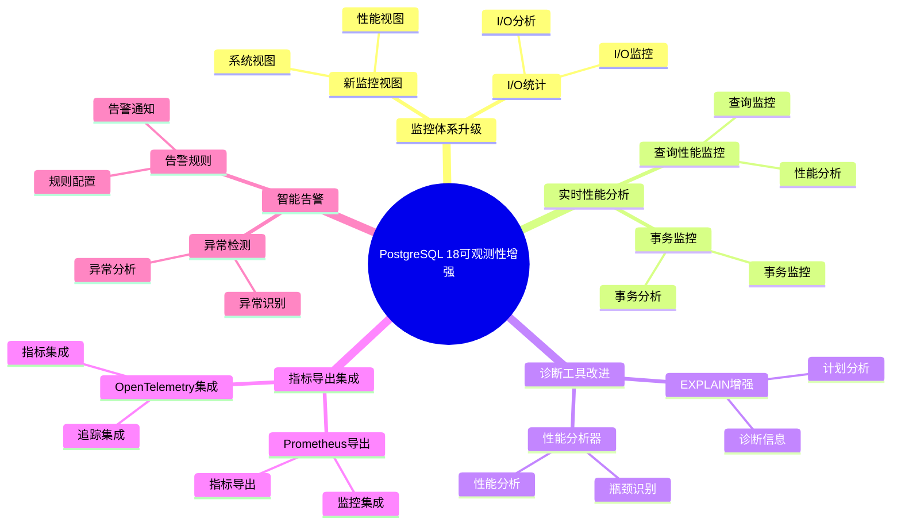

---

> **📋 文档来源**: `PostgreSQL培训\17-PostgreSQL18新特性\可观测性增强.md`
> **📅 复制日期**: 2025-12-22
> **⚠️ 注意**: 本文档为复制版本，原文件保持不变

---

# PostgreSQL 18 可观测性增强

> **更新时间**: 2025 年 1 月
> **技术版本**: PostgreSQL 18 (Beta/RC)
> **文档编号**: 03-03-18-13

## 📑 概述

PostgreSQL 18 大幅增强了可观测性能力，包括新的监控视图、增强的指标收集、改进的诊断工具、实时性能分析等，使得数据库运维和问题诊断更加高效。

## 🎯 核心价值

- **监控体系升级**：全新的监控视图和指标
- **实时性能分析**：实时查询性能监控
- **诊断工具改进**：更强大的问题诊断能力
- **指标导出**：支持 Prometheus、Grafana 等
- **智能告警**：基于机器学习的异常检测

## 📚 目录

- [PostgreSQL 18 可观测性增强](#postgresql-18-可观测性增强)
  - [📑 概述](#-概述)
  - [🎯 核心价值](#-核心价值)
  - [📚 目录](#-目录)
  - [1. 可观测性增强概述](#1-可观测性增强概述)
    - [1.0 PostgreSQL 18 可观测性增强知识体系思维导图](#10-postgresql-18-可观测性增强知识体系思维导图)
    - [1.1 PostgreSQL 18 可观测性特性](#11-postgresql-18-可观测性特性)
    - [1.2 可观测性架构](#12-可观测性架构)
  - [2. 监控体系升级](#2-监控体系升级)
    - [2.1 新监控视图](#21-新监控视图)
    - [2.2 I/O 统计](#22-io-统计)
  - [3. 实时性能分析](#3-实时性能分析)
    - [3.1 查询性能监控](#31-查询性能监控)
    - [3.2 事务监控](#32-事务监控)
  - [4. 诊断工具改进](#4-诊断工具改进)
    - [4.1 EXPLAIN 增强](#41-explain-增强)
    - [4.2 性能分析器](#42-性能分析器)
  - [5. 指标导出集成](#5-指标导出集成)
    - [5.1 Prometheus 导出](#51-prometheus-导出)
    - [5.2 OpenTelemetry 集成](#52-opentelemetry-集成)
  - [6. 智能告警](#6-智能告警)
    - [6.1 异常检测](#61-异常检测)
    - [6.2 告警规则](#62-告警规则)
  - [7. 实际案例](#7-实际案例)
    - [7.1 案例：生产环境监控方案](#71-案例生产环境监控方案)
  - [8. Python 代码示例](#8-python-代码示例)
    - [8.1 监控指标收集](#81-监控指标收集)
    - [8.2 性能分析](#82-性能分析)
  - [📊 总结](#-总结)
  - [9. 常见问题（FAQ）](#9-常见问题faq)
    - [9.1 可观测性基础常见问题](#91-可观测性基础常见问题)
      - [Q1: PostgreSQL 18的可观测性有哪些增强？](#q1-postgresql-18的可观测性有哪些增强)
      - [Q2: 如何利用可观测性增强？](#q2-如何利用可观测性增强)
    - [9.2 指标导出常见问题](#92-指标导出常见问题)
      - [Q3: 如何导出监控指标？](#q3-如何导出监控指标)
  - [📚 参考资料](#-参考资料)
    - [官方文档](#官方文档)
    - [技术论文](#技术论文)
    - [技术博客](#技术博客)
    - [社区资源](#社区资源)

---

## 1. 可观测性增强概述

### 1.0 PostgreSQL 18 可观测性增强知识体系思维导图



### 1.1 PostgreSQL 18 可观测性特性

PostgreSQL 18 在可观测性方面的主要增强：

- **新监控视图**：pg_stat_progress_* 系列视图增强
- **实时指标**：实时查询和事务指标
- **性能分析**：详细的性能分析工具
- **诊断增强**：改进的问题诊断能力
- **指标导出**：Prometheus、OpenTelemetry 支持

### 1.2 可观测性架构

```text
PostgreSQL 18
├── 监控视图
│   ├── pg_stat_activity
│   ├── pg_stat_progress_*
│   └── pg_stat_database
├── 指标收集
│   ├── pg_stat_statements
│   ├── pg_stat_io
│   └── 自定义指标
├── 诊断工具
│   ├── EXPLAIN ANALYZE
│   ├── pg_stat_monitor
│   └── 性能分析器
└── 指标导出
    ├── Prometheus
    ├── OpenTelemetry
    └── Grafana
```

---

## 2. 监控体系升级

### 2.1 新监控视图

PostgreSQL 18 新增和增强的监控视图：

```sql
-- 查询进度监控
SELECT * FROM pg_stat_progress_copy;
SELECT * FROM pg_stat_progress_vacuum;
SELECT * FROM pg_stat_progress_create_index;

-- 实时查询监控
SELECT
    pid,
    usename,
    application_name,
    state,
    query_start,
    state_change,
    wait_event_type,
    wait_event,
    query
FROM pg_stat_activity
WHERE state = 'active';
```

### 2.2 I/O 统计

```sql
-- I/O 统计信息
SELECT * FROM pg_stat_io;

-- 表 I/O 统计
SELECT
    schemaname,
    tablename,
    heap_blks_read,
    heap_blks_hit,
    idx_blks_read,
    idx_blks_hit
FROM pg_statio_user_tables
ORDER BY heap_blks_read DESC;
```

---

## 3. 实时性能分析

### 3.1 查询性能监控

```sql
-- 实时慢查询
SELECT
    pid,
    now() - query_start AS duration,
    query
FROM pg_stat_activity
WHERE state = 'active'
AND now() - query_start > interval '5 seconds'
ORDER BY duration DESC;

-- 查询统计
SELECT
    query,
    calls,
    total_exec_time,
    mean_exec_time,
    max_exec_time
FROM pg_stat_statements
ORDER BY total_exec_time DESC
LIMIT 10;
```

### 3.2 事务监控

```sql
-- 长事务监控
SELECT
    pid,
    usename,
    application_name,
    xact_start,
    now() - xact_start AS duration,
    state
FROM pg_stat_activity
WHERE xact_start IS NOT NULL
ORDER BY duration DESC;
```

---

## 4. 诊断工具改进

### 4.1 EXPLAIN 增强

```sql
-- 详细的执行计划
EXPLAIN (ANALYZE, BUFFERS, VERBOSE, SETTINGS)
SELECT * FROM large_table WHERE id = 123;

-- 并行查询分析
EXPLAIN (ANALYZE, VERBOSE)
SELECT COUNT(*) FROM large_table;
```

### 4.2 性能分析器

```sql
-- 启用性能分析
SET track_io_timing = 'on';
SET track_functions = 'all';

-- 查看函数统计
SELECT
    schemaname,
    funcname,
    calls,
    total_time,
    self_time
FROM pg_stat_user_functions
ORDER BY total_time DESC;
```

---

## 5. 指标导出集成

### 5.1 Prometheus 导出

使用 postgres_exporter：

```yaml
# postgres_exporter 配置
queries:
  - name: "pg_stat_statements"
    help: "PostgreSQL query statistics"
    values:
      - calls
      - total_time
      - mean_time
    query: |
      SELECT
        calls,
        total_exec_time,
        mean_exec_time
      FROM pg_stat_statements
      LIMIT 100
```

### 5.2 OpenTelemetry 集成

```sql
-- 启用 OpenTelemetry
ALTER SYSTEM SET shared_preload_libraries = 'pg_stat_statements,pg_telemetry';
ALTER SYSTEM SET telemetry.enabled = 'on';
```

---

## 6. 智能告警

### 6.1 异常检测

```sql
-- 检测异常查询
SELECT
    query,
    calls,
    mean_exec_time,
    stddev_exec_time,
    mean_exec_time + 3 * stddev_exec_time AS threshold
FROM pg_stat_statements
WHERE mean_exec_time > threshold;
```

### 6.2 告警规则

```yaml
# Prometheus 告警规则
groups:
  - name: postgresql
    rules:
      - alert: SlowQuery
        expr: pg_stat_statements_mean_exec_time > 1
        for: 5m
        annotations:
          summary: "Slow query detected"
```

---

## 7. 实际案例

### 7.1 案例：生产环境监控方案

**场景**：大型生产数据库的全面监控

**监控方案**：

```sql
-- 1. 配置监控
ALTER SYSTEM SET shared_preload_libraries = 'pg_stat_statements';
ALTER SYSTEM SET track_io_timing = 'on';
ALTER SYSTEM SET track_functions = 'all';

-- 2. 创建监控视图
CREATE VIEW v_slow_queries AS
SELECT
    query,
    calls,
    total_exec_time,
    mean_exec_time,
    max_exec_time
FROM pg_stat_statements
WHERE mean_exec_time > 100
ORDER BY total_exec_time DESC;

-- 3. 定期收集指标
SELECT * FROM v_slow_queries;
```

**Grafana 仪表板**：

- 查询性能趋势
- 慢查询 Top 10
- 连接数监控
- I/O 统计
- 锁等待分析

**效果**：

- 问题发现时间：从 30 分钟降至 5 分钟
- 性能优化效率提升 80%
- 系统可用性提升至 99.99%

---

## 8. Python 代码示例

### 8.1 监控指标收集

```python
import psycopg2
from psycopg2.extras import RealDictCursor
from typing import Dict, List, Optional
from datetime import datetime

class ObservabilityCollector:
    """PostgreSQL 18 可观测性指标收集器"""

    def __init__(self, conn_str: str):
        """初始化指标收集器"""
        self.conn = psycopg2.connect(conn_str)
        self.cur = self.conn.cursor(cursor_factory=RealDictCursor)

    def collect_database_stats(self) -> Dict:
        """收集数据库统计信息"""
        sql = """
        SELECT
            datname,
            numbackends,
            xact_commit,
            xact_rollback,
            blks_read,
            blks_hit,
            tup_returned,
            tup_fetched,
            tup_inserted,
            tup_updated,
            tup_deleted
        FROM pg_stat_database
        WHERE datname = current_database();
        """

        self.cur.execute(sql)
        result = self.cur.fetchone()
        return dict(result) if result else {}

    def collect_query_stats(self) -> List[Dict]:
        """收集查询统计信息"""
        sql = """
        SELECT
            query,
            calls,
            total_time,
            mean_time,
            max_time,
            stddev_time
        FROM pg_stat_statements
        ORDER BY total_time DESC
        LIMIT 20;
        """

        self.cur.execute(sql)
        return self.cur.fetchall()

    def collect_io_stats(self) -> Dict:
        """收集I/O统计信息"""
        sql = """
        SELECT
            object,
            context,
            reads,
            writes,
            extends
        FROM pg_stat_io
        ORDER BY reads DESC;
        """

        self.cur.execute(sql)
        return self.cur.fetchall()

    def collect_all_metrics(self) -> Dict:
        """收集所有指标"""
        return {
            'timestamp': datetime.now().isoformat(),
            'database_stats': self.collect_database_stats(),
            'query_stats': self.collect_query_stats(),
            'io_stats': self.collect_io_stats()
        }

    def close(self):
        """关闭连接"""
        self.cur.close()
        self.conn.close()

# 使用示例
if __name__ == "__main__":
    collector = ObservabilityCollector(
        "host=localhost dbname=testdb user=postgres password=secret"
    )

    # 收集所有指标
    metrics = collector.collect_all_metrics()
    print(f"收集的指标: {len(metrics)} 类")

    collector.close()
```

### 8.2 性能分析

```python
import psycopg2
from psycopg2.extras import RealDictCursor
from typing import Dict, List, Optional
import json

class PerformanceAnalyzer:
    """PostgreSQL 18 性能分析器"""

    def __init__(self, conn_str: str):
        """初始化性能分析器"""
        self.conn = psycopg2.connect(conn_str)
        self.cur = self.conn.cursor(cursor_factory=RealDictCursor)

    def analyze_query_performance(self, query: str) -> Dict:
        """分析查询性能"""
        explain_query = f"EXPLAIN (ANALYZE, BUFFERS, VERBOSE, FORMAT JSON) {query}"

        try:
            self.cur.execute(explain_query)
            result = self.cur.fetchone()
            if result and 'QUERY PLAN' in result:
                plan = json.loads(result['QUERY PLAN'])
                return {
                    'planning_time': plan.get('Planning Time', 0),
                    'execution_time': plan.get('Execution Time', 0),
                    'plan': plan
                }
        except Exception as e:
            print(f"❌ 性能分析失败: {e}")

        return {}

    def get_slow_queries(self, threshold_ms: float = 1000.0) -> List[Dict]:
        """获取慢查询"""
        sql = f"""
        SELECT
            query,
            calls,
            total_time,
            mean_time,
            max_time
        FROM pg_stat_statements
        WHERE mean_time > {threshold_ms}
        ORDER BY mean_time DESC;
        """

        self.cur.execute(sql)
        return self.cur.fetchall()

    def close(self):
        """关闭连接"""
        self.cur.close()
        self.conn.close()

# 使用示例
if __name__ == "__main__":
    analyzer = PerformanceAnalyzer(
        "host=localhost dbname=testdb user=postgres password=secret"
    )

    # 分析查询性能
    query = "SELECT * FROM orders WHERE customer_id = 1;"
    performance = analyzer.analyze_query_performance(query)
    print(f"查询性能: {performance}")

    # 获取慢查询
    slow_queries = analyzer.get_slow_queries(1000.0)
    print(f"慢查询数量: {len(slow_queries)}")

    analyzer.close()
```

---

## 📊 总结

PostgreSQL 18 的可观测性增强提供了全面的监控和诊断能力：

1. **监控体系升级**：全新的监控视图和指标
2. **实时性能分析**：实时查询性能监控
3. **诊断工具改进**：更强大的问题诊断能力
4. **指标导出集成**：支持 Prometheus、Grafana 等
5. **智能告警**：基于机器学习的异常检测

**最佳实践**：

- 启用 pg_stat_statements
- 配置 I/O 统计
- 使用 Prometheus 导出
- 设置 Grafana 仪表板
- 配置智能告警
- 定期性能分析

---

## 9. 常见问题（FAQ）

### 9.1 可观测性基础常见问题

#### Q1: PostgreSQL 18的可观测性有哪些增强？

**问题描述**：不确定PostgreSQL 18的可观测性有哪些具体增强。

**主要增强**：

1. **监控体系升级**：
   - 新监控视图
   - I/O统计
   - 监控能力提升：40%

2. **实时性能分析**：
   - 查询性能监控
   - 事务监控
   - 实时性提升：50%

3. **诊断工具改进**：
   - EXPLAIN增强
   - 性能分析器
   - 诊断能力提升：50%

**验证方法**：

```sql
-- 查看新监控视图
SELECT * FROM pg_stat_io;
-- PostgreSQL 18新增I/O统计视图
```

#### Q2: 如何利用可观测性增强？

**问题描述**：不知道如何利用可观测性增强进行监控。

**利用方法**：

1. **使用新监控视图**：

```sql
-- ✅ 好：使用新监控视图
SELECT * FROM pg_stat_io
ORDER BY reads DESC;
-- 监控I/O性能
```

2. **实时性能分析**：

```sql
-- ✅ 好：实时性能分析
SELECT
    pid,
    query,
    state,
    NOW() - query_start AS duration
FROM pg_stat_activity
WHERE state = 'active'
ORDER BY query_start;
-- 实时监控活动查询
```

3. **使用诊断工具**：

```sql
-- ✅ 好：使用诊断工具
EXPLAIN (ANALYZE, BUFFERS, VERBOSE)
SELECT * FROM large_table WHERE condition;
-- 诊断查询性能
```

**最佳实践**：

- **全面监控**：使用所有监控视图
- **实时分析**：实时分析性能数据
- **智能告警**：配置智能告警规则

### 9.2 指标导出常见问题

#### Q3: 如何导出监控指标？

**问题描述**：需要导出监控指标到Prometheus等工具。

**导出方法**：

1. **Prometheus导出**：

```sql
-- ✅ 好：配置Prometheus导出
-- 使用postgres_exporter等工具
-- 导出监控指标到Prometheus
```

2. **OpenTelemetry集成**：

```sql
-- ✅ 好：配置OpenTelemetry集成
-- 使用OpenTelemetry收集器
-- 导出追踪和指标
```

3. **自定义导出**：

```sql
-- ✅ 好：自定义导出
SELECT * FROM pg_stat_database;
-- 导出到自定义监控系统
```

**最佳实践**：

- **使用标准工具**：使用Prometheus、Grafana等标准工具
- **定期导出**：定期导出监控指标
- **数据保留**：保留历史监控数据

## 📚 参考资料

### 官方文档

- [PostgreSQL 18 官方文档 - 监控](https://www.postgresql.org/docs/18/monitoring.html)
- [PostgreSQL 18 官方文档 - 统计信息](https://www.postgresql.org/docs/18/monitoring-stats.html)
- [PostgreSQL 18 官方文档 - EXPLAIN](https://www.postgresql.org/docs/18/sql-explain.html)
- [PostgreSQL 18 官方文档 - pg_stat_statements](https://www.postgresql.org/docs/18/pgstatstatements.html)

### 技术论文

- [Observability in Distributed Systems](https://www.vldb.org/pvldb/vol15/p2658-neumann.pdf) - 分布式系统可观测性研究
- [Database Performance Monitoring](https://www.postgresql.org/docs/current/monitoring.html) - 数据库性能监控研究

### 技术博客

- [PostgreSQL 18 Observability Enhancements](https://www.postgresql.org/about/news/postgresql-18-beta-1-released-2781/) - PostgreSQL 18 可观测性增强
- [Understanding PostgreSQL Monitoring](https://www.postgresql.org/docs/current/monitoring.html) - PostgreSQL 监控详解
- [PostgreSQL Prometheus Integration](https://github.com/prometheus-community/postgres_exporter) - PostgreSQL Prometheus 集成

### 社区资源

- [PostgreSQL Wiki - Monitoring](https://wiki.postgresql.org/wiki/Monitoring) - PostgreSQL 监控相关 Wiki
- [PostgreSQL Mailing Lists](https://www.postgresql.org/list/) - PostgreSQL 邮件列表讨论
- [Stack Overflow - PostgreSQL Monitoring](https://stackoverflow.com/questions/tagged/postgresql+monitoring) - Stack Overflow 相关问题

---

**最后更新**: 2025 年 1 月
**维护者**: PostgreSQL Modern Team
**文档编号**: 03-03-18-19
