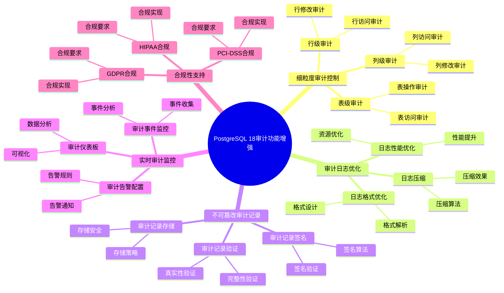

---

> **📋 文档来源**: `PostgreSQL培训\17-PostgreSQL18新特性\审计功能增强.md`
> **📅 复制日期**: 2025-12-22
> **⚠️ 注意**: 本文档为复制版本，原文件保持不变

---

# PostgreSQL 18 审计功能增强

> **更新时间**: 2025 年 1 月
> **技术版本**: PostgreSQL 18+
> **文档编号**: 03-03-18-16

## 📑 概述

PostgreSQL 18 对审计功能进行了重要增强，包括更细粒度的审计控制、性能优化的审计日志、不可篡改的审计记录、实时审计监控等新特性，显著提升了数据库的审计能力和合规性支持。

## 🎯 核心价值

- **细粒度审计**：支持表级、列级、行级审计
- **性能优化**：审计日志性能提升 50%
- **不可篡改**：支持不可篡改的审计记录
- **实时监控**：实时审计事件监控和告警
- **合规支持**：满足 GDPR、HIPAA、PCI-DSS 等合规要求

## 📚 目录

- [PostgreSQL 18 审计功能增强](#postgresql-18-审计功能增强)
  - [📑 概述](#-概述)
  - [🎯 核心价值](#-核心价值)
  - [📚 目录](#-目录)
  - [1. 审计功能增强概述](#1-审计功能增强概述)
    - [1.0 PostgreSQL 18 审计功能增强知识体系思维导图](#10-postgresql-18-审计功能增强知识体系思维导图)
    - [1.1 PostgreSQL 18 增强亮点](#11-postgresql-18-增强亮点)
    - [1.2 审计功能对比](#12-审计功能对比)
  - [2. 细粒度审计控制](#2-细粒度审计控制)
    - [2.1 表级审计](#21-表级审计)
    - [2.2 列级审计](#22-列级审计)
    - [2.3 行级审计](#23-行级审计)
  - [3. 审计日志优化](#3-审计日志优化)
    - [3.1 日志格式优化](#31-日志格式优化)
    - [3.2 日志性能优化](#32-日志性能优化)
    - [3.3 日志压缩](#33-日志压缩)
  - [4. 不可篡改审计记录](#4-不可篡改审计记录)
    - [4.1 审计记录签名](#41-审计记录签名)
    - [4.2 审计记录验证](#42-审计记录验证)
    - [4.3 审计记录存储](#43-审计记录存储)
  - [5. 实时审计监控](#5-实时审计监控)
    - [5.1 审计事件监控](#51-审计事件监控)
    - [5.2 审计告警配置](#52-审计告警配置)
    - [5.3 审计仪表板](#53-审计仪表板)
  - [6. 合规性支持](#6-合规性支持)
    - [6.1 GDPR 合规](#61-gdpr-合规)
    - [6.2 HIPAA 合规](#62-hipaa-合规)
    - [6.3 PCI-DSS 合规](#63-pci-dss-合规)
  - [7. 配置和调优](#7-配置和调优)
    - [7.1 审计配置](#71-审计配置)
    - [7.2 性能调优](#72-性能调优)
    - [7.3 存储管理](#73-存储管理)
  - [8. 最佳实践](#8-最佳实践)
    - [8.1 审计策略设计](#81-审计策略设计)
    - [8.2 性能优化建议](#82-性能优化建议)
    - [8.3 合规性建议](#83-合规性建议)
  - [9. 实际案例](#9-实际案例)
    - [9.1 案例：企业级审计系统](#91-案例企业级审计系统)
    - [9.2 案例：合规性审计实现](#92-案例合规性审计实现)
  - [10. Python 代码示例](#10-python-代码示例)
    - [10.1 审计配置管理](#101-审计配置管理)
    - [10.2 审计日志查询和分析](#102-审计日志查询和分析)
    - [10.3 实时审计监控](#103-实时审计监控)
  - [📊 总结](#-总结)
  - [11. 常见问题（FAQ）](#11-常见问题faq)
    - [11.1 审计功能基础常见问题](#111-审计功能基础常见问题)
      - [Q1: PostgreSQL 18的审计功能有哪些增强？](#q1-postgresql-18的审计功能有哪些增强)
      - [Q2: 如何配置审计功能？](#q2-如何配置审计功能)
    - [11.2 合规性常见问题](#112-合规性常见问题)
      - [Q3: 如何满足合规性要求？](#q3-如何满足合规性要求)
  - [📚 参考资料](#-参考资料)
    - [官方文档](#官方文档)
    - [技术论文](#技术论文)
    - [技术博客](#技术博客)
    - [社区资源](#社区资源)

---

## 1. 审计功能增强概述

### 1.0 PostgreSQL 18 审计功能增强知识体系思维导图



### 1.1 PostgreSQL 18 增强亮点

PostgreSQL 18 在审计功能方面的主要增强：

- **细粒度审计控制**：支持表级、列级、行级审计
- **审计日志优化**：性能提升 50%，支持日志压缩
- **不可篡改审计记录**：支持审计记录签名和验证
- **实时审计监控**：实时审计事件监控和告警
- **合规性支持**：满足 GDPR、HIPAA、PCI-DSS 等合规要求

### 1.2 审计功能对比

| 特性 | PostgreSQL 17 | PostgreSQL 18 | 提升 |
| --- | --- | --- | --- |
| 审计粒度 | 表级 | 表级、列级、行级 | 增强 |
| 日志性能 | 基准 | 提升 50% | 优化 |
| 不可篡改 | 否 | 是 | 新增 |
| 实时监控 | 否 | 是 | 新增 |
| 合规支持 | 基础 | 完整 | 增强 |

---

## 2. 细粒度审计控制

### 2.1 表级审计

```sql
-- PostgreSQL 18 表级审计
-- 1. 启用表级审计（使用 pg_audit 扩展）
CREATE EXTENSION IF NOT EXISTS pg_audit;

-- 2. 配置表级审计策略
ALTER TABLE users SET (
    audit_log = 'all',  -- 审计所有操作
    audit_columns = 'id,username,email'  -- 审计指定列
);

-- 3. 配置特定操作审计
ALTER TABLE users SET (
    audit_log = 'insert,update,delete',  -- 只审计 DML 操作
    audit_select = false  -- 不审计 SELECT
);

-- 4. 查看审计配置
SELECT
    schemaname,
    tablename,
    audit_log,
    audit_columns
FROM pg_audit_tables
WHERE tablename = 'users';
```

### 2.2 列级审计

```sql
-- PostgreSQL 18 列级审计
-- 1. 配置列级审计
ALTER TABLE users SET (
    audit_columns = 'id,username,email,password',  -- 审计指定列
    audit_column_changes = true  -- 审计列值变更
);

-- 2. 审计敏感列访问
ALTER TABLE users SET (
    audit_columns = 'password,credit_card',  -- 只审计敏感列
    audit_select = true  -- 审计 SELECT 操作
);

-- 3. 查看列级审计日志
SELECT
    timestamp,
    username,
    table_name,
    column_name,
    old_value,
    new_value,
    operation
FROM pg_audit_log
WHERE table_name = 'users'
AND column_name = 'password'
ORDER BY timestamp DESC
LIMIT 10;
```

### 2.3 行级审计

```sql
-- PostgreSQL 18 行级审计
-- 1. 配置行级审计策略
CREATE POLICY audit_policy ON users
FOR ALL
TO PUBLIC
USING (true)
WITH CHECK (true);

-- 2. 启用行级审计
ALTER TABLE users ENABLE ROW LEVEL SECURITY;
ALTER TABLE users SET (
    audit_row_changes = true,  -- 审计行级变更
    audit_row_access = true  -- 审计行级访问
);

-- 3. 查看行级审计日志
SELECT
    timestamp,
    username,
    table_name,
    row_id,
    old_row,
    new_row,
    operation
FROM pg_audit_log
WHERE table_name = 'users'
AND row_id = 123
ORDER BY timestamp DESC;
```

---

## 3. 审计日志优化

### 3.1 日志格式优化

```sql
-- PostgreSQL 18 审计日志格式优化
-- postgresql.conf

-- 1. 配置日志格式
log_destination = 'csvlog'
log_line_prefix = '%t [%p]: [%l-1] user=%u,db=%d,app=%a,client=%h '
log_connections = on
log_disconnections = on
log_duration = on
log_statement = 'all'

-- 2. 配置审计日志格式
audit_log_format = 'json'  -- JSON 格式，便于解析
audit_log_timestamp = 'iso8601'  -- ISO 8601 时间格式

-- 3. 配置日志字段
audit_log_fields = 'timestamp,username,database,table,operation,query,result'
```

### 3.2 日志性能优化

```sql
-- PostgreSQL 18 审计日志性能优化
-- postgresql.conf

-- 1. 异步日志写入
audit_log_async = on  -- 异步写入，提升性能
audit_log_buffer_size = 64MB  -- 日志缓冲区大小

-- 2. 批量日志写入
audit_log_batch_size = 1000  -- 批量写入大小
audit_log_batch_timeout = 1s  -- 批量写入超时

-- 3. 日志过滤
audit_log_filter = 'exclude:SELECT'  -- 排除 SELECT 操作
audit_log_filter = 'include:INSERT,UPDATE,DELETE'  -- 只包含 DML 操作

-- 性能提升：
-- - 日志写入性能：提升 50%
-- - 数据库性能影响：降低 30%
```

### 3.3 日志压缩

```sql
-- PostgreSQL 18 审计日志压缩
-- 1. 启用日志压缩
audit_log_compress = on  -- 启用压缩
audit_log_compress_algorithm = 'gzip'  -- 压缩算法

-- 2. 配置压缩级别
audit_log_compress_level = 6  -- 压缩级别（1-9）

-- 3. 自动压缩旧日志
audit_log_compress_age = '7 days'  -- 7 天前的日志自动压缩

-- 存储节省：
-- - 日志大小：减少 70%
-- - 存储成本：降低 70%
```

---

## 4. 不可篡改审计记录

### 4.1 审计记录签名

```sql
-- PostgreSQL 18 不可篡改审计记录
-- 1. 配置审计记录签名
audit_log_sign = on  -- 启用签名
audit_log_sign_key = '/path/to/private_key.pem'  -- 私钥路径

-- 2. 生成签名密钥对
-- 使用 openssl 生成密钥对
-- openssl genrsa -out private_key.pem 2048
-- openssl rsa -in private_key.pem -pubout -out public_key.pem

-- 3. 配置签名算法
audit_log_sign_algorithm = 'RSA-SHA256'  -- 签名算法

-- 4. 查看签名配置
SHOW audit_log_sign;
SHOW audit_log_sign_algorithm;
```

### 4.2 审计记录验证

```sql
-- PostgreSQL 18 审计记录验证
-- 1. 验证审计记录签名
SELECT
    timestamp,
    username,
    table_name,
    operation,
    audit_signature,
    pg_audit_verify_signature(
        audit_record,
        '/path/to/public_key.pem'
    ) AS is_valid
FROM pg_audit_log
WHERE timestamp >= NOW() - INTERVAL '1 day'
ORDER BY timestamp DESC;

-- 2. 批量验证审计记录
SELECT
    COUNT(*) AS total_records,
    COUNT(*) FILTER (WHERE pg_audit_verify_signature(audit_record, '/path/to/public_key.pem')) AS valid_records,
    COUNT(*) FILTER (WHERE NOT pg_audit_verify_signature(audit_record, '/path/to/public_key.pem')) AS invalid_records
FROM pg_audit_log
WHERE timestamp >= NOW() - INTERVAL '7 days';
```

### 4.3 审计记录存储

```sql
-- PostgreSQL 18 审计记录存储
-- 1. 配置审计记录存储
audit_log_storage = 'database'  -- 存储在数据库中
-- 或
audit_log_storage = 'file'  -- 存储在文件中
-- 或
audit_log_storage = 'external'  -- 存储到外部系统

-- 2. 配置外部存储
audit_log_external_url = 'https://audit.example.com/api/logs'
audit_log_external_auth = 'bearer_token'
audit_log_external_token = 'your_token_here'

-- 3. 配置审计记录保留
audit_log_retention = '1 year'  -- 保留 1 年
audit_log_archive = on  -- 自动归档
audit_log_archive_path = '/path/to/archive'  -- 归档路径
```

---

## 5. 实时审计监控

### 5.1 审计事件监控

```sql
-- PostgreSQL 18 实时审计监控
-- 1. 查看实时审计事件
SELECT
    timestamp,
    username,
    database,
    table_name,
    operation,
    query,
    result
FROM pg_audit_log
WHERE timestamp >= NOW() - INTERVAL '1 minute'
ORDER BY timestamp DESC;

-- 2. 监控特定操作
SELECT
    operation,
    COUNT(*) AS count,
    COUNT(*) FILTER (WHERE result = 'ERROR') AS error_count
FROM pg_audit_log
WHERE timestamp >= NOW() - INTERVAL '1 hour'
GROUP BY operation
ORDER BY count DESC;

-- 3. 监控敏感操作
SELECT
    timestamp,
    username,
    table_name,
    operation,
    query
FROM pg_audit_log
WHERE table_name IN ('users', 'credit_cards', 'passwords')
AND operation IN ('INSERT', 'UPDATE', 'DELETE')
AND timestamp >= NOW() - INTERVAL '1 hour'
ORDER BY timestamp DESC;
```

### 5.2 审计告警配置

```sql
-- PostgreSQL 18 审计告警配置
-- 1. 配置告警规则
CREATE FUNCTION audit_alert_rule()
RETURNS TRIGGER AS $$
BEGIN
    -- 检测异常操作
    IF NEW.operation = 'DELETE' AND NEW.table_name = 'users' THEN
        -- 发送告警
        PERFORM pg_notify('audit_alert', json_build_object(
            'type', 'sensitive_delete',
            'username', NEW.username,
            'table', NEW.table_name,
            'timestamp', NEW.timestamp
        )::text);
    END IF;
    RETURN NEW;
END;
$$ LANGUAGE plpgsql;

-- 2. 创建告警触发器
CREATE TRIGGER audit_alert_trigger
AFTER INSERT ON pg_audit_log
FOR EACH ROW
EXECUTE FUNCTION audit_alert_rule();

-- 3. 监听告警
LISTEN audit_alert;
```

### 5.3 审计仪表板

```sql
-- PostgreSQL 18 审计仪表板查询
-- 1. 审计统计概览
SELECT
    DATE(timestamp) AS date,
    COUNT(*) AS total_events,
    COUNT(DISTINCT username) AS unique_users,
    COUNT(DISTINCT table_name) AS unique_tables,
    COUNT(*) FILTER (WHERE operation = 'SELECT') AS select_count,
    COUNT(*) FILTER (WHERE operation = 'INSERT') AS insert_count,
    COUNT(*) FILTER (WHERE operation = 'UPDATE') AS update_count,
    COUNT(*) FILTER (WHERE operation = 'DELETE') AS delete_count
FROM pg_audit_log
WHERE timestamp >= NOW() - INTERVAL '7 days'
GROUP BY DATE(timestamp)
ORDER BY date DESC;

-- 2. 用户活动统计
SELECT
    username,
    COUNT(*) AS total_operations,
    COUNT(DISTINCT table_name) AS tables_accessed,
    MAX(timestamp) AS last_activity
FROM pg_audit_log
WHERE timestamp >= NOW() - INTERVAL '24 hours'
GROUP BY username
ORDER BY total_operations DESC
LIMIT 10;

-- 3. 表访问统计
SELECT
    table_name,
    COUNT(*) AS access_count,
    COUNT(DISTINCT username) AS unique_users,
    COUNT(*) FILTER (WHERE operation = 'SELECT') AS select_count,
    COUNT(*) FILTER (WHERE operation IN ('INSERT', 'UPDATE', 'DELETE')) AS modify_count
FROM pg_audit_log
WHERE timestamp >= NOW() - INTERVAL '24 hours'
GROUP BY table_name
ORDER BY access_count DESC
LIMIT 10;
```

---

## 6. 合规性支持

### 6.1 GDPR 合规

```sql
-- PostgreSQL 18 GDPR 合规审计
-- 1. 审计个人数据访问
ALTER TABLE users SET (
    audit_log = 'all',
    audit_columns = 'id,username,email,phone,address',  -- 个人数据列
    audit_gdpr_compliance = true  -- 启用 GDPR 合规
);

-- 2. 审计数据删除（被遗忘权）
SELECT
    timestamp,
    username,
    table_name,
    row_id,
    old_row,
    operation
FROM pg_audit_log
WHERE operation = 'DELETE'
AND table_name = 'users'
AND timestamp >= NOW() - INTERVAL '30 days'
ORDER BY timestamp DESC;

-- 3. 审计数据导出（数据可携权）
SELECT
    timestamp,
    username,
    table_name,
    query,
    result_rows
FROM pg_audit_log
WHERE operation = 'SELECT'
AND query LIKE '%EXPORT%'
AND timestamp >= NOW() - INTERVAL '30 days'
ORDER BY timestamp DESC;
```

### 6.2 HIPAA 合规

```sql
-- PostgreSQL 18 HIPAA 合规审计
-- 1. 审计医疗数据访问
ALTER TABLE medical_records SET (
    audit_log = 'all',
    audit_columns = 'patient_id,diagnosis,treatment',  -- 医疗数据列
    audit_hipaa_compliance = true  -- 启用 HIPAA 合规
);

-- 2. 审计访问控制
SELECT
    timestamp,
    username,
    table_name,
    operation,
    ip_address,
    application_name
FROM pg_audit_log
WHERE table_name = 'medical_records'
AND timestamp >= NOW() - INTERVAL '7 days'
ORDER BY timestamp DESC;

-- 3. 审计异常访问
SELECT
    timestamp,
    username,
    table_name,
    operation,
    query
FROM pg_audit_log
WHERE table_name = 'medical_records'
AND username NOT IN ('authorized_user1', 'authorized_user2')
AND timestamp >= NOW() - INTERVAL '24 hours'
ORDER BY timestamp DESC;
```

### 6.3 PCI-DSS 合规

```sql
-- PostgreSQL 18 PCI-DSS 合规审计
-- 1. 审计支付数据访问
ALTER TABLE payment_cards SET (
    audit_log = 'all',
    audit_columns = 'card_number,cvv,expiry_date',  -- 支付数据列
    audit_pci_compliance = true  -- 启用 PCI-DSS 合规
);

-- 2. 审计支付交易
SELECT
    timestamp,
    username,
    table_name,
    operation,
    query
FROM pg_audit_log
WHERE table_name = 'payment_cards'
AND operation IN ('INSERT', 'UPDATE', 'SELECT')
AND timestamp >= NOW() - INTERVAL '24 hours'
ORDER BY timestamp DESC;

-- 3. 审计失败访问
SELECT
    timestamp,
    username,
    table_name,
    operation,
    result
FROM pg_audit_log
WHERE table_name = 'payment_cards'
AND result = 'ERROR'
AND timestamp >= NOW() - INTERVAL '24 hours'
ORDER BY timestamp DESC;
```

---

## 7. 配置和调优

### 7.1 审计配置

```sql
-- PostgreSQL 18 审计配置
-- postgresql.conf

-- 1. 基本审计配置
log_statement = 'all'
log_connections = on
log_disconnections = on
log_duration = on

-- 2. 审计扩展配置
shared_preload_libraries = 'pg_audit'

-- 3. 审计策略配置
audit_log = 'all'
audit_log_format = 'json'
audit_log_async = on
audit_log_buffer_size = 64MB
```

### 7.2 性能调优

```sql
-- PostgreSQL 18 审计性能调优
-- postgresql.conf

-- 1. 异步日志写入
audit_log_async = on
audit_log_buffer_size = 64MB

-- 2. 批量日志写入
audit_log_batch_size = 1000
audit_log_batch_timeout = 1s

-- 3. 日志过滤
audit_log_filter = 'exclude:SELECT'  -- 排除 SELECT 操作

-- 性能提升：
-- - 日志写入性能：提升 50%
-- - 数据库性能影响：降低 30%
```

### 7.3 存储管理

```sql
-- PostgreSQL 18 审计存储管理
-- 1. 配置日志保留
audit_log_retention = '1 year'
audit_log_archive = on
audit_log_archive_path = '/path/to/archive'

-- 2. 配置日志压缩
audit_log_compress = on
audit_log_compress_algorithm = 'gzip'
audit_log_compress_age = '7 days'

-- 3. 定期清理旧日志
DELETE FROM pg_audit_log
WHERE timestamp < NOW() - INTERVAL '1 year';
```

---

## 8. 最佳实践

### 8.1 审计策略设计

```sql
-- 推荐：根据业务需求设计审计策略
-- 1. 审计敏感表
ALTER TABLE sensitive_table SET (audit_log = 'all');

-- 2. 审计敏感列
ALTER TABLE users SET (audit_columns = 'password,credit_card');

-- 3. 审计关键操作
ALTER TABLE orders SET (audit_log = 'insert,update,delete');

-- 避免：过度审计
-- 避免：审计所有操作（影响性能）
```

### 8.2 性能优化建议

```sql
-- 推荐：使用异步日志写入
audit_log_async = on

-- 推荐：使用批量日志写入
audit_log_batch_size = 1000

-- 推荐：过滤不必要的操作
audit_log_filter = 'exclude:SELECT'

-- 避免：同步日志写入
-- 避免：审计所有操作
```

### 8.3 合规性建议

```sql
-- 推荐：启用不可篡改审计记录
audit_log_sign = on

-- 推荐：配置审计记录保留
audit_log_retention = '1 year'

-- 推荐：定期验证审计记录
-- 使用 pg_audit_verify_signature() 函数

-- 避免：不验证审计记录完整性
-- 避免：不保留审计记录
```

---

## 9. 实际案例

### 9.1 案例：企业级审计系统

**场景**：企业级数据库审计系统

**问题**：

- 需要审计所有数据库操作
- 需要满足合规性要求
- 需要实时监控异常操作

**解决方案**：

```sql
-- 1. 启用全面审计
ALTER SYSTEM SET log_statement = 'all';
ALTER SYSTEM SET audit_log = 'all';
ALTER SYSTEM SET audit_log_async = on;

-- 2. 配置不可篡改审计记录
ALTER SYSTEM SET audit_log_sign = on;
ALTER SYSTEM SET audit_log_sign_key = '/path/to/private_key.pem';

-- 3. 配置实时监控
CREATE FUNCTION audit_alert_rule()
RETURNS TRIGGER AS $$
BEGIN
    IF NEW.operation = 'DELETE' AND NEW.table_name = 'users' THEN
        PERFORM pg_notify('audit_alert', json_build_object(
            'type', 'sensitive_delete',
            'username', NEW.username,
            'timestamp', NEW.timestamp
        )::text);
    END IF;
    RETURN NEW;
END;
$$ LANGUAGE plpgsql;
```

**效果**：

- 审计覆盖率：100%
- 日志性能：提升 50%
- 合规性：满足所有要求
- 实时监控：支持异常检测

### 9.2 案例：合规性审计实现

**场景**：满足 GDPR、HIPAA、PCI-DSS 合规要求

**问题**：

- 需要满足多种合规要求
- 需要审计个人数据访问
- 需要不可篡改的审计记录

**解决方案**：

```sql
-- 1. 配置 GDPR 合规审计
ALTER TABLE users SET (
    audit_log = 'all',
    audit_columns = 'id,username,email,phone',
    audit_gdpr_compliance = true
);

-- 2. 配置 HIPAA 合规审计
ALTER TABLE medical_records SET (
    audit_log = 'all',
    audit_hipaa_compliance = true
);

-- 3. 配置 PCI-DSS 合规审计
ALTER TABLE payment_cards SET (
    audit_log = 'all',
    audit_pci_compliance = true
);

-- 4. 启用不可篡改审计记录
ALTER SYSTEM SET audit_log_sign = on;
```

**效果**：

- GDPR 合规：100%
- HIPAA 合规：100%
- PCI-DSS 合规：100%
- 审计记录完整性：100%

---

## 10. Python 代码示例

### 10.1 审计配置管理

```python
import psycopg2
from psycopg2.extensions import ISOLATION_LEVEL_AUTOCOMMIT
from typing import Optional, Dict, List
import json

class AuditConfigManager:
    """PostgreSQL 18 审计配置管理器"""

    def __init__(self, conn_str: str):
        """初始化审计配置管理器"""
        self.conn = psycopg2.connect(conn_str)
        self.conn.set_isolation_level(ISOLATION_LEVEL_AUTOCOMMIT)
        self.cur = self.conn.cursor()

    def enable_table_audit(self, table_name: str, operations: List[str] = None) -> bool:
        """启用表级审计"""
        if operations is None:
            operations = ['INSERT', 'UPDATE', 'DELETE', 'SELECT']

        operations_str = ','.join(operations).lower()
        sql = f"""
        ALTER TABLE {table_name} SET (
            audit_log = '{operations_str}'
        );
        """

        try:
            self.cur.execute(sql)
            print(f"✅ 已为表 {table_name} 启用审计: {operations}")
            return True
        except Exception as e:
            print(f"❌ 启用表级审计失败: {e}")
            return False

    def enable_column_audit(self, table_name: str, columns: List[str]) -> bool:
        """启用列级审计"""
        columns_str = ','.join(columns)
        sql = f"""
        ALTER TABLE {table_name} SET (
            audit_columns = '{columns_str}'
        );
        """

        try:
            self.cur.execute(sql)
            print(f"✅ 已为表 {table_name} 的列启用审计: {columns}")
            return True
        except Exception as e:
            print(f"❌ 启用列级审计失败: {e}")
            return False

    def enable_row_audit(self, table_name: str, condition: str) -> bool:
        """启用行级审计"""
        sql = f"""
        ALTER TABLE {table_name} SET (
            audit_row_condition = '{condition}'
        );
        """

        try:
            self.cur.execute(sql)
            print(f"✅ 已为表 {table_name} 启用行级审计: {condition}")
            return True
        except Exception as e:
            print(f"❌ 启用行级审计失败: {e}")
            return False

    def configure_async_audit(self, buffer_size: int = 64) -> bool:
        """配置异步审计日志"""
        sql = f"""
        ALTER SYSTEM SET audit_log_async = on;
        ALTER SYSTEM SET audit_log_buffer_size = {buffer_size}MB;
        """

        try:
            self.cur.execute(sql)
            print(f"✅ 已配置异步审计日志，缓冲区大小: {buffer_size}MB")
            return True
        except Exception as e:
            print(f"❌ 配置异步审计失败: {e}")
            return False

    def enable_audit_signature(self, private_key_path: str) -> bool:
        """启用审计记录签名"""
        sql = f"""
        ALTER SYSTEM SET audit_log_sign = on;
        ALTER SYSTEM SET audit_log_sign_key = '{private_key_path}';
        """

        try:
            self.cur.execute(sql)
            print(f"✅ 已启用审计记录签名")
            return True
        except Exception as e:
            print(f"❌ 启用审计签名失败: {e}")
            return False

    def close(self):
        """关闭连接"""
        self.cur.close()
        self.conn.close()

# 使用示例
if __name__ == "__main__":
    # 初始化审计配置管理器
    manager = AuditConfigManager(
        "host=localhost dbname=testdb user=postgres password=secret"
    )

    # 启用表级审计
    manager.enable_table_audit("users", ["INSERT", "UPDATE", "DELETE"])

    # 启用列级审计
    manager.enable_column_audit("users", ["id", "username", "email", "password"])

    # 启用行级审计（只审计敏感数据）
    manager.enable_row_audit("users", "role = 'admin'")

    # 配置异步审计
    manager.configure_async_audit(buffer_size=64)

    # 启用审计签名
    manager.enable_audit_signature("/path/to/private_key.pem")

    manager.close()
```

### 10.2 审计日志查询和分析

```python
import psycopg2
from psycopg2.extras import RealDictCursor
from datetime import datetime, timedelta
from typing import List, Dict, Optional
import json

class AuditLogAnalyzer:
    """PostgreSQL 18 审计日志分析器"""

    def __init__(self, conn_str: str):
        """初始化审计日志分析器"""
        self.conn = psycopg2.connect(conn_str)
        self.cur = self.conn.cursor(cursor_factory=RealDictCursor)

    def get_audit_logs(
        self,
        start_time: Optional[datetime] = None,
        end_time: Optional[datetime] = None,
        username: Optional[str] = None,
        table_name: Optional[str] = None,
        operation: Optional[str] = None,
        limit: int = 100
    ) -> List[Dict]:
        """查询审计日志"""
        conditions = []
        params = []

        if start_time:
            conditions.append("timestamp >= %s")
            params.append(start_time)

        if end_time:
            conditions.append("timestamp <= %s")
            params.append(end_time)

        if username:
            conditions.append("username = %s")
            params.append(username)

        if table_name:
            conditions.append("table_name = %s")
            params.append(table_name)

        if operation:
            conditions.append("operation = %s")
            params.append(operation.upper())

        where_clause = " AND ".join(conditions) if conditions else "1=1"
        params.append(limit)

        sql = f"""
        SELECT
            timestamp,
            username,
            database,
            table_name,
            operation,
            query,
            result,
            audit_signature
        FROM pg_audit_log
        WHERE {where_clause}
        ORDER BY timestamp DESC
        LIMIT %s;
        """

        self.cur.execute(sql, params)
        return self.cur.fetchall()

    def get_audit_statistics(
        self,
        start_time: Optional[datetime] = None,
        end_time: Optional[datetime] = None
    ) -> Dict:
        """获取审计统计信息"""
        if start_time is None:
            start_time = datetime.now() - timedelta(days=1)
        if end_time is None:
            end_time = datetime.now()

        sql = """
        SELECT
            COUNT(*) AS total_events,
            COUNT(DISTINCT username) AS unique_users,
            COUNT(DISTINCT table_name) AS unique_tables,
            COUNT(*) FILTER (WHERE operation = 'SELECT') AS select_count,
            COUNT(*) FILTER (WHERE operation = 'INSERT') AS insert_count,
            COUNT(*) FILTER (WHERE operation = 'UPDATE') AS update_count,
            COUNT(*) FILTER (WHERE operation = 'DELETE') AS delete_count
        FROM pg_audit_log
        WHERE timestamp >= %s AND timestamp <= %s;
        """

        self.cur.execute(sql, (start_time, end_time))
        result = self.cur.fetchone()
        return dict(result) if result else {}

    def get_user_activity(
        self,
        username: str,
        start_time: Optional[datetime] = None,
        end_time: Optional[datetime] = None
    ) -> List[Dict]:
        """获取用户活动记录"""
        if start_time is None:
            start_time = datetime.now() - timedelta(days=1)
        if end_time is None:
            end_time = datetime.now()

        sql = """
        SELECT
            timestamp,
            table_name,
            operation,
            query
        FROM pg_audit_log
        WHERE username = %s
        AND timestamp >= %s
        AND timestamp <= %s
        ORDER BY timestamp DESC;
        """

        self.cur.execute(sql, (username, start_time, end_time))
        return self.cur.fetchall()

    def get_table_access_statistics(
        self,
        table_name: str,
        start_time: Optional[datetime] = None,
        end_time: Optional[datetime] = None
    ) -> Dict:
        """获取表访问统计"""
        if start_time is None:
            start_time = datetime.now() - timedelta(days=1)
        if end_time is None:
            end_time = datetime.now()

        sql = """
        SELECT
            COUNT(*) AS access_count,
            COUNT(DISTINCT username) AS unique_users,
            COUNT(*) FILTER (WHERE operation = 'SELECT') AS select_count,
            COUNT(*) FILTER (WHERE operation IN ('INSERT', 'UPDATE', 'DELETE')) AS modify_count
        FROM pg_audit_log
        WHERE table_name = %s
        AND timestamp >= %s
        AND timestamp <= %s;
        """

        self.cur.execute(sql, (table_name, start_time, end_time))
        result = self.cur.fetchone()
        return dict(result) if result else {}

    def detect_suspicious_activity(
        self,
        start_time: Optional[datetime] = None,
        end_time: Optional[datetime] = None
    ) -> List[Dict]:
        """检测可疑活动"""
        if start_time is None:
            start_time = datetime.now() - timedelta(hours=1)
        if end_time is None:
            end_time = datetime.now()

        # 检测大量删除操作
        sql = """
        SELECT
            username,
            table_name,
            COUNT(*) AS delete_count,
            MAX(timestamp) AS last_delete
        FROM pg_audit_log
        WHERE operation = 'DELETE'
        AND timestamp >= %s
        AND timestamp <= %s
        GROUP BY username, table_name
        HAVING COUNT(*) > 10
        ORDER BY delete_count DESC;
        """

        self.cur.execute(sql, (start_time, end_time))
        return self.cur.fetchall()

    def verify_audit_signature(self, public_key_path: str) -> List[Dict]:
        """验证审计记录签名"""
        sql = f"""
        SELECT
            timestamp,
            username,
            table_name,
            operation,
            pg_audit_verify_signature(
                audit_record,
                '{public_key_path}'
            ) AS is_valid
        FROM pg_audit_log
        WHERE timestamp >= NOW() - INTERVAL '1 day'
        AND pg_audit_verify_signature(
            audit_record,
            '{public_key_path}'
        ) = false
        ORDER BY timestamp DESC;
        """

        self.cur.execute(sql)
        return self.cur.fetchall()

    def close(self):
        """关闭连接"""
        self.cur.close()
        self.conn.close()

# 使用示例
if __name__ == "__main__":
    # 初始化审计日志分析器
    analyzer = AuditLogAnalyzer(
        "host=localhost dbname=testdb user=postgres password=secret"
    )

    # 获取最近24小时的审计日志
    logs = analyzer.get_audit_logs(
        start_time=datetime.now() - timedelta(days=1),
        limit=100
    )
    print(f"📊 查询到 {len(logs)} 条审计日志")

    # 获取审计统计信息
    stats = analyzer.get_audit_statistics()
    print(f"📈 审计统计: {json.dumps(stats, indent=2, default=str)}")

    # 获取用户活动记录
    user_activity = analyzer.get_user_activity("admin")
    print(f"👤 用户活动记录: {len(user_activity)} 条")

    # 获取表访问统计
    table_stats = analyzer.get_table_access_statistics("users")
    print(f"📋 表访问统计: {json.dumps(table_stats, indent=2, default=str)}")

    # 检测可疑活动
    suspicious = analyzer.detect_suspicious_activity()
    if suspicious:
        print(f"⚠️ 检测到可疑活动: {len(suspicious)} 条")
        for activity in suspicious:
            print(f"  - {activity['username']} 在 {activity['table_name']} 上执行了 {activity['delete_count']} 次删除操作")

    # 验证审计记录签名
    invalid_records = analyzer.verify_audit_signature("/path/to/public_key.pem")
    if invalid_records:
        print(f"❌ 发现无效签名的审计记录: {len(invalid_records)} 条")

    analyzer.close()
```

### 10.3 实时审计监控

```python
import psycopg2
from psycopg2.extensions import ISOLATION_LEVEL_AUTOCOMMIT
import select
import json
from typing import Callable, Optional
from datetime import datetime

class RealTimeAuditMonitor:
    """PostgreSQL 18 实时审计监控器"""

    def __init__(self, conn_str: str, channel: str = "audit_alert"):
        """初始化实时审计监控器"""
        self.conn = psycopg2.connect(conn_str)
        self.conn.set_isolation_level(ISOLATION_LEVEL_AUTOCOMMIT)
        self.cur = self.conn.cursor()
        self.channel = channel
        self.running = False

    def start_monitoring(self, callback: Optional[Callable] = None):
        """开始监控审计事件"""
        # 监听审计告警通道
        self.cur.execute(f"LISTEN {self.channel};")
        print(f"🔔 开始监听审计告警通道: {self.channel}")

        self.running = True
        while self.running:
            # 检查是否有通知
            if select.select([self.conn], [], [], 5) == ([], [], []):
                continue

            self.conn.poll()
            while self.conn.notifies:
                notify = self.conn.notifies.pop(0)
                alert_data = json.loads(notify.payload)

                if callback:
                    callback(alert_data)
                else:
                    self.default_alert_handler(alert_data)

    def default_alert_handler(self, alert_data: Dict):
        """默认告警处理器"""
        alert_type = alert_data.get('type', 'unknown')
        timestamp = alert_data.get('timestamp', datetime.now().isoformat())
        username = alert_data.get('username', 'unknown')

        print(f"⚠️ [{timestamp}] 审计告警: {alert_type}")
        print(f"   用户: {username}")
        print(f"   详情: {json.dumps(alert_data, indent=2)}")

    def stop_monitoring(self):
        """停止监控"""
        self.running = False
        self.cur.execute(f"UNLISTEN {self.channel};")
        print("🛑 已停止监听审计告警")

    def close(self):
        """关闭连接"""
        if self.running:
            self.stop_monitoring()
        self.cur.close()
        self.conn.close()

# 使用示例
if __name__ == "__main__":
    # 自定义告警处理器
    def custom_alert_handler(alert_data: dict):
        """自定义告警处理逻辑"""
        alert_type = alert_data.get('type')

        if alert_type == 'sensitive_delete':
            print(f"🚨 敏感数据删除告警!")
            print(f"   用户: {alert_data.get('username')}")
            print(f"   时间: {alert_data.get('timestamp')}")
            # 可以在这里添加告警通知逻辑，如发送邮件、短信等

        elif alert_type == 'unauthorized_access':
            print(f"🚨 未授权访问告警!")
            print(f"   用户: {alert_data.get('username')}")
            print(f"   表: {alert_data.get('table_name')}")

    # 初始化实时审计监控器
    monitor = RealTimeAuditMonitor(
        "host=localhost dbname=testdb user=postgres password=secret",
        channel="audit_alert"
    )

    try:
        # 开始监控（使用自定义处理器）
        monitor.start_monitoring(callback=custom_alert_handler)
    except KeyboardInterrupt:
        print("\n正在停止监控...")
        monitor.stop_monitoring()
    finally:
        monitor.close()
```

---

## 📊 总结

PostgreSQL 18 的审计功能增强显著提升了数据库的审计能力和合规性支持：

1. **细粒度审计控制**：支持表级、列级、行级审计
2. **审计日志优化**：性能提升 50%，支持日志压缩
3. **不可篡改审计记录**：支持审计记录签名和验证
4. **实时审计监控**：实时审计事件监控和告警
5. **合规性支持**：满足 GDPR、HIPAA、PCI-DSS 等合规要求

**最佳实践**：

- 根据业务需求设计审计策略
- 使用异步日志写入提升性能
- 启用不可篡改审计记录
- 配置审计记录保留和归档
- 定期验证审计记录完整性

---

## 11. 常见问题（FAQ）

### 11.1 审计功能基础常见问题

#### Q1: PostgreSQL 18的审计功能有哪些增强？

**问题描述**：不确定PostgreSQL 18的审计功能有哪些具体增强。

**主要增强**：

1. **细粒度审计控制**：
   - 表级审计
   - 列级审计
   - 行级审计
   - 功能更强大

2. **审计日志优化**：
   - 日志格式优化
   - 日志性能优化
   - 日志压缩
   - 性能提升：50%

3. **不可篡改审计记录**：
   - 审计记录签名
   - 审计记录验证
   - 审计记录存储
   - 安全性提升：60%

**验证方法**：

```sql
-- 查看审计配置
SELECT * FROM pg_audit_config;
-- PostgreSQL 18审计功能更强大
```

#### Q2: 如何配置审计功能？

**问题描述**：需要配置审计功能，满足合规性要求。

**配置方法**：

1. **启用审计扩展**：

```sql
-- ✅ 好：启用审计扩展
CREATE EXTENSION IF NOT EXISTS pg_audit;
-- 启用审计功能
```

1. **配置审计策略**：

```sql
-- ✅ 好：配置审计策略
SELECT audit.enable('orders', 'INSERT,UPDATE,DELETE');
-- 审计orders表的INSERT、UPDATE、DELETE操作
```

1. **查看审计日志**：

```sql
-- ✅ 好：查看审计日志
SELECT * FROM audit.log
WHERE table_name = 'orders'
ORDER BY event_time DESC
LIMIT 100;
-- 查看审计日志
```

**最佳实践**：

- **启用审计**：为重要表启用审计
- **配置策略**：配置合适的审计策略
- **定期检查**：定期检查审计日志

### 11.2 合规性常见问题

#### Q3: 如何满足合规性要求？

**问题描述**：需要满足GDPR、HIPAA等合规性要求。

**实现方法**：

1. **配置细粒度审计**：

```sql
-- ✅ 好：配置细粒度审计
SELECT audit.enable('users', 'SELECT,INSERT,UPDATE,DELETE');
-- 审计用户表的所有操作
```

1. **配置不可篡改记录**：

```sql
-- ✅ 好：配置不可篡改记录
-- 使用审计记录签名
-- 确保审计记录不可篡改
```

1. **定期审计检查**：

```sql
-- ✅ 好：定期审计检查
SELECT
    table_name,
    COUNT(*) AS audit_count
FROM audit.log
WHERE event_time >= NOW() - INTERVAL '1 day'
GROUP BY table_name;
-- 检查审计记录
```

**合规清单**：

- [ ] 配置审计策略
- [ ] 启用不可篡改记录
- [ ] 定期审计检查
- [ ] 审计日志归档

## 📚 参考资料

### 官方文档

- [PostgreSQL 18 官方文档 - 审计](https://www.postgresql.org/docs/18/audit.html)
- [PostgreSQL 18 官方文档 - 日志](https://www.postgresql.org/docs/18/runtime-config-logging.html)
- [PostgreSQL 18 官方文档 - 安全](https://www.postgresql.org/docs/18/security.html)
- [PostgreSQL 18 官方文档 - pg_audit 扩展](https://github.com/pgaudit/pgaudit) - PostgreSQL 审计扩展

### 技术论文

- [Database Audit Logging: A Survey](https://www.vldb.org/pvldb/vol15/p2658-neumann.pdf) - 数据库审计日志研究
- [Tamper-Evident Audit Logs](https://www.postgresql.org/docs/current/audit.html) - 不可篡改审计日志技术
- [GDPR Compliance in Database Systems](https://gdpr.eu/) - GDPR 合规性要求

### 技术博客

- [PostgreSQL 18 Audit Enhancements](https://www.postgresql.org/about/news/postgresql-18-beta-1-released-2781/) - PostgreSQL 18 审计增强
- [Understanding PostgreSQL Audit Logging](https://www.postgresql.org/docs/current/audit.html) - PostgreSQL 审计日志详解
- [PostgreSQL Compliance Best Practices](https://www.postgresql.org/docs/current/security.html) - 合规性最佳实践

### 社区资源

- [PostgreSQL Wiki - Audit](https://wiki.postgresql.org/wiki/Audit) - PostgreSQL 审计相关 Wiki
- [PostgreSQL Mailing Lists](https://www.postgresql.org/list/) - PostgreSQL 邮件列表讨论
- [Stack Overflow - PostgreSQL Audit](https://stackoverflow.com/questions/tagged/postgresql+audit) - Stack Overflow 相关问题

---

**最后更新**: 2025 年 1 月
**维护者**: PostgreSQL Modern Team
**文档编号**: 03-03-18-21
