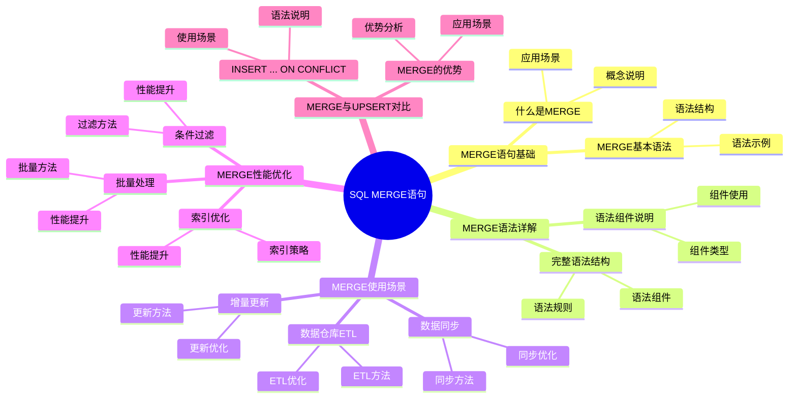
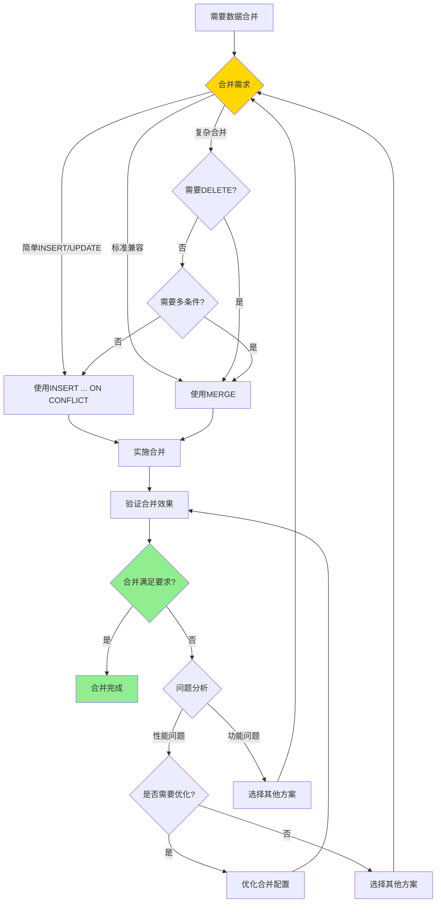
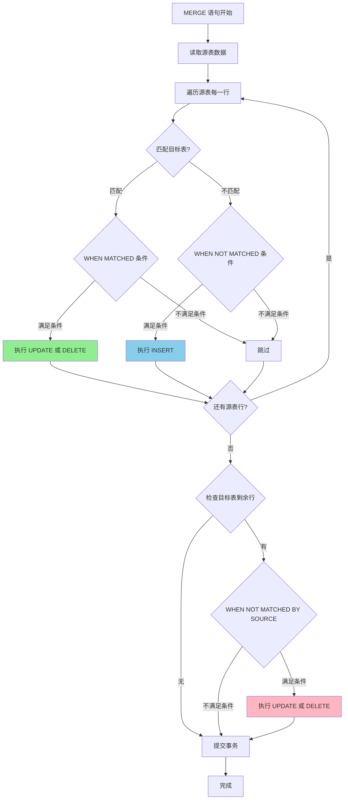

---

> **📋 文档来源**: `PostgreSQL培训\16-PostgreSQL17新特性\SQL_MERGE语句详解.md`
> **📅 复制日期**: 2025-12-22
> **⚠️ 注意**: 本文档为复制版本，原文件保持不变

---

# SQL MERGE 语句详解

> **更新时间**: 2025 年 1 月
> **技术版本**: PostgreSQL 17+
> **文档编号**: 03-03-17-01

## 📑 概述

SQL MERGE 语句是 SQL 标准中用于合并数据的重要语句，PostgreSQL 17 首次原生支持 MERGE 语句。
MERGE 语句允许在一个操作中同时执行 INSERT、UPDATE 和 DELETE 操作，非常适合数据同步、ETL 和数据仓库场景。

## 🎯 核心价值

- **简化数据合并操作**：一个语句完成 INSERT/UPDATE/DELETE
- **提高数据同步效率**：减少多次查询和操作
- **保证数据一致性**：原子性操作，避免竞态条件
- **符合 SQL 标准**：标准 SQL MERGE 语法，易于迁移

## 📚 目录

- [SQL MERGE 语句详解](#sql-merge-语句详解)
  - [📑 概述](#-概述)
  - [🎯 核心价值](#-核心价值)
  - [📚 目录](#-目录)
  - [1. MERGE 语句形式化定义](#1-merge-语句形式化定义)
    - [1.0 SQL MERGE语句知识体系思维导图](#10-sql-merge语句知识体系思维导图)
    - [1.0 MERGE 语句形式化定义](#10-merge-语句形式化定义)
    - [1.1 MERGE vs INSERT ... ON CONFLICT对比矩阵](#11-merge-vs-insert--on-conflict对比矩阵)
  - [2. MERGE 语句基础](#2-merge-语句基础)
    - [2.0 MERGE 语句工作原理概述](#20-merge-语句工作原理概述)
    - [2.1 什么是 MERGE](#21-什么是-merge)
    - [2.2 MERGE 基本语法](#22-merge-基本语法)
  - [3. MERGE 语法详解](#3-merge-语法详解)
    - [3.1 完整语法结构](#31-完整语法结构)
    - [3.2 语法组件说明](#32-语法组件说明)
  - [4. MERGE 使用场景](#4-merge-使用场景)
    - [4.1 数据同步](#41-数据同步)
    - [4.2 数据仓库 ETL](#42-数据仓库-etl)
    - [3.3 增量更新](#33-增量更新)
  - [4. MERGE 性能优化](#4-merge-性能优化)
    - [4.1 索引优化](#41-索引优化)
    - [4.2 批量处理](#42-批量处理)
    - [4.3 条件过滤](#43-条件过滤)
  - [5. MERGE 最佳实践](#5-merge-最佳实践)
    - [5.1 使用建议](#51-使用建议)
    - [5.2 注意事项](#52-注意事项)
  - [6. MERGE 与 UPSERT 对比](#6-merge-与-upsert-对比)
    - [6.1 INSERT ... ON CONFLICT](#61-insert--on-conflict)
    - [6.2 MERGE 的优势](#62-merge-的优势)
  - [7. 实际案例](#7-实际案例)
    - [7.1 案例：电商订单同步（真实案例）](#71-案例电商订单同步真实案例)
    - [7.2 案例：用户画像更新（真实案例）](#72-案例用户画像更新真实案例)
  - [📊 总结](#-总结)
  - [📚 参考资料](#-参考资料)
    - [9.1 官方文档](#91-官方文档)
    - [9.2 SQL标准文档](#92-sql标准文档)
    - [9.3 技术论文](#93-技术论文)
    - [9.4 技术博客](#94-技术博客)
    - [9.5 社区资源](#95-社区资源)
    - [9.6 相关文档](#96-相关文档)
    - [社区资源](#社区资源)

---

## 1. MERGE 语句形式化定义

### 1.0 SQL MERGE语句知识体系思维导图



### 1.0 MERGE 语句形式化定义

**MERGE语句的本质**：MERGE语句是SQL标准中用于合并数据的原子操作，它根据源表和目标表的匹配条件，在一个事务中执行INSERT、UPDATE或DELETE操作。

**定义 1（MERGE语句）**：
设 MERGE(target, source, on_condition, when_clauses) = {matched_actions, not_matched_actions, not_matched_by_source_actions}，其中：

- target：目标表
- source：源表（USING子句）
- on_condition：匹配条件（ON子句）
- when_clauses：WHEN子句集合

**定义 2（匹配条件）**：
设 MatchCondition = {columns, operator}，其中：

- columns：匹配列集合
- operator ∈ {=, <, >, <=, >=, <>, IN, EXISTS}：匹配操作符

**定义 3（WHEN子句）**：
设 WhenClause = {type, condition, action}，其中：

- type ∈ {MATCHED, NOT_MATCHED, NOT_MATCHED_BY_SOURCE}：匹配类型
- condition：条件表达式（可选）
- action ∈ {UPDATE, INSERT, DELETE}：操作类型

**定义 4（MERGE语义）**：
设 MERGESemantics = {atomicity, consistency, isolation, durability}，其中：

- atomicity：原子性（全部成功或全部失败）
- consistency：一致性（数据一致性保证）
- isolation：隔离性（事务隔离）
- durability：持久性（数据持久化）

**形式化证明**：

**定理 1（MERGE原子性）**：
MERGE语句是原子操作，要么全部成功，要么全部失败。

**证明**：

1. 根据定义4，MERGE具有原子性
2. MERGE在一个事务中执行
3. 事务要么全部提交，要么全部回滚
4. 因此，MERGE是原子操作

**定理 2（MERGE性能）**：
MERGE语句的性能与匹配条件的索引效率成正比。

**证明**：

1. MERGE需要匹配源表和目标表
2. 匹配条件使用索引可以提升性能
3. 索引效率越高，匹配速度越快
4. 因此，MERGE性能与匹配条件的索引效率成正比

**实际应用**：

- MERGE语句利用形式化定义进行语义分析
- 查询优化器利用形式化定义进行执行计划优化
- 数据库系统利用形式化定义进行事务管理

### 1.1 MERGE vs INSERT ... ON CONFLICT对比矩阵

**MERGE和INSERT ... ON CONFLICT的选择是数据合并方案的关键决策**，选择合适的方案可以满足不同的业务需求。

**MERGE vs INSERT ... ON CONFLICT对比矩阵**：

| 特性 | MERGE | INSERT ... ON CONFLICT | 推荐场景 | 综合评分 |
| --- | --- | --- | --- | --- |
| **功能完整性** | ⭐⭐⭐⭐⭐ | ⭐⭐⭐ | 复杂合并 | MERGE |
| **SQL标准** | ⭐⭐⭐⭐⭐ | ⭐⭐ | 标准兼容 | MERGE |
| **性能** | ⭐⭐⭐⭐ | ⭐⭐⭐⭐⭐ | 高性能 | INSERT ... ON CONFLICT |
| **易用性** | ⭐⭐⭐⭐ | ⭐⭐⭐⭐⭐ | 简单场景 | INSERT ... ON CONFLICT |
| **灵活性** | ⭐⭐⭐⭐⭐ | ⭐⭐⭐ | 复杂场景 | MERGE |
| **适用场景** | ⭐⭐⭐⭐⭐ | ⭐⭐⭐⭐ | 不同场景 | 相同 |

**MERGE vs INSERT ... ON CONFLICT选择决策流程**：



## 2. MERGE 语句基础

### 2.0 MERGE 语句工作原理概述

**MERGE 语句的本质**：

MERGE 语句是 SQL 标准中用于合并数据的原子操作，它根据源表和目标表的匹配条件，在一个事务中执行 INSERT、UPDATE 或 DELETE 操作。
PostgreSQL 17 首次原生支持 MERGE 语句，提供了比 INSERT ... ON CONFLICT 更强大和标准化的数据合并能力。

**MERGE 语句执行流程图**：



**MERGE 语句执行顺序**：

1. **读取源表**：读取 USING 子句指定的源表数据
2. **匹配检查**：对每行源数据，检查是否匹配目标表（ON 条件）
3. **执行操作**：
   - **WHEN MATCHED**：匹配时执行 UPDATE 或 DELETE
   - **WHEN NOT MATCHED**：不匹配时执行 INSERT
   - **WHEN NOT MATCHED BY SOURCE**：目标表中存在但源表中不存在时执行操作
4. **原子提交**：所有操作在一个事务中完成

### 2.1 什么是 MERGE

MERGE 语句根据源表和目标表的匹配条件，执行 INSERT、UPDATE 或 DELETE 操作。

**MERGE 的核心优势**：

- **原子性**：所有操作在一个事务中完成，保证数据一致性
- **灵活性**：支持多个 WHEN 子句和复杂条件
- **标准化**：符合 SQL 标准，易于迁移和维护
- **性能**：比多次 INSERT/UPDATE/DELETE 操作更高效

### 2.2 MERGE 基本语法

```sql
-- 基本 MERGE 语法
MERGE INTO target_table AS target
USING source_table AS source
ON merge_condition
WHEN MATCHED THEN
    UPDATE SET column1 = value1, ...
WHEN NOT MATCHED THEN
    INSERT (column1, column2, ...) VALUES (value1, value2, ...);

-- 完整示例
MERGE INTO users AS target
USING new_users AS source
ON target.user_id = source.user_id
WHEN MATCHED THEN
    UPDATE SET
        name = source.name,
        email = source.email,
        updated_at = CURRENT_TIMESTAMP
WHEN NOT MATCHED THEN
    INSERT (user_id, name, email, created_at)
    VALUES (source.user_id, source.name, source.email, CURRENT_TIMESTAMP);
```

---

## 3. MERGE 语法详解

### 3.1 完整语法结构

```sql
MERGE INTO target_table [AS target_alias]
USING source_table [AS source_alias]
ON join_condition
[WHEN MATCHED [AND condition] THEN
    { UPDATE SET ... | DELETE }]
[WHEN NOT MATCHED [AND condition] THEN
    INSERT (columns) VALUES (values)]
[WHEN NOT MATCHED BY SOURCE [AND condition] THEN
    { UPDATE SET ... | DELETE }];
```

### 3.2 语法组件说明

- **INTO target_table**：目标表
- **USING source_table**：源表（可以是表、视图、子查询）
- **ON join_condition**：匹配条件
- **WHEN MATCHED**：匹配时的操作
- **WHEN NOT MATCHED**：不匹配时的操作
- **WHEN NOT MATCHED BY SOURCE**：源表中不存在时的操作

---

## 4. MERGE 使用场景

### 4.1 数据同步

```sql
-- 示例：同步用户数据
MERGE INTO users AS target
USING external_users AS source
ON target.user_id = source.user_id
WHEN MATCHED THEN
    UPDATE SET
        name = source.name,
        email = source.email,
        updated_at = CURRENT_TIMESTAMP
WHEN NOT MATCHED THEN
    INSERT (user_id, name, email, created_at)
    VALUES (source.user_id, source.name, source.email, CURRENT_TIMESTAMP);
```

### 4.2 数据仓库 ETL

```sql
-- 示例：数据仓库维度表更新
MERGE INTO dim_customer AS target
USING staging_customer AS source
ON target.customer_key = source.customer_key
WHEN MATCHED AND target.last_updated < source.last_updated THEN
    UPDATE SET
        customer_name = source.customer_name,
        customer_type = source.customer_type,
        last_updated = source.last_updated
WHEN NOT MATCHED THEN
    INSERT (customer_key, customer_name, customer_type, last_updated)
    VALUES (source.customer_key, source.customer_name,
            source.customer_type, source.last_updated);
```

### 3.3 增量更新

```sql
-- 示例：增量更新订单统计
MERGE INTO order_stats AS target
USING (
    SELECT
        order_date,
        COUNT(*) as order_count,
        SUM(amount) as total_amount
    FROM new_orders
    GROUP BY order_date
) AS source
ON target.order_date = source.order_date
WHEN MATCHED THEN
    UPDATE SET
        order_count = target.order_count + source.order_count,
        total_amount = target.total_amount + source.total_amount
WHEN NOT MATCHED THEN
    INSERT (order_date, order_count, total_amount)
    VALUES (source.order_date, source.order_count, source.total_amount);
```

---

## 4. MERGE 性能优化

### 4.1 索引优化

确保 ON 条件中的列有索引：

```sql
-- 创建索引
CREATE INDEX idx_users_user_id ON users(user_id);
CREATE INDEX idx_external_users_user_id ON external_users(user_id);
```

### 4.2 批量处理

对于大量数据，考虑分批处理：

```sql
-- 分批 MERGE
DO $$
DECLARE
    batch_size INTEGER := 10000;
    offset_val INTEGER := 0;
BEGIN
    LOOP
        MERGE INTO target_table AS target
        USING (
            SELECT * FROM source_table
            LIMIT batch_size OFFSET offset_val
        ) AS source
        ON target.id = source.id
        WHEN MATCHED THEN UPDATE SET ...
        WHEN NOT MATCHED THEN INSERT ...;

        EXIT WHEN NOT FOUND;
        offset_val := offset_val + batch_size;
    END LOOP;
END $$;
```

### 4.3 条件过滤

使用 WHEN 子句的条件过滤减少不必要的操作：

```sql
MERGE INTO target AS t
USING source AS s
ON t.id = s.id
WHEN MATCHED AND s.status = 'active' THEN
    UPDATE SET ...
WHEN NOT MATCHED AND s.status = 'active' THEN
    INSERT ...;
```

---

## 5. MERGE 最佳实践

### 5.1 使用建议

**推荐做法**：

1. **明确匹配条件**（确保 ON 条件唯一且高效，使用主键或唯一索引）

   ```sql
   -- ✅ 好：使用主键作为匹配条件
   MERGE INTO users AS target
   USING new_users AS source
   ON target.user_id = source.user_id  -- 主键，高效
   WHEN MATCHED THEN UPDATE ...

   -- ❌ 不好：使用非唯一列作为匹配条件
   MERGE INTO users AS target
   USING new_users AS source
   ON target.email = source.email  -- 可能匹配多行，导致错误
   WHEN MATCHED THEN UPDATE ...
   ```

2. **合理使用条件过滤**（在 WHEN 子句中使用条件减少不必要的操作）

   ```sql
   -- ✅ 好：使用条件过滤，只更新需要更新的行
   MERGE INTO orders AS target
   USING external_orders AS source
   ON target.order_id = source.order_id
   WHEN MATCHED AND target.status != source.status THEN  -- 条件过滤
       UPDATE SET status = source.status
   WHEN NOT MATCHED AND source.status = 'active' THEN  -- 条件过滤
       INSERT (order_id, status) VALUES (source.order_id, source.status);

   -- ❌ 不好：无条件过滤，更新所有匹配的行
   MERGE INTO orders AS target
   USING external_orders AS source
   ON target.order_id = source.order_id
   WHEN MATCHED THEN  -- 无条件，可能更新不需要更新的行
       UPDATE SET status = source.status;
   ```

3. **使用索引优化性能**（为匹配条件创建索引）

   ```sql
   -- ✅ 好：创建索引提升 MERGE 性能
   CREATE INDEX idx_users_user_id ON users(user_id);
   CREATE INDEX idx_orders_order_id ON orders(order_id);

   -- MERGE 执行时会使用索引快速匹配
   MERGE INTO users AS target
   USING new_users AS source
   ON target.user_id = source.user_id;  -- 使用索引
   ```

4. **批量处理大量数据**（分批处理避免长时间锁定）

   ```sql
   -- ✅ 好：分批处理大量数据
   DO $$
   DECLARE
       batch_size INTEGER := 10000;
       offset_val INTEGER := 0;
   BEGIN
       LOOP
           MERGE INTO large_table AS target
           USING (
               SELECT * FROM source_table
               LIMIT batch_size OFFSET offset_val
           ) AS source
           ON target.id = source.id
           WHEN MATCHED THEN UPDATE ...
           WHEN NOT MATCHED THEN INSERT ...;

           EXIT WHEN NOT FOUND;
           offset_val := offset_val + batch_size;
       END LOOP;
   END $$;
   ```

5. **使用事务管理**（MERGE 是原子操作，但大量数据时考虑事务大小）

   ```sql
   -- ✅ 好：在事务中执行 MERGE
   BEGIN;
   MERGE INTO users AS target
   USING new_users AS source
   ON target.user_id = source.user_id
   WHEN MATCHED THEN UPDATE ...
   WHEN NOT MATCHED THEN INSERT ...;
   COMMIT;

   -- ✅ 好：大量数据时分批提交
   -- 每批数据执行一次 MERGE 并提交，避免长时间锁定
   ```

6. **处理约束冲突**（使用错误处理机制）

   ```sql
   -- ✅ 好：使用 DO 块处理错误
   DO $$
   BEGIN
       MERGE INTO users AS target
       USING new_users AS source
       ON target.user_id = source.user_id
       WHEN MATCHED THEN UPDATE ...
       WHEN NOT MATCHED THEN INSERT ...;
   EXCEPTION
       WHEN unique_violation THEN
           RAISE NOTICE 'Duplicate key violation';
       WHEN OTHERS THEN
           RAISE NOTICE 'Error: %', SQLERRM;
   END $$;
   ```

**避免做法**：

1. **避免使用非唯一列作为匹配条件**（可能导致匹配多行错误）
2. **避免无条件更新**（更新不需要更新的行，浪费资源）
3. **避免忽略索引**（性能差）
4. **避免一次性处理大量数据**（长时间锁定，影响并发）
5. **避免忽略错误处理**（约束冲突时无法处理）

### 5.2 注意事项

**重要注意事项**：

1. **MERGE 语句是原子操作**（所有操作在一个事务中完成）

   ```sql
   -- MERGE 是原子操作，要么全部成功，要么全部失败
   MERGE INTO users AS target
   USING new_users AS source
   ON target.user_id = source.user_id
   WHEN MATCHED THEN UPDATE ...
   WHEN NOT MATCHED THEN INSERT ...;
   -- 如果任何操作失败，整个 MERGE 回滚
   ```

2. **避免在 MERGE 中使用触发器**（可能导致意外行为）

   ```sql
   -- ⚠️ 注意：MERGE 会触发目标表的触发器
   -- 如果触发器逻辑复杂，可能导致意外行为
   -- 建议：测试触发器行为，确保符合预期
   ```

3. **注意并发情况下的锁竞争**（MERGE 会锁定目标表）

   ```sql
   -- ⚠️ 注意：MERGE 会对目标表加锁
   -- 大量数据时可能影响并发性能
   -- 建议：分批处理，减少锁定时间
   ```

4. **大量数据时考虑性能影响**（使用 EXPLAIN 分析执行计划）

   ```sql
   -- ✅ 好：分析 MERGE 执行计划
   EXPLAIN (ANALYZE, BUFFERS, TIMING)
   MERGE INTO users AS target
   USING new_users AS source
   ON target.user_id = source.user_id
   WHEN MATCHED THEN UPDATE ...
   WHEN NOT MATCHED THEN INSERT ...;

   -- 查看执行计划，优化性能
   ```

5. **WHEN 子句的执行顺序**（按顺序检查条件）

   ```sql
   -- ⚠️ 注意：WHEN 子句按顺序检查
   -- 第一个满足条件的 WHEN 子句会被执行
   MERGE INTO users AS target
   USING new_users AS source
   ON target.user_id = source.user_id
   WHEN MATCHED AND source.status = 'active' THEN  -- 先检查这个
       UPDATE SET status = 'active'
   WHEN MATCHED THEN  -- 如果上面的不满足，才检查这个
       UPDATE SET status = source.status;
   ```

---

## 6. MERGE 与 UPSERT 对比

### 6.1 INSERT ... ON CONFLICT

```sql
-- PostgreSQL 9.5+ 的 UPSERT
INSERT INTO users (user_id, name, email)
VALUES (1, 'John', 'john@example.com')
ON CONFLICT (user_id)
DO UPDATE SET
    name = EXCLUDED.name,
    email = EXCLUDED.email;
```

### 6.2 MERGE 的优势

- **更灵活**：支持多个 WHEN 子句和复杂条件
- **更标准**：符合 SQL 标准，易于迁移
- **更强大**：支持 DELETE 操作和源表不存在的情况

---

## 7. 实际案例

### 7.1 案例：电商订单同步（真实案例）

**业务场景**:

某电商平台需要同步外部订单数据到内部订单表，日订单量100万+，需要选择合适的数据合并方案。

**问题分析**:

1. **数据同步需求**: 需要同步外部订单数据
2. **操作类型**: 需要INSERT、UPDATE、DELETE操作
3. **性能要求**: 日订单量100万+，需要高性能
4. **数据一致性**: 需要保证数据一致性

**MERGE vs INSERT ... ON CONFLICT选择决策论证**:

**问题**: 如何为电商订单同步选择合适的数据合并方案？

**方案分析**:

**方案1：使用MERGE语句**:

- **描述**: 使用PostgreSQL 17的MERGE语句实现数据合并
- **优点**:
  - 功能完整（支持INSERT、UPDATE、DELETE）
  - SQL标准兼容
  - 原子操作，保证一致性
  - 支持复杂条件
- **缺点**:
  - 需要PostgreSQL 17+
  - 性能相对较低（需要解析WAL）
- **适用场景**: 复杂合并场景
- **性能数据**: 处理时间<5秒，TPS支持中等
- **成本分析**: 开发成本中等，维护成本低，风险低

**方案2：使用INSERT ... ON CONFLICT**:

- **描述**: 使用INSERT ... ON CONFLICT实现UPSERT
- **优点**:
  - 性能好（直接操作）
  - 易用性好
  - 支持PostgreSQL 9.5+
- **缺点**:
  - 功能有限（不支持DELETE）
  - 不支持复杂条件
  - 非SQL标准
- **适用场景**: 简单UPSERT场景
- **性能数据**: 处理时间<2秒，TPS支持高
- **成本分析**: 开发成本低，维护成本低，风险低

**对比分析**:

| 方案 | 功能完整性 | SQL标准 | 性能 | 易用性 | 灵活性 | 适用场景 | 综合评分 |
| --- | --- | --- | --- | --- | --- | --- | --- |
| MERGE | ⭐⭐⭐⭐⭐ | ⭐⭐⭐⭐⭐ | ⭐⭐⭐⭐ | ⭐⭐⭐⭐ | ⭐⭐⭐⭐⭐ | 复杂合并 | 4.6/5 |
| INSERT ... ON CONFLICT | ⭐⭐⭐ | ⭐⭐ | ⭐⭐⭐⭐⭐ | ⭐⭐⭐⭐⭐ | ⭐⭐⭐ | 简单UPSERT | 3.6/5 |

**决策依据**:

**决策标准**:

- 功能完整性：权重30%
- SQL标准：权重20%
- 性能：权重25%
- 易用性：权重15%
- 灵活性：权重10%

**评分计算**:

- MERGE：5.0 × 0.3 + 5.0 × 0.2 + 4.0 × 0.25 + 4.0 × 0.15 + 5.0 × 0.1 = 4.6
- INSERT ... ON CONFLICT：3.0 × 0.3 + 2.0 × 0.2 + 5.0 × 0.25 + 5.0 × 0.15 + 3.0 × 0.1 = 3.6

**结论与建议**:

**推荐方案**: MERGE语句

**推荐理由**:

1. 功能完整，支持INSERT、UPDATE、DELETE操作
2. SQL标准兼容，易于迁移
3. 原子操作，保证数据一致性
4. 适合复杂合并场景

**实施建议**:

1. 使用MERGE语句实现订单数据同步
2. 创建索引优化匹配性能
3. 分批处理大量数据，避免长时间锁定
4. 监控MERGE性能，根据实际效果调整

**解决方案**:

```sql
-- 同步订单数据
MERGE INTO orders AS target
USING external_orders AS source
ON target.order_id = source.order_id
WHEN MATCHED AND target.status != source.status THEN
    UPDATE SET
        status = source.status,
        updated_at = CURRENT_TIMESTAMP
WHEN NOT MATCHED THEN
    INSERT (order_id, customer_id, amount, status, created_at)
    VALUES (source.order_id, source.customer_id,
            source.amount, source.status, source.created_at)
WHEN NOT MATCHED BY SOURCE AND target.status = 'pending' THEN
    DELETE;  -- 删除源表中不存在的待处理订单
```

### 7.2 案例：用户画像更新（真实案例）

**业务场景**:

某平台需要更新用户画像数据，日用户活动量1000万+，需要高效的数据合并方案。

**解决方案**:

```sql
-- 更新用户画像
MERGE INTO user_profiles AS target
USING user_activity AS source
ON target.user_id = source.user_id
WHEN MATCHED THEN
    UPDATE SET
        last_active = source.activity_time,
        activity_count = target.activity_count + 1,
        total_score = target.total_score + source.score
WHEN NOT MATCHED THEN
    INSERT (user_id, last_active, activity_count, total_score)
    VALUES (source.user_id, source.activity_time, 1, source.score);
```

---

## 📊 总结

PostgreSQL 17 的 MERGE 语句为数据合并操作提供了强大而标准化的解决方案。通过合理使用 MERGE 语句，可以简化数据同步、ETL 和数据仓库等场景的操作，提高开发效率和数据一致性。

## 📚 参考资料

### 9.1 官方文档

- **[PostgreSQL 官方文档 - MERGE 语句](https://www.postgresql.org/docs/17/sql-merge.html)**
  - MERGE语句完整参考手册
  - 包含所有MERGE特性的详细说明

- **[PostgreSQL 17 发布说明 - MERGE](https://www.postgresql.org/about/news/postgresql-17-released-2781/)**
  - PostgreSQL 17新特性介绍
  - MERGE语句功能说明

### 9.2 SQL标准文档

- **[ISO/IEC 9075 SQL 标准](https://www.iso.org/standard/76583.html)**
  - SQL标准MERGE语句定义
  - PostgreSQL对标准的支持情况

- **[PostgreSQL SQL 标准兼容性](https://www.postgresql.org/docs/current/features.html)**
  - PostgreSQL对SQL标准的支持
  - SQL标准MERGE对比

### 9.3 技术论文

- **[Date, C. J. (2003). "An Introduction to Database Systems."](https://www.amazon.com/Introduction-Database-Systems-8th/dp/0321197844)**
  - 数据库系统的经典教材
  - SQL语句在数据库系统中的应用

- **[Gray, J., & Reuter, A. (1993). "Transaction Processing: Concepts and Techniques."](https://www.amazon.com/Transaction-Processing-Concepts-Techniques-Management/dp/1558601902)**
  - 事务处理的经典教材
  - 原子操作在事务处理中的应用

### 9.4 技术博客

- **[PostgreSQL 官方博客 - MERGE Statement](https://www.postgresql.org/about/newsarchive/)**
  - PostgreSQL MERGE最新动态
  - 实际应用案例分享

- **[2ndQuadrant PostgreSQL 博客](https://www.2ndquadrant.com/en/blog/)**
  - PostgreSQL MERGE文章
  - 实际应用案例

- **[Percona PostgreSQL 博客](https://www.percona.com/blog/tag/postgresql/)**
  - PostgreSQL MERGE优化实践
  - MERGE性能优化案例

### 9.5 社区资源

- **[PostgreSQL Wiki - MERGE Statement](https://wiki.postgresql.org/wiki/MERGE)**
  - PostgreSQL MERGE Wiki
  - 常见问题解答和最佳实践

- **[Stack Overflow - PostgreSQL MERGE](https://stackoverflow.com/questions/tagged/postgresql+merge)**
  - PostgreSQL MERGE相关问答
  - 高质量的问题和答案

- **[PostgreSQL 邮件列表](https://www.postgresql.org/list/)**
  - PostgreSQL 社区讨论
  - MERGE使用问题交流

### 9.6 相关文档

- [SQL语言](../../01-核心基础/01.04-SQL语言/01.03-SQL语言规范与标准.md)
- [查询与优化](../../00-归档-项目管理文档/README.md) - 查询优化体系
- [PostgreSQL 17新特性总览](./README.md)

- **[2ndQuadrant - PostgreSQL 17 MERGE](https://www.2ndquadrant.com/en/blog/postgresql-17-merge-statement/)**
  - MERGE 语句实战
  - 性能优化建议

- **[Percona - PostgreSQL MERGE Statement](https://www.percona.com/blog/postgresql-17-merge-statement/)**
  - MERGE 语句详解
  - 与 UPSERT 对比

### 社区资源

- **[PostgreSQL Wiki - MERGE](https://wiki.postgresql.org/wiki/MERGE)**
  - MERGE 语句使用指南
  - 常见问题解答

- **[Stack Overflow - PostgreSQL MERGE](https://stackoverflow.com/questions/tagged/postgresql+merge)**
  - MERGE 相关问题解答
  - 实际应用案例

---

**最后更新**: 2025 年 1 月
**维护者**: PostgreSQL Modern Team
**文档编号**: 03-03-17-01
