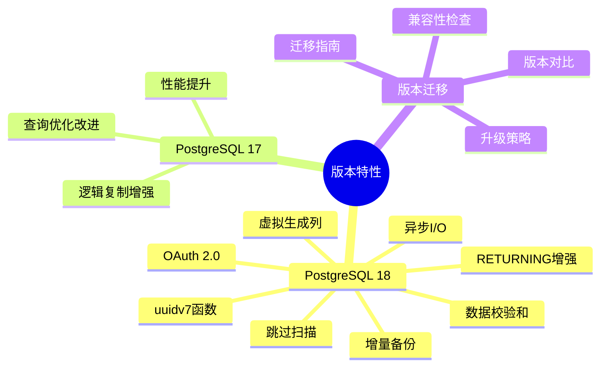
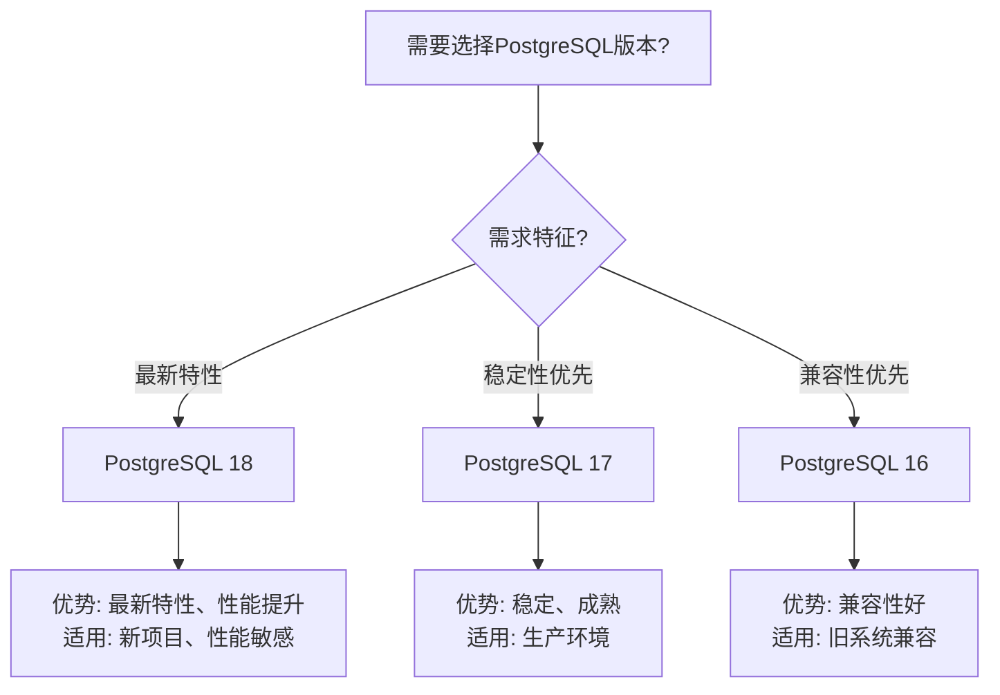

---

> **📋 文档来源**: `PostgreSQL\02-版本特性\README.md`
> **📅 复制日期**: 2025-12-22
> **⚠️ 注意**: 本文档为复制版本，原文件保持不变

---

# 18-版本特性

> **文档总数**: 30+个文档
> **覆盖领域**: PostgreSQL 18新特性、PostgreSQL 17新特性、版本对比与迁移
> **版本覆盖**: PostgreSQL 18.x (推荐) ⭐ | 17.x (推荐) | 16.x (兼容)
> **最后更新**: 2025年1月
> **文档状态**: ✅ 所有文档已完成

---

## 📊 知识体系思维导图

---

## 📋 文档列表

### 版本特性

1. **[PostgreSQL 18新特性](./02.01-PostgreSQL-18-新特性.md)** ⭐⭐⭐⭐⭐
   - PostgreSQL 18最新特性详解
   - 异步I/O、虚拟生成列、并行查询增强
   - 增量备份、OAuth 2.0认证等

2. **[PostgreSQL 17新特性速查](./02.02-PostgreSQL-17-新特性速查.md)** ⭐⭐⭐⭐
   - PostgreSQL 17新特性快速参考
   - 重要功能和使用指南

3. **[版本对比与迁移指南](./02.03-版本对比与迁移指南.md)** ⭐⭐⭐⭐
   - 版本对比分析
   - 迁移指南和注意事项
   - 兼容性说明

---

## 📊 PostgreSQL版本选型决策树

---

## 📊 PostgreSQL版本对比矩阵

| 版本 | 发布时间 | 新特性 | 性能提升 | 稳定性 | 推荐度 |
| --- | --- | --- | --- | --- | --- |
| **PostgreSQL 18** | 2024-09 | ⭐⭐⭐⭐⭐ | ⭐⭐⭐⭐⭐ | ⭐⭐⭐⭐ | ⭐⭐⭐⭐⭐ 推荐 |
| **PostgreSQL 17** | 2023-09 | ⭐⭐⭐⭐ | ⭐⭐⭐⭐ | ⭐⭐⭐⭐⭐ | ⭐⭐⭐⭐⭐ 推荐 |
| **PostgreSQL 16** | 2023-09 | ⭐⭐⭐ | ⭐⭐⭐ | ⭐⭐⭐⭐⭐ | ⭐⭐⭐⭐ 兼容 |

---

## 🔗 相关文档

### 核心基础

- [系统架构与设计原理](../01-核心基础/01.02-系统架构/01.01-系统架构与设计原理.md) - 系统架构基础
- [存储管理与数据持久化](../04-存储与恢复/01.06-存储管理与数据持久化.md) - 存储管理

### 查询与优化

- [查询优化器原理](../02-查询与优化/02.01-查询优化器/02.01-查询优化器原理.md) - 查询优化基础
- [并行查询处理](../02-查询与优化/02.05-并行查询/02.05-并行查询处理.md) - 并行查询

### 数据模型设计

- [数据模型设计](../17-数据模型设计/README.md) - 数据建模实践

### 存储与恢复

- [备份与恢复](../04-存储与恢复/备份与恢复.md) - 备份恢复实践
- [增量备份与恢复](../13-高可用架构/备份与恢复/06.07-增量备份与恢复.md) - 增量备份实践

### 版本特性1

- [PostgreSQL 18新特性](./02.01-PostgreSQL-18-新特性.md) - PostgreSQL 18特性

---

**维护者**: Documentation Team
**最后更新**: 2025-11-22
