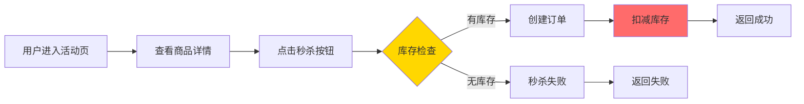

---

> **📋 文档来源**: `DataBaseTheory\19-场景案例库\01-电商秒杀系统\01-需求分析.md`
> **📅 复制日期**: 2025-12-22
> **⚠️ 注意**: 本文档为复制版本，原文件保持不变

---

# 电商秒杀系统 - 需求分析

> **案例类型**: 高并发OLTP系统
> **难度等级**: ⭐⭐⭐⭐⭐ (高级)
> **PostgreSQL版本**: 18.x
> **创建日期**: 2025-12-04

---

## 📋 目录

- [电商秒杀系统 - 需求分析](#电商秒杀系统---需求分析)
  - [📋 目录](#-目录)
  - [一、业务背景](#一业务背景)
    - [1.1 场景描述](#11-场景描述)
    - [1.2 业务流程](#12-业务流程)
    - [1.3 数据模型](#13-数据模型)
  - [二、核心需求](#二核心需求)
    - [2.1 功能需求](#21-功能需求)
    - [2.2 非功能需求](#22-非功能需求)
    - [2.3 业务规则](#23-业务规则)
  - [三、性能指标](#三性能指标)
    - [3.1 压力测试目标](#31-压力测试目标)
    - [3.2 数据量级](#32-数据量级)
  - [四、技术挑战](#四技术挑战)
    - [4.1 数据库层面挑战](#41-数据库层面挑战)
      - [挑战1：高并发写冲突](#挑战1高并发写冲突)
      - [挑战2：库存超卖](#挑战2库存超卖)
      - [挑战3：数据库连接耗尽](#挑战3数据库连接耗尽)
      - [挑战4：慢查询拖垮系统](#挑战4慢查询拖垮系统)
    - [4.2 应用层面挑战](#42-应用层面挑战)
    - [4.3 系统层面挑战](#43-系统层面挑战)
  - [五、系统约束](#五系统约束)
    - [5.1 硬件约束](#51-硬件约束)
    - [5.2 软件约束](#52-软件约束)
    - [5.3 业务约束](#53-业务约束)
  - [六、设计目标](#六设计目标)
    - [6.1 性能目标](#61-性能目标)
    - [6.2 架构目标](#62-架构目标)
    - [6.3 PostgreSQL优化目标](#63-postgresql优化目标)

---

## 一、业务背景

### 1.1 场景描述

**电商秒杀活动**是典型的高并发、瞬时流量场景：

- **活动特点**：限时、限量、超低价
- **用户行为**：同一时刻大量用户抢购
- **数据特征**：读多写少、热点数据

**典型场景**：

```text
09:59:50  - 10万用户在线等待
10:00:00  - 活动开始，10万用户同时点击"立即购买"
10:00:01  - 1000件商品被抢光（QPS峰值达到10万）
10:00:10  - 订单确认，后续处理
```

### 1.2 业务流程



### 1.3 数据模型

**核心表结构**：

```sql
-- 商品表（带错误处理）
DO $$
BEGIN
    BEGIN
        IF NOT EXISTS (SELECT 1 FROM information_schema.tables WHERE table_schema = 'public' AND table_name = 'products') THEN
            CREATE TABLE products (
                product_id BIGSERIAL PRIMARY KEY,
                name VARCHAR(200) NOT NULL,
                normal_price DECIMAL(10,2),
                description TEXT,
                created_at TIMESTAMPTZ DEFAULT NOW()
            );
            RAISE NOTICE '商品表 products 创建成功';
        ELSE
            RAISE NOTICE '商品表 products 已存在';
        END IF;
    EXCEPTION
        WHEN duplicate_table THEN
            RAISE NOTICE '商品表已存在';
        WHEN OTHERS THEN
            RAISE WARNING '创建商品表失败: %', SQLERRM;
            RAISE;
    END;
END $$;

-- 秒杀活动表（带错误处理）
DO $$
BEGIN
    BEGIN
        IF NOT EXISTS (SELECT 1 FROM information_schema.tables WHERE table_schema = 'public' AND table_name = 'flash_sales') THEN
            CREATE TABLE flash_sales (
                sale_id BIGSERIAL PRIMARY KEY,
                product_id BIGINT NOT NULL REFERENCES products(product_id),
                flash_price DECIMAL(10,2) NOT NULL,
                total_stock INT NOT NULL,
                remaining_stock INT NOT NULL,
                start_time TIMESTAMPTZ NOT NULL,
                end_time TIMESTAMPTZ NOT NULL,
                status VARCHAR(20) DEFAULT 'pending',
                version INT DEFAULT 0,  -- 乐观锁版本号
                created_at TIMESTAMPTZ DEFAULT NOW(),
                updated_at TIMESTAMPTZ DEFAULT NOW()
            );
            RAISE NOTICE '秒杀活动表 flash_sales 创建成功';
        ELSE
            RAISE NOTICE '秒杀活动表 flash_sales 已存在';
        END IF;
    EXCEPTION
        WHEN duplicate_table THEN
            RAISE NOTICE '秒杀活动表已存在';
        WHEN OTHERS THEN
            RAISE WARNING '创建秒杀活动表失败: %', SQLERRM;
            RAISE;
    END;
END $$;

-- 秒杀订单表（带错误处理）
DO $$
BEGIN
    BEGIN
        IF NOT EXISTS (SELECT 1 FROM information_schema.tables WHERE table_schema = 'public' AND table_name = 'flash_orders') THEN
            CREATE TABLE flash_orders (
                order_id BIGSERIAL PRIMARY KEY,
                sale_id BIGINT NOT NULL REFERENCES flash_sales(sale_id),
                user_id BIGINT NOT NULL,
                product_id BIGINT NOT NULL,
                price DECIMAL(10,2) NOT NULL,
                status VARCHAR(20) DEFAULT 'pending',
                created_at TIMESTAMPTZ DEFAULT NOW(),
                paid_at TIMESTAMPTZ,
                UNIQUE(sale_id, user_id)  -- 一人只能抢一次
            );
            RAISE NOTICE '秒杀订单表 flash_orders 创建成功';
        ELSE
            RAISE NOTICE '秒杀订单表 flash_orders 已存在';
        END IF;
    EXCEPTION
        WHEN duplicate_table THEN
            RAISE NOTICE '秒杀订单表已存在';
        WHEN OTHERS THEN
            RAISE WARNING '创建秒杀订单表失败: %', SQLERRM;
            RAISE;
    END;
END $$;

-- 用户表（简化，带错误处理）
DO $$
BEGIN
    BEGIN
        IF NOT EXISTS (SELECT 1 FROM information_schema.tables WHERE table_schema = 'public' AND table_name = 'users') THEN
            CREATE TABLE users (
                user_id BIGSERIAL PRIMARY KEY,
                username VARCHAR(50) NOT NULL UNIQUE,
                email VARCHAR(100),
                created_at TIMESTAMPTZ DEFAULT NOW()
            );
            RAISE NOTICE '用户表 users 创建成功';
        ELSE
            RAISE NOTICE '用户表 users 已存在';
        END IF;
    EXCEPTION
        WHEN duplicate_table THEN
            RAISE NOTICE '用户表已存在';
        WHEN OTHERS THEN
            RAISE WARNING '创建用户表失败: %', SQLERRM;
            RAISE;
    END;
END $$;
```

---

## 二、核心需求

### 2.1 功能需求

| 需求ID | 需求描述 | 优先级 |
| --- | --- | --- |
| FR-01 | 支持商品秒杀抢购 | P0 |
| FR-02 | 实时库存扣减 | P0 |
| FR-03 | 防止超卖 | P0 |
| FR-04 | 用户限购（一人一件） | P0 |
| FR-05 | 订单生成 | P0 |
| FR-06 | 库存回滚（未支付订单） | P1 |
| FR-07 | 秒杀日志记录 | P1 |
| FR-08 | 实时监控统计 | P1 |

### 2.2 非功能需求

| 需求类型 | 具体要求 | 度量指标 |
| --- | --- | --- |
| **性能** | 高并发处理能力 | QPS > 10万 |
| **响应时间** | 快速响应 | P95 < 100ms, P99 < 500ms |
| **可用性** | 高可用 | 99.99%可用性 |
| **一致性** | 强一致性 | 绝对不能超卖 |
| **可扩展性** | 水平扩展 | 支持读写分离、分片 |

### 2.3 业务规则

1. **库存规则**
   - 扣减库存必须原子性操作
   - 库存不能为负数
   - 扣减失败立即返回

2. **用户规则**
   - 一个用户只能抢购一次
   - 已抢购用户重复请求直接返回
   - 未登录用户不能参与

3. **时间规则**
   - 活动开始前不能抢购
   - 活动结束后不能抢购
   - 未支付订单30分钟后释放库存

4. **数据一致性**
   - 订单创建和库存扣减必须在同一事务
   - 使用乐观锁或悲观锁防止并发问题
   - 支持幂等性（重复请求不重复扣库存）

---

## 三、性能指标

### 3.1 压力测试目标

**测试场景1：正常秒杀**:

| 指标 | 目标值 | 测试方法 |
| --- | --- | --- |
| 并发用户数 | 10万 | JMeter模拟 |
| QPS | >5万 | 秒杀开始瞬间 |
| TPS | >2万 | 成功交易数/秒 |
| 响应时间(P95) | <100ms | 95%请求 |
| 响应时间(P99) | <500ms | 99%请求 |
| 错误率 | <0.01% | 非库存不足错误 |
| 超卖率 | 0% | 绝对不允许 |

**测试场景2：极限压力**:

| 指标 | 目标值 | 说明 |
| --- | --- | --- |
| 并发用户数 | 50万 | 极限场景 |
| QPS | >10万 | 峰值 |
| 系统可用性 | >99.9% | 不能崩溃 |
| 降级策略 | 排队机制 | 超过阈值排队 |

### 3.2 数据量级

**活动前准备**：

```text
商品数：1,000个秒杀商品
每个商品库存：100-10,000件
用户数：1,000万注册用户
活动参与用户：100万活跃用户
```

**活动中数据**：

```text
每秒订单生成：20,000笔
峰值QPS：100,000
数据库连接：1,000-2,000
缓存命中率：>95%
```

**活动后数据**：

```text
总订单数：200,000笔
成功率：20%（库存限制）
失败订单：800,000笔（库存不足）
需要处理的支付：200,000笔
```

---

## 四、技术挑战

### 4.1 数据库层面挑战

#### 挑战1：高并发写冲突

**问题描述**：

```sql
-- 10万个用户同时执行（带错误处理和性能测试）
-- 注意：这是高并发场景的示例，实际应该使用乐观锁或存储过程
DO $$
BEGIN
    BEGIN
        IF NOT EXISTS (SELECT 1 FROM information_schema.tables WHERE table_schema = 'public' AND table_name = 'flash_sales') THEN
            RAISE WARNING '表 flash_sales 不存在，无法执行库存扣减';
            RETURN;
        END IF;
        RAISE NOTICE '开始执行库存扣减（示例：高并发场景）';
    EXCEPTION
        WHEN OTHERS THEN
            RAISE WARNING '查询准备失败: %', SQLERRM;
    END;
END $$;

-- 注意：实际生产环境应使用乐观锁或存储过程，避免并发冲突
-- UPDATE flash_sales
-- SET remaining_stock = remaining_stock - 1
-- WHERE sale_id = 1 AND remaining_stock > 0;
```

**问题**：

- 大量锁竞争
- 更新冲突导致等待
- 可能导致死锁

#### 挑战2：库存超卖

**超卖场景**：

```text
时刻T0: 库存=1
时刻T1: 用户A读取库存=1 ✅
时刻T2: 用户B读取库存=1 ✅
时刻T3: 用户A扣减库存=0 ✅
时刻T4: 用户B扣减库存=-1 ❌ 超卖！
```

#### 挑战3：数据库连接耗尽

**问题**：

- 瞬时10万请求，连接池（1000个连接）瞬间耗尽
- 等待连接超时
- 数据库CPU 100%

#### 挑战4：慢查询拖垮系统

**问题SQL**：

```sql
-- 缺少索引导致全表扫描（带错误处理和性能测试）
DO $$
BEGIN
    BEGIN
        IF NOT EXISTS (SELECT 1 FROM information_schema.tables WHERE table_schema = 'public' AND table_name = 'flash_orders') THEN
            RAISE WARNING '表 flash_orders 不存在，无法执行查询';
            RETURN;
        END IF;
        RAISE NOTICE '开始执行查询（注意：需要创建索引以优化性能）';
    EXCEPTION
        WHEN OTHERS THEN
            RAISE WARNING '查询准备失败: %', SQLERRM;
    END;
END $$;

EXPLAIN (ANALYZE, BUFFERS, TIMING)
SELECT * FROM flash_orders
WHERE user_id = $1 AND created_at > NOW() - INTERVAL '1 day';
```

### 4.2 应用层面挑战

1. **请求放大**
   - 前端重复请求
   - F5刷新
   - 脚本攻击

2. **缓存穿透**
   - 不存在的商品ID查询
   - 直接打到数据库

3. **缓存雪崩**
   - 大量缓存同时失效
   - 数据库瞬间压力激增

### 4.3 系统层面挑战

1. **网络带宽**
   - 瞬时流量激增
   - 带宽不足

2. **服务器资源**
   - CPU、内存、IO瓶颈
   - 需要快速扩容

---

## 五、系统约束

### 5.1 硬件约束

**数据库服务器**：

- CPU: 64核
- 内存: 256GB
- 存储: NVMe SSD 2TB（RAID 10）
- 网络: 万兆网卡

**应用服务器**：

- 10台应用服务器
- 每台：16核、64GB内存

**缓存服务器**：

- Redis集群：3主3从
- 每台：32GB内存

### 5.2 软件约束

**PostgreSQL配置**：

- 版本：PostgreSQL 18
- 最大连接数：2000
- work_mem: 32MB
- shared_buffers: 64GB
- effective_cache_size: 192GB

**应用架构**：

- 微服务架构
- 读写分离
- 限流熔断
- 消息队列（异步处理）

### 5.3 业务约束

1. **安全约束**
   - 防止黄牛刷单
   - 实名认证
   - 风控检测

2. **合规约束**
   - 订单数据保留6个月
   - 审计日志保留1年
   - 用户隐私保护

3. **成本约束**
   - 服务器成本<10万/月
   - CDN成本<5万/月
   - 总体ROI>3

---

## 六、设计目标

基于以上需求和挑战，我们的设计目标是：

### 6.1 性能目标

```text
✅ QPS：10万+ (峰值)
✅ TPS：2万+ (成功交易)
✅ 响应时间：P95<100ms, P99<500ms
✅ 超卖率：0%
✅ 可用性：99.99%
```

### 6.2 架构目标

```text
✅ 水平可扩展（应用层）
✅ 读写分离（数据库层）
✅ 缓存加速（Redis）
✅ 异步解耦（消息队列）
✅ 限流降级（保护后端）
```

### 6.3 PostgreSQL优化目标

```text
✅ 使用PostgreSQL 18新特性（异步I/O、连接池）
✅ 优化并发控制（乐观锁+悲观锁结合）
✅ 索引优化（B-tree跳过扫描）
✅ 连接池优化（内置连接池）
✅ 监控增强（pg_stat_all_tables）
```

---

**下一步**：[02-架构设计.md](./02-架构设计.md)

**相关文档**：

- [03-数据库设计.md](./03-数据库设计.md)
- [04-性能优化.md](./04-性能优化.md)
- [05-测试验证.md](./05-测试验证.md)

---

**文档创建**: 2025-12-04
**最后更新**: 2025-12-04
**维护者**: DataBaseTheory团队
