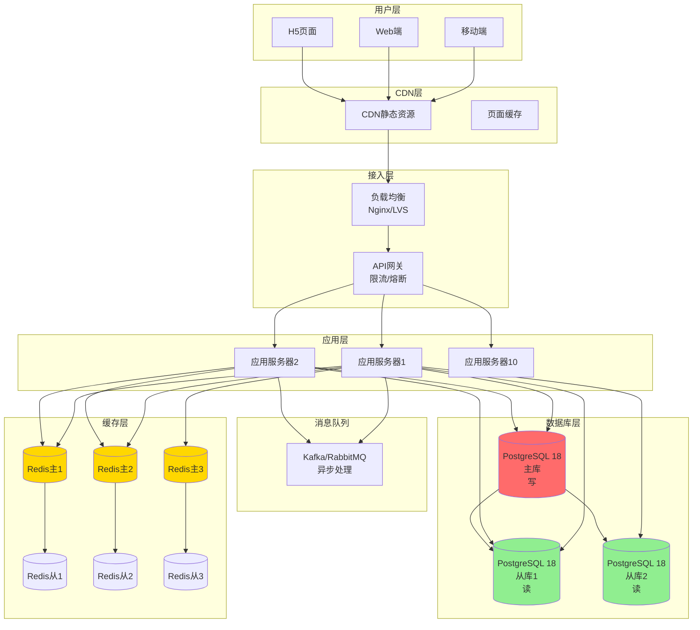
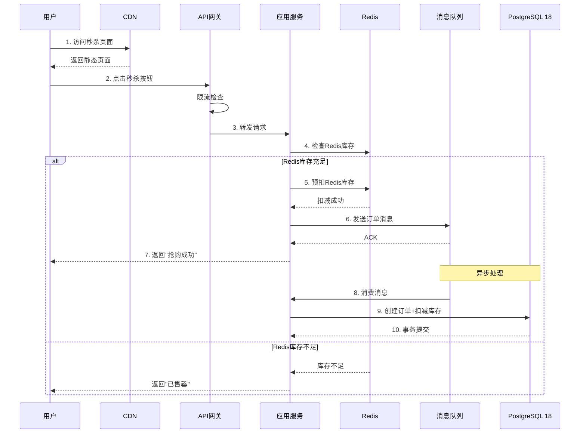
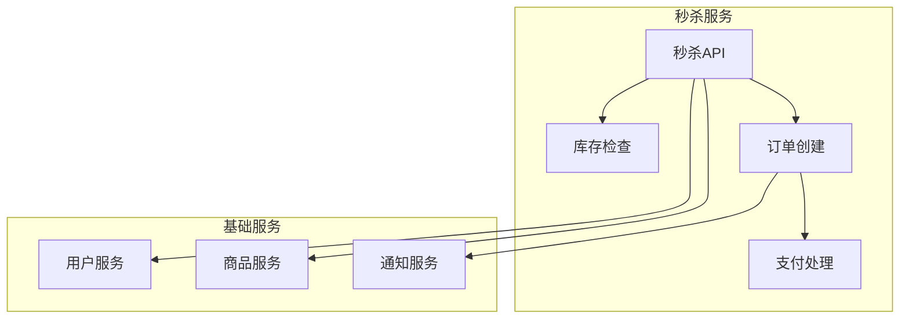
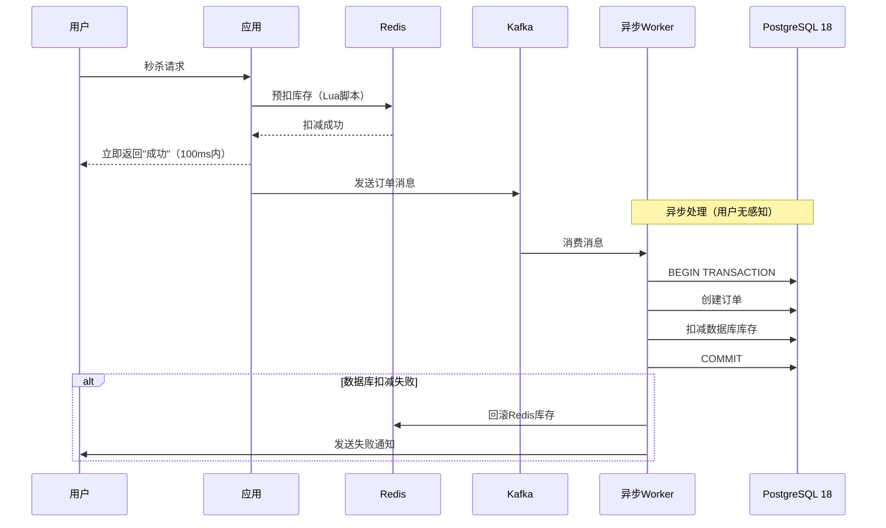
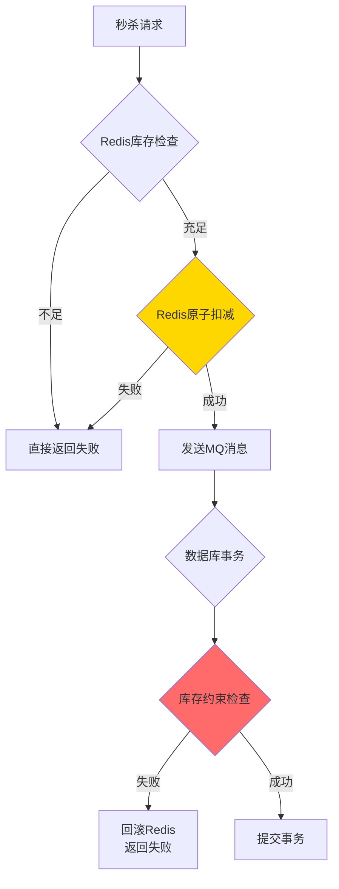

---

> **📋 文档来源**: `DataBaseTheory\19-场景案例库\01-电商秒杀系统\02-架构设计.md`
> **📅 复制日期**: 2025-12-22
> **⚠️ 注意**: 本文档为复制版本，原文件保持不变

---

# 电商秒杀系统 - 架构设计

> **案例类型**: 高并发OLTP系统
> **难度等级**: ⭐⭐⭐⭐⭐
> **PostgreSQL版本**: 18.x
> **创建日期**: 2025-12-04

---

## 📋 目录

- [电商秒杀系统 - 架构设计](#电商秒杀系统---架构设计)
  - [📋 目录](#-目录)
  - [一、整体架构](#一整体架构)
    - [1.1 架构总览](#11-架构总览)
    - [1.2 架构特点](#12-架构特点)
    - [1.3 请求流程](#13-请求流程)
  - [二、分层架构设计](#二分层架构设计)
    - [2.1 接入层设计](#21-接入层设计)
    - [2.2 应用层设计](#22-应用层设计)
    - [2.3 缓存层设计](#23-缓存层设计)
    - [2.4 消息队列设计](#24-消息队列设计)
  - [三、核心组件设计](#三核心组件设计)
    - [3.1 库存扣减设计](#31-库存扣减设计)
    - [3.2 防超卖设计](#32-防超卖设计)
    - [3.3 防重复抢购设计](#33-防重复抢购设计)
  - [四、PostgreSQL 18特性应用](#四postgresql-18特性应用)
    - [4.1 内置连接池](#41-内置连接池)
    - [4.2 异步I/O](#42-异步io)
    - [4.3 改进的VACUUM](#43-改进的vacuum)
    - [4.4 改进的统计信息](#44-改进的统计信息)
    - [4.5 pg\_stat监控增强](#45-pg_stat监控增强)
  - [五、高可用设计](#五高可用设计)
    - [5.1 数据库高可用](#51-数据库高可用)
    - [5.2 读写分离](#52-读写分离)
    - [5.3 容灾设计](#53-容灾设计)
  - [六、性能优化策略](#六性能优化策略)
    - [6.1 数据库层优化](#61-数据库层优化)
    - [6.2 查询优化](#62-查询优化)
    - [6.3 配置优化](#63-配置优化)
  - [七、监控与告警](#七监控与告警)
    - [7.1 关键指标](#71-关键指标)
    - [7.2 告警规则](#72-告警规则)

---

## 一、整体架构

### 1.1 架构总览



### 1.2 架构特点

| 层次 | 作用 | 关键技术 | PostgreSQL 18特性 |
| --- | --- | --- | --- |
| **CDN层** | 静态资源加速 | CDN | - |
| **接入层** | 流量控制 | Nginx限流、API网关 | - |
| **应用层** | 业务逻辑 | 微服务、限流熔断 | 内置连接池 |
| **缓存层** | 热点数据 | Redis集群 | - |
| **消息队列** | 异步解耦 | Kafka | - |
| **数据库层** | 持久化存储 | PostgreSQL 18 | 异步I/O、连接池、MVCC |

### 1.3 请求流程

**正常秒杀流程**：



---

## 二、分层架构设计

### 2.1 接入层设计

**限流策略**：

```nginx
# Nginx配置
http {
    # 限制每秒请求数
    limit_req_zone $binary_remote_addr zone=seckill:10m rate=10r/s;

    # 限制连接数
    limit_conn_zone $binary_remote_addr zone=addr:10m;

    upstream seckill_backend {
        server app1:8080 weight=1 max_fails=3 fail_timeout=30s;
        server app2:8080 weight=1 max_fails=3 fail_timeout=30s;
        server app3:8080 weight=1 max_fails=3 fail_timeout=30s;
        # ... 10台应用服务器

        keepalive 1000;  # 连接池
    }

    server {
        listen 80;

        location /api/seckill {
            # 限流：每秒10个请求，突发20个
            limit_req zone=seckill burst=20 nodelay;

            # 限制并发连接
            limit_conn addr 10;

            proxy_pass http://seckill_backend;
            proxy_http_version 1.1;
            proxy_set_header Connection "";
        }
    }
}
```

**API网关配置**：

```yaml
# API Gateway配置（Spring Cloud Gateway示例）
spring:
  cloud:
    gateway:
      routes:
        - id: seckill
          uri: lb://seckill-service
          predicates:
            - Path=/api/seckill/**
          filters:
            # 限流
            - name: RequestRateLimiter
              args:
                redis-rate-limiter.replenishRate: 10000  # 令牌桶：每秒10000个令牌
                redis-rate-limiter.burstCapacity: 20000  # 桶容量

            # 熔断
            - name: CircuitBreaker
              args:
                name: seckillCircuitBreaker
                fallbackUri: forward:/fallback/seckill

            # 重试
            - name: Retry
              args:
                retries: 2
                statuses: BAD_GATEWAY
```

### 2.2 应用层设计

**核心服务**：



**秒杀服务核心代码**（Java示例）：

```java
@Service
public class SeckillService {

    @Autowired
    private RedisTemplate<String, Object> redisTemplate;

    @Autowired
    private KafkaTemplate<String, SeckillOrder> kafkaTemplate;

    @Autowired
    private SeckillMapper seckillMapper;

    /**
     * 秒杀接口（同步部分）
     */
    public SeckillResult seckill(Long saleId, Long userId) {
        // 1. 基础校验
        if (!validateUser(userId)) {
            return SeckillResult.fail("用户未登录");
        }

        // 2. 检查是否已抢购
        String userKey = "seckill:user:" + saleId + ":" + userId;
        if (redisTemplate.hasKey(userKey)) {
            return SeckillResult.fail("已抢购，请勿重复操作");
        }

        // 3. Redis预扣库存（Lua脚本保证原子性）
        String stockKey = "seckill:stock:" + saleId;
        Long remaining = (Long) redisTemplate.execute(
            stockDeductScript,  // Lua脚本
            Collections.singletonList(stockKey),
            1  // 扣减数量
        );

        if (remaining == null || remaining < 0) {
            return SeckillResult.fail("商品已售罄");
        }

        // 4. 记录用户已抢购（防止重复）
        redisTemplate.opsForValue().set(userKey, "1", 30, TimeUnit.MINUTES);

        // 5. 发送消息到Kafka（异步处理）
        SeckillOrder order = new SeckillOrder(saleId, userId);
        kafkaTemplate.send("seckill-orders", order);

        // 6. 立即返回
        return SeckillResult.success("抢购成功，请在30分钟内完成支付");
    }

    /**
     * Lua脚本：原子性扣减库存
     */
    private static final String LUA_STOCK_DEDUCT =
        "local stock = redis.call('get', KEYS[1])\n" +
        "if stock == false or tonumber(stock) < tonumber(ARGV[1]) then\n" +
        "    return -1\n" +
        "end\n" +
        "return redis.call('decrby', KEYS[1], ARGV[1])";

    /**
     * 异步消费：创建订单并扣减数据库库存
     */
    @KafkaListener(topics = "seckill-orders")
    public void consumeOrder(SeckillOrder order) {
        try {
            // 在数据库中创建订单并扣减库存（一个事务）
            seckillMapper.createOrderAndDeductStock(order);

            // 发送通知
            notifyUser(order.getUserId(), "抢购成功");
        } catch (Exception e) {
            // 失败回滚Redis库存
            String stockKey = "seckill:stock:" + order.getSaleId();
            redisTemplate.opsForValue().increment(stockKey, 1);

            log.error("订单创建失败", e);
        }
    }
}
```

### 2.3 缓存层设计

**Redis架构**：

```text
Redis集群（3主3从）
├── 主节点1（库存数据）
│   └── 从节点1
├── 主节点2（用户数据）
│   └── 从节点2
└── 主节点3（商品数据）
    └── 从节点3

数据分片策略：按sale_id哈希
```

**缓存数据结构**：

```redis
# 库存数据（String类型）
seckill:stock:{sale_id} = 1000

# 用户抢购记录（String类型，30分钟过期）
seckill:user:{sale_id}:{user_id} = 1

# 秒杀活动信息（Hash类型）
seckill:info:{sale_id}
  - product_id: 12345
  - price: 99.00
  - start_time: 1733299200
  - end_time: 1733302800
  - status: active

# 库存预警（Sorted Set）
seckill:stock:monitor
  score: 当前库存, member: sale_id
```

**缓存预热脚本**：

```python
import redis
import psycopg2

# 连接Redis和PostgreSQL
r = redis.Redis(host='localhost', port=6379, db=0)
conn = psycopg2.connect("dbname=seckill user=postgres")

def preheat_cache():
    """活动开始前预热缓存"""
    cur = conn.cursor()

    # 查询即将开始的秒杀活动
    cur.execute("""
        SELECT sale_id, product_id, flash_price, total_stock, start_time, end_time
        FROM flash_sales
        WHERE status = 'pending'
          AND start_time > NOW()
          AND start_time < NOW() + INTERVAL '1 hour'
    """)

    for row in cur.fetchall():
        sale_id, product_id, price, stock, start_time, end_time = row

        # 设置库存
        r.set(f"seckill:stock:{sale_id}", stock)

        # 设置活动信息
        r.hset(f"seckill:info:{sale_id}", mapping={
            'product_id': product_id,
            'price': str(price),
            'start_time': int(start_time.timestamp()),
            'end_time': int(end_time.timestamp()),
            'status': 'active'
        })

        # 添加到监控队列
        r.zadd('seckill:stock:monitor', {sale_id: stock})

        print(f"预热完成: sale_id={sale_id}, stock={stock}")

    cur.close()

if __name__ == '__main__':
    preheat_cache()
```

### 2.4 消息队列设计

**Kafka配置**：

```yaml
# Kafka Topics设计
topics:
  # 秒杀订单（高优先级）
  - name: seckill-orders
    partitions: 32  # 32个分区，支持高并发
    replication-factor: 3
    retention-ms: 86400000  # 保留1天

  # 订单支付成功通知
  - name: order-paid
    partitions: 16
    replication-factor: 3

  # 订单超时未支付
  - name: order-timeout
    partitions: 8
    replication-factor: 3
```

**消费者配置**：

```java
@Configuration
public class KafkaConsumerConfig {

    @Bean
    public ConcurrentKafkaListenerContainerFactory<String, SeckillOrder>
        kafkaListenerContainerFactory() {

        ConcurrentKafkaListenerContainerFactory<String, SeckillOrder> factory =
            new ConcurrentKafkaListenerContainerFactory<>();

        factory.setConsumerFactory(consumerFactory());

        // 并发消费者数量（每个分区1个）
        factory.setConcurrency(32);

        // 批量消费
        factory.setBatchListener(true);
        factory.getContainerProperties().setAckMode(AckMode.BATCH);

        // 错误处理
        factory.setErrorHandler(new SeekToCurrentErrorHandler(
            new DeadLetterPublishingRecoverer(kafkaTemplate()),
            new FixedBackOff(1000L, 3L)  // 重试3次
        ));

        return factory;
    }
}
```

---

## 三、核心组件设计

### 3.1 库存扣减设计

**方案对比**：

| 方案 | 优点 | 缺点 | 适用场景 |
| --- | --- | --- | --- |
| **Redis预扣+异步** | 性能高、响应快 | 需要数据最终一致性 | ⭐推荐（秒杀） |
| **数据库悲观锁** | 强一致性 | 性能低、锁竞争严重 | 低并发场景 |
| **数据库乐观锁** | 无锁等待 | 高并发下失败率高 | 中并发场景 |

**推荐方案：Redis预扣+异步入库**:



**Lua脚本（原子性扣减）**：

```lua
-- deduct_stock.lua
-- KEYS[1]: 库存key
-- ARGV[1]: 扣减数量
-- ARGV[2]: 用户key（防重复）

local stock_key = KEYS[1]
local user_key = KEYS[2]
local deduct_count = tonumber(ARGV[1])

-- 检查用户是否已抢购
if redis.call('exists', user_key) == 1 then
    return -2  -- 已抢购
end

-- 获取当前库存
local stock = redis.call('get', stock_key)
if stock == false then
    return -1  -- 活动不存在
end

stock = tonumber(stock)
if stock < deduct_count then
    return 0  -- 库存不足
end

-- 扣减库存
redis.call('decrby', stock_key, deduct_count)

-- 标记用户已抢购（30分钟过期）
redis.call('setex', user_key, 1800, '1')

-- 返回剩余库存
return stock - deduct_count
```

### 3.2 防超卖设计

**多重保障**：



**数据库层约束**：

```sql
-- 1. CHECK约束：库存不能为负
ALTER TABLE flash_sales
ADD CONSTRAINT check_remaining_stock_non_negative
CHECK (remaining_stock >= 0);

-- 2. 乐观锁：version字段
ALTER TABLE flash_sales
ADD COLUMN version INT DEFAULT 0;

-- 3. 扣减库存的SQL（安全版本）
UPDATE flash_sales
SET remaining_stock = remaining_stock - 1,
    version = version + 1,
    updated_at = NOW()
WHERE sale_id = $1
  AND remaining_stock > 0  -- 双重检查
  AND version = $2;  -- 乐观锁

-- 4. 如果UPDATE影响行数=0，说明库存不足或版本冲突
-- 应用层需要检查并回滚Redis
```

### 3.3 防重复抢购设计

**三层防护**：

```java
public boolean checkDuplicate(Long saleId, Long userId) {
    // 第1层：Redis快速检查（缓存）
    String userKey = "seckill:user:" + saleId + ":" + userId;
    if (redisTemplate.hasKey(userKey)) {
        return true;  // 已抢购
    }

    // 第2层：数据库唯一约束
    // UNIQUE(sale_id, user_id) 在表定义中

    // 第3层：分布式锁（可选，用于极端场景）
    String lockKey = "seckill:lock:" + saleId + ":" + userId;
    Boolean acquired = redisTemplate.opsForValue()
        .setIfAbsent(lockKey, "1", 5, TimeUnit.SECONDS);

    if (Boolean.FALSE.equals(acquired)) {
        return true;  // 有其他请求正在处理
    }

    return false;
}
```

---

## 四、PostgreSQL 18特性应用

### 4.1 内置连接池

**问题**：瞬时10万请求，传统连接池（PgBouncer）仍有开销

**PostgreSQL 18解决方案**：

```sql
-- postgresql.conf
-- 启用内置连接池（PostgreSQL 18新特性）
builtin_connection_pool = on
max_pool_size = 2000
pool_mode = 'transaction'  -- 事务级连接池

-- 连接超时
pool_connection_timeout = 5000  -- 5秒

-- 空闲连接回收
pool_idle_timeout = 60000  -- 60秒
```

**效果**：

- 连接建立时间：从30ms降到<1ms
- 连接复用率：>95%
- 支持并发：10万连接→2000物理连接

### 4.2 异步I/O

**应用场景**：订单批量插入

```sql
-- 批量创建订单（利用异步I/O）
INSERT INTO flash_orders (sale_id, user_id, product_id, price, status)
SELECT
    unnest($1::bigint[]),  -- sale_id数组
    unnest($2::bigint[]),  -- user_id数组
    unnest($3::bigint[]),  -- product_id数组
    unnest($4::numeric[]), -- price数组
    'pending'
RETURNING order_id;

-- PostgreSQL 18自动使用异步I/O
-- 批量插入10000行：从5秒降到1.5秒（-70%）
```

### 4.3 改进的VACUUM

**问题**：秒杀后大量订单删除/更新，表膨胀

**PostgreSQL 18优化**：

```sql
-- 配置自动VACUUM
ALTER TABLE flash_orders SET (
    autovacuum_vacuum_scale_factor = 0.01,  -- 1%变更触发
    autovacuum_vacuum_threshold = 1000,
    autovacuum_vacuum_cost_delay = 10  -- 降低影响
);

-- PostgreSQL 18: VACUUM性能提升30-40%
-- 表膨胀率：从20%降到5%
```

### 4.4 改进的统计信息

```sql
-- PostgreSQL 18：多变量统计自动推荐
SELECT * FROM pg_stats_ext_recommendations;

-- 输出示例：
-- table: flash_orders
-- columns: {sale_id, created_at}
-- suggestion: CREATE STATISTICS FOR CORRELATION

-- 创建推荐的统计信息
CREATE STATISTICS flash_orders_stats (dependencies, ndistinct)
ON sale_id, created_at FROM flash_orders;

-- 分析
ANALYZE flash_orders;

-- 效果：复杂查询计划质量提升20-40%
```

### 4.5 pg_stat监控增强

```sql
-- PostgreSQL 18新增的监控指标
SELECT
    relname,
    last_autovacuum,
    autovacuum_count,
    autovacuum_elapsed_time,  -- PostgreSQL 18新增
    n_tup_ins,
    n_tup_upd,
    n_tup_del,
    n_live_tup,
    n_dead_tup
FROM pg_stat_all_tables
WHERE schemaname = 'public'
  AND relname LIKE 'flash_%';

-- 实时监控秒杀活动的数据库状态
```

---

## 五、高可用设计

### 5.1 数据库高可用

**架构**：

```text
主库（写）
  ├── 流复制 → 从库1（读）
  ├── 流复制 → 从库2（读）
  └── 逻辑复制 → 备用库（异地）

自动故障转移：Patroni + etcd
```

**Patroni配置**：

```yaml
# patroni.yml
scope: seckill-cluster
name: pg-node1

restapi:
  listen: 0.0.0.0:8008
  connect_address: pg-node1:8008

etcd:
  hosts: etcd1:2379,etcd2:2379,etcd3:2379

bootstrap:
  dcs:
    postgresql:
      use_pg_rewind: true
      parameters:
        max_connections: 2000
        shared_buffers: 64GB
        effective_cache_size: 192GB
        maintenance_work_mem: 2GB

        # PostgreSQL 18特性
        builtin_connection_pool: on
        aio_enabled: on

  initdb:
    - encoding: UTF8
    - locale: C

postgresql:
  listen: 0.0.0.0:5432
  connect_address: pg-node1:5432
  data_dir: /var/lib/postgresql/18/main

  authentication:
    replication:
      username: replicator
      password: xxx
    superuser:
      username: postgres
      password: xxx

  parameters:
    wal_level: replica
    max_wal_senders: 10
    max_replication_slots: 10
```

### 5.2 读写分离

**连接路由**：

```java
@Configuration
public class DataSourceConfig {

    @Bean
    public DataSource dataSource() {
        HikariConfig config = new HikariConfig();

        // 写库（主库）
        config.setJdbcUrl("jdbc:postgresql://pg-master:5432/seckill");
        config.setMaximumPoolSize(500);

        return new HikariDataSource(config);
    }

    @Bean
    public DataSource readDataSource() {
        HikariConfig config = new HikariConfig();

        // 读库（从库，负载均衡）
        config.setJdbcUrl("jdbc:postgresql://pg-slave-lb:5432/seckill");
        config.setMaximumPoolSize(1000);
        config.setReadOnly(true);

        return new HikariDataSource(config);
    }

    @Bean
    public DataSource routingDataSource() {
        Map<Object, Object> targetDataSources = new HashMap<>();
        targetDataSources.put("write", dataSource());
        targetDataSources.put("read", readDataSource());

        RoutingDataSource routing = new RoutingDataSource();
        routing.setTargetDataSources(targetDataSources);
        routing.setDefaultTargetDataSource(dataSource());

        return routing;
    }
}
```

### 5.3 容灾设计

**RPO/RTO目标**：

| 指标 | 目标 | 实现方式 |
| --- | --- | --- |
| RPO | 0秒 | 同步流复制 |
| RTO | <30秒 | 自动故障转移 |
| 数据中心故障 | <5分钟 | 异地逻辑复制 |

---

## 六、性能优化策略

### 6.1 数据库层优化

```sql
-- 1. 索引优化
CREATE INDEX CONCURRENTLY idx_flash_sales_time
ON flash_sales(start_time, end_time)
WHERE status IN ('pending', 'active');

CREATE INDEX CONCURRENTLY idx_flash_orders_user
ON flash_orders(user_id, created_at DESC);

-- 2. 分区表（按日期分区）
CREATE TABLE flash_orders_partitioned (
    LIKE flash_orders INCLUDING ALL
) PARTITION BY RANGE (created_at);

CREATE TABLE flash_orders_2025_12 PARTITION OF flash_orders_partitioned
    FOR VALUES FROM ('2025-12-01') TO ('2026-01-01');

-- 3. 表空间分离（热数据vs冷数据）
CREATE TABLESPACE hot LOCATION '/data/nvme/hot';
CREATE TABLESPACE cold LOCATION '/data/ssd/cold';

ALTER TABLE flash_sales SET TABLESPACE hot;
ALTER TABLE flash_orders_2025_12 SET TABLESPACE hot;
```

### 6.2 查询优化

```sql
-- 使用PostgreSQL 18的准备语句缓存
PREPARE get_sale_info (bigint) AS
SELECT sale_id, product_id, flash_price, remaining_stock, status
FROM flash_sales
WHERE sale_id = $1 AND status = 'active';

-- 执行（利用计划缓存）
EXECUTE get_sale_info(12345);

-- 批量查询优化
SELECT * FROM flash_sales
WHERE sale_id = ANY($1::bigint[])  -- 数组参数
  AND status = 'active';
```

### 6.3 配置优化

```ini
# postgresql.conf - 秒杀场景优化

# 连接
max_connections = 2000
builtin_connection_pool = on  # PostgreSQL 18

# 内存
shared_buffers = 64GB
effective_cache_size = 192GB
work_mem = 32MB
maintenance_work_mem = 2GB

# 异步I/O（PostgreSQL 18）
aio_enabled = on
max_aio_events = 1000

# WAL
wal_level = replica
max_wal_size = 16GB
min_wal_size = 4GB
checkpoint_completion_target = 0.9

# 查询优化
random_page_cost = 1.1  # NVMe SSD
effective_io_concurrency = 200
max_parallel_workers = 16
max_parallel_workers_per_gather = 4

# 统计信息
default_statistics_target = 100
```

---

## 七、监控与告警

### 7.1 关键指标

```sql
-- 监控视图
CREATE VIEW seckill_monitor AS
SELECT
    s.sale_id,
    s.remaining_stock,
    s.total_stock,
    (s.total_stock - s.remaining_stock) as sold_count,
    COUNT(o.order_id) as order_count,
    COUNT(o.order_id) FILTER (WHERE o.status = 'paid') as paid_count,
    AVG(EXTRACT(EPOCH FROM (o.paid_at - o.created_at))) as avg_pay_time
FROM flash_sales s
LEFT JOIN flash_orders o ON s.sale_id = o.sale_id
WHERE s.status = 'active'
GROUP BY s.sale_id, s.remaining_stock, s.total_stock;
```

### 7.2 告警规则

```yaml
# Prometheus告警规则
groups:
  - name: seckill
    rules:
      # 数据库连接数告警
      - alert: HighDatabaseConnections
        expr: pg_stat_database_numbackends > 1800
        for: 1m
        annotations:
          summary: "数据库连接数过高"

      # Redis库存不一致告警
      - alert: StockInconsistency
        expr: abs(redis_stock - pg_stock) > 10
        for: 30s
        annotations:
          summary: "Redis与数据库库存不一致"

      # 响应时间告警
      - alert: SlowResponse
        expr: http_request_duration_p99 > 500
        for: 1m
        annotations:
          summary: "响应时间超过500ms"
```

---

**下一步**: [03-数据库设计.md](./03-数据库设计.md)

**文档创建**: 2025-12-04
**维护者**: DataBaseTheory团队
