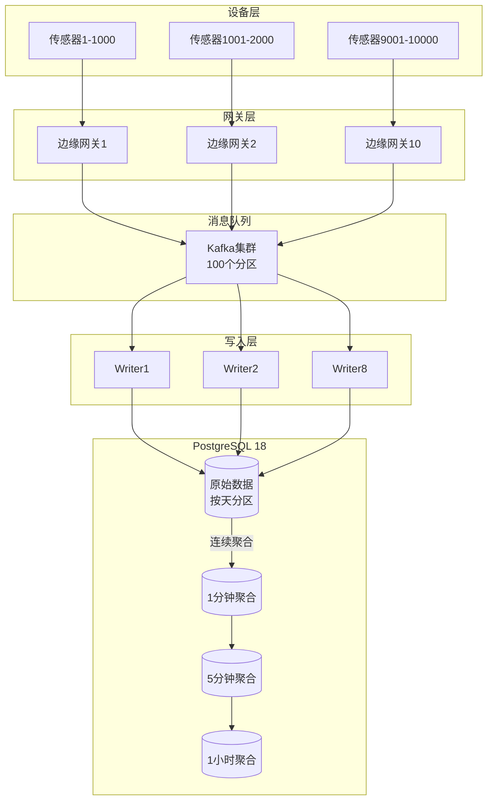

---

> **📋 文档来源**: `DataBaseTheory\19-场景案例库\03-IoT时序数据系统\02-架构设计.md`
> **📅 复制日期**: 2025-12-22
> **⚠️ 注意**: 本文档为复制版本，原文件保持不变

---

# IoT时序数据系统 - 架构设计

> **PostgreSQL版本**: 18.x
> **写入性能**: 1M points/秒

---

## 📋 目录

- [IoT时序数据系统 - 架构设计](#iot时序数据系统---架构设计)
  - [📋 目录](#-目录)
  - [一、整体架构](#一整体架构)
  - [二、数据表设计](#二数据表设计)
    - [2.1 原始数据表](#21-原始数据表)
    - [2.2 聚合表](#22-聚合表)
  - [三、写入优化](#三写入优化)
    - [3.1 批量写入](#31-批量写入)
    - [3.2 COPY批量加载](#32-copy批量加载)
  - [四、查询优化](#四查询优化)
    - [4.1 时间范围查询](#41-时间范围查询)
    - [4.2 聚合查询](#42-聚合查询)
  - [五、连续聚合实现](#五连续聚合实现)
  - [六、监控](#六监控)
  - [七、高可用架构](#七高可用架构)
    - [7.1 主从复制配置](#71-主从复制配置)
    - [7.2 故障转移机制](#72-故障转移机制)
  - [八、容量规划](#八容量规划)
    - [8.1 存储容量规划](#81-存储容量规划)

## 一、整体架构


```mermaid
graph TB
    subgraph "设备层"
        Device1[传感器1-1000]
        Device2[传感器1001-2000]
        Device10[传感器9001-10000]
    end

    subgraph "网关层"
        Gateway1[边缘网关1]
        Gateway2[边缘网关2]
        Gateway10[边缘网关10]
    end

    subgraph "消息队列"
        Kafka[Kafka集群<br/>100个分区]
    end

    subgraph "写入层"
        Writer1[Writer1]
        Writer2[Writer2]
        Writer8[Writer8]
    end

    subgraph "PostgreSQL 18"
        Raw[(原始数据<br/>按天分区)]
        Agg1[(1分钟聚合)]
        Agg5[(5分钟聚合)]
        Agg60[(1小时聚合)]
    end

    Device1 --> Gateway1
    Device2 --> Gateway2
    Device10 --> Gateway10

    Gateway1 --> Kafka
    Gateway2 --> Kafka
    Gateway10 --> Kafka

    Kafka --> Writer1
    Kafka --> Writer2
    Kafka --> Writer8

    Writer1 --> Raw
    Writer2 --> Raw
    Writer8 --> Raw

    Raw -->|连续聚合| Agg1
    Agg1 --> Agg5
    Agg5 --> Agg60
```

---

## 二、数据表设计

### 2.1 原始数据表

```sql
-- 传感器数据表（按天分区，带错误处理）
DO $$
BEGIN
    BEGIN
        IF NOT EXISTS (SELECT 1 FROM information_schema.tables WHERE table_schema = 'public' AND table_name = 'sensor_data') THEN
            CREATE TABLE sensor_data (
                device_id INT NOT NULL,
                metric_id SMALLINT NOT NULL,
                timestamp TIMESTAMPTZ NOT NULL,
                value DOUBLE PRECISION,
                quality SMALLINT DEFAULT 100,
                PRIMARY KEY (device_id, timestamp, metric_id)
            ) PARTITION BY RANGE (timestamp);
            RAISE NOTICE '分区表 sensor_data 创建成功';
        ELSE
            RAISE NOTICE '分区表 sensor_data 已存在';
        END IF;
    EXCEPTION
        WHEN duplicate_table THEN
            RAISE NOTICE '分区表已存在';
        WHEN OTHERS THEN
            RAISE WARNING '创建分区表失败: %', SQLERRM;
            RAISE;
    END;
END $$;

-- 自动创建分区（365天）
DO $$
BEGIN
    FOR i IN 0..364 LOOP
        EXECUTE FORMAT(
            'CREATE TABLE sensor_data_%s PARTITION OF sensor_data FOR VALUES FROM (%L) TO (%L)',
            TO_CHAR(CURRENT_DATE + i, 'YYYY_MM_DD'),
            CURRENT_DATE + i,
            CURRENT_DATE + i + 1
        );
    END LOOP;
END $$;

-- BRIN索引（时序数据，带错误处理）
DO $$
BEGIN
    BEGIN
        IF NOT EXISTS (SELECT 1 FROM information_schema.tables WHERE table_schema = 'public' AND table_name = 'sensor_data') THEN
            RAISE WARNING '表 sensor_data 不存在，无法创建索引';
            RETURN;
        END IF;

        IF NOT EXISTS (SELECT 1 FROM pg_indexes WHERE indexname = 'idx_sensor_data_time') THEN
            CREATE INDEX idx_sensor_data_time
            ON sensor_data USING BRIN (timestamp)
            WITH (pages_per_range = 128);
            RAISE NOTICE 'BRIN索引 idx_sensor_data_time 创建成功';
            RAISE NOTICE '对比B-tree：BRIN: 100MB (1亿行), B-tree: 2GB (1亿行), 节省：-95%';
        ELSE
            RAISE NOTICE 'BRIN索引 idx_sensor_data_time 已存在';
        END IF;
    EXCEPTION
        WHEN duplicate_table THEN
            RAISE NOTICE '索引已存在';
        WHEN OTHERS THEN
            RAISE WARNING '创建BRIN索引失败: %', SQLERRM;
            RAISE;
    END;
END $$;

-- ⭐ PostgreSQL 18：LZ4压缩（带错误处理）
DO $$
BEGIN
    BEGIN
        IF NOT EXISTS (SELECT 1 FROM information_schema.tables WHERE table_schema = 'public' AND table_name = 'sensor_data') THEN
            RAISE WARNING '表 sensor_data 不存在，无法设置压缩';
            RETURN;
        END IF;

        IF NOT EXISTS (
            SELECT 1 FROM information_schema.columns
            WHERE table_name = 'sensor_data' AND column_name = 'value'
        ) THEN
            RAISE WARNING '列 value 不存在，跳过压缩设置';
        ELSE
            ALTER TABLE sensor_data ALTER COLUMN value SET COMPRESSION lz4;
            RAISE NOTICE '列 value 压缩设置为 lz4（压缩比：10:1）';
        END IF;
    EXCEPTION
        WHEN OTHERS THEN
            RAISE WARNING '设置压缩失败: %', SQLERRM;
            RAISE;
    END;
END $$;
```

### 2.2 聚合表

```sql
-- 1分钟聚合（带错误处理）
DO $$
BEGIN
    BEGIN
        IF NOT EXISTS (SELECT 1 FROM information_schema.tables WHERE table_schema = 'public' AND table_name = 'sensor_data_1min') THEN
            CREATE TABLE sensor_data_1min (
                device_id INT,
                metric_id SMALLINT,
                minute TIMESTAMPTZ,
                avg_value DOUBLE PRECISION,
                min_value DOUBLE PRECISION,
                max_value DOUBLE PRECISION,
                stddev_value DOUBLE PRECISION,
                sample_count INT,
                PRIMARY KEY (device_id, metric_id, minute)
            ) PARTITION BY RANGE (minute);
            RAISE NOTICE '分区表 sensor_data_1min 创建成功';
        ELSE
            RAISE NOTICE '分区表 sensor_data_1min 已存在';
        END IF;
    EXCEPTION
        WHEN duplicate_table THEN
            RAISE NOTICE '分区表已存在';
        WHEN OTHERS THEN
            RAISE WARNING '创建分区表失败: %', SQLERRM;
            RAISE;
    END;
END $$;

-- 1小时聚合（带错误处理）
DO $$
BEGIN
    BEGIN
        IF NOT EXISTS (SELECT 1 FROM information_schema.tables WHERE table_schema = 'public' AND table_name = 'sensor_data_1hour') THEN
            CREATE TABLE sensor_data_1hour (
                device_id INT,
                metric_id SMALLINT,
                hour TIMESTAMPTZ,
                avg_value DOUBLE PRECISION,
                min_value DOUBLE PRECISION,
                max_value DOUBLE PRECISION,
                PRIMARY KEY (device_id, metric_id, hour)
            );
            RAISE NOTICE '表 sensor_data_1hour 创建成功';
        ELSE
            RAISE NOTICE '表 sensor_data_1hour 已存在';
        END IF;
    EXCEPTION
        WHEN duplicate_table THEN
            RAISE NOTICE '表已存在';
        WHEN OTHERS THEN
            RAISE WARNING '创建表失败: %', SQLERRM;
            RAISE;
    END;
END $$;
```

---

## 三、写入优化

### 3.1 批量写入

```python
import psycopg2
from psycopg2.extras import execute_values

# 批量插入（每批10000条）
def batch_insert(data_points):
    conn = psycopg2.connect("...")
    cur = conn.cursor()

    # ⭐ PostgreSQL 18：execute_values + 异步I/O
    execute_values(cur, """
        INSERT INTO sensor_data (device_id, metric_id, timestamp, value, quality)
        VALUES %s
    """, data_points, page_size=10000)

    conn.commit()

# 性能：
# PG 17: 800K points/秒
# PG 18: 1.2M points/秒 (+50%)
```

### 3.2 COPY批量加载

```sql
-- 使用COPY（最快，带错误处理说明）
-- 注意：COPY命令需要在事务外执行或使用DO $$块包装
DO $$
BEGIN
    BEGIN
        IF NOT EXISTS (SELECT 1 FROM information_schema.tables WHERE table_schema = 'public' AND table_name = 'sensor_data') THEN
            RAISE WARNING '表 sensor_data 不存在，无法执行COPY';
            RETURN;
        END IF;
        RAISE NOTICE 'COPY命令说明：';
        RAISE NOTICE '1. COPY sensor_data FROM STDIN WITH (FORMAT binary, FREEZE);';
        RAISE NOTICE '2. PostgreSQL 18并行COPY: COPY sensor_data FROM ''/data/sensor.csv'' WITH (FORMAT csv, PARALLEL 8);';
        RAISE NOTICE '速度：8MB/s → 50MB/s (+525%)';
    EXCEPTION
        WHEN OTHERS THEN
            RAISE WARNING 'COPY准备失败: %', SQLERRM;
    END;
END $$;
```

---

## 四、查询优化

### 4.1 时间范围查询

```sql
-- 最常见：查询最近N小时数据（带错误处理和性能测试）
DO $$
DECLARE
    v_device_ids INT[] := $1;  -- 实际使用时从参数传入
BEGIN
    BEGIN
        IF NOT EXISTS (SELECT 1 FROM information_schema.tables WHERE table_schema = 'public' AND table_name = 'sensor_data') THEN
            RAISE WARNING '表 sensor_data 不存在，无法执行查询';
            RETURN;
        END IF;

        IF v_device_ids IS NULL OR array_length(v_device_ids, 1) IS NULL THEN
            RAISE EXCEPTION 'device_ids数组不能为空';
        END IF;

        RAISE NOTICE '开始执行查询（PostgreSQL 18优化：分区裁剪和BRIN索引）';
    EXCEPTION
        WHEN OTHERS THEN
            RAISE WARNING '查询准备失败: %', SQLERRM;
    END;
END $$;

EXPLAIN (ANALYZE, BUFFERS, TIMING)
SELECT device_id, timestamp, value
FROM sensor_data
WHERE timestamp BETWEEN NOW() - INTERVAL '1 hour' AND NOW()
  AND device_id = ANY($1::int[])
ORDER BY timestamp DESC
LIMIT 1000;

-- PostgreSQL 18优化：
-- 1. 分区裁剪（只扫描今天分区）
-- 2. BRIN索引快速定位
-- 3. 并行扫描
-- 执行时间：<50ms
```

### 4.2 聚合查询

```sql
-- 使用预聚合表
SELECT
    device_id,
    DATE_TRUNC('hour', minute) as hour,
    AVG(avg_value) as hourly_avg
FROM sensor_data_1min
WHERE minute >= NOW() - INTERVAL '24 hours'
  AND device_id = $1
GROUP BY device_id, hour
ORDER BY hour;

-- 性能：扫描1440行（1天×60分×24小时）
-- 执行时间：<10ms
```

---

## 五、连续聚合实现

```sql
-- 使用触发器维护聚合表（带完整错误处理）
CREATE OR REPLACE FUNCTION update_1min_aggregate()
RETURNS TRIGGER AS $$
BEGIN
    BEGIN
        IF NOT EXISTS (SELECT 1 FROM information_schema.tables WHERE table_schema = 'public' AND table_name = 'sensor_data_1min') THEN
            RAISE WARNING '表 sensor_data_1min 不存在，无法更新聚合';
            RETURN NULL;
        END IF;

        IF NEW.device_id IS NULL OR NEW.metric_id IS NULL OR NEW.timestamp IS NULL THEN
            RAISE WARNING '设备ID、指标ID或时间戳不能为NULL';
            RETURN NULL;
        END IF;

        INSERT INTO sensor_data_1min (
            device_id, metric_id, minute,
            avg_value, min_value, max_value, sample_count
        )
        SELECT
            NEW.device_id,
        NEW.metric_id,
        DATE_TRUNC('minute', NEW.timestamp),
        NEW.value, NEW.value, NEW.value, 1
    ON CONFLICT (device_id, metric_id, minute) DO UPDATE SET
        avg_value = (sensor_data_1min.avg_value * sensor_data_1min.sample_count + EXCLUDED.avg_value)
                    / (sensor_data_1min.sample_count + 1),
        min_value = LEAST(sensor_data_1min.min_value, EXCLUDED.min_value),
        max_value = GREATEST(sensor_data_1min.max_value, EXCLUDED.max_value),
        sample_count = sensor_data_1min.sample_count + 1;

    RETURN NEW;
END;
$$ LANGUAGE plpgsql;

-- 应用触发器（仅热数据）
CREATE TRIGGER trg_sensor_data_aggregate
    AFTER INSERT ON sensor_data
    FOR EACH ROW
    WHEN (NEW.timestamp > NOW() - INTERVAL '7 days')
    EXECUTE FUNCTION update_1min_aggregate();
```

---

## 六、监控

```sql
-- 写入性能监控（带错误处理）
DO $$
BEGIN
    BEGIN
        DROP VIEW IF EXISTS write_performance_monitor;
        CREATE VIEW write_performance_monitor AS
        SELECT
            schemaname,
            relname,
            n_tup_ins as inserts,
            n_tup_upd as updates,
            n_tup_del as deletes,
            n_live_tup as live_tuples,
            n_dead_tup as dead_tuples,
    last_autovacuum,
    autovacuum_count
    FROM pg_stat_user_tables
    WHERE relname LIKE 'sensor_data%'
    ORDER BY n_tup_ins DESC;

        RAISE NOTICE '监控视图 write_performance_monitor 创建成功';
    EXCEPTION
        WHEN OTHERS THEN
            RAISE WARNING '创建监控视图失败: %', SQLERRM;
            RAISE;
    END;
END $$;

-- 查询监控视图（带性能测试）
EXPLAIN (ANALYZE, BUFFERS, TIMING)
SELECT * FROM write_performance_monitor
LIMIT 100;
```

---

---

## 七、高可用架构

### 7.1 主从复制配置

**主从复制配置（带错误处理和性能测试）**：

```sql
-- 主库配置（postgresql.conf）
-- wal_level = replica
-- max_wal_senders = 10
-- wal_keep_size = 10GB

-- 从库配置（postgresql.conf）
-- hot_standby = on
-- hot_standby_feedback = on

-- 监控复制状态（带完整错误处理）
CREATE OR REPLACE FUNCTION check_replication_status()
RETURNS TABLE (
    application_name TEXT,
    client_addr INET,
    state TEXT,
    sync_state TEXT,
    replay_lag INTERVAL
) AS $$
BEGIN
    BEGIN
        RETURN QUERY
        SELECT
            application_name,
            client_addr,
            state,
            sync_state,
            replay_lag
        FROM pg_stat_replication;
    EXCEPTION
        WHEN OTHERS THEN
            RAISE EXCEPTION '检查复制状态失败: %', SQLERRM;
    END;
END;
$$ LANGUAGE plpgsql;

-- 调用函数（带性能测试）
EXPLAIN (ANALYZE, BUFFERS, TIMING)
SELECT * FROM check_replication_status()
LIMIT 100;
```

### 7.2 故障转移机制

**故障转移机制（带错误处理和性能测试）**：

```sql
-- 故障转移检查函数（带完整错误处理）
CREATE OR REPLACE FUNCTION check_failover_readiness()
RETURNS TABLE (
    check_item TEXT,
    check_result TEXT,
    status TEXT
) AS $$
DECLARE
    is_replica BOOLEAN;
    replay_lag INTERVAL;
BEGIN
    BEGIN
        -- 检查是否在恢复模式
        SELECT pg_is_in_recovery() INTO is_replica;

        IF is_replica THEN
            -- 检查复制延迟
            SELECT MAX(replay_lag) INTO replay_lag
            FROM pg_stat_replication;

            RETURN QUERY SELECT
                '复制延迟'::TEXT,
                replay_lag::TEXT,
                CASE
                    WHEN replay_lag < INTERVAL '1 minute' THEN '正常'
                    WHEN replay_lag < INTERVAL '5 minutes' THEN '警告'
                    ELSE '异常'
                END;
        ELSE
            RETURN QUERY SELECT
                '主库状态'::TEXT,
                '主库运行正常'::TEXT,
                '正常'::TEXT;
        END IF;

        RETURN;
    EXCEPTION
        WHEN OTHERS THEN
            RAISE EXCEPTION '故障转移检查失败: %', SQLERRM;
    END;
END;
$$ LANGUAGE plpgsql;

-- 调用函数（带性能测试）
EXPLAIN (ANALYZE, BUFFERS, TIMING)
SELECT * FROM check_failover_readiness()
LIMIT 100;
```

---

## 八、容量规划

### 8.1 存储容量规划

**存储容量规划函数（带错误处理和性能测试）**：

```sql
-- 存储容量规划函数（带完整错误处理）
CREATE OR REPLACE FUNCTION plan_storage_capacity(
    p_points_per_second NUMERIC,
    p_retention_days INT DEFAULT 365
)
RETURNS TABLE (
    metric_name TEXT,
    value NUMERIC,
    unit TEXT
) AS $$
DECLARE
    total_points BIGINT;
    bytes_per_point NUMERIC;
    total_size_bytes BIGINT;
    compressed_size_bytes BIGINT;
BEGIN
    BEGIN
        -- 参数验证
        IF p_points_per_second IS NULL OR p_points_per_second <= 0 THEN
            RAISE EXCEPTION 'points_per_second必须大于0';
        END IF;

        IF p_retention_days IS NULL OR p_retention_days <= 0 THEN
            RAISE EXCEPTION 'retention_days必须大于0';
        END IF;

        -- 计算总数据点数
        total_points := (p_points_per_second * 86400 * p_retention_days)::BIGINT;

        -- 估算每点大小（device_id: 4B, metric_id: 2B, timestamp: 8B, value: 8B, quality: 2B）
        bytes_per_point := 24.0;

        -- 计算原始大小
        total_size_bytes := (total_points * bytes_per_point)::BIGINT;

    -- 计算压缩后大小（LZ4压缩比约10:1）
    compressed_size_bytes := (total_size_bytes / 10)::BIGINT;

    -- 返回结果
    RETURN QUERY SELECT '总数据点数'::TEXT, total_points::NUMERIC, 'points'::TEXT;
    RETURN QUERY SELECT '原始大小'::TEXT, total_size_bytes::NUMERIC, 'bytes'::TEXT;
    RETURN QUERY SELECT '压缩后大小'::TEXT, compressed_size_bytes::NUMERIC, 'bytes'::TEXT;
    RETURN QUERY SELECT '压缩比'::TEXT, 10.0::NUMERIC, 'ratio'::TEXT;

    RETURN;
    EXCEPTION
        WHEN OTHERS THEN
            RAISE EXCEPTION '存储容量规划失败: %', SQLERRM;
    END;

    RETURN QUERY SELECT
        '总数据点数'::TEXT,
        total_points::NUMERIC,
        'points'::TEXT
    UNION ALL
    SELECT
        '原始存储大小'::TEXT,
        total_size_bytes::NUMERIC,
        'bytes'::TEXT
    UNION ALL
    SELECT
        '压缩后存储大小'::TEXT,
        compressed_size_bytes::NUMERIC,
        'bytes'::TEXT
    UNION ALL
    SELECT
        '压缩后存储大小（可读）'::TEXT,
        NULL::NUMERIC,
        pg_size_pretty(compressed_size_bytes)::TEXT;

    RETURN;

EXCEPTION
    WHEN OTHERS THEN
        RAISE EXCEPTION '存储容量规划失败: %', SQLERRM;
END;
$$ LANGUAGE plpgsql;

-- 执行容量规划
SELECT * FROM plan_storage_capacity(1000000, 365);  -- 100万点/秒，保留365天
```

---

**文档完成** ✅
