---

> **📋 文档来源**: `DataBaseTheory\19-场景案例库\03-IoT时序数据系统\02-架构设计.md`
> **📅 复制日期**: 2025-12-22
> **⚠️ 注意**: 本文档为复制版本，原文件保持不变

---

# IoT时序数据系统 - 架构设计

> **PostgreSQL版本**: 18.x
> **写入性能**: 1M points/秒

---

## 一、整体架构

```mermaid
graph TB
    subgraph "设备层"
        Device1[传感器1-1000]
        Device2[传感器1001-2000]
        Device10[传感器9001-10000]
    end

    subgraph "网关层"
        Gateway1[边缘网关1]
        Gateway2[边缘网关2]
        Gateway10[边缘网关10]
    end

    subgraph "消息队列"
        Kafka[Kafka集群<br/>100个分区]
    end

    subgraph "写入层"
        Writer1[Writer1]
        Writer2[Writer2]
        Writer8[Writer8]
    end

    subgraph "PostgreSQL 18"
        Raw[(原始数据<br/>按天分区)]
        Agg1[(1分钟聚合)]
        Agg5[(5分钟聚合)]
        Agg60[(1小时聚合)]
    end

    Device1 --> Gateway1
    Device2 --> Gateway2
    Device10 --> Gateway10

    Gateway1 --> Kafka
    Gateway2 --> Kafka
    Gateway10 --> Kafka

    Kafka --> Writer1
    Kafka --> Writer2
    Kafka --> Writer8

    Writer1 --> Raw
    Writer2 --> Raw
    Writer8 --> Raw

    Raw -->|连续聚合| Agg1
    Agg1 --> Agg5
    Agg5 --> Agg60
```



---

## 二、数据表设计

### 2.1 原始数据表

```sql
-- 传感器数据表（按天分区）
CREATE TABLE sensor_data (
    device_id INT NOT NULL,
    metric_id SMALLINT NOT NULL,
    timestamp TIMESTAMPTZ NOT NULL,
    value DOUBLE PRECISION,
    quality SMALLINT DEFAULT 100,
    PRIMARY KEY (device_id, timestamp, metric_id)
) PARTITION BY RANGE (timestamp);

-- 自动创建分区（365天）
DO $$
BEGIN
    FOR i IN 0..364 LOOP
        EXECUTE FORMAT(
            'CREATE TABLE sensor_data_%s PARTITION OF sensor_data FOR VALUES FROM (%L) TO (%L)',
            TO_CHAR(CURRENT_DATE + i, 'YYYY_MM_DD'),
            CURRENT_DATE + i,
            CURRENT_DATE + i + 1
        );
    END LOOP;
END $$;

-- BRIN索引（时序数据）
CREATE INDEX idx_sensor_data_time
ON sensor_data USING BRIN (timestamp)
WITH (pages_per_range = 128);

-- 对比B-tree：
-- BRIN: 100MB (1亿行)
-- B-tree: 2GB (1亿行)
-- 节省：-95%

-- ⭐ PostgreSQL 18：LZ4压缩
ALTER TABLE sensor_data ALTER COLUMN value SET COMPRESSION lz4;
-- 压缩比：10:1
```

### 2.2 聚合表

```sql
-- 1分钟聚合
CREATE TABLE sensor_data_1min (
    device_id INT,
    metric_id SMALLINT,
    minute TIMESTAMPTZ,
    avg_value DOUBLE PRECISION,
    min_value DOUBLE PRECISION,
    max_value DOUBLE PRECISION,
    stddev_value DOUBLE PRECISION,
    sample_count INT,
    PRIMARY KEY (device_id, metric_id, minute)
) PARTITION BY RANGE (minute);

-- 1小时聚合
CREATE TABLE sensor_data_1hour (
    device_id INT,
    metric_id SMALLINT,
    hour TIMESTAMPTZ,
    avg_value DOUBLE PRECISION,
    min_value DOUBLE PRECISION,
    max_value DOUBLE PRECISION,
    PRIMARY KEY (device_id, metric_id, hour)
);
```

---

## 三、写入优化

### 3.1 批量写入

```python
import psycopg2
from psycopg2.extras import execute_values

# 批量插入（每批10000条）
def batch_insert(data_points):
    conn = psycopg2.connect("...")
    cur = conn.cursor()

    # ⭐ PostgreSQL 18：execute_values + 异步I/O
    execute_values(cur, """
        INSERT INTO sensor_data (device_id, metric_id, timestamp, value, quality)
        VALUES %s
    """, data_points, page_size=10000)

    conn.commit()

# 性能：
# PG 17: 800K points/秒
# PG 18: 1.2M points/秒 (+50%)
```

### 3.2 COPY批量加载

```sql
-- 使用COPY（最快）
COPY sensor_data FROM STDIN WITH (FORMAT binary, FREEZE);

-- ⭐ PostgreSQL 18：并行COPY
COPY sensor_data FROM '/data/sensor.csv'
WITH (FORMAT csv, PARALLEL 8);

-- 速度：8MB/s → 50MB/s (+525%)
```

---

## 四、查询优化

### 4.1 时间范围查询

```sql
-- 最常见：查询最近N小时数据
SELECT device_id, timestamp, value
FROM sensor_data
WHERE timestamp BETWEEN NOW() - INTERVAL '1 hour' AND NOW()
  AND device_id = ANY($1::int[])
ORDER BY timestamp DESC;

-- PostgreSQL 18优化：
-- 1. 分区裁剪（只扫描今天分区）
-- 2. BRIN索引快速定位
-- 3. 并行扫描
-- 执行时间：<50ms
```

### 4.2 聚合查询

```sql
-- 使用预聚合表
SELECT
    device_id,
    DATE_TRUNC('hour', minute) as hour,
    AVG(avg_value) as hourly_avg
FROM sensor_data_1min
WHERE minute >= NOW() - INTERVAL '24 hours'
  AND device_id = $1
GROUP BY device_id, hour
ORDER BY hour;

-- 性能：扫描1440行（1天×60分×24小时）
-- 执行时间：<10ms
```

---

## 五、连续聚合实现

```sql
-- 使用触发器维护聚合表
CREATE OR REPLACE FUNCTION update_1min_aggregate()
RETURNS TRIGGER AS $$
BEGIN
    INSERT INTO sensor_data_1min (
        device_id, metric_id, minute,
        avg_value, min_value, max_value, sample_count
    )
    SELECT
        NEW.device_id,
        NEW.metric_id,
        DATE_TRUNC('minute', NEW.timestamp),
        NEW.value, NEW.value, NEW.value, 1
    ON CONFLICT (device_id, metric_id, minute) DO UPDATE SET
        avg_value = (sensor_data_1min.avg_value * sensor_data_1min.sample_count + EXCLUDED.avg_value)
                    / (sensor_data_1min.sample_count + 1),
        min_value = LEAST(sensor_data_1min.min_value, EXCLUDED.min_value),
        max_value = GREATEST(sensor_data_1min.max_value, EXCLUDED.max_value),
        sample_count = sensor_data_1min.sample_count + 1;

    RETURN NEW;
END;
$$ LANGUAGE plpgsql;

-- 应用触发器（仅热数据）
CREATE TRIGGER trg_sensor_data_aggregate
    AFTER INSERT ON sensor_data
    FOR EACH ROW
    WHEN (NEW.timestamp > NOW() - INTERVAL '7 days')
    EXECUTE FUNCTION update_1min_aggregate();
```

---

## 六、监控

```sql
-- 写入性能监控
CREATE VIEW write_performance_monitor AS
SELECT
    schemaname,
    relname,
    n_tup_ins as inserts,
    n_tup_upd as updates,
    n_tup_del as deletes,
    n_live_tup as live_tuples,
    n_dead_tup as dead_tuples,
    last_autovacuum,
    autovacuum_count
FROM pg_stat_user_tables
WHERE relname LIKE 'sensor_data%'
ORDER BY n_tup_ins DESC;
```

---

**文档完成** ✅
