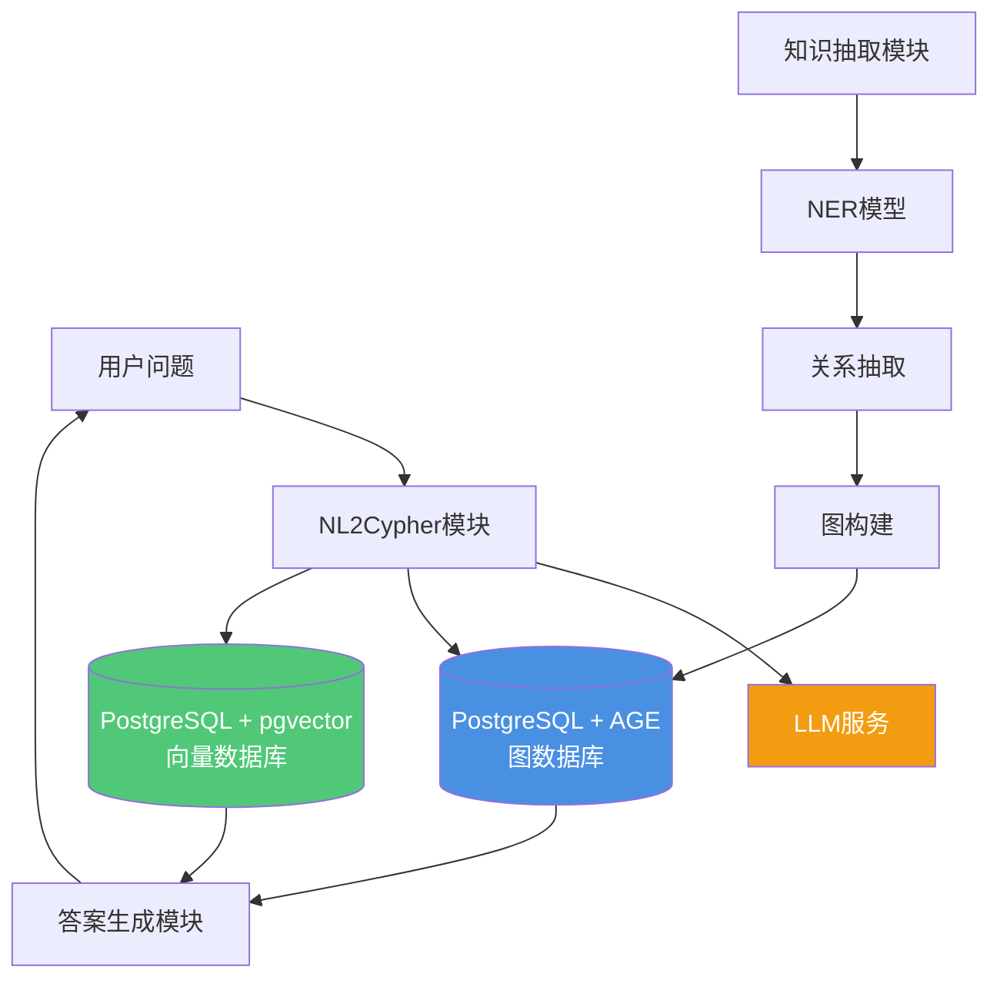
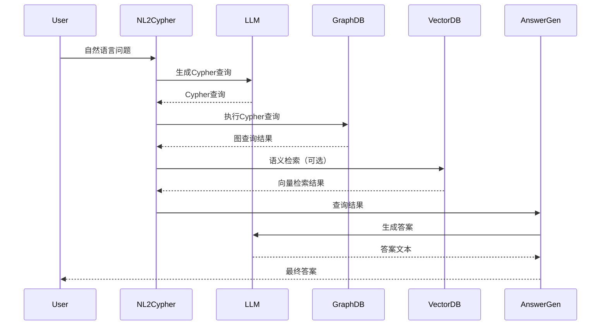
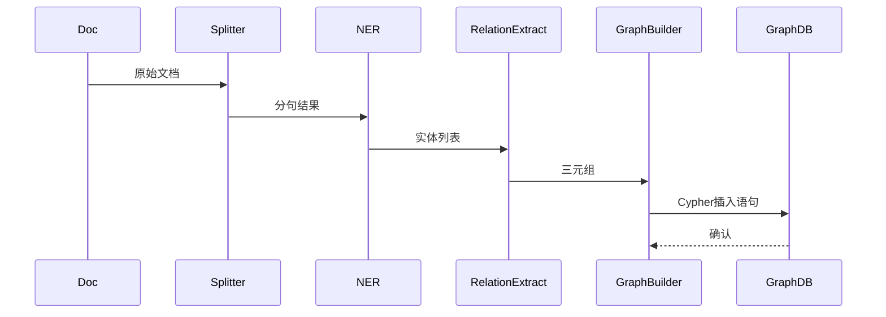
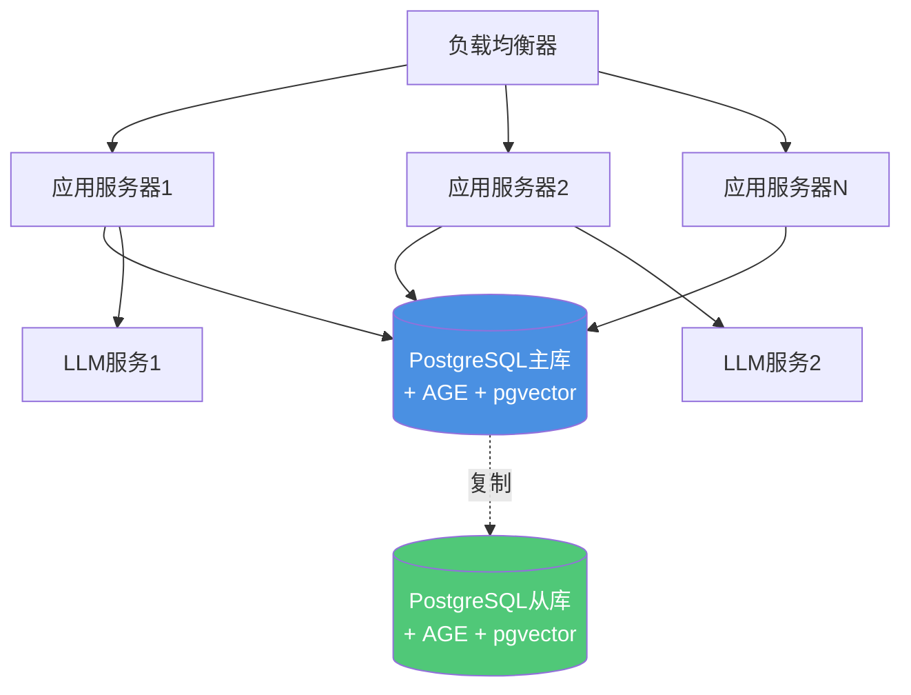

> **⚠️ 重要提示**: 本文档遵循案例文档通用模板格式。
>
> **推荐阅读**:
>
> - [案例文档通用模板](../案例文档通用模板.md) - 通用案例文档格式和最佳实践
>
> 本文档保留作为知识图谱问答系统的架构设计参考。

---

# 案例8：知识图谱问答系统 - 架构设计

> **文档编号**: CASE-08-02
> **最后更新**: 2025年1月
> **技术版本**: PostgreSQL 18+ / Apache AGE 1.5+

## 📑 目录

- [案例8：知识图谱问答系统 - 架构设计](#案例8知识图谱问答系统---架构设计)
  - [📑 目录](#-目录)
  - [1. 总体架构](#1-总体架构)
    - [1.1 系统架构图](#11-系统架构图)
    - [1.2 核心组件](#12-核心组件)
  - [2. 核心模块](#2-核心模块)
    - [2.1 知识抽取模块](#21-知识抽取模块)
    - [2.2 NL2Cypher模块](#22-nl2cypher模块)
    - [2.3 多跳推理](#23-多跳推理)
  - [3. 技术选型](#3-技术选型)
    - [3.1 图数据库选型](#31-图数据库选型)
    - [3.2 向量数据库集成](#32-向量数据库集成)
    - [3.3 LLM集成](#33-llm集成)
  - [4. 数据流设计](#4-数据流设计)
    - [4.1 查询流程](#41-查询流程)
    - [4.2 知识抽取流程](#42-知识抽取流程)
  - [5. 部署架构](#5-部署架构)
    - [5.1 部署架构图](#51-部署架构图)
    - [5.2 高可用配置](#52-高可用配置)
  - [6. 性能优化](#6-性能优化)
    - [6.1 图查询优化](#61-图查询优化)
    - [6.2 向量检索优化](#62-向量检索优化)

---

## 1. 总体架构

### 1.1 系统架构图

**知识图谱问答系统架构**：



**架构说明**：

```text
┌────────────────────────────────────────────────────┐
│          知识图谱问答系统架构                        │
├────────────────────────────────────────────────────┤
│                                                    │
│  [用户问题] → [NL2Cypher] → [图查询] → [答案生成]    │
│                    │             │                 │
│                 [LLM]      [PostgreSQL + AGE]      │
│                              ├─ 图数据              │
│                              └─ 向量索引            │
│                                                    │
│  [知识抽取] → [实体识别] → [关系抽取] → [图构建]      │
│                    │                               │
│               [NER Model]                          │
│                                                    │
└────────────────────────────────────────────────────┘
```

### 1.2 核心组件

**主要组件**：

| 组件 | 技术栈 | 功能 |
|------|--------|------|
| **NL2Cypher** | LLM (GPT-4) | 自然语言转Cypher查询 |
| **图数据库** | PostgreSQL + AGE | 图数据存储和查询 |
| **向量数据库** | PostgreSQL + pgvector | 语义检索 |
| **知识抽取** | NER模型 | 实体和关系抽取 |
| **答案生成** | LLM | 基于查询结果生成答案 |

---

## 2. 核心模块

### 2.1 知识抽取模块

**知识抽取流程**：

```python
# 知识抽取流程
文档 → 分句 → NER → 关系抽取 → 三元组
    ↓
(:Entity)-[:Relation]->(:Entity)
```

**实现示例**：

```python
# 1. 文档分句
def split_sentences(text):
    sentences = nltk.sent_tokenize(text)
    return sentences

# 2. 实体识别（NER）
def extract_entities(sentence):
    # 使用NER模型识别实体
    entities = ner_model.predict(sentence)
    return entities

# 3. 关系抽取
def extract_relations(sentence, entities):
    # 使用关系抽取模型
    relations = relation_model.predict(sentence, entities)
    return relations

# 4. 构建三元组
def build_triples(entities, relations):
    triples = []
    for relation in relations:
        triple = (relation.head, relation.type, relation.tail)
        triples.append(triple)
    return triples
```

**存储到图数据库**：

```cypher
// 创建实体节点
CREATE (e1:Entity {name: 'PostgreSQL', type: 'Database'})
CREATE (e2:Entity {name: 'pgvector', type: 'Extension'})

// 创建关系
CREATE (e1)-[:HAS_EXTENSION]->(e2)
```

### 2.2 NL2Cypher模块

**NL2Cypher流程**：

```text
问题分类 → 模板匹配 / LLM生成
    ↓
Cypher查询
    ↓
执行 + 结果解析
```

**模板匹配方式**：

```python
# 问题模板
templates = {
    "什么是X": "MATCH (n {name: $entity}) RETURN n",
    "X和Y的关系": "MATCH (a {name: $entity1})-[r]-(b {name: $entity2}) RETURN r",
    "X有哪些Y": "MATCH (a {name: $entity})-[r:RELATION_TYPE]->(b) RETURN b"
}

# 模板匹配
def match_template(question):
    for pattern, cypher_template in templates.items():
        if pattern_match(question, pattern):
            return fill_template(cypher_template, question)
    return None
```

**LLM生成方式**：

```python
# 使用LLM生成Cypher查询
def generate_cypher_with_llm(question, schema):
    prompt = f"""
    根据以下知识图谱schema，将自然语言问题转换为Cypher查询：

    Schema:
    {schema}

    问题: {question}

    Cypher查询:
    """

    response = llm.chat_complete(
        model='gpt-4',
        messages=[{'role': 'user', 'content': prompt}]
    )

    return extract_cypher(response.content)
```

### 2.3 多跳推理

**单跳查询**：

```cypher
// 1跳查询
MATCH (a:Entity {name: 'PostgreSQL'})-[r]->(b:Entity)
RETURN b, r
```

**多跳查询**：

```cypher
// 多跳（可变长度）
MATCH (a:Entity {name: 'PostgreSQL'})-[*1..3]->(b:Entity)
RETURN b

// 带过滤的多跳
MATCH path = (a:Entity {name: 'PostgreSQL'})-[*1..3]-(b:Entity)
WHERE all(r IN relationships(path) WHERE type(r) IN ['HAS_EXTENSION', 'SUPPORTS'])
RETURN b, path
```

**路径查询**：

```cypher
// 查找两个实体之间的路径
MATCH path = shortestPath(
    (a:Entity {name: 'PostgreSQL'})-[*]-(b:Entity {name: 'pgvector'})
)
RETURN path, length(path) AS hop_count
```

---

## 3. 技术选型

### 3.1 图数据库选型

**Apache AGE**：

**优势**：

- ✅ 基于PostgreSQL，SQL兼容
- ✅ Cypher查询语言
- ✅ 成熟稳定
- ✅ 与PostgreSQL生态集成

**安装配置**：

```sql
-- 安装AGE扩展（带错误处理）
DO $$
BEGIN
    BEGIN
        IF NOT EXISTS (SELECT 1 FROM pg_available_extensions WHERE name = 'age') THEN
            RAISE WARNING 'AGE扩展不可用，请先安装Apache AGE扩展';
            RETURN;
        END IF;
        
        CREATE EXTENSION IF NOT EXISTS age;
        RAISE NOTICE 'AGE扩展安装成功';
    EXCEPTION
        WHEN duplicate_object THEN
            RAISE NOTICE 'AGE扩展已存在';
        WHEN OTHERS THEN
            RAISE WARNING '安装AGE扩展失败: %', SQLERRM;
            RAISE;
    END;
END $$;

-- 创建图（带错误处理）
DO $$
BEGIN
    BEGIN
        IF EXISTS (SELECT 1 FROM ag_graph WHERE graphname = 'knowledge_graph') THEN
            RAISE NOTICE '图 knowledge_graph 已存在';
        ELSE
            PERFORM create_graph('knowledge_graph');
            RAISE NOTICE '图 knowledge_graph 创建成功';
        END IF;
    EXCEPTION
        WHEN OTHERS THEN
            RAISE WARNING '创建图失败: %', SQLERRM;
            RAISE;
    END;
END $$;

-- 使用图（带错误处理）
DO $$
BEGIN
    BEGIN
        SET graph_path = 'knowledge_graph';
        RAISE NOTICE 'graph_path设置成功: knowledge_graph';
    EXCEPTION
        WHEN OTHERS THEN
            RAISE WARNING '设置graph_path失败: %', SQLERRM;
            RAISE;
    END;
END $$;
```

**图数据模型**：

```cypher
// 实体节点
(:Entity {name: 'PostgreSQL', type: 'Database', description: '...'})
(:Entity {name: 'pgvector', type: 'Extension', version: '0.8.0'})

// 关系
(:Entity)-[:HAS_EXTENSION]->(:Entity)
(:Entity)-[:SUPPORTS]->(:Entity)
(:Entity)-[:RELATED_TO]->(:Entity)
```

### 3.2 向量数据库集成

**pgvector集成**：

```sql
-- 创建向量列（带错误处理）
DO $$
BEGIN
    BEGIN
        IF NOT EXISTS (SELECT 1 FROM information_schema.tables WHERE table_schema = 'public' AND table_name = 'entities') THEN
            RAISE WARNING '表 entities 不存在，无法添加向量列';
            RETURN;
        END IF;
        
        IF NOT EXISTS (SELECT 1 FROM information_schema.columns WHERE table_schema = 'public' AND table_name = 'entities' AND column_name = 'embedding') THEN
            ALTER TABLE entities ADD COLUMN embedding vector(1536);
            RAISE NOTICE '向量列 embedding 添加成功';
        ELSE
            RAISE NOTICE '向量列 embedding 已存在';
        END IF;
    EXCEPTION
        WHEN OTHERS THEN
            RAISE WARNING '添加向量列失败: %', SQLERRM;
            RAISE;
    END;
END $$;

-- 生成实体向量（带错误处理）
DO $$
BEGIN
    BEGIN
        IF NOT EXISTS (SELECT 1 FROM information_schema.tables WHERE table_schema = 'public' AND table_name = 'entities') THEN
            RAISE WARNING '表 entities 不存在，无法生成向量';
            RETURN;
        END IF;
        
        IF NOT EXISTS (SELECT 1 FROM pg_extension WHERE extname = 'pg_ai') THEN
            RAISE WARNING 'pg_ai扩展未安装，无法使用embedding_openai函数';
            RETURN;
        END IF;
        
        UPDATE entities
        SET embedding = ai.embedding_openai('text-embedding-3-small', COALESCE(name, '') || ' ' || COALESCE(description, ''))
        WHERE embedding IS NULL;
        
        RAISE NOTICE '实体向量生成成功';
    EXCEPTION
        WHEN OTHERS THEN
            RAISE WARNING '生成实体向量失败: %', SQLERRM;
            RAISE;
    END;
END $$;

-- 创建向量索引（带错误处理）
DO $$
BEGIN
    BEGIN
        IF NOT EXISTS (SELECT 1 FROM information_schema.tables WHERE table_schema = 'public' AND table_name = 'entities') THEN
            RAISE WARNING '表 entities 不存在，无法创建向量索引';
            RETURN;
        END IF;
        
        IF NOT EXISTS (SELECT 1 FROM pg_extension WHERE extname = 'vector') THEN
            RAISE WARNING 'pgvector扩展未安装，无法创建向量索引';
            RETURN;
        END IF;
        
        IF NOT EXISTS (SELECT 1 FROM pg_indexes WHERE tablename = 'entities' AND indexname LIKE '%embedding%') THEN
            CREATE INDEX ON entities USING hnsw(embedding vector_cosine_ops);
            RAISE NOTICE '向量索引创建成功';
        ELSE
            RAISE NOTICE '向量索引已存在';
        END IF;
    EXCEPTION
        WHEN duplicate_table THEN
            RAISE NOTICE '向量索引已存在';
        WHEN OTHERS THEN
            RAISE WARNING '创建向量索引失败: %', SQLERRM;
            RAISE;
    END;
END $$;
```

**混合查询**：

```sql
-- 图查询 + 向量搜索（带错误处理和性能测试）
-- 注意：此查询结合了SQL和Cypher语法，需要Apache AGE支持
DO $$
BEGIN
    BEGIN
        IF NOT EXISTS (SELECT 1 FROM information_schema.tables WHERE table_schema = 'public' AND table_name = 'entities') THEN
            RAISE WARNING '表 entities 不存在，无法执行混合查询';
            RETURN;
        END IF;
        
        IF NOT EXISTS (SELECT 1 FROM pg_extension WHERE extname = 'age') THEN
            RAISE WARNING 'AGE扩展未安装，无法执行图查询';
            RETURN;
        END IF;
        
        RAISE NOTICE '开始执行图查询 + 向量搜索';
    EXCEPTION
        WHEN OTHERS THEN
            RAISE WARNING '查询准备失败: %', SQLERRM;
    END;
END $$;

-- 注意：以下查询需要AGE扩展支持，实际执行时可能需要调整语法
-- EXPLAIN (ANALYZE, BUFFERS, TIMING)
-- WITH vector_results AS (
--     SELECT id, name
--     FROM entities
--     WHERE embedding <=> query_vec < 0.3
--     LIMIT 10
-- )
-- SELECT
--     e.id,
--     e.name,
--     e.type
-- FROM entities e
-- WHERE e.id IN (SELECT id FROM vector_results)
-- -- MATCH (e)-[r]->(related)  -- Cypher语法，需要在AGE上下文中执行
-- -- RETURN e, r, related;
```

### 3.3 LLM集成

**pg_ai集成**：

```sql
-- NL2Cypher函数（带完整错误处理）
CREATE OR REPLACE FUNCTION nl2cypher(p_question TEXT)
RETURNS TEXT AS $$
DECLARE
    v_schema TEXT;
    v_cypher TEXT;
BEGIN
    BEGIN
        -- 检查参数
        IF p_question IS NULL OR p_question = '' THEN
            RAISE EXCEPTION '问题不能为空';
        END IF;
        
        -- 检查扩展
        IF NOT EXISTS (SELECT 1 FROM pg_extension WHERE extname = 'age') THEN
            RAISE EXCEPTION 'AGE扩展未安装，无法执行图查询';
        END IF;
        
        IF NOT EXISTS (SELECT 1 FROM pg_extension WHERE extname = 'pg_ai') THEN
            RAISE EXCEPTION 'pg_ai扩展未安装，无法使用LLM功能';
        END IF;
        
        -- 获取图schema（注意：实际实现需要根据AGE的API调整）
        -- SELECT string_agg(DISTINCT label, ', ')
        -- INTO v_schema
        -- FROM (
        --     SELECT DISTINCT label(n) AS label
        --     FROM (MATCH (n) RETURN n) AS nodes
        -- ) AS labels;
        
        -- 简化版本：使用固定schema或从配置表获取
        v_schema := 'Entity, Relation';  -- 示例schema
        
        -- 使用LLM生成Cypher
        SELECT ai.chat_complete(
            'gpt-4',
            format('Convert to Cypher: %s\nSchema: %s', p_question, v_schema)
        ) INTO v_cypher;
        
        IF v_cypher IS NULL OR v_cypher = '' THEN
            RAISE EXCEPTION 'LLM生成Cypher查询失败';
        END IF;
        
        RETURN v_cypher;
    EXCEPTION
        WHEN OTHERS THEN
            RAISE WARNING 'NL2Cypher函数执行失败: %', SQLERRM;
            RAISE;
    END;
END;
$$ LANGUAGE plpgsql;
```

---

## 4. 数据流设计

### 4.1 查询流程

**查询数据流**：



### 4.2 知识抽取流程

**知识抽取数据流**：



---

## 5. 部署架构

### 5.1 部署架构图

**生产部署架构**：



### 5.2 高可用配置

**主从复制**：

```sql
-- 主库配置
ALTER SYSTEM SET wal_level = replica;
ALTER SYSTEM SET max_wal_senders = 3;

-- 从库配置
-- primary_conninfo = 'host=primary port=5432 user=replicator'
```

**负载均衡**：

```yaml
# HAProxy配置
backend postgresql_backend
    balance roundrobin
    option pgsql-check user postgres
    server pg1 primary:5432 check
    server pg2 standby:5432 check backup
```

---

## 6. 性能优化

### 6.1 图查询优化

**索引优化**：

```cypher
// 创建实体索引
CREATE INDEX ON :Entity(name);
CREATE INDEX ON :Entity(type);

// 创建关系索引
CREATE INDEX ON :HAS_EXTENSION();
```

**查询优化**：

```cypher
// 优化前：全图扫描
MATCH (n)-[r]->(m) WHERE n.name = 'PostgreSQL' RETURN m

// 优化后：使用索引
MATCH (n:Entity {name: 'PostgreSQL'})-[r]->(m) RETURN m
```

### 6.2 向量检索优化

**混合检索**：

```sql
-- 先向量检索，再图查询
WITH vector_candidates AS (
    SELECT id, name
    FROM entities
    WHERE embedding <=> query_vec < 0.3
    LIMIT 20
)
SELECT
    e.id,
    e.name,
    e.type
FROM entities e
WHERE e.id IN (SELECT id FROM vector_candidates)
-- 然后执行图查询
```

---

**最后更新**: 2025年1月
**文档编号**: CASE-08-02
**维护者**: PostgreSQL Modern Team
**返回**: [案例8主页](./README.md)
