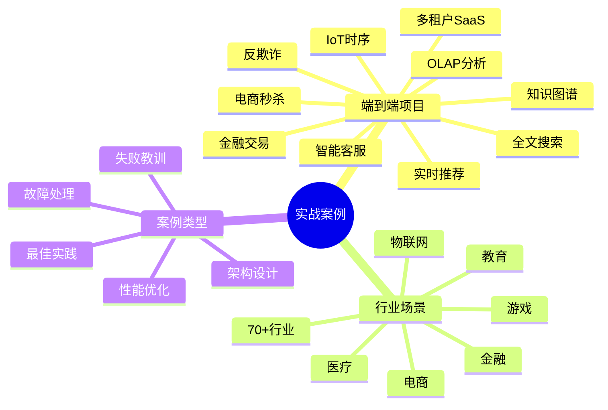
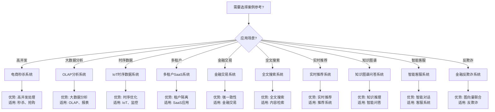

---

> **📋 文档来源**: `PostgreSQL\cases\README.md`
> **📅 复制日期**: 2025-12-22
> **⚠️ 注意**: 本文档为复制版本，原文件保持不变

---

# 19-实战案例

> **文档总数**: 150+个案例文档
> **覆盖场景**: 70+个行业场景
> **版本覆盖**: PostgreSQL 18.x (推荐) ⭐ | 17.x (推荐) | 16.x (兼容)
> **最后更新**: 2025年1月

---

## 📊 知识体系思维导图

---

## 📊 案例选型决策树

---

## 📊 案例类型对比矩阵

| 案例类型 | 复杂度 | 技术栈 | 适用场景 | 学习价值 |
| --- | --- | --- | --- | --- |
| **端到端项目** | ⭐⭐⭐⭐⭐ | 完整技术栈 | 完整系统实现 | ⭐⭐⭐⭐⭐ |
| **行业场景** | ⭐⭐⭐⭐ | 行业特定 | 行业应用 | ⭐⭐⭐⭐ |
| **架构设计** | ⭐⭐⭐ | 架构模式 | 系统设计 | ⭐⭐⭐⭐ |
| **性能优化** | ⭐⭐⭐⭐ | 优化技术 | 性能提升 | ⭐⭐⭐⭐⭐ |
| **故障处理** | ⭐⭐⭐ | 诊断方法 | 问题解决 | ⭐⭐⭐⭐ |

---

## 📚 通用文档与模板

### 推荐系统

- **[通用推荐系统架构](./通用推荐系统架构.md)** - 统一推荐系统架构和最佳实践
- **[智能视频推荐系统-详细实现](./视频场景/智能视频推荐系统-详细实现.md)** - 视频场景特定实现
- **[智能音乐推荐系统-详细实现](./音乐场景/智能音乐推荐系统-详细实现.md)** - 音乐场景特定实现

### 生产系统

- **[通用智能生产系统架构](./通用智能生产系统架构.md)** - 统一智能生产系统架构和最佳实践

### 案例文档

- **[案例文档通用模板](./案例文档通用模板.md)** - 统一案例文档格式和结构

### 大型项目案例

- **[千万级用户系统案例.md](./千万级用户系统案例.md)** ⭐⭐⭐⭐⭐ - 千万级用户系统架构和优化

### 行业完整案例

- **[金融行业完整案例.md](./金融行业完整案例.md)** ⭐⭐⭐⭐⭐ - 金融行业完整案例（交易系统、反欺诈、风控）
- **[电商行业完整案例.md](./电商行业完整案例.md)** ⭐⭐⭐⭐⭐ - 电商行业完整案例（秒杀、搜索、推荐）
- **[物联网行业完整案例.md](./物联网行业完整案例.md)** ⭐⭐⭐⭐⭐ - 物联网行业完整案例（传感器数据、设备监控、实时告警）
- **[游戏行业完整案例.md](./游戏行业完整案例.md)** ⭐⭐⭐⭐ - 游戏行业完整案例（玩家系统、排行榜、行为分析）
- **[医疗行业完整案例.md](./医疗行业完整案例.md)** ⭐⭐⭐⭐ - 医疗行业完整案例（电子病历、临床决策、知识图谱）
- **[教育行业完整案例.md](./教育行业完整案例.md)** ⭐⭐⭐⭐ - 教育行业完整案例（在线学习、智能推荐、学习分析）

### 失败案例与教训

- **[常见错误与教训.md](./常见错误与教训.md)** ⭐⭐⭐⭐ - 常见错误和预防方法
- **[失败案例库.md](./失败案例库.md)** ⭐⭐⭐⭐ - 失败案例和经验教训

---

## 📋 案例分类

### 端到端项目案例

1. **[01-电商秒杀系统](./01-电商秒杀系统/)** - 高并发秒杀系统完整实现
2. **[02-OLAP分析系统](./02-OLAP分析系统/)** - 大数据分析系统
3. **[03-IoT时序数据系统](./03-IoT时序数据系统/)** - 物联网时序数据处理
4. **[04-多租户SaaS系统](./04-多租户SaaS系统/)** - 多租户架构设计
5. **[05-金融交易系统](./05-金融交易系统/)** - 金融交易系统实现
6. **[06-全文搜索系统](./06-全文搜索系统/)** - 全文搜索系统
7. **[07-实时推荐系统](./07-实时推荐系统/)** - 实时推荐系统
8. **[08-知识图谱问答系统](./08-知识图谱问答系统/)** - 知识图谱问答
9. **[09-智能客服系统](./09-智能客服系统/)** - 智能客服系统
10. **[10-金融反欺诈系统](./10-金融反欺诈系统/)** - 金融反欺诈系统

### 行业场景案例

- **电商场景** - 个性化推荐、商品搜索、转化率优化
- **金融场景** - 实时反欺诈、智能风控、图向量联合查询
- **视频场景** - 智能视频推荐系统
- **音乐场景** - 智能音乐推荐系统
- **生产场景** - 智能生产管理系统
- **纺织场景** - 智能纺织生产系统
- **钢铁场景** - 智能钢铁生产系统
- **石油场景** - 智能油田管理系统
- **服装场景** - 智能服装设计系统
- **医疗场景** - 临床决策支持、医学知识图谱
- **教育场景** - 智能学习推荐系统
- **交通场景** - 智能交通管理系统
- **物流场景** - 智能路径优化系统
- **能源场景** - 智能电网监控系统
- **更多场景** - 70+个行业场景案例

---

## 📊 案例文档结构

所有案例文档遵循 **[案例文档通用模板](./案例文档通用模板.md)** 的标准结构：

- **01-需求分析.md** - 业务背景和需求
- **02-架构设计.md** - 系统架构设计
- **03-数据库设计.md** - 数据模型设计
- **04-核心实现.md** - 关键功能实现
- **05-性能测试.md** - 性能测试结果
- **06-部署运维.md** - 部署和运维（可选）

---

## 🔗 相关文档

- [性能问题-案例库](./性能问题-案例库.md) - 问题→证据→变更→效果→防再发
- [应用场景总览](./应用场景总览.md) - 所有场景概览

---

**最后更新**: 2025年1月
