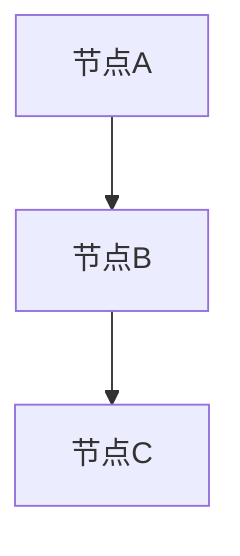

# 案例文档通用模板

> **创建日期**: 2025年1月
> **用途**: 统一案例文档格式，适用于各种实战案例
> **来源**: 基于多个案例文档的结构分析
> **最后更新**: 2025年1月

## 📑 目录

- [1. 文档说明](#1-文档说明)
- [2. 案例文档标准结构](#2-案例文档标准结构)
- [3. 模板使用说明](#3-模板使用说明)
- [4. 案例特定文档](#4-案例特定文档)
- [5. 文档编写指南](#5-文档编写指南)
- [6. 质量检查清单](#6-质量检查清单)

---

## 1. 文档说明

**本文档提供了案例文档的通用模板结构**，各具体案例应遵循此格式，但保留各自特定的业务内容和技术实现。

**适用场景**:

- 电商秒杀系统
- OLAP分析系统
- IoT时序数据系统
- 多租户SaaS系统
- 金融交易系统
- 全文搜索系统
- 实时推荐系统
- 知识图谱问答系统
- 智能客服系统
- 金融反欺诈系统
- 其他业务场景案例

**文档目标**：

- ✅ 统一文档格式
- ✅ 提升文档质量
- ✅ 便于维护和查找
- ✅ 促进知识分享

---

## 2. 案例文档标准结构

### 2.1 需求分析 (01-需求分析.md)

**标准内容**:

**1. 业务背景**：

- 业务概述
- 业务价值
- 业务规模

**2. 核心需求**：

- 功能需求
- 性能需求
- 可用性需求

**3. 功能需求**：

- 核心功能列表
- 功能详细说明
- 功能优先级

**4. 非功能需求**：

- 性能指标
- 可用性指标
- 可扩展性指标

**5. 约束条件**：

- 技术约束
- 业务约束
- 合规约束

**模板示例**：

```markdown
# 案例X：系统名称 - 需求分析

## 1. 业务背景

### 1.1 业务概述
[业务概述内容]

### 1.2 业务价值
[业务价值说明]

## 2. 核心需求

[核心需求列表]

## 3. 功能需求

[功能需求详细说明]

## 4. 非功能需求

[非功能需求说明]

## 5. 约束条件

[约束条件说明]
```

### 2.2 架构设计 (02-架构设计.md)

**标准内容**:

**1. 总体架构**：

- 架构图
- 架构说明
- 核心组件

**2. 核心模块**：

- 模块划分
- 模块职责
- 模块交互

**3. 技术选型**：

- 数据库选型
- 中间件选型
- 工具选型

**4. 数据流设计**：

- 数据流向
- 数据格式
- 数据同步

**5. 部署架构**：

- 部署拓扑
- 高可用设计
- 扩展性设计

**模板示例**：

```markdown
# 案例X：系统名称 - 架构设计

## 1. 总体架构

```mermaid
graph TB
    [架构图]
```

## 2. 核心模块

[模块说明]

## 3. 技术选型

[技术选型说明]

## 4. 数据流设计

[数据流说明]

## 5. 部署架构

[部署架构说明]

```

### 2.3 数据库设计 (03-数据库设计.md)

**标准内容**:

**1. 数据模型**：
- ER图
- 数据模型说明
- 实体关系

**2. 表结构设计**：
- 表定义
- 字段说明
- 数据类型

**3. 索引设计**：
- 索引类型
- 索引策略
- 索引优化

**4. 分区策略**：
- 分区方案
- 分区键选择
- 分区维护

**5. 数据关系**：
- 外键关系
- 约束条件
- 数据完整性

**模板示例**：

```markdown
# 案例X：系统名称 - 数据库设计

## 1. 数据模型

```mermaid
erDiagram
    [ER图]
```

## 2. 表结构设计

```sql
CREATE TABLE table_name (
    ...
);
```

## 3. 索引设计

[索引设计说明]

## 4. 分区策略

[分区策略说明]

## 5. 数据关系

[数据关系说明]

```

### 2.4 核心实现 (04-核心实现.md)

**标准内容**:

**1. 关键功能实现**：
- 功能说明
- 实现方案
- 代码示例

**2. 核心算法**：
- 算法说明
- 算法实现
- 算法优化

**3. 代码示例**：
- SQL代码
- 函数/存储过程
- 触发器

**4. 实现细节**：
- 技术细节
- 注意事项
- 最佳实践

**模板示例**：

```markdown
# 案例X：系统名称 - 核心实现

## 1. 关键功能实现

[功能实现说明]

```sql
-- 代码示例
```

## 2. 核心算法

[算法说明]

## 3. 代码示例

[代码示例]

## 4. 实现细节

[实现细节说明]

```

### 2.5 性能测试 (05-性能测试.md)

**标准内容**:

**1. 测试场景**：
- 测试用例
- 测试数据
- 测试环境

**2. 性能指标**：
- 关键指标
- 目标值
- 实际值

**3. 测试结果**：
- 测试数据
- 性能分析
- 瓶颈识别

**4. 优化建议**：
- 优化方向
- 优化措施
- 优化效果

**模板示例**：

```markdown
# 案例X：系统名称 - 性能测试

## 1. 测试场景

[测试场景说明]

## 2. 性能指标

| 指标 | 目标值 | 实际值 |
|------|--------|--------|
| ... | ... | ... |

## 3. 测试结果

[测试结果说明]

## 4. 优化建议

[优化建议说明]
```

### 2.6 部署运维 (06-部署运维.md) (可选)

**标准内容**:

**1. 部署方案**：

- 部署架构
- 部署步骤
- 配置说明

**2. 监控配置**：

- 监控指标
- 告警规则
- 监控面板

**3. 运维手册**：

- 日常运维
- 故障处理
- 备份恢复

**4. 故障处理**：

- 常见故障
- 处理流程
- 应急预案

---

## 3. 模板使用说明

### 3.1 使用原则

**遵循标准结构**：

- ✅ 使用上述标准文档结构
- ✅ 保持文档格式一致
- ✅ 使用统一的Markdown格式

**保留特定内容**：

- ✅ 各案例保留业务特定的实现细节
- ✅ 保留技术特定的优化方案
- ✅ 保留实际案例数据

**统一格式**：

- ✅ 使用统一的Markdown格式和代码风格
- ✅ 使用统一的图表格式（Mermaid）
- ✅ 使用统一的代码示例格式

**交叉引用**：

- ✅ 在README中链接到各子文档
- ✅ 文档间相互引用
- ✅ 引用相关技术文档

### 3.2 文档命名规范

**文件命名**：

- `01-需求分析.md`
- `02-架构设计.md`
- `03-数据库设计.md`
- `04-核心实现.md`
- `05-性能测试.md`
- `06-部署运维.md`（可选）

**目录结构**：

```
案例名称/
├── README.md
├── 01-需求分析.md
├── 02-架构设计.md
├── 03-数据库设计.md
├── 04-核心实现.md
├── 05-性能测试.md
└── 06-部署运维.md（可选）
```

---

## 4. 案例特定文档

### 4.1 案例列表

对于特定场景的详细实现，请参考各案例目录下的具体文档：

- **电商秒杀系统**: `01-电商秒杀系统/`
- **OLAP分析系统**: `02-OLAP分析系统/`
- **IoT时序数据系统**: `03-IoT时序数据系统/`
- **多租户SaaS系统**: `04-多租户SaaS系统/`
- **金融交易系统**: `05-金融交易系统/`
- **全文搜索系统**: `06-全文搜索系统/`
- **实时推荐系统**: `07-实时推荐系统/`
- **知识图谱问答系统**: `08-知识图谱问答系统/`
- **智能客服系统**: `09-智能客服系统/`
- **金融反欺诈系统**: `10-金融反欺诈系统/`

### 4.2 案例分类

**按业务领域分类**：

- 电商场景
- 金融场景
- 医疗场景
- 教育场景
- IoT场景
- 其他场景

**按技术特点分类**：

- 高并发场景
- 大数据场景
- 实时处理场景
- AI/ML场景
- 多模态场景

---

## 5. 文档编写指南

### 5.1 内容要求

**概述部分**（200-300字）：

- 主题介绍
- 核心价值
- 适用场景

**技术内容**（500-1000字）：

- 架构设计
- 实现方案
- 代码示例
- 配置说明

**实践案例**（300-500字）：

- 实际应用场景
- 性能数据
- 最佳实践

**总结与参考**（100-200字）：

- 关键要点
- 相关资源

**目标行数**: 每个文件至少300-500行实际内容

### 5.2 代码示例规范

**SQL代码**：

```sql
-- 代码注释说明
CREATE TABLE example (
    id SERIAL PRIMARY KEY,
    name TEXT NOT NULL,
    created_at TIMESTAMPTZ DEFAULT NOW()
);

-- 使用示例
INSERT INTO example (name) VALUES ('test');
SELECT * FROM example WHERE id = 1;
```

**Python代码**：

```python
# 代码注释说明
def example_function(param):
    """函数说明"""
    result = process(param)
    return result
```

### 5.3 图表规范

**Mermaid图表**：



**表格规范**：

| 列1 | 列2 | 列3 |
|-----|-----|-----|
| 数据1 | 数据2 | 数据3 |

---

## 6. 质量检查清单

### 6.1 内容检查

**内容完整性**：

- [ ] 概述部分完整
- [ ] 技术内容详细
- [ ] 代码示例完整
- [ ] 实践案例真实

**内容准确性**：

- [ ] 技术信息准确
- [ ] 代码可运行
- [ ] 数据真实可靠
- [ ] 引用正确

### 6.2 格式检查

**格式规范**：

- [ ] Markdown格式正确
- [ ] 代码格式统一
- [ ] 图表格式正确
- [ ] 链接有效

**结构规范**：

- [ ] 目录结构完整
- [ ] 章节层次清晰
- [ ] 交叉引用正确

### 6.3 质量检查

**质量标准**：

- [ ] 文档行数 >= 300行
- [ ] H3标题数 >= 10个
- [ ] 代码示例 >= 5个
- [ ] 图表 >= 2个

---

**最后更新**: 2025年1月
**状态**: 通用模板文档
**维护者**: PostgreSQL Modern Team
