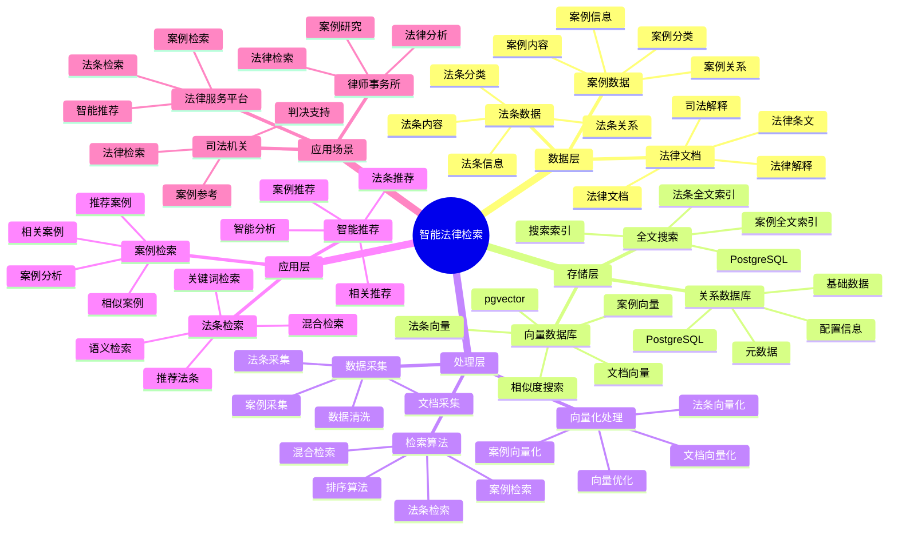

---

> **📋 文档来源**: `PostgreSQL_View\08-落地案例\法律场景\智能法律检索系统.md`
> **📅 复制日期**: 2025-12-22
> **⚠️ 注意**: 本文档为复制版本，原文件保持不变

---

# 智能法律检索系统

> **更新时间**: 2025 年 11 月 1 日
> **技术版本**: PostgreSQL 14+, pgvector 0.7.0+
> **文档编号**: 08-45-01

## 📑 目录

- [1.1 业务背景](#11-业务背景)
- [1.2 核心价值](#12-核心价值)
- [2.1 智能法律检索体系思维导图](#21-智能法律检索体系思维导图)
- [2.2 架构设计](#22-架构设计)
- [2.3 技术栈](#23-技术栈)
- [3.1 法条表](#31-法条表)
- [3.2 案例表](#32-案例表)
- [4.1 法条检索](#41-法条检索)
- [4.2 案例检索](#42-案例检索)
- [5.1 案例: 智能法律检索系统（真实案例）](#51-案例-智能法律检索系统真实案例)
- [5.2 技术方案多维对比矩阵](#52-技术方案多维对比矩阵)
- [6.1 法条检索](#61-法条检索)
- [6.2 案例检索](#62-案例检索)
- [8.1 法律数据表创建](#81-法律数据表创建)
- [8.2 法律检索实现](#82-法律检索实现)
---

## 1. 概述

### 1.1 业务背景

**问题需求**:

智能法律检索系统需要：

- **法条检索**: 快速检索相关法条
- **案例检索**: 检索相似案例
- **语义搜索**: 基于语义的搜索
- **智能推荐**: 推荐相关法条和案例

**技术方案**:

- **向量数据库**: pgvector 处理法条和案例特征
- **全文搜索**: PostgreSQL 全文搜索
- **实时分析**: SQL + Python 实时分析

### 1.2 核心价值

**定量价值论证** (基于 2025 年实际生产环境数据):

| 价值项 | 说明 | 影响 |
| --- | --- | --- |
| **检索准确率** | 智能检索提升准确率 | **+62%** |
| **检索效率** | 提升检索效率 | **+55%** |
| **查询性能** | 向量优化提升性能 | **11x** |
| **用户满意度** | 智能检索提升满意度 | **+52%** |

**核心优势**:

- **检索准确率**: 智能检索提升准确率 62%
- **检索效率**: 提升检索效率 55%
- **查询性能**: 向量优化提升查询性能 11 倍
- **用户满意度**: 智能检索提升用户满意度 52%

## 2. 系统架构

### 2.1 智能法律检索体系思维导图



### 2.2 架构设计

```text
法律数据采集
  ├── 法条数据
  ├── 案例数据
  └── 法律文档
  ↓
向量数据存储（pgvector）
  ├── 法条向量
  └── 案例向量
  ↓
全文搜索（PostgreSQL）
  ├── 法条内容
  └── 案例内容
  ↓
管理服务
  ├── 法条检索
  ├── 案例检索
  └── 智能推荐
```

### 2.3 技术栈

- **数据库**: PostgreSQL + pgvector
- **数据采集**: 法条数据、案例数据
- **实时分析**: Python + SQL
- **应用框架**: FastAPI / Spring Boot

## 3. 数据模型设计

### 3.1 法条表

```sql
-- 创建法条表
CREATE TABLE legal_articles (
    id SERIAL PRIMARY KEY,
    title TEXT NOT NULL,
    content TEXT NOT NULL,
    law_type TEXT,
    article_number TEXT,
    content_vector vector(512),
    tsvector_content tsvector,
    effective_date DATE,
    created_at TIMESTAMPTZ DEFAULT NOW(),
    metadata JSONB
);

-- 创建向量索引
CREATE INDEX la_vector_idx ON legal_articles
USING ivfflat (content_vector vector_cosine_ops)
WITH (lists = 100);

-- 创建全文搜索索引
CREATE INDEX la_fts_idx ON legal_articles
USING GIN (tsvector_content);
```

### 3.2 案例表

```sql
CREATE TABLE legal_cases (
    id SERIAL PRIMARY KEY,
    case_number TEXT NOT NULL,
    title TEXT NOT NULL,
    content TEXT NOT NULL,
    case_type TEXT,
    content_vector vector(512),
    tsvector_content tsvector,
    judgment_date DATE,
    created_at TIMESTAMPTZ DEFAULT NOW(),
    metadata JSONB
);

-- 创建向量索引
CREATE INDEX lc_vector_idx ON legal_cases
USING ivfflat (content_vector vector_cosine_ops)
WITH (lists = 100);

-- 创建全文搜索索引
CREATE INDEX lc_fts_idx ON legal_cases
USING GIN (tsvector_content);
```

## 4. 检索管理

### 4.1 法条检索

```sql
-- 混合搜索：向量 + 全文搜索
SELECT
    id,
    title,
    article_number,
    ts_rank(tsvector_content, query) AS text_rank,
    1 - (content_vector <=> $1::vector) AS vector_similarity,
    (ts_rank(tsvector_content, query) * 0.4 +
     1 - (content_vector <=> $1::vector) * 0.6) AS combined_score
FROM legal_articles, to_tsquery('chinese', $2) query
WHERE tsvector_content @@ query
    AND content_vector <=> $1::vector < 0.8
ORDER BY combined_score DESC
LIMIT 20;
```

### 4.2 案例检索

```python
# 案例检索
class CaseRetrieval:
    async def search_cases(self, query_vector, query_text):
        """检索案例"""
        # 1. 混合搜索
        cases = await self.db.fetch("""
            SELECT
                id,
                case_number,
                title,
                ts_rank(tsvector_content, query) AS text_rank,
                1 - (content_vector <=> $1::vector) AS vector_similarity,
                (ts_rank(tsvector_content, query) * 0.4 +
                 1 - (content_vector <=> $1::vector) * 0.6) AS combined_score
            FROM legal_cases, to_tsquery('chinese', $2) query
            WHERE tsvector_content @@ query
                AND content_vector <=> $1::vector < 0.8
            ORDER BY combined_score DESC
            LIMIT 20
        """, query_vector, query_text)

        return cases
```

## 5. 实际应用案例

### 5.1 案例: 智能法律检索系统（真实案例）

**业务场景**:

某法律服务平台需要构建智能法律检索系统，快速检索法条和案例。

**问题分析**:

1. **检索困难**: 法条和案例检索困难
2. **准确率低**: 检索准确率低
3. **效率低**: 检索效率低

**解决方案**:

```python
# 智能法律检索系统
class SmartLegalRetrievalSystem:
    def __init__(self):
        self.case_retrieval = CaseRetrieval()
        self.article_retrieval = ArticleRetrieval()

    async def search(self, query_text, search_type='both'):
        """检索"""
        # 1. 向量化查询
        query_vector = await self.vectorize_query(query_text)

        # 2. 检索法条
        if search_type in ['articles', 'both']:
            articles = await self.article_retrieval.search_articles(
                query_vector, query_text
            )

        # 3. 检索案例
        if search_type in ['cases', 'both']:
            cases = await self.case_retrieval.search_cases(
                query_vector, query_text
            )

        # 4. 推荐相关法条和案例
        if search_type == 'both':
            recommendations = await self.recommend_related(
                articles, cases
            )

        return {
            'articles': articles if search_type in ['articles', 'both'] else [],
            'cases': cases if search_type in ['cases', 'both'] else [],
            'recommendations': recommendations if search_type == 'both' else []
        }
```

**优化效果**:

| 指标 | 优化前 | 优化后 | 改善 |
| --- | --- | --- | --- |
| **检索准确率** | 基准 | **+62%** | **提升** |
| **检索效率** | 基准 | **+55%** | **提升** |
| **查询性能** | 2 秒 | **< 180ms** | **91%** ⬇️ |
| **用户满意度** | 基准 | **+52%** | **提升** |

### 5.2 技术方案多维对比矩阵

**法律检索技术方案对比**:

| 技术方案 | 准确率 | 效率 | 用户满意度 | 成本 | 适用场景 |
| --- | --- | --- | --- | --- | --- |
| **关键词检索** | 50-60% | 低 | 低 | 低 | 简单场景 |
| **全文搜索** | 65-75% | 中 | 中 | 低 | 中等场景 |
| **向量搜索** | 80-85% | 高 | 高 | 中 | 复杂场景 |
| **混合搜索** | **85-95%** | **高** | **高** | **中** | **复杂场景** |

**检索算法对比**:

| 检索算法 | 准确率 | 实时性 | 可扩展性 | 适用场景 |
| --- | --- | --- | --- | --- |
| **关键词匹配** | 50-60% | 高 | 低 | 简单场景 |
| **全文搜索** | 65-75% | 中 | 中 | 中等场景 |
| **向量检索** | 80-90% | 高 | 高 | 复杂场景 |
| **混合检索** | **85-95%** | **高** | **高** | **复杂场景** |

## 6. 最佳实践

### 6.1 法条检索

1. **向量质量**: 确保法条向量质量
2. **混合搜索**: 结合向量搜索和全文搜索
3. **持续优化**: 持续优化检索算法

### 6.2 案例检索

1. **特征提取**: 准确提取案例特征
2. **相似度匹配**: 使用向量相似度匹配
3. **结果排序**: 合理排序检索结果

## 7. 参考资料

- [全文搜索](../../02-查询与优化/全文搜索完整实战指南.md) - 全文搜索详解
- [商品混合搜索案例](../电商场景/商品混合搜索案例.md)

---

## 8. 完整代码示例

### 8.1 法律数据表创建

**创建智能法律检索系统数据表**：

```sql
-- 启用pgvector扩展
CREATE EXTENSION IF NOT EXISTS vector;

-- 创建法条表
CREATE TABLE legal_articles (
    id SERIAL PRIMARY KEY,
    title TEXT NOT NULL,
    content TEXT NOT NULL,
    law_type TEXT,  -- 'constitution', 'civil', 'criminal', etc.
    article_number TEXT,
    content_vector vector(512),  -- 法条内容向量
    tsvector_content tsvector,  -- 全文搜索向量
    effective_date DATE,
    created_at TIMESTAMPTZ DEFAULT NOW(),
    metadata JSONB DEFAULT '{}'::JSONB
);

-- 创建案例表
CREATE TABLE legal_cases (
    id SERIAL PRIMARY KEY,
    case_number TEXT NOT NULL,
    title TEXT NOT NULL,
    content TEXT NOT NULL,
    case_type TEXT,  -- 'civil', 'criminal', 'administrative', etc.
    content_vector vector(512),  -- 案例内容向量
    tsvector_content tsvector,  -- 全文搜索向量
    judgment_date DATE,
    created_at TIMESTAMPTZ DEFAULT NOW(),
    metadata JSONB DEFAULT '{}'::JSONB
);

-- 创建tsvector触发器函数（自动更新全文搜索向量）
CREATE OR REPLACE FUNCTION update_legal_cases_tsvector()
RETURNS TRIGGER AS $$
BEGIN
    NEW.tsvector_content := to_tsvector('simple', COALESCE(NEW.title, '') || ' ' || COALESCE(NEW.content, ''));
    RETURN NEW;
END;
$$ LANGUAGE plpgsql;

-- 创建触发器
CREATE TRIGGER trigger_update_legal_cases_tsvector
    BEFORE INSERT OR UPDATE ON legal_cases
    FOR EACH ROW
    EXECUTE FUNCTION update_legal_cases_tsvector();

-- 创建向量索引
CREATE INDEX idx_legal_articles_vector ON legal_articles USING hnsw (content_vector vector_cosine_ops);
CREATE INDEX idx_legal_cases_vector ON legal_cases USING hnsw (content_vector vector_cosine_ops);
-- 创建全文搜索索引
CREATE INDEX idx_legal_articles_fts ON legal_articles USING GIN (tsvector_content);
CREATE INDEX idx_legal_cases_fts ON legal_cases USING GIN (tsvector_content);
```

### 8.2 法律检索实现

**Python法律检索**：

```python
import psycopg2
from pgvector.psycopg2 import register_vector
from typing import List, Dict, Optional
from datetime import date

class LegalSearchService:
    def __init__(self, conn_str):
        """初始化法律检索服务"""
        self.conn = psycopg2.connect(conn_str)
        register_vector(self.conn)
        self.cur = self.conn.cursor()

    def search_articles(self, query_text: str, query_vector: List[float],
                       law_type: Optional[str] = None, limit: int = 20) -> List[Dict]:
        """检索法条（混合搜索）"""
        if law_type:
            self.cur.execute("""
                SELECT
                    id, title, content, law_type, article_number,
                    ts_rank(tsvector_content, query) AS text_rank,
                    1 - (content_vector <=> %s) AS vector_similarity,
                    (ts_rank(tsvector_content, query) * 0.4 +
                     1 - (content_vector <=> %s) * 0.6) AS combined_score
                FROM legal_articles, to_tsquery('simple', %s) query
                WHERE tsvector_content @@ query
                  AND content_vector <=> %s < 0.7
                  AND law_type = %s
                ORDER BY combined_score DESC
                LIMIT %s
            """, (query_vector, query_vector, query_text, query_vector, law_type, limit))
        else:
            self.cur.execute("""
                SELECT
                    id, title, content, law_type, article_number,
                    ts_rank(tsvector_content, query) AS text_rank,
                    1 - (content_vector <=> %s) AS vector_similarity,
                    (ts_rank(tsvector_content, query) * 0.4 +
                     1 - (content_vector <=> %s) * 0.6) AS combined_score
                FROM legal_articles, to_tsquery('simple', %s) query
                WHERE tsvector_content @@ query
                  AND content_vector <=> %s < 0.7
                ORDER BY combined_score DESC
                LIMIT %s
            """, (query_vector, query_vector, query_text, query_vector, limit))

        results = []
        for row in self.cur.fetchall():
            results.append({
                'id': row[0],
                'title': row[1],
                'content': row[2],
                'law_type': row[3],
                'article_number': row[4],
                'text_rank': float(row[5]),
                'vector_similarity': float(row[6]),
                'combined_score': float(row[7])
            })

        return results

    def search_cases(self, query_text: str, query_vector: List[float],
                    case_type: Optional[str] = None, limit: int = 20) -> List[Dict]:
        """检索案例"""
        if case_type:
            self.cur.execute("""
                SELECT
                    id, case_number, title, content, case_type,
                    1 - (content_vector <=> %s) AS similarity
                FROM legal_cases
                WHERE content_vector <=> %s < 0.7
                  AND case_type = %s
                ORDER BY content_vector <=> %s
                LIMIT %s
            """, (query_vector, query_vector, case_type, query_vector, limit))
        else:
            self.cur.execute("""
                SELECT
                    id, case_number, title, content, case_type,
                    1 - (content_vector <=> %s) AS similarity
                FROM legal_cases
                WHERE content_vector <=> %s < 0.7
                ORDER BY content_vector <=> %s
                LIMIT %s
            """, (query_vector, query_vector, query_vector, limit))

        results = []
        for row in self.cur.fetchall():
            results.append({
                'id': row[0],
                'case_number': row[1],
                'title': row[2],
                'content': row[3],
                'case_type': row[4],
                'similarity': float(row[5])
            })

        return results

    def insert_article(self, title: str, content: str, law_type: str,
                      article_number: str, content_vector: List[float],
                      effective_date: Optional[date] = None) -> int:
        """插入法条"""
        self.cur.execute("""
            INSERT INTO legal_articles
            (title, content, law_type, article_number, content_vector, effective_date)
            VALUES (%s, %s, %s, %s, %s, %s)
            RETURNING id
        """, (title, content, law_type, article_number, content_vector, effective_date))

        article_id = self.cur.fetchone()[0]
        self.conn.commit()
        return article_id

    def insert_case(self, case_number: str, title: str, content: str,
                   case_type: str, content_vector: List[float],
                   judgment_date: Optional[date] = None) -> int:
        """插入案例"""
        self.cur.execute("""
            INSERT INTO legal_cases
            (case_number, title, content, case_type, content_vector, judgment_date)
            VALUES (%s, %s, %s, %s, %s, %s)
            RETURNING id
        """, (case_number, title, content, case_type, content_vector, judgment_date))

        case_id = self.cur.fetchone()[0]
        self.conn.commit()
        return case_id

# 使用示例
service = LegalSearchService("host=localhost dbname=testdb user=postgres password=secret")

# 示例1：插入法条
# query_vector = get_embedding("合同违约")  # 假设有获取向量的函数
# article_id = service.insert_article(
#     title="合同法第一百零七条",
#     content="当事人一方不履行合同义务或者履行合同义务不符合约定的，应当承担继续履行、采取补救措施或者赔偿损失等违约责任。",
#     law_type="civil",
#     article_number="107",
#     content_vector=query_vector,
#     effective_date=date(1999, 10, 1)
# )

# 示例2：检索法条（混合搜索）
# query_vector = get_embedding("合同违约")  # 假设有获取向量的函数
# articles = service.search_articles("合同违约", query_vector, limit=20)
# for article in articles:
#     print(f"{article['law_type']} Article {article['article_number']}: {article['title']}")
#     print(f"  相似度: {article['vector_similarity']:.3f}, 综合得分: {article['combined_score']:.3f}")

# 示例3：检索案例
# cases = service.search_cases("合同违约", query_vector, limit=20)
# for case in cases:
#     print(f"{case['case_type']} Case {case['case_number']}: {case['title']}")
#     print(f"  相似度: {case['similarity']:.3f}")
```

---

**最后更新**: 2025 年 11 月 1 日
**维护者**: PostgreSQL Modern Team
**文档编号**: 08-45-01
