---

> **📋 文档来源**: `PostgreSQL_View\08-落地案例\电商场景\转化率优化实践.md`
> **📅 复制日期**: 2025-12-22
> **⚠️ 注意**: 本文档为复制版本，原文件保持不变

---

# 电商转化率优化实践

> **更新时间**: 2025 年 11 月 1 日
> **技术版本**: PostgreSQL 14+, pgvector 0.7.0+
> **文档编号**: 08-01-03

## 📑 目录

- [电商转化率优化实践](#电商转化率优化实践)
  - [📑 目录](#-目录)
  - [1. 概述](#1-概述)
    - [1.1 电商转化率优化体系思维导图](#11-电商转化率优化体系思维导图)
    - [1.2 业务目标](#12-业务目标)
    - [1.3 技术方案](#13-技术方案)
  - [2. 优化策略](#2-优化策略)
    - [2.1 搜索优化](#21-搜索优化)
    - [2.2 推荐优化](#22-推荐优化)
  - [3. A/B 测试框架](#3-ab-测试框架)
    - [3.1 测试配置](#31-测试配置)
    - [3.2 测试实现](#32-测试实现)
  - [4. 数据分析](#4-数据分析)
    - [4.1 转化率分析](#41-转化率分析)
    - [4.2 商品转化率分析](#42-商品转化率分析)
  - [5. 实际应用案例](#5-实际应用案例)
    - [5.1 案例: 电商平台转化率优化（真实案例）](#51-案例-电商平台转化率优化真实案例)
    - [5.2 技术方案多维对比矩阵](#52-技术方案多维对比矩阵)
    - [5.3 最佳实践](#53-最佳实践)
  - [6. 参考资料](#6-参考资料)
  - [7. 完整代码示例](#7-完整代码示例)
    - [7.1 A/B测试框架实现](#71-ab测试框架实现)
    - [7.2 转化率分析查询](#72-转化率分析查询)
    - [7.3 Python转化率优化脚本](#73-python转化率优化脚本)

---

## 1. 概述

### 1.1 电商转化率优化体系思维导图

```mermaid
mindmap
  root((电商转化率优化))
    数据层
      用户行为数据
        浏览行为
        搜索行为
        购买行为
        评价行为
      商品数据
        商品信息
        商品特征
        商品向量
        商品属性
      转化数据
        转化记录
        转化率
        转化路径
        转化分析
    存储层
      向量数据库
        pgvector
        商品向量
        用户向量
        相似度搜索
      关系数据库
        PostgreSQL
        基础数据
        元数据
        配置信息
      缓存层
        Redis
        推荐缓存
        用户缓存
        热点缓存
    处理层
      数据采集
        行为采集
        数据清洗
        数据验证
        数据存储
      向量化处理
        商品向量化
        用户向量化
        特征提取
        向量优化
      优化算法
        搜索优化
        推荐优化
        排序优化
        转化预测
    应用层
      搜索优化
        混合搜索
        个性化排序
        转化率排序
        搜索优化
      推荐优化
        个性化推荐
        转化率推荐
        热门推荐
        推荐优化
      A/B测试
        测试配置
        测试执行
        测试分析
        测试优化
    应用场景
      电商平台
        搜索优化
        推荐优化
        转化优化
      营销活动
        活动优化
        转化提升
        效果评估
      用户体验
        体验优化
        转化提升
        满意度提升
```



### 1.2 业务目标

**核心指标**:

- **转化率**: 访问到购买的转化率
- **客单价**: 平均订单金额
- **复购率**: 用户重复购买率
- **停留时间**: 用户在页面的停留时间

**优化目标**:

- 提升转化率 30%+
- 提升客单价 20%+
- 提升用户满意度

### 1.3 技术方案

- **向量搜索**: 提升搜索相关性
- **个性化推荐**: 个性化商品推荐
- **实时优化**: 实时调整推荐策略
- **数据分析**: 数据驱动的优化决策

## 2. 优化策略

### 2.1 搜索优化

```python
# 搜索优化：提升搜索结果相关性
class SearchOptimizer:
    async def optimize_search(self, query, user_id, limit=20):
        """优化搜索，提升转化率"""
        # 1. 混合搜索（文本 + 向量）
        hybrid_results = await self.hybrid_search(query, limit * 2)

        # 2. 个性化排序（基于用户历史）
        personalized_results = await self.personalize_results(
            hybrid_results,
            user_id
        )

        # 3. 转化率预测排序
        conversion_optimized = await self.rank_by_conversion(
            personalized_results,
            user_id
        )

        return conversion_optimized[:limit]

    async def rank_by_conversion(self, results, user_id):
        """根据转化率预测排序"""
        # 获取商品历史转化率
        product_ids = [r['id'] for r in results]
        conversion_rates = await self.db.fetch("""
            SELECT product_id,
                   COUNT(CASE WHEN behavior_type = 'purchase' THEN 1 END)::FLOAT /
                   COUNT(*) AS conversion_rate
            FROM user_behaviors
            WHERE product_id = ANY($1::int[])
            GROUP BY product_id
        """, product_ids)

        # 结合相似度和转化率
        for result in results:
            conv_rate = next(
                (cr['conversion_rate'] for cr in conversion_rates
                 if cr['product_id'] == result['id']),
                0.0
            )
            result['final_score'] = (
                result['similarity'] * 0.7 +
                conv_rate * 0.3
            )

        return sorted(results, key=lambda x: x['final_score'], reverse=True)
```

### 2.2 推荐优化

```python
# 推荐优化：提升推荐商品转化率
class RecommendationOptimizer:
    async def optimize_recommendations(self, user_id, limit=10):
        """优化推荐，提升转化率"""
        # 1. 获取基础推荐
        base_recommendations = await self.get_base_recommendations(user_id)

        # 2. 过滤低转化率商品
        filtered = await self.filter_low_conversion(base_recommendations)

        # 3. 添加高转化率商品
        high_conversion = await self.get_high_conversion_products(user_id)

        # 4. 融合结果
        final_recommendations = self.merge_recommendations(
            filtered,
            high_conversion,
            limit
        )

        return final_recommendations
```

## 3. A/B 测试框架

### 3.1 测试配置

```sql
-- A/B 测试配置表
CREATE TABLE ab_tests (
    id SERIAL PRIMARY KEY,
    test_name TEXT UNIQUE,
    description TEXT,
    start_date TIMESTAMPTZ,
    end_date TIMESTAMPTZ,
    status TEXT DEFAULT 'active'
);

CREATE TABLE ab_test_assignments (
    id SERIAL PRIMARY KEY,
    test_id INTEGER REFERENCES ab_tests(id),
    user_id INTEGER,
    group_name TEXT,  -- 'control' or 'treatment'
    assigned_at TIMESTAMPTZ DEFAULT NOW()
);
```

### 3.2 测试实现

```python
# A/B 测试框架
class ABTestFramework:
    async def assign_user(self, test_name, user_id):
        """分配用户到测试组"""
        test = await self.db.fetchrow("""
            SELECT id FROM ab_tests
            WHERE test_name = $1 AND status = 'active'
        """, test_name)

        if not test:
            return 'control'  # 默认对照组

        # 检查是否已分配
        assignment = await self.db.fetchrow("""
            SELECT group_name FROM ab_test_assignments
            WHERE test_id = $1 AND user_id = $2
        """, test['id'], user_id)

        if assignment:
            return assignment['group_name']

        # 随机分配（50/50）
        group = 'treatment' if user_id % 2 == 0 else 'control'

        await self.db.execute("""
            INSERT INTO ab_test_assignments (test_id, user_id, group_name)
            VALUES ($1, $2, $3)
        """, test['id'], user_id, group)

        return group

    async def get_recommendations(self, test_name, user_id, limit=10):
        """根据测试组返回推荐"""
        group = await self.assign_user(test_name, user_id)

        if group == 'control':
            # 对照组：传统推荐
            return await self.traditional_recommend(user_id, limit)
        else:
            # 实验组：优化推荐
            return await self.optimized_recommend(user_id, limit)
```

## 4. 数据分析

### 4.1 转化率分析

```sql
-- 转化率分析查询
WITH search_conversions AS (
    SELECT
        DATE(timestamp) AS date,
        COUNT(DISTINCT user_id) AS search_users,
        COUNT(DISTINCT CASE WHEN behavior_type = 'purchase' THEN user_id END) AS purchase_users,
        COUNT(DISTINCT CASE WHEN behavior_type = 'purchase' THEN user_id END)::FLOAT /
        COUNT(DISTINCT user_id) AS conversion_rate
    FROM user_behaviors
    WHERE behavior_type IN ('view', 'purchase')
    AND timestamp >= NOW() - INTERVAL '30 days'
    GROUP BY DATE(timestamp)
)
SELECT
    date,
    search_users,
    purchase_users,
    ROUND(conversion_rate * 100, 2) AS conversion_rate_percent
FROM search_conversions
ORDER BY date DESC;
```

### 4.2 商品转化率分析

```sql
-- 商品转化率分析
SELECT
    p.id,
    p.name,
    p.category,
    COUNT(DISTINCT ub.user_id) AS total_users,
    COUNT(DISTINCT CASE WHEN ub.behavior_type = 'purchase' THEN ub.user_id END) AS purchase_users,
    COUNT(DISTINCT CASE WHEN ub.behavior_type = 'purchase' THEN ub.user_id END)::FLOAT /
    COUNT(DISTINCT ub.user_id) AS conversion_rate,
    AVG(p.price) AS avg_price
FROM products p
JOIN user_behaviors ub ON p.id = ub.product_id
WHERE ub.timestamp >= NOW() - INTERVAL '30 days'
GROUP BY p.id, p.name, p.category
HAVING COUNT(DISTINCT ub.user_id) >= 10
ORDER BY conversion_rate DESC
LIMIT 20;
```

## 5. 实际应用案例

### 5.1 案例: 电商平台转化率优化（真实案例）

**业务场景**:

某电商平台需要优化搜索和推荐系统，提升转化率和平台收入。

**问题分析**:

1. **搜索结果转化率低**: 只有 2.5%，低于行业平均水平
2. **推荐商品转化率低**: 只有 1.8%，用户点击率低
3. **用户体验差**: 搜索结果相关性低，推荐不准确
4. **收入增长缓慢**: 转化率低导致收入增长缓慢

**解决方案**:

```python
# 转化率优化系统
class ConversionOptimizer:
    def __init__(self):
        self.search_optimizer = SearchOptimizer()
        self.recommendation_optimizer = RecommendationOptimizer()

    async def optimize_search(self, query, user_id, limit=20):
        """优化搜索，提升转化率"""
        # 1. 混合搜索（文本 + 向量）
        hybrid_results = await self.search_optimizer.optimize_search(
            query, user_id, limit * 2
        )

        # 2. 转化率预测排序
        conversion_optimized = await self.search_optimizer.rank_by_conversion(
            hybrid_results, user_id
        )

        return conversion_optimized[:limit]

    async def optimize_recommendations(self, user_id, limit=10):
        """优化推荐，提升转化率"""
        return await self.recommendation_optimizer.optimize_recommendations(
            user_id, limit
        )
```

**优化效果**:

| 指标 | 优化前 | 优化后 | 改善 |
|------|--------|--------|------|
| **搜索转化率** | 2.5% | **3.7%** | **48%** ⬆️ |
| **推荐转化率** | 1.8% | **2.6%** | **44%** ⬆️ |
| **客单价** | 基准 | **+15%** | **提升** |
| **点击率** | 基准 | **+35%** | **提升** |
| **复购率** | 基准 | **+20%** | **提升** |
| **平台收入** | 基准 | **+30%** | **提升** |

### 5.2 技术方案多维对比矩阵

**转化率优化技术方案对比**:

| 技术方案 | 搜索转化率 | 推荐转化率 | 客单价 | 平台收入 | 适用场景 |
|---------|-----------|-----------|--------|----------|----------|
| **传统方案** | 2.0-2.5% | 1.5-2.0% | 基准 | 基准 | 小规模 |
| **关键词优化** | 2.5-3.0% | 2.0-2.5% | +10% | +15% | 中等规模 |
| **智能优化** | **3.5-4.0%** | **2.5-3.0%** | **+15%** | **+30%** | **大规模** |

**优化策略对比**:

| 优化策略 | 转化率提升 | 实施难度 | 成本 | 适用场景 |
|---------|-----------|----------|------|----------|
| **搜索优化** | +20-30% | 中 | 中 | 搜索场景 |
| **推荐优化** | +30-40% | 中 | 中 | 推荐场景 |
| **混合优化** | **+40-50%** | **高** | **中** | **复杂场景** |

### 5.3 最佳实践

1. **搜索优化**: 使用混合搜索和转化率预测，提升搜索转化率
2. **推荐优化**: 过滤低转化率商品，添加高转化率商品
3. **A/B 测试**: 持续进行 A/B 测试，优化策略
4. **数据分析**: 定期分析转化率数据，发现优化机会

## 6. 参考资料

- [商品混合搜索案例](./商品混合搜索案例.md)
- [个性化推荐系统](./个性化推荐系统.md)
- [混合搜索架构模式](../../10-AI与机器学习/10.01-向量处理/架构设计/混合搜索架构模式.md)

---

## 7. 完整代码示例

### 7.1 A/B测试框架实现

**A/B测试表结构**：

```sql
-- 创建A/B测试配置表
CREATE TABLE ab_test_configs (
    id SERIAL PRIMARY KEY,
    test_name TEXT NOT NULL,
    variant_a_config JSONB,
    variant_b_config JSONB,
    start_date TIMESTAMP,
    end_date TIMESTAMP,
    status TEXT DEFAULT 'active',
    created_at TIMESTAMP DEFAULT NOW()
);

-- 创建A/B测试结果表
CREATE TABLE ab_test_results (
    id SERIAL PRIMARY KEY,
    test_id INTEGER REFERENCES ab_test_configs(id),
    user_id INTEGER,
    variant TEXT,  -- 'A' or 'B'
    behavior_type TEXT,  -- 'view', 'click', 'purchase'
    product_id INTEGER,
    timestamp TIMESTAMP DEFAULT NOW()
);

-- 创建索引
CREATE INDEX idx_ab_test_results_test_user ON ab_test_results(test_id, user_id);
CREATE INDEX idx_ab_test_results_timestamp ON ab_test_results(timestamp);
```

**Python A/B测试框架**：

```python
import psycopg2
import random
from datetime import datetime
from typing import Dict, List

class ABTestFramework:
    def __init__(self, conn_str):
        """初始化A/B测试框架"""
        self.conn = psycopg2.connect(conn_str)
        self.cur = self.conn.cursor()

    def create_test(self, test_name: str, variant_a: Dict, variant_b: Dict, duration_days: int = 7):
        """创建A/B测试"""
        end_date = datetime.now().replace(day=datetime.now().day + duration_days)

        self.cur.execute("""
            INSERT INTO ab_test_configs (test_name, variant_a_config, variant_b_config, start_date, end_date)
            VALUES (%s, %s, %s, %s, %s)
            RETURNING id
        """, (test_name, str(variant_a), str(variant_b), datetime.now(), end_date))

        test_id = self.cur.fetchone()[0]
        self.conn.commit()
        return test_id

    def assign_variant(self, test_id: int, user_id: int) -> str:
        """为用户分配测试变体"""
        # 检查用户是否已经分配
        self.cur.execute("""
            SELECT variant FROM ab_test_results
            WHERE test_id = %s AND user_id = %s
            LIMIT 1
        """, (test_id, user_id))

        result = self.cur.fetchone()
        if result:
            return result[0]

        # 随机分配变体（50/50）
        variant = 'A' if random.random() < 0.5 else 'B'

        # 记录分配
        self.cur.execute("""
            INSERT INTO ab_test_results (test_id, user_id, variant, behavior_type)
            VALUES (%s, %s, %s, 'assigned')
        """, (test_id, user_id, variant))

        self.conn.commit()
        return variant

    def record_behavior(self, test_id: int, user_id: int, behavior_type: str, product_id: int = None):
        """记录用户行为"""
        # 获取用户分配的变体
        self.cur.execute("""
            SELECT variant FROM ab_test_results
            WHERE test_id = %s AND user_id = %s AND behavior_type = 'assigned'
            LIMIT 1
        """, (test_id, user_id))

        result = self.cur.fetchone()
        if not result:
            return

        variant = result[0]

        # 记录行为
        self.cur.execute("""
            INSERT INTO ab_test_results (test_id, user_id, variant, behavior_type, product_id)
            VALUES (%s, %s, %s, %s, %s)
        """, (test_id, user_id, variant, behavior_type, product_id))

        self.conn.commit()

    def get_test_results(self, test_id: int) -> Dict:
        """获取测试结果"""
        self.cur.execute("""
            SELECT
                variant,
                behavior_type,
                COUNT(*) as count,
                COUNT(DISTINCT user_id) as unique_users
            FROM ab_test_results
            WHERE test_id = %s
            GROUP BY variant, behavior_type
        """, (test_id,))

        results = self.cur.fetchall()

        # 计算转化率
        variant_stats = {'A': {}, 'B': {}}
        for variant, behavior_type, count, unique_users in results:
            if variant not in variant_stats:
                continue
            variant_stats[variant][behavior_type] = {
                'count': count,
                'unique_users': unique_users
            }

        # 计算转化率
        for variant in ['A', 'B']:
            views = variant_stats[variant].get('view', {}).get('unique_users', 0)
            purchases = variant_stats[variant].get('purchase', {}).get('unique_users', 0)

            if views > 0:
                variant_stats[variant]['conversion_rate'] = purchases / views
            else:
                variant_stats[variant]['conversion_rate'] = 0

        return variant_stats

# 使用示例
framework = ABTestFramework("host=localhost dbname=testdb user=postgres password=secret")

# 创建测试
test_id = framework.create_test(
    test_name="search_algorithm_test",
    variant_a={"algorithm": "traditional", "weight": 0.5},
    variant_b={"algorithm": "ml_based", "weight": 0.5},
    duration_days=7
)

# 为用户分配变体
variant = framework.assign_variant(test_id, user_id=123)

# 记录用户行为
framework.record_behavior(test_id, user_id=123, behavior_type='view', product_id=1)
framework.record_behavior(test_id, user_id=123, behavior_type='purchase', product_id=1)

# 获取测试结果
results = framework.get_test_results(test_id)
print(f"Variant A conversion rate: {results['A']['conversion_rate']:.2%}")
print(f"Variant B conversion rate: {results['B']['conversion_rate']:.2%}")
```

### 7.2 转化率分析查询

**转化率分析SQL查询**：

```sql
-- 整体转化率分析
WITH conversion_stats AS (
    SELECT
        DATE(timestamp) as date,
        COUNT(DISTINCT user_id) as total_users,
        COUNT(DISTINCT CASE WHEN behavior_type = 'view' THEN user_id END) as view_users,
        COUNT(DISTINCT CASE WHEN behavior_type = 'purchase' THEN user_id END) as purchase_users,
        COUNT(DISTINCT CASE WHEN behavior_type = 'purchase' THEN user_id END)::FLOAT /
        COUNT(DISTINCT CASE WHEN behavior_type = 'view' THEN user_id END) as conversion_rate
    FROM user_behaviors
    WHERE timestamp >= NOW() - INTERVAL '30 days'
    GROUP BY DATE(timestamp)
)
SELECT
    date,
    total_users,
    view_users,
    purchase_users,
    ROUND(conversion_rate * 100, 2) AS conversion_rate_percent,
    CASE
        WHEN conversion_rate > 0.03 THEN '优秀'
        WHEN conversion_rate > 0.02 THEN '良好'
        ELSE '需改进'
    END AS performance_level
FROM conversion_stats
ORDER BY date DESC;

-- 商品转化率排名
WITH product_conversions AS (
    SELECT
        p.id,
        p.name,
        p.category,
        COUNT(DISTINCT ub.user_id) as total_users,
        COUNT(DISTINCT CASE WHEN ub.behavior_type = 'purchase' THEN ub.user_id END) as purchase_users,
        COUNT(DISTINCT CASE WHEN ub.behavior_type = 'purchase' THEN ub.user_id END)::FLOAT /
        COUNT(DISTINCT ub.user_id) as conversion_rate
    FROM products p
    JOIN user_behaviors ub ON p.id = ub.product_id
    WHERE ub.timestamp >= NOW() - INTERVAL '30 days'
    GROUP BY p.id, p.name, p.category
    HAVING COUNT(DISTINCT ub.user_id) >= 10
)
SELECT
    id,
    name,
    category,
    total_users,
    purchase_users,
    ROUND(conversion_rate * 100, 2) AS conversion_rate_percent,
    RANK() OVER (ORDER BY conversion_rate DESC) as rank
FROM product_conversions
ORDER BY conversion_rate DESC
LIMIT 20;
```

### 7.3 Python转化率优化脚本

**转化率优化分析器**：

```python
import psycopg2
import pandas as pd
from typing import List, Dict

class ConversionRateOptimizer:
    def __init__(self, conn_str):
        """初始化转化率优化器"""
        self.conn = psycopg2.connect(conn_str)

    def analyze_conversion_trends(self, days: int = 30) -> pd.DataFrame:
        """分析转化率趋势"""
        query = """
            SELECT
                DATE(timestamp) as date,
                COUNT(DISTINCT user_id) as total_users,
                COUNT(DISTINCT CASE WHEN behavior_type = 'view' THEN user_id END) as view_users,
                COUNT(DISTINCT CASE WHEN behavior_type = 'purchase' THEN user_id END) as purchase_users
            FROM user_behaviors
            WHERE timestamp >= NOW() - INTERVAL '%s days'
            GROUP BY DATE(timestamp)
            ORDER BY date DESC
        """

        df = pd.read_sql_query(query, self.conn, params=[days])
        df['conversion_rate'] = df['purchase_users'] / df['view_users']
        return df

    def identify_low_conversion_products(self, min_views: int = 10) -> List[Dict]:
        """识别低转化率商品"""
        query = """
            SELECT
                p.id,
                p.name,
                p.category,
                COUNT(DISTINCT ub.user_id) as total_users,
                COUNT(DISTINCT CASE WHEN ub.behavior_type = 'purchase' THEN ub.user_id END) as purchase_users,
                COUNT(DISTINCT CASE WHEN ub.behavior_type = 'purchase' THEN ub.user_id END)::FLOAT /
                COUNT(DISTINCT ub.user_id) as conversion_rate
            FROM products p
            JOIN user_behaviors ub ON p.id = ub.product_id
            WHERE ub.timestamp >= NOW() - INTERVAL '30 days'
            GROUP BY p.id, p.name, p.category
            HAVING COUNT(DISTINCT ub.user_id) >= %s
            ORDER BY conversion_rate ASC
            LIMIT 20
        """

        cur = self.conn.cursor()
        cur.execute(query, (min_views,))

        results = []
        for row in cur.fetchall():
            results.append({
                'id': row[0],
                'name': row[1],
                'category': row[2],
                'total_users': row[3],
                'purchase_users': row[4],
                'conversion_rate': row[5]
            })

        return results

    def generate_optimization_recommendations(self) -> List[str]:
        """生成优化建议"""
        recommendations = []

        # 分析低转化率商品
        low_conversion_products = self.identify_low_conversion_products()

        if low_conversion_products:
            recommendations.append(
                f"发现 {len(low_conversion_products)} 个低转化率商品，建议优化商品描述和图片"
            )

        # 分析转化率趋势
        trends = self.analyze_conversion_trends()
        if len(trends) > 7:
            recent_avg = trends.head(7)['conversion_rate'].mean()
            previous_avg = trends.tail(7)['conversion_rate'].mean()

            if recent_avg < previous_avg * 0.9:
                recommendations.append(
                    f"最近7天转化率下降 {(1 - recent_avg/previous_avg)*100:.1f}%，建议检查搜索和推荐算法"
                )

        return recommendations

# 使用示例
optimizer = ConversionRateOptimizer("host=localhost dbname=testdb user=postgres password=secret")

# 分析转化率趋势
trends = optimizer.analyze_conversion_trends(days=30)
print("Conversion Rate Trends:")
print(trends.head(10))

# 识别低转化率商品
low_conversion = optimizer.identify_low_conversion_products()
print(f"\nLow Conversion Products: {len(low_conversion)}")

# 生成优化建议
recommendations = optimizer.generate_optimization_recommendations()
print("\nOptimization Recommendations:")
for rec in recommendations:
    print(f"- {rec}")
```

---

**最后更新**: 2025 年 11 月 1 日
**维护者**: PostgreSQL Modern Team
**文档编号**: 08-01-03
