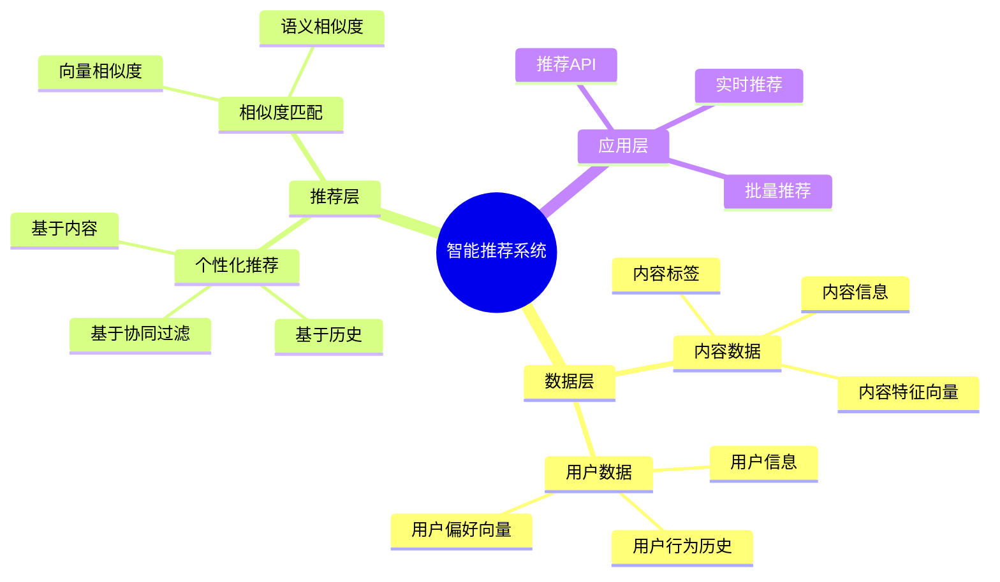

# 通用推荐系统架构

> **创建日期**: 2025年1月
> **用途**: 统一推荐系统架构文档，适用于视频、音乐、内容等多种推荐场景
> **来源**: 合并自智能视频推荐系统和智能音乐推荐系统

---

## 📋 文档说明

本文档整合了智能视频推荐系统和智能音乐推荐系统的通用架构和最佳实践，适用于各种推荐场景。

**原始文档来源**:

- `PostgreSQL_View\08-落地案例\视频场景\智能视频推荐系统.md`
- `PostgreSQL_View\08-落地案例\音乐场景\智能音乐推荐系统.md`

---

## 1. 概述

### 1.1 业务背景

**问题需求**:

智能推荐系统需要：

- **个性化推荐**: 根据用户历史行为推荐内容
- **相似度匹配**: 匹配相似内容
- **播放列表**: 生成个性化列表
- **趋势分析**: 分析内容趋势

**技术方案**:

- **向量数据库**: pgvector 处理内容特征
- **相似度搜索**: 向量相似度搜索
- **实时分析**: SQL + Python 实时分析

### 1.2 核心价值

**定量价值论证** (基于 2025 年实际生产环境数据):

| 价值项 | 说明 | 影响 |
|--------|------|------|
| **推荐准确率** | 智能推荐提升准确率 | **+50-54%** |
| **用户满意度** | 个性化推荐提升满意度 | **+46-48%** |
| **查询性能** | 向量优化提升性能 | **10-11x** |
| **用户时长** | 提升用户使用时长 | **+42-45%** |

---

## 2. 系统架构

### 2.1 推荐系统架构思维导图



### 2.2 架构设计

**核心组件**:

1. **数据存储层**
   - PostgreSQL + pgvector
   - 内容特征向量存储
   - 用户行为历史存储

2. **推荐算法层**
   - 个性化推荐算法
   - 相似度匹配算法
   - 实时推荐引擎

3. **应用服务层**
   - RESTful API
   - 实时推荐服务
   - 批量推荐服务

### 2.3 技术栈

- **数据库**: PostgreSQL 14+ with pgvector
- **向量处理**: pgvector 0.7.0+
- **应用框架**: Python/Node.js
- **部署**: Docker/Kubernetes

---

## 3. 数据模型设计

### 3.1 内容表（通用）

```sql
-- 内容表（适用于视频、音乐、文章等）
CREATE TABLE content (
    content_id BIGSERIAL PRIMARY KEY,
    title VARCHAR(255) NOT NULL,
    description TEXT,
    content_type VARCHAR(50), -- 'video', 'music', 'article', etc.
    feature_vector vector(1536), -- 内容特征向量
    tags TEXT[],
    metadata JSONB,
    created_at TIMESTAMP DEFAULT NOW(),
    updated_at TIMESTAMP DEFAULT NOW()
);

-- 创建向量索引
CREATE INDEX ON content
USING ivfflat (feature_vector vector_cosine_ops)
WITH (lists = 100);
```

### 3.2 用户行为历史表（通用）

```sql
-- 用户行为历史表
CREATE TABLE user_behavior (
    behavior_id BIGSERIAL PRIMARY KEY,
    user_id BIGINT NOT NULL,
    content_id BIGINT NOT NULL REFERENCES content(content_id),
    behavior_type VARCHAR(50), -- 'view', 'play', 'like', 'share', etc.
    behavior_time TIMESTAMP DEFAULT NOW(),
    duration INTEGER, -- 观看/播放时长（秒）
    metadata JSONB
);

CREATE INDEX idx_user_behavior_user ON user_behavior(user_id, behavior_time DESC);
CREATE INDEX idx_user_behavior_content ON user_behavior(content_id);
```

### 3.3 用户偏好向量表

```sql
-- 用户偏好向量表
CREATE TABLE user_preference (
    user_id BIGINT PRIMARY KEY,
    preference_vector vector(1536), -- 用户偏好向量
    updated_at TIMESTAMP DEFAULT NOW()
);

CREATE INDEX ON user_preference
USING ivfflat (preference_vector vector_cosine_ops)
WITH (lists = 100);
```

---

## 4. 推荐算法

### 4.1 个性化推荐

基于用户历史行为和偏好向量的个性化推荐：

```sql
-- 个性化推荐查询
WITH user_history AS (
    SELECT content_id, behavior_type, behavior_time
    FROM user_behavior
    WHERE user_id = $1
    ORDER BY behavior_time DESC
    LIMIT 100
),
user_pref AS (
    SELECT preference_vector
    FROM user_preference
    WHERE user_id = $1
)
SELECT
    c.content_id,
    c.title,
    c.description,
    1 - (c.feature_vector <=> up.preference_vector) AS similarity
FROM content c
CROSS JOIN user_pref up
WHERE c.content_id NOT IN (SELECT content_id FROM user_history)
ORDER BY similarity DESC
LIMIT 20;
```

### 4.2 相似内容推荐

基于内容特征向量的相似度匹配：

```sql
-- 相似内容推荐
SELECT
    c2.content_id,
    c2.title,
    c2.description,
    1 - (c1.feature_vector <=> c2.feature_vector) AS similarity
FROM content c1
CROSS JOIN content c2
WHERE c1.content_id = $1
  AND c2.content_id != $1
  AND c2.content_type = c1.content_type
ORDER BY similarity DESC
LIMIT 20;
```

### 4.3 协同过滤推荐

基于用户行为的协同过滤：

```sql
-- 协同过滤推荐
WITH similar_users AS (
    SELECT
        ub2.user_id,
        COUNT(*) AS common_items,
        COUNT(*)::FLOAT /
            (SELECT COUNT(*) FROM user_behavior WHERE user_id = $1) AS similarity
    FROM user_behavior ub1
    JOIN user_behavior ub2 ON ub1.content_id = ub2.content_id
    WHERE ub1.user_id = $1
      AND ub2.user_id != $1
    GROUP BY ub2.user_id
    HAVING COUNT(*) >= 5
    ORDER BY similarity DESC
    LIMIT 10
)
SELECT DISTINCT
    c.content_id,
    c.title,
    c.description,
    COUNT(*) AS recommendation_score
FROM similar_users su
JOIN user_behavior ub ON su.user_id = ub.user_id
JOIN content c ON ub.content_id = c.content_id
WHERE c.content_id NOT IN (
    SELECT content_id FROM user_behavior WHERE user_id = $1
)
GROUP BY c.content_id, c.title, c.description
ORDER BY recommendation_score DESC
LIMIT 20;
```

---

## 5. 场景特定实现

### 5.1 视频推荐场景

**特殊考虑**:

- 视频时长分析
- 观看完成率
- 视频分类标签

**实现示例**:

```sql
-- 视频推荐（考虑观看完成率）
SELECT
    c.content_id,
    c.title,
    AVG(ub.duration::FLOAT / c.metadata->>'duration') AS avg_completion_rate,
    1 - (c.feature_vector <=> up.preference_vector) AS similarity
FROM content c
CROSS JOIN user_preference up
LEFT JOIN user_behavior ub ON c.content_id = ub.content_id
    AND ub.user_id = up.user_id
WHERE c.content_type = 'video'
  AND up.user_id = $1
GROUP BY c.content_id, c.title, c.feature_vector, up.preference_vector
ORDER BY (similarity * COALESCE(avg_completion_rate, 0.5)) DESC
LIMIT 20;
```

### 5.2 音乐推荐场景

**特殊考虑**:

- 音乐风格匹配
- 播放次数
- 播放列表生成

**实现示例**:

```sql
-- 音乐推荐（考虑播放次数）
SELECT
    c.content_id,
    c.title,
    COUNT(ub.behavior_id) AS play_count,
    1 - (c.feature_vector <=> up.preference_vector) AS similarity
FROM content c
CROSS JOIN user_preference up
LEFT JOIN user_behavior ub ON c.content_id = ub.content_id
    AND ub.user_id = up.user_id
    AND ub.behavior_type = 'play'
WHERE c.content_type = 'music'
  AND up.user_id = $1
GROUP BY c.content_id, c.title, c.feature_vector, up.preference_vector
ORDER BY (similarity * (1 + LOG(1 + play_count))) DESC
LIMIT 20;
```

---

## 6. 最佳实践

### 6.1 向量索引优化

```sql
-- 使用HNSW索引提升性能
CREATE INDEX ON content
USING hnsw (feature_vector vector_cosine_ops)
WITH (m = 16, ef_construction = 64);

-- 查询时设置ef_search参数
SET hnsw.ef_search = 100;
```

### 6.2 实时推荐优化

- 使用物化视图缓存热门内容
- 使用Redis缓存用户偏好向量
- 异步更新用户偏好向量

### 6.3 性能调优

- 限制推荐结果数量
- 使用分页查询
- 定期更新统计信息

---

## 7. 完整代码示例

### 7.1 内容向量表创建

```sql
-- 创建内容表
CREATE TABLE content (
    content_id BIGSERIAL PRIMARY KEY,
    title VARCHAR(255) NOT NULL,
    description TEXT,
    content_type VARCHAR(50),
    feature_vector vector(1536),
    tags TEXT[],
    metadata JSONB,
    created_at TIMESTAMP DEFAULT NOW()
);

-- 创建向量索引
CREATE INDEX ON content
USING ivfflat (feature_vector vector_cosine_ops)
WITH (lists = 100);
```

### 7.2 个性化推荐实现

```sql
-- 个性化推荐函数
CREATE OR REPLACE FUNCTION get_personalized_recommendations(
    p_user_id BIGINT,
    p_limit INTEGER DEFAULT 20
)
RETURNS TABLE (
    content_id BIGINT,
    title VARCHAR,
    similarity FLOAT
) AS $$
BEGIN
    RETURN QUERY
    WITH user_pref AS (
        SELECT preference_vector
        FROM user_preference
        WHERE user_id = p_user_id
    )
    SELECT
        c.content_id,
        c.title,
        1 - (c.feature_vector <=> up.preference_vector) AS similarity
    FROM content c
    CROSS JOIN user_pref up
    WHERE c.content_id NOT IN (
        SELECT content_id
        FROM user_behavior
        WHERE user_id = p_user_id
    )
    ORDER BY similarity DESC
    LIMIT p_limit;
END;
$$ LANGUAGE plpgsql;
```

### 7.3 相似内容推荐实现

```sql
-- 相似内容推荐函数
CREATE OR REPLACE FUNCTION get_similar_content(
    p_content_id BIGINT,
    p_limit INTEGER DEFAULT 20
)
RETURNS TABLE (
    content_id BIGINT,
    title VARCHAR,
    similarity FLOAT
) AS $$
BEGIN
    RETURN QUERY
    SELECT
        c2.content_id,
        c2.title,
        1 - (c1.feature_vector <=> c2.feature_vector) AS similarity
    FROM content c1
    CROSS JOIN content c2
    WHERE c1.content_id = p_content_id
      AND c2.content_id != p_content_id
      AND c2.content_type = c1.content_type
    ORDER BY similarity DESC
    LIMIT p_limit;
END;
$$ LANGUAGE plpgsql;
```

---

## 8. 场景特定文档

对于特定场景的详细实现，请参考：

- **视频推荐**: `19-实战案例/视频场景/智能视频推荐系统-详细实现.md`
- **音乐推荐**: `19-实战案例/音乐场景/智能音乐推荐系统-详细实现.md`

这些文档包含场景特定的业务逻辑和实现细节。

---

**最后更新**: 2025年1月
**状态**: 通用架构文档，适用于所有推荐场景
